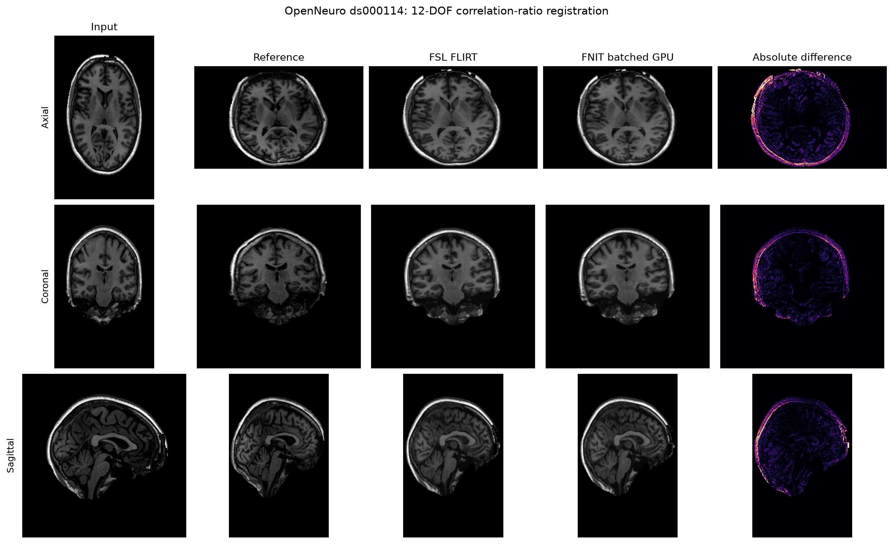

# TorchFLIRT：线性配准

[返回首页](../../README.md) · [源码](../../src/fnit/flirt/) · [10 例 CPU 报告](../../validation/flirt/report.cpu.current.json) · [4 例 H100 配对报告](../../validation/flirt/report.public.json) · [公开示例报告](../../validation/flirt/public_example.current.json)

`TorchFLIRT` 在 FNIT 内实现单被试线性配准和已知线性变换的重采样。候选程序只依赖 PyTorch、NumPy 和 nibabel，运行时不调用 FSL。FSL 6.0.7.4 只用于本页的对照测试。

当前公开接口支持两组参数：

- `dof=12, cost="corratio"`：12 自由度仿射配准，对应 FSL `flirt -dof 12 -cost corratio`；
- `dof=6, cost="normmi"`：6 自由度刚体配准，对应 FSL `flirt -dof 6 -cost normmi`。
- `applyxfm=True`：直接应用已知 `.mat`，或根据两张图的 qform/sform 对齐同一世界空间；不执行配准优化。

实现包含 FSL scaled-mm 坐标、8/4/2/1 mm 多层搜索、Brent 坐标优化、correlation ratio、normalized mutual information 和默认三线性输出路径。CUDA 使用 float32，默认启用 TF32；没有使用 float16 或 bfloat16。

## 输入

| Python 参数 | 命令行参数 | 类型 | 含义与要求 |
|---|---|---|---|
| `input` | `-in` | NIfTI 路径或单帧 `nibabel` 空间影像 | moving 图像。必须是有限值的 3D 图像；4D 图像仅允许末维长度为 1。 |
| `reference` | `-ref` | NIfTI 路径或单帧 `nibabel` 空间影像 | fixed 图像。它的 shape、affine 和 header 空间信息决定输出网格。 |
| `output` | `-out` | 可选路径 | 重采样图像的保存位置。`output` 与 `omat` 至少给出一个。 |
| `omat` | `-omat` | 可选路径 | input→reference 的 4×4 FSL scaled-mm 矩阵。 |
| `init` | `-init` | 可选 `.mat` 路径或 4×4 数组 | 配准模式下是优化初值；`applyxfm=True` 时是直接应用的 input→reference FSL scaled-mm 矩阵。 |
| `applyxfm` | `-applyxfm` | 布尔值 | 应用现成变换并在 reference 网格上重采样，不重新估计矩阵；默认 `False`。 |
| `usesqform` | `-usesqform` | 布尔值 | 仅用于 `applyxfm=True`：按两图 qform/sform 的共同世界坐标对齐；默认 `False`，且不能同时提供 `init`。两图均须有有效 qform 或 sform。 |
| `inweight` | `-inweight` | 可选 3D NIfTI | input 网格上的连续体素权重；shape 和 affine 必须与 input 相同。 |
| `refweight` | `-refweight` | 可选 3D NIfTI | reference 网格上的连续体素权重；shape 和 affine 必须与 reference 相同。 |
| `dof` | `-dof` | `6` 或 `12` | 变换自由度。当前只接受 `12/corratio` 和 `6/normmi` 两种组合。 |
| `cost` | `-cost` | `corratio` 或 `normmi` | 优化代价函数，必须与 `dof` 使用上述组合。 |
| `device` | `--device` | PyTorch 设备字符串 | 例如 `"cuda:0"` 或 `"cpu"`；省略时有 CUDA 则使用 CUDA。 |
| `overwrite` | `--overwrite` | 布尔值 | 是否替换已有输出。默认保护已有文件。 |

## Python 单被试调用

```python
from fnit.flirt import run_flirt

result = run_flirt(
    input="subject_GM.nii.gz",  # moving 3D 图像，对应 FSL -in
    reference="template_GM.nii.gz",  # fixed 图像和输出网格，对应 FSL -ref
    output="subject_GM_to_template.nii.gz",  # reference 网格上的重采样图像
    omat="subject_GM_to_template.mat",  # input→reference 的 FSL scaled-mm 4×4 矩阵
    init=None,  # 可选初始矩阵；None 表示使用默认初始化和角度搜索
    inweight=None,  # 可选 input 网格连续权重图
    refweight=None,  # 可选 reference 网格连续权重图
    dof=12,  # 12 自由度仿射模型
    cost="corratio",  # FSL correlation-ratio 代价函数
    device="cuda:0",  # CUDA float32，默认允许 TF32；也可写 "cpu"
    overwrite=False,  # False 时不覆盖已有文件
)
```

`run_flirt()` 返回 `FLIRTResult`。只需要内存结果时，也可直接调用模型：

```python
from fnit.flirt import TorchFLIRT

model = TorchFLIRT(
    device="cuda:0",  # 计算设备
    angular_search=True,  # 执行默认角度搜索
    dof=12,  # 12 自由度仿射模型
    cost="corratio",  # correlation-ratio 代价函数
)
result = model(
    moving="subject_GM.nii.gz",  # moving 图像路径或 nibabel 空间影像
    fixed="template_GM.nii.gz",  # fixed 图像路径或 nibabel 空间影像
    init=None,  # 可选 FSL scaled-mm 初始矩阵
    inweight=None,  # 可选 moving 权重图
    refweight=None,  # 可选 fixed 权重图
)
```

## 返回值与磁盘输出

`FLIRTResult` 包含：

| 字段 | 类型 | 含义 |
|---|---|---|
| `moved` | `FNITNifti1Image`，是 `nibabel.Nifti1Image` 的子类 | input 在 reference 网格上的图像；配准模式为 float32，`applyxfm` 保留 input 的存盘数据类型。 |
| `matrix` / `fsl_matrix` | NumPy `(4, 4)` 数组 | input→reference 的 FSL scaled-mm 矩阵。 |
| `moving_to_fixed_world` | NumPy `(4, 4)` 数组 | input world-RAS→reference world-RAS 的正向矩阵。 |
| `fixed_to_moving_world` | NumPy `(4, 4)` 数组 | 重采样使用的 reference world-RAS→input world-RAS pull 矩阵。 |
| `qc` | 字典 | 设备、TF32 状态、代价函数、搜索层级、评价次数和坐标方向。运行时 QC 不把仓库基准解释为当前输入已与 FSL 比较。 |

写盘后的结构为：

```text
subject_GM_to_template.nii.gz  # -out；reference 的 shape 和 affine；配准模式为 float32
subject_GM_to_template.mat     # -omat；4 行×4 列文本矩阵，input→reference
```

输出先写入同目录临时文件，全部成功后再原子移动到目标位置。没有 `--overwrite` 时，已有文件会使调用停止。

## 命令行调用

独立入口：

```bash
fnit-flirt \
  -in subject_GM.nii.gz \
  -ref template_GM.nii.gz \
  -out subject_GM_to_template.nii.gz \
  -omat subject_GM_to_template.mat \
  -dof 12 \
  -cost corratio \
  --device cuda:0
```

统一入口写法相同：

```bash
fnit flirt \
  -in subject_GM.nii.gz \
  -ref template_GM.nii.gz \
  -out subject_GM_to_template.nii.gz \
  -omat subject_GM_to_template.mat \
  -dof 12 \
  -cost corratio \
  --device cuda:0
```

这两条命令把 `subject_GM.nii.gz` 仿射配准到 `template_GM.nii.gz`，把重采样图像写入 `-out`，并把 input→reference 的 FSL scaled-mm 矩阵写入 `-omat`。`--device cuda:0` 选择第一块可见 GPU；需要 CPU 时改为 `--device cpu`。

对应的 FSL 命令是：

```bash
flirt \
  -in subject_GM.nii.gz \
  -ref template_GM.nii.gz \
  -out subject_GM_to_template.nii.gz \
  -omat subject_GM_to_template.mat \
  -dof 12 \
  -cost corratio
```

两套命令的 `-in`、`-ref`、`-out`、`-omat`、`-init`、`-inweight`、`-refweight`、`-dof` 和 `-cost` 含义一致。FNIT 另外提供 `--device` 和 `--overwrite`。当前接口不接受 FSL 的其他 cost、DOF、schedule、搜索范围和插值选项。

去脑 b0 到去脑 T1 的刚性配准改用 6 自由度与归一化互信息：

```bash
fnit-flirt -in b0_brain.nii.gz -ref T1_brain.nii.gz \
  -out b0_in_T1.nii.gz -omat b0_to_T1.mat \
  -dof 6 -cost normmi --device cuda:0
```

这里 `-in` 是去脑 b0，`-ref` 是去脑 T1；`-out` 写 T1 网格上的 b0，`-omat` 写 b0→T1 矩阵。对应的原软件指令是 `flirt -in b0_brain.nii.gz -ref T1_brain.nii.gz -out b0_in_T1.nii.gz -omat b0_to_T1.mat -dof 6 -cost normmi`。真实数据对照见下文。

## 已知线性变换：MNI152 分辨率转换

同一 MNI152 世界空间的 1 mm 与 2 mm 模板转换，使用 `applyxfm=True, usesqform=True`。`reference` 决定输出的体素大小、形状、视野和 affine；这一步不寻找新的配准。输入目前须为有限值的单帧 3D NIfTI，使用 FSL FLIRT 默认的三线性插值及下采样前平滑。标签图所需的最近邻路径尚未实现。

```python
from fnit.flirt import run_flirt

mni_1mm = "/absolute/path/MNI152_T1_1mm.nii.gz"  # 输入：原始 MNI152 T1 1 mm 强度图
mni_2mm = "/absolute/path/MNI152_T1_2mm.nii.gz"  # reference：MNI152 2 mm 输出网格
resampled_t1 = "/absolute/path/MNI152_T1_1mm_on_2mm.nii.gz"  # 输出：2 mm 网格上的输入强度
world_alignment = "/absolute/path/MNI152_1mm_to_2mm.mat"  # 输出：input→reference 的 FSL scaled-mm 矩阵
result = run_flirt(
    input=mni_1mm,  # moving 3D NIfTI
    reference=mni_2mm,  # 决定输出网格，不从此图复制强度
    output=resampled_t1,  # 保存三线性重采样图
    omat=world_alignment,  # 保存实际使用的 4×4 FSL 矩阵
    applyxfm=True,  # 只应用变换，不执行配准搜索
    usesqform=True,  # 使两图的 NIfTI 世界坐标重合
    device="cuda:0",  # PyTorch 设备；CPU 可写 "cpu"
    overwrite=False,  # 保护已存在的结果
)
```

同一计算也可直接取得内存结果：`TorchFLIRT(device="cuda:0").applyxfm(mni_1mm, mni_2mm, usesqform=True)`。如果已有由 FLIRT 产生的 input→reference `.mat`，把上面 `usesqform=True` 改为 `init="/absolute/path/input_to_reference.mat"`，保留 `applyxfm=True`；这时直接应用该矩阵。`init` 和 `usesqform` 必须二选一。`-inweight`、`-refweight`、非默认 `-dof/-cost` 只用于配准，不用于 `applyxfm`。

FNIT 命令行与对应原软件命令：

```bash
fnit-flirt -in /absolute/path/MNI152_T1_1mm.nii.gz \
  -ref /absolute/path/MNI152_T1_2mm.nii.gz \
  -applyxfm -usesqform -out /absolute/path/MNI152_T1_1mm_on_2mm.nii.gz \
  -omat /absolute/path/MNI152_1mm_to_2mm.mat --device cuda:0

flirt -in /absolute/path/MNI152_T1_1mm.nii.gz \
  -ref /absolute/path/MNI152_T1_2mm.nii.gz \
  -applyxfm -usesqform -out /absolute/path/fsl_MNI152_T1_1mm_on_2mm.nii.gz
```

对于已有 `.mat`，两者均改用 `-applyxfm -init /absolute/path/input_to_reference.mat`。FSL [FLIRT User Guide](https://fsl.fmrib.ox.ac.uk/fsl/docs/registration/flirt/user_guide.html) 与 [FAQ 的分辨率转换示例](https://fsl.fmrib.ox.ac.uk/fsl/docs/registration/flirt/faq.html) 说明了这两种调用。输出 `.mat` 为 FSL scaled-mm 坐标；虽然 `usesqform` 对应世界空间恒等映射，它的 `.mat` 通常不等于单位矩阵。

本仓库提供官方 FLIRT 直接从上述两张 FSL 原始模板导出的 [1→2 mm 矩阵](../../src/fnit/flirt/assets/FSL_MNI152_T1_1mm_to_2mm.mat)（仅去掉每行末尾空格；44 bytes，SHA-256 `402bef1e8114fd895cd8261fd73fc9e565609f02d90d053de7c52c82535d4d2a`）。对应的输入模板 SHA-256 为 `d1f03e160c2548592a01d98d44d7e0ffa8a8ef58bc9b07d26369e214ba170edb`，reference 模板为 `0585cd056bf5ccfb8bf97a5f6a66082d4e7caad525718fc11e40d80a827fcb92`。矩阵恰好是单位矩阵，因为这对模板的 FSL scaled-mm 坐标一致；其他来源的 MNI152 图像必须检查 affine 和视野，不能直接沿用。模板影像本身不随 FNIT 分发。

下载矩阵文件后，也可以运行：

```bash
fnit-flirt -in /absolute/path/MNI152_T1_1mm.nii.gz \
  -ref /absolute/path/MNI152_T1_2mm.nii.gz -applyxfm \
  -init /absolute/path/FSL_MNI152_T1_1mm_to_2mm.mat \
  -out /absolute/path/MNI152_T1_1mm_on_2mm.nii.gz
```

## `.mat` 坐标约定

FSL `.mat` 不是 NIfTI world-RAS affine。设 input 和 reference 的 voxel-to-world 矩阵为 `W_in`、`W_ref`，对应的 FSL scaled-mm 基为 `S_in`、`S_ref`，FLIRT 矩阵为 `A`，则 world-RAS 正向变换为：

```text
W_ref @ inverse(S_ref) @ A @ S_in @ inverse(W_in)
```

FSL 在 voxel-to-world 线性部分行列式为正时翻转 scaled-mm 第一轴。FNIT 的 `.mat` 读写和 world-RAS 转换使用同一规则。不能把该矩阵直接当作 FreeSurfer LTA 或 NIfTI affine。

## 真实数据测量

**MNI152 模板 1 mm↔2 mm 的 `applyxfm -usesqform`。** 以 FSL 发布的原始 MNI152_T1 1 mm、2 mm 图像为双向输入及 reference，FNIT 与官方 FLIRT 各自从新进程读图、重采样并写出 gzip NIfTI。两边输出的 shape 和 affine 均等于 reference。源码哈希、模板 SHA-256、逐方向矩阵和完整指标见 [CPU 实测报告](../../validation/flirt/applyxfm_mni.cpu.json)、[H100 实测报告](../../validation/flirt/applyxfm_mni.gpu.json)；[重测脚本](../../validation/flirt/benchmark_applyxfm.py)不在 FNIT 运行时调用。

| 方向 | 输出尺寸 | 全体素 Pearson r | 全体素 MAE；最大绝对差 | FSL CPU / FNIT CPU 完整命令耗时 |
|---|---:|---:|---:|---:|
| 1→2 mm | 91×109×91 | 0.99999999997 | 0.000450；1 | 1.22 / 3.06 秒 |
| 2→1 mm | 182×218×182 | 1.0 | 0；0 | 1.36 / 3.58 秒 |

官方 FSL 安装在这台服务器上对两次命令都返回状态码 255；脚本每次先删旧文件，只在新输出存在、gzip 可读且尺寸与 affine 合法时才计算指标。FSL `-version` 也返回 255，因此这里把退出状态保留在报告中，而不将其解释为图像计算失败。时间是当次共享节点的观察值，包含进程启动和文件读写。

H100 的两方向精度与上表 CPU 完全相同，FNIT 完整命令分别用时 5.34 和 4.61 秒。测试时两块 H100 的已用显存约 69 GiB、利用率 100%；这些耗时不用于推断 GPU 加速比。

修订依据 FSL FLIRT 2111.2 源码：角度样本与 8 mm 搜索代价插值按原实现的 float32 运算；候选姿态的自由优化使用 `min(dof, 7)`。旧版始终优化 7 个参数，使 `-dof 6` 的候选姿态含额外缩放。修订没有改变 `.mat` 的 scaled-mm 坐标定义或输出网格。

**6-DOF/normmi，真实 UKB 去脑 b0→T1。** 相同输入、相同 FSL 官方矩阵，在 b0 视野 13³ 个点计算两份矩阵的世界坐标位移差；重采样图比较非零体素交集。完整指标和源码 SHA-256 见[刚性配准报告](../../validation/connectome/original_ukb_flirt.public.json)。

| 指标 | 修订前 FNIT GPU | 修订后 FNIT CPU | 修订后 FNIT H100 TF32 |
|---|---:|---:|---:|
| 相对 FSL 矩阵位移 RMS | 0.195330 mm | 0.009932 mm | 0.009983 mm |
| moved Pearson | 0.999512 | 0.9999993 | 0.9999724 |
| moved Dice | 0.997655 | 0.999892 | 0.999557 |
| moved MAE，原始强度 | 75.967 | 2.903 | 17.411 |

FSL 完整 CPU 命令用时 10.02 秒；FNIT CPU 已载入图像后的求解与重采样调用为 45.26 秒，不含写盘。修订后的 H100 调用为 337.75 秒，当时 GPU 被其他作业持续占满，不计算加速比。这是一例跨模态病例，不代表所有 b0→T1 图像均达到 0.01 mm。

**12-DOF/corratio，真实 GM→UKB group GM。** 10 例真实 T1w 的 GM PVE 用同一模板，FSL 官方矩阵另经 `flirt -applyxfm` 生成直接重采样参考图；在 `template_GM > 0` 的 258,990 个体素比较。修订后的 [CPU 10 例报告](../../validation/flirt/report.cpu.current.json)和 [H100 4 例报告](../../validation/flirt/report.gpu.current.json)保留各自测量源码 SHA-256。最终源码进一步限制 6-DOF 候选自由度，对 12-DOF 仍使用 7 自由度；同一真实 GM 病例的最终 `.mat` 与 10 例测量源码的 `.mat` 逐元素一致，见[源码范围核对](../../validation/runtime_dependencies/flirt_profile_source_equivalence.public.json)。

| 指标 | FNIT CPU，10 例 | FNIT H100 TF32，前 4 例 |
|---|---:|---:|
| 相对 FSL 矩阵 RMS 中位数；最大值 | 0.019811；0.078530 mm | 0.007118；0.021722 mm |
| `rmsdiff <= 0.05 mm` | 9/10 | 4/4 |
| moved Pearson 中位数；最小值 | 0.999985；0.999835 | 0.999806；0.999597 |
| moved Dice@0.2 中位数 | 0.999160 | 0.996611 |
| moved MAE 中位数 | 0.001056 | 0.004244 |

CPU 的第 10 例超过 0.05 mm；GPU 只完成 4 例，不能推断 10/10。12-DOF 精度没有因本次 float32 搜索修订而整体改善，也不满足逐矩阵数值等价。GPU 峰值 PyTorch allocated memory 为 438,002,176 bytes（约 0.41 GiB）。

| 完整命令时间 | FSL CPU，10 例参考 | FNIT CPU，10 例 | FNIT H100，4 例 |
|---|---:|---:|---:|
| 中位数 | 27.70 秒 | 170.21 秒 | 406.86 秒 |

时间包含进程启动、读图、优化、重采样和写盘。FSL 参考来自较早的独立运行；本次 CPU/GPU 测量时节点有其他作业，H100 也处于满载。表中只记录观察值，不计算稳定加速比。

## 公开 OpenNeuro 示例

下图使用仓库内 OpenNeuro ds000114 v1.0.2 的 CC0 去面部派生数据：sub-02 T1w 为 input，sub-01 T1w 为 reference。两者分别运行 FSL FLIRT 6.0.7.4 和最终 FNIT 源码的 12-DOF/corratio。图中 FSL 与 FNIT 使用相同显示范围，差值图单独缩放。



该公开 T1w→T1w 示例的 moved Pearson 为 0.995960，normalized RMSE 为 0.018641，矩阵 RMS 差为 0.196555 mm；FNIT CPU 本次用时 279.05 秒，FSL CPU 参考运行用时 40.41 秒。两次运行相隔且使用共享节点，时间不构成硬件加速比。它用于复现图示和检查一般 T1w 输入，不属于上面的 GM 门限数据集。输入来源、文件 hash、命令、源码 hash 和完整指标见[公开示例报告](../../validation/flirt/public_example.current.json)。

## 结果解释

当前实现已经对齐 FSL 的输入/输出文件结构、输出网格、矩阵方向和 scaled-mm 坐标合同。数值优化仍会在个别病例落到与 FSL 不同的局部解。需要与既有 FSL 结果逐矩阵复现的研究，应先按自己的图像类型建立同输入验证集，再决定是否采用当前误差范围。

该移植依据 FSL 源码，受非商业 [FSL Software Licence](../../licenses/FSL-6.0.txt) 约束。第三方说明见 [THIRD_PARTY_NOTICES.md](../../THIRD_PARTY_NOTICES.md)。

## 参考文献与原实现

- 参考文献：Jenkinson et al., *Improved Optimization for the Robust and Accurate Linear Registration and Motion Correction of Brain Images*, NeuroImage (2002), [doi:10.1006/nimg.2002.1132](https://doi.org/10.1006/nimg.2002.1132)。
- 原实现代码库：[FSL `flirt`](https://git.fmrib.ox.ac.uk/fsl/flirt)。
