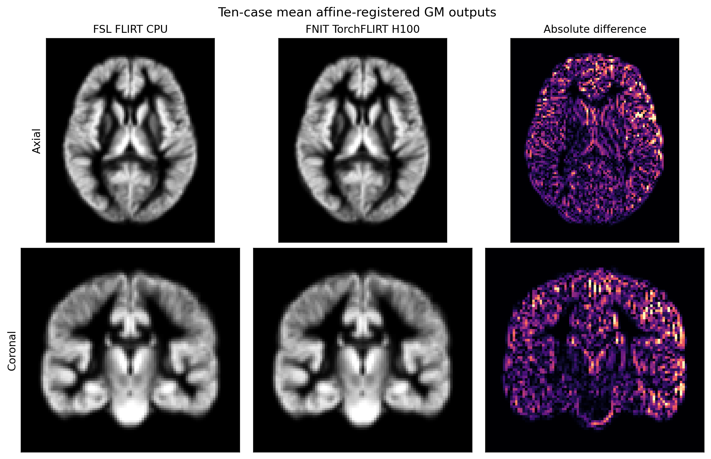

# PyTorch FLIRT：线性配准

`fnit.flirt` 实现两种 FSL FLIRT 参数组合：12 自由度、相关比代价函数（`-dof 12 -cost corratio`）；6 自由度、归一化互信息（`-dof 6 -cost normmi`）。配准计算使用 PyTorch，路径图像读取使用 NiBabel，返回图像使用仓库内 `Volume`。运行时不导入 Surfa，也不调用 FSL。可用 CPU 或 CUDA；CUDA 默认开启 TF32，不使用 float16 或 bfloat16。代码及衍生源码遵循 [FSL Software Licence](../../licenses/FSL-6.0.txt)，另见[第三方声明](../../THIRD_PARTY_NOTICES.md)。

## 输入和输出

| 参数或结果 | 含义 |
|---|---|
| `input` / `-in` | 待移动的单帧三维图像，路径或带 `.data`、`.geom`、`.new` 的内存体。路径支持 NiBabel 可读的 NIfTI、MGH/MGZ。 |
| `reference` / `-ref` | 固定的单帧三维参考图像；其尺寸与空间仿射定义重采样输出网格。 |
| `output` / `-out` | 可选输出图像路径。图像位于参考网格；省略扩展名时由 `FSLOUTPUTTYPE=NIFTI` 或 `NIFTI_GZ` 决定。 |
| `omat` / `-omat` | 可选 4×4 文本矩阵路径，表示输入到参考图像的 FSL scaled-mm 坐标变换。 |
| `init` / `-init` | 可选初始 4×4 FSL scaled-mm 矩阵或文件；缺省使用单位矩阵。 |
| `inweight` / `-inweight` | 可选输入图像网格上的逐体素配准权重；仅 12 自由度模式支持。 |
| `refweight` / `-refweight` | 可选参考图像网格上的逐体素配准权重；仅 12 自由度模式支持。 |
| `dof` / `-dof` | 自由度：`12` 或 `6`，分别搭配 `corratio` 或 `normmi`。 |
| `cost` / `-cost` | 对应的代价函数。 |
| `device` / `--device` | `cpu`、`cuda` 或 `cuda:0` 等；缺省时 CUDA 可用则选 CUDA。 |
| `overwrite` / `--overwrite` | 是否覆盖已有输出；默认不覆盖。 |

至少指定 `output` 或 `omat` 之一。输出图像和矩阵不能使用相同路径，也不能覆盖输入、参考图像或初始矩阵。权重图像必须与各自配对的图像具有相同尺寸和体素到世界仿射。其他自由度、代价函数、搜索范围和插值模式尚不在公开接口内。

`run_flirt` 返回 `FLIRTResult`：

| 属性 | 内容 |
|---|---|
| `moved` | 仓库内 `fnit.synthstrip.geometry.Volume`，包含参考网格上的重采样图像；支持 `.data`、`.geom.vox2world.matrix`、`.geom.voxsize` 和 `.save(path)`。直接模型调用且输入为旧版 Surfa 内存体时，结果体沿用输入体的 `.new()` 类型。 |
| `matrix` / `fsl_matrix` | NumPy 4×4 输入到参考图像的 FSL scaled-mm 矩阵，内容与 `omat` 相同。 |
| `moving_to_fixed_world` | NumPy 4×4 输入到参考图像的 world-RAS 正向仿射。 |
| `fixed_to_moving_world` | NumPy 4×4 world-RAS 反向仿射，用于重采样。 |
| `qc` | 代价、优化次数、计算设备、TF32 状态、参考基准状态等记录。参考测试通过不表示当前输入已经与 FSL 比较。 |

### 命令行

```bash
fnit-flirt \
  -in input_T1.nii.gz \
  -ref reference_T1.nii.gz \
  -out registered_T1.nii.gz \
  -omat input_to_reference.mat \
  -dof 12 \
  -cost corratio \
  --device cuda:0
```

`fnit flirt` 接受相同参数。示例中 `-in` 是待移动图像，`-ref` 是固定参考图像，`-out` 是重采样图像，`-omat` 是 FSL 坐标矩阵；`-dof` 和 `-cost` 共同选定算法，`--device` 指定运行设备。

官方 FSL 对应命令：

```bash
flirt \
  -in input_T1.nii.gz \
  -ref reference_T1.nii.gz \
  -out registered_T1.nii.gz \
  -omat input_to_reference.mat \
  -dof 12 \
  -cost corratio
```

6 自由度模式将两条命令的 `-dof` 改成 `6`，`-cost` 改成 `normmi`。FSL 程序仅用于对照测试。

### Python 文件接口

```python
from fnit.flirt import run_flirt

result = run_flirt(
    input="input_T1.nii.gz",                   # 待移动的三维图像
    reference="reference_T1.nii.gz",         # 定义输出网格的固定图像
    output="registered_T1.nii.gz",           # 重采样图像输出文件
    omat="input_to_reference.mat",           # FSL scaled-mm 矩阵输出文件
    init=None,                                # 初始 FSL 矩阵；None 为单位矩阵
    inweight=None,                            # 输入图像上的逐体素权重
    refweight=None,                           # 参考图像上的逐体素权重
    dof=12,                                   # 12 自由度仿射配准
    cost="corratio",                          # 相关比代价函数
    device="cuda:0",                          # PyTorch 运行设备
    overwrite=False,                          # 禁止覆盖已有输出
)
# result.moved.data：参考网格上的图像；result.matrix：FSL 4×4 矩阵。
```

### Python 内存接口

```python
from fnit.flirt import TorchFLIRT
from fnit.synthstrip.geometry import load_volume

moving = load_volume("input_T1.nii.gz")             # 待移动图像及空间几何
fixed = load_volume("reference_T1.nii.gz")          # 固定参考图像及输出网格
model = TorchFLIRT(
    device="cuda:0",                              # PyTorch 运行设备
    angular_search=True,                          # 执行默认角度搜索
    dof=12,                                       # 自由度
    cost="corratio",                              # 代价函数
)
result = model(
    moving=moving,                                # 路径或内存图像
    fixed=fixed,                                  # 路径或内存图像
    init=None,                                    # 初始 FSL scaled-mm 矩阵
    inweight=None,                                # 输入权重图像
    refweight=None,                               # 参考权重图像
)
# 内存调用不写文件；按需执行 result.save(output="registered_T1.nii.gz", omat="input_to_reference.mat")。
```

旧版 Surfa `Volume` 可作为内存输入，因为只读取 `.data`、`.geom.vox2world.matrix`、`.geom.voxsize` 并调用 `.new()`；该兼容性不触发包内 Surfa 导入。新项目建议用 `load_volume`。

## 坐标约定

`.mat` 不等于 NIfTI 的 world-RAS 仿射。设输入和参考的体素到世界矩阵分别为 `W_in`、`W_ref`，FSL scaled-mm 基为 `S_in`、`S_ref`，文件矩阵为 `A`，则 world-RAS 正向仿射为：

```text
W_ref @ inverse(S_ref) @ A @ S_in @ inverse(W_in)
```

FSL scaled-mm 基使用体素大小；当体素到世界矩阵行列式为正时，翻转第一轴。不要直接把 `.mat` 当作 FreeSurfer LTA 或 world-RAS 矩阵。

## 当前同输入验证：移除 Surfa（2026-09-28）

使用一例真实 T1 的 2 mm 降采样图像（128³；只抽取原始体素，没有模拟图像），固定图像为 FSL MNI152 T1 2 mm 模板（91×109×91）。同一 Conda 环境、CPU、8 个 PyTorch 线程，各配置旧版和新版各运行一次。两组配对均得到逐值相同的 4×4 矩阵、重采样体素、仿射与体素大小；`.mat` 和 `.nii.gz` 文件 SHA256 也完全相同。

| 配置 | 旧版 API 墙钟时间 | 新版 API 墙钟时间 | 两版差异 |
|---|---:|---:|---|
| 6 DOF / normmi | 33.82 s | 28.30 s | 矩阵、图像和保存文件完全相同 |
| 12 DOF / corratio | 52.61 s | 61.04 s | 矩阵、图像和保存文件完全相同 |

单次共享节点计时不能用作提速结论。禁用 Surfa 导入后，`fnit flirt` 的同输入 6 DOF 命令也完成，文件与旧版完全相同；相关测试 `20 passed, 1 skipped`。GPU1 初始化时 CUDA 报 OOM，因此这次迁移没有获得 GPU 新旧配对计时。

同一输入运行 FSL 6.0.7.4 `flirt`，6 DOF 耗时 24.75 s，12 DOF 耗时 12.17 s。与新版 FNIT 相比，矩阵在输入网格 5×5×5 点的 world-RAS 位移 RMS 分别为 **0.4065 mm**、**1.0658 mm**；重采样图像 Pearson 分别为 **0.99608**、**0.99886**，MAE 分别为 **0.9934**、**0.8510** 原图强度单位。FSL 将该 uint8 输入的输出保存为 uint8，FNIT 保存为 float32；两者的输出仿射和尺寸一致。这些差异在旧版 FNIT 中也存在，此次迁移没有改变算法结果。原始命令、哈希和完整数值见[迁移报告](../../validation/flirt_no_surfa_20260928/README.md)。

## 历史验证范围

此前的 [10 例真实 GM 图对照](../../validation/flirt/report.public.json)由旧 Surfa 路径与 FSL 6.0.7.4 完成，尚未用新版逐例重跑，因此**不是本次迁移的新基准**。该记录中 12 DOF/corratio 的矩阵位移 RMS 中位数 0.008545 mm、最大 0.028999 mm，输出 Pearson 中位数 0.999895；官方 CPU 与本包 H100 完整命令时间中位数分别为 27.705 s 和 23.021 s。另有旧版[加权 FA 运行剖析](../../validation/flirt/runtime_profile.public.json)。当前个例差异大于旧 10 例范围，说明匹配精度随输入与配置变化；不能以历史门槛推断任意新图像等价。运行时 `qc["validated_fsl_equivalent"]` 保持 `False`。


