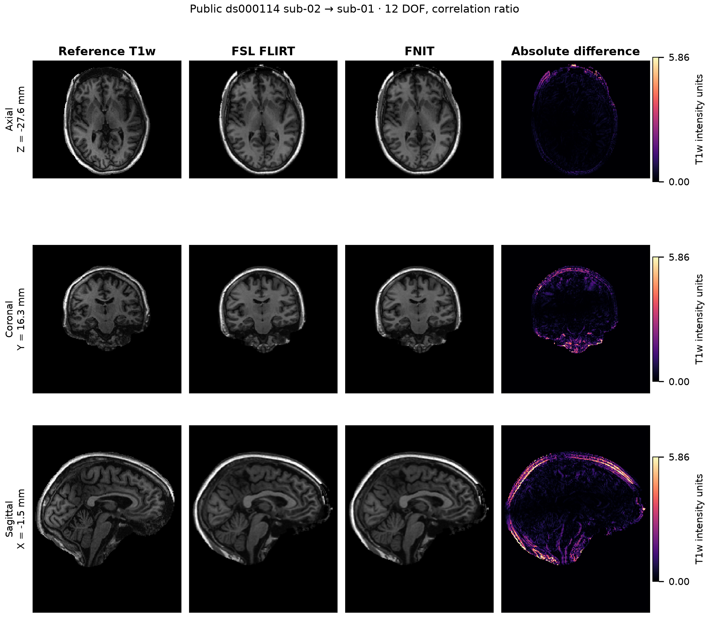

# TorchFLIRT：线性配准

[返回首页](../../README.md) · [源码](../../src/fnit/flirt/) · [本轮 CPU/GPU 验证](../../validation/multimodal_cpu_20261004/README.md) · [最新 H100 回归](../../validation/multimodal_cpu_20261004/gpu_flirt_v25_20261004.public.json) · [验证记录](../../validation/flirt/README.md)

`TorchFLIRT` 在 FNIT 内实现单被试线性配准和已知线性变换的重采样。运行时主要依赖 PyTorch、NumPy 和 nibabel，CPU 融合采样使用 Numba，CUDA 批量 NMI 使用 Triton；这些依赖已包含在主页 Conda 环境中，不调用 FSL。FSL 只用于离线对照；本轮 CPU 对照为 6.0.7.4，此前 GPU 对照为 6.0.7.22，各报告分别记录实际版本和程序 SHA-256。

2026-10-02 的公开 raw connectome 评测发现：直接读取官方 `recon-all` 的 `brain.mgz` 时，旧输出函数调用了 MGH 不存在的 NIfTI qform/sform 接口，配准求解完成后报错。现将 MGH 的 scanner RAS affine 写入输出 NIfTI 的 qform/sform（code 1），保留参考体素尺寸。搜索、代价函数、矩阵和重采样计算不变，原 NIfTI 头规则保留。下文 2026-10-04 的 CPU/GPU 配对使用 NIfTI 输入，MGH 兼容修复另按其数据范围记录。

当前公开接口支持以下模式：

- `dof=12, cost="corratio"`：12 自由度仿射配准，对应 FSL `flirt -dof 12 -cost corratio`；
- `dof=6, cost="normmi"`：6 自由度刚体配准，对应 FSL `flirt -dof 6 -cost normmi`。
- `applyxfm=True`：直接应用已知 `.mat`，或根据两张图的 qform/sform 对齐同一世界空间；不执行配准优化。

实现包含 FSL scaled-mm 坐标、8/4/2/1 mm 多层搜索、Brent 坐标优化、correlation ratio、normalized mutual information 和默认三线性输出路径。默认角度搜索遵循 FSL 的 `search 12`，包括 `dof=6` 的初始化；`dof` 决定后续优化和最终变换的自由度。

配准输出和 `applyxfm` 均固定使用三线性插值，并按官方默认在下采样前平滑。当前 Python 和命令行入口没有 `interp` 选项；官方的 nearest-neighbour、sinc、spline 尚未实现。CPU 功能对照中的已知矩阵与 `usesqform` 两项均测量完整输入的这一三线性路径。

图像与 cost 使用 float32，矩阵构造使用 double，NMI 直方图使用 float64 累加。CUDA 默认允许 TF32；候选 cost 的坐标与融合采样使用明确的 float32 运算，不使用 TF32 GEMM，并关闭 FMA。输出采样及 `applyxfm` 的坐标也按 float32 系数逐项计算，避免 TF32 矩阵乘法改变采样位置。没有使用 float16 或 bfloat16。与官方 FSL 的误差及测量范围见本页真实数据对照。

### CPU 执行

CPU 的 `auto` 和 `reference` 保留原来的串行候选顺序与 Brent 搜索。每个候选的坐标、三线性采样、边缘渐变权重和连续影像权重由 Numba 融合计算，逐步保留 float32 舍入，关闭 `fastmath`。correlation-ratio 按原来 x 优先的体素顺序逐箱累计 float32 counts、sums 和 sums2，保持稳定分箱缩减中每个箱的累加顺序；NMI 保持中心、左侧、右侧三遍 float64 直方图累加。后续箱级 cost 和 float32 熵计算使用原来的 PyTorch 代码。CPU 输出采样也使用同一组 float32 运算，图像预滤波、背景值、数据类型和空间头规则不变。

CPU 的显式 `batched` 对每个 affine 候选复用融合采样和保序分箱：correlation-ratio 直接生成 counts、sums、sums2；NMI 按原三遍顺序生成 float64 联合直方图。这样省去完整体素数组的重复排序和张量 scatter。后续批量箱级 pack、`compact_sum`、float32 cost 与熵公式、分块和搜索保留原实现；非有限或超范围 NMI 直方图使用原张量回退。完整公开影像的 12/corratio 和 6/normmi 分别检查 8,981 和 6,403 个候选，箱统计、pack 中间值、求和、批量 cost、最终矩阵、全部体素和搜索次数逐位一致，见[批量统计完整门槛](cpu_batched_statistics_exact_20261004.public.json)。此前的[采样完整门槛](cpu_batched_exact_20261004.public.json)另保留采样值与权重的检查。这里的批量是同一病例的 affine 候选；输入影像在一次完整配准中保持固定。

多线程 CPU 只并行互不依赖的采样行，将 values/weights 写回相同的 x 优先顺序后，仍按原顺序串行累计分箱；没有并行改变浮点求和顺序。采样线程数取 PyTorch CPU 预算与当前 Numba 线程上限的较小值；调用结束或报错时恢复原 Numba 线程 mask，不修改 PyTorch、BLAS 或 CUDA 全局设置。Python 调用前用 `torch.set_num_threads(1)` 设置单线程；CLI 启动前通过 `OMP_NUM_THREADS` 和 `MKL_NUM_THREADS` 设置 PyTorch 线程预算，`fnit-flirt` 本身没有 `--threads` 参数。

单线程 correlation-ratio 将八个独立体素的坐标、三线性采样和边缘渐变合并为 LLVM 向量指令；每个体素仍按原顺序执行 float32 乘加，关闭 FMA，之后按原顺序累计分箱。图像 stride 可以不连续。尾部不足八个体素、长度小于二的轴、非有限坐标或插值溢出时使用原标量计算。连续影像权重沿用相同的逐点乘法顺序；关闭边缘渐变和 NMI 保留各自原来的路径；多线程路径仍并行独立采样行。

图像金字塔准备中，有限 float32 CPU 图像的正比例等距重采样复用同一融合输出采样器，减少全图坐标张量和中间影像。单轴长度小于二、非有限输入、非正或非有限采样步长、其他数据类型及需要梯度的张量保留原来的张量实现和异常行为。CUDA 的金字塔与输出采样分支保持原实现。

此路径只在 CPU 设备导入和调用，不改变 CUDA 采样、批量候选或精度策略。Numba 已包含在项目 Conda 环境和基础依赖中。首次调用可能编译内核；报告分别记录完整预热调用、后续完整进程和已加载 API 的运行时间，未单独分离 JIT 编译时间。

若强度范围使 NMI 分箱运算溢出，CPU 路径会明确报错，避免将非有限值用作原生直方图索引；此时应检查输入强度和 NIfTI 的缩放信息。

CPU 注册引擎按 x 优先存放 moving 图像和连续权重，使原有 x 优先的 cost 遍历读取连续内存；数组索引、影像内容、模糊计算和质心顺序保持相同。公开代价函数直接接收的张量仍保持传入 stride，不缓存另一份可能失效的影像。

单线程 correlation-ratio 逐行采样并立即累计分箱，只保留一行的临时 values/weights；多线程采样临时保存全参考网格的两个 float32 数组，约 `8 × 参考体素数` 字节，再逐箱累计。CPU 标量路径不预建未使用的全图坐标和排序索引，显式张量路径需要时再创建。整行两端的 float32 坐标均位于合法范围时，利用仿射坐标的单调性省去行内重复检查；该范围内的非负下标使用 unsigned 索引，跨界行保留原来的 signed 下标与边界处理。插值函数的编译边界避免每体素额外的数组引用计数。这些优化保留逐点乘加与分箱顺序，不使用坐标递推近似。

连续影像权重的单线程 correlation-ratio 也使用八体素采样，按原顺序乘以 moving 权重和 reference 权重，再沿原体素顺序累计直方图。输入权重、参考权重及两侧权重的完整公开 T1w 搜索，分别逐次核对 10,766、12,520 和 11,085 次 cost 的统计量位模式；最终保存矩阵、全部输出体素、header、cost 与分阶段评价次数均与 v16 冻结版一致，见[完整加权逐位报告](cpu_weighted_exact_20261004.public.json)。

CPU 快速插值另修复了大轴端点：长度为 4096、4097 等情况时，`float32(size - 1.0001)` 可能舍入成末体素，使未限制的 `floor + 1` 越界。标量邻居下标限制到 `size - 2`，SIMD 在这种网格上回退到安全标量采样。定向测试只使用小的另外两轴，不执行旧版非法读取；普通网格的统计量位模式和 CUDA 路径保持原有行为。

本次已接入路径通过 506 项局部回归，检查逐候选 cost、采样体素、连续权重、无重叠、边界、stride、非有限值、溢出和梯度路径，以及原有 API 与搜索预算。完整公开 T1w 默认运行的最终 cost、保存矩阵和全部输出体素与优化前逐位一致，8,981 次成本评价及各搜索阶段评价次数相同；这些精度检查不替代性能 benchmark。相同 CPU 亲和性、线程上限与真实公开 T1w 的官方配对计时由 [CPU benchmark adapter](../../tools/benchmark_multimodal_cpu_flirt.py) 提供输入和完整输出合同，不复用历史 GPU 或 UKB 计时作为本轮 CPU 结果。

CPU adapter 的精度比较复用 GPU 报告的方法：在 moving 视野的 13³ 个世界坐标点上统计位移 RMS，在固定的官方输出非零区域内统计 Pearson、MAE、RMSE，同时检查 support Dice、输出数据类型和 qform/sform。主配准结果按预热和重复配对报告；单次权重、初值、无角度搜索、已知矩阵和 qform 功能运行作为功能观察，分别记录实际耗时。

本轮 CPU 对照在 nodecw10 的 Intel Xeon Gold 6418H 上执行，使用相同的 1/8 线程上限和固定独立物理核。主例先各运行一次完整预热，再交替执行三次官方/FNIT 配对；完整进程含启动、导入、读图、全部计算与写盘。已加载 API 另行完整预热及重复，不与官方完整命令混算。其余支持功能各运行一对完整观察。[CPU 主报告](cpu_20261004.public.json)记录四个默认主例和 22 项完整功能观察；[后续报告](cpu_followup_20261004.public.json)记录连续权重与显式批量路径的最新完整对照。阶段数据仅来自 FNIT，官方默认命令未提供对应的阶段时钟。

对应当前 FLIRT 源码的[最新 H100 对照](../../validation/multimodal_cpu_20261004/gpu_flirt_v25_20261004.public.json)完成 12/corratio 和 6/normmi 两个完整例，每例 16 次保存调用。全部体素、矩阵、NIfTI header、扩展及 affine 与优化前一致，峰值 allocation 相同；两组 API 中位数和进程前 GPU 状态见下文。

## 输入

| Python 参数 | 命令行参数 | 类型 | 含义与要求 |
|---|---|---|---|
| `input` | `-in` | NIfTI 路径或单帧 `nibabel` 空间影像 | moving 图像。必须是有限值的 3D 图像；4D 图像仅允许末维长度为 1。 |
| `reference` | `-ref` | NIfTI 路径或单帧 `nibabel` 空间影像 | fixed 图像。它的 shape、affine 和 header 空间信息决定输出网格。 |
| `output` | `-out` | 可选路径 | 重采样图像的保存位置。`output` 与 `omat` 至少给出一个。 |
| `omat` | `-omat` | 可选路径 | input→reference 的 4×4 FSL scaled-mm 矩阵。 |
| `init` | `-init` | 可选 `.mat` 路径或 4×4 数组 | 配准模式下是优化初值；`applyxfm=True` 时是直接应用的 input→reference FSL scaled-mm 矩阵。 |
| `applyxfm` | `-applyxfm` | 布尔值 | 应用现成变换并在 reference 网格上重采样，不重新估计矩阵；默认 `False`。 |
| `usesqform` | `-usesqform` | 布尔值 | 仅用于 `applyxfm=True`：按两图 qform/sform 的共同世界坐标对齐；默认 `False`，且不能同时提供 `init`。两图均须有有效 qform 或 sform。 |
| `inweight` | `-inweight` | 可选 3D NIfTI | 仅用于 12/corratio：input 网格上的连续体素权重；shape 和 affine 必须与 input 相同。 |
| `refweight` | `-refweight` | 可选 3D NIfTI | 仅用于 12/corratio：reference 网格上的连续体素权重；shape 和 affine 必须与 reference 相同。 |
| `dof` | `-dof` | `6` 或 `12` | 变换自由度。当前只接受 `12/corratio` 和 `6/normmi` 两种组合。 |
| `cost` | `-cost` | `corratio` 或 `normmi` | 优化代价函数，必须与 `dof` 使用上述组合。 |
| `angular_search` | 无；只由 `TorchFLIRT` 构造函数接受 | 布尔值，默认 `True` | 是否执行默认角度搜索。`False` 对应官方 `-nosearch`；后续 8/4/2/1 mm 局部优化仍完整执行。`run_flirt` 和现有 CLI 不暴露此选项。 |
| `device` | `--device` | PyTorch 设备字符串 | 例如 `"cuda:0"` 或 `"cpu"`；省略时有 CUDA 则使用 CUDA。 |
| `execution` | `--execution` | `auto`、`reference` 或 `batched` | 默认 `auto`：CUDA 采用批量执行，CPU 保留串行参考路径；CUDA NMI 缺少 Triton 时自动使用 `reference`。 |
| `candidate_batch_size` | `--candidate-batch-size` | 正整数，默认 `128` | 每个 CPU/GPU 批量 chunk 的候选上限；不改变角度样本数量、搜索范围或迭代上限。 |
| `memory_budget_gb` | `--memory-budget-gb` | 正数，默认 `20.0` | 批量临时张量的内存或显存预算，单位 GiB；CUDA 同时根据设备剩余显存分块，图像每层只保存一份。 |
| `overwrite` | `--overwrite` | 布尔值 | 是否替换已有输出。默认保护已有文件。 |

## Python 单被试调用

```python
from fnit.flirt import run_flirt

result = run_flirt(
    input="subject_GM.nii.gz",  # moving 3D 图像，对应 FSL -in
    reference="template_GM.nii.gz",  # fixed 图像和输出网格，对应 FSL -ref
    output="subject_GM_to_template.nii.gz",  # reference 网格上的重采样图像
    omat="subject_GM_to_template.mat",  # input→reference 的 FSL scaled-mm 4×4 矩阵
    init=None,  # 可选初始矩阵；None 表示使用默认初始化和角度搜索
    inweight=None,  # 可选 input 网格连续权重图
    refweight=None,  # 可选 reference 网格连续权重图
    dof=12,  # 12 自由度仿射模型
    cost="corratio",  # FSL correlation-ratio 代价函数
    device="cuda:0",  # CUDA float32，默认允许 TF32；也可写 "cpu"
    execution="auto",  # CUDA 批量执行；reference 可重跑原串行路径
    candidate_batch_size=128,  # 候选分块上限，不减少搜索候选
    memory_budget_gb=20.0,  # 显存预算，GiB
    overwrite=False,  # False 时不覆盖已有文件
)
```

`run_flirt()` 返回 `FLIRTResult`。只需要内存结果时，也可直接调用模型：

```python
from fnit.flirt import TorchFLIRT

model = TorchFLIRT(
    device="cuda:0",  # 计算设备
    angular_search=True,  # 执行默认角度搜索
    dof=12,  # 12 自由度仿射模型
    cost="corratio",  # correlation-ratio 代价函数
    execution="auto",  # CUDA 使用批量候选求值，CPU 使用参考路径
    candidate_batch_size=128,  # 最大候选分块
    memory_budget_gb=20.0,  # 显存预算，GiB
)
result = model(
    moving="subject_GM.nii.gz",  # moving 图像路径或 nibabel 空间影像
    fixed="template_GM.nii.gz",  # fixed 图像路径或 nibabel 空间影像
    init=None,  # 可选 FSL scaled-mm 初始矩阵
    inweight=None,  # 可选 moving 权重图
    refweight=None,  # 可选 fixed 权重图
)
```

## 返回值与磁盘输出

`FLIRTResult` 包含：

| 字段 | 类型 | 含义 |
|---|---|---|
| `moved` | `FNITNifti1Image`，是 `nibabel.Nifti1Image` 的子类 | input 在 reference 网格上的图像；按 FSL 规则保留 input 的存盘类型，整数输出强度范围小于 1.5 时转 float32，以保留插值后的 mask 小数。 |
| `matrix` / `fsl_matrix` | NumPy `(4, 4)` 数组 | input→reference 的 FSL scaled-mm 矩阵。 |
| `moving_to_fixed_world` | NumPy `(4, 4)` 数组 | input world-RAS→reference world-RAS 的正向矩阵。 |
| `fixed_to_moving_world` | NumPy `(4, 4)` 数组 | 重采样使用的 reference world-RAS→input world-RAS pull 矩阵。 |
| `qc` | 字典 | 设备、执行路径、TF32 状态、代价函数、搜索层级、评价次数、分阶段墙钟时间和坐标方向。运行时 QC 不把仓库基准解释为当前输入已与 FSL 比较。 |

写盘后的结构为：

```text
subject_GM_to_template.nii.gz  # -out；reference 网格；数据类型按上表的 FSL 规则
subject_GM_to_template.mat     # -omat；4 行×4 列文本矩阵，input→reference
```

配准模式的 qform 和 sform 各自保留 reference 的有效值，缺少一种时从另一种补齐；两种都未设置时使用变换后的 input 空间信息。`applyxfm` 保留 reference 的两种 form 和 code，包括未设置的 code。两种模式都保留 reference header 的 `pixdim`。

FSL scaled-mm 使用 NIfTI header 的 `pixdim` 作为体素大小。视野外填充值采用输出平滑后 input 边缘两层体素的第 10 百分位；存盘类型与整数 mask 的处理规则见上表。

输出先写入同目录临时文件，全部成功后再原子移动到目标位置。没有 `--overwrite` 时，已有文件会使调用停止。

## 命令行调用

独立入口：

```bash
fnit-flirt \
  -in subject_GM.nii.gz \
  -ref template_GM.nii.gz \
  -out subject_GM_to_template.nii.gz \
  -omat subject_GM_to_template.mat \
  -dof 12 \
  -cost corratio \
  --device cuda:0
```

统一入口将 `fnit-flirt` 换成 `fnit flirt`，配准参数相同；统一入口还可用 `--threads` 设置 PyTorch CPU 线程数，默认 `1`。`--device cuda:0` 选择第一块可见 GPU，CPU 写为 `--device cpu`。

对应的 FSL 命令是：

```bash
flirt \
  -in subject_GM.nii.gz \
  -ref template_GM.nii.gz \
  -out subject_GM_to_template.nii.gz \
  -omat subject_GM_to_template.mat \
  -dof 12 \
  -cost corratio
```

两套命令的 `-in`、`-ref`、`-out`、`-omat`、`-init`、`-inweight`、`-refweight`、`-dof` 和 `-cost` 含义一致。FNIT 另外提供 `--device`、`--execution`、`--candidate-batch-size`、`--memory-budget-gb` 和 `--overwrite`。当前接口不接受 FSL 的其他 cost、DOF、schedule、搜索范围和插值选项。

去脑 b0 到去脑 T1 的刚性配准改用 6 自由度与归一化互信息：

```bash
fnit-flirt -in b0_brain.nii.gz -ref T1_brain.nii.gz \
  -out b0_in_T1.nii.gz -omat b0_to_T1.mat \
  -dof 6 -cost normmi --device cuda:0
```

这里 `-in` 是去脑 b0，`-ref` 是去脑 T1；`-out` 写 T1 网格上的 b0，`-omat` 写 b0→T1 矩阵。对应的原软件指令是 `flirt -in b0_brain.nii.gz -ref T1_brain.nii.gz -out b0_in_T1.nii.gz -omat b0_to_T1.mat -dof 6 -cost normmi`。真实数据对照见下文。

## 已知线性变换：MNI152 分辨率转换

同一 MNI152 世界空间的 1 mm 与 2 mm 模板转换，使用 `applyxfm=True, usesqform=True`。`reference` 决定输出的体素大小、形状、视野和 affine；这一步不寻找新的配准。输入目前须为有限值的单帧 3D NIfTI，使用 FSL FLIRT 默认的三线性插值及下采样前平滑。标签图所需的最近邻路径尚未实现。

```python
from fnit.flirt import run_flirt

mni_1mm = "/absolute/path/MNI152_T1_1mm.nii.gz"  # 输入：原始 MNI152 T1 1 mm 强度图
mni_2mm = "/absolute/path/MNI152_T1_2mm.nii.gz"  # reference：MNI152 2 mm 输出网格
resampled_t1 = "/absolute/path/MNI152_T1_1mm_on_2mm.nii.gz"  # 输出：2 mm 网格上的输入强度
world_alignment = "/absolute/path/MNI152_1mm_to_2mm.mat"  # 输出：input→reference 的 FSL scaled-mm 矩阵
result = run_flirt(
    input=mni_1mm,  # moving 3D NIfTI
    reference=mni_2mm,  # 决定输出网格，不从此图复制强度
    output=resampled_t1,  # 保存三线性重采样图
    omat=world_alignment,  # 保存实际使用的 4×4 FSL 矩阵
    applyxfm=True,  # 只应用变换，不执行配准搜索
    usesqform=True,  # 使两图的 NIfTI 世界坐标重合
    device="cuda:0",  # PyTorch 设备；CPU 可写 "cpu"
    overwrite=False,  # 保护已存在的结果
)
```

同一计算也可直接取得内存结果：`TorchFLIRT(device="cuda:0").applyxfm(mni_1mm, mni_2mm, usesqform=True)`。如果已有由 FLIRT 产生的 input→reference `.mat`，把上面 `usesqform=True` 改为 `init="/absolute/path/input_to_reference.mat"`，保留 `applyxfm=True`；这时直接应用该矩阵。`init` 和 `usesqform` 必须二选一。`-inweight`、`-refweight`、非默认 `-dof/-cost` 只用于配准，不用于 `applyxfm`。

真实 T1 FAST 概率图到 EPI 网格的同输入、同矩阵控制，验证了默认降采样预滤波与上述坐标精度；GPU 保持 TF32 默认开启。精度及 0.8 阈值后的组织掩膜一致性见[fMRI 相同步骤对照](../../validation/fmri/matched_native.md)。

FNIT 命令行与对应原软件命令：

```bash
fnit-flirt -in /absolute/path/MNI152_T1_1mm.nii.gz \
  -ref /absolute/path/MNI152_T1_2mm.nii.gz \
  -applyxfm -usesqform -out /absolute/path/MNI152_T1_1mm_on_2mm.nii.gz \
  -omat /absolute/path/MNI152_1mm_to_2mm.mat --device cuda:0

flirt -in /absolute/path/MNI152_T1_1mm.nii.gz \
  -ref /absolute/path/MNI152_T1_2mm.nii.gz \
  -applyxfm -usesqform -out /absolute/path/fsl_MNI152_T1_1mm_on_2mm.nii.gz
```

对于已有 `.mat`，两者均改用 `-applyxfm -init /absolute/path/input_to_reference.mat`。FSL [FLIRT User Guide](https://fsl.fmrib.ox.ac.uk/fsl/docs/registration/flirt/user_guide.html) 与 [FAQ 的分辨率转换示例](https://fsl.fmrib.ox.ac.uk/fsl/docs/registration/flirt/faq.html) 说明了这两种调用。输出 `.mat` 为 FSL scaled-mm 坐标；虽然 `usesqform` 对应世界空间恒等映射，它的 `.mat` 通常不等于单位矩阵。

本仓库提供官方 FLIRT 直接从上述两张 FSL 原始模板导出的 [1→2 mm 矩阵](../../src/fnit/flirt/assets/FSL_MNI152_T1_1mm_to_2mm.mat)（仅去掉每行末尾空格；44 bytes，SHA-256 `402bef1e8114fd895cd8261fd73fc9e565609f02d90d053de7c52c82535d4d2a`）。对应的输入模板 SHA-256 为 `d1f03e160c2548592a01d98d44d7e0ffa8a8ef58bc9b07d26369e214ba170edb`，reference 模板为 `0585cd056bf5ccfb8bf97a5f6a66082d4e7caad525718fc11e40d80a827fcb92`。矩阵恰好是单位矩阵，因为这对模板的 FSL scaled-mm 坐标一致；其他来源的 MNI152 图像必须检查 affine 和视野，不能直接沿用。模板影像本身不随 FNIT 分发。

下载矩阵文件后，也可以运行：

```bash
fnit-flirt -in /absolute/path/MNI152_T1_1mm.nii.gz \
  -ref /absolute/path/MNI152_T1_2mm.nii.gz -applyxfm \
  -init /absolute/path/FSL_MNI152_T1_1mm_to_2mm.mat \
  -out /absolute/path/MNI152_T1_1mm_on_2mm.nii.gz
```

## `.mat` 坐标约定

FSL `.mat` 不是 NIfTI world-RAS affine。设 input 和 reference 的 voxel-to-world 矩阵为 `W_in`、`W_ref`，对应的 FSL scaled-mm 基为 `S_in`、`S_ref`，FLIRT 矩阵为 `A`，则 world-RAS 正向变换为：

```text
W_ref @ inverse(S_ref) @ A @ S_in @ inverse(W_in)
```

FSL 在 voxel-to-world 线性部分行列式为正时翻转 scaled-mm 第一轴。FNIT 的 `.mat` 读写和 world-RAS 转换使用同一规则。不能把该矩阵直接当作 FreeSurfer LTA 或 NIfTI affine。

## GPU 批量执行

`execution="batched"` 按块计算独立候选。8 mm 的粗角度候选、1,331 个细角度候选及各候选的独立 Brent 搜索共享 GPU 求值；各搜索按原顺序接收自己的 cost。矩阵在 CPU 批量使用 double 构造，Brent 状态与分支保留在 CPU。GPU 通过 Triton 将候选坐标、三线性采样和边缘权重融合为一个 kernel，再计算 cost。4 mm 扰动优化也按此方式执行；2/1 mm 的单条搜索保留顺序依赖。

两条执行路径共享修正后的实现：体素大小改为 header `pixdim`，避免 affine 列范数的微小误差使 1 mm 层被跳过；修正 cost 分箱、邻 bin、零联合熵、CorrRatio 舍入和 schedule 的 float 运算。官方默认 `search 12` 在 8 mm 角度初始化时联合优化共同尺度和三轴平移；6/normmi 随后的候选姿态与最终优化使用 6 自由度。

批量及融合执行保留完整层级、角度范围、候选顺序、剪枝、自由度进阶和停止条件。GPU 真实数据 gate 对比修正后的未融合实现，检查保存矩阵、重采样影像、header、cost、求值次数和搜索候选；融合只改变执行方式。CUDA 有权重的候选采样保留张量实现；CPU 默认使用前述 Numba 采样和保序归约，包含连续影像权重。

GPU 的 reference grid、分箱排序、图像、权重和 sampling 常量在每层缓存。需要 Brent 分支时，每轮只回传一个 cost 向量。CorrRatio 归约保持候选的 16-byte 起点对齐和参考 CUDA 求和分组；NMI 的概率与熵使用 float32。Triton 采样保留逐步 float32 舍入，融合归约关闭 FMA。

主页 Conda 环境已包含 PyTorch 2.5.1 和 Triton 3.1.0，无需安装 FSL 或新增编译依赖。缺少 Triton 时，CorrRatio 使用张量采样和归约，CUDA NMI 的 `auto` 回到串行 `reference`；显式 CUDA `batched/normmi` 需要 Triton。

运行结果的 `qc["phase_timings_seconds"]` 给出分阶段墙钟时间，`qc["cost_evaluations"]` 给出求值次数。CUDA 异步准备工作可能在下一个阶段完成，搜索阶段包含等待 cost 的时间。`batched_host_result_transfers` 只计批量求值的回传，完整 kernel、copy 和同步计数由独立 profiler 获得。

### 重跑性能与精度对照

[测量脚本](../../tools/benchmark_flirt_gpu.py)读取已经生成的官方 `.mat` 和重采样影像，在 FNIT 运行过程中不执行 FSL。下面两次调用使用相同输入和 oracle，分别测量串行参考与批量路径；12 自由度改用 `--dof 12 --cost corratio`。

```bash
python tools/benchmark_flirt_gpu.py \
  --moving /absolute/path/b0_brain.nii.gz \
  --reference /absolute/path/T1_brain.nii.gz \
  --fsl-matrix /absolute/path/fsl_b0_to_T1.mat \
  --fsl-moved /absolute/path/fsl_b0_in_T1.nii.gz \
  --dof 6 --cost normmi --device cuda:0 --execution reference \
  --output-dir /absolute/path/benchmark/reference --warm-repeats 1 --profile-full

python tools/benchmark_flirt_gpu.py \
  --moving /absolute/path/b0_brain.nii.gz \
  --reference /absolute/path/T1_brain.nii.gz \
  --fsl-matrix /absolute/path/fsl_b0_to_T1.mat \
  --fsl-moved /absolute/path/fsl_b0_in_T1.nii.gz \
  --dof 6 --cost normmi --device cuda:0 --execution batched \
  --output-dir /absolute/path/benchmark/batched --warm-repeats 1 --profile-full

python tools/check_flirt_gpu_parity.py \
  --baseline-dir /absolute/path/benchmark/reference \
  --optimized-dir /absolute/path/benchmark/batched \
  --output-json /absolute/path/benchmark/parity.json
```

`cold` 是新进程内的第一次完整配准，CUDA context 与读图在计时前完成；`warm` 在同一进程重新执行全部搜索，不复用拟合矩阵。时间包含优化、重采样和结果回传，不含读写文件。profile 是第三次独立运行，其耗时不用于速度表。报告记录源码和输入 SHA-256、阶段时间、显存、实际 CUDA runtime 调用计数及同输入 FSL 精度；gate 检查两条路径的保存矩阵、影像与 header、cost、评价次数和已捕获的角度候选。矩阵文本保存 12 位有效数字，文件相同不等于未舍入的 double 矩阵逐 bit 相同。

## 真实数据测量

本页对应的 FLIRT 四份生产源文件与 v25、v28 冻结版相同；完整 SHA-256 见[源码清单](../../validation/multimodal_cpu_20261004/source_v28_20261004.public.json)及[最新 GPU 报告](../../validation/multimodal_cpu_20261004/gpu_flirt_v25_20261004.public.json)。下表列出哈希前 12 位，供核对实现范围。

| 源文件 | SHA-256 前 12 位 |
|---|---|
| `core.py` | `21efb96d6f48` |
| `_cpu.py` | `737c05d72c8b` |
| `_cpu_simd.py` | `cb95ca5724c6` |
| `batched.py` | `06bcaeba1b58` |

CPU 默认/reference 的最近三次重复配对为 v16，连续权重的最新单次完整对照为 v21，显式 batched 的最新单次完整对照为 v24；GPU 完整回归为 v25。各表保留实际测量版本，后续逐位门槛与源码核对说明版本之间的结果关系。

### 2026-10-04 CPU 官方对照

输入为仓库公开的 CC0 T1w：sub-02 的完整 `156×256×256` 图像配准到 sub-01 的 `256×156×256` 网格。FSL 6.0.7.4 和各冻结 FNIT 源码使用相同输入、有效参数、物理核亲和性和 1/8 线程上限。默认搜索、初始矩阵、无角度搜索、三种连续权重、已知矩阵、qform/sform 以及显式 `batched` 均按完整体积执行。

下表为 v16 默认 CPU `auto/reference` 的四个完整主例；同报告另有 22 项功能观察，均已完成。[机器可读报告](cpu_20261004.public.json)包含该冻结版三份 CPU 源文件、计时 runner、adapter 及源码包的 SHA-256。每个主例完整预热一次后，交替执行三次官方/FNIT 配对；表中完整进程包含启动、导入、读图、完整计算和写盘。预热 API 另行测量全部读图、计算和写盘，与官方完整命令的计时范围不同。

| 模式 | CPU 上限 | FSL 完整进程中位数 | FNIT 完整进程中位数 | FNIT 预热 API 中位数 | 位移 RMS | Pearson |
|---|---:|---:|---:|---:|---:|---:|
| 12/corratio，默认搜索 | 1 | 56.223 s | 94.483 s | 89.100 s | 0.01569 mm | 0.99999596 |
| 6/normmi，默认搜索 | 1 | 123.353 s | 107.927 s | 106.180 s | 0.48752 mm | 0.99713577 |
| 12/corratio，默认搜索 | 8 | 54.257 s | 45.644 s | 40.858 s | 0.01569 mm | 0.99999596 |
| 6/normmi，默认搜索 | 8 | 118.392 s | 83.691 s | 73.869 s | 0.48700 mm | 0.99713927 |

单线程 12/corratio 仍未达到官方速度，其余三项在本例更快。6/normmi 的矩阵与 FSL 存在上述位移差异。四个主例的 shape、affine、float32 dtype、qform/sform 矩阵及 code 均一致；各线程预算内，FNIT 的每次完整进程与预热 API 输出 SHA-256、最终 cost 和评价次数一致，12/corratio 的 1/8 线程输出也一致。NMI 保留原来的 PyTorch float32 熵求和，1/8 线程结果略有差异：最终 cost 分别为 −1.15116012096 和 −1.15116024017，评价次数为 6,427 和 6,400。

八线程上限下，官方 FLIRT 的实际进程 CPU 用量仍约为一个核，FNIT 12/corratio 约为五个核；报告单独保留 CPU 时间与墙钟时间。节点还有其他作业，当前结果对应这份完整输入和本次配对，不推广到其他图像类型。

阶段诊断仅来自 FNIT。下表为三次正式完整进程中各阶段的中位数，完整逐阶段值见报告；各阶段中位数之和不等于完整进程中位数。官方默认命令没有对应的阶段时钟，因此阶段时间不能用于推断官方哪个步骤更快。

| FNIT 阶段 | 12/corratio，1 CPU | 12/corratio，8 CPU | 6/normmi，1 CPU | 6/normmi，8 CPU |
|---|---:|---:|---:|---:|
| 图像准备 | 4.804 s | 2.260 s | 4.495 s | 2.283 s |
| 4 mm 扰动优化 | 20.716 s | 7.419 s | 16.809 s | 25.110 s |
| 2 mm 局部优化 | 5.819 s | 2.377 s | 2.660 s | 2.253 s |
| 1 mm 局部优化 | 40.478 s | 20.103 s | 58.674 s | 29.027 s |
| 最终输出重采样 | 0.221 s | 0.235 s | 0.229 s | 0.343 s |

#### v16 支持功能的完整观察（历史）

每个功能与每个线程预算各执行一对完整官方/FNIT 调用，无预热、无重复中位数；若首次遇到新的 Numba 参数类型，时间也包含编译。以下 22/22 项已完成，全部保留原有搜索预算；单次耗时用于记录该功能运行，不用于估计稳定加速比。

<!-- FLIRT_CPU_FUNCTIONS_START -->
| 功能观察 | CPU 上限 | FSL 完整进程 | FNIT 完整进程 | 位移 RMS | Pearson |
|---|---:|---:|---:|---:|---:|
| 12/corratio，初始矩阵 | 1 | 53.130 s | 88.460 s | 0.00936 mm | 0.99999867 |
| 12/corratio，无角度搜索 | 1 | 48.633 s | 79.876 s | 0.04888 mm | 0.99993355 |
| 6/normmi，初始矩阵 | 1 | 122.265 s | 101.282 s | 0.62172 mm | 0.99573076 |
| 6/normmi，无角度搜索 | 1 | 91.840 s | 94.524 s | 0.47599 mm | 0.99626305 |
| 12/corratio，input 权重 | 1 | 128.161 s | 232.375 s | 0.10078 mm | 0.99981944 |
| 12/corratio，reference 权重 | 1 | 122.820 s | 246.842 s | 0.16232 mm | 0.99964889 |
| 12/corratio，两侧权重 | 1 | 120.545 s | 215.480 s | 0.05740 mm | 0.99990922 |
| applyxfm，已知矩阵 | 1 | 2.167 s | 3.528 s | 0.00000 mm | 1.00000000 |
| applyxfm，qform/sform | 1 | 2.324 s | 3.126 s | 0.00000 mm | 0.99999998 |
| 12/corratio，显式 batched | 1 | 57.073 s | 1463.817 s | 0.01569 mm | 0.99999596 |
| 6/normmi，显式 batched | 1 | 118.373 s | 899.151 s | 0.57726 mm | 0.99637647 |
| 12/corratio，初始矩阵 | 8 | 50.930 s | 41.516 s | 0.00936 mm | 0.99999867 |
| 12/corratio，无角度搜索 | 8 | 49.280 s | 35.006 s | 0.04888 mm | 0.99993355 |
| 6/normmi，初始矩阵 | 8 | 109.246 s | 80.907 s | 0.64045 mm | 0.99476452 |
| 6/normmi，无角度搜索 | 8 | 87.883 s | 58.921 s | 0.47853 mm | 0.99622506 |
| 12/corratio，input 权重 | 8 | 126.257 s | 63.310 s | 0.10078 mm | 0.99981944 |
| 12/corratio，reference 权重 | 8 | 119.431 s | 66.478 s | 0.16232 mm | 0.99964889 |
| 12/corratio，两侧权重 | 8 | 114.216 s | 56.393 s | 0.05740 mm | 0.99990922 |
| applyxfm，已知矩阵 | 8 | 3.420 s | 3.690 s | 0.00000 mm | 1.00000000 |
| applyxfm，qform/sform | 8 | 2.030 s | 3.606 s | 0.00000 mm | 0.99999998 |
| 12/corratio，显式 batched | 8 | 52.676 s | 421.181 s | 0.01569 mm | 0.99999596 |
| 6/normmi，显式 batched | 8 | 114.525 s | 245.715 s | 0.57726 mm | 0.99637647 |
<!-- FLIRT_CPU_FUNCTIONS_END -->

#### 当前连续权重路径的完整观察（v21）

v21 仅更新 CPU 加权向量采样和大轴端点保护；v16 主表与功能表保留原来源。新版使用同样的完整输入、参数和 1/8 线程预算，六项均已完成，各运行一对完整官方/FNIT 调用，计时包括新进程及首次编译。三种权重的完整搜索逐位核对见前述报告；新版与已落盘的 v16 相同预算记录复核输出文件 SHA-256、cost 与评价次数，六项均逐位一致，完整结果见[后续机器可读报告](cpu_followup_20261004.public.json)。

<!-- FLIRT_CPU_FOLLOWUP_START -->
| 功能观察 | CPU 上限 | FSL 完整进程 | FNIT 完整进程 | 位移 RMS | Pearson |
|---|---:|---:|---:|---:|---:|
| 12/corratio，input 权重 | 1 | 131.025 s | 177.861 s | 0.10078 mm | 0.99981944 |
| 12/corratio，reference 权重 | 1 | 117.456 s | 181.666 s | 0.16232 mm | 0.99964889 |
| 12/corratio，两侧权重 | 1 | 117.554 s | 173.175 s | 0.05740 mm | 0.99990922 |
| 12/corratio，input 权重 | 8 | 130.495 s | 71.481 s | 0.10078 mm | 0.99981944 |
| 12/corratio，reference 权重 | 8 | 123.073 s | 69.269 s | 0.16232 mm | 0.99964889 |
| 12/corratio，两侧权重 | 8 | 114.900 s | 56.782 s | 0.05740 mm | 0.99990922 |
<!-- FLIRT_CPU_FOLLOWUP_END -->

三种单线程加权均慢于官方，八线程上限的三项均快于同预算的官方调用。旧版与新版的单次时间使用不同保留核组，按版本分别记录，不据此估计稳定加速比。

#### 当前批量 CPU 箱统计观察（v24）

v24 进一步将 CPU 候选的体素排序和 scatter 替换为保序箱统计；原来的批量 pack、`compact_sum`、float32 cost/熵、分块和搜索保留。两条完整轨迹的统计量和中间求和检查见[完整统计门槛](cpu_batched_statistics_exact_20261004.public.json)。下表四项各执行一对完整官方/FNIT 调用，全部输出文件 SHA-256、最终 cost、评价次数和分阶段次数与 v16 相同线程预算记录一致；完整时间含启动、导入、读图、全部搜索和写盘，源码与输出 SHA-256 见[后续报告](cpu_followup_20261004.public.json)的 `batched_statistics` 组。

<!-- FLIRT_CPU_BATCHED_STATISTICS_START -->
| 功能观察 | CPU 上限 | FSL 完整进程 | FNIT 完整进程 | 位移 RMS | Pearson |
|---|---:|---:|---:|---:|---:|
| 12/corratio，显式 batched | 1 | 56.220 s | 96.298 s | 0.01569 mm | 0.99999596 |
| 6/normmi，显式 batched | 1 | 119.950 s | 117.378 s | 0.57726 mm | 0.99637647 |
| 12/corratio，显式 batched | 8 | 53.410 s | 46.169 s | 0.01569 mm | 0.99999596 |
| 6/normmi，显式 batched | 8 | 117.136 s | 68.236 s | 0.57726 mm | 0.99637647 |
<!-- FLIRT_CPU_BATCHED_STATISTICS_END -->

单线程 corratio 仍慢于官方，另外三项在这次观察中更快；单线程 NMI 的差距较小，单次观察不用于估计稳定加速比。显式批量 NMI 本例位移 RMS 为 0.57726 mm，默认 CPU 参考路径约为 0.487 mm；本次执行优化保持各模式原有结果。

以下为 v24 四次完整调用的实际 FNIT 阶段时间，完整逐阶段记录见 JSON。官方命令没有对应的阶段时钟。

| FNIT 阶段 | 12/corratio，1 CPU | 12/corratio，8 CPU | 6/normmi，1 CPU | 6/normmi，8 CPU |
|---|---:|---:|---:|---:|
| 图像准备 | 7.096 s | 2.810 s | 5.307 s | 2.040 s |
| 4 mm 扰动优化 | 16.091 s | 5.542 s | 16.499 s | 11.632 s |
| 2 mm 局部优化 | 6.237 s | 3.190 s | 2.866 s | 2.540 s |
| 1 mm 局部优化 | 42.357 s | 20.413 s | 65.564 s | 37.144 s |
| 最终输出重采样 | 0.251 s | 0.233 s | 0.250 s | 0.223 s |

#### 批量 CPU 采样历史观察（v22）

v22 仅在显式 CPU `batched` 中替换体素采样，仍使用原张量批量归约。两种完整轨迹的逐候选检查见[批量逐位报告](cpu_batched_exact_20261004.public.json)；下表四项各执行一对完整调用，全部输出文件 SHA-256、最终 cost、评价次数和分阶段次数与 v16 相同预算记录一致。计时范围、阶段及源码 SHA-256 见[后续报告](cpu_followup_20261004.public.json)。

<!-- FLIRT_CPU_BATCHED_FOLLOWUP_START -->
| 功能观察 | CPU 上限 | FSL 完整进程 | FNIT 完整进程 | 位移 RMS | Pearson |
|---|---:|---:|---:|---:|---:|
| 12/corratio，显式 batched | 1 | 57.762 s | 264.566 s | 0.01569 mm | 0.99999596 |
| 6/normmi，显式 batched | 1 | 119.368 s | 304.117 s | 0.57726 mm | 0.99637647 |
| 12/corratio，显式 batched | 8 | 53.152 s | 92.896 s | 0.01569 mm | 0.99999596 |
| 6/normmi，显式 batched | 8 | 117.810 s | 102.969 s | 0.57726 mm | 0.99637647 |
<!-- FLIRT_CPU_BATCHED_FOLLOWUP_END -->

本次八线程 NMI 快于官方，另外三项仍慢于官方；该批量模式处理同一病例的 affine 候选。单次观察用于记录这份输入与冻结源码的完整运行，保留每个版本的实际时间。

#### 未采用的有限坐标检查实验

2026-10-04 在 nodecw8 用独立副本检查能否省去单线程八体素块的重复端点有限值检查：每次调用先用保守的 float64 全域界证明原 float32 坐标乘加有限，否则保留原检查；行端点计算延迟到真正发生标量回退时。采样、分箱累计、搜索和 CUDA 路径保持原式。344 项局部比较通过，涵盖连续权重、异常坐标、溢出回退、不同 stride、大轴端点和输入原位修改。

真实诊断复用公开 T1w 完整体积，以及此前完整配准在各层实际保存的仿射系数。每项预热后交替执行三对已加载采样与直方图调用；导入、影像准备和首次 JIT 编译不计入下表。所有调用的统计量和 valid 标志逐位一致。1 mm 层包含完整的 13,238,272 个参考点，没有裁图。源码、输入及系数 SHA-256、全部调用时间见[拒绝实验报告](cpu_finite_domain_diagnostic_rejected_20261004.public.json)。

| 完整参考层 | 参考点数 | 1 CPU 原版／实验中位数 | 8 CPU 原版／实验中位数 |
|---|---:|---:|---:|
| 8 mm | 26,624 | 0.479／0.491 ms | 0.281／0.280 ms |
| 4 mm | 208,896 | 3.711／3.863 ms | 1.879／1.842 ms |
| 2 mm | 1,654,784 | 31.940／34.798 ms | 13.803／13.718 ms |
| 1 mm | 13,238,272 | 226.943／240.034 ms | 124.235／124.097 ms |

单线程四层中位数均更慢，实验未采用。八线程实际仍走原有并行路径，表中的小幅差异不归因于这次修改。上述时间仅属于已加载内核诊断，没有执行新完整配准轨迹或官方 FSL 对照，不能替代前面的完整进程计时。生产 `_cpu.py` 与 SIMD 内核的 SHA-256 均保持不变。

### 2026-10-04 GPU 完整回归（v25，与当前 FLIRT 源码相同）

在 H100 PCIe 上，用同一公开 T1w→T1w 完整体积分别执行 12/corratio 和 6/normmi，CUDA `auto` 使用原有批量路径。比较基线为 FNIT 提交 `1d31e7baaebbb644ab199471f7fe6282721455fd`。每例执行两组 AB/BA 进程配对，每个进程完整预热一次后计时三次，共 16 次完整保存调用。API 时间包含读图、全部配准搜索、重采样和写盘，进程启动与 Torch 导入在计时外；本表保留每组的三个调用中位数。

| 完整模式 | 第 1 组 API：优化前／本版 | 第 2 组 API：优化前／本版 | 峰值 allocation：两源均相同 |
|---|---:|---:|---:|
| 12/corratio | 5.405／5.543 s | 5.291／5.309 s | 2,033,769,472 B（1.894 GiB） |
| 6/normmi | 10.012／10.056 s | 10.021／10.287 s | 5,441,890,816 B（5.068 GiB） |

每例全部 16 次调用的 10,223,616 个输出值、16 个保存矩阵元素及 NIfTI header、扩展、affine 均与基线逐位一致；输入和源码前后 SHA-256 不变，所有调用的 allocation 峰值在两源间相同。测试使用 20,000,000,000 B allocation 上限（20.0 GB，约 18.626 GiB），保留默认 TF32 与 float32 影像计算。完整逐次时间和数值检查见[最新 H100 公报](../../validation/multimodal_cpu_20261004/gpu_flirt_v25_20261004.public.json)。

共享节点的进程前状态采样显示目标 GPU 已用 813 MiB、利用率 0–10%；报告没有连续的运行期间利用率曲线。两组时间作为本次同源回归观察保留，不能据此保证任意共享负载下的固定速度。该报告的数值参考为优化前 FNIT；与官方 FSL 的精度边界仍按前述 CPU 表和下文各历史 GPU/FSL 报告的输入、版本和 oracle 解读。

### 本次定位与修复

- **体素大小与搜索层级。** FSL 从 NIfTI header 的 `pixdim` 读取采样距离。旧代码使用 affine 列范数；公开 T1 的 `1.000000021 mm` 取整成 2 mm，使最后的 1 mm 搜索仍使用 2 mm 参考网格。只修正此处的真实数据实验已将 world-grid RMS 从 0.37208 降至 0.01353 mm，确认它是该病例精度差异的主要原因。
- **代价函数。** 修正 NMI 最大强度的邻格顺序、零联合熵代价及分箱的 `value*b1+b0` 舍入；CorrRatio 恢复官方两次 `1−x` 的 float32 舍入和第二矩乘法顺序。
- **搜索。** 恢复官方 schedule 中零扰动也会执行的矩阵分解／重建，以及旋转扰动、角度阈值、RMS 剪枝和 Brent 停止条件的 float 舍入。8 mm 候选保留自己的调用顺序。
- **重采样。** 矩阵先在 double 中求逆再赋值为 float 采样系数；补齐缺失 qform，保留两种有效 form，按 FSL 处理背景和整数 mask 输出。最终采样移除动态 CUDA 布尔索引引起的同步。

修复后执行真正的 1 mm 层，因此不能将旧版跳过该层的耗时视作相同工作量。以下速度和精度表均记录完整实际运行；CPU 串行与 CUDA 批量共享修复后的科学定义。

### 此前 GPU 修复的速度与精度

2026-10-01 的 GPU 测量比较 `cb1748d` 旧批量版、修正科学行为的未融合版及最终融合版。修正后的未融合版与最终版在三份真实输入上，保存矩阵、体素、header、cost 和求值次数均通过逐 bit 检查；12-DOF 的角度候选记录也一致。[GPU 标量报告](../../validation/flirt/gpu_batch.current.public.json)保留每次实际测量的源码和工具 SHA-256，其中 CPU 回退描述对应当时的源码。

| 真实输入与 GPU | 旧批量 cold / warm | 修正、未融合 cold / warm | 修正、融合 cold / warm | 融合峰值 allocated / reserved |
|---|---:|---:|---:|---:|
| b0→T1，6/normmi，H100 | 5.31 / 4.00 秒 | 5.10 / 4.16 秒 | 4.30 / 3.04 秒 | 2.63 / 3.08 GiB |
| T1→MNI152，12/corratio，H100 | 5.56 / 4.39 秒 | 5.48 / 4.37 秒 | 4.43 / 3.29 秒 | 1.01 / 1.45 GiB |
| 公开 T1w→T1w，12/corratio，RTX 3060 | 17.18 / 15.31 秒 | 30.77 / 27.50 秒 | 10.73 / 9.35 秒 | 1.87 / 2.17 GiB |

公开病例恢复真实 1 mm 网格后，融合使相同工作量的 warm 从 27.50 降至 9.35 秒，约 2.94×。旧版使用了错误的 2 mm 参考网格。H100 全卡利用率约 100%，包含其他作业；以上记录共享节点的耗时。RTX 3060 本轮 cold/warm 全卡平均利用率为 39.6% / 47.9%，包含桌面进程。显存是本进程 PyTorch 峰值。

| FSL 对照 | 位移 RMS：旧→修复，mm | 重采样 Pearson：旧→修复 | MAE：旧→修复 | 修复后 support Dice |
|---|---:|---:|---:|---:|
| b0→T1，CPU 环境 A | 0.00955→0.00216 | 0.9999718→0.9999814 | 17.4431→13.8556 | 0.999579 |
| b0→T1，CPU 环境 B | 0.18724→0.18629 | 0.9994895→0.9996545 | 66.7281→57.5962 | 0.998071 |
| T1→MNI152，CPU 环境 B | 0.12269→0.12624 | 0.9968224→0.9999838 | 10.5053→0.9761 | 1.000000 |
| 公开 T1w→T1w | 0.37208→0.01355 | 0.9952013→0.9999965 | 20.5673→0.5555 | 0.999896 |

b0 和 T1→MNI 的官方程序为 FSL 6.0.7.22，本轮重新运行完整命令。b0 在 CPU 环境 A 重现旧 oracle，矩阵和体素逐 bit 相同；环境 B 的官方结果与它相差 0.18773 mm RMS，因此两项对照都列出。已核验的 FLIRT 入口和 23 个 FSL 动态库 SHA 相同，系统数学库不同；造成结果差异的具体环节尚未隔离。官方完整命令用时分别为 A 的 b0 13.96 秒、B 的 b0 14.75 秒和 T1→MNI 16.58 秒，包含进程启动和文件读写。公开例使用已核验 SHA 的 FSL 6.0.7.4 oracle。

矩阵误差使用 moving 视野的 13³ 个世界坐标点，两边 scaled-mm 均按 header `pixdim` 转换。图像 Pearson/MAE 在固定的官方输出非零区域计算；MAE 为原始强度单位。mean、median、p95 及全部指标见[验证页](../../validation/flirt/README.md#当前精度)。三例最终 FNIT cost / 求值次数依次为 `−1.188756347 / 6502`、`0.093537807 / 7468`、`0.212815523 / 8969`；官方默认日志没有同格式的最终内部 cost。

T1→MNI 的图像与输出空间信息明显改善，矩阵 RMS 增加 0.00355 mm，约 2.9%。真实输入消融表明 header 采样距离与 cost 修正会改变搜索轨迹；回退本次 Brent 舍入后矩阵不变。继续使用符合官方源码的规则，并在报告中保留这项小幅退化。修复后各例的 shape、affine、dtype、qform/sform code 检查通过；完整 NIfTI header 与 FSL 的逐 bit 等价没有建立。

### profile 与保留的参考路径

公开病例的完整 profile 为 49,557 次 kernel launch；上次批量实现的实测记录为 114,928 次，原测量源码 hash 单独保留。stream synchronize 为 850 次，上次为 841 次；本轮主要减少 kernel 数，Brent 仍按顺序回传 cost。最新 T1→MNI H100 profile 为 45,602 个 kernel、764 次 stream synchronize、747 次 H2D 与 725 次 D2H copy event。阶段耗时、计数范围及剩余同步见[验证页](../../validation/flirt/README.md#阶段与-profile)。profile 独立运行，耗时不列入速度表。

`execution="reference"` 保留修正后的串行 cost/Brent；`execution="batched"` 执行相同搜索的批量、融合计算。没有新增减少层级或迭代的 `fast` 路径。融合与未融合的执行一致性已经验证；官方 FSL 的逐行坐标递推与 FNIT 逐点坐标公式仍有 float32 舍入差异，因此当前实现仍不声明与 FSL 逐矩阵或逐体素等价。

### 其他已验证数据与重采样路径

**MNI152 模板 1 mm↔2 mm 的 `applyxfm -usesqform`。** 以 FSL 发布的原始 MNI152_T1 1 mm、2 mm 图像为双向输入及 reference，FNIT 与官方 FLIRT 各自从新进程读图、重采样并写出 gzip NIfTI。两边输出的 shape 和 affine 均等于 reference。源码哈希、模板 SHA-256、逐方向矩阵和完整指标见 [CPU 实测报告](../../validation/flirt/applyxfm_mni.cpu.json)、[H100 实测报告](../../validation/flirt/applyxfm_mni.gpu.json)；[重测脚本](../../validation/flirt/benchmark_applyxfm.py)不在 FNIT 运行时调用。

| 方向 | 输出尺寸 | 全体素 Pearson r | 全体素 MAE；最大绝对差 | FSL CPU / FNIT CPU 完整命令耗时 |
|---|---:|---:|---:|---:|
| 1→2 mm | 91×109×91 | 0.99999999997 | 0.000450；1 | 1.22 / 3.06 秒 |
| 2→1 mm | 182×218×182 | 1.0 | 0；0 | 1.36 / 3.58 秒 |

官方 FSL 安装在这台服务器上对两次命令都返回状态码 255；脚本每次先删旧文件，只在新输出存在、gzip 可读且尺寸与 affine 合法时才计算指标。FSL `-version` 也返回 255，因此这里把退出状态保留在报告中，而不将其解释为图像计算失败。时间是当次共享节点的观察值，包含进程启动和文件读写。

H100 的两方向精度与上表 CPU 完全相同，FNIT 完整命令分别用时 5.34 和 4.61 秒。测试时两块 H100 的已用显存约 69 GiB、利用率 100%；这些耗时不用于推断 GPU 加速比。

**串行参考路径的 CPU/FSL 对照。** 以下保留既有真实数据结果及原测量源码 hash，当前批量源码未重新执行全部 GM 病例。GM 图像比较使用 `template_GM > 0` 的 258,990 个体素；b0 比较使用两份非零输出的交集。两者的 mask 与本页最新 GPU 表不同。

| 真实数据与串行路径 | 对 FSL 矩阵位移 RMS | moved Pearson | moved MAE | FNIT / FSL CPU 时间 |
|---|---:|---:|---:|---:|
| b0→T1，CPU，一例 | 0.009469 mm | 0.99999935 | 2.770 | 49.57 / 10.02 秒 |
| GM→group GM，CPU，10 例 | 中位数 0.019811；最大 0.078530 mm | 中位数 0.999985 | 中位数 0.001056 | 中位数 170.21 / 27.70 秒 |
| GM→group GM，H100，前 4 例 | 中位数 0.007118；最大 0.021722 mm | 中位数 0.999806 | 中位数 0.004244 | FNIT 406.86 秒；FSL 前 4 例 24.26 秒 |

b0 的 FNIT 时间不含文件读写，FSL 是完整命令；GM 的时间均含进程启动和读写。测量来自共享节点的不同运行，不计算加速比。GM 的 `rmsdiff <= 0.05 mm` 门限，CPU 为 9/10，原串行 H100 为 4/4。逐例结果见 [GM CPU](../../validation/flirt/report.cpu.current.json)、[GM H100](../../validation/flirt/report.gpu.current.json)和 [b0 CPU/FSL](../../validation/connectome/original_ukb_flirt.public.json)。[源码范围核对](../../validation/runtime_dependencies/flirt_profile_source_equivalence.public.json)仅证明早期 12-DOF 分支继承，不是当前批量版的十例重跑。

## 公开 OpenNeuro 示例

### 本轮 CPU 输出

图中使用仓库内 OpenNeuro ds000114 v1.0.2 的 CC0 去面部派生数据，sub-02 T1w 为 input，sub-01 T1w 为 reference。FNIT 是本轮 v16 冻结版的完整 12/corratio 输出，参考为 FSL FLIRT 6.0.7.4；两边使用相同强度范围，绝对差单独缩放。该公开数据的许可记录见 [dataset description](https://raw.githubusercontent.com/OpenNeuroDatasets/ds000114/master/dataset_description.json)。



官方输出非零区域内 Pearson 为 0.99999596，MAE 为 0.55052，RMSE 为 1.10587，support Dice 为 0.99991224；13³ world-grid 位移 RMS 为 0.01569 mm。shape、affine、float32 dtype、两种 form 的矩阵和 code 均一致。输入、输出、矩阵及 v16 三份 CPU 源文件的 SHA-256 见[图示来源与精度](figures/cpu_public_12_corratio.sources.json)，可下载[矢量 PDF](figures/cpu_public_12_corratio.pdf)。图示由完整体积输出提取，不用于推断速度。

### 此前 GPU 输出

下图保留此前 GPU 优化对应的同一公开 T1w 输入。FNIT 为当时的批量 GPU 实测输出，参考为 FSL FLIRT 6.0.7.4；两者使用相同强度范围，绝对差单独缩放。


官方输出非零区域内 Pearson 为 0.9999965、MAE 为 0.5555；13³ world-grid 位移 RMS 为 0.01355 mm。cold/warm 为 10.73 / 9.35 秒，峰值 allocated / reserved 为 1.87 / 2.17 GiB。输入、oracle、测量源码和图示的 SHA-256 见[2026-10-01 GPU 报告](../../validation/flirt/gpu_batch.current.public.json)。该图及其耗时绑定当时的源码，当前 H100 回归见上文 v25；T1w→T1w 病例与 GM 数据集使用不同输入及误差定义。

## 结果解释

当前实现已经对齐 FSL 的输入/输出文件结构、输出网格、矩阵方向和 scaled-mm 坐标合同。数值优化仍会在个别病例落到与 FSL 不同的局部解。需要与既有 FSL 结果逐矩阵复现的研究，应先按自己的图像类型建立同输入验证集，再决定是否采用当前误差范围。

该移植依据 FSL 源码，受非商业 [FSL Software Licence](../../licenses/FSL-6.0.txt) 约束。第三方说明见 [THIRD_PARTY_NOTICES.md](../../THIRD_PARTY_NOTICES.md)。

## 最近更新

| 日期 | 更新与验证范围 |
|---|---|
| 2026-10-04，v25/v28 同源 GPU 回归 | H100 的 12/corratio 和 6/normmi 各完成两组 AB/BA、每组完整预热及三次 API 测量；每例 16 次完整保存的全部体素、矩阵、header、扩展和 affine 与优化前一致，allocation 峰值相同。当前四份 FLIRT 生产源文件与该冻结版相同，CPU 各表仍保留 v16/v21/v24 的实际计时来源。 |
| 2026-10-04，未采用实验 | 保守有限坐标全域界与延迟行端点检查通过 344 项局部比较和完整公开 T1w 四层、1/8 CPU 的统计量逐位检查。仅执行已加载采样与直方图诊断；单线程未提速，拒绝接入，生产源码不变。 |
| 2026-10-04，v24 | 显式 CPU batched 复用保序箱统计，保留原 pack、compact_sum、float32 cost/熵与搜索。506 项局部回归通过；完整 12/corratio 与 6/normmi 的 15,384 个候选统计量、中间求和、cost 及最终输出逐位一致。补齐 1/8 线程四项最新官方完整对照；单线程 corratio 仍未达到官方速度。 |
| 2026-10-04，v22 | 显式 CPU batched 复用融合采样，保留原批量归约与搜索；435 项局部回归通过，两种完整轨迹共 15,384 个候选逐位一致，补齐 1/8 线程四项官方完整对照。 |
| 2026-10-04，v21 | CPU 单线程连续权重使用八体素采样；修复 4,096/4,097 轴 float32 上边界舍入导致的邻居索引越界。407 项局部回归通过，三种权重的完整搜索统计量和输出逐位一致；补齐 1/8 线程六项官方完整对照。单线程仍慢于官方，八线程本例更快。 |
| 2026-10-04，v16 | CPU 融合采样、保序分箱、独立行并行、单线程八体素向量采样和金字塔准备；309 项局部回归，以及公开完整配准的最终 cost、矩阵、体素位模式与 8,981 次成本评价检查。CPU 官方对照使用相同亲和性和 1/8 线程上限，主配准重复计时与其余功能单次观察分别记录。CUDA 分支保持原实现。 |
| 2026-10-02 | 补齐 MGH reference 的输出 NIfTI qform/sform 处理；配准、cost 和重采样计算保持不变。 |
| 2026-10-01 | GPU 批量候选与融合采样；修正 header 体素大小、cost 舍入、schedule 和输出规则。各真实输入的源码、精度、完整时间与 profile 保留在前述 GPU 报告中。 |

## 参考文献与原实现

- 参考文献：Jenkinson et al., *Improved Optimization for the Robust and Accurate Linear Registration and Motion Correction of Brain Images*, NeuroImage (2002), [doi:10.1006/nimg.2002.1132](https://doi.org/10.1006/nimg.2002.1132)。
- 原实现代码库：[FSL `flirt`](https://git.fmrib.ox.ac.uk/fsl/flirt)。
