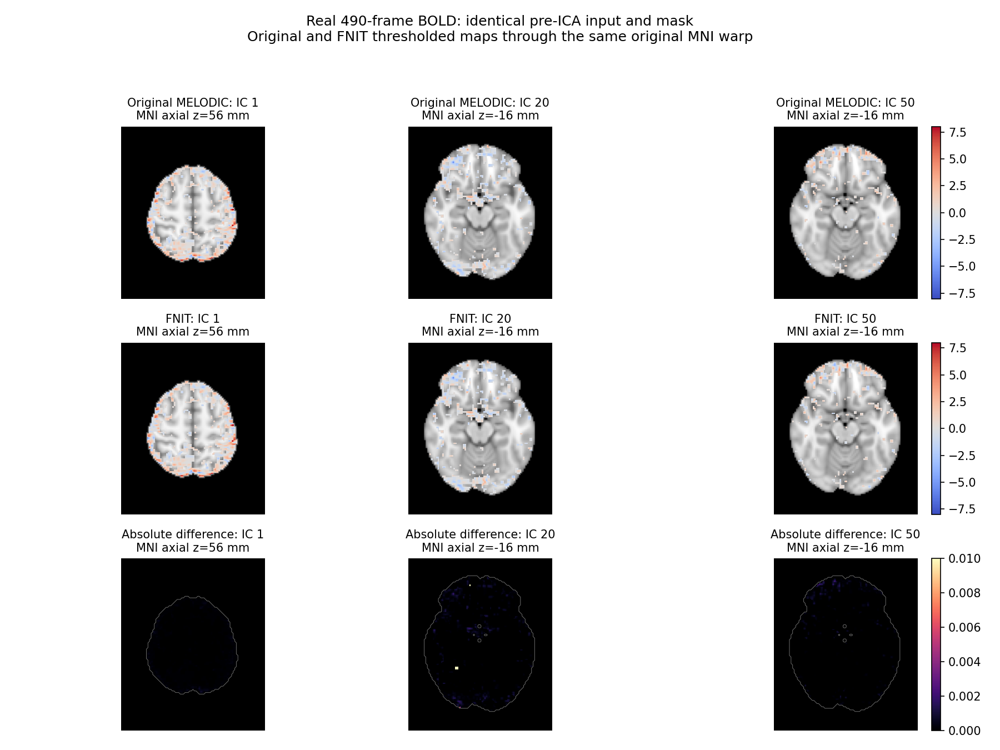

# PICA、ICA-AROMA 与混杂回归的 CPU 官方对照

## 1. 功能和处理流程

`decompose_spatial_ica` 估计空间 PICA；`classify_aroma` 计算四项噪声特征；`denoise_aroma` 按选择的噪声成分回归；`clean_confounds` 联合处理组织、运动、全脑信号、趋势与可选带通。各函数可独立调用。生产计算使用 FNIT 自身的 PyTorch 实现。

```mermaid
flowchart LR
    A[完整 BOLD 与脑掩膜] --> B[PICA 与混合模型阈值]
    B --> C[运动与空间特征分类]
    C --> D[nonaggr 或 aggr 回归]
    D --> E[可选混杂与联合带通]
    classDef default fill:#fff,stroke:#000,color:#000;
    linkStyle default stroke:#000;
```

## 2. Python 调用、输入与输出

完整调用与每个参数见 [PICA](../melodic/README.md) 和 [AROMA／混杂回归](aroma_confounds.md)。以下示例固定原有成分输入，便于独立比较混杂回归：

```python
from pathlib import Path
from fnit.fmri import clean_confounds

aroma_bold_path = Path("/absolute/path/aroma/denoised.nii.gz")  # 原网格 X×Y×Z×T
motion_parameters_path = Path("/absolute/path/motion.par")    # T×6：三旋转、三平移
cleaned_bold_path = Path("/absolute/path/output/cleaned.nii.gz")

clean_confounds(
    input_bold=aroma_bold_path,
    output_bold=cleaned_bold_path,
    wm_mask="/absolute/path/wm_mask.nii.gz",       # 同网格 WM 掩膜
    csf_mask="/absolute/path/csf_mask.nii.gz",     # 同网格 CSF 掩膜
    brain_mask="/absolute/path/brain_mask.nii.gz", # 同网格全脑掩膜
    motion=motion_parameters_path,
    motion_model=24,              # 可选 6、12、24 列
    bandpass=(0.01, 0.1),          # Hz；None 关闭
    tr=0.735,                     # 秒；None 从 NIfTI 时长单位解析
    global_signal=True,           # 回归脑掩膜内均值
    projection="afni",           # 使用原版 3dTproject 的正则化和边界约定
    device="cpu",                # cpu 或 cuda:0
    chunk_size=8192,              # 每批空间体素数
)
```

输入影像必须具有同一体素网格、仿射和帧数，运动文件必须有 T 行。输出为同网格、同 TR 的 float32 4D NIfTI；额外混杂回归去除时间均值。`orthogonal` 为既有默认严格投影，`afni` 为新增的原版数值兼容选项。两者的数值约定不同：AFNI 的 SVD 伪逆使用固定正则化，不是无正则化的精确正交投影。

## 3. 命令行调用

完整体积 pipeline 可通过 `fnit-fmri volume --confound-projection afni` 选择该模式，并使用 `--regress-wm`、`--regress-csf`、`--regress-motion`、`--motion-model`、`--global-signal` 和 `--bandpass` 选择设计。默认关闭 slice timing。完整变量与输入命令见 [volume 命令行](README.md#命令行调用)。

独立 PICA 的 BIDS Python 调用及输出命名见 [MELODIC](../melodic/README.md)。分类和独立混杂回归使用 Python API。

## 4. 原软件调用

```bash
# 与本轮一致的原版 PICA 参数；DIM=0 自动估计，或指定固定组件数。
melodic --in=bold.nii.gz --mask=brain_mask.nii.gz --outdir=melodic.ica \
  --tr=0.735 --dim=0 --dimest=lap --nl=pow3 --eps=0.001 \
  --maxit=500 --seed=0 --nobet --Ostats --mmthresh=0.5

# 原版噪声 IC 使用 1 起始编号；添加 -a 为 aggr。
fsl_regfilt -i bold.nii.gz -d melodic_mix -f 2,5,9 -o denoised.nii.gz

# nuisance.1D 为本轮相同原始 WM/CSF/全脑和运动设计，不先带通。
3dTproject -input denoised.nii.gz -prefix cleaned.nii.gz \
  -ort nuisance.1D -polort 2 -TR 0.735 -passband 0.01 0.1
```

ICA-AROMA 特征使用其原作者函数、1000 次完整运动抽样，以及完全相同的 mixing、阈值 IC 和三张原分类掩膜。FSL 和 AFNI 仅作为隔离参考程序；FNIT 运行时不调用它们。

## 5. 完整真实数据结果与脑图

本轮固定基线 `cc9402734faeba93b3a13c29932fa1392eaccf62`，使用完整 490 帧；PICA 脑掩膜含 99,372 个体素，混杂回归脑掩膜含 99,351 个体素；1／8 线程分别绑定一个／八个物理核心，且整个子进程串行占用同一组核心。下表是首次完整进程墙钟观察，包括 Python 启动、来源校验、影像读写、计算与输出检查；单次观察不代表稳定加速比。

| 完整功能 | 线程 | FNIT 进程墙钟 | 原版进程墙钟 |
|---|---:|---:|---:|
| PICA 自动定阶 | 1 | 98.788 s | 478.063 s |
| PICA 自动定阶 | 8 | 49.055 s | 470.156 s |
| PICA 固定 95 组件 | 8 | 41.708 s | 474.104 s |
| nonaggr IC 回归 | 1 | 34.391 s | 55.273 s |
| nonaggr IC 回归 | 8 | 38.744 s | 53.654 s |
| aggr IC 回归 | 1 | 35.282 s | 56.430 s |
| aggr IC 回归 | 8 | 31.528 s | 55.447 s |

PICA 自动定阶两边均得到 95 个组件。按全时序相关做组件匹配并校正符号后，1 线程的时间相关均值为 **0.999999884**，空间相关均值为 **0.999999880**；阈值支持 Dice 均值 **0.998591**、最小 **0.989312**。8 线程得到相同精度量级。比较使用完整组件图与全 490 帧，没有减少 ICA 默认 500 次迭代上限。

补充 `mm_threshold=0.75`、固定 95 组件的完整 490 帧测试：CPU1／8 的 FNIT API 为 **82.628／46.211 s**，原 MELODIC 为 **456.032／454.069 s**；阈值支持 Dice 均值为 **0.998761／0.998943**，最小值为 **0.987329／0.993471**。时空组件相关均值仍超过 0.99999988。

独立 BIDS Python API 用公开数据的完整 180 帧、20 组件运行，API **15.667 s**、完整进程 **20.320 s**。三类组件图均为同源网格的 float32 `91×109×91×20`，mixing 为 `180×20`；来源 URI 和已有文件保护通过。它是输入输出合同验证，不作为原 MELODIC 同功能速度比较。详见 [非默认阈值与 BIDS 聚合报告](../../validation/fmri_cpu_20261004/task02_ica_aroma/pica_features_20261005.public.json)。

固定同一套 IC 输入时，ICA-AROMA 的噪声编号在 1／8 线程均完全一致；最大运动相关误差为 **1.67×10⁻¹⁶**，edge fraction 最大误差 **1.01×10⁻⁶**，高频比例逐值相同，CSF fraction 最大误差 **1.06×10⁻⁷**。nonaggr 脑内 RMSE 在 1／8 线程分别为 **7.00×10⁻⁸／0**，aggr 均为 **1.40×10⁻⁷**；最大绝对差分别不超过 **4.88×10⁻⁴／9.77×10⁻⁴**。

额外混杂已完整比较 drift、motion6／12／24、tissue、global、all、all+bandpass。默认严格投影与 AFNI 的无带通结果相关超过 **0.99999978**；带通时因频率边界和 SVD 正则化定义不同，不能将差异称为纯浮点误差。显式 `afni` 模式现已完成 1／8 线程的八类完整官方比较，以及四组默认旧新输出比较。四组默认输出的全网格最大差均为零；`afni` 模式与原 AFNI 的完整数值见下表。GPU 十个完整调用及六组全图分析已完成；四组默认旧新输出和影像头完全一致，新增模式的 CPU/GPU 残差与实际时钟如下。

### AFNI 数值兼容模式：完整 CPU 1／8 线程结果

以下为正常读入、计算、保存的完整 API 墙钟，排除 Python 导入和来源 SHA 校验；两种实现分别使用相同物理核与线程预算。AFNI 的内部 float32 计算仍有小量残差，不能称为逐位复现。

| 设计 | FNIT 1／8 线程 | AFNI 1／8 线程 | 脑内 RMSE | 最大绝对差 |
|---|---:|---:|---:|---:|
| 趋势 | 25.337／24.560 s | 30.106／30.217 s | 0.002289 | 0.039581 |
| 运动 6 列 | 24.868／24.878 s | 30.127／30.518 s | 0.002989 | 0.061069 |
| 运动 12 列 | 24.917／23.809 s | 30.830／31.178 s | 0.003237 | 0.058014 |
| 运动 24 列 | 24.846／25.919 s | 31.811／31.782 s | 0.004469 | 0.108521 |
| WM／CSF | 24.876／24.507 s | 31.031／30.326 s | 0.002290 | 0.037434 |
| 全脑信号 | 25.660／25.221 s | 30.741／30.624 s | 0.002291 | 0.037354 |
| 全部混杂 | 25.714／25.079 s | 32.223／32.518 s | 0.004460 | 0.116241 |
| 全部混杂＋带通 | 28.476／24.715 s | 57.437／57.742 s | 0.021116 | 0.521057 |

全部混杂＋带通的脑内相关为 **0.999999961**，RMSE 为 **0.021116**；此前严格默认与 AFNI 的带通 RMSE 为 16.720。新模式处理频率边界和正则化约定，既有默认行为保持逐值不变。这些是各一次完整观测；[36 次调用的 20 组完整精度报告](../../validation/fmri_cpu_20261004/task02_ica_aroma/cpu_projection_20261005.public.json)保留所有设计、线程、正常读写时钟及 SHA。

### 最新 GPU 完整回归

同一共享 H100、8 CPU 线程、TF32，完整 490 帧按旧版 A1→新版 B1→新版 B2→旧版 A2 运行。四组默认全网格数据、二进制影像头和输出 SHA 全部一致。

| 默认设计 | 旧版 A1／A2 API | 新版 B1／B2 API |
|---|---:|---:|
| 全部混杂 | 34.008／30.420 s | 30.920／30.900 s |
| 全部混杂＋带通 | 29.657／27.979 s | 29.294／28.417 s |

API 含正常影像读写；进程时钟另含导入和来源校验，逐次值见 [GPU 完整报告](../../validation/fmri_cpu_20261004/task02_ica_aroma/gpu_projection_20261005.public.json)。十个进程的实际进程树显存采样峰值为 **1.091 GB**，上限 20 GB；共享 GPU 利用率为 99–100%，这些配对时间是观测值，不推断稳定加速比。

新增 `afni` 模式的 CPU8→GPU 全部混杂脑内 RMSE 为 **7.95×10⁻⁹**、最大差 **3.05×10⁻⁵**；全部混杂＋带通为 **1.26×10⁻⁹**、最大差 **3.81×10⁻⁶**。默认 GPU 路径的完整数值保持不变。

以下为此前已公开的同输入成分脑图，展示输出结构；它不是本轮 CPU 新测量的成分或计时证据。



## 6. 最近更新与 benchmark 记录

- 2026-10-04：完成完整 490 帧 PICA、ICA-AROMA、两种回归和八类混杂的 CPU 1／8 线程对照。首次原 AROMA 因分类掩膜的工作目录不正确而失败；新目录重跑成功，原算法未修改。
- 2026-10-05：核查原版 AFNI 的频率边界及正则化约定，新增显式 `afni` 模式；既有严格投影默认保留。36 项完整 CPU 调用及 20 组数值对照已完成；八种设计的 CPU 速度均快于同预算原 AFNI，四组默认旧新逐值一致。十项 GPU 完整调用及六组数值分析已完成，默认完整旧新数据和影像头均相同，实际显存和配对时钟见本页。
- 此前裁剪体素的回归测试、106 IC 的固定分类测试及完整 volume 记录保留在 [AROMA 历史页](aroma_confounds.md#最近版本与-benchmark-记录)，不代替本轮完整数据。

## 7. 原实现与参考文献

- [FSL MELODIC 原文档与原实现](https://fsl.fmrib.ox.ac.uk/fsl/docs/resting_state/melodic.html)；Beckmann CF, Smith SM. Probabilistic independent component analysis for functional magnetic resonance imaging. IEEE TMI, 2004.
- [原 ICA-AROMA 代码](https://github.com/maartenmennes/ICA-AROMA)；Pruim RHR et al. ICA-AROMA: A robust ICA-based strategy for removing motion artifacts from fMRI data. NeuroImage, 2015.
- [AFNI 3dTproject 原文档](https://afni.nimh.nih.gov/pub/dist/doc/program_help/3dTproject.html)、[原源码](https://github.com/afni/afni/blob/master/src/3dTproject.c)和[许可](https://github.com/afni/afni/blob/master/LICENSE.txt)；Cox RW. AFNI: Software for analysis and visualization of functional magnetic resonance neuroimages. Computers and Biomedical Research, 1996.
