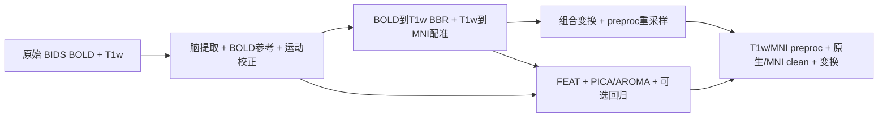

# fMRI Volume pipeline

| 摘要 | 内容 |
|---|---|
| 输入 | 一个原始 BIDS BOLD run、同被试 T1w、MNI 模板。 |
| 输出 | 原生/T1w/MNI 预处理与去噪 BOLD、脑掩膜和变换。 |
| 对应原软件 | FSL FEAT、ICA-AROMA；fMRIPrep 的 volume 预处理。 |
| Python / CLI | `fnit.fMRIVolume_pipeline` / `fnit-fmri volume`。 |
| CPU / GPU | 支持 CPU 与 CUDA；CUDA 默认 TF32，主要影像为 float32。 |

## 1. 功能简介

`fMRIVolume_pipeline` 从一个原始 BIDS run 同时生成两组结果。
`preproc` 保留原始强度基线，完成所选 STC、运动校正和空间配准；
`clean` 在 FEAT 分支加入强度缩放、高通、PICA/ICA-AROMA 及可选混杂回归。
运行时复用 FNIT 模块，不执行 FSL、FreeSurfer、AFNI 或 fMRIPrep。

BOLD→T1w 使用初始线性配准和 BBR；
T1w→MNI 使用所选 SynthMorph，或 TorchFLIRT 仿射接 TorchFNIRT。
因此 BBR 属于 BOLD→T1w，T1w→MNI 的 FNIRT 分支是 FLIRT＋FNIRT。
接口默认 `registration_backend="synthmorph"`；下方例子明确选择 FNIRT。



需要皮层时序时，直接使用 [Surface pipeline](surface.md)，由入口检查并自动完成缺失的 volume。
各独立模块的算法与参数见 [MCFLIRT](../mcflirt/README.md)、[FAST](../fast/README.md)、
[FLIRT](../flirt/README.md)、[FNIRT](../fnirt/README.md)、[SynthMorph](../synthmorph/README.md) 和 [MELODIC](../melodic/README.md)。

## 2. Python 调用

<a id="python-调用输入输出与参数"></a>

安装主页 Conda 环境，并准备资源：

```bash
fnit-setup-weights --model synthstrip
fnit-setup-fmri-surface-assets --output-dir /data/hcp_assets --fmriprep
```

```python
from fnit import fMRIVolume_pipeline

bids_directory = "/data/bids"                         # 原始 BIDS 数据目录
output_directory = "/data/derivatives/fnit"           # 新建的衍生结果目录
mni_template_path = "/data/hcp_assets/fmriprep/tpl-MNI152NLin6Asym_res-02_T1w.nii.gz"  # 标准目标
mni_mask_path = "/data/hcp_assets/fmriprep/tpl-MNI152NLin6Asym_res-02_desc-brain_mask.nii.gz"  # 目标脑掩膜
volume_result = fMRIVolume_pipeline(                   # 返回已保存结果的路径与计时
    bids_root=bids_directory,
    derivatives_root=output_directory,
    subject="01",                                    # 选择 sub-01
    mni_template=mni_template_path,
    mni_brain_mask=mni_mask_path,
    registration_backend="fnirt",                    # 明确选 FLIRT + TorchFNIRT
    device="cuda:0",                                 # 使用第一张可见 GPU
)
print(volume_result.preproc_mni)                      # MNI preproc BOLD 文件
```

### 输入数据格式

原始目录的最小结构：

```text
bids/
  dataset_description.json
  sub-01/
    anat/sub-01_T1w.nii.gz
    func/sub-01_task-rest_bold.nii.gz
    func/sub-01_task-rest_bold.json
```

- BOLD：`.nii`/`.nii.gz`，四维 `[X,Y,Z,T]`，T 为完整帧数。
  输入可为整数或浮点强度，header 缩放由 nibabel 读取；强度没有通用物理单位。
- T1w：三维 `[X,Y,Z]`，同一被试的原始结构像，不要求已脑提取。
  多张候选必须用 `t1w_image` 指定，不能依靠排序选择。
- affine：有效、可逆的 scanner-RAS 毫米变换。
  不要求文件存储为 RAS 排列，但不能仅修改 header 把错误坐标改称同一空间。
- BOLD JSON：非空 `TaskName`、正值 `RepetitionTime`（秒），TR须与NIfTI一致；BIDS task/run 等实体用于选择一个明确 run。
  启用 STC 时需要有效 `SliceTiming`；入口处理单 echo，不合并多 echo。
- SBRef：若 BIDS 中有匹配 SBRef，使用已有兼容路径。
  当前没有把 raw-BOLD HMC 目标与 SBRef coreg 目标分开估计。
- MNI 模板：三维强度 NIfTI，affine 定义目标标准空间与网格。
  为与本轮 surface/CIFTI 接通，应采用固定 MNI152NLin6Asym 2 mm 文件。
- MNI mask：可选三维二值 NIfTI，与模板具有相同物理网格。
  不需要提供原生脑 mask，入口由 SynthStrip 生成。
- 原始输入无需运动校正、去噪或标准化。
  本入口不估计或接收 B0/梯度非线性形变，不能将其输出称为已经完成 SDC/GDC。

### 输入参数

| 参数 | 必需 | 类型 | 默认值 | 含义 |
|---|---|---|---|---|
| `bids_root` | 是 | 路径 | — | 原始 BIDS 根目录。 |
| `derivatives_root` | 是 | 路径 | — | FNIT BIDS Derivatives 输出根目录。 |
| `subject` | 是 | str | — | 被试标签，可使用不含 sub- 的标签。 |
| `mni_template` | 是 | 路径 | — | 三维 MNI T1w 标准模板，决定最终输出网格。 |
| `session` | 否 | str/None | `None` | ses 标签；有多会话时明确选择。 |
| `task` | 否 | str | `'rest'` | task 标签。 |
| `run` | 否 | str/None | `None` | run 标签；多 run 时明确选择。 |
| `acquisition` | 否 | str/None | `None` | acq 标签。 |
| `direction` | 否 | str/None | `None` | dir 标签。 |
| `reconstruction` | 否 | str/None | `None` | rec 标签。 |
| `echo` | 否 | str/None | `None` | echo 标签，入口处理一个 echo。 |
| `t1w_image` | 否 | 路径/None | `None` | 明确选择同被试 T1w；多个候选时必须指定。 |
| `mni_brain_mask` | 否 | 路径/None | `None` | 与模板同网格的脑掩膜；未给出时提取模板脑区。 |
| `registration_backend` | 否 | str | `'synthmorph'` | T1w→MNI 选择 synthmorph 或 fnirt；BOLD→T1w 均使用 BBR。 |
| `fnirt_config` | 否 | str/FNIRTConfig/None | `None` | FNIRT 配置；None 在 fnirt 分支解析为 t1 预设。 |
| `synthstrip_weights` | 否 | 路径/None | `None` | SynthStrip 权重；None 从配置解析。 |
| `synthmorph_weights` | 否 | 路径/None | `None` | SynthMorph 权重目录；仅 synthmorph 分支使用。 |
| `ica_n_components` | 否 | int/None | `None` | PICA 成分数；None 自动定阶。 |
| `aroma_mode` | 否 | str | `'nonaggr'` | nonaggr 或 aggr，仅影响 clean。 |
| `regress_wm` | 否 | bool | `False` | clean 回归白质均值。 |
| `regress_csf` | 否 | bool | `False` | clean 回归脑脊液均值。 |
| `regress_motion` | 否 | bool | `False` | clean 回归运动项。 |
| `motion_model` | 否 | int | `24` | 6、12 或24项运动回归模型。 |
| `bandpass` | 否 | 二元组/None | `None` | clean 的额外低、高截止频率，单位 Hz。 |
| `global_signal` | 否 | bool | `False` | clean 回归脑内均值。 |
| `highpass_cutoff_seconds` | 否 | float | `100.0` | FEAT clean 高通截止周期，单位秒。 |
| `slice_timing` | 否 | bool | `False` | 使用有效 SliceTiming 校正 preproc；clean 维持 FEAT 分支。 |
| `slice_time_reference` | 否 | float | `0.5` | 0–1，STC 目标时刻在最早/最晚切片时刻之间的比例。 |
| `device` | 否 | str/None | `None` | None 自动选 CUDA 或 CPU。 |
| `batch_size` | 否 | int | `8` | 最终重采样每批帧数，默认8；不控制逐帧运动估计。 |
| `motion_iterations` | 否 | 三元组 | `(1, 1, 1)` | 8/4/4 mm 运动估计各阶段优化轮数。 |
| `bold_reference_strategy` | 否 | str | `'robust'` | robust 稳健参考或 middle 单帧参考；有 SBRef 时使用现有兼容路径。 |
| `ica_max_iter` | 否 | int | `500` | PICA/ICA 最大迭代数。 |
| `n_splits` | 否 | int | `1000` | ICA-AROMA 运动特征子采样次数。 |
| `random_state` | 否 | int | `0` | PICA/AROMA 随机种子。 |
| `overwrite` | 否 | bool | `False` | 允许替换该 run 最终输出；False 拒绝已有最终文件。 |
| `reuse_anatomical` | 否 | bool | `True` | 核验来源后复用该被试/会话的解剖缓存。 |
| `bbr_execution` | 否 | str | `'batched'` | batched 或 reference；同算法的执行方式。 |
| `fnirt_execution` | 否 | str | `'optimized'` | optimized 或 reference；仅 FNIRT 分支。 |

`clean` 的回归、ICA 和滤波选项不会作用于 `preproc`。
`fnirt_config` 只适用于 FNIRT 分支；预设及配置对象见 [FNIRT 手册](../fnirt/README.md)。
更换参数后应使用新的输出目录，或明确选择覆盖；不能通过改 JSON 把旧结果标成新处理。

### 输出

以下省略每个影像对应的 `.json`，有 session 时在被试下增加 `ses-*`：

```text
derivatives/fnit/
  dataset_description.json
  sub-01/
    anat/
      sub-01_desc-brain_T1w.nii.gz
      .fnit_anatomical/
    func/
      sub-01_task-rest_desc-hmc_boldref.nii.gz
      sub-01_task-rest_space-T1w_res-native_desc-preproc_bold.nii.gz
      sub-01_task-rest_space-MNI152NLin6Asym_res-2_desc-preproc_bold.nii.gz
      sub-01_task-rest_space-boldref_desc-clean_bold.nii.gz
      sub-01_task-rest_space-MNI152NLin6Asym_res-2_desc-clean_bold.nii.gz
      sub-01_task-rest_space-MNI152NLin6Asym_res-2_desc-brain_mask.nii.gz
      sub-01_task-rest_from-boldref_to-T1w_mode-image_xfm.txt
      sub-01_task-rest_from-boldref_to-orig_mode-image_desc-pull_xfm.npy
      sub-01_task-rest_from-MNI152NLin6Asym_to-T1w_mode-image_desc-pull_xfm.nii.gz
```

| 文件/返回字段 | 格式、shape、空间与含义 |
|---|---|
| `preproc_t1w` | float32 NIfTI `[Xₜ,Yₜ,Zₜ,T]`；T1w scanner-RAS，体素分辨率取原生 BOLD，FOV 取 T1w 脑范围。 |
| `preproc_mni` | float32 NIfTI `[Xₘ,Yₘ,Zₘ,T]`；affine/网格与所给 MNI 模板一致，保持全部帧与原始 TR。 |
| `clean_native` | float32 四维 NIfTI；BOLD 参考网格，含 FEAT/AROMA 及所选回归。 |
| `clean_mni` | float32 四维 NIfTI；MNI 模板网格，脑 mask 外为零。 |
| `bold_reference` | 三维 NIfTI；运动参考网格，参考策略、来源和 SHA 写入 sidecar。 |
| `mask_mni` | 三维二值 NIfTI，标签0/1；MNI 模板 affine。 |
| `t1_brain` | 三维 NIfTI；与源 T1w 同网格，非脑区域置零。 |
| `bbr_matrix` | 4×4文本矩阵；BOLD reference→T1w，FSL FLIRT scaled-mm 约定，不是直接 scanner-RAS 矩阵。 |
| `motion_pull` | NumPy `[T,4,4]`；reference RAS→各原始帧 RAS 的 pull，单位 mm。 |
| `mni_pull` | `[Xₘ,Yₘ,Zₘ,3]` RAS-mm 位移 NIfTI；目标 MNI 坐标加位移得到源 T1w 坐标。 |
| `metadata` | MNI clean sidecar 路径；记录配置、来源、TR、模板、源码与阶段时间。 |
| `timing_seconds` | 本次调用阶段时钟字典；缓存命中阶段与实际计算阶段分开记录。 |

preproc 使用组合运动/空间变换后的单次空间插值。
NIfTI 使用毫米空间单位、BOLD TR 使用秒；preproc 保留强度基线，clean 的缩放与回归改变强度含义。
这些是 BIDS Derivatives 风格输出，不声明与所有原软件输出逐值相同。

`reuse_anatomical=True` 复用经过输入、资源、源码、参数和成品 SHA 核验的解剖缓存。
它不省略该 run 的运动估计或 BBR。
`overwrite=False` 保护已有最终文件；最终产物检查完成后整批发布。
中间 FEAT/PICA/AROMA 文件位于临时工作目录，不是稳定公开输出。

## 3. 命令行调用

<a id="命令行调用"></a>

```bash
fnit-fmri volume --bids-root /data/bids \
  --derivatives-root /data/derivatives/fnit --subject 01 \
  --mni-template /data/hcp_assets/fmriprep/tpl-MNI152NLin6Asym_res-02_T1w.nii.gz \
  --registration-backend fnirt --device cuda:0
```

| CLI 参数 | Python 参数 | 含义 |
|---|---|---|
| `--bids-root` | `bids_root` | 原始 BIDS 根目录。 |
| `--derivatives-root` | `derivatives_root` | FNIT BIDS Derivatives 输出根目录。 |
| `--subject` | `subject` | 被试标签，可使用不含 sub- 的标签。 |
| `--mni-template` | `mni_template` | 三维 MNI T1w 标准模板，决定最终输出网格。 |
| `--session` | `session` | ses 标签；有多会话时明确选择。 |
| `--task` | `task` | task 标签。 |
| `--run` | `run` | run 标签；多 run 时明确选择。 |
| `--acquisition` | `acquisition` | acq 标签。 |
| `--direction` | `direction` | dir 标签。 |
| `--reconstruction` | `reconstruction` | rec 标签。 |
| `--echo` | `echo` | echo 标签，入口处理一个 echo。 |
| `--t1w-image` | `t1w_image` | 明确选择同被试 T1w；多个候选时必须指定。 |
| `--mni-brain-mask` | `mni_brain_mask` | 与模板同网格的脑掩膜；未给出时提取模板脑区。 |
| `--registration-backend` | `registration_backend` | T1w→MNI 选择 synthmorph 或 fnirt；BOLD→T1w 均使用 BBR。 |
| `--fnirt-preset` | `fnirt_config` | FNIRT 配置；None 在 fnirt 分支解析为 t1 预设。 |
| `--synthstrip-weights` | `synthstrip_weights` | SynthStrip 权重；None 从配置解析。 |
| `--synthmorph-weights` | `synthmorph_weights` | SynthMorph 权重目录；仅 synthmorph 分支使用。 |
| `--ica-n-components` | `ica_n_components` | PICA 成分数；None 自动定阶。 |
| `--aroma-mode` | `aroma_mode` | nonaggr 或 aggr，仅影响 clean。 |
| `--regress-wm` | `regress_wm` | clean 回归白质均值。 |
| `--regress-csf` | `regress_csf` | clean 回归脑脊液均值。 |
| `--regress-motion` | `regress_motion` | clean 回归运动项。 |
| `--motion-model` | `motion_model` | 6、12 或24项运动回归模型。 |
| `--bandpass` | `bandpass` | clean 的额外低、高截止频率，单位 Hz。 |
| `--global-signal` | `global_signal` | clean 回归脑内均值。 |
| `--highpass-cutoff-seconds` | `highpass_cutoff_seconds` | FEAT clean 高通截止周期，单位秒。 |
| `--slice-timing` | `slice_timing` | 使用有效 SliceTiming 校正 preproc；clean 维持 FEAT 分支。 |
| `--slice-time-reference` | `slice_time_reference` | 0–1，STC 目标时刻在最早/最晚切片时刻之间的比例。 |
| `--device` | `device` | None 自动选 CUDA 或 CPU。 |
| `--batch-size` | `batch_size` | 最终重采样每批帧数，默认8；不控制逐帧运动估计。 |
| `--motion-iterations` | `motion_iterations` | 8/4/4 mm 运动估计各阶段优化轮数。 |
| `--bold-reference-strategy` | `bold_reference_strategy` | robust 稳健参考或 middle 单帧参考；有 SBRef 时使用现有兼容路径。 |
| `--ica-max-iter` | `ica_max_iter` | PICA/ICA 最大迭代数。 |
| `--n-splits` | `n_splits` | ICA-AROMA 运动特征子采样次数。 |
| `--random-state` | `random_state` | PICA/AROMA 随机种子。 |
| `--overwrite` | `overwrite` | 允许替换该 run 最终输出；False 拒绝已有最终文件。 |
| `--no-anatomical-cache` | `reuse_anatomical` | 设为False。 |
| `--bbr-execution` | `bbr_execution` | batched 或 reference；同算法的执行方式。 |
| `--fnirt-execution` | `fnirt_execution` | optimized 或 reference；仅 FNIRT 分支。 |

Python `device=None` 自动选择设备；CLI 默认 `cuda:0`。
`--fnirt-preset` 只接收命名预设，不接收 Python 配置对象。
所有 CLI 选项与 parser 见 `fnit-fmri volume --help`；volume 每次同时产生两类信号。

## 4. 原软件调用

以下是独立参考环境中的同原始数据 preproc 对照，许可由使用者按官方要求提供：

```bash
apptainer run --cleanenv \
  --bind /data/bids:/bids:ro,/data/reference:/out,/data/reference_work:/work \
  --bind /private/license.txt:/license.txt:ro \
  fmriprep-25.2.4.sif /bids /out participant \
  --participant-label 01 --fs-license-file /license.txt --work-dir /work \
  --output-spaces MNI152NLin6Asym:res-2 fsLR:den-32k \
  --cifti-output 91k --ignore slicetiming fieldmaps \
  --nprocs 8 --omp-nthreads 4 --mem-mb 49152
```

| FNIT 参数/阶段 | 原软件参数/阶段 |
|---|---|
| subject/session/run 选择 | fMRIPrep participant label/BIDS filter。 |
| `slice_timing=False` | `--ignore slicetiming`。 |
| 固定 MNI6 2 mm 模板 | `--output-spaces MNI152NLin6Asym:res-2`。 |
| `bold_reference_strategy="robust"` | NiWorkflows RobustAverage 的选帧与统计；FNIT 运动后端不同。 |
| TorchMCFLIRT / TorchBBR | fMRIPrep 的 HMC 与 BOLD→T1w 配准阶段；不构成参数逐一等价。 |
| `registration_backend="fnirt"` | FSL `flirt` 接 `fnirt` 的 T1w→标准空间流程，非 fMRIPrep 默认 ANTs。 |
| FEAT/PICA/AROMA clean | FSL FEAT、MELODIC 与 ICA-AROMA 同步骤参考，独立协议见 [clean 验证](../../validation/fmri/e2e_latest/README.md)。 |

目前有运动、脑提取、T1w配准、preproc重采样、PICA/AROMA及可选回归。
本入口没有自动 SDC/GDC、多 echo 联合处理、FIX 或 fMRIPrep 的全部报告和 confounds。
配置相似不表示结果等价；preproc 与 clean 的处理定义应分别比较。

## 5. 最新精度和运行时间

本节最新正式数据为 2026-10-04 的 [两例连续 volume→surface 对照](../../validation/fmri/reference_alignment_20261004/CONTINUOUS_BENCHMARK.md)。
数值运行绑定 `cc940273` 基线的冻结 source_v1；随后 `140c3739` 保护修复不改变本轮算法。
不是把原十例重标成当前 main；逐病例结果、源码清单及失败记录均在详细报告。

| 条件 | 实测记录 |
|---|---|
| 数据 / n | OpenNeuro ds001226 v5.0.1（CC0），两例配对 T1w＋完整180帧 BOLD。 |
| 参考 | 官方 fMRIPrep25.2.4；稳健参考组件 NiWorkflows1.14.4。 |
| CPU / GPU | CPU具体型号未单独保存；共享 NVIDIA H100 PCIe。 |
| 线程 | runner PyTorch8线程；surface4线程且串行，不能把整个进程称4线程。 |
| precision / 峰值 | float32＋默认TF32，无半精度；本进程采样峰值14.0551 GB。 |
| timing | volume自动阶段墙钟；连续API包括文件保存/QC，排除重建/MSM的冷计算。 |

### 端到端 benchmark

| 指标，两病例中位数 | FNIT robust | 原软件 | 差异 |
|---|---:|---:|---|
| 本轮 volume 阶段 | 543.23 s | 未单独测同范围 | 不计算速度比。 |
| 连续 volume→surface API | 719.11 s | 无同复用边界时钟 | 使用已有FNIT重建/MSM。 |
| MNI全帧时间r | 0.520368 | fMRIPrep为参照 | middle对照为0.511970。 |
| MNI NRMSE | 23.845726% | fMRIPrep RMS归一 | middle对照为24.044193%。 |

### 分步骤 benchmark

| 阶段，两病例中位数 | FNIT | 原软件 |
|---|---:|---:|
| 自动 volume | 543.23 s | 同范围未测。 |
| 稳健BOLD参考：FNIT API / 官方核心（边界不同） | 28.07 s | 仅RobustAverage核心15.38 s；节点/容器墙钟另列。 |
| 原生表面准备（连续链内） | 12.19 s | 同范围未测。 |
| 双侧投影（连续链内） | 138.51 s | 同范围未测。 |
| CIFTI组装（连续链内） | 10.26 s | 同范围未测。 |

阶段可能嵌套，不能求和替代连续API墙钟。
NRMSE=RMSE/参考RMS，使用全部帧和固定脑mask，不筛零值、不拟合强度。
时间r对常数序列未定义，未定义数单独报告；它们仍计入NRMSE。


脑图为本轮实际完整序列计算的切面；不是模拟结果。
旧十例三方结果见 [独立报告](../../validation/fmri/threeway_20261004/final10/REPORT.md)，不混入本轮两例中位数。

## 6. 最近版本和 benchmark

<!-- 旧文档链接兼容锚点；原始记录在本页第6节的历史链接中。 -->
<a id="latest-real-benchmark"></a>
<a id="python-调用与参数"></a>
<a id="原软件调用"></a>
<a id="参考文献与原实现"></a>
<a id="输入安装和模板"></a>
<a id="输出结构与来源"></a>

| 日期 | commit/version | 变化 | benchmark |
|---|---|---|---|
| 2026-10-04 | `140c3739` | 修复参考sidecar来源SHA与输入覆盖保护。 | 77项合同检查；原MRI冻结记录保留。 |
| 2026-10-04 | `cc940273`＋source_v1 | 接入稳健参考，保留middle对照。 | [两例×两策略连续链](../../validation/fmri/reference_alignment_20261004/CONTINUOUS_BENCHMARK.md)。 |
| 2026-10-03 | `1128bc52` | 自动volume、重建来源选择与完整preproc输出。 | [十例三方独立记录](../../validation/fmri/threeway_20261004/final10/REPORT.md)。 |
| 2026-10-02 | `81f1bb3` | 最终节点复用公共采样接口。 | [历史完整连续链](../../validation/fmri/e2e_latest/README.md)。 |

较早版本、profiling与成熟子函数修复见 [完整历史](../../validation/fmri/readme_archive_20261005.md)。
当前源码入口为 [end_to_end.py](../../src/fnit/fmri/end_to_end.py)，CLI为 [cli.py](../../src/fnit/fmri/cli.py)。

## 7. 参考文献、原软件和资源

- [FSL FEAT文档](https://fsl.fmrib.ox.ac.uk/fsl/docs/task_fmri/feat/)、[FSL源码](https://git.fmrib.ox.ac.uk/fsl)。
- [fMRIPrep25.2.4源码](https://github.com/nipreps/fmriprep/tree/25.2.4)，对应 [BOLD流程](https://github.com/nipreps/fmriprep/tree/25.2.4/fmriprep/workflows/bold)。
- [NiWorkflows1.14.4参考图源码](https://github.com/nipreps/niworkflows/blob/1.14.4/niworkflows/interfaces/images.py)。
- [ICA-AROMA原实现](https://github.com/maartenmennes/ICA-AROMA)。
- Esteban et al. fMRIPrep. Nature Methods2019：[doi](https://doi.org/10.1038/s41592-018-0235-4)。
- Pruim et al. ICA-AROMA. NeuroImage2015：[doi](https://doi.org/10.1016/j.neuroimage.2015.02.064)。

| 资源 | 用途 | 官方来源 | 大小 | SHA-256 | 是否允许 FNIT 再分发 |
|---|---|---|---:|---|---|
| SynthStrip | 脑提取 | [官网](https://surfer.nmr.mgh.harvard.edu/docs/synthstrip/) | 30,851,709 B | 见[逐文件清单](../RESOURCE_MANIFEST.md) | 固定Release的CC BY4.0及归属条款。 |
| SynthMorph（可选） | 默认T1w→MNI后端 | [官网](https://synthmorph.io/) | 依模型组合 | 见[逐文件清单](../RESOURCE_MANIFEST.md) | 固定Release许可；FNIRT例子不需要。 |
| MNI6-2mm T1w / mask / dseg | 标准目标及surface皮层下轴 | [TemplateFlow](https://github.com/templateflow/tpl-MNI152NLin6Asym) | 1,412,252 / 28,557 / 25,762 B | 见[逐文件清单](../RESOURCE_MANIFEST.md) | 未确认；只从原站获取。 |

资源安装和离线核验见 [资源手册](../WEIGHTS.md)。
