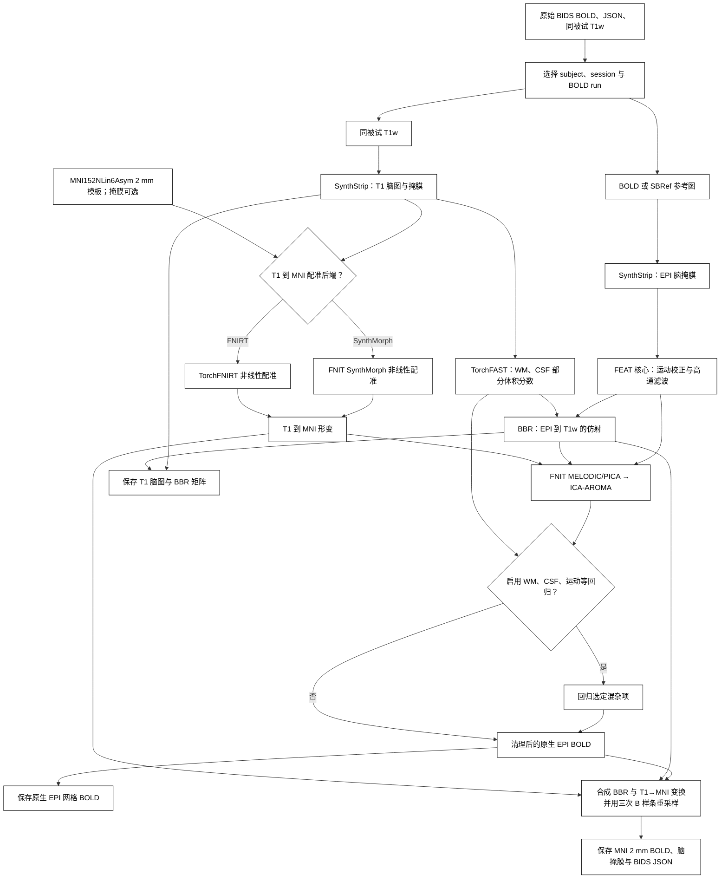

# fMRI 体积流程

`fMRIVolume_pipeline` 每次处理一个原始 BIDS BOLD run，输出 BIDS Derivatives。步骤依次为 SynthStrip 脑提取、FEAT 核心运动校正与高通、TorchFAST 组织分割、BBR、T1→MNI152NLin6Asym 2 mm 配准、[FNIT MELODIC/PICA](../melodic/README.md)、ICA-AROMA 和可选 WM/CSF/运动回归。最后分别保存个体 EPI 网格与 MNI 网格的清理后 BOLD。运算时不调用 FSL、FreeSurfer 或 fMRIPrep。GPU 默认允许 TF32。最终 MNI BOLD 采用三次 B 样条空间插值；组织图、标签和 surface 皮层投影保留各自的采样方法。

## 流程策略



## 输入与安装

在仓库根目录运行 `conda env create -f environment.yml`，激活 `fnit`，再运行 `fnit-setup-weights --model fmri`。选 `registration_backend="fnirt"` 时只需要 SynthStrip 权重。`mni_template` 须为与 FNIT ICA-AROMA 掩膜同网格的 MNI152 T1 2 mm NIfTI；`mni_brain_mask` 可选，但需与模板同网格。原始 BIDS 至少包含 `dataset_description.json`、`sub-<label>/func/*_bold.nii.gz` 及含 `TaskName`、`RepetitionTime` 的 JSON、同被试 `anat/*_T1w.nii.gz`。SBRef 可选。多 run、echo 或 T1w 候选需明确选择。

```text
bids/
├── dataset_description.json
└── sub-0001/
    ├── anat/sub-0001_T1w.nii.gz
    └── func/
        ├── sub-0001_task-rest_bold.nii.gz
        └── sub-0001_task-rest_bold.json
```

## Python 调用

```python
from fnit import fMRIVolume_pipeline

result = fMRIVolume_pipeline(
    bids_root="/absolute/path/bids",                   # 原始 BIDS 数据集根目录
    derivatives_root="/absolute/path/bids/derivatives/fnit",  # FNIT BIDS Derivatives 根目录
    subject="0001",                                   # sub 标签，不含 sub-
    session=None,                                      # ses 标签；没有 session 时为 None
    task="rest",                                      # task 标签
    run=None,                                         # run 标签；多 run 时指定
    acquisition=None,                                 # acq 标签；多候选时指定
    direction=None,                                   # dir 标签；多候选时指定
    reconstruction=None,                              # rec 标签；多候选时指定
    echo=None,                                        # echo 标签；多 echo 时指定
    t1w_image=None,                                   # 同被试唯一 T1w；多张时传绝对路径
    mni_template="/absolute/path/MNI152_T1_2mm.nii.gz",  # MNI152 2 mm 参考 NIfTI
    mni_brain_mask=None,                              # 同网格模板掩膜；None 则用 SynthStrip
    registration_backend="synthmorph",                # T1→MNI：synthmorph 或 fnirt
    fnirt_config=None,                                # fnirt 分支配置；默认 T1 预设
    synthstrip_weights=None,                          # None 从 FNIT 权重缓存读取
    synthmorph_weights=None,                          # None 从 FNIT 权重缓存读取
    ica_n_components=None,                            # None 自动定阶；整数固定 IC 数
    aroma_mode="nonaggr",                              # AROMA 回归模式：nonaggr/aggr
    regress_wm=True,                                  # 回归白质均值信号
    regress_csf=True,                                 # 回归脑脊液均值信号
    regress_motion=True,                              # 回归运动参数
    motion_model=24,                                  # 运动项数：6、12、24
    bandpass=None,                                    # 可选频段 (低Hz, 高Hz)
    global_signal=False,                              # 是否回归全脑均值
    highpass_cutoff_seconds=100.0,                    # FEAT 高通截止周期，秒
    device="cuda:0",                                  # PyTorch 设备
    batch_size=8,                                     # BOLD 重采样每批帧数
    motion_iterations=(35, 25, 15),                   # 三层运动优化迭代数
    ica_max_iter=500,                                 # ICA 迭代上限
    n_splits=1000,                                    # AROMA 随机抽样次数
    random_state=0,                                   # ICA/AROMA 随机种子
    overwrite=False,                                  # 是否覆盖同名最终结果
    reuse_anatomical=True,                            # 同一 T1/模板/配置的解剖结果跨 run 复用
    bbr_execution="batched",                         # batched 批量搜索；reference 串行同算法
    fnirt_execution="optimized",                     # optimized GPU 算子；reference 保留原执行方式
)
print(result.clean_native)  # 个体 EPI 空间清理后 4D BOLD
print(result.clean_mni)     # MNI152 2 mm 清理后 4D BOLD
```

命令行：`fnit-fmri volume --bids-root /absolute/path/bids --derivatives-root /absolute/path/bids/derivatives/fnit --subject 0001 --mni-template /absolute/path/MNI152_T1_2mm.nii.gz --regress-wm --regress-csf --regress-motion --device cuda:0`。这条命令选择一个被试的 BOLD run，执行上图完整流程，并额外回归 WM、CSF 和运动项；将清理后原生及 MNI BOLD 写入指定的 derivatives 根目录。完整选项见 `fnit-fmri volume --help`。

## 输出

以 `sub-0001_task-rest` 为例，`derivatives_root/dataset_description.json` 声明 BIDS Derivatives 数据集；下列文件位于 `sub-0001/`。保留源 BIDS 的 ses、task、acq、dir、run、echo 等实体。NIfTI 为 float32；掩膜为 3D 二值图，BOLD 为 X×Y×Z×T。

| 路径（省略 `sub-0001/`） | 含义 |
|---|---|
| `func/sub-0001_task-rest_space-boldref_desc-clean_bold.nii.gz` | 原生 EPI 参考网格的清理后 BOLD，供 surface 皮层投影前重采样到 T1w。 |
| `func/sub-0001_task-rest_space-MNI152NLin6Asym_res-2_desc-clean_bold.nii.gz` | MNI152 2 mm 清理后 BOLD，供皮层下 CIFTI。相邻 JSON 保留源 TaskName，记录 TR、来源、回归配置、耗时及 `FNIT.MNIInterpolation="cubic-bspline-periodic"`。 |
| `func/sub-0001_task-rest_space-MNI152NLin6Asym_res-2_desc-brain_mask.nii.gz` | MNI 网格脑掩膜。 |
| `func/sub-0001_task-rest_from-boldref_to-T1w_mode-image_xfm.txt` | BBR FLIRT 4×4 矩阵；surface 流程用它把 EPI BOLD 采样到 T1w。 |
| `anat/sub-0001_desc-brain_T1w.nii.gz` | SynthStrip 提取的 T1w 脑影像；与源 T1w 同网格。 |

`FMRIVolumeResult` 返回上述五条绝对路径、MNI BOLD 的 JSON 路径及各阶段耗时。已有输出不会自动更新。重跑时用新的 `derivatives_root`，或设置 `overwrite=True`（命令行 `--overwrite`）；新版 MNI BOLD 的 JSON 应包含上述 `MNIInterpolation` 字段。`FNIT.Configuration` 记录本次全部处理参数、FAST 配置、模板与权重位置；`FNIT.Denoising` 记录 ICA-AROMA 模式与完成状态；`FNIT.Source` 记录 Python 源码清单 SHA-256 和 PyTorch、NumPy、nibabel、SciPy 版本。此源码清单不包含权重或模板文件内容，资源哈希由安装器及 benchmark 另行核对。WM/CSF 回归关闭时不生成对应原生掩膜；BBR 所需 T1 白质分割仍会生成。

`reuse_anatomical=True` 默认把 T1 SynthStrip、FAST、模板提取与 T1→MNI 结果保存在当前被试/会话 `anat/.fnit_anatomical/` 的内部缓存；BIDS 的公开输出仍采用上表命名。缓存核验输入、模板/掩膜、权重、配置、执行模式、实现源码及计算环境，每个输出再校验 SHA-256；改变其中任意一项会重新计算。缓存不完整或文件损坏时会重建。BBR、EPI 脑提取和 BOLD 处理仍按 run 运行。`reuse_anatomical=False`（命令行 `--no-anatomical-cache`）强制重新计算解剖步骤；`overwrite` 不负责清空缓存。

计时 JSON 分别记录 `bbr_initial_flirt`、`bbr_refinement`、`bbr_final_resampling`、`t1_to_mni_affine`、`t1_to_mni_nonlinear`、`warp_conversion` 和 `mni_resampling`。命中缓存时，已复用的计算阶段记为 0，校验与等待时间记为 `anatomical_cache_lookup`，报告的 `anatomical_cache.reused` 为 true。`total` 是此次调用至生成重采样结果的实际墙钟，包含初始化、校验、导入及加载；末尾最终 BIDS 文件复制和 JSON 写盘在该计时外。FEAT、PICA、AROMA 文件仍使用临时工作目录。表面处理随后调用 [`fMRISurface_pipeline`](surface.md)。

`bbr_execution="reference"` 和 `fnirt_execution="reference"` 用于逐项回归，选择同一算法的串行成本/原张量算子；它们保留本次坐标、边界与优化流程的修正。CLI 对应 `--bbr-execution`、`--fnirt-execution`。后者只在 `registration_backend="fnirt"` 时可切换。

WM/CSF 概率图投到 EPI 网格时，使用本包 `TorchFLIRT.applyxfm` 的默认降采样预滤波与三线性采样，再以概率≥0.8 交 EPI 脑掩膜。JSON 中 `FNIT.TissueInterpolation="flirt-trilinear-prefilter-float32-coordinates"` 标明这一步；坐标按 float32 逐项计算，其余 CUDA 计算仍默认允许 TF32。

## 全流程 benchmark

2026-10-01，从同一例原始 BOLD/SBRef 与存档 T1 输入，完整运行修复后 `ec57972` 的 FNIT FNIRT 分支和原软件的相同步骤。原参照使用未修改的 SynthStrip、FSL MCFLIRT/FAST/FLIRT/BBR/FNIRT/MELODIC/applywarp，以及作者 ICA-AROMA；双方再做相同定义的 WM、CSF 与 24 项运动回归。T1 来自同被试重建存档，经 nibabel 逐体素无误差转换；未核对更早的结构预处理。

| 完整单例检查 | FNIT | 原软件参照 |
|---|---:|---:|
| 原生 / MNI BOLD 网格 | 88×88×64×490 / 91×109×91×490 | 相同 |
| 完整调用 / 连续链墙钟 | **455.62 s（7.59 min）** | **2570.47 s（42.84 min）** |
| 独立验证进程墙钟 | 530.35 s | 2601.72 s |
| CUDA allocated / reserved，GB | 6.239 / 7.317 | 未单独记录 |
| ICA / AROMA 噪声成分 | 96 / 62 | 95 / 50 |
| EPI WM / CSF 回归 mask Dice | **0.987102 / 0.928375** | 比较基准 |

双方从新目录开始，不命中解剖缓存。FNIT 为共享 H100 上的 float32/TF32 GPU 实现；原 SynthStrip 用 GPU，其余原 FSL 命令用 CPU，均为 8 线程。FNIT API 包含最终写盘，扣除 benchmark 捕获中间影像的额外复制；原连续链包含阶段内检查和原 MELODIC HTML report。不同计时边界与共享负载使这些单次值不能作为稳定加速比。

| 与原软件比较：逐体素 490 帧时间 Pearson r | 均值 | 中位数 |
|---|---:|---:|
| 运动校正 BOLD | 0.941467 | 0.964133 |
| 强度缩放与高通后的 pre-ICA BOLD | 0.951153 | 0.966887 |
| 原生最终 clean BOLD | **0.850471** | **0.871444** |
| MNI 最终 clean BOLD | **0.853589** | **0.872108** |
| 固定同一 clean BOLD，只换两套 warp | 0.994511 | 0.997152 |
| 固定原场：FNIT sampler / 原 FSL applywarp | 0.999999999921 | 0.999999999945 |

本次修复了 WM/CSF PVE 投到 EPI 时漏用 FLIRT 降采样预滤波的问题。固定原 PVE 和 BBR 后，WM/CSF mask Dice 为 1.00000/0.99989。重跑完整链后，前端运动估计、ICA 分解及回归设计仍存在差异；输出尚未逐体素等价。最终固定场样条采样的 RMSE 为 0.002215，主要端到端差异不在 `applywarp`。

图中四行依次是 MNI 模板、FNIT 时间标准差、原软件时间标准差和两边时间 r。SD 共用色阶、切面一致，未追加平滑。回归移除时间均值，因此用 SD 展示结构。


逐阶段参数、原命令、哈希、交叉控制、运行边界和复测说明见[相同步骤原软件对照](../../validation/fmri/matched_native.md)。此前 SynthMorph/AROMA 对 UKB FIX 发布图的 MNI 时间 r 约为 0.272：它还包含 GDC/B0、配准和清理策略差异，属于另一处理协议，见[先前 SynthMorph 分支验证](../../validation/fmri/volume_fixed.md)。该次没有本轮组织预滤波修复，不能当成当前 FNIRT 结果。

surface 与 MS-HBM 未在本轮重跑，保留各自注明的运行日期、输入和范围，见[全流程验证索引](../../validation/fmri/README.md)。既有 [DeepPrep 对照](../../validation/fmri/deepprep/README.md)包含独立结构重建及 QC，处理和计时范围不同。

## 独立配准与解剖缓存实测

2026-10-01 的 `8dbeea64` 更新另行测量一例真实 UKB BBR、T1 FNIRT 与解剖缓存。下面的函数计时包含输入解压和 CPU 结果转换，排除最终写盘；它们与上面含最终写盘的完整 volume API 计时分别报告。首次调用已完成 CUDA 初始化，未清空 Triton 磁盘缓存；热调用紧接首次调用。共享 GPU 上的这些单次观测不用于计算稳定加速倍数。

| 独立测试范围 | 首次 / 热调用 | 与同输入 FSL 参照的精度 |
|---|---:|---|
| BBR，固定官方初始矩阵和白质分割 | 3.581 / 1.409 s | 影像 r 0.99999970；逆变换位移 RMS 0.00260 mm。 |
| FNIT FAST＋FLIRT＋BBR | 6.932 / 5.072 s | 影像 r 0.9997382；逆变换位移 RMS 0.07203 mm。 |
| T1 FNIRT，固定官方初始矩阵与模板掩膜 | 32.595 / 30.422 s | warped T1 r 0.99771788；完整 pull 位移中位数 / p95 0.05176 / 0.23294 mm。 |
| 解剖准备，FNIT FLIRT＋FNIRT，第二次复用全部解剖产物 | 41.118 / 0.0785 s | 两次产物 SHA-256 相同；第二次时间为缓存核验，不重新估计配准。 |

BBR 的官方 CPU 命令观测为 45.093 s，FNIRT 为 217.558 s，均含启动与输入读写，计时边界不同。BBR 固定官方 WM/init 的精度不能代表自产 FAST/init 的完整配准链；FNIRT 表不包含 FLIRT 或最终 BOLD 重采样。当前 optimized FNIRT 与 reference 求和顺序不同，完整误差与逐项消融保留在 [BBR 页](bbr.md#真实-ukb-数据对照)、[T1→MNI 页](normalization.md#当前真实数据-benchmark)和[独立配准报告](../../validation/fmri/registration_gpu.current.public.json)。独立缓存测试的输入与计时边界不同于上面的完整 FNIRT volume，两类时间分别报告。

## 参考文献与原实现

- Smith 等，*Advances in functional and structural MR image analysis and implementation as FSL*，NeuroImage，2004，[DOI](https://doi.org/10.1016/j.neuroimage.2004.07.051)。
- Pruim 等，*ICA-AROMA*，NeuroImage，2015，[DOI](https://doi.org/10.1016/j.neuroimage.2015.02.064)。
- 原实现：[FSL FEAT](https://git.fmrib.ox.ac.uk/fsl/feat5)、[ICA-AROMA](https://github.com/maartenmennes/ICA-AROMA)；[BIDS Derivatives 规范](https://bids-specification.readthedocs.io/en/stable/derivatives/introduction.html)。

处理后的 MNI volume 与 fsLR32k surface 可继续运行 [MS-HBM 17 网络](../mshbm/README.md)。最新[官方 UKB release 下游对照](../../validation/mshbm/processed_release.md)分别报告体积标签、表面标签和网络连接差异。
