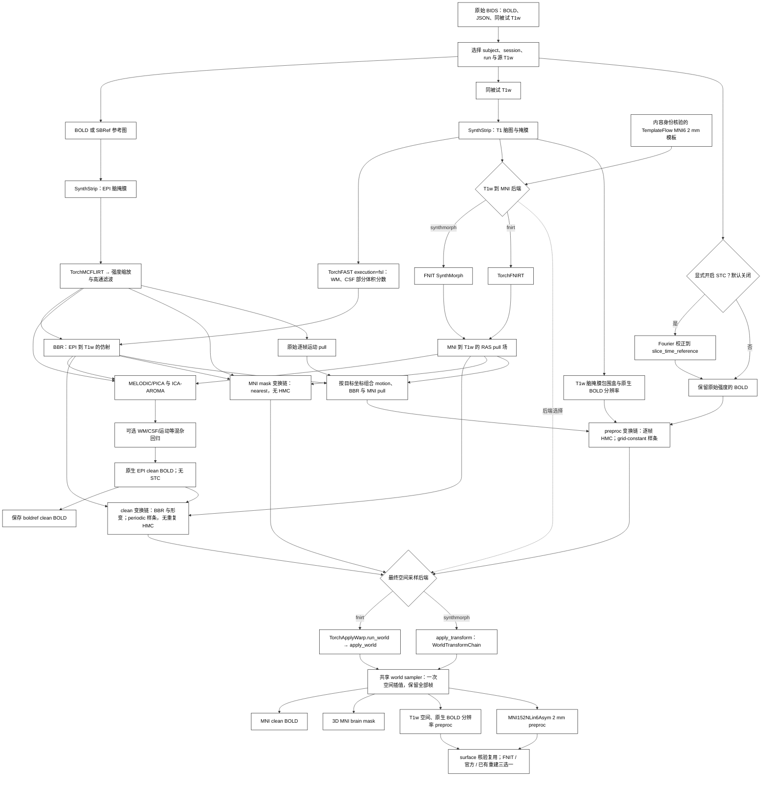
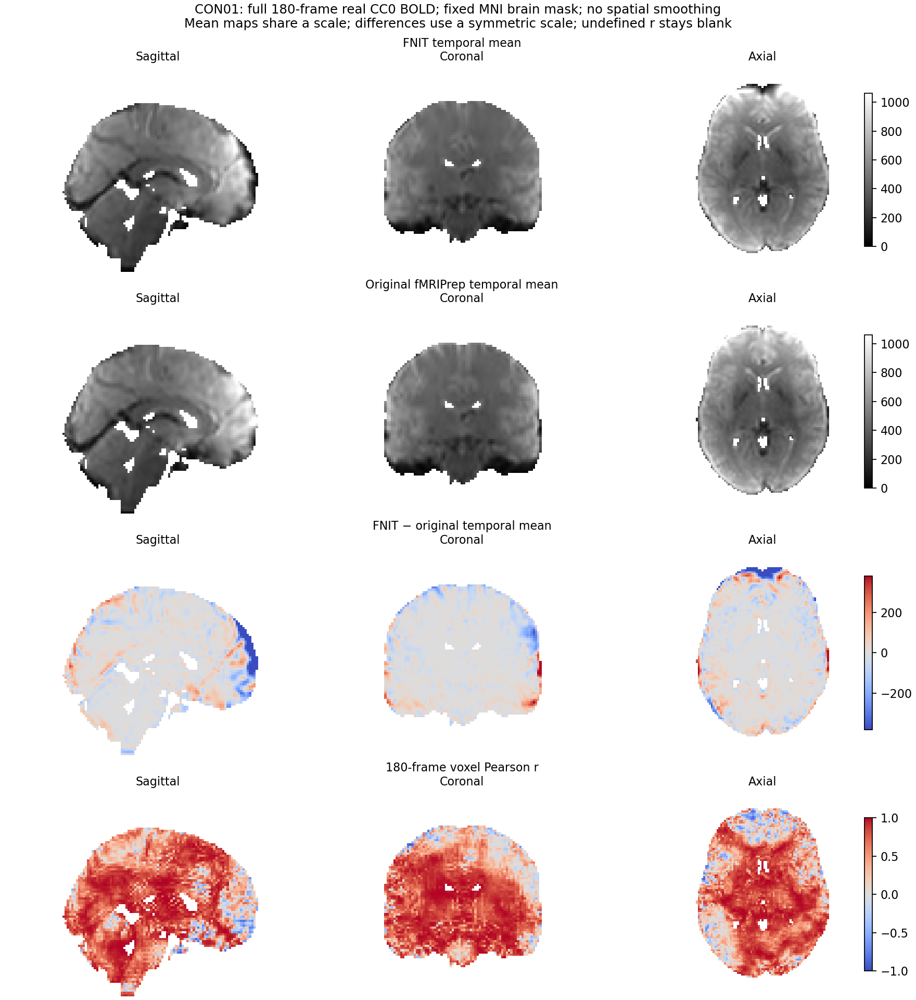
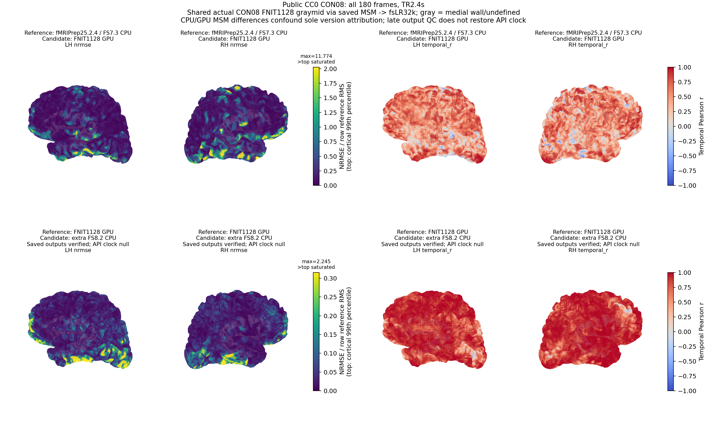

# fMRI 体积流程

## 功能简介与流程图

`fMRIVolume_pipeline` 每次处理一个原始 BIDS BOLD run，同时输出 **preproc** 和 **clean** 两组 BIDS Derivatives。preproc 保留原始强度基线和时间均值，不做 AROMA、混杂回归、高通滤波或 grand-mean scaling；clean 沿用 FEAT 高通、PICA/ICA-AROMA 及可选 WM/CSF/运动等回归。计算使用本包已有 [SynthStrip](../synthstrip/README.md)、[TorchFAST](../fast/README.md)、[TorchMCFLIRT](../mcflirt/README.md)、BBR、SynthMorph/TorchFNIRT 和 [FNIT MELODIC/PICA](../melodic/README.md)，运行时不调用 FSL、FreeSurfer 或 fMRIPrep。

需要同时完成 surface 时，可直接调用 [`fMRISurface_pipeline`](surface.md)，由其只读判断同 run 的 volume 是否完整；完全缺失时自动调用这里的成熟 volume API，随后核验再继续。无需先手动跑 volume。surface 提供 FNIT 完整 recon-all、显式官方 FreeSurfer recon-all 和用户已有目录/ZIP 三个选项；默认 FNIT 重建复用 PyTorch/Numba 与 Conda 独立源码构建节点，只有显式 `freesurfer` backend 执行官方重建命令。完整参数、三种 Python/CLI 示例、复用与许可说明见 [surface 页](surface.md#python-调用输入输出与参数)。

preproc 从原始 BOLD 或其切片时间校正结果出发，将逐帧运动、EPI→T1w BBR 与 T1w→MNI 形变组合后，分别**一次空间插值**得到 T1w 和 MNI 输出。三次 B 样条采用固定 fMRIPrep 25.2.4 的 `grid-constant` 零边界策略；固定变换控制与官方实际产物的验收范围见下文。clean 的最终 MNI 插值保持三次 B 样条 `periodic` 边界和脑掩膜。两类输出使用原始 BIDS TR 并保持全部输入帧。

四个最终空间采样节点随 `registration_backend` 选择公共组件：`fnirt` 调用 [`TorchApplyWarp.run_world` / `apply_world`](../applywarp/README.md)，`synthmorph` 调用 [`apply_transform(WorldTransformChain)`](../synthmorph/README.md)。两者共用原有 world 坐标与样条实现；MNI mask、clean、T1w preproc 和 MNI preproc 的插值、运动组合与 header 规则分别保留。变换对象及独立调用见 [T1→MNI 与公共重采样入口](normalization.md)。

CUDA 默认允许 TF32。主要影像计算与输出为 float32；原始整数 BOLD 的运动校正类型转换见下文。为对齐三次样条采样，grid-constant 的系数和采样坐标使用 float64，中间查询按空间分块，不使用 float16/bfloat16。

自动接入的真实数据预检发现原 ICA-AROMA 掩膜 LAS 与官方 TemplateFlow 模板 RAS 的存储方向不同。volume 已修复这项兼容问题：只在物理网格相同的前提下精确置换／翻转分类掩膜，不插值、不改变掩膜值；原 LAS 输入继续使用原路径。原掩膜逐值恢复验证及版本说明见 [AROMA 更新记录](aroma_confounds.md#最近版本与-benchmark-记录)。



## Python 调用、输入输出与参数

### 输入、安装和模板

在仓库根目录执行 `conda env create -f environment.yml`，激活 `fnit`，再运行 `fnit-setup-weights --model fmri` 获取默认 SynthStrip/SynthMorph 权重。若选 `registration_backend="fnirt"`，只需 SynthStrip 权重。统一准备体积与表面资源：

```bash
fnit-setup-fmri-surface-assets \
  --output-dir /absolute/path/hcp_surface_assets \
  --fmriprep
```

该命令将以下三个文件仅从 TemplateFlow 原站下载至 `hcp_surface_assets/fmriprep/`，检查固定大小和 SHA-256；它们未进入 FNIT Release。HCP 表面文件仍使用经许可的固定 Release 与原站回退。完整文件哈希见[模板清单](../WEIGHTS.md#fmri-templateflow-原站模板)。

| 文件 | 字节数 | 用途 |
|---|---:|---|
| `tpl-MNI152NLin6Asym_res-02_T1w.nii.gz` | 1,412,252 | `mni_template`：标准空间参考与固定输出网格。 |
| `tpl-MNI152NLin6Asym_res-02_desc-brain_mask.nii.gz` | 28,557 | `mni_brain_mask`：与模板同网格的脑掩膜。 |
| `tpl-MNI152NLin6Asym_res-02_atlas-HCP_dseg.nii.gz` | 25,762 | 后续 surface 的 91k CIFTI 皮层下分区。 |

`mni_template` 必须通过 **无损轴重排后的 RAS 网格、仿射与体素内容身份** 检查：接受固定 TemplateFlow MNI152NLin6Asym res-02 的完整 T1w，或其固定脑掩膜版本。其他模板即使具有相同 2 mm 网格也会拒绝，避免把别的标准空间标为 MNI152NLin6Asym。模板的原文件 SHA-256 和身份写入 JSON。`mni_brain_mask=None` 时使用 SynthStrip 提取模板脑掩膜；提供掩膜时需与模板同网格。

原始 BIDS 至少包含以下数据；多 run、echo 或 T1w 候选需明确选择。

| 输入数据 | 格式与作用 |
|---|---|
| `dataset_description.json` | BIDS 数据集描述，位于 `bids_root`；用于验证原始数据集并写出 Derivatives 描述。 |
| `*_bold.nii.gz` | 一个 run 的 4D NIfTI，结构为 X×Y×Z×T；全部帧参与运动估计及两个信号分支。 |
| BOLD JSON | `TaskName` 与有限正数 `RepetitionTime`（秒）；开启 STC 时使用继承的 `SliceTiming`，规则见下文。 |
| 同被试 `*_T1w.nii.gz` | 3D 解剖 NIfTI，用于脑提取、组织分割、BBR 和标准空间配准。 |
| 可选 `*_sbref.nii.gz` | 与 BOLD 同网格的 3D EPI 参考；未提供时采用 BOLD 中间帧。 |
| `mni_template` / 可选 `mni_brain_mask` | 经身份核验的 3D MNI2mm 模板及同网格掩膜，定义标准输出网格。 |

关联的原始 fieldmap 当前会因缺少 fieldmap 估计而明确报错；输出记录无 susceptibility correction，不处理 GDC。

```text
bids/
├── dataset_description.json
└── sub-0001/
    ├── anat/sub-0001_T1w.nii.gz
    └── func/
        ├── sub-0001_task-rest_bold.nii.gz
        └── sub-0001_task-rest_bold.json
```

### 切片时间和信号范围

`slice_timing=False` 默认关闭切片时间校正。显式设置 `slice_timing=True` 时读取继承的 BIDS `SliceTiming`；仅有两个或更多切片时间时执行 Fourier STC，遵循 `SliceEncodingDirection`（含负方向）。`slice_time_reference=0.5` 选择最早与最晚切片时刻之间的中点，目标时间四舍五入到毫秒。切片时间缺失、为空或仅一个值时跳过。

STC **只用于 preproc**。clean 继续使用原有未做 STC 的 FEAT/AROMA 链，其 JSON 明确写 `SliceTimingCorrected=False`。输出删除已不适用的原始 `SliceTiming`，保留原有 `DelayTime`、`AcquisitionDuration`、`VolumeTiming`，并按固定 fMRIPrep 规则推导稀疏采集的时间字段；实际执行 STC 的 preproc 记录 `StartTime` 和使用的方法。此完整入口要求固定 `RepetitionTime`，不会把可变 TR 数据伪装为固定 TR 流程。

### Python 调用与参数

下面示例显式开启三类 clean 混杂回归；三个 `regress_*` 参数的默认值均为 `False`，不影响同时生成的 preproc。

```python
from fnit import fMRIVolume_pipeline

volume_result = fMRIVolume_pipeline(
    bids_root="/absolute/path/bids",                       # 原始 BIDS 根目录
    derivatives_root="/absolute/path/bids/derivatives/fnit", # FNIT BIDS Derivatives 根目录
    subject="0001",                                        # sub 标签，不含 sub-
    mni_template="/absolute/path/hcp_surface_assets/fmriprep/tpl-MNI152NLin6Asym_res-02_T1w.nii.gz", # 经核验的模板
    session=None,                                          # ses 标签；无 session 时为 None
    task="rest",                                           # task 标签；默认 rest
    run=None,                                              # 多 run 时指定 run 标签
    acquisition=None,                                      # acq 标签筛选
    direction=None,                                        # dir 标签筛选
    reconstruction=None,                                   # rec 标签筛选
    echo=None,                                             # echo 标签筛选
    t1w_image=None,                                        # 唯一源 T1w；多张时传其绝对路径
    mni_brain_mask="/absolute/path/hcp_surface_assets/fmriprep/tpl-MNI152NLin6Asym_res-02_desc-brain_mask.nii.gz", # 同网格模板掩膜；默认 None 则提取
    registration_backend="synthmorph",                     # 配准与四个最终采样节点：synthmorph 或 fnirt
    fnirt_config=None,                                     # None 使用 T1 预设；可传预设名或 FNIRTConfig 对象
    synthstrip_weights=None,                               # None 从已配置权重目录解析
    synthmorph_weights=None,                               # None 从已配置权重目录解析
    ica_n_components=None,                                 # None 自动定阶；整数固定成分数
    aroma_mode="nonaggr",                                  # AROMA：nonaggr 或 aggr
    regress_wm=True,                                       # 示例开启白质均值回归；默认 False
    regress_csf=True,                                      # 示例开启脑脊液均值回归；默认 False
    regress_motion=True,                                   # 示例开启运动回归；默认 False
    motion_model=24,                                       # 运动项：6、12 或 24
    bandpass=None,                                         # 可选 (低 Hz, 高 Hz)，用于 clean
    global_signal=False,                                   # clean 是否回归全脑均值
    highpass_cutoff_seconds=100.0,                         # clean FEAT 高通截止周期，秒
    slice_timing=False,                                    # 默认关闭切片时间校正
    slice_time_reference=0.5,                              # STC 目标位于切片采集范围的比例，0–1
    device="cuda:0",                                       # 默认 None 自动选择 CUDA 或 CPU
    batch_size=8,                                          # 组合变换重采样每批帧数；不改变逐帧运动估计
    motion_iterations=(1, 1, 1),                           # 8/4/4 mm 各一次 Brent 坐标优化
    ica_max_iter=500,                                       # ICA 迭代上限
    n_splits=1000,                                         # AROMA 随机抽样次数
    random_state=0,                                        # ICA/AROMA 随机种子
    overwrite=False,                                       # 保护同名全部最终文件与 sidecar
    reuse_anatomical=True,                               # 同一 T1w/模板/配置的解剖结果跨 run 复用
    bbr_execution="batched",                              # batched 批量搜索；reference 串行同算法
    fnirt_execution="optimized",                          # optimized GPU 算子；reference 保留原执行方式
)
print(volume_result.preproc_t1w)  # T1w 空间、原生 BOLD 分辨率的 4D preproc
print(volume_result.preproc_mni)  # MNI152NLin6Asym 2 mm 的 4D preproc
print(volume_result.clean_native) # 原生 EPI clean BOLD
print(volume_result.clean_mni)    # MNI 2 mm clean BOLD
print(volume_result.motion_pull)  # 逐帧 reference→original RAS pull 矩阵
print(volume_result.mni_pull)     # MNI→T1w RAS pull 位移场
```

| 参数 | 含义与默认值 |
|---|---|
| `bids_root` | 原始 BIDS 数据根目录；必填路径。 |
| `derivatives_root` | FNIT BIDS Derivatives 根目录；必填路径。 |
| `subject` | 被试标签，不含 `sub-`；必填字符串。 |
| `mni_template` | 经内容身份核验的 MNI152NLin6Asym 2 mm T1w 模板；必填路径。 |
| `session` | `ses` 标签，默认 `None`；有多个候选时指定。 |
| `task` | `task` 标签，默认 `"rest"`。 |
| `run` | `run` 标签，默认 `None`；多个 run 时指定。 |
| `acquisition` | `acq` 标签筛选，默认 `None`。 |
| `direction` | `dir` 标签筛选，默认 `None`。 |
| `reconstruction` | `rec` 标签筛选，默认 `None`。 |
| `echo` | `echo` 标签筛选，默认 `None`；选择一个 echo，不进行多 echo 联合处理。 |
| `t1w_image` | 默认 `None` 自动选择唯一同被试 T1w；多张时传所选源 T1w 路径。 |
| `mni_brain_mask` | 默认 `None` 用 SynthStrip 提取模板掩膜；可提供与模板同网格的 3D 掩膜路径。 |
| `registration_backend` | 默认 `"synthmorph"`：SynthMorph 配准及 `apply_transform(WorldTransformChain)` 最终采样；`"fnirt"`：TorchFNIRT 配准及 `TorchApplyWarp.run_world` 最终采样。两类 BOLD 共用该配准。 |
| `fnirt_config` | 默认 `None` 使用 T1 预设；可传预设字符串或 `FNIRTConfig` 对象，仅适用于 FNIRT 分支。 |
| `synthstrip_weights` | 默认 `None` 从已配置目录解析；可显式提供原 SynthStrip PT 权重路径。 |
| `synthmorph_weights` | 默认 `None` 从已配置目录解析；可显式提供原 SynthMorph 权重路径，仅 SynthMorph 分支使用。 |
| `ica_n_components` | 默认 `None` 由 PICA 自动定阶；整数指定 clean 分支的成分数。 |
| `aroma_mode` | 默认 `"nonaggr"` 非激进去噪；`"aggr"` 回归噪声成分。 |
| `regress_wm` | 默认 `False`；设为 `True` 在 clean 中回归白质平均信号。 |
| `regress_csf` | 默认 `False`；设为 `True` 在 clean 中回归脑脊液平均信号。 |
| `regress_motion` | 默认 `False`；设为 `True` 在 clean 中联合回归所选运动项。 |
| `motion_model` | 默认 `24`；选择 6、12 或 24 项运动回归模型，仅开启运动回归时使用。 |
| `bandpass` | 默认 `None`；可传 `(低频 Hz, 高频 Hz)`，用于 clean 的额外时间滤波。 |
| `global_signal` | 默认 `False`；设为 `True` 在 clean 中回归脑内平均信号。 |
| `highpass_cutoff_seconds` | 默认 `100.0` 秒；clean FEAT 高通截止周期，体积单位 sigma 为该值除以 `2×TR`。 |
| `slice_timing` | 默认 `False`；设为 `True` 根据有效 BIDS 切片时刻校正 preproc。 |
| `slice_time_reference` | 默认 `0.5`；STC 目标在最早与最晚切片时刻之间的比例，范围 0–1。 |
| `device` | 默认 `None` 自动选择 CUDA 或 CPU；可传 `"cuda:0"` 或 `"cpu"`。 |
| `batch_size` | 默认 `8`；组合变换和标准空间 BOLD 重采样每批帧数。motion-only MCFLIRT 仍逐帧执行，不受此参数影响。 |
| `motion_iterations` | 默认 `(1, 1, 1)`；依次指定 8/4/4 mm 阶段的 Brent 坐标优化轮数。 |
| `ica_max_iter` | 默认 `500`；PICA/ICA 最大迭代数。 |
| `n_splits` | 默认 `1000`；ICA-AROMA 运动相关特征的随机子采样次数。 |
| `random_state` | 默认 `0`；PICA 和 ICA-AROMA 的随机种子。 |
| `overwrite` | 默认 `False`；任一最终产物已存在时拒绝覆盖，`True` 在结果检查后整批替换。 |
| `reuse_anatomical` | 默认 `True`；复用当前被试/会话下匹配输入、资源、配置与源码的解剖缓存。 |
| `bbr_execution` | 默认 `"batched"` 批量搜索；`"reference"` 使用同一算法的串行 cost 路径。 |
| `fnirt_execution` | 默认 `"optimized"` GPU 算子；`"reference"` 使用同一算法的原张量执行路径，仅 FNIRT 分支使用。 |

`highpass_cutoff_seconds`、ICA/AROMA 参数、混杂回归和 bandpass/global signal 作用于 clean 分支。`slice_timing`/`slice_time_reference` 作用于 preproc。`registration_backend`、T1w、模板和运动估计为两类结果共享。更改 `fnirt_config` 仅适用于 `registration_backend="fnirt"`；不在其他后端静默忽略。

### 最终重采样的公共入口

pipeline 内部 `_resample_final_volume` 建立 `WorldTransformChain` 并按后端调用公共组件。它们共用 `fnit._world_resampling.resample_world_image`，源影像只在组合完全部变换后插值一次。原 `fnit.fmri.normalization.resample_world` 保留为其他既有调用的兼容 wrapper。

| 最终节点 | 源影像与目标 | 采样规则 | 逐帧运动 |
|---|---|---|---|
| `mask_mni` | EPI mask→MNI 2 mm | nearest、grid-constant；再阈值并交模板 mask | 不重复应用 |
| `clean_mni` | 已完成 HMC/去噪的 clean→MNI 2 mm | spline、periodic、float64 world；应用输出 mask | 不重复应用 |
| `preproc_t1w` | 原始或 STC BOLD→T1w 原生 BOLD 分辨率 | spline、grid-constant、fmriprep 坐标顺序 | 与固定变换组合 |
| `preproc_mni` | 原始或 STC BOLD→MNI 2 mm | spline、grid-constant、fmriprep 坐标顺序 | 与固定变换组合 |

`WorldTransformChain` 的五个字段为目标 `reference`、RAS world pull 仿射 `reference_to_source_world`、可选目标网格位移 `pre_affine_pull_ras`、可选逐帧矩阵 `motion_pull_world` 和 `coordinate_precision`。具体形状、参数默认值、输出 header 和两种公共函数的完整示例见 [normalization](normalization.md#python-调用输入输出与参数)。这里的 RAS 位移不能直接传给 `TorchApplyWarp` 常规 FSL `warp=` 参数；后者使用 FSL scaled-mm 场或 FNIRT coefficient 契约。

world 分支默认每批 8 帧，查询块默认 262,144 体素，样条系数只沿空间轴计算。它使用此显式 batch 政策，与独立线性 FSL/SynthMorph 采样器的自动通道政策分别定义。

运动校正直接调用独立 [`TorchMCFLIRT`](../mcflirt/README.md)：8/4/4 mm 三阶段、原 NCC 目标、相邻帧初值传播，最终 Constant 三次样条采样。`motion_iterations` 现在表示每阶段坐标优化轮数，默认 `(1,1,1)`，对应原 MCFLIRT 默认。原始 uint16 BOLD 的校正值先按 NEWIMAGE 向零截断为 int32，再转 float32 进入 FEAT。命令行对应 `--motion-iterations 1 1 1`。

解剖组织分割使用 [`TorchFAST(execution="fsl")`](../fast/README.md)，保留原 FAST 的 radiological 扫描方向、原位邻域更新、连续随机流与偏置场估计。独立 FAST 默认仍是兼容的 `tensor` 路径，pipeline 显式选择 `fsl`；实际配置写入输出 JSON，代码变更也会使旧解剖缓存失效。

`fnirt_config` 可传 `"default"`、`"gm"`、`"t1"`、`"tbss"` 或 `FNIRTConfig` 对象；完整 T1 配准默认 `"t1"`。配置对象的字段见 [FNIRT](../fnirt/README.md)。CLI 使用 `--fnirt-preset` 选择预设，不接收配置对象或原 FSL `.cnf` 路径。

<a id="输出"></a>

### 输出结构与来源

以 `sub-0001_task-rest` 为例，`derivatives_root/dataset_description.json` 声明 BIDS Derivatives 数据集，下列路径位于 `sub-0001/`。有 session 时增加 `ses-<label>/`；保留源 BOLD 的 task、acq、dir、run、echo 等实体。BOLD 为 float32 的 X×Y×Z×T，掩膜为 3D 二值图。

| 路径（省略 `sub-0001/`） | 内容 |
|---|---|
| `func/sub-0001_task-rest_space-T1w_res-native_desc-preproc_bold.nii.gz` | 源 T1w scanner-RAS 空间的 preproc；体素尺寸取原生 BOLD 分辨率，FOV 依 T1w 脑掩膜包围盒生成。用于默认 surface 皮层投影。 |
| `func/sub-0001_task-rest_space-MNI152NLin6Asym_res-2_desc-preproc_bold.nii.gz` | 原始或 STC BOLD 经组合变换直接一次采样到固定 MNI 2 mm 网格；用于默认 surface 的皮层下信号。 |
| `func/sub-0001_task-rest_space-boldref_desc-clean_bold.nii.gz` | 原生 EPI 参考网格的 clean BOLD，保留 FEAT/AROMA 和选定回归。 |
| `func/sub-0001_task-rest_space-MNI152NLin6Asym_res-2_desc-clean_bold.nii.gz` | MNI clean BOLD，使用三次样条 periodic 和输出脑掩膜；mask 外为零。 |
| `func/sub-0001_task-rest_space-MNI152NLin6Asym_res-2_desc-brain_mask.nii.gz` | MNI 网格脑掩膜。 |
| `func/sub-0001_task-rest_from-boldref_to-T1w_mode-image_xfm.txt` | EPI reference→T1w 的 FSL FLIRT 4×4 BBR 矩阵。 |
| `func/sub-0001_task-rest_from-boldref_to-orig_mode-image_desc-pull_xfm.npy` | T×4×4 世界 RAS pull 矩阵：每帧从 reference RAS 映射到原始帧 RAS，单位毫米。 |
| `func/sub-0001_task-rest_from-MNI152NLin6Asym_to-T1w_mode-image_desc-pull_xfm.nii.gz` | MNI 网格的 X×Y×Z×3 RAS 位移场；在 MNI 世界坐标上加此位移得到源 T1w 世界坐标。 |
| `anat/sub-0001_desc-brain_T1w.nii.gz` | SynthStrip 提取的源 T1w 脑图；与该 T1w 同网格。 |

T1w preproc 的 `res-native` 表示 **原生 BOLD 分辨率**，几何采用 T1w scanner-RAS。它不要求与全尺寸 T1w 脑图拥有相同体素网格。对 MNI 目标点，采样依次使用 MNI→T1w pull、BBR 逆变换、该帧 motion pull 和原始 BOLD 的世界到体素变换；只在最后一步对 BOLD 插值。

四个 BOLD、脑掩膜和 T1w 脑图附 JSON，BBR 和 motion 矩阵另有来源 JSON。BOLD metadata 包含原始 TR、BIDS 来源、实际 STC、回归范围、模板身份与 SHA-256、配准后端和耗时；preproc 使用 `FNIT.Signal="preproc"`、`Interpolation/MNIInterpolation="cubic-bspline-grid-constant"`，clean 使用 `FNIT.Signal="clean"`、`MNIInterpolation="cubic-bspline-periodic"`。preproc 不减时间均值，其均值图保留强度基线；clean 做带截距回归时的时间均值可能接近零，两类结果应按其处理定义使用。

`FMRIVolumeResult` 返回 `clean_native`、`clean_mni`、`mask_mni`、`t1_brain`、`bbr_matrix`、MNI clean JSON 的 `metadata`、`timing_seconds`，以及 `preproc_t1w`、`preproc_mni`、`motion_pull`、`mni_pull`。全部最终文件和 JSON 在结果生成后整批发布，发布失败回滚旧文件。FEAT/PICA/AROMA 中间文件仅保存在运行时临时目录。

共享 `publish_derivatives` 已修复覆盖保护：`overwrite=False` 拒绝已有文件和悬空符号链接，发布时并发出现同名文件也会触发回滚；输出位置若是目录会被拒绝。显式选择链接到外部存储的 T1w 时，保留它在 BIDS 内的逻辑路径，确保输出命名与 `Sources` 正确。

`FNIT.Configuration` 记录本次全部处理参数、FAST 配置、模板与权重位置；`FNIT.Denoising` 记录 ICA-AROMA 模式与完成状态；`FNIT.Source` 记录 Python 源码清单 SHA-256 和 PyTorch、NumPy、nibabel、SciPy 版本。资源内容另由安装器和 benchmark 校验。WM/CSF 回归关闭时不生成对应原生掩膜，BBR 所需 T1 白质分割仍会生成。

`reuse_anatomical=True` 默认把 T1 SynthStrip、FAST、模板提取与 T1→MNI 结果保存在当前被试/会话 `anat/.fnit_anatomical/` 的内部缓存；BIDS 的公开输出仍采用上表命名。缓存核验输入、模板/掩膜、权重、配置、执行模式、实现源码及计算环境，每个输出再校验 SHA-256；改变其中任意一项会重新计算。缓存不完整或文件损坏时会重建。BBR、EPI 脑提取和 BOLD 处理仍按 run 运行。`reuse_anatomical=False`（命令行 `--no-anatomical-cache`）强制重新计算解剖步骤；`overwrite` 不负责清空缓存。

计时 JSON 分别记录 `bbr_initial_flirt`、`bbr_refinement`、`bbr_final_resampling`、`t1_to_mni_affine`、`t1_to_mni_nonlinear`、`warp_conversion` 和 `mni_resampling`。命中缓存时，已复用的计算阶段记为 0，校验与等待时间记为 `anatomical_cache_lookup`，报告的 `anatomical_cache.reused` 为 true。`total` 是此次调用至最终暂存结果与 JSON 生成前的实际墙钟，包含初始化、校验、导入及加载；末尾最终 BIDS 文件复制和 JSON 写盘在该计时外。FEAT、PICA、AROMA 文件仍使用临时工作目录。表面处理随后调用 [`fMRISurface_pipeline`](surface.md)。

`bbr_execution="reference"` 和 `fnirt_execution="reference"` 用于逐项回归，选择同一算法的串行成本/原张量算子；它们保留当前坐标、边界与优化流程的修正。CLI 对应 `--bbr-execution`、`--fnirt-execution`。后者只在 `registration_backend="fnirt"` 时可切换。

WM/CSF 概率图投到 EPI 网格时，使用本包 `TorchFLIRT.applyxfm` 的默认降采样预滤波与三线性采样，再以概率≥0.8 交 EPI 脑掩膜。JSON 中 `FNIT.TissueInterpolation="flirt-trilinear-prefilter-float32-coordinates"` 标明这一步；坐标按 float32 逐项计算，其余 CUDA 计算仍默认允许 TF32。

旧 volume 没有新增 preproc 或模板身份字段时，需重新运行当前 volume；不能仅改文件名或 JSON 把 clean 伪装为 preproc。可选择新的 `derivatives_root`，或在确认覆盖范围后设置 volume 的 `overwrite=True`/`--overwrite`。surface 的 `overwrite` 不授权覆盖 volume。默认 surface 使用 preproc，显式选择 clean 时同时核验原生/MNI clean 的来源 JSON、TR 与 ICA-AROMA 完成状态；缺 preproc 不自动退到 clean。

新 surface 入口的 `inspect_surface_volume` 检查来源、逻辑 T1w、模板声明/可提供的实际模板哈希、真实分辨率、TR/完整帧数、MNI/dseg 网格和逐帧有限值。仅该 run 全部 volume 影像、变换及 sidecar 全无时允许自动运行；已有 clean、残留变换或 sidecar 均不算未做。`partial/invalid` 会明确报错并保留文件；可用 `auto_volume=False`（CLI `--require-volume`）关闭自动处理。无 volume 时多个 T1w 必须显式指定 `t1w_image`，已有 volume 时该参数必须与记录的 `SourceT1w` 相符。自动 volume 的其余科学参数通过 `volume_options` 传入；默认模板为 surface assets 内固定 MNI6 res-2 T1w，无法改写所选 run、T1w 或 device。重建缺中层面时采用真实 `mris_expand -thickness ... 0.5 ...`，provided 输入先复制后补面，不修改原目录或 ZIP。

## 命令行调用

<a id="命令行与原版参考"></a>

```bash
fnit-fmri volume \
  --bids-root /absolute/path/bids \
  --derivatives-root /absolute/path/bids/derivatives/fnit \
  --subject 0001 \
  --mni-template /absolute/path/hcp_surface_assets/fmriprep/tpl-MNI152NLin6Asym_res-02_T1w.nii.gz \
  --mni-brain-mask /absolute/path/hcp_surface_assets/fmriprep/tpl-MNI152NLin6Asym_res-02_desc-brain_mask.nii.gz \
  --regress-wm --regress-csf --regress-motion \
  --slice-time-reference 0.5 \
  --device cuda:0
```

CLI 默认关闭 STC；`--slice-timing` 显式开启，`--ignore-slice-timing` 显式保持关闭。其他选项与 Python 参数对应，见 `fnit-fmri volume --help`。

| Python 参数 | CLI 选项及区别 |
|---|---|
| `registration_backend` | `--registration-backend synthmorph/fnirt`；同时选择配准及四个最终公共采样节点，选项名称未变。 |
| `fnirt_config` | `--fnirt-preset default/gm/t1/tbss`；仅 FNIRT 分支使用。 |
| `reuse_anatomical=True` | 默认开启；`--no-anatomical-cache` 对应 `False`。 |
| `device=None` | Python 自动选择 CUDA/CPU；CLI 默认 `--device cuda:0`。 |
| `bandpass=(low, high)` | `--bandpass LOW_HZ HIGH_HZ`。 |
| `motion_iterations=(1,1,1)` | `--motion-iterations 1 1 1`，依次指定三个阶段的轮数。 |

其余选项将 Python 参数中的下划线改为连字符；布尔选项如 `--regress-wm`、`--overwrite` 传入即为 True。CLI 每次同时生成 preproc 和 clean，不以 `--signal` 选择 volume 分支；`--signal` 仅用于 surface。

## 原软件调用

原软件在独立参照环境运行。preproc 与 clean 有不同的参照协议：preproc 对照固定 fMRIPrep 25.2.4 的运动/配准/单次插值，clean 对照原 SynthStrip、FSL 和作者 ICA-AROMA 的同步骤连续链。

### preproc：原 fMRIPrep volume-only（历史控制）

以下示例使用已准备好的同源 FreeSurfer subjects，关闭 STC/SDC，保留全部帧，显式关闭 MSM 和 CIFTI。镜像、实际配置与完成记录见[固定参考](../../validation/fmri/fmriprep/reference_image.public.json)和[官方 volume-only 报告](../../validation/fmri/fmriprep/reference_volume_stcoff_no_msm.public.json)。

```bash
original_bids_root=/absolute/path/bids                 # 原始 BIDS
reference_derivatives_root=/absolute/path/reference  # 新的参照输出目录
reference_subjects_root=/absolute/path/subjects      # 已完成的同源 FreeSurfer subjects
freesurfer_license_path=/absolute/path/license.txt    # 用户自行取得的许可
reference_work_root=/absolute/path/reference-work    # 新的工作目录

fmriprep "$original_bids_root" "$reference_derivatives_root" participant \
  --participant-label 0001 \
  --fs-subjects-dir "$reference_subjects_root" \
  --fs-license-file "$freesurfer_license_path" \
  --output-spaces T1w MNI152NLin6Asym:res-2 \
  --no-msm --ignore fieldmaps slicetiming --dummy-scans 0 \
  --nprocs 8 --omp-nthreads 8 --mem-mb 19000 --random-seed 0 \
  --work-dir "$reference_work_root"
```

当前本轮的完整原软件参考还开启`--msm --cifti-output 91k`，并显式选择固定官方newMSM，每侧线程数仅写入配置；镜像内完整volume和surface一次运行。实际命令、原始输入SHA及完整产物检查见[本轮端到端报告](../../validation/fmri/e2e_latest/README.md)。另有从原始BOLD组合运动、BBR和FNIRT、单次`applywarp`生成preproc的同步骤原FSL参照，不能与此volume-only历史控制混称。

### clean：原 SynthStrip/FSL/ICA-AROMA 同步骤

| 阶段 | FNIT 对应步骤 | 对应原命令/操作 |
|---|---|---|
| EPI/T1 脑提取 | 本包 `SynthStrip`，border=1、原 PT 权重 | `mri_synthstrip -i INPUT -o BRAIN -m MASK` |
| T1 组织/bias | `TorchFAST(execution="fsl")`，三类 T1，无先验 | `fast -t 1 -n 3 -I 4 -W 15 -O 4 -f 0.02 -l 20 -H 0.1 -R 0.3 -b -B` |
| 运动 | 直接 `TorchMCFLIRT.run`；8/4/4 mm、原 NCC、Brent、相邻帧初值、Constant 样条 | `mcflirt -in BOLD -reffile SBREF -mats -plots -rmsrel -rmsabs -spline_final` |
| 强度缩放/高通 | `grand_mean_scale`、`gaussian_highpass` | mask 内 p50 缩放至 10000；`fslmaths -bptf 68.0272108844 -1 -add temporal_mean` |
| T1→MNI | 本包 FLIRT、T1 preset FNIRT | FLIRT 12 DOF corratio；FNIRT `T1_2_MNI152_2mm.cnf` |
| EPI→T1 BBR | 本包 normmi FLIRT 初值、WM PVE≥0.5、BBR | `flirt -dof 6 -cost bbr -wmseg ... -init ... -schedule bbr.sch` |
| EPI WM/CSF | 本包 `TorchFLIRT.applyxfm`，逆 BBR、默认降采样预滤波，PVE≥0.8 | `flirt -applyxfm -init T1_to_EPI.mat -interp trilinear`，阈值并交 EPI mask |
| PICA | 本包 `decompose_spatial_ica`，Laplace/pow3、seed=0 | `melodic --nobet -m MASK -d 0 --dimest=lap --nl=pow3 --eps=0.001 --seed=0 --maxit=500 --Ostats --mmthresh=0.5` |
| ICA-AROMA | 本包原特征规则及 nonaggr | 作者分类函数与 `fsl_regfilt` |
| 联合混杂回归 | 截距、线性/二次趋势、WM/CSF 和 Friston-24，29 列 | 独立 NumPy 去均值/L2 归一化、rank rcond=1e-8 的 SVD 投影 |
| MNI 最终重采样 | FNIRT 分支 `TorchApplyWarp.run_world`；SynthMorph 分支 `apply_transform(WorldTransformChain)`，均为周期边界三次 B 样条 | `applywarp --in=CLEAN --ref=MNI --premat=BBR --warp=FNIRT --interp=spline`；当前周期系数边界与官方 Constant/extraslice 有差异。 |

表中参数对应真实 490 帧、TR 0.735 s、100 秒高通、nonaggr AROMA、WM/CSF/Friston-24 联合回归。完整输入变量、原软件版本、退出码与连续驱动见[原命令和数据协议](../../validation/fmri/matched_native.md#数据协议与原命令)；复测当前候选见[本轮端到端方法](../../validation/fmri/e2e_latest/README.md)。联合回归是独立 NumPy SVD 参照，不能将这套 clean 链称为完整原 fMRIPrep 或 UKB FIX。

<a id="全流程-benchmark"></a>

<a id="latest-real-benchmark"></a>

## 最新真实数据精度、耗时与脑图

最终[发布验证汇总](../../validation/fmri/public_ten_20261003/final_publication_validation.public.json)绑定 10 例候选、10 例原流程完整输出、210 个结构比较、主队列 80 个完整自交扫描及额外 CON08 的已测量范围与未完成预算；执行完成和数值差异分别记录。

### 新完整流程：正式十例全部执行完成

正式 `1128bc52` 已从 raw T1w/BOLD 完成 CON01/CON03/CON04/CON05/CON06/CON07/CON08/CON09/CON10/CON11 的自动 volume、FNIT 完整重建、MSMSulc 和最终 surface，并完成独立全帧配对。数据固定 ds001226 v5.0.1、CC0、CON01/03–11，每例完整 180 帧，TR 2.1 或 2.4 s；CON02 沿用既有 dMRI 队列选择，不是本轮 T1w/BOLD 质量排除。[16:49:42 gpucw1 host-clock 快照](../../validation/fmri/public_ten_20261003/paired_batches/v12_batch_007/runtime_snapshot.public.json)显示正式执行完成 **10/10**、全帧配对比较 **10/10**，FNIT 10 complete／0 running／0 pending；参考 10 例 strict corrected 已齐。十例完整队列已全部执行并保存全帧比较；初始两例、首四例及旧 v2/v3 快照保持原字节。 `complete` 表示执行与全帧统计完成，尚未建立两条实现的等价性；CON07 候选、CON09 参考及 CON10 双方的球面质量异常分别保留。

十例 FNIT API 的中位墙钟为 **4,604.252 s（76.738 min）**，queue 完整进程中位数为 **4,621.708 s**；原参考容器进程中位数为 **12,288.721 s**。自动 volume（含 ICA/AROMA clean）、完整重建 adapter、MSMSulc 的逐病例中位数分别为 254.317、4,170.757、120.288 s，阶段有嵌套和并行，不能相加重造整例墙钟。MNI volume 的平均时间 r 在十个病例中的中位数为 **0.545735**（范围 0.488992–0.626175），全域 NRMSE 中位数为 **22.394%**（范围 15.402%–31.917%）。91k CIFTI 的平均时间 r 在十个病例中的中位数为 **0.724853**（范围 0.531948–0.776488），全域 NRMSE 中位数为 **8.904%**（范围 7.546%–16.103%）。这些是十个病例指标的等权统计；空间 P05–P95 另列，不作为置信区间。不同硬件、线程及工作范围的时长分别报告；完整执行没有建立数值或几何等价。

两套流程从同一公开 raw T1w/BOLD 开始，完整保留 180 帧。FNIT 使用固定 FreeSurfer 8.2 算法的独立重建节点与 FNIRT；官方 fMRIPrep 25.2.4 使用 FreeSurfer 7.3.2 与 ANTs。FNIT 自动 volume 即使 surface 选 preproc，仍计算 ICA/AROMA clean 并保存四个 volume；官方不做 BOLD 去噪，但实际额外运行内部 MNI152NLin2009cAsym 解剖配准。主要精度只比较原值 preproc 和对应 CIFTI，不拟合尺度、偏移或追加平滑。preproc 不经过 FEAT 的中位数 10,000 缩放/高通或 FNIRT Jacobian；FEAT 处理进入 clean 分支。

| 全 180 帧 / MNI 固定脑域 | 自动 volume（含 clean） | 时间 r 均值 / 中位数 | RMSE / 参考 RMS | NRMSE | 时间均值偏差 / 平均绝对偏差 |
|---|---:|---:|---:|---:|---:|
| CON01 | 281.436 s | 0.534949 / 0.647000 | 88.073 / 544.637 | 16.171% | -5.213 / 43.671 |
| CON03 | 286.029 s | 0.626175 / 0.751793 | 104.381 / 639.710 | 16.317% | -2.128 / 50.768 |
| CON04 | 258.639 s | 0.563780 / 0.675255 | 137.534 / 578.607 | 23.770% | -16.734 / 64.729 |
| CON05 | 263.915 s | 0.593894 / 0.724368 | 106.657 / 692.483 | 15.402% | -3.057 / 50.838 |
| CON06 | 196.621 s | 0.488992 / 0.579080 | 191.244 / 599.183 | 31.917% | -33.388 / 86.267 |
| CON07 | 241.046 s | 0.547697 / 0.662246 | 158.675 / 637.936 | 24.873% | -19.214 / 69.203 |
| CON08 | 249.995 s | 0.532360 / 0.644862 | 165.738 / 558.348 | 29.684% | -17.742 / 77.034 |
| CON09 | 243.477 s | 0.505292 / 0.606955 | 139.660 / 616.382 | 22.658% | -15.515 / 66.452 |
| CON10 | 247.119 s | 0.547657 / 0.679659 | 117.793 / 635.801 | 18.527% | -8.910 / 56.113 |
| CON11 | 277.364 s | 0.543812 / 0.647152 | 125.554 / 567.354 | 22.130% | -14.242 / 59.042 |

比较固定 MNI152NLin6Asym 2 mm 掩膜全 **228,483** 体素，双方全部帧、TR、float32/mm/sec 与物理网格通过；仅无损索引方向重排，未追加插值。NRMSE=RMSE/参考全点全帧 RMS；原值、零/常数、绝对差 mean/P99/max、tSNR、全部 21 结构 CIFTI 与输出/source SHA 均在 [CON01](../../validation/fmri/public_ten_20261003/paired_batches/v12_batch_007/CON01.public.json)／[CON03](../../validation/fmri/public_ten_20261003/paired_batches/v12_batch_007/CON03.public.json)／[CON04](../../validation/fmri/public_ten_20261003/paired_batches/v12_batch_007/CON04.public.json)／[CON05](../../validation/fmri/public_ten_20261003/paired_batches/v12_batch_007/CON05.public.json)／[CON06](../../validation/fmri/public_ten_20261003/paired_batches/v12_batch_007/CON06.public.json)／[CON07](../../validation/fmri/public_ten_20261003/paired_batches/v12_batch_007/CON07.public.json)／[CON08](../../validation/fmri/public_ten_20261003/paired_batches/v12_batch_007/CON08.public.json)／[CON09](../../validation/fmri/public_ten_20261003/paired_batches/v12_batch_007/CON09.public.json)／[CON10](../../validation/fmri/public_ten_20261003/paired_batches/v12_batch_007/CON10.public.json)／[CON11](../../validation/fmri/public_ten_20261003/paired_batches/v12_batch_007/CON11.public.json) 报告。当前实际差异不能支持近等价。

| 病例（全部 180 帧） | FNIT queue 完整进程 | FNIT API | FNIT 至保存验证 | 原容器进程 | 原 wrapper | 原 wrapper QC | 独立补检 QC |
|---|---:|---:|---:|---:|---:|---:|---:|
| CON01 | 4,921.688 s | 4,904.868 s | 4,916.531 s | 11,738.532 s | 11,812.228 s | original filename-check failed | 8.229 s |
| CON03 | 4,422.618 s | 4,405.173 s | 4,416.981 s | 11,580.622 s | 11,653.293 s | original filename-check failed | 7.195 s |
| CON04 | 4,214.446 s | 4,197.878 s | 4,209.593 s | 10,982.994 s | 11,056.696 s | original filename-check failed | 6.923 s |
| CON05 | 4,755.978 s | 4,739.115 s | 4,751.051 s | 12,259.018 s | 12,334.254 s | original filename-check failed | 8.213 s |
| CON06 | 4,539.839 s | 4,522.408 s | 4,534.181 s | 12,474.838 s | 12,548.969 s | original filename-check failed | 8.261 s |
| CON07 | 4,997.480 s | 4,980.582 s | 4,992.677 s | 11,803.857 s | 11,878.075 s | original filename-check failed | 7.935 s |
| CON08 | 4,175.742 s | 4,158.997 s | 4,170.689 s | 12,318.424 s | 12,394.508 s | original QC passed | 8.207 s |
| CON09 | 5,150.091 s | 5,133.078 s | 5,145.080 s | 12,796.919 s | 12,874.742 s | original QC passed | 9.162 s |
| CON10 | 4,703.576 s | 4,686.097 s | 4,698.249 s | 13,579.763 s | 13,656.370 s | original QC passed | 8.269 s |
| CON11 | 4,302.528 s | 4,285.483 s | 4,297.407 s | 12,733.820 s | 12,809.904 s | original QC passed | 7.373 s |

自动 volume 是整 API 的嵌套阶段，整链还包括真实新重建与 surface。queue 包含导入、初始化和报告；API 从导入/CUDA 初始化后调用开始至最终同步；保存验证列延续同一起点，但尚未包含 monitor join、最终源码检查/报告保存。参考容器从启动至退出独立计时；CON01/CON03/CON04/CON05/CON06/CON07 原 wrapper 在文件实体顺序检查处 failed，CON08/CON09/CON10/CON11 原 wrapper QC passed，各原始报告和连续时钟保持原字节；后续 strict QC 独立计时。[全部实际边界与分步骤](../../validation/fmri/public_ten_20261003/README.md#整例计时与实际边界)保留三个 FNIT 时钟、两个参考时钟和后验 QC。FNIT 在共享 H100、官方十例在独立 CPU 节点；ICA/AROMA 和内部额外模板工作范围不同，不由时间比声称通用加速。

完整任务树每 2 秒显存采样最大观测：CON01/CON03/CON04/CON05/CON08/CON09/CON10/CON11 为 **17,332,961,280 B（17.333 GB）**；CON06/CON07 为 **17,632,854,016 B（17.633 GB）**。已完成十例均无采样错误，raw/config/driver/source 守卫通过；该值是成功采样的最大观测，未覆盖采样间隙。



双方均值同一色阶，差值对称，r 为 −1 至 1；固定脑内掩膜不显示头面。[CON03 图](../../validation/fmri/public_ten_20261003/paired_batches/v12_batch_007/figures/CON03_mni_mean_difference.png)与[图来源/输出 SHA](../../validation/fmri/public_ten_20261003/paired_batches/v12_batch_007/figures_provenance.public.json)公开，后验比较和绘图时间排除于生产 benchmark。全队列及真实皮层图见 [surface 当前结果](surface.md#新的三-backend-完整整链验收进行中)。


[全21结构明细CSV](../../validation/fmri/public_ten_20261003/paired_batches/v12_batch_007_tables/structures.csv)和[FNIT步骤与双方独立时钟CSV](../../validation/fmri/public_ten_20261003/paired_batches/v12_batch_007_tables/timings.csv)绑定[来源/输出SHA](../../validation/fmri/public_ten_20261003/paired_batches/v12_batch_007_tables/tables_provenance.public.json)，保留十例全部210个实测结构及此前未测历史。 [原参考节点union/span CSV](../../validation/fmri/public_ten_20261003/paired_batches/v12_batch_007_tables/reference_stages.csv)另列活动区间与实际资源未测范围，不与整例或其它组相加。

[CON04 MNI 图](../../validation/fmri/public_ten_20261003/paired_batches/v12_batch_007/figures/CON04_mni_mean_difference.png)、[CON04 皮层图](../../validation/fmri/public_ten_20261003/paired_batches/v12_batch_007/figures/CON04_cortical_temporal_r.png)、[CON05 MNI 图](../../validation/fmri/public_ten_20261003/paired_batches/v12_batch_007/figures/CON05_mni_mean_difference.png)和[CON05 皮层图](../../validation/fmri/public_ten_20261003/paired_batches/v12_batch_007/figures/CON05_cortical_temporal_r.png)来自各自完整 180 帧；[当前自动收集 dispatch](../../validation/fmri/public_ten_20261003/paired_batches/v12_batch_007/dispatch.public.json)绑定十例报告、配置与完整图清单的 SHA。


[CON06 MNI 图](../../validation/fmri/public_ten_20261003/paired_batches/v12_batch_007/figures/CON06_mni_mean_difference.png)和[CON06 皮层图](../../validation/fmri/public_ten_20261003/paired_batches/v12_batch_007/figures/CON06_cortical_temporal_r.png)来自该例完整 180 帧，皮层显示几何共用正式 CON01，颜色为该例自己的 CIFTI。


[CON07 MNI 图](../../validation/fmri/public_ten_20261003/paired_batches/v12_batch_007/figures/CON07_mni_mean_difference.png)和[CON07 皮层图](../../validation/fmri/public_ten_20261003/paired_batches/v12_batch_007/figures/CON07_cortical_temporal_r.png)来自该例完整 180 帧，皮层显示几何共用正式 CON01，颜色为该例自己的 CIFTI。

独立原生重建后验另保留新增病例的差异：[CON06](../../validation/fmri/public_ten_20261003/reconstruction_completed/CON06.public.json) ribbon 宏 Dice 0.912873、厚度 MAE 左/右 0.125824/0.153235 mm；[CON07](../../validation/fmri/public_ten_20261003/reconstruction_completed/CON07.public.json) 左 native sphere / sphere.reg / 最终保存 MSMSulc 球面实测绝对向外负面积面数为 28/23/26，右侧与参考双侧为 0。后验相对 native 基线为 2 个方向翻转面、最小 ratio −96.878214；生产相对 rotated 基线另记录最后 native 插值后、保存 cast 前的 folded_solver_faces=0、minimum ratio=0.684196，以及保存 FP32 folded=1、minimum ratio=−0.808071；前一字段名中的 solver 指 native 保存前数组，不是 DATA/control 优化网格阶段。涉及的两个面均由基线向内变为保存后向外，这些 relative folded 计数不能解读为新增绝对向内面；未保存的 native 保存前坐标不能恢复其绝对向内面数，见[逐面方向和重建基线诊断](../../validation/fmri/public_ten_20261003/reconstruction_completed/CON07.sphere-orientation-baseline.public.json)。完整有限的 fMRI 输出仍纳入上述统计；这些几何异常和自交预算未完成状态独立保留，不能将前例的零 fold 概括为全队列质量通过。

[同 raw CON01 的独立版本诊断](../../validation/fmri/public_ten_20261003/reconstruction_completed/CON01.csf-version-diagnostic.public.json)实测标签 24：FNIT/原 FreeSurfer 8.2 硬计数 337,192/337,193 体素、PV 325,714.2/325,658.8 mm³；原 fMRIPrep 内 FreeSurfer 7.3.2 为 776 体素、810.3 mm³。该单例保留不同实现的原分割域，只比较已保存标签与统计，不替代十例 7.3.2 参考，也不据此声称跨版本等价。

独立[完整自交追加检查](../../validation/fmri/public_ten_20261003/self_intersection_scan.md)已对CON01/03–11 十例共 **80 张 white/pial 网格全部完成**，均未检出自交面或标记顶点，逐网格来源守卫通过，见[完整十例来源汇总](../../validation/fmri/public_ten_20261003/self_intersection_complete/cohort.public.json)；该结果与两层间的阳性横穿、球面方向异常分别报告。CON07 的异常规模及其实际 graymid 上的纯脑图见[球面质量诊断](../../validation/fmri/public_ten_20261003/CON07_sphere_quality_diagnostic.md)，诊断未改原件，独立 CPU 15.504451 s 不计入生产时钟。


[CON08 MNI 图](../../validation/fmri/public_ten_20261003/paired_batches/v12_batch_007/figures/CON08_mni_mean_difference.png)和[CON08 皮层图](../../validation/fmri/public_ten_20261003/paired_batches/v12_batch_007/figures/CON08_cortical_temporal_r.png)来自该例完整 180 帧，皮层显示几何共用正式 CON01，颜色为该例自己的 CIFTI。


CON08 的独立解剖对照也有较大差异：ribbon 非背景宏 Dice 为 0.702521，左右 aparc 区域厚度 MAE 为 0.283/0.449 mm，见[完整重建对照](../../validation/fmri/public_ten_20261003/reconstruction_comparison.md)。原生及已注册球面方向检查、保存坐标核验与 BOLD 指标分别记录；当前结果未将较低时间 r 归因于单个步骤。

额外同 raw CON08 的 FS8.2 冷重建和完整 CPU surface 复用 formal-v4 已完成的 volume；原独立驱动在产物检查后序列化 Path 时失败，[原 failed 报告](../../validation/fmri/public_ten_20261003/backend_CON08_freesurfer82_cpu1128_original_reporter_failed.public.json)保持不变。[独立晚复核](../../validation/fmri/public_ten_20261003/backend_CON08_freesurfer82_cpu1128_late_saved_outputs.public.json)已检查全部 180 帧/TR2.4、21 个 CIFTI 结构及完整产物，额外 7.458315 s；完整 API 与返回 total 仍为 null，不能用 7,952.462965 s 驱动失败墙钟或 7,948.804876 s 保存前内部时间补造。

[该 CPU 产物与正式 FNIT GPU 的完整同轴时序比较](../../validation/fmri/public_ten_20261003/backend_CON08_freesurfer82_cpu_vs_fnit_gpu_saved_timeseries.public.json)实测 91k NRMSE **4.583386%**（除以 FNIT reference RMS）、定义时间 r 均值 **0.933849**；左/右皮层 NRMSE 为 5.492133%/4.566258%，时间 r 均值 0.885776/0.910186，19 个皮层下结构逐值相同。CPU/GPU 设备与线程范围同时不同，不能只归因于重建版本；比较和晚复核为独立后验时钟，不计入生产。这项单例补充不替换十例 FS7.3.2 主参考，[完整边界与步骤](../../validation/fmri/public_ten_20261003/backend_demos.md)另列；额外解剖对照也已保存，见下述实际报告。

同一 raw T1 的[额外 FS8.2/FNIT 解剖报告](../../validation/fmri/public_ten_20261003/standalone_FS82_reconstruction/CON08.public.json)及[摘要](../../validation/fmri/public_ten_20261003/standalone_FS82_reconstruction/CON08.summary.public.json)记录 aseg、aparc、wmparc、ribbon 非背景标签宏平均 Dice 为 **0.998778、0.970045、0.961796、0.987644**；双侧各 34 个 aparc 区域的平均厚度 MAE 为 **0.013029/0.026118 mm**，white/pial 双向顶点到完整三角面距离的均值为 **0.0457–0.0511 mm**。没有拟合新配准；各自 orig001 与同一 raw 的像素、scanner 网格及前后 SHA 均核验。独立 CPU 后验耗时 **352.732 s**，不计生产时间。双方 native sphere/sphere.reg 的 8 份球面均无负面、零面积或非有限值；white/pial 真横穿对数为 FS8.2 **21/22**、FNIT **19/22**。这项额外对照的 8 个 white/pial 自交扫描全部因 2000 万候选预算未完成，保留 `partially_measured`/`incomplete_candidate_budget`，不加入主十例已完整测量的 **80/80** 网格。



上图使用实际 CON08 正式 FNIT graymid 经该例保存 MSM 球面重采样后的 fsLR32k 显示几何：第一组为主参考 FS7.3.2 CPU→FNIT GPU，第二组为 FNIT GPU→额外 FS8.2 CPU；颜色由各自完整 180 帧 CIFTI 产生。每个顶点 NRMSE 的分母为该组 reference 顶点的 180 帧 RMS，显示上限为该组已定义皮层顶点的第 99 百分位，真实最大值与超限数量另列；灰色为 medial wall 或未定义值。[图来源与全部 SHA](../../validation/fmri/public_ten_20261003/backend_figures/CON08_backend_saved_cortical_comparisons.public.json)绑定原失败报告、晚复核、正式十例配对及实际输入。该图与额外解剖结果不替换十例 FS7.3.2 基线，也不据 CPU/GPU 混合对照宣称版本等价。


[CON09 MNI 图](../../validation/fmri/public_ten_20261003/paired_batches/v12_batch_007/figures/CON09_mni_mean_difference.png)和[CON09 皮层图](../../validation/fmri/public_ten_20261003/paired_batches/v12_batch_007/figures/CON09_cortical_temporal_r.png)来自该例完整 180 帧，皮层显示几何共用正式 CON01，颜色为该例自己的 CIFTI。


CON09 原参考的右侧最终 MSM 保存球面有 1 个绝对向内面，其余三份已保存球面为 0，见[双链双侧独立取向读数](../../validation/fmri/public_ten_20261003/reconstruction_completed/CON09.saved-MSM-absolute.public.json)。该结果按实际 float32 保存坐标及 float64 复核记录，与相对基线比值、未保存的 solver 状态分开；原参考和候选的异常均保留，不改变精度汇总的病例集合。

十例的[独立重建统计、标签、距离与拓扑报告](../../validation/fmri/public_ten_20261003/reconstruction_comparison.md)也已全部保存，输入和代码前后守卫通过；原 posthoc v7 的十份 `partially_measured` 报告保留其预算与未完成状态，完整自交的后续80网格补测另存，不改写原报告。该独立 CPU 后验分析不计入生产时长，也不替代跨层穿越、球面取向或分割语义的质量判断。

CON10 的[实际保存球面追加读数](../../validation/fmri/public_ten_20261003/reconstruction_completed/CON10.saved-MSM-absolute.public.json)记录候选左/右 **1/0**、参考左/右 **14/0** 个绝对向内面。候选面 27100 的成熟有符号面积为 −0.108021 mm²；参考左侧最小值为 −1.091105×10⁻⁵ mm²。FP32/FP64 的负面集合相同，全部坐标有限、有序面及输入/源码守卫通过；候选 native sphere 基线没有负面，因此该保存面与 CON07 基线向内→向外的相对翻转不同。后验相对其原生基线的 folded_saved_faces 为 1、最小 ratio 为 -0.425968。[原生产 QC 的实际阶段证明](../../validation/fmri/public_ten_20261003/reconstruction_completed/CON10.production-MSM-qc.public.json)相对 rotated 基线已记录 native 插值后、保存 cast 前 folded_solver_faces=1、minimum ratio=−0.448699；保存 FP32 后 folded_output_faces=1、minimum ratio=−0.448690。不能将已有的相对方向异常仅归因于保存 cast；未保存的 native cast 前坐标无法恢复其绝对负面集合。成熟 [MSMSulc](../msm/README.md) 在最后的 native 插值后报告 QC，不追加新的展开；本轮保持该冻结行为，记录几何质量异常，尚未认定为移植 bug。CON11 的[双链双侧读数](../../validation/fmri/public_ten_20261003/reconstruction_completed/CON11.saved-MSM-absolute.public.json)均为 0。上述异常保留在完整十例结果中；有限值与正常退出不能代替严格球面质量验收。

### 独立完整 GPU surface 调用

四次独立 source1128 调用均已保存完整 180 帧/TR2.1 的双侧 GIFTI 和 91k CIFTI，输入、源码、工具和配置前后 SHA 守卫通过。它们从已核验的 ready volume 与已完成重建开始；表内排除冷 volume、冷 recon-all、复制/ZIP 准备、导入初始化与排队。显式官方重建本身使用 CPU，随后 surface 使用共享 H100；这些时长不加入十例 raw 整链。API 与至保存验证为两个嵌套边界，显存为成功离散采样的最大观测，单位是十进制 GB。

| 接入方式（独立 CON01 控制） | 完整 surface API / s | 至保存验证 / s | owned 进程树采样峰 / GB |
|---|---:|---:|---:|
| [显式 freesurfer，复用已完成官方重建](../../validation/fmri/public_ten_20261003/backend_freesurfer_gpu1128.public.json) | 248.843 | 261.106 | 2.195718 |
| [provided 目录](../../validation/fmri/public_ten_20261003/backend_provided_dir_gpu1128.public.json) | 211.870 | 223.594 | 1.950351 |
| [provided ZIP](../../validation/fmri/public_ten_20261003/backend_provided_zip_gpu1128.public.json) | 248.647 | 260.911 | 1.950351 |
| [FNIT，复用正式 CON01 重建](../../validation/fmri/public_ten_20261003/backend_fnit_surface_only_gpu1128.public.json) | 215.282 | 242.732 | 1.998586 |

[GPU provided 目录与 ZIP](../../validation/fmri/public_ten_20261003/backend_provided_dir_vs_zip_gpu1128.public.json)、[正式 FNIT CON01 与独立复用重建的 surface](../../validation/fmri/public_ten_20261003/backend_fnit_formal_vs_surface_only_gpu1128.public.json)的完整 CIFTI 数组、文件 bytes 和保存球面坐标/有序面均相同。[provided CPU/GPU 对照](../../validation/fmri/public_ten_20261003/backend_provided_dir_cpu_vs_gpu1128.public.json)则存在差异：全部 91,282 点的 RMSE 为 26.892244，reference RMS 为 528.404711，NRMSE 为 **5.089327%**；90,617 条已定义时间 r 的均值为 **0.922608**，665 条未定义时序保留。左/右皮层平均时间 r 为 0.872057/0.889193，保存球面坐标分量最大差为 **7.131283/3.433142 mm**，有序面相同；19 个皮层下结构逐值相同。目录 CPU/GPU 线程设置为 4/8，ZIP 为 4/4；这些比较未建立 CPU/GPU 等价，也未将差异归因于单个步骤。完整执行状态及报告中的 `passed` 不表示精度验收通过，球面相对基线质量记录另保留。

[实际纯脑图与完整控制范围](../../validation/fmri/public_ten_20261003/backend_demos.md)绑定正式 CON01 显示几何及各路线自己的 CIFTI；这些独立控制不替代十例原参考。


[CON10 MNI 图](../../validation/fmri/public_ten_20261003/paired_batches/v12_batch_007/figures/CON10_mni_mean_difference.png)和[CON10 皮层图](../../validation/fmri/public_ten_20261003/paired_batches/v12_batch_007/figures/CON10_cortical_temporal_r.png)来自该例完整 180 帧，皮层显示几何共用正式 CON01，颜色为该例自己的 CIFTI。


[CON11 MNI 图](../../validation/fmri/public_ten_20261003/paired_batches/v12_batch_007/figures/CON11_mni_mean_difference.png)和[CON11 皮层图](../../validation/fmri/public_ten_20261003/paired_batches/v12_batch_007/figures/CON11_cortical_temporal_r.png)来自该例完整 180 帧，皮层显示几何共用正式 CON01，颜色为该例自己的 CIFTI。

[自动等待器完整终态](../../validation/fmri/public_ten_20261003/paired_batches/v12_batch_007/watch_complete.public.json)绑定全部十例和七批历史的报告/脑图 SHA；最后一批 collector 与 renderer 均正常退出，等待耗时不计入 MRI benchmark。此前 8/10、9/10 等各时点保留原字节。

### 历史完整流程与子功能记录

2026-10-02 的 [490 帧连续 volume→surface 记录](../../validation/fmri/e2e_latest/README.md)使用已有共同 recon-all；`81f1bb3` 全链含捕获 817.564 s、volume 571.548 s，不能当作本次 raw T1w 新重建整链。对同步骤原 FSL 的 MNI preproc 时间 r 0.991850，对完整 fMRIPrep 为 0.441356；原协议差异、全阶段时间与原脑图保留在历史页，不能与当前公开 180 帧结果混用。

四个最终节点的公共采样入口和两后端修改前后无损验收见[公共重采样记录](../../validation/registration_lossless_20261002/README.md)；固定官方变换的全490帧节点与 STC 门槛差异见[实际节点](../../validation/fmri/fmriprep/actual_node_interpolation_full490.public.json)和[STC 实测](../../validation/fmri/fmriprep/stc_real_full490.public.json)。成熟 MCFLIRT、AROMA、BBR 与 FNIRT 的真实独立修复/控制保留各功能说明及下节版本表，不拼入新整例时间。官方 DeepPrep 25.1.0 完整 T1w＋BOLD volume 2,091.36 s 的输入/输出不同，且尚无双方最终 BOLD 配对精度，见[DeepPrep 历史参照](../../validation/fmri/deepprep/README.md)。

## 最近版本与 benchmark 记录

2026-10-02 的81f历史连续链实际817.564 s，扣捕获估计781.414 s；与6f的完整39项核验和原软件对照见[历史报告](../../validation/fmri/e2e_latest/README.md)。新自动 volume＋完整重建十例验证单独绑定本次原始输入和运行来源。

<a id="最近版本记录"></a>
<a id="clean-fnirt-历史同步骤实测源码-1eb9c417"></a>

| 版本/记录 | 变化与可复核范围 |
|---|---|
| 2026-10-03，最新 main 集成 `b77d5315`（上游 `9a1069b9`） | 合入最新 main 后 15 个定向模块重新验证：222 passed、12 skipped，pytest 82.05 s、外层 85.170 s。246 个相关生产文件与 15 个测试文件相对此前定向验收字节不变，见[实际集成记录](../../validation/fmri/public_ten_20261003/local_latest_main_focused_validation.public.json)。资源/CUDA skipped 不代替 MRI 验收；正式十例和 backend 实测仍绑定冻结 `1128bc52`，未重标为新 main。 |
| 2026-10-03，成熟统计单体素警告修复（发布代码） | 仅在 count>1 时计算原方差，单体素仍保存 std=0；真实 CON04 完整 aseg/wmparc 旧/新重算与原生产文本逐字节相同，旧警告消除，见[统计专属页](../recon_all/SEGMENTATION_STATS.md)。正式十例及后续 GPU backend 示例仍执行冻结1128，不能重标为该修复的执行结果。 |
| `1128bc52` / 2026-10-03，正式 v4 | 纳入成熟 MCFLIRT 无缓存兼容、父进程空闲缓存释放和官方 adapter 内部 pial 链接校验。新正式队列启用缓存；源码/10份配置/程序 SHA、实际 flag 缺席及各计时边界见[当前来源快照](../../validation/fmri/public_ten_20261003/paired_batches/v12_batch_007/runtime_snapshot.public.json)，十例整链及全帧比较全部完成，差异按原指标报告。 |
| `96859a4f` 的半球模块 / 2026-10-03 | 同输入 CON03 SynthSeg warmup＋register/avg_curv 控制，组墙钟 252.039→238.156 s、采样峰值 15.095→1.550 GB；四份科学输出完全一致。阶段结果及来源见[显存子功能页](../recon_all/HEMISPHERE_GPU_MEMORY.md)，新的十例整链已按 `1128bc52` 启动，十例整链结果已保存，精度与几何差异单列。 |
| 2026-10-03 自动 volume 与三 backend（本次工作版） | surface 自动调用成熟 volume API，冻结 run/T1w/device；缺失才执行，partial/invalid 保留并报错。FNIT/官方/provided 重建分别记录，10 人公开完整整链执行和全帧比较已经完成，精度与球面质量差异单列；见[surface 参数和协议](surface.md)。 |
| `19c8e0a3` / 2026-10-03 | v2 CON01 的 ribbon odd-ray 失败已在成熟 volmask 子功能修复，真实同输入四网格无奇数/溢出；合并 ribbon 与官方差 3 个体素，暖 Numba 与原进程计时单列。184 项目标回归通过、10 skipped；旧 v3 随后因 MCFLIRT capture 失败中止，新正式批次独立验收，见 [volmask 功能页](../recon_all/VOLMASK.md)与[surface 新验收范围](surface.md#新的三-backend-完整整链验收进行中)。 |
| `e21d21f8` / 2026-10-03 | 显式官方重建初始化补齐 `FREESURFER` 环境别名，24 项合同回归通过；不计首次 0.092 s 失败为成功完整重建。 |
| `81f1bb3` / 2026-10-02 | 四个最终节点调用公开applywarp/SynthMorph采样接口；相同配置从头连续volume→surface实际817.564 s，扣捕获估计781.414 s，与6f的39项完整科学输出逐值、header与轴一致。见[最新记录](../../validation/fmri/e2e_latest/README.md)。 |
| `6f67cc0` / 2026-10-02 | 此前连续链实际915.876 s，扣捕获估计883.340 s；原软件精度与脑图实际来自这版输出，源码身份保留。 |
| `ac692bb` / 2026-10-02 | 更新前连续链832.586 s，扣捕获估计793.314 s；与6f的39项科学输出一致，保留[原运行报告](../../validation/fmri/e2e_latest/fnit_combined.public.json)。 |

默认clean关闭WM/CSF/Friston24的另组公开采样与FNIRT验收见[独立完整验收](../../validation/registration_lossless_20261002/README.md)；更早的MCFLIRT优化、数值修正及测量保存在[历史验证索引](../../validation/fmri/README.md#最近记录)。

版本记录按各自实际输出和冻结源码解释，不用一次共享 GPU 的时间计算固定加速比。完整报告与复测命令见[当前整链验证](../../validation/fmri/e2e_latest/README.md)；[此前 volume 记录](../../validation/fmri/mcflirt_optimization.md)保留各自冻结版本。

| 其他历史测量 | 范围与报告 |
|---|---|
| `3b9b0f8` | SynthMorph clean 完整运行、周期样条及边界修复，见[clean 历史](../../validation/fmri/HISTORY_20261001_clean.md)。 |
| `3940a72` | 显式开启 STC 的 volume/preproc 与固定投影，见[STC 开启历史](../../validation/fmri/HISTORY_20261001_STCON_PREPROC.md)。 |
| `c3c921cc` / `bac3c395` / `50eb098` | 默认关闭 STC 的 SynthMorph 完整 volume 与 fMRIPrep 独立估计/固定变换控制，见[STC 关闭历史](../../validation/fmri/HISTORY_20261001_STCOFF_PREPROC.md)与[验证索引](../../validation/fmri/README.md)。 |

成熟子函数的既有问题及修正保留在各自说明：[SynthStrip](../synthstrip/README.md)、[TorchMCFLIRT](../mcflirt/README.md)、[TorchFAST](../fast/README.md)、[MELODIC/PICA](../melodic/README.md)及本次 [FEAT 覆盖修复](feat.md#最近版本与-benchmark-记录)。这些修改在子函数中实施，pipeline 复用其公开实现；历史误差与计时保持原源码标识。

## 参考文献与原实现

- Smith 等，*Advances in functional and structural MR image analysis and implementation as FSL*，NeuroImage，2004，[DOI](https://doi.org/10.1016/j.neuroimage.2004.07.051)。
- Pruim 等，*ICA-AROMA*，NeuroImage，2015，[DOI](https://doi.org/10.1016/j.neuroimage.2015.02.064)。
- Esteban 等，*fMRIPrep*，Nature Methods，2019，[DOI](https://doi.org/10.1038/s41592-018-0235-4)。
- 原实现：[FSL FEAT](https://git.fmrib.ox.ac.uk/fsl/feat5)、[ICA-AROMA](https://github.com/maartenmennes/ICA-AROMA)、[fMRIPrep 25.2.4 单次重采样](https://github.com/nipreps/fmriprep/blob/25.2.4/fmriprep/interfaces/resampling.py)、[时间 metadata](https://github.com/nipreps/fmriprep/blob/25.2.4/fmriprep/workflows/bold/outputs.py)、[NiWorkflows 1.14.4 采样参考](https://github.com/nipreps/niworkflows/blob/1.14.4/niworkflows/interfaces/nibabel.py)；[BIDS Derivatives 规范](https://bids-specification.readthedocs.io/en/stable/derivatives/introduction.html)。

处理后的 MNI volume 与 fsLR32k surface 可继续运行 [MS-HBM 17 网络](../mshbm/README.md)。[历史官方 UKB release 下游对照](../../validation/mshbm/processed_release.md)分别报告当时体积标签、表面标签和网络连接差异。
