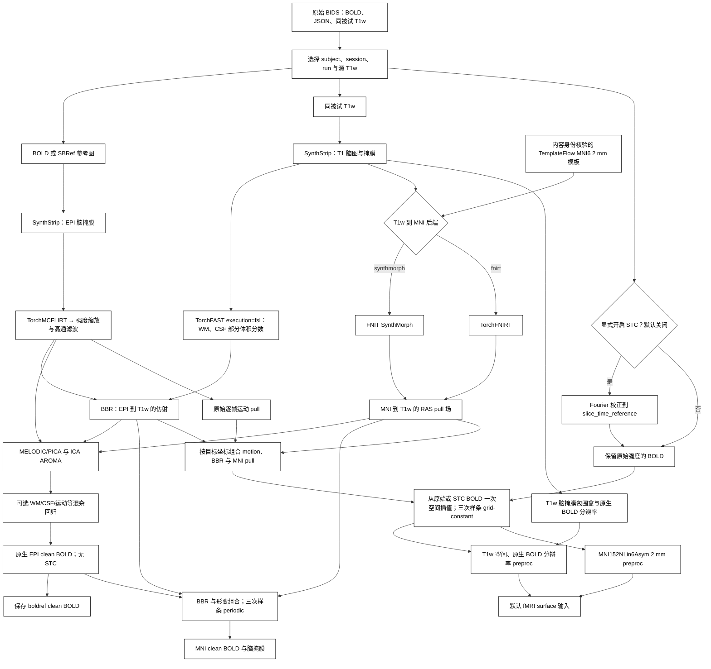

# fMRI 体积流程

`fMRIVolume_pipeline` 每次处理一个原始 BIDS BOLD run，同时输出 **preproc** 和 **clean** 两组 BIDS Derivatives。preproc 保留原始强度基线和时间均值，不做 AROMA、混杂回归、高通滤波或 grand-mean scaling；clean 沿用 FEAT 高通、PICA/ICA-AROMA 及可选 WM/CSF/运动等回归。计算使用本包已有 [SynthStrip](../synthstrip/README.md)、[TorchFAST](../fast/README.md)、[TorchMCFLIRT](../mcflirt/README.md)、BBR、SynthMorph/TorchFNIRT 和 [FNIT MELODIC/PICA](../melodic/README.md)，运行时不调用 FSL、FreeSurfer 或 fMRIPrep。

preproc 从原始 BOLD 或其切片时间校正结果出发，将逐帧运动、EPI→T1w BBR 与 T1w→MNI 形变组合后，分别**一次空间插值**得到 T1w 和 MNI 输出。三次 B 样条使用 `grid-constant` 零边界，与固定 fMRIPrep 25.2.4 的默认重采样规则一致。clean 的最终 MNI 插值保持三次 B 样条 `periodic` 边界和脑掩膜。两类输出使用原始 BIDS TR 并保持全部输入帧。

CUDA 默认允许 TF32。影像输入和输出为 float32；为对齐三次样条采样，grid-constant 的系数和采样坐标使用 float64，中间查询按空间分块，不使用 float16/bfloat16。

## 流程图



## 输入、安装和模板

在仓库根目录创建主页 Conda 环境，激活 `fnit`，运行 `fnit-setup-weights --model fmri` 获取默认 SynthStrip/SynthMorph 权重。若选 `registration_backend="fnirt"`，只需 SynthStrip 权重。统一准备体积与表面资源：

```bash
fnit-setup-fmri-surface-assets \
  --output-dir /absolute/path/hcp_surface_assets \
  --fmriprep
```

该命令将以下三个文件仅从 TemplateFlow 原站下载至 `hcp_surface_assets/fmriprep/`，检查固定大小和 SHA-256；它们未进入 FNIT Release。HCP 表面文件仍使用经许可的固定 Release 与原站回退。完整文件哈希见[模板清单](../WEIGHTS.md#fmri-templateflow-原站模板)。

| 文件 | 字节数 | 用途 |
|---|---:|---|
| `tpl-MNI152NLin6Asym_res-02_T1w.nii.gz` | 1,412,252 | `mni_template`：标准空间参考与固定输出网格。 |
| `tpl-MNI152NLin6Asym_res-02_desc-brain_mask.nii.gz` | 28,557 | `mni_brain_mask`：与模板同网格的脑掩膜。 |
| `tpl-MNI152NLin6Asym_res-02_atlas-HCP_dseg.nii.gz` | 25,762 | 后续 surface 的 91k CIFTI 皮层下分区。 |

`mni_template` 必须通过 **规范 RAS 网格、仿射与体素内容身份** 检查：接受固定 TemplateFlow MNI152NLin6Asym res-02 的完整 T1w，或其固定脑掩膜版本。其他模板即使具有相同 2 mm 网格也会拒绝，避免把别的标准空间标为 MNI152NLin6Asym。模板的原文件 SHA-256 和身份写入 JSON。`mni_brain_mask=None` 时使用 SynthStrip 提取模板脑掩膜；提供掩膜时需与模板同网格。

原始 BIDS 至少包含 `dataset_description.json`、同被试 T1w、BOLD 和含 `TaskName`/有限正数 `RepetitionTime` 的 JSON。可提供同网格 SBRef。多 run、echo 或 T1w 候选需明确选择。存在与 BOLD 关联的原始 fieldmap 时，当前完整入口因尚未实现 fieldmap 估计而明确报错；当前输出记录无 susceptibility correction，不处理 GDC。

```text
bids/
├── dataset_description.json
└── sub-0001/
    ├── anat/sub-0001_T1w.nii.gz
    └── func/
        ├── sub-0001_task-rest_bold.nii.gz
        └── sub-0001_task-rest_bold.json
```

### 切片时间和信号范围

`slice_timing=False` 默认关闭切片时间校正。显式设置 `slice_timing=True` 时读取继承的 BIDS `SliceTiming`；仅有两个或更多切片时间时执行 Fourier STC，遵循 `SliceEncodingDirection`（含负方向）。`slice_time_reference=0.5` 选择最早与最晚切片时刻之间的中点，目标时间四舍五入到毫秒。切片时间缺失、为空或仅一个值时跳过。

STC **只用于 preproc**。clean 继续使用原有未做 STC 的 FEAT/AROMA 链，其 JSON 明确写 `SliceTimingCorrected=False`。输出删除已不适用的原始 `SliceTiming`，保留原有 `DelayTime`、`AcquisitionDuration`、`VolumeTiming`，并按固定 fMRIPrep 规则推导稀疏采集的时间字段；实际执行 STC 的 preproc 记录 `StartTime` 和使用的方法。此完整入口要求固定 `RepetitionTime`，不会把可变 TR 数据伪装为固定 TR 流程。

## Python 调用与参数

下面示例显式开启三类 clean 混杂回归；三个 `regress_*` 参数的默认值均为 `False`，不影响同时生成的 preproc。

```python
from fnit import fMRIVolume_pipeline

volume_result = fMRIVolume_pipeline(
    bids_root="/absolute/path/bids",                       # 原始 BIDS 根目录
    derivatives_root="/absolute/path/bids/derivatives/fnit", # FNIT BIDS Derivatives 根目录
    subject="0001",                                        # sub 标签，不含 sub-
    mni_template="/absolute/path/hcp_surface_assets/fmriprep/tpl-MNI152NLin6Asym_res-02_T1w.nii.gz", # 经核验的模板
    session=None,                                          # ses 标签；无 session 时为 None
    task="rest",                                           # task 标签；默认 rest
    run=None,                                              # 多 run 时指定 run 标签
    acquisition=None,                                      # acq 标签筛选
    direction=None,                                        # dir 标签筛选
    reconstruction=None,                                   # rec 标签筛选
    echo=None,                                             # echo 标签筛选
    t1w_image=None,                                        # 唯一源 T1w；多张时传其绝对路径
    mni_brain_mask="/absolute/path/hcp_surface_assets/fmriprep/tpl-MNI152NLin6Asym_res-02_desc-brain_mask.nii.gz", # 同网格模板掩膜；默认 None 则提取
    registration_backend="synthmorph",                     # T1w→MNI：synthmorph 或 fnirt
    fnirt_config=None,                                     # fnirt 分支配置；None 使用 T1 预设
    synthstrip_weights=None,                               # None 从已配置权重目录解析
    synthmorph_weights=None,                               # None 从已配置权重目录解析
    ica_n_components=None,                                 # None 自动定阶；整数固定成分数
    aroma_mode="nonaggr",                                  # AROMA：nonaggr 或 aggr
    regress_wm=True,                                       # 示例开启白质均值回归；默认 False
    regress_csf=True,                                      # 示例开启脑脊液均值回归；默认 False
    regress_motion=True,                                   # 示例开启运动回归；默认 False
    motion_model=24,                                       # 运动项：6、12 或 24
    bandpass=None,                                         # 可选 (低 Hz, 高 Hz)，用于 clean
    global_signal=False,                                   # clean 是否回归全脑均值
    highpass_cutoff_seconds=100.0,                         # clean FEAT 高通截止周期，秒
    slice_timing=False,                                    # 默认关闭切片时间校正
    slice_time_reference=0.5,                              # STC 目标位于切片采集范围的比例，0–1
    device="cuda:0",                                       # 默认 None 自动选择 CUDA 或 CPU
    batch_size=8,                                          # 运动和 BOLD 重采样每批帧数
    motion_iterations=(1, 1, 1),                           # 8/4/4 mm 各一次 Brent 坐标优化
    ica_max_iter=500,                                       # ICA 迭代上限
    n_splits=1000,                                         # AROMA 随机抽样次数
    random_state=0,                                        # ICA/AROMA 随机种子
    overwrite=False,                                       # 保护同名全部最终文件与 sidecar
    reuse_anatomical=True,                               # 同一 T1w/模板/配置的解剖结果跨 run 复用
    bbr_execution="batched",                              # batched 批量搜索；reference 串行同算法
    fnirt_execution="optimized",                          # optimized GPU 算子；reference 保留原执行方式
)
print(volume_result.preproc_t1w)  # T1w 空间、原生 BOLD 分辨率的 4D preproc
print(volume_result.preproc_mni)  # MNI152NLin6Asym 2 mm 的 4D preproc
print(volume_result.clean_native) # 原生 EPI clean BOLD
print(volume_result.clean_mni)    # MNI 2 mm clean BOLD
print(volume_result.motion_pull)  # 逐帧 reference→original RAS pull 矩阵
print(volume_result.mni_pull)     # MNI→T1w RAS pull 位移场
```

`highpass_cutoff_seconds`、ICA/AROMA 参数、混杂回归和 bandpass/global signal 作用于 clean 分支。`slice_timing`/`slice_time_reference` 作用于 preproc。`registration_backend`、T1w、模板和运动估计为两类结果共享。更改 `fnirt_config` 仅适用于 `registration_backend="fnirt"`；不在其他后端静默忽略。

运动校正直接调用独立 [`TorchMCFLIRT`](../mcflirt/README.md)：8/4/4 mm 三阶段、原 NCC 目标、相邻帧初值传播，最终 Constant 三次样条采样。`motion_iterations` 现在表示每阶段坐标优化轮数，默认 `(1,1,1)`，对应原 MCFLIRT 默认；原来的 Adam 步数已移除。原始 uint16 BOLD 的校正值先按 NEWIMAGE 向零截断为 int32，再转 float32 进入 FEAT。命令行对应 `--motion-iterations 1 1 1`。

解剖组织分割使用 [`TorchFAST(execution="fsl")`](../fast/README.md)，保留原 FAST 的 radiological 扫描方向、原位邻域更新、连续随机流与偏置场估计。独立 FAST 默认仍是兼容的 `tensor` 路径，pipeline 显式选择 `fsl`；实际配置写入输出 JSON，代码变更也会使旧解剖缓存失效。

## 命令行与原版参考

```bash
fnit-fmri volume \
  --bids-root /absolute/path/bids \
  --derivatives-root /absolute/path/bids/derivatives/fnit \
  --subject 0001 \
  --mni-template /absolute/path/hcp_surface_assets/fmriprep/tpl-MNI152NLin6Asym_res-02_T1w.nii.gz \
  --mni-brain-mask /absolute/path/hcp_surface_assets/fmriprep/tpl-MNI152NLin6Asym_res-02_desc-brain_mask.nii.gz \
  --regress-wm --regress-csf --regress-motion \
  --slice-time-reference 0.5 \
  --device cuda:0
```

CLI 默认关闭 STC；`--slice-timing` 显式开启，`--ignore-slice-timing` 显式保持关闭。其他选项与 Python 参数对应，见 `fnit-fmri volume --help`。clean 的 FSL FEAT/ICA-AROMA 原版参照与历史测量见[验证页](../../validation/fmri/README.md)；preproc/surface 的固定 fMRIPrep 25.2.4 参考命令见[surface 原版参考](surface.md#命令行与原版参考)与[独立运行脚本](../../validation/fmri/fmriprep/run_reference.py)。原版程序只在参考环境执行。

## 输出结构与来源

以 `sub-0001_task-rest` 为例，`derivatives_root/dataset_description.json` 声明 BIDS Derivatives 数据集，下列路径位于 `sub-0001/`。有 session 时增加 `ses-<label>/`；保留源 BOLD 的 task、acq、dir、run、echo 等实体。BOLD 为 float32 的 X×Y×Z×T，掩膜为 3D 二值图。

| 路径（省略 `sub-0001/`） | 内容 |
|---|---|
| `func/sub-0001_task-rest_space-T1w_res-native_desc-preproc_bold.nii.gz` | 源 T1w scanner-RAS 空间的 preproc；体素尺寸取原生 BOLD 分辨率，FOV 依 T1w 脑掩膜包围盒生成。用于默认 surface 皮层投影。 |
| `func/sub-0001_task-rest_space-MNI152NLin6Asym_res-2_desc-preproc_bold.nii.gz` | 原始或 STC BOLD 经组合变换直接一次采样到固定 MNI 2 mm 网格；用于默认 surface 的皮层下信号。 |
| `func/sub-0001_task-rest_space-boldref_desc-clean_bold.nii.gz` | 原生 EPI 参考网格的 clean BOLD，保留 FEAT/AROMA 和选定回归。 |
| `func/sub-0001_task-rest_space-MNI152NLin6Asym_res-2_desc-clean_bold.nii.gz` | MNI clean BOLD，使用三次样条 periodic 和输出脑掩膜；mask 外为零。 |
| `func/sub-0001_task-rest_space-MNI152NLin6Asym_res-2_desc-brain_mask.nii.gz` | MNI 网格脑掩膜。 |
| `func/sub-0001_task-rest_from-boldref_to-T1w_mode-image_xfm.txt` | EPI reference→T1w 的 FSL FLIRT 4×4 BBR 矩阵。 |
| `func/sub-0001_task-rest_from-boldref_to-orig_mode-image_desc-pull_xfm.npy` | T×4×4 世界 RAS pull 矩阵：每帧从 reference RAS 映射到原始帧 RAS，单位毫米。 |
| `func/sub-0001_task-rest_from-MNI152NLin6Asym_to-T1w_mode-image_desc-pull_xfm.nii.gz` | MNI 网格的 X×Y×Z×3 RAS 位移场；在 MNI 世界坐标上加此位移得到源 T1w 世界坐标。 |
| `anat/sub-0001_desc-brain_T1w.nii.gz` | SynthStrip 提取的源 T1w 脑图；与该 T1w 同网格。 |

T1w preproc 的 `res-native` 表示 **原生 BOLD 分辨率**，几何采用 T1w scanner-RAS。它不要求与全尺寸 T1w 脑图拥有相同体素网格。对 MNI 目标点，采样依次使用 MNI→T1w pull、BBR 逆变换、该帧 motion pull 和原始 BOLD 的世界到体素变换；只在最后一步对 BOLD 插值。

四个 BOLD、脑掩膜和 T1w 脑图附 JSON，BBR 和 motion 矩阵另有来源 JSON。BOLD metadata 包含原始 TR、BIDS 来源、实际 STC、回归范围、模板身份与 SHA-256、配准后端和耗时；preproc 使用 `FNIT.Signal="preproc"`、`Interpolation/MNIInterpolation="cubic-bspline-grid-constant"`，clean 使用 `FNIT.Signal="clean"`、`MNIInterpolation="cubic-bspline-periodic"`。preproc 不减时间均值，其均值图保留强度基线；clean 做带截距回归时的时间均值可能接近零，两类结果应按其处理定义使用。

`FMRIVolumeResult` 返回 `clean_native`、`clean_mni`、`mask_mni`、`t1_brain`、`bbr_matrix`、MNI clean JSON 的 `metadata`、`timing_seconds`，以及 `preproc_t1w`、`preproc_mni`、`motion_pull`、`mni_pull`。全部最终文件和 JSON 在结果生成后整批发布，发布失败回滚旧文件。FEAT/PICA/AROMA 中间文件仅保存在运行时临时目录。

本次同步修复共享 `publish_derivatives` 的覆盖保护：`overwrite=False` 拒绝已有文件和悬空符号链接，发布时并发出现同名文件也会触发回滚；输出位置若是目录会被拒绝。显式选择链接到外部存储的 T1w 时，保留它在 BIDS 内的逻辑路径，确保输出命名与 `Sources` 正确。

`FNIT.Configuration` 记录本次全部处理参数、FAST 配置、模板与权重位置；`FNIT.Denoising` 记录 ICA-AROMA 模式与完成状态；`FNIT.Source` 记录 Python 源码清单 SHA-256 和 PyTorch、NumPy、nibabel、SciPy 版本。资源内容另由安装器和 benchmark 校验。WM/CSF 回归关闭时不生成对应原生掩膜，BBR 所需 T1 白质分割仍会生成。

`reuse_anatomical=True` 默认把 T1 SynthStrip、FAST、模板提取与 T1→MNI 结果保存在当前被试/会话 `anat/.fnit_anatomical/` 的内部缓存；BIDS 的公开输出仍采用上表命名。缓存核验输入、模板/掩膜、权重、配置、执行模式、实现源码及计算环境，每个输出再校验 SHA-256；改变其中任意一项会重新计算。缓存不完整或文件损坏时会重建。BBR、EPI 脑提取和 BOLD 处理仍按 run 运行。`reuse_anatomical=False`（命令行 `--no-anatomical-cache`）强制重新计算解剖步骤；`overwrite` 不负责清空缓存。

计时 JSON 分别记录 `bbr_initial_flirt`、`bbr_refinement`、`bbr_final_resampling`、`t1_to_mni_affine`、`t1_to_mni_nonlinear`、`warp_conversion` 和 `mni_resampling`。命中缓存时，已复用的计算阶段记为 0，校验与等待时间记为 `anatomical_cache_lookup`，报告的 `anatomical_cache.reused` 为 true。`total` 是此次调用至最终暂存结果与 JSON 生成前的实际墙钟，包含初始化、校验、导入及加载；末尾最终 BIDS 文件复制和 JSON 写盘在该计时外。FEAT、PICA、AROMA 文件仍使用临时工作目录。表面处理随后调用 [`fMRISurface_pipeline`](surface.md)。

`bbr_execution="reference"` 和 `fnirt_execution="reference"` 用于逐项回归，选择同一算法的串行成本/原张量算子；它们保留本次坐标、边界与优化流程的修正。CLI 对应 `--bbr-execution`、`--fnirt-execution`。后者只在 `registration_backend="fnirt"` 时可切换。

WM/CSF 概率图投到 EPI 网格时，使用本包 `TorchFLIRT.applyxfm` 的默认降采样预滤波与三线性采样，再以概率≥0.8 交 EPI 脑掩膜。JSON 中 `FNIT.TissueInterpolation="flirt-trilinear-prefilter-float32-coordinates"` 标明这一步；坐标按 float32 逐项计算，其余 CUDA 计算仍默认允许 TF32。

旧 volume 没有新增 preproc 或模板身份字段时，需重新运行当前 volume；不能仅改文件名或 JSON 把 clean 伪装为 preproc。可选择新的 `derivatives_root`，或在确认覆盖范围后设置 `overwrite=True`/`--overwrite`。随后调用 [`fMRISurface_pipeline`](surface.md)，默认使用新增 preproc；其 recon-all 几何需包含真实的已有 `midthickness` 或 `graymid`。显式选择 clean 时，表面入口同时核验原生和 MNI clean BOLD 的来源 JSON、TR 与 ICA-AROMA 完成状态。

## 当前数值验证

[单次插值测试](../../tests/test_fmri_single_pass.py)用独立 SciPy 采样核对 grid-constant 三次样条和非交换的运动/配准组合；[采样网格测试](../../tests/test_fmri_sampling_reference.py)核对原生 BOLD 分辨率、斜网格与已有中层面；[时间 metadata 测试](../../tests/test_fmri_timing.py)核对固定 fMRIPrep 的稀疏采集与 STC 时间规则。检查范围为数值与接口契约。

[早期 STC 数值报告](../../validation/fmri/fmriprep/stc_control.public.json)为合成信号单元检查。随后用一例真实 88×88×64×490 BOLD 核对全部体素与帧，修复共享 STC 函数中直接计算频率相位、提前将时间加权乘法提升为 double 的差异，改为 AFNI 的 float32 相位递推和乘法后 double 累加。修复后 CPU 输出的 MAE 为 0.0000384、RMSE 为 0.0001475、最大绝对误差为 0.021484；原最大误差门槛 0.01 **仍未通过**，不能称为与 AFNI 严格等价。完整源码和输入/输出哈希、前后误差见[真实 STC 报告](../../validation/fmri/fmriprep/stc_real_full490.public.json)。STC 默认关闭；此显式开启的控制不属于默认完整流程计时。

## 完整 volume 实测（快照 `50eb098`，STC 关闭）

本次用冻结源码 `50eb098` 处理一例真实 UKB 88×88×64×490 BOLD，TR 为 0.735 s；默认关闭 STC，未执行 SDC 或 GDC。流程采用当前 TorchMCFLIRT 的 `(1,1,1)` 坐标优化、FAST `execution="fsl"`、SynthMorph 配准和 ICA-AROMA nonaggr，同时保存 preproc 与 clean；clean 另做 WM、CSF 与 24 项运动回归。解剖缓存关闭，PICA 自动估计 95 个成分，37 次迭代收敛，AROMA 标记 39 个噪声成分。

| 测量范围 | 结果 |
|---|---:|
| volume API 墙钟，含输出写盘，扣除验证捕获复制 | **1225.840 s** |
| 验证额外捕获复制，单独记录 | **26.968 s** |
| 外层验证进程墙钟，含导入、捕获、哈希和检查 | **1305.08 s** |
| 进程 PyTorch 峰值 allocated | **13.3057 GB** |
| 进程 PyTorch 峰值 reserved | **17.5972 GB** |
| 外层进程最大 RSS | 5,849,780 KiB |
| T1w preproc 网格，原生 BOLD 分辨率 | 59×75×64×490 |
| MNI152NLin6Asym preproc / clean 网格 | 91×109×91×490，2 mm |

四份 BOLD 均为有限 float32，保留全部 490 帧与原始 TR；MNI clean 的脑掩膜外为零。环境为共享 H100 PCIe、8 个 CPU 线程、float32/TF32，进程 CUDA 额度为 20 GB。API 与额外验证复制分别计时；这是一次冷运行观测，不推断稳定加速比。配置、逐输出检查、输入及源码 SHA-256 见[本次 volume 报告](../../validation/fmri/fmriprep/fnit_volume_stcoff_50eb098.public.json)。

### 与独立 fMRIPrep 25.2.4 volume 的对照

两方从同一原始 BOLD 和存档 T1 重建输入开始，分别估计运动、BBR 和 T1→MNI 变换；均关闭 STC/SDC，保留全部 490 帧、TR 0.735 s。官方运行采用已完成的 FreeSurfer 7 升级副本，不重新计入结构升级时间。本次只比较未去噪的 `preproc`。

| 运行范围 | FNIT `50eb098` | fMRIPrep 25.2.4 |
|---|---|---|
| T1→MNI 配准 | SynthMorph | ANTs |
| T1w preproc 网格 | 59×75×64×490 | 57×73×60×490 |
| MNI preproc 网格 | 91×109×91×490 | 相同 |
| 实际退出 | 0 | 0 |
| 墙钟 | 1225.840 s；API 包含 preproc 和额外 clean | 3775.517 s；容器 volume-only 预处理，未请求 MSM/CIFTI |

共享服务器、工作范围和计时边界不同，两次时间不构成稳定加速比。官方参数、实际 TOML、输入 SHA 和输出检查见[完整参考报告](../../validation/fmri/fmriprep/reference_volume_stcoff_no_msm.public.json)。T1w 网格不同，没有直接逐值比较；共同 MNI 网格上的完整 490 帧结果如下。

| 比较域 | 体素数 / 数值个数 | 时间 r 均值 / 中位数 | RMSE / relative RMSE | 最大绝对误差 |
|---|---:|---:|---:|---:|
| 完整 MNI 网格 | 902,629 / 442,288,210 | 0.331901 / 0.338287 | 894.752 / 0.205119 | 25,693.808 |
| 两方功能脑 mask 交集 | 220,717 / 108,151,330 | **0.630705 / 0.739228** | **1145.306 / 0.139568** | 21,406.856 |

双方 mask 为 223,131 / 250,625 体素，两方掩膜 Dice 为 0.931775。时间 r 逐体素计算，排除任一时序标准差 ≤1e-6 的常数体素（本例为 0 个）；relative RMSE 为误差二范数除以官方信号二范数。直接使用保存的 float32 强度，没有拟合尺度、偏移或追加平滑。独立完整流程仍有明显差异，不能据固定投影逐值一致推断整链等价。见[完整独立 MNI 报告](../../validation/fmri/fmriprep/independent_mni_stcoff_50eb098.public.json)。

### 固定官方变换的单次插值控制

另将官方实际输入、运动/BBR/ANTs 变换和目标网格固定，仅核对组合坐标与三次 B 样条采样。表中是 `normalization.py` 的 `268f61b2` 实现与归档依赖快照的独立控制，不重新估计配准，也不作为完整 API 的第二次计时。

| 全部 490 帧控制 | 数值个数 | 最大绝对误差 | RMSE | 实际产物门禁 |
|---|---:|---:|---:|---|
| T1w FNIT vs 官方保存产物 | 122,333,400 | 0.000976563 | 8.86e-8 | 通过 |
| MNI FNIT vs 官方保存产物 | 442,288,210 | 22,930.414 | 33.6142 | 未通过 |
| MNI FNIT vs 安装源码串行回放 | 442,288,210 | 0.000244141 | 1.46e-8 | 仅串行数值控制通过 |

官方 MNI 保存产物与同参数串行回放在 12 帧有差异，实际产物门禁失败保留；不能用串行结果替换官方产物或断言它是独立流程差异的唯一原因。上面的独立 MNI 表没有剔除这 12 帧。详见[实际节点全帧控制](../../validation/fmri/fmriprep/actual_node_interpolation_full490.public.json)和[回放差异诊断](../../validation/fmri/fmriprep/actual_node_mni_replay_failure.public.json)。

同一份 preproc 随后用于[公开 surface API 与固定输入投影对照](surface.md#实测快照与历史记录)。此前 `c3c921cc`/`bac3c395` 的 STC 关闭测量保留在[历史 OFF 记录](../../validation/fmri/HISTORY_20261001_STCOFF_PREPROC.md)；`3940a72` 开启 STC 的测量保留在[历史 ON 记录](../../validation/fmri/HISTORY_20261001_STCON_PREPROC.md)。

[合并合同门禁](../../validation/fmri/fmriprep/nonmsm_contract_gate.public.json)为 **248 passed、0 skipped**；后续 surface 来源路径补丁由[局部门禁](../../validation/fmri/fmriprep/surface_source_path_gate.public.json)的 **42 passed、0 skipped** 覆盖，包含新增的 8 个路径用例，两次门禁分别报告。[发布源码回溯](../../validation/fmri/fmriprep/publication_runtime_provenance.public.json)逐文件核对执行快照与发布运行时，保留原始执行提交和计时；后续路径补丁没有改变 volume 数值链。

## clean FNIRT 同步骤实测快照（源码 `1eb9c417`）

本节为已发布 clean 流程的实际结果，计时不包含本页新增的 preproc 单次插值产物。它采用原 SynthStrip/FSL/ICA-AROMA 同步骤参照，与本轮 fMRIPrep 固定输入投影对照分别报告。

2026-10-01，从同一例真实 BOLD/SBRef 和匹配的存档 T1，完整运行冻结源码 `1eb9c417` 的 FNIT FNIRT 分支，与原 SynthStrip、FSL 和作者 ICA-AROMA 按相同步骤比较。双方处理全部 490 帧，100 秒高通、non-aggressive AROMA、WM/CSF 与 Friston-24 联合回归；不使用 GDC/B0、FIX 或空间平滑。存档 T1 经 nibabel 无误差转换，未核对更早的结构处理。

| 完整单例检查 | FNIT | 原软件参照 |
|---|---:|---:|
| 原生 / MNI 网格 | 88×88×64×490 / 91×109×91×490 | 相同 |
| API 含保存 / 原连续链墙钟 | **1318.04 s（21.97 min）** | **2570.47 s（42.84 min）** |
| 独立验证进程墙钟 | 1372.24 s | 2601.72 s |
| CUDA allocated / reserved，十进制 GB | 8.316 / 9.745 | 未单独记录 |
| ICA 成分 / 迭代 / AROMA 噪声成分 | 95 / 41 / 47 | 95 / 40 / 50 |
| EPI WM / CSF 回归 mask Dice | 0.990405 / 0.970970 | 比较基准 |

| 逐体素 490 帧时间 Pearson r | 均值 | 中位数 |
|---|---:|---:|
| 运动校正 BOLD | **0.999578** | 0.999834 |
| pre-ICA BOLD | **0.999356** | 0.999770 |
| 原生最终 clean BOLD | **0.940704** | 0.951029 |
| MNI 最终 clean BOLD | **0.938768** | 0.947436 |

该次 main 更新修复了 SynthStrip 的 conform/回采样几何、独立 TorchMCFLIRT 的原 NCC/Brent/初值传播与整数输出、MELODIC 的 PCA/ICA/混合模型，以及 FAST 的顺序扫描和 bias/PVE 数值路径。完整流程已直接调用这些本包子函数。各自的固定输入控制、示例脑图及原命令见 [SynthStrip](../synthstrip/README.md)、[TorchMCFLIRT](../mcflirt/README.md)、[MELODIC](../melodic/README.md)和 [TorchFAST](../fast/README.md)。此前完整版本的 MNI 时间 r 均值约为 0.8536；本表是更新后的完整复测。

固定原 pre-ICA 输入后，ICA 时间序列配对 r 中位数为 0.999999978，95 个分类标签全部匹配；完整链使用各自产生的 pre-ICA 数据，配对 r 中位数为 0.855702，噪声数为 47/50。固定同一 warp、只比较两份清理图时，MNI 时间 r 均值约 0.9449；固定同一清理图、只换 warp 为约 0.9935。原场下本包 sampler 对原 applywarp 的时间 r 均值为 0.999999999921、RMSE 0.002218。余差主要在分解与去噪的输入传播，完整流程尚未数值等价。

共享 H100、8 线程，FNIT 默认 TF32；PCA/ICA 的关键计算采用 float64，没有使用 float16。双方从新目录开始、不复用解剖缓存。FNIT API 扣除捕获中间影像的 27.05 s 额外复制；原连续链还包含阶段检查和 MELODIC HTML 输出。时间边界与共享负载不同，本表不据单次值计算稳定加速比。FEAT 占 973.12 s，包含顺序运动估计、最终采样、缩放、高通和阶段输出，尚未单独分离运动函数时间。

### 已公开脑图：clean FNIRT 与原软件同步骤参照

下图已经公开，来自本节 `1eb9c417` 的 **clean FNIRT** 对照。原软件一侧为 SynthStrip、FSL、ICA-AROMA 连续链；不是 `50eb098` 的 fMRIPrep preproc 对照。四行依次为同一 2 mm MNI 模板、FNIT clean BOLD 时间标准差、原软件 clean BOLD 时间标准差、逐体素 490 帧时间 r。两行 SD 共用色阶，没有追加平滑。


图的公开来源与 SHA-256 见[脑图清单](../../validation/fmri/fmriprep/published_comparison_figures.public.json)。本轮 fMRIPrep 验证仅公开聚合指标和报告。

[完整结果、原命令和复测方法](../../validation/fmri/matched_native.md) · [机器可读比较](../../validation/fmri/matched_pipeline.public.json) · [源码/输入/输出独立核对](../../validation/fmri/matched_fnirt_contract.public.json)。这次 clean FNIRT 复测没有重跑 surface 与 MS-HBM，保留各自的日期和输入范围；[验证索引](../../validation/fmri/README.md)明确两类测量边界。

## 独立配准与解剖缓存实测

2026-10-01 的 `8dbeea64` 更新另行测量一例真实 UKB BBR、T1 FNIRT 与解剖缓存。下面的函数计时包含输入解压和 CPU 结果转换，排除最终写盘；它们与上面含最终写盘的完整 volume API 计时分别报告。首次调用已完成 CUDA 初始化，未清空 Triton 磁盘缓存；热调用紧接首次调用。共享 GPU 上的这些单次观测不用于计算稳定加速倍数。

| 独立测试范围 | 首次 / 热调用 | 与同输入 FSL 参照的精度 |
|---|---:|---|
| BBR，固定官方初始矩阵和白质分割 | 3.581 / 1.409 s | 影像 r 0.99999970；逆变换位移 RMS 0.00260 mm。 |
| FNIT FAST＋FLIRT＋BBR | 6.932 / 5.072 s | 影像 r 0.9997382；逆变换位移 RMS 0.07203 mm。 |
| T1 FNIRT，固定官方初始矩阵与模板掩膜 | 32.595 / 30.422 s | warped T1 r 0.99771788；完整 pull 位移中位数 / p95 0.05176 / 0.23294 mm。 |
| 解剖准备，FNIT FLIRT＋FNIRT，第二次复用全部解剖产物 | 41.118 / 0.0785 s | 两次产物 SHA-256 相同；第二次时间为缓存核验，不重新估计配准。 |

BBR 的官方 CPU 命令观测为 45.093 s，FNIRT 为 217.558 s，均含启动与输入读写，计时边界不同。BBR 固定官方 WM/init 的精度不能代表自产 FAST/init 的完整配准链；FNIRT 表不包含 FLIRT 或最终 BOLD 重采样。当前 optimized FNIRT 与 reference 求和顺序不同，完整误差与逐项消融保留在 [BBR 页](bbr.md#真实-ukb-数据对照)、[T1→MNI 页](normalization.md#当前真实数据-benchmark)和[独立配准报告](../../validation/fmri/registration_gpu.current.public.json)。本轮独立缓存测试使用 FNIRT；[历史 `3b9b0f8` 完整 volume](../../validation/fmri/HISTORY_20261001_clean.md)使用 SynthMorph，各自计时分别保存。

## 参考文献与原实现

- Smith 等，*Advances in functional and structural MR image analysis and implementation as FSL*，NeuroImage，2004，[DOI](https://doi.org/10.1016/j.neuroimage.2004.07.051)。
- Pruim 等，*ICA-AROMA*，NeuroImage，2015，[DOI](https://doi.org/10.1016/j.neuroimage.2015.02.064)。
- Esteban 等，*fMRIPrep*，Nature Methods，2019，[DOI](https://doi.org/10.1038/s41592-018-0235-4)。
- 原实现：[FSL FEAT](https://git.fmrib.ox.ac.uk/fsl/feat5)、[ICA-AROMA](https://github.com/maartenmennes/ICA-AROMA)、[fMRIPrep 25.2.4 单次重采样](https://github.com/nipreps/fmriprep/blob/25.2.4/fmriprep/interfaces/resampling.py)、[时间 metadata](https://github.com/nipreps/fmriprep/blob/25.2.4/fmriprep/workflows/bold/outputs.py)、[NiWorkflows 1.14.4 采样参考](https://github.com/nipreps/niworkflows/blob/1.14.4/niworkflows/interfaces/nibabel.py)；[BIDS Derivatives 规范](https://bids-specification.readthedocs.io/en/stable/derivatives/introduction.html)。

处理后的 MNI volume 与 fsLR32k surface 可继续运行 [MS-HBM 17 网络](../mshbm/README.md)。[历史官方 UKB release 下游对照](../../validation/mshbm/processed_release.md)分别报告当时体积标签、表面标签和网络连接差异。
