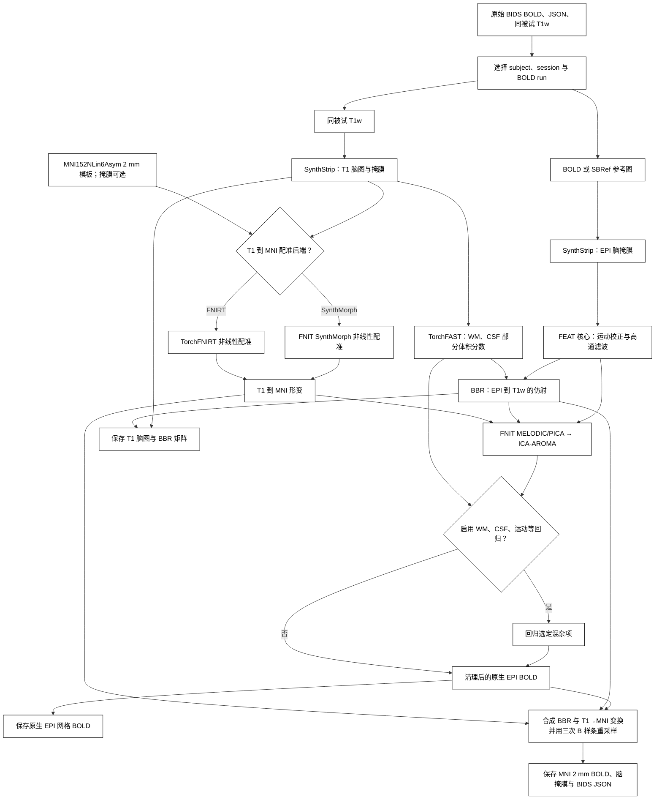

# fMRI 体积流程

`fMRIVolume_pipeline` 每次处理一个原始 BIDS BOLD run，输出 BIDS Derivatives。步骤依次为 SynthStrip 脑提取、FEAT 核心运动校正与高通、TorchFAST 组织分割、BBR、T1→MNI152NLin6Asym 2 mm 配准、[FNIT MELODIC/PICA](../melodic/README.md)、ICA-AROMA 和可选 WM/CSF/运动回归。最后分别保存个体 EPI 网格与 MNI 网格的清理后 BOLD。运算时不调用 FSL、FreeSurfer 或 fMRIPrep。GPU 默认允许 TF32。最终 MNI BOLD 采用三次 B 样条空间插值；组织图、标签和 surface 皮层投影保留各自的采样方法。

## 流程策略



## 输入与安装

在仓库根目录运行 `conda env create -f environment.yml`，激活 `fnit`，再运行 `fnit-setup-weights --model fmri`。选 `registration_backend="fnirt"` 时只需要 SynthStrip 权重。`mni_template` 须为与 FNIT ICA-AROMA 掩膜同网格的 MNI152 T1 2 mm NIfTI；`mni_brain_mask` 可选，但需与模板同网格。原始 BIDS 至少包含 `dataset_description.json`、`sub-<label>/func/*_bold.nii.gz` 及含 `TaskName`、`RepetitionTime` 的 JSON、同被试 `anat/*_T1w.nii.gz`。SBRef 可选。多 run、echo 或 T1w 候选需明确选择。

```text
bids/
├── dataset_description.json
└── sub-0001/
    ├── anat/sub-0001_T1w.nii.gz
    └── func/
        ├── sub-0001_task-rest_bold.nii.gz
        └── sub-0001_task-rest_bold.json
```

## Python 调用

```python
from fnit import fMRIVolume_pipeline

result = fMRIVolume_pipeline(
    bids_root="/absolute/path/bids",                   # 原始 BIDS 数据集根目录
    derivatives_root="/absolute/path/bids/derivatives/fnit",  # FNIT BIDS Derivatives 根目录
    subject="0001",                                   # sub 标签，不含 sub-
    session=None,                                      # ses 标签；没有 session 时为 None
    task="rest",                                      # task 标签
    run=None,                                         # run 标签；多 run 时指定
    acquisition=None,                                 # acq 标签；多候选时指定
    direction=None,                                   # dir 标签；多候选时指定
    reconstruction=None,                              # rec 标签；多候选时指定
    echo=None,                                        # echo 标签；多 echo 时指定
    t1w_image=None,                                   # 同被试唯一 T1w；多张时传绝对路径
    mni_template="/absolute/path/MNI152_T1_2mm.nii.gz",  # MNI152 2 mm 参考 NIfTI
    mni_brain_mask=None,                              # 同网格模板掩膜；None 则用 SynthStrip
    registration_backend="synthmorph",                # T1→MNI：synthmorph 或 fnirt
    fnirt_config=None,                                # fnirt 分支配置；默认 T1 预设
    synthstrip_weights=None,                          # None 从 FNIT 权重缓存读取
    synthmorph_weights=None,                          # None 从 FNIT 权重缓存读取
    ica_n_components=None,                            # None 自动定阶；整数固定 IC 数
    aroma_mode="nonaggr",                              # AROMA 回归模式：nonaggr/aggr
    regress_wm=True,                                  # 回归白质均值信号
    regress_csf=True,                                 # 回归脑脊液均值信号
    regress_motion=True,                              # 回归运动参数
    motion_model=24,                                  # 运动项数：6、12、24
    bandpass=None,                                    # 可选频段 (低Hz, 高Hz)
    global_signal=False,                              # 是否回归全脑均值
    highpass_cutoff_seconds=100.0,                    # FEAT 高通截止周期，秒
    device="cuda:0",                                  # PyTorch 设备
    batch_size=8,                                     # BOLD 重采样每批帧数
    motion_iterations=(35, 25, 15),                   # 三层运动优化迭代数
    ica_max_iter=500,                                 # ICA 迭代上限
    n_splits=1000,                                    # AROMA 随机抽样次数
    random_state=0,                                   # ICA/AROMA 随机种子
    overwrite=False,                                  # 是否覆盖同名最终结果
)
print(result.clean_native)  # 个体 EPI 空间清理后 4D BOLD
print(result.clean_mni)     # MNI152 2 mm 清理后 4D BOLD
```

命令行：`fnit-fmri volume --bids-root /absolute/path/bids --derivatives-root /absolute/path/bids/derivatives/fnit --subject 0001 --mni-template /absolute/path/MNI152_T1_2mm.nii.gz --regress-wm --regress-csf --regress-motion --device cuda:0`。完整选项见 `fnit-fmri volume --help`。

## 输出

以 `sub-0001_task-rest` 为例，`derivatives_root/dataset_description.json` 声明 BIDS Derivatives 数据集；下列文件位于 `sub-0001/`。保留源 BIDS 的 ses、task、acq、dir、run、echo 等实体。NIfTI 为 float32；掩膜为 3D 二值图，BOLD 为 X×Y×Z×T。

| 路径（省略 `sub-0001/`） | 含义 |
|---|---|
| `func/sub-0001_task-rest_space-boldref_desc-clean_bold.nii.gz` | 原生 EPI 参考网格的清理后 BOLD，供 surface 皮层投影前重采样到 T1w。 |
| `func/sub-0001_task-rest_space-MNI152NLin6Asym_res-2_desc-clean_bold.nii.gz` | MNI152 2 mm 清理后 BOLD，供皮层下 CIFTI。相邻 JSON 记录 TR、来源、回归配置、耗时及 `FNIT.MNIInterpolation="cubic-bspline-periodic"`。 |
| `func/sub-0001_task-rest_space-MNI152NLin6Asym_res-2_desc-brain_mask.nii.gz` | MNI 网格脑掩膜。 |
| `func/sub-0001_task-rest_from-boldref_to-T1w_mode-image_xfm.txt` | BBR FLIRT 4×4 矩阵；surface 流程用它把 EPI BOLD 采样到 T1w。 |
| `anat/sub-0001_desc-brain_T1w.nii.gz` | SynthStrip 提取的 T1w 脑影像；与源 T1w 同网格。 |

`FMRIVolumeResult` 返回上述五条绝对路径、MNI BOLD 的 JSON 路径及各阶段耗时。已有输出不会自动更新。重跑时用新的 `derivatives_root`，或设置 `overwrite=True`（命令行 `--overwrite`）；新版 MNI BOLD 的 JSON 应包含上述 `MNIInterpolation` 字段。中间的 FEAT、PICA 与 AROMA 文件只在运行时工作目录中存在。表面处理需随后调用 [`fMRISurface_pipeline`](surface.md)。

## 全流程 benchmark

2026-09-30 用 `3f8b756` 的运行源码，使用一例真实 UKB 原始 BOLD/SBRef 和同被试重建存档中的 `orig/001.mgz` T1 输入，完成完整 490 帧 BIDS volume 流程，启用 WM、CSF 和 24 项运动回归，使用默认 SynthMorph 配准。T1 经 nibabel 逐体素无误差转换；它是存档的皮层重建输入，更早的结构预处理未核对。

| 检查 | 结果 |
|---|---|
| 原生 / MNI BOLD 网格 | 88×88×64×490 / 91×109×91×490 |
| 输出合同 | float32；全部数值有限；TR 0.735 s；MNI 掩膜外为零 |
| ICA / AROMA | 95 个成分，115 次迭代后收敛；55 个噪声成分 |
| volume API 耗时，含最终写盘 | 1719.19 s |
| 峰值 CUDA allocated / reserved | 13.34 / 16.96 GB |
| pre-ICA FEAT 与原 FSL 的 4D r / MAE | 0.996417 / 423.501 |
| 交集掩膜内逐体素时间相关中位数 | 0.966798 |

时间为共享 H100 上一次冷调用，排除导入、预先哈希和事后检查。FEAT 对照使用相同原始 BOLD/SBRef 的 FSL 6.0.7.22 no-GDC/no-B0 参照；96,776 个交集体素，掩膜 Dice 0.916318。最终 ICA-AROMA 加混杂回归的结果没有可逐体素配对的 UKB FIX 参照，因此 FEAT 的相关性不能当成最终 MNI 清理图的一致性。

最终 MNI 重采样已由三线性改为 GPU 三次 B 样条。在同一 490 帧 BOLD、同一矩阵和位移场的控制中，SD 对采样位置的回归斜率下降 38.4%，relative SD 中位数由 0.558 提高到 0.837。仍有残留格纹；未对时序或示例图做平滑。单独重采样含读写耗时为线性 39.13 s、样条 54.09 s。定义、FSL 插值参照和共享色阶对照图见[重采样验证](../../validation/fmri/resampling.md)。

下面依次显示 MNI 解剖模板、清理后 BOLD 的时间标准差、清理后的一个时间点。混杂回归去掉截距后时间均值接近零，因此不以均值图展示结构。模板只提供解剖参照，不是官方清理后 BOLD。


全部阶段时间、当前 surface 接续运行、官方对照边界和单被试复现命令见[全流程验证页](../../validation/fmri/README.md)，输入/输出与代码哈希见[volume 报告](../../validation/fmri/fmri_volume.public.json)。

## 参考文献与原实现

- Smith 等，*Advances in functional and structural MR image analysis and implementation as FSL*，NeuroImage，2004，[DOI](https://doi.org/10.1016/j.neuroimage.2004.07.051)。
- Pruim 等，*ICA-AROMA*，NeuroImage，2015，[DOI](https://doi.org/10.1016/j.neuroimage.2015.02.064)。
- 原实现：[FSL FEAT](https://git.fmrib.ox.ac.uk/fsl/feat5)、[ICA-AROMA](https://github.com/maartenmennes/ICA-AROMA)；[BIDS Derivatives 规范](https://bids-specification.readthedocs.io/en/stable/derivatives/introduction.html)。
