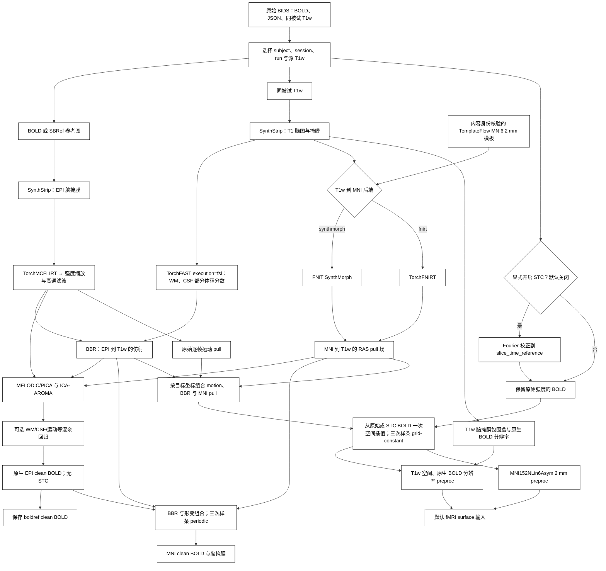

# fMRI 体积流程

## 功能简介与流程图

`fMRIVolume_pipeline` 每次处理一个原始 BIDS BOLD run，同时输出 **preproc** 和 **clean** 两组 BIDS Derivatives。preproc 保留原始强度基线和时间均值，不做 AROMA、混杂回归、高通滤波或 grand-mean scaling；clean 沿用 FEAT 高通、PICA/ICA-AROMA 及可选 WM/CSF/运动等回归。计算使用本包已有 [SynthStrip](../synthstrip/README.md)、[TorchFAST](../fast/README.md)、[TorchMCFLIRT](../mcflirt/README.md)、BBR、SynthMorph/TorchFNIRT 和 [FNIT MELODIC/PICA](../melodic/README.md)，运行时不调用 FSL、FreeSurfer 或 fMRIPrep。

preproc 从原始 BOLD 或其切片时间校正结果出发，将逐帧运动、EPI→T1w BBR 与 T1w→MNI 形变组合后，分别**一次空间插值**得到 T1w 和 MNI 输出。三次 B 样条使用 `grid-constant` 零边界，与固定 fMRIPrep 25.2.4 的默认重采样规则一致。clean 的最终 MNI 插值保持三次 B 样条 `periodic` 边界和脑掩膜。两类输出使用原始 BIDS TR 并保持全部输入帧。

CUDA 默认允许 TF32。主要影像计算与输出为 float32；原始整数 BOLD 的运动校正类型转换见下文。为对齐三次样条采样，grid-constant 的系数和采样坐标使用 float64，中间查询按空间分块，不使用 float16/bfloat16。



## Python 调用、输入输出与参数

### 输入、安装和模板

在仓库根目录执行 `conda env create -f environment.yml`，激活 `fnit`，再运行 `fnit-setup-weights --model fmri` 获取默认 SynthStrip/SynthMorph 权重。若选 `registration_backend="fnirt"`，只需 SynthStrip 权重。统一准备体积与表面资源：

```bash
fnit-setup-fmri-surface-assets \
  --output-dir /absolute/path/hcp_surface_assets \
  --fmriprep
```

该命令将以下三个文件仅从 TemplateFlow 原站下载至 `hcp_surface_assets/fmriprep/`，检查固定大小和 SHA-256；它们未进入 FNIT Release。HCP 表面文件仍使用经许可的固定 Release 与原站回退。完整文件哈希见[模板清单](../WEIGHTS.md#fmri-templateflow-原站模板)。

| 文件 | 字节数 | 用途 |
|---|---:|---|
| `tpl-MNI152NLin6Asym_res-02_T1w.nii.gz` | 1,412,252 | `mni_template`：标准空间参考与固定输出网格。 |
| `tpl-MNI152NLin6Asym_res-02_desc-brain_mask.nii.gz` | 28,557 | `mni_brain_mask`：与模板同网格的脑掩膜。 |
| `tpl-MNI152NLin6Asym_res-02_atlas-HCP_dseg.nii.gz` | 25,762 | 后续 surface 的 91k CIFTI 皮层下分区。 |

`mni_template` 必须通过 **无损轴重排后的 RAS 网格、仿射与体素内容身份** 检查：接受固定 TemplateFlow MNI152NLin6Asym res-02 的完整 T1w，或其固定脑掩膜版本。其他模板即使具有相同 2 mm 网格也会拒绝，避免把别的标准空间标为 MNI152NLin6Asym。模板的原文件 SHA-256 和身份写入 JSON。`mni_brain_mask=None` 时使用 SynthStrip 提取模板脑掩膜；提供掩膜时需与模板同网格。

原始 BIDS 至少包含以下数据；多 run、echo 或 T1w 候选需明确选择。

| 输入数据 | 格式与作用 |
|---|---|
| `dataset_description.json` | BIDS 数据集描述，位于 `bids_root`；用于验证原始数据集并写出 Derivatives 描述。 |
| `*_bold.nii.gz` | 一个 run 的 4D NIfTI，结构为 X×Y×Z×T；全部帧参与运动估计及两个信号分支。 |
| BOLD JSON | `TaskName` 与有限正数 `RepetitionTime`（秒）；开启 STC 时使用继承的 `SliceTiming`，规则见下文。 |
| 同被试 `*_T1w.nii.gz` | 3D 解剖 NIfTI，用于脑提取、组织分割、BBR 和标准空间配准。 |
| 可选 `*_sbref.nii.gz` | 与 BOLD 同网格的 3D EPI 参考；未提供时采用 BOLD 中间帧。 |
| `mni_template` / 可选 `mni_brain_mask` | 经身份核验的 3D MNI2mm 模板及同网格掩膜，定义标准输出网格。 |

关联的原始 fieldmap 当前会因缺少 fieldmap 估计而明确报错；输出记录无 susceptibility correction，不处理 GDC。

```text
bids/
├── dataset_description.json
└── sub-0001/
    ├── anat/sub-0001_T1w.nii.gz
    └── func/
        ├── sub-0001_task-rest_bold.nii.gz
        └── sub-0001_task-rest_bold.json
```

### 切片时间和信号范围

`slice_timing=False` 默认关闭切片时间校正。显式设置 `slice_timing=True` 时读取继承的 BIDS `SliceTiming`；仅有两个或更多切片时间时执行 Fourier STC，遵循 `SliceEncodingDirection`（含负方向）。`slice_time_reference=0.5` 选择最早与最晚切片时刻之间的中点，目标时间四舍五入到毫秒。切片时间缺失、为空或仅一个值时跳过。

STC **只用于 preproc**。clean 继续使用原有未做 STC 的 FEAT/AROMA 链，其 JSON 明确写 `SliceTimingCorrected=False`。输出删除已不适用的原始 `SliceTiming`，保留原有 `DelayTime`、`AcquisitionDuration`、`VolumeTiming`，并按固定 fMRIPrep 规则推导稀疏采集的时间字段；实际执行 STC 的 preproc 记录 `StartTime` 和使用的方法。此完整入口要求固定 `RepetitionTime`，不会把可变 TR 数据伪装为固定 TR 流程。

### Python 调用与参数

下面示例显式开启三类 clean 混杂回归；三个 `regress_*` 参数的默认值均为 `False`，不影响同时生成的 preproc。

```python
from fnit import fMRIVolume_pipeline

volume_result = fMRIVolume_pipeline(
    bids_root="/absolute/path/bids",                       # 原始 BIDS 根目录
    derivatives_root="/absolute/path/bids/derivatives/fnit", # FNIT BIDS Derivatives 根目录
    subject="0001",                                        # sub 标签，不含 sub-
    mni_template="/absolute/path/hcp_surface_assets/fmriprep/tpl-MNI152NLin6Asym_res-02_T1w.nii.gz", # 经核验的模板
    session=None,                                          # ses 标签；无 session 时为 None
    task="rest",                                           # task 标签；默认 rest
    run=None,                                              # 多 run 时指定 run 标签
    acquisition=None,                                      # acq 标签筛选
    direction=None,                                        # dir 标签筛选
    reconstruction=None,                                   # rec 标签筛选
    echo=None,                                             # echo 标签筛选
    t1w_image=None,                                        # 唯一源 T1w；多张时传其绝对路径
    mni_brain_mask="/absolute/path/hcp_surface_assets/fmriprep/tpl-MNI152NLin6Asym_res-02_desc-brain_mask.nii.gz", # 同网格模板掩膜；默认 None 则提取
    registration_backend="synthmorph",                     # T1w→MNI：synthmorph 或 fnirt
    fnirt_config=None,                                     # None 使用 T1 预设；可传预设名或 FNIRTConfig 对象
    synthstrip_weights=None,                               # None 从已配置权重目录解析
    synthmorph_weights=None,                               # None 从已配置权重目录解析
    ica_n_components=None,                                 # None 自动定阶；整数固定成分数
    aroma_mode="nonaggr",                                  # AROMA：nonaggr 或 aggr
    regress_wm=True,                                       # 示例开启白质均值回归；默认 False
    regress_csf=True,                                      # 示例开启脑脊液均值回归；默认 False
    regress_motion=True,                                   # 示例开启运动回归；默认 False
    motion_model=24,                                       # 运动项：6、12 或 24
    bandpass=None,                                         # 可选 (低 Hz, 高 Hz)，用于 clean
    global_signal=False,                                   # clean 是否回归全脑均值
    highpass_cutoff_seconds=100.0,                         # clean FEAT 高通截止周期，秒
    slice_timing=False,                                    # 默认关闭切片时间校正
    slice_time_reference=0.5,                              # STC 目标位于切片采集范围的比例，0–1
    device="cuda:0",                                       # 默认 None 自动选择 CUDA 或 CPU
    batch_size=8,                                          # 组合变换重采样每批帧数；不改变逐帧运动估计
    motion_iterations=(1, 1, 1),                           # 8/4/4 mm 各一次 Brent 坐标优化
    ica_max_iter=500,                                       # ICA 迭代上限
    n_splits=1000,                                         # AROMA 随机抽样次数
    random_state=0,                                        # ICA/AROMA 随机种子
    overwrite=False,                                       # 保护同名全部最终文件与 sidecar
    reuse_anatomical=True,                               # 同一 T1w/模板/配置的解剖结果跨 run 复用
    bbr_execution="batched",                              # batched 批量搜索；reference 串行同算法
    fnirt_execution="optimized",                          # optimized GPU 算子；reference 保留原执行方式
)
print(volume_result.preproc_t1w)  # T1w 空间、原生 BOLD 分辨率的 4D preproc
print(volume_result.preproc_mni)  # MNI152NLin6Asym 2 mm 的 4D preproc
print(volume_result.clean_native) # 原生 EPI clean BOLD
print(volume_result.clean_mni)    # MNI 2 mm clean BOLD
print(volume_result.motion_pull)  # 逐帧 reference→original RAS pull 矩阵
print(volume_result.mni_pull)     # MNI→T1w RAS pull 位移场
```

| 参数 | 含义与默认值 |
|---|---|
| `bids_root` | 原始 BIDS 数据根目录；必填路径。 |
| `derivatives_root` | FNIT BIDS Derivatives 根目录；必填路径。 |
| `subject` | 被试标签，不含 `sub-`；必填字符串。 |
| `mni_template` | 经内容身份核验的 MNI152NLin6Asym 2 mm T1w 模板；必填路径。 |
| `session` | `ses` 标签，默认 `None`；有多个候选时指定。 |
| `task` | `task` 标签，默认 `"rest"`。 |
| `run` | `run` 标签，默认 `None`；多个 run 时指定。 |
| `acquisition` | `acq` 标签筛选，默认 `None`。 |
| `direction` | `dir` 标签筛选，默认 `None`。 |
| `reconstruction` | `rec` 标签筛选，默认 `None`。 |
| `echo` | `echo` 标签筛选，默认 `None`；选择一个 echo，不进行多 echo 联合处理。 |
| `t1w_image` | 默认 `None` 自动选择唯一同被试 T1w；多张时传所选源 T1w 路径。 |
| `mni_brain_mask` | 默认 `None` 用 SynthStrip 提取模板掩膜；可提供与模板同网格的 3D 掩膜路径。 |
| `registration_backend` | 默认 `"synthmorph"`；`"fnirt"` 选择本包 TorchFNIRT。两类 BOLD 共用该配准。 |
| `fnirt_config` | 默认 `None` 使用 T1 预设；可传预设字符串或 `FNIRTConfig` 对象，仅适用于 FNIRT 分支。 |
| `synthstrip_weights` | 默认 `None` 从已配置目录解析；可显式提供原 SynthStrip PT 权重路径。 |
| `synthmorph_weights` | 默认 `None` 从已配置目录解析；可显式提供原 SynthMorph 权重路径，仅 SynthMorph 分支使用。 |
| `ica_n_components` | 默认 `None` 由 PICA 自动定阶；整数指定 clean 分支的成分数。 |
| `aroma_mode` | 默认 `"nonaggr"` 非激进去噪；`"aggr"` 回归噪声成分。 |
| `regress_wm` | 默认 `False`；设为 `True` 在 clean 中回归白质平均信号。 |
| `regress_csf` | 默认 `False`；设为 `True` 在 clean 中回归脑脊液平均信号。 |
| `regress_motion` | 默认 `False`；设为 `True` 在 clean 中联合回归所选运动项。 |
| `motion_model` | 默认 `24`；选择 6、12 或 24 项运动回归模型，仅开启运动回归时使用。 |
| `bandpass` | 默认 `None`；可传 `(低频 Hz, 高频 Hz)`，用于 clean 的额外时间滤波。 |
| `global_signal` | 默认 `False`；设为 `True` 在 clean 中回归脑内平均信号。 |
| `highpass_cutoff_seconds` | 默认 `100.0` 秒；clean FEAT 高通截止周期，体积单位 sigma 为该值除以 `2×TR`。 |
| `slice_timing` | 默认 `False`；设为 `True` 根据有效 BIDS 切片时刻校正 preproc。 |
| `slice_time_reference` | 默认 `0.5`；STC 目标在最早与最晚切片时刻之间的比例，范围 0–1。 |
| `device` | 默认 `None` 自动选择 CUDA 或 CPU；可传 `"cuda:0"` 或 `"cpu"`。 |
| `batch_size` | 默认 `8`；组合变换和标准空间 BOLD 重采样每批帧数。motion-only MCFLIRT 仍逐帧执行，不受此参数影响。 |
| `motion_iterations` | 默认 `(1, 1, 1)`；依次指定 8/4/4 mm 阶段的 Brent 坐标优化轮数。 |
| `ica_max_iter` | 默认 `500`；PICA/ICA 最大迭代数。 |
| `n_splits` | 默认 `1000`；ICA-AROMA 运动相关特征的随机子采样次数。 |
| `random_state` | 默认 `0`；PICA 和 ICA-AROMA 的随机种子。 |
| `overwrite` | 默认 `False`；任一最终产物已存在时拒绝覆盖，`True` 在结果检查后整批替换。 |
| `reuse_anatomical` | 默认 `True`；复用当前被试/会话下匹配输入、资源、配置与源码的解剖缓存。 |
| `bbr_execution` | 默认 `"batched"` 批量搜索；`"reference"` 使用同一算法的串行 cost 路径。 |
| `fnirt_execution` | 默认 `"optimized"` GPU 算子；`"reference"` 使用同一算法的原张量执行路径，仅 FNIRT 分支使用。 |

`highpass_cutoff_seconds`、ICA/AROMA 参数、混杂回归和 bandpass/global signal 作用于 clean 分支。`slice_timing`/`slice_time_reference` 作用于 preproc。`registration_backend`、T1w、模板和运动估计为两类结果共享。更改 `fnirt_config` 仅适用于 `registration_backend="fnirt"`；不在其他后端静默忽略。

运动校正直接调用独立 [`TorchMCFLIRT`](../mcflirt/README.md)：8/4/4 mm 三阶段、原 NCC 目标、相邻帧初值传播，最终 Constant 三次样条采样。`motion_iterations` 现在表示每阶段坐标优化轮数，默认 `(1,1,1)`，对应原 MCFLIRT 默认；原来的 Adam 步数已移除。原始 uint16 BOLD 的校正值先按 NEWIMAGE 向零截断为 int32，再转 float32 进入 FEAT。命令行对应 `--motion-iterations 1 1 1`。

解剖组织分割使用 [`TorchFAST(execution="fsl")`](../fast/README.md)，保留原 FAST 的 radiological 扫描方向、原位邻域更新、连续随机流与偏置场估计。独立 FAST 默认仍是兼容的 `tensor` 路径，pipeline 显式选择 `fsl`；实际配置写入输出 JSON，代码变更也会使旧解剖缓存失效。

`fnirt_config` 可传 `"default"`、`"gm"`、`"t1"`、`"tbss"` 或 `FNIRTConfig` 对象；完整 T1 配准默认 `"t1"`。配置对象的字段见 [FNIRT](../fnirt/README.md)。CLI 使用 `--fnirt-preset` 选择预设，不接收配置对象或原 FSL `.cnf` 路径。

<a id="输出"></a>

### 输出结构与来源

以 `sub-0001_task-rest` 为例，`derivatives_root/dataset_description.json` 声明 BIDS Derivatives 数据集，下列路径位于 `sub-0001/`。有 session 时增加 `ses-<label>/`；保留源 BOLD 的 task、acq、dir、run、echo 等实体。BOLD 为 float32 的 X×Y×Z×T，掩膜为 3D 二值图。

| 路径（省略 `sub-0001/`） | 内容 |
|---|---|
| `func/sub-0001_task-rest_space-T1w_res-native_desc-preproc_bold.nii.gz` | 源 T1w scanner-RAS 空间的 preproc；体素尺寸取原生 BOLD 分辨率，FOV 依 T1w 脑掩膜包围盒生成。用于默认 surface 皮层投影。 |
| `func/sub-0001_task-rest_space-MNI152NLin6Asym_res-2_desc-preproc_bold.nii.gz` | 原始或 STC BOLD 经组合变换直接一次采样到固定 MNI 2 mm 网格；用于默认 surface 的皮层下信号。 |
| `func/sub-0001_task-rest_space-boldref_desc-clean_bold.nii.gz` | 原生 EPI 参考网格的 clean BOLD，保留 FEAT/AROMA 和选定回归。 |
| `func/sub-0001_task-rest_space-MNI152NLin6Asym_res-2_desc-clean_bold.nii.gz` | MNI clean BOLD，使用三次样条 periodic 和输出脑掩膜；mask 外为零。 |
| `func/sub-0001_task-rest_space-MNI152NLin6Asym_res-2_desc-brain_mask.nii.gz` | MNI 网格脑掩膜。 |
| `func/sub-0001_task-rest_from-boldref_to-T1w_mode-image_xfm.txt` | EPI reference→T1w 的 FSL FLIRT 4×4 BBR 矩阵。 |
| `func/sub-0001_task-rest_from-boldref_to-orig_mode-image_desc-pull_xfm.npy` | T×4×4 世界 RAS pull 矩阵：每帧从 reference RAS 映射到原始帧 RAS，单位毫米。 |
| `func/sub-0001_task-rest_from-MNI152NLin6Asym_to-T1w_mode-image_desc-pull_xfm.nii.gz` | MNI 网格的 X×Y×Z×3 RAS 位移场；在 MNI 世界坐标上加此位移得到源 T1w 世界坐标。 |
| `anat/sub-0001_desc-brain_T1w.nii.gz` | SynthStrip 提取的源 T1w 脑图；与该 T1w 同网格。 |

T1w preproc 的 `res-native` 表示 **原生 BOLD 分辨率**，几何采用 T1w scanner-RAS。它不要求与全尺寸 T1w 脑图拥有相同体素网格。对 MNI 目标点，采样依次使用 MNI→T1w pull、BBR 逆变换、该帧 motion pull 和原始 BOLD 的世界到体素变换；只在最后一步对 BOLD 插值。

四个 BOLD、脑掩膜和 T1w 脑图附 JSON，BBR 和 motion 矩阵另有来源 JSON。BOLD metadata 包含原始 TR、BIDS 来源、实际 STC、回归范围、模板身份与 SHA-256、配准后端和耗时；preproc 使用 `FNIT.Signal="preproc"`、`Interpolation/MNIInterpolation="cubic-bspline-grid-constant"`，clean 使用 `FNIT.Signal="clean"`、`MNIInterpolation="cubic-bspline-periodic"`。preproc 不减时间均值，其均值图保留强度基线；clean 做带截距回归时的时间均值可能接近零，两类结果应按其处理定义使用。

`FMRIVolumeResult` 返回 `clean_native`、`clean_mni`、`mask_mni`、`t1_brain`、`bbr_matrix`、MNI clean JSON 的 `metadata`、`timing_seconds`，以及 `preproc_t1w`、`preproc_mni`、`motion_pull`、`mni_pull`。全部最终文件和 JSON 在结果生成后整批发布，发布失败回滚旧文件。FEAT/PICA/AROMA 中间文件仅保存在运行时临时目录。

共享 `publish_derivatives` 已修复覆盖保护：`overwrite=False` 拒绝已有文件和悬空符号链接，发布时并发出现同名文件也会触发回滚；输出位置若是目录会被拒绝。显式选择链接到外部存储的 T1w 时，保留它在 BIDS 内的逻辑路径，确保输出命名与 `Sources` 正确。

`FNIT.Configuration` 记录本次全部处理参数、FAST 配置、模板与权重位置；`FNIT.Denoising` 记录 ICA-AROMA 模式与完成状态；`FNIT.Source` 记录 Python 源码清单 SHA-256 和 PyTorch、NumPy、nibabel、SciPy 版本。资源内容另由安装器和 benchmark 校验。WM/CSF 回归关闭时不生成对应原生掩膜，BBR 所需 T1 白质分割仍会生成。

`reuse_anatomical=True` 默认把 T1 SynthStrip、FAST、模板提取与 T1→MNI 结果保存在当前被试/会话 `anat/.fnit_anatomical/` 的内部缓存；BIDS 的公开输出仍采用上表命名。缓存核验输入、模板/掩膜、权重、配置、执行模式、实现源码及计算环境，每个输出再校验 SHA-256；改变其中任意一项会重新计算。缓存不完整或文件损坏时会重建。BBR、EPI 脑提取和 BOLD 处理仍按 run 运行。`reuse_anatomical=False`（命令行 `--no-anatomical-cache`）强制重新计算解剖步骤；`overwrite` 不负责清空缓存。

计时 JSON 分别记录 `bbr_initial_flirt`、`bbr_refinement`、`bbr_final_resampling`、`t1_to_mni_affine`、`t1_to_mni_nonlinear`、`warp_conversion` 和 `mni_resampling`。命中缓存时，已复用的计算阶段记为 0，校验与等待时间记为 `anatomical_cache_lookup`，报告的 `anatomical_cache.reused` 为 true。`total` 是此次调用至最终暂存结果与 JSON 生成前的实际墙钟，包含初始化、校验、导入及加载；末尾最终 BIDS 文件复制和 JSON 写盘在该计时外。FEAT、PICA、AROMA 文件仍使用临时工作目录。表面处理随后调用 [`fMRISurface_pipeline`](surface.md)。

`bbr_execution="reference"` 和 `fnirt_execution="reference"` 用于逐项回归，选择同一算法的串行成本/原张量算子；它们保留当前坐标、边界与优化流程的修正。CLI 对应 `--bbr-execution`、`--fnirt-execution`。后者只在 `registration_backend="fnirt"` 时可切换。

WM/CSF 概率图投到 EPI 网格时，使用本包 `TorchFLIRT.applyxfm` 的默认降采样预滤波与三线性采样，再以概率≥0.8 交 EPI 脑掩膜。JSON 中 `FNIT.TissueInterpolation="flirt-trilinear-prefilter-float32-coordinates"` 标明这一步；坐标按 float32 逐项计算，其余 CUDA 计算仍默认允许 TF32。

旧 volume 没有新增 preproc 或模板身份字段时，需重新运行当前 volume；不能仅改文件名或 JSON 把 clean 伪装为 preproc。可选择新的 `derivatives_root`，或在确认覆盖范围后设置 `overwrite=True`/`--overwrite`。随后调用 [`fMRISurface_pipeline`](surface.md)，默认使用新增 preproc；其 recon-all 几何需包含真实的已有 `midthickness` 或 `graymid`。显式选择 clean 时，表面入口同时核验原生和 MNI clean BOLD 的来源 JSON、TR 与 ICA-AROMA 完成状态。

## 命令行调用

<a id="命令行与原版参考"></a>

```bash
fnit-fmri volume \
  --bids-root /absolute/path/bids \
  --derivatives-root /absolute/path/bids/derivatives/fnit \
  --subject 0001 \
  --mni-template /absolute/path/hcp_surface_assets/fmriprep/tpl-MNI152NLin6Asym_res-02_T1w.nii.gz \
  --mni-brain-mask /absolute/path/hcp_surface_assets/fmriprep/tpl-MNI152NLin6Asym_res-02_desc-brain_mask.nii.gz \
  --regress-wm --regress-csf --regress-motion \
  --slice-time-reference 0.5 \
  --device cuda:0
```

CLI 默认关闭 STC；`--slice-timing` 显式开启，`--ignore-slice-timing` 显式保持关闭。其他选项与 Python 参数对应，见 `fnit-fmri volume --help`。

| Python 参数 | CLI 选项及区别 |
|---|---|
| `fnirt_config` | `--fnirt-preset default/gm/t1/tbss`；仅 FNIRT 分支使用。 |
| `reuse_anatomical=True` | 默认开启；`--no-anatomical-cache` 对应 `False`。 |
| `device=None` | Python 自动选择 CUDA/CPU；CLI 默认 `--device cuda:0`。 |
| `bandpass=(low, high)` | `--bandpass LOW_HZ HIGH_HZ`。 |
| `motion_iterations=(1,1,1)` | `--motion-iterations 1 1 1`，依次指定三个阶段的轮数。 |

其余选项将 Python 参数中的下划线改为连字符；布尔选项如 `--regress-wm`、`--overwrite` 传入即为 True。CLI 每次同时生成 preproc 和 clean，不以 `--signal` 选择 volume 分支；`--signal` 仅用于 surface。

## 原软件调用

原软件在独立参照环境运行。preproc 与 clean 有不同的参照协议：preproc 对照固定 fMRIPrep 25.2.4 的运动/配准/单次插值，clean 对照原 SynthStrip、FSL 和作者 ICA-AROMA 的同步骤连续链。

### preproc：原 fMRIPrep volume-only（历史控制）

以下示例使用已准备好的同源 FreeSurfer subjects，关闭 STC/SDC，保留全部帧，显式关闭 MSM 和 CIFTI。镜像、实际配置与完成记录见[固定参考](../../validation/fmri/fmriprep/reference_image.public.json)和[官方 volume-only 报告](../../validation/fmri/fmriprep/reference_volume_stcoff_no_msm.public.json)。

```bash
original_bids_root=/absolute/path/bids                 # 原始 BIDS
reference_derivatives_root=/absolute/path/reference  # 新的参照输出目录
reference_subjects_root=/absolute/path/subjects      # 已完成的同源 FreeSurfer subjects
freesurfer_license_path=/absolute/path/license.txt    # 用户自行取得的许可
reference_work_root=/absolute/path/reference-work    # 新的工作目录

fmriprep "$original_bids_root" "$reference_derivatives_root" participant \
  --participant-label 0001 \
  --fs-subjects-dir "$reference_subjects_root" \
  --fs-license-file "$freesurfer_license_path" \
  --output-spaces T1w MNI152NLin6Asym:res-2 \
  --no-msm --ignore fieldmaps slicetiming --dummy-scans 0 \
  --nprocs 8 --omp-nthreads 8 --mem-mb 19000 --random-seed 0 \
  --work-dir "$reference_work_root"
```

当前本轮的完整原软件参考还开启`--msm --cifti-output 91k`，并显式选择固定官方newMSM，每侧线程数仅写入配置；镜像内完整volume和surface一次运行。实际命令、原始输入SHA及完整产物检查见[本轮端到端报告](../../validation/fmri/e2e_latest/README.md)。另有从原始BOLD组合运动、BBR和FNIRT、单次`applywarp`生成preproc的同步骤原FSL参照，不能与此volume-only历史控制混称。

### clean：原 SynthStrip/FSL/ICA-AROMA 同步骤

| 阶段 | FNIT 对应步骤 | 对应原命令/操作 |
|---|---|---|
| EPI/T1 脑提取 | 本包 `SynthStrip`，border=1、原 PT 权重 | `mri_synthstrip -i INPUT -o BRAIN -m MASK` |
| T1 组织/bias | `TorchFAST(execution="fsl")`，三类 T1，无先验 | `fast -t 1 -n 3 -I 4 -W 15 -O 4 -f 0.02 -l 20 -H 0.1 -R 0.3 -b -B` |
| 运动 | 直接 `TorchMCFLIRT.run`；8/4/4 mm、原 NCC、Brent、相邻帧初值、Constant 样条 | `mcflirt -in BOLD -reffile SBREF -mats -plots -rmsrel -rmsabs -spline_final` |
| 强度缩放/高通 | `grand_mean_scale`、`gaussian_highpass` | mask 内 p50 缩放至 10000；`fslmaths -bptf 68.0272108844 -1 -add temporal_mean` |
| T1→MNI | 本包 FLIRT、T1 preset FNIRT | FLIRT 12 DOF corratio；FNIRT `T1_2_MNI152_2mm.cnf` |
| EPI→T1 BBR | 本包 normmi FLIRT 初值、WM PVE≥0.5、BBR | `flirt -dof 6 -cost bbr -wmseg ... -init ... -schedule bbr.sch` |
| EPI WM/CSF | 本包 `TorchFLIRT.applyxfm`，逆 BBR、默认降采样预滤波，PVE≥0.8 | `flirt -applyxfm -init T1_to_EPI.mat -interp trilinear`，阈值并交 EPI mask |
| PICA | 本包 `decompose_spatial_ica`，Laplace/pow3、seed=0 | `melodic --nobet -m MASK -d 0 --dimest=lap --nl=pow3 --eps=0.001 --seed=0 --maxit=500 --Ostats --mmthresh=0.5` |
| ICA-AROMA | 本包原特征规则及 nonaggr | 作者分类函数与 `fsl_regfilt` |
| 联合混杂回归 | 截距、线性/二次趋势、WM/CSF 和 Friston-24，29 列 | 独立 NumPy 去均值/L2 归一化、rank rcond=1e-8 的 SVD 投影 |
| MNI 最终重采样 | 本包周期边界三次 B 样条 | `applywarp --in=CLEAN --ref=MNI --premat=BBR --warp=FNIRT --interp=spline` |

表中参数对应真实 490 帧、TR 0.735 s、100 秒高通、nonaggr AROMA、WM/CSF/Friston-24 联合回归。完整输入变量、原软件版本、退出码与连续驱动见[原命令和数据协议](../../validation/fmri/matched_native.md#数据协议与原命令)；复测当前候选见[本轮端到端方法](../../validation/fmri/e2e_latest/README.md)。联合回归是独立 NumPy SVD 参照，不能将这套 clean 链称为完整原 fMRIPrep 或 UKB FIX。

<a id="全流程-benchmark"></a>

<a id="latest-real-benchmark"></a>

## 最新真实数据精度、耗时与脑图

### 当前完整运行（`6f67cc0`，2026-10-02）

在同一例真实 UKB `88×88×64×490` 原始 BOLD、SBRef 和匹配存档 T1 上，冻结源码 `6f67cc06ee8c5108ef3640cbfc289f3e5a742f65`，连续调用公开 volume 和默认 preproc surface 两个入口。T1→MNI 使用 optimized FNIRT，BBR 使用 batched；MCFLIRT 为 8/4/4 mm、NCC/Brent、`(1,1,1)`。clean 为 100 秒高通、nonaggr AROMA、WM/CSF 与 Friston-24 联合回归。STC、SDC/GDC、全脑信号及额外带通关闭。

| 本次全部 490 帧 | 实际墙钟 | 扣除验证捕获后的估计 |
|---|---:|---:|
| **raw→volume→91k CIFTI 连续运行，含最终保存** | **915.876 s** | **883.340 s** |
| volume：同时保存 preproc 与 clean | 649.045 s | **616.561 s** |
| surface：自行估计双侧 MSM，投影并保存 | 266.814 s | **266.777 s** |

验证捕获共 32.536 s，用于保留中间结果。右列由同一次观测扣除这部分时间，不是另一轮关闭捕获的实测。输入哈希、事后质量检查和绘图不在调用时间内；源码运行前后逐项相同。已有匹配 recon-all 作为 surface 输入，其此前重建时间不计入本轮。

| volume 阶段 | 扣除对应捕获后，秒 |
|---|---:|
| 完整解剖准备：T1 脑提取、FAST、仿射、FNIRT、转换 | 47.428 |
| FEAT：运动、采样、掩膜准备、缩放、高通及阶段保存 | 122.610 |
| 其中完整 MCFLIRT / 最终运动采样 | 104.058 / 20.185 |
| BBR 完整调用 | 3.171 |
| PICA＋ICA-AROMA＋混杂回归 | 130.437 |
| clean MNI 重采样阶段 | 45.711 |
| T1w＋MNI preproc 一次插值及阶段读写 | 247.099 |

表中 MCFLIRT 和运动采样属于 FEAT，不能再次相加。单次 preproc 阶段包含源数据准备、读写与输出转换，其内部 T1w/MNI 采样分别为 33.305/94.766 s。完整 surface 包含几何准备约 4.961 s、MSM 准备与估计 112.108 s、双侧投影外层墙钟 119.214 s，以及 CIFTI 组装 24.135 s；左右半球重叠执行，单侧时间不能相加为外层时间。

四份 BOLD 均为有限 float32、490 帧、TR 0.735 s：T1w preproc 为 `59×75×64×490`，MNI preproc/clean 为 `91×109×91×490`，原生 clean 为 `88×88×64×490`。MNI clean 掩膜外为零。CIFTI 为 `490×91282`，含双侧皮层和 19 个皮层下结构。ICA 为 95 个成分、43 次迭代、47 个 AROMA 噪声成分。

共享 H100、8 个 CPU 线程、TF32，未使用半精度，20 GB CUDA 额度。完整进程峰值 allocated/reserved 为 **6.503/10.775 GB**；这是全链累计峰值。解剖缓存未命中。匹配 T1 来自该数据的已有存档重建，不能将这次输入表述为已验证的扫描仪原始 T1。

[完整运行报告](../../validation/fmri/e2e_latest/fnit_main.public.json)记录配置、源码、资源与输出哈希、精细步骤耗时、显存和质量检查；[本轮端到端及原指令对照](../../validation/fmri/e2e_latest/README.md)集中列出原软件范围、精度、图例和复测方法。surface 的输入、命令和独立比较见 [surface 功能页](surface.md#surface-e2e-latest)。

### 相同步骤原 FSL / FreeSurfer：当前精度

原SynthStrip/FSL/作者AROMA整条clean从相同原始BOLD、SBRef、T1连续计算，实际 **2,666.886 s**，全部产物完整。原preproc单次采样另测 **786.867 s**，采用本轮原流程新估计的运动、BBR和FNIRT；后续原surface再独立估计MSM。它们是各自的实际阶段记录，没有测得可由这些数字相加的连续raw→CIFTI墙钟。

| 当前main对本轮同步骤原影像，全部490帧 | 逐体素时间r均值 / 中位数 | RMSE |
|---|---:|---:|
| 运动校正 | 0.999578 / 0.999834 | 8.2109 |
| 高通后、ICA前 | 0.999356 / 0.999770 | 11.7454 |
| AROMA nonaggr | 0.925408 / 0.938254 | 96.8245 |
| 原生最终clean | 0.931266 / 0.945058 | 88.4248 |
| MNI最终clean | **0.930242 / 0.945156** | 68.7387 |
| T1w preproc | **0.999438 / 0.999781** | 8.4097 |
| MNI preproc | **0.991850 / 0.998977** | 133.4783 |

T1w preproc用原独立参考的102,293体素脑域；MNI preproc用固定模板脑域228,483体素；clean MNI用双方共同脑域224,782体素。常数时序不计入r，仍纳入误差，不拟合强度、追加平滑或临时配准。逐阶段影像与对应执行SHA见[正式比较](../../validation/fmri/e2e_latest/native_matched_main.public.json)和[身份检查](../../validation/fmri/e2e_latest/native_matched_identity.public.json)。

EPI/T1脑图和mask像素完全相同；FAST GM PVE空间r为0.999999991。BBR最终RAS矩阵脑区RMS差0.000330 mm，T1仿射0.021918 mm，非线性pull 0.219834 mm。较大的时间相关性下降出现在ICA/AROMA：自动定阶双方95成分，噪声分类FNIT47个、原作者链49个。结果尚未数值等价；preproc不经过该去噪分支，不能用clean相关性代替preproc精度。原命令、全部阶段时间、软件版本、图例与独立完整原流程见[本轮详细报告](../../validation/fmri/e2e_latest/README.md)。


### 独立完整原 fMRIPrep：不同方法的整链对照

同一原始BOLD/SBRef/T1及相同初始FreeSurfer重建副本，固定fMRIPrep25.2.4与官方newMSM，整条原指令退出0，全部490帧、T1w/MNI和91k产物完整；实际raw→volume→CIFTI **6,087.099 s**。原流程实际还执行N4、额外FreeSurfer处理、两套ANTs归一化、fsnative/confounds/QC，FNIT本轮915.876 s的处理和输出范围不同。

| 对完整原流程、全部490帧 | 逐体素/灰坐标时间r均值 | RMSE |
|---|---:|---:|
| 固定MNI模板脑域preproc，228,483体素 | **0.441356** | **1,337.3998** |
| 完整91k CIFTI，91,252非恒定灰坐标 | **0.798662** | **502.687** |

两套MNI2mm的存储方向分别为LAS/RAS，比较只做无损索引翻转、严格验证同物理格，不增加插值。原T1wpreproc采样网格`57×73×60`不同于FNIT`59×75×64`，没有额外重采样以凑出直接比较。原私有FreeSurfer副本的white/thickness确有更新，与FNIT仅共享初始几何；原件保持未变。这些结果说明目前不与完整fMRIPrep数值等价。两套原软件本身的直接控制：原FSL/FNIRT preproc对完整fMRIPrep的MNI时间r均值也为0.442061，原两套CIFTI为0.820252；这表明不同原流程选择已带来较大差异，并非全部出自FNIT实现。相同步骤FSL的0.991850和这里0.441356各自保留，原始输出、逐阶段时间、流程参数和来源详见[整链报告](../../validation/fmri/e2e_latest/README.md)。


### 独立的默认clean配置：FNIRT完整volume无损验收

本轮从相同 BIDS T1、SBRef 和全部 490 帧 BOLD 开始，冻结 `7473452`，以全新 derivatives 目录关闭解剖缓存复用，实际运行 T1 FNIRT。比较优化前后的最终 preproc/clean、T1、pull field、科学 header、全部时间帧和 FNIRT 求解轨迹；完整参数、逐阶段耗时、显存和位模式比较见[本轮统一报告](../../validation/registration_lossless_20261002/README.md)。

这项配套验收使用公开 API 的默认 clean 选项，WM/CSF 与额外运动回归关闭；上面的同步骤整链测量开启了这些回归，不能把两次总时间之差归给本轮改动。

三条完整流程的FNIRT数值链验收均通过。volume基线→本轮FNIRT候选 API含保存为539.48→522.01 s，12幅影像、保存矩阵和完整科学FNIRT QC相同。当前main集成版（同时包含上游MCFLIRT精确缓存/CUDA graph）API为462.43 s；其与522.01 s候选的完整科学输出也逐位相同，峰值 allocated 6.503 GB。该整链观测包含其他步骤与共享资源波动，FNIRT单独的固定输入结果见统一报告。

### preproc、STC 与子函数的独立控制

固定同一变换的单次插值、原生 BOLD 分辨率网格与输出时间 metadata 分别由[数值控制](../../tests/test_fmri_single_pass.py)、[采样参考](../../tests/test_fmri_sampling_reference.py)和[时间合同](../../tests/test_fmri_timing.py)检验。真实全部 490 帧固定官方变换时，T1w 实际节点通过数值门禁，MNI 实际节点仍有 12 帧不匹配，详见[实际节点对照](../../validation/fmri/fmriprep/actual_node_interpolation_full490.public.json)；默认关闭 STC，显式开启 STC 的真实 CPU 最大误差 0.021484375 仍未满足原 0.01 门槛，见[STC 实测](../../validation/fmri/fmriprep/stc_real_full490.public.json)。这些范围分别报告，不替代当前 FNIRT clean 表。

独立 BBR、FNIRT 与解剖缓存的输入、精度及首次/热调用时间见 [BBR](bbr.md#真实-ukb-数据对照)、[T1→MNI](normalization.md#当前真实数据-benchmark)和[当前配准报告](../../validation/fmri/registration_gpu.current.public.json)。共享 H100 的单次观察和上述完整 API 有不同的输入/输出与计时边界。

官方 DeepPrep 25.1.0 的完整 T1w＋BOLD volume 为 **2091.36 s**，包含结构重建与 QC；其 T1 为 208×256×256、未提供 SBRef，只输出 preproc/confounds。本次 FNIT 从匹配存档 T1 和 SBRef 开始，同时输出 preproc/clean；完整条件见 [DeepPrep 参照](../../validation/fmri/deepprep/README.md)，尚无双方最终 BOLD 的配对精度测试。

## 最近版本与 benchmark 记录

<a id="最近版本记录"></a>
<a id="clean-fnirt-历史同步骤实测源码-1eb9c417"></a>

| 源码版本 | 功能变化与实际测量 |
|---|---|
| `1eb9c417` | 修复 SynthStrip、原 MCFLIRT 数值路径、FAST 和 PICA；历史 FNIRT clean API 1318.04 s、MNI 时间 r 0.938768。FEAT 973.12 s 是包含掩膜准备等步骤的历史总时间。 |
| `50eb098` / `ca3df003` | 增加并验证单次插值 preproc、fMRIPrep 接口和 surface 来源路径；完整 SynthMorph preproc＋clean 1225.840 s，固定输入 surface 投影逐值一致。 |
| `7456251` | 融合运动 cost 输入准备并复用帧/COG；共享物理 GPU 1 的独立 MCFLIRT 159.275 s、45,972 次 cost，对冻结运动与固定掩膜 FEAT 逐值一致。 |
| `44364a8` | 早期 clean-only 执行快照 API 464.118 s，未生成新增 preproc；保留[原报告](../../validation/fmri/mcflirt_optimization_clean_only_44364a8.public.json)。 |
| `cfb7beee` | 上一轮完整 FNIRT preproc＋clean API **707.287 s**，MNI 时间 r 对原同步骤 clean 链 **0.939162**；独立 MCFLIRT **278.454 s** 为另一共享物理 GPU 0 上的观测。 |
| `6f67cc0` / 2026-10-02 | 当前连续 raw→volume→surface：915.876 s，扣除捕获估计883.340 s；对ac692bb的39项完整科学输出逐bit一致，见[最新记录](../../validation/fmri/e2e_latest/README.md)。 |
| `ac692bb` / 2026-10-02 | 更新前连续运行832.586 s，扣除捕获估计793.314 s；保留原冻结[运行报告](../../validation/fmri/e2e_latest/fnit_combined.public.json)。 |
| 2026-10-01 代码与文档整理 | 统一两个入口、CLI 与模块职责说明，修复 FEAT 覆盖短 run 的旧运动矩阵残留；85 项合同及真实 8→2 帧覆盖检查通过。完整计时保留上述冻结源码，见[本次验证](../../validation/fmri/organization_20261001.public.json)。 |

版本记录按各自实际输出和冻结源码解释，不用一次共享 GPU 的时间计算固定加速比。完整报告与复测命令见[当前整链验证](../../validation/fmri/e2e_latest/README.md)；[此前 volume 记录](../../validation/fmri/mcflirt_optimization.md)保留各自冻结版本。

| 其他历史测量 | 范围与报告 |
|---|---|
| `3b9b0f8` | SynthMorph clean 完整运行、周期样条及边界修复，见[clean 历史](../../validation/fmri/HISTORY_20261001_clean.md)。 |
| `3940a72` | 显式开启 STC 的 volume/preproc 与固定投影，见[STC 开启历史](../../validation/fmri/HISTORY_20261001_STCON_PREPROC.md)。 |
| `c3c921cc` / `bac3c395` / `50eb098` | 默认关闭 STC 的 SynthMorph 完整 volume 与 fMRIPrep 独立估计/固定变换控制，见[STC 关闭历史](../../validation/fmri/HISTORY_20261001_STCOFF_PREPROC.md)与[验证索引](../../validation/fmri/README.md)。 |

成熟子函数的既有问题及修正保留在各自说明：[SynthStrip](../synthstrip/README.md)、[TorchMCFLIRT](../mcflirt/README.md)、[TorchFAST](../fast/README.md)、[MELODIC/PICA](../melodic/README.md)及本次 [FEAT 覆盖修复](feat.md#最近版本与-benchmark-记录)。这些修改在子函数中实施，pipeline 复用其公开实现；历史误差与计时保持原源码标识。

## 参考文献与原实现

- Smith 等，*Advances in functional and structural MR image analysis and implementation as FSL*，NeuroImage，2004，[DOI](https://doi.org/10.1016/j.neuroimage.2004.07.051)。
- Pruim 等，*ICA-AROMA*，NeuroImage，2015，[DOI](https://doi.org/10.1016/j.neuroimage.2015.02.064)。
- Esteban 等，*fMRIPrep*，Nature Methods，2019，[DOI](https://doi.org/10.1038/s41592-018-0235-4)。
- 原实现：[FSL FEAT](https://git.fmrib.ox.ac.uk/fsl/feat5)、[ICA-AROMA](https://github.com/maartenmennes/ICA-AROMA)、[fMRIPrep 25.2.4 单次重采样](https://github.com/nipreps/fmriprep/blob/25.2.4/fmriprep/interfaces/resampling.py)、[时间 metadata](https://github.com/nipreps/fmriprep/blob/25.2.4/fmriprep/workflows/bold/outputs.py)、[NiWorkflows 1.14.4 采样参考](https://github.com/nipreps/niworkflows/blob/1.14.4/niworkflows/interfaces/nibabel.py)；[BIDS Derivatives 规范](https://bids-specification.readthedocs.io/en/stable/derivatives/introduction.html)。

处理后的 MNI volume 与 fsLR32k surface 可继续运行 [MS-HBM 17 网络](../mshbm/README.md)。[历史官方 UKB release 下游对照](../../validation/mshbm/processed_release.md)分别报告当时体积标签、表面标签和网络连接差异。
