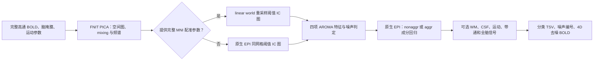

# ICA-AROMA 分类、成分回归与可选混杂回归

## 功能简介与流程图

`run_aroma_pipeline` 读取已经高通的原生 EPI BOLD、脑掩膜和 T×6 运动参数，调用本包单被试 [PICA](../melodic/README.md)，再按 ICA-AROMA 的运动相关、边缘比例、高频比例和 CSF 比例选择噪声成分。给定 MNI 模板、T1→MNI pull 和 EPI→T1 BBR 时，它先把阈值 IC 图映射到 MNI152 2 mm，再用官方三张标准掩膜分类；[整链入口](README.md)默认走这一路径。分类后在原生 EPI 空间回归噪声 IC；WM/CSF/motion、带通和全脑信号回归可选。独立调用时不提供配准参数，也可用与 BOLD 同网格的三张掩膜分类。



## Python 调用、输入输出与参数

此函数处理一份 4D BOLD（T 个时间点），内部 ICA 与回归联合使用全部 T 帧。`brain_mask` 必须与 BOLD 同网格；分类用的 `csf_mask`、`edge_mask` 和 `outside_mask` 必须与阈值 IC 图的分类网格一致。给定 `mni_template`、`mni_pull_ras`、`epi_to_t1_world` 时，分类网格为 MNI152 2 mm；三者均不提供时为 BOLD 原网格。`regression_csf_mask` 单独指定原生 EPI 网格的完整 CSF 组织掩膜供可选信号回归；在 MNI 分类模式启用 `regress_csf=True` 时必须填写，不能把 MNI 分类掩膜用于原生 EPI 信号回归。

```python
from fnit import run_aroma_pipeline

aroma = run_aroma_pipeline(
    filtered_func_data="/absolute/path/feat/filtered_func_data.nii.gz",  # FEAT 核心后 4D BOLD
    brain_mask="/absolute/path/feat/mask.nii.gz",                        # 与 BOLD 同网格的 3D 脑掩膜
    motion_parameters="/absolute/path/feat/mc/prefiltered_func_data_mcf.par",  # T×6 运动参数
    csf_mask="/absolute/path/native_csf_mask.nii.gz",               # 独立原生 EPI 模式：自备同网格 3D CSF 掩膜
    edge_mask="/absolute/path/native_edge_mask.nii.gz",             # 自备同网格 3D 脑边缘掩膜
    outside_mask="/absolute/path/native_out_mask.nii.gz",            # 自备同网格 3D 脑外掩膜
    output_dir="/absolute/path/aroma",                                   # PICA、分类、清理结果目录
    n_components=None,                                                   # PICA 自动定阶；整数为固定 IC 数
    tr=0.735,                                                            # TR，秒；None 时读 NIfTI header
    mode="nonaggr",                                                      # 非激进回归；aggr 为激进回归
    device="cuda:0",                                                     # PyTorch 设备；None 自动选择
    n_splits=1000,                                                        # 运动相关特征的 90% 时间点重复抽样次数
    random_state=0,                                                       # PICA 初始化与抽样随机种子
    ica_max_iter=500,                                                     # PICA 独立性优化迭代上限
    wm_mask="/absolute/path/masks/wm_epi.nii.gz",                        # 可选 WM 掩膜；None 不回归 WM 均值
    regression_csf_mask="/absolute/path/masks/csf_epi.nii.gz",          # 可选 CSF 回归专用完整掩膜；None 时复用分类掩膜
    regress_csf=True,                                                     # AROMA 后是否另回归 CSF 均值
    regress_motion=True,                                                  # AROMA 后是否另回归运动参数
    motion_model=24,                                                      # 运动回归列数：6、12、24
    bandpass=(0.01, 0.1),                                                 # Hz；None 不做带通
    global_signal=False,                                                  # 是否加入全脑均值回归
    mni_template=None,                                                     # MNI 模板；与下面两项一起提供时，把 IC 投到标准空间分类
    mni_pull_ras=None,                                                     # MNI→T1 的 3 分量 RAS 毫米 pull 位移场；本例 None，使用原生 EPI 掩膜
    epi_to_t1_world=None,                                                  # EPI→T1 的 4×4 RAS 世界坐标 BBR 矩阵；本例 None
)
print(aroma.ica.thresholded_maps)                                        # PICA 概率阈值空间图
print(aroma.features)                                                    # 每 IC 的四项 AROMA 特征 TSV
print(aroma.noise_components)                                            # 从 1 开始的噪声 IC 编号
print(aroma.denoised_bold)                                               # AROMA 清理后原生 EPI 4D BOLD
print(aroma.confounds_cleaned_bold)                                      # 可选额外回归后的 4D BOLD；未启用时为 None
```

`ica/` 目录包含 X×Y×Z×K 成分图、阈值图、T×K mixing、频谱功率和定阶/收敛信息，文件名见 [PICA 输出](../melodic/README.md)。提供三项 MNI 配准参数时，另输出 `ica_thresholded_MNI152_2mm.nii.gz`，形状为 91×109×91×K，float32；其中每个 MNI 体素从原生 EPI 阈值图取值。`aroma_features.tsv` 有 K 行、5 列：从 1 开始的成分编号与四项特征。`aroma_noise_components.txt` 每行一个从 1 开始的编号。两份清理影像均为 BOLD 原网格、原 TR、float32。混杂回归的输出只在启用 WM、CSF、运动、带通或全脑信号至少一项时写入。

### 独立子函数

若已有 PICA mixing 与阈值图，可独立执行分类与清理；不必再次估计 ICA。官方阈值图和官方三张 MNI 掩膜同输入对照时，应使用 MNI 网格，且 mixing 与运动参数必须来自相同 T 帧。

```python
from importlib.resources import files
from fnit import classify_aroma, denoise_aroma, clean_confounds, motion_regressors

mask_dir = files("fnit").joinpath("fmri", "assets")  # wheel 自带的官方 ICA-AROMA 标准掩膜
features = classify_aroma(
    thresholded_ic_maps="/absolute/path/aroma/ica_thresholded_MNI152_2mm.nii.gz",  # MNI 网格 X×Y×Z×K 阈值 IC 图
    mixing="/absolute/path/ica/ica_mixing.tsv",                          # T×K 成分时间序列
    ftmix="/absolute/path/ica/ica_frequency_power.tsv",                  # ⌊T/2⌋×K 非负频谱功率
    motion="/absolute/path/feat/mc/prefiltered_func_data_mcf.par",      # T×6 运动参数
    csf_mask=str(mask_dir.joinpath("mask_csf.nii.gz")),                 # 与阈值图同网格的官方标准 CSF 掩膜
    edge_mask=str(mask_dir.joinpath("mask_edge.nii.gz")),               # 同网格官方脑边缘掩膜
    outside_mask=str(mask_dir.joinpath("mask_out.nii.gz")),              # 同网格官方脑外掩膜
    tr=0.735,                                                             # TR，秒
    n_splits=1000,                                                         # 运动相关随机抽样次数
    random_state=0,                                                        # 抽样随机种子
)
clean_path = denoise_aroma(
    input_bold="/absolute/path/feat/filtered_func_data.nii.gz",         # 原始待清理 4D BOLD
    mixing="/absolute/path/ica/ica_mixing.tsv",                          # 同一次 PICA 的 T×K mixing
    noise_indices=features["noise_indices"],                              # 从 0 开始的噪声成分索引
    output_bold="/absolute/path/aroma/filtered_func_data_aroma.nii.gz", # AROMA 输出路径
    mode="nonaggr",                                                        # nonaggr 部分回归；aggr 全回归
    device="cuda:0",                                                       # 计算设备
    chunk_size=4096,                                                       # 每批回归的空间体素数
)
motion24 = motion_regressors(
    motion="/absolute/path/feat/mc/prefiltered_func_data_mcf.par",      # T×6 运动参数
    model=24,                                                              # 返回 T×6、T×12 或 T×24
)
cleaned_path = clean_confounds(
    input_bold=clean_path,                                                # AROMA 清理后的 4D BOLD
    output_bold="/absolute/path/aroma/filtered_func_data_aroma_confounds.nii.gz",  # 额外回归输出路径
    wm_mask="/absolute/path/masks/wm_epi.nii.gz",                        # 同网格 WM 掩膜；None 不回归
    csf_mask="/absolute/path/masks/csf_epi.nii.gz",                     # 同网格 CSF 掩膜；None 不回归
    brain_mask="/absolute/path/feat/mask.nii.gz",                        # 全脑掩膜；全脑回归时必需
    motion="/absolute/path/feat/mc/prefiltered_func_data_mcf.par",      # T×6 运动参数；None 不回归
    motion_model=24,                                                       # 6、12、24 列运动设计
    bandpass=(0.01, 0.1),                                                  # Hz；None 不做带通
    tr=0.735,                                                              # TR，秒；None 时读 NIfTI header
    global_signal=False,                                                  # 是否回归全脑均值
    device="cuda:0",                                                       # 计算设备
    chunk_size=4096,                                                       # 每批投影的空间体素数
    projection="orthogonal",                                            # 默认严格投影；afni 使用原版正则化及带通边界
)
```

`classify_aroma` 返回每成分的最大运动相关、edge fraction、high-frequency content、CSF fraction，以及 **0 起始**的 `noise_indices`。`denoise_aroma` 返回输出路径；`nonaggr` 用全部 IC 拟合、只减去噪声 IC 的部分贡献，`aggr` 仅拟合噪声 IC。AROMA 保留体素的时间均值；额外混杂回归去除时间均值，输出仍为原网格、原 TR 的 float32 BOLD。`motion_regressors` 返回 T×6/12/24 NumPy 数组。

`clean_confounds` 先构造截距、一次/二次趋势及选择的信号列。截距保留，其余列去掉常数列后中心化，并按 L2 范数归一化，避免组织信号的大基线或运动参数单位影响数值秩。启用 `bandpass` 时，BOLD 和设计矩阵使用同一个频段；带通后删除只剩 FFT 舍入误差的列，重新归一化有效列，再以 float64 求投影。带通与混杂回归仍是同一个联合投影。`bandpass=None` 时只做混杂和趋势回归，FEAT 阶段的高通另行完成。

以上为默认 `projection="orthogonal"` 的计算。`projection="afni"` 使用原版 `3dTproject` 的单 run 频率边界、float32 设计列，以及按最大奇异值平方乘 `1e-6` 的 SVD 正则化；主投影仍为 PyTorch float64，输出为 float32。它与无正则化投影的数值定义不同，不能把两者的差值当成纯浮点误差。较大的 stopband 设计预先生成残差算子，较小的设计保留两次矩阵乘法，按 `chunk_size` 分块处理。两种选项都不调用 AFNI。

## 命令行调用

本页函数的独立入口为上面的 Python 调用。完整 BIDS→preproc/clean 使用 [`fnit-fmri volume`](README.md#命令行调用)，用 `--aroma-mode`、`--ica-n-components`、`--regress-wm`、`--regress-csf`、`--regress-motion`、`--motion-model`、`--bandpass`、`--confound-projection orthogonal/afni` 与 `--global-signal` 选择相应参数；函数本身没有独立 AROMA CLI。

## 原软件调用

官方 [ICA-AROMA 脚本](https://github.com/maartenmennes/ICA-AROMA/blob/master/ICA_AROMA.py) 的 generic 模式要求 BOLD、运动参数及输出目录；给定 FEAT 仿射和 T1→MNI warp 后，脚本把阈值 IC 图配准到标准空间作空间分类。下面的官方命令只用于独立基准；`-warp` 必须是 FSL warp，而不是本包 RAS pull NIfTI。

```bash
python ICA_AROMA.py -in filtered_func_data.nii.gz -out aroma_ref \
  -mc prefiltered_func_data_mcf.par -m mask.nii.gz \
  -affmat example_func2highres.mat -warp highres2standard_warp.nii.gz \
  -dim 0 -den nonaggr
fsl_regfilt -i filtered_func_data.nii.gz -d melodic_mix \
  -f 2,5,9 -o filtered_func_data_aroma_ref.nii.gz
```

`fsl_regfilt -f` 用从 1 开始的 IC 编号。可选 WM/CSF/motion 与带通的参考脚本为用户指定的 [MATLAB 实现](https://github.com/weikanggong/Resting-state-fMRI-preprocessing/blob/master/g_regressWmCsf_and_filter.m)。本轮已在服务器执行原版 AFNI_24.2.02 `3dTproject -ort confounds.1D -polort 2 -passband 0.01 0.1`，按相同原始设计比较 `projection="afni"`；默认严格投影的独立 NumPy 参考单独报告。

## 最新真实数据精度、耗时与脑图

完整 490 帧、1／8 线程的最新原版 CPU 对照见 [PICA、ICA-AROMA 与混杂回归 CPU 报告](CPU_ICA_BENCHMARK_20261004.md)。下表保留此前固定输入及裁剪控制的历史范围。

| 真实数据同输入项目 | FNIT | 原软件或独立参考 | 差异 |
|---|---:|---:|---|
| 490×106 的官方 MELODIC mixing，运动相关 1000 次抽样 | 6.28 秒 | 官方 ICA-AROMA 函数 6.17 秒 | MAE 4.67×10⁻¹⁷；高频比例逐项一致。 |
| 官方 106 张阈值 IC 图与官方 MNI 2 mm 三张掩膜 | 空间特征 2.33 秒 | 官方 201.02 秒 | edge fraction MAE 3.51×10⁻⁷、CSF fraction MAE 2.32×10⁻⁸；106/106 个噪声判定一致。固定官方 IC 输入，不代表本包自产成分身份相同。 |
| 真实 BOLD 20³×490 裁剪、官方 106 列 mixing，示例噪声 IC 1–3 | CUDA 含 I/O：nonaggr 2.83 秒、aggr 1.27 秒 | FSL `fsl_regfilt`：2.02 / 1.85 秒 | 两种输出逐体素 float32 相同；噪声索引用于算法测试，非真实分类结果。 |

上述测量固定了官方 MELODIC IC 和官方掩膜，检验分类特征和 IC 回归。自产 PICA、配准、AROMA 及最终影像的当前整链时间和保留的原软件差异见[volume 最新实测](README.md#latest-real-benchmark)；这里的固定 IC 控制不能替代整链成分身份比较。

### 混杂回归的真实数据验证

2026-10-01 用合并后源码 `3b9b0f8` 重跑整链，使用一例真实 UKB BOLD，共 490 帧。独立 NumPy float64 SVD 参考读取该次捕获的 AROMA 输出、WM/CSF 掩膜和运动参数，检查全部 97,345 个脑体素，共 47,699,050 个值。WM/CSF 掩膜均为 88×88×64，分别含 25,995 和 11,947 个体素，与原生 BOLD 对齐且位于脑掩膜内。

| 同输入检查 | 结果 |
|---|---:|
| 490×29 设计矩阵，旧伪逆算法 / 当前算法的有效秩 | 23 / 29 |
| 当前 native 输出 vs 独立参考，相关 / MAE / RMSE | ≈1 / 3.395×10⁻⁶ / 5.237×10⁻⁶ |
| 当前 native 输出 vs float32 参考，最大绝对差 | 3.052×10⁻⁵ |
| 旋转从 rad 改写为 degree，当前回归残差 RMSE | 1.045×10⁻¹¹ |
| WM 信号×8+10,000,000、CSF 信号×4+5,000,000，当前回归残差 RMSE | 3.309×10⁻¹⁰ |
| 最终 native BOLD 在脑掩膜外的最大绝对值 | 0 |

单位与基线控制固定同一份真实 AROMA 数据，只改变设计矩阵的表达方式。它们验证当前投影的单位与基线不变性；实际输出与独立参考的差值处于 float32 数值误差量级。复现方法见 [整链验证中的回归检查](../../validation/fmri/volume_fixed.md)，逐项定义、输入哈希和源码标记见 [匿名回归报告](../../validation/fmri/volume_fixed_confounds.public.json)。


完整流程脑图见[volume](README.md#latest-real-benchmark)，其差异包含上游估计与配准，不单独归因于 AROMA。MNI 分类图仍通过公开兼容 `resample_world` 的 linear/grid-constant 分支映射；它实际在用，本次保留，并不把最终公共采样节点的无损验证冒充该中间图的新官方验收。

## 最近版本与 benchmark 记录

2026-10-03 自动 volume 接入发现并修复标准模板存储方向问题：原 ICA-AROMA 掩膜采用 LAS，而安装器提供的已验证 TemplateFlow T1w 采用 RAS。volume 现在仅对同一物理网格执行精确轴置换／翻转，保持原掩膜的 dtype、体素值与世界坐标；不做插值，物理网格不同仍报错。原 LAS 输入保持既有路径和算法。三张真实原掩膜的反向恢复逐值检查通过；十人完整流程的分类精度和耗时另在[整例验证](../../validation/fmri/public_ten_20261003/README.md)报告，不用这项输入检查代替 benchmark。

| 版本/记录 | 变化与保留范围 |
|---|---|
| 2026-10-02 文档整理 | 按当前输入/输出与七节结构统一说明，保留原生/MNI 分类、可选回归和真实误差；不改变重采样或统计定义。 |
| `81f1bb3` 完整 volume | 两后端全部 490 帧对同后端旧 FNIT 逐位相同；PICA/AROMA 阶段 **80.72 / 62.67 s**。该范围见[完整报告](../../validation/fmri/public_resamplers_20261002/README.md)。 |
| `3b9b0f8` 混杂回归 | 设计列中心化/L2 标准化与 float64 投影，真实全部 490 帧及单位/基线控制见[回归报告](../../validation/fmri/volume_fixed_confounds.public.json)。 |
| 固定原 IC 分类与回归 | 官方 106 个 IC 的特征/噪声决策及 20³×490 回归控制保留上表；完整原软件与自产 PICA 差异从[验证索引](../../validation/fmri/README.md)进入。 |

## 参考文献与原实现

- Pruim 等，*ICA-AROMA: A robust ICA-based strategy for removing motion artifacts from fMRI data*，NeuroImage 2015，[DOI](https://doi.org/10.1016/j.neuroimage.2015.02.064)。
- [ICA-AROMA 原代码](https://github.com/maartenmennes/ICA-AROMA)、[FSL MELODIC](https://git.fmrib.ox.ac.uk/fsl/melodic)、[本包 PICA 参数与原实现参考](../melodic/README.md)。
- 用户指定的[WM/CSF 与滤波参考](https://github.com/weikanggong/Resting-state-fMRI-preprocessing/blob/master/g_regressWmCsf_and_filter.m)，当前验证使用独立 NumPy float64 SVD，不称为 MATLAB 或 AFNI 实测。
