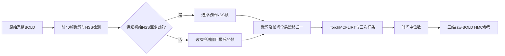
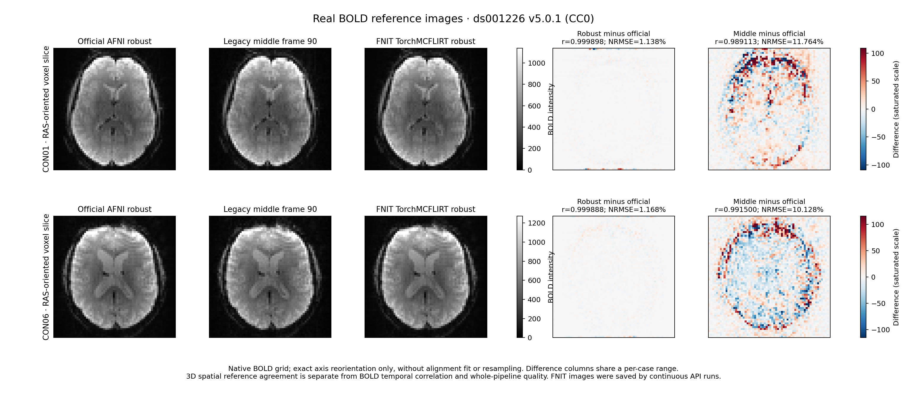

# BOLD参考图：robust策略

## 1. 功能简介

`prepare_bold_reference`从原始BOLD生成三维HMC参考图。它对齐fMRIPrep25.2.4所用NiWorkflows1.14.4的参考选帧、极值裁剪、全局漂移归一与时间中位数步骤；参考图内部的运动校正复用FNIT成熟的TorchMCFLIRT。官方默认使用AFNI Volreg的Fourier插值、two-pass和zpad4，两种运动实现尚未证明等价。

本函数不删除原BOLD帧、不回归confounds，也不读取官方参考结果作为生产输入。FNIT运行只依赖现有Nibabel、NumPy和PyTorch/MCFLIRT，不引入AFNI、FSL、Nipype或fMRIPrep运行依赖。默认float32与项目TF32策略，不启用float16/BF16。参考图的中位数按空间块计算；运动估计沿用MCFLIRT的显存管理。



非稳态检测对前`min(40,T)`帧的float32数据整体裁剪到`[0,P99.8]`，计算每帧全空间均值，再按MAD修正z分数，从第0帧开始连续计数，遇到不超过3.5的帧停止。至少2帧时选择这些初始帧；计数0或1时选择检测窗口最后最多20帧。长序列默认选择索引20–39。此`t_mask`是**参考选帧**，不是“删除全部非稳态帧”的命令。

选中数据另行裁剪；每帧全空间均值除以其中最大值形成`drift`，数据逐帧除以`drift`。多帧参考运动以第一个选中、已归一的帧为目标，最后取时间中位数。偶数帧使用中间两值的平均，不能直接用PyTorch的下中位数代替。3D或整个输入只有1帧时原值直接输出；多帧输入仅选中1帧时，参考同上游使用该原始帧，选中序列文件仍保存裁剪/归一数据。

## 2. Python调用、输入输出和参数

```python
from pathlib import Path
from fnit.fmri.reference import prepare_bold_reference

raw_bold_path = Path("/absolute/bids/sub-CON01/func/sub-CON01_task-rest_bold.nii.gz")
reference_output_dir = Path("/absolute/derivatives/work/sub-CON01/bold_reference")
target_device = "cuda:0"  # 显式目标GPU；CPU诊断可选"cpu"

reference_result = prepare_bold_reference(
    bold=raw_bold_path,                 # 原始完整4D NIfTI，不传官方参考图
    output_dir=reference_output_dir,    # 三个具名输出；已有结果需显式overwrite
    device=target_device,
    dummy_scans=None,                  # 自动NSS数量；手动值只改skip_vols，不改选帧
    n_volumes=40,                      # NSS检测窗口上限
    zero_dummy_masked=20,              # 检出0/1个NSS时参考取窗口最后最多20帧
    nonnegative=True,                  # 裁剪负值到0
    motion_correction=True,            # 默认复用FNIT TorchMCFLIRT
    stage_iterations=(1, 1, 1),        # 三阶段优化迭代上限
    spatial_chunk_size=262144,         # 每次中位数计算的空间点数
    overwrite=False,
)
print(reference_result.reference)
print(reference_result.selected_indices)
print(reference_result.algorithm_dummy_scans, reference_result.skip_vols)
```

`bold`可为`.nii/.nii.gz`路径或Nibabel image。主用途为`X×Y×Z×T`原始BOLD，也接受3D/单帧参考。仿射必须有限可逆，数据必须有限；输出沿用输入空间网格与空间单位。该模块不推断BIDS TR或SBRef实体。

| 参数 | 默认值 | 含义 |
|---|---|---|
| `bold` | 必需 | 原始影像路径或Nibabel image |
| `output_dir` | 必需 | 专用参考产物目录；不把目录存在视为缓存完成 |
| `device` | 自动可用CUDA，否则CPU | PyTorch参考运动/中位数设备；显式CUDA失败不回退CPU |
| `dummy_scans` | `None` | `skip_vols`手动数量，0到T；不改变自动参考选帧 |
| `n_volumes` | `40` | 正整数，检测窗口最多帧数 |
| `zero_dummy_masked` | `20` | 正整数，计数0/1时参考窗口长度上限 |
| `nonnegative` | `True` | True裁剪下限0；False使用P0.2下限 |
| `motion_correction` | `True` | True跑TorchMCFLIRT；False仅用于隔离选帧/强度/中位数控制 |
| `stage_iterations` | `(1,1,1)` | 三个非负整数；与成熟TorchMCFLIRT相同接口 |
| `spatial_chunk_size` | `262144` | 正整数；影响显存分块，不改变中位数定义 |
| `overwrite` | `False` | False拒绝已有具名文件；True重写这三个文件，保留其他文件 |

返回冻结dataclass `BoldReferenceResult`：

| 字段/文件 | 格式与内容 |
|---|---|
| `reference` / `bold_reference.nii.gz` | `X×Y×Z`、float32、原网格；供完整BOLD HMC使用 |
| `selected_volumes` / `bold_reference_selected.nii.gz` | `X×Y×Z×K`、float32；选中帧裁剪/漂移归一后的运动输入，K可小于T |
| `metadata` / `bold_reference.json` | 参数、原T/选中索引、NSS/skip、drift、运动矩阵/参数/cost次数、源码及输出SHA、分步时间、运动等价状态 |
| `selected_indices` | 原BOLD中0起始的选中帧tuple |
| `algorithm_dummy_scans` | 自动检测到的连续初始NSS数量 |
| `skip_vols` | 手动数量或自动数量；只记录，不在本函数截帧 |
| `drift` | 各选中帧全空间均值除以最大值；单帧参考为1 |
| `timing_seconds` | 选帧/读入、裁剪/漂移、参考运动/中位数；`total`到两份NIfTI保存完成，不含随后JSON/hash记录。完整调用墙钟由benchmark外层另测；GPU显式同步 |

仅需审计选帧时可调用`select_reference_volumes(bold, dummy_scans=None, n_volumes=40, zero_dummy_masked=20, nonnegative=True)`，其参数定义相同；返回`ReferenceSelection`的`selected_indices`、`algorithm_dummy_scans`、`skip_vols`和`global_signal`（检测窗口裁剪后的逐帧全空间均值）。

MAD为0时保留上游无epsilon的停止语义：NaN/Inf均不满足`score<=3.5`，检测窗口可能全部计为初始NSS，不能将完全恒定序列自动宣称为NSS0。多帧选中序列全局均值为0时漂移归一未定义，明确报错。输出文件禁止软链接；覆盖失败清除旧complete元数据，旧影像不会被误标为本次完成。

## 3. 命令行调用

此子函数没有独立安装CLI。可保存上面的完整Python示例执行。volume入口支持`--bold-reference-strategy robust`；`middle`保留旧中间帧对照：

```bash
BIDS_ROOT=/absolute/bids
DERIVATIVES_ROOT=/absolute/derivatives
MNI_TEMPLATE=/absolute/assets/tpl-MNI152NLin6Asym_res-02_T1w.nii.gz
MNI_MASK=/absolute/assets/tpl-MNI152NLin6Asym_res-02_desc-brain_mask.nii.gz
SUBJECT_ID=CON01
TARGET_DEVICE=cuda:0

fnit-fmri volume \
  --bids-root "$BIDS_ROOT" --derivatives-root "$DERIVATIVES_ROOT" \
  --subject "$SUBJECT_ID" --device "$TARGET_DEVICE" \
  --mni-template "$MNI_TEMPLATE" --mni-brain-mask "$MNI_MASK" \
  --registration-backend fnirt --fnirt-preset t1 \
  --bold-reference-strategy robust --ignore-slice-timing
```

本轮默认robust针对无SBRef输入。已有SBRef的pipeline兼容路径单独标记；官方fMRIPrep实际上将raw-BOLD参考用于HMC，SBRef优先用于coreg/fieldmap，不能据现兼容路径宣称双方SBRef处理已对齐或已经实测。

## 4. 原软件调用

RobustAverage是NiWorkflows内部接口，没有对应独立官方CLI。以下仅供隔离的官方基准环境使用，**不属于FNIT生产依赖**：

```python
from pathlib import Path
from niworkflows.interfaces.bold import NonsteadyStatesDetector
from niworkflows.interfaces.images import RobustAverage

raw_bold_path = Path("/absolute/bids/sub-CON01/func/sub-CON01_task-rest_bold.nii.gz")
official_work_dir = Path("/absolute/official_reference_benchmark/sub-CON01")
official_work_dir.mkdir(parents=True, exist_ok=False)
detector_work_dir = official_work_dir / "nss"
average_work_dir = official_work_dir / "average"
detector_work_dir.mkdir()
average_work_dir.mkdir()

nss_result = NonsteadyStatesDetector(in_file=str(raw_bold_path)).run(cwd=str(detector_work_dir))
official_result = RobustAverage(
    in_file=str(raw_bold_path), t_mask=nss_result.outputs.t_mask,
    mc_method="AFNI", two_pass=True, nonnegative=True,
).run(cwd=str(average_work_dir))
print(official_result.outputs.out_file)
```

这是参考内部步骤的隔离运行；完整fMRIPrep还在上游验证原BOLD，并将raw reference和coreg reference分别连接。内部AFNI命令相当于`3dvolreg -Fourier -twopass -zpad 4`，具体文件名与矩阵输出由接口生成，不能将FNIT TorchMCFLIRT写成该原命令的严格数值移植。

## 5. 最新版真实精度、耗时与脑图

本轮在OpenNeuro [ds001226 v5.0.1（CC0）](https://openneuro.org/datasets/ds001226/versions/5.0.1)的CON01、CON06真实完整180帧BOLD上测评。两例自动NSS均为0，robust选择原索引20–39，原BOLD保持180帧。旧middle参考严格核对为原BOLD第90帧；新robust参考由连续volume→surface调用内的真实`prepare_bold_reference`生成并发布。原fMRIPrep25.2.4参考为同例AFNI RobustAverage；隔离环境重跑官方节点后，两例与历史保存参考逐值相同。FNIT科学执行源码SHA为`ac885355a286ff6799aaeafc9735de1d0c0264b8afba55041ea4e94b1ddc3484`。

比较在原生3D物理网格上进行，不拟合、不重采样、不强度配准。`r`为三维空间Pearson，`NRMSE=RMSE/sqrt(mean(official_reference²))`；全FOV均为172,032体素。它们与完整BOLD的逐点**时间相关**是不同指标。

| 病例 | FNIT参考策略 | 全FOV空间r | 全FOV NRMSE | 官方非零域空间r | 官方非零域NRMSE |
|---|---|---:|---:|---:|---:|
| CON01 | robust | 0.99989756 | 1.138176% | 0.99989702 | 1.138176% |
| CON01 | middle第90帧 | 0.98911266 | 11.763854% | 0.98905516 | 11.763828% |
| CON06 | robust | 0.99988756 | 1.167785% | 0.99988704 | 1.167785% |
| CON06 | middle第90帧 | 0.99149982 | 10.128147% | 0.99146011 | 10.128147% |

官方非零域分别为170,495与170,816体素。新官方重跑对历史参考在两个域均为`r=1、NRMSE=0、max_abs=0`。FNIT robust比middle更接近这两例官方参考，运动后端仍为TorchMCFLIRT/spline，与官方AFNI Fourier/two-pass不同；这里没有对残余差异做单因素因果分解，也不据3D相关宣称整个pipeline或运动后端等价。完整定义、未定义域状态、逐例SHA与数值见[实际只读报告](../../validation/fmri/reference_alignment_20261004/bold_reference_saved_v1/summary.public.json)和[CSV](../../validation/fmri/reference_alignment_20261004/bold_reference_saved_v1/metrics.csv)。

FNIT时间来自**连续API内参考阶段**，不是独立候选重跑。`TimingSeconds.bold_reference`包围参考生成及helper元数据读取；helper内部`total`到两份NIfTI保存完成，不含随后JSON/SHA记录。该次Torch线程为8，pipeline surface参数`cpu_threads=4`不代表参考helper只用了4个线程；GPU为`cuda:0`、float32/TF32，运动迭代均为`(1,1,1)`。显存采样属于整个连续API，没有独立参考阶段显存峰值。

| 病例 | 选帧/读入(s) | 裁剪/漂移(s) | 参考运动/中位数(s) | helper内部total(s) | 连续API参考阶段外墙钟(s) | middle阶段外墙钟(s) |
|---|---:|---:|---:|---:|---:|---:|
| CON01 | 0.996667 | 0.057172 | 27.132923 | 28.437770 | 28.458448 | 0.297455 |
| CON06 | 0.993396 | 0.049456 | 26.358559 | 27.655894 | 27.676001 | 0.303326 |

官方新调用在gpucw1隔离官方SIF、隐藏CUDA、CPU4串行完成，依次运行ValidateImage→NSS→AFNI RobustAverage。历史节点在nodecw10，原线程数未指定。以下保留两个时钟边界，不能混成同硬件通用速度倍数。

| 病例 | 历史gen_avg节点(s) | 新ValidateImage(s) | 新NSS(s) | 新RobustAverage(s) | 新容器启动→退出(s) |
|---|---:|---:|---:|---:|---:|
| CON01 | 13.861979 | 2.403217 | 0.759365 | 15.338423 | 22.065604 |
| CON06 | 14.037949 | 0.150855 | 0.817873 | 15.420494 | 19.861129 |

新官方原始报告：[CON01](../../validation/fmri/reference_alignment_20261004/bold_reference/CON01.official.public.json)、[CON06](../../validation/fmri/reference_alignment_20261004/bold_reference/CON06.official.public.json)。只读比较与原图绘制另用6.027569s；下图重新排布色条的独立绘图墙钟见[图来源报告](../../validation/fmri/reference_alignment_20261004/bold_reference_saved_v1/figure_provenance.v2.public.json)，不加入任何MRI计时。



图由真实CC0影像像素生成。只做无插值的轴置换/翻转到RAS显示；每例的robust和middle差图共用色阶，按该例绝对差的P99饱和。展示是同一原生网格中间轴位切片，图上空间r/NRMSE仍取完整3D网格。

冻结连续版本另发现一个**pipeline来源记录bug**：后续clean-native sidecar分支覆盖了局部`reference`变量，使`desc-hmc_boldref.json`的`FNIT.SHA256`指向raw 4D BOLD；已发布3D参考图本身复制正确。此次后验不使用该错误字段，而同时核验runner `files.private.json`的真实3D文件SHA、volume元数据`FNIT.Configuration.bold_reference.outputs`的SHA/大小、helper源码ac885及原配置/原报告。原冻结sidecar、MRI及测得时钟保留，pipeline变量名修复与回归另行发布。

复查既有成品可用以下独立入口；只读原数据/原成品，不启动FNIT或原软件：

```bash
# 所有输入均指向本轮已保存的固定版本；新输出不可覆盖旧尝试。
RUN_ROOT=/absolute/FNIT/runs/fmri_reference_alignment_20261004
SOURCE_ROOT=/absolute/FNIT/workspaces/fmri_reference_alignment_20261004/source_v1
INPUT_MANIFEST=/absolute/FNIT/workspaces/fmri_reference_alignment_20261004/input_manifest.private.json
METRIC_HELPER=/absolute/FNIT/workspaces/fmri_reference_alignment_20261004/bold_reference_v1_code/run_reference_benchmark.py
RENDERER_HELPER=/absolute/FNIT/workspaces/fmri_reference_alignment_20261004/bold_reference_v1_code/collect_reference_results.py
CONTINUOUS_DRIVER=/absolute/FNIT/workspaces/fmri_reference_alignment_20261004/runner_v1_code/run_continuous.py
POSTHOC_SCRIPT=/absolute/repository/validation/fmri/reference_alignment_20261004/bold_reference_saved_v1/collect_saved_reference.py
POSTHOC_OUTPUT="$RUN_ROOT/saved_reference_comparison_fresh"

python "$POSTHOC_SCRIPT" --run-root "$RUN_ROOT" --source-root "$SOURCE_ROOT" \
  --manifest "$INPUT_MANIFEST" --metric-helper "$METRIC_HELPER" \
  --renderer "$RENDERER_HELPER" --continuous-driver "$CONTINUOUS_DRIVER" \
  --output "$POSTHOC_OUTPUT"
```

## 6. 更新与benchmark记录

- 2026-10-04：新增独立robust参考子函数，复用TorchMCFLIRT，生产不运行原AFNI/FSL。对齐NiWorkflows1.14.4选帧、float32裁剪/漂移、中位数与3D/单帧分支，严格区别NSS参考mask与截帧数量。
- 同日控制验证：20项通过，包含实际成熟TorchMCFLIRT/spline小非对称fixture、NSS0/1/2与MAD0、手动skip不改变mask、偶数中位数、负值/极值裁剪、单帧原值、输入只读及覆盖失败；这是合同回归，不是实测benchmark。
- 同日真实测评：两例新官方节点隔离重跑成功且逐值复现历史参考；连续API已生成robust与middle各两份成品。参考阶段按上述原时钟与真实3D数值报告，只读采集工具8项身份/计时控制通过，源码/原数据/元数据/原报告前后SHA全部相同。
- 独立候选启动尝试保留：v1在CUDA尚未初始化时调用峰值reset而失败，日志墙钟含1495.969660s锁等待；v2同步初始化遇到CUDA OOM，8.589521s，均未进入参考科学函数。[v1失败](../../validation/fmri/reference_alignment_20261004/bold_reference/CON01.candidate.failed.public.json)、[v2失败](../../validation/fmri/reference_alignment_20261004/bold_reference_v2/CON01.candidate.failed.public.json)没有被重标成功。
- v3显式物理UUID/PCI_BUS_ID并等待≥20,480MiB空闲；确认未进入科学API、无自有CUDA context后停止自有queue/observer/posthoc，保留738.803041s等待及[中断记录](../../validation/fmri/reference_alignment_20261004/bold_reference_saved_v1/standalone_v3.interruption.public.json)。此次结果使用已完成continuous成品，不借这些未完成尝试补造独立FNIT参考墙钟。
- 同日特别说明：冻结版本的boldref sidecar来源SHA记录bug不影响已发布3D像素；由独立成品/helper双重SHA恢复可审查来源关系，变量命名修复在pipeline子函数及其回归中完成，不热改本轮冻结源码。
- 发布前安全回归：参考模块增加文件名与hardlink输入保护，防止输出覆盖自身输入；仅修改读写保护，科学算法保持。模块SHA由实测冻结`ac885355…`变为发布代码`e8efeae…`，root reviewer完成77项CPU合同回归。上述真实MRI/参考比较仍绑定原ac885源码，不重标为新版本执行。

- 1128历史版本：无SBRef时参考为原BOLD第`T//2`帧；本轮保留middle选项做真实A/B，不改标原十例。
- 特别说明：这次是参考策略对齐，不把上游默认AFNI和现有FNIT运动后端差异误报为TorchMCFLIRT子函数bug。接入时mask/HMC/BBR必须实际消费正确参考，不能只更换mask参考而HMC继续另取中间帧。

## 7. 参考文献与固定原实现

- [fMRIPrep25.2.4 raw reference workflow](https://github.com/nipreps/fmriprep/blob/25.2.4/fmriprep/workflows/bold/reference.py)：112–131连接NSS选帧与RobustAverage；实际SIF源码SHA `3f8e041232584dc5d7b58421446f51ddabbe52d27407a46c156853eaf2421bee`。
- [NiWorkflows1.14.4 RobustAverage](https://github.com/nipreps/niworkflows/blob/1.14.4/niworkflows/interfaces/images.py#L240)：249–269单帧，287–313裁剪/漂移，316–354默认AFNI/median；实际SIF源码SHA `dec3bd3781c2be50679c329fcd38f3f8721642882a6eefbd9475e8c2af54f0d6`。
- [NiWorkflows1.14.4 NSS检测](https://github.com/nipreps/niworkflows/blob/1.14.4/niworkflows/interfaces/bold.py#L67)：84–103检测与参考mask；实际SIF源码SHA `fe9fe8354d5695113a7ee3b1323bd40489e7a06b6a0bc8c4e40703fed999b6d1`。
- [Nipype1.10.0 MAD outlier](https://github.com/nipy/nipype/blob/1.10.0/nipype/algorithms/confounds.py#L1151)：1151–1186；官方基准使用它，FNIT仅实现已审计的统计定义、不依赖Nipype。
- Esteban O, et al. fMRIPrep: a robust preprocessing pipeline for functional MRI. *Nature Methods* 2019;16:111–116. [DOI](https://doi.org/10.1038/s41592-018-0235-4)。
- Jenkinson M, et al. Improved optimization for the robust and accurate linear registration and motion correction of brain images. *NeuroImage* 2002;17:825–841. [DOI](https://doi.org/10.1006/nimg.2002.1132)。
- Iglewicz B, Hoaglin DC. *How to Detect and Handle Outliers*. ASQC, 1993：MAD修正z分数的统计来源。
