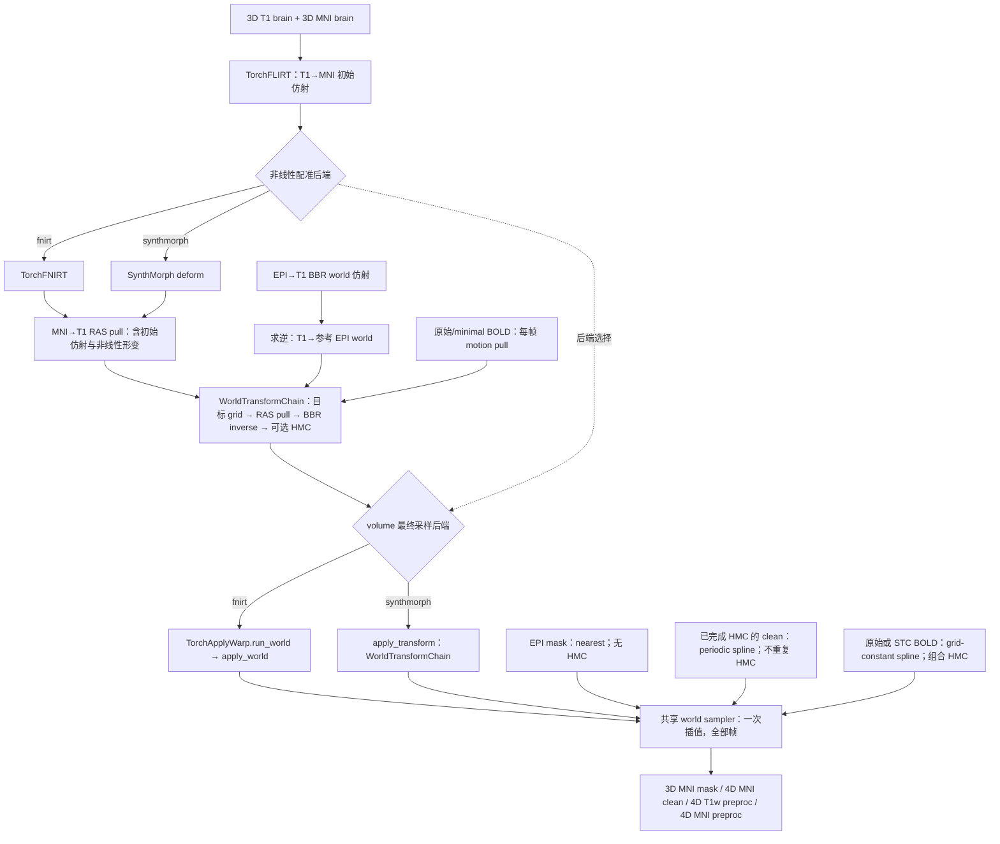
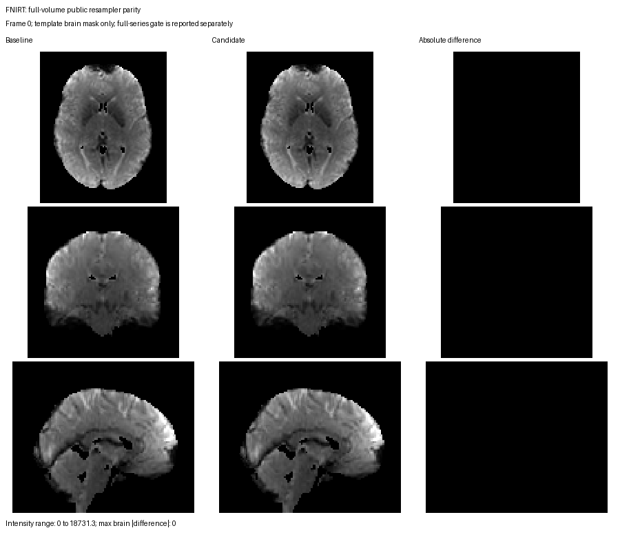

# T1→MNI152 2 mm 配准与公共 BOLD 重采样

## 功能简介与流程图

`register_t1_to_mni` 先用 FNIT `TorchFLIRT` 求 T1→模板的 12 自由度初始矩阵，再从 `SynthMorph` 或 `TorchFNIRT` 中选择非线性配准。两者都输出 **MNI 网格上指向 T1 的 RAS 毫米位移场**。

volume 的四个最终空间采样节点随配准后端调用公共组件：FNIRT 分支使用 `TorchApplyWarp.run_world` / `apply_world`，SynthMorph 分支使用 `apply_transform(WorldTransformChain)`。两种入口共用从成熟 fMRI 实现抽出的 `fnit._world_resampling.resample_world_image`，按原顺序组合形变、BBR 与逐帧运动，只对源 BOLD 插值一次。运行时由 nibabel 读写、NumPy/PyTorch 计算，不调用 FSL、FreeSurfer 或 fMRIPrep。



| volume 最终节点 | 目标与输入 | 插值与坐标规则 |
|---|---|---|
| `mask_mni` | EPI mask→MNI | nearest、grid-constant、float64 world；随后阈值并交模板脑 mask，无逐帧 HMC。 |
| `clean_mni` | 已校正、已去噪的原生 EPI BOLD→MNI | spline、periodic、float64 world；应用输出 mask，不重复 HMC。 |
| `preproc_t1w` | 原始或 minimal BOLD→T1w 原生 BOLD 分辨率 | spline、grid-constant、fmriprep 坐标顺序；组合每帧 HMC。 |
| `preproc_mni` | 原始或 minimal BOLD→MNI | spline、grid-constant、fmriprep 坐标顺序；组合 MNI→T1 pull 与每帧 HMC。 |

FNIT 默认关闭 STC；显式开启时，minimal BOLD 是已完成 STC、尚未做 HMC 的完整序列。pipeline 内部 `_resample_final_volume` 路由这四个节点，其他既有调用仍可使用 `fnit.fmri.normalization.resample_world` 兼容 wrapper。

## Python 调用、输入输出与参数

### T1→MNI 配准

| `register_t1_to_mni` 参数 | 含义 |
|---|---|
| `t1_brain` | 待配准的同被试 3D 去颅骨 T1 NIfTI 文件。由 SynthStrip 生成；这里不接收 4D 影像。 |
| `mni_brain` | 3D MNI152 2 mm 脑模板文件，定义配准的目标影像、输出形变网格。调用者应提供 2 mm 模板；此低层函数只检查它是 3D。 |
| `output_dir` | 输出文件夹；函数创建目录并写出 `.mat` 与 3D 向量 NIfTI。 |
| `backend` | `"synthmorph"` 使用 FNIT SynthMorph deform 权重；`"fnirt"` 使用 FNIT PyTorch FNIRT。默认 `"synthmorph"`。 |
| `synthmorph_weights` | deform 权重文件的绝对路径；只对 `backend="synthmorph"` 有效。`None` 时按 FNIT 权重配置解析。 |
| `reference_mask` | 可选的 `mni_brain` 网格二值掩膜，只供 PyTorch FNIRT 使用；SynthMorph 不读取它。 |
| `fnirt_config` | FNIRT 预设名称或 `FNIRTConfig` 对象；`backend="fnirt"` 时默认 `"t1"`。可用 `dataclasses.replace(T1FNIRTConfig(), ...)` 更改参数；SynthMorph 分支不接收此选项。 |
| `fnirt_execution` | `"optimized"`（默认）用缓存、GPU 平滑与系数空间算子；`"reference"` 保留串行平滑、dense 弯曲算子及原 PCG 执行方式。两者使用相同配置、精度和停止准则；切换只适用于 FNIRT。 |
| `device` | 如 `"cuda:0"` 或 `"cpu"`；`None` 时优先 CUDA。GPU 默认允许 TF32，图像与形变使用 float32，不启用 float16。 |

返回 `T1MNIResult`。`affine` 是 **T1→MNI 的 FSL scaled-mm 初始矩阵文件** `T1_to_MNI152_2mm_affine.mat`；`moving_to_fixed_world` 是对应的 RAS world 4×4 NumPy 数组。`pull_ras` 是 `MNI152_2mm_to_T1_pull_ras.nii.gz`，shape 为 MNI `X×Y×Z×3`，三个分量单位是 RAS 毫米。对某个 MNI world 坐标 `p`，对应 T1 world 坐标为 `p + pull_ras(p)`。这个位移场已经包含初始仿射与非线性形变；应用它时**不要再叠加 `affine`**。`backend` 记录选择的方法；`qc` 在 FNIRT 分支返回逐层优化、强度多项式、偏置场范围和显存精度设置，SynthMorph 分支为 `None`。`timing_seconds` 分开返回 `t1_to_mni_affine`、`t1_to_mni_nonlinear`、`warp_conversion`，仅在阶段边界同步 GPU。完整流程在 BIDS BOLD 的 JSON 中记录 QC 与这些阶段耗时。

### WorldTransformChain：明确的 world 变换链

`WorldTransformChain` 可从 `fnit.applywarp` 或 `fnit.synthmorph` 导入，两处导出同一类型。

| 字段 | 输入结构、含义与默认值 |
|---|---|
| `reference` | 必填，3D NIfTI 路径或 nibabel image；定义最终目标 shape、affine、空间体素尺寸和 header。 |
| `reference_to_source_world` | 必填，有限的 4×4 NumPy RAS world pull 矩阵；在可选位移场之后应用。EPI 输入采用 `np.linalg.inv(bbr.moving_to_fixed_world)`；T1 输入采用完整 MNI→T1 场时传单位矩阵。它不是 FSL scaled-mm 文件。 |
| `pre_affine_pull_ras` | 默认 `None`；与 `reference` 同网格的 X×Y×Z×3 位移 NIfTI 路径或 image，三个分量是 RAS 毫米。先加到目标 world 点，再应用固定矩阵。外部 float64 场保留原值进入 FP64 坐标张量。 |
| `motion_pull_world` | 默认 `None`；需要 HMC 时传 T×4×4 有限数组，每个矩阵从参考 EPI world 指向相应原始帧 world；3D 输入对应 T=1。顺序必须与源影像帧完全对应。 |
| `coordinate_precision` | 默认 `"float64"`，保留原 world 组合顺序；`"fmriprep"` 沿用固定 fMRIPrep 25.2.4/nitransforms 25.1.0 的舍入节点、deformation 查询和源体素空间 HMC 组合。运行时只用本包 NumPy/PyTorch。 |

两种场的契约分别定义：`WorldTransformChain.pre_affine_pull_ras` 表示 RAS world 位移；`TorchApplyWarp(input, reference, warp=...)` 常规入口读取 FSL scaled-mm 相对/绝对场或 FNIRT coefficient。文件为 NIfTI 不意味着它们可以互换。常规 FSL `premat`、`postmat` 的 scaled-mm 矩阵也不能作为本链的 world 仿射。原 `T1MNIResult.pull_ras` 已含初始 affine，不再叠加 `T1MNIResult.affine`。

### 公共重采样参数与返回值

| 参数 | `TorchApplyWarp.apply_world` / `run_world` | `apply_transform` 的 WorldTransformChain 分支 |
|---|---|---|
| 源影像 | `input`：有限值 3D/4D NIfTI 路径或 image。 | `image`：相同源影像定义。 |
| 变换链 | `transformation`：上述 `WorldTransformChain`。 | `transformation`：相同类型。 |
| 插值 | `interpolation="spline"`；可选 `linear`、`nearest`、`spline`。 | `method="linear"`；volume 显式传 `spline`，可选相同三种方法。 |
| 边界 | `boundary="grid-constant"`；可显式选 `periodic`。 | 相同参数与默认值，仅 WorldTransformChain 分支接受此扩展。 |
| 输出 mask | `output_mask=None`；可传目标同网格 3D NIfTI，值>0.5的位置保留。 | 相同参数；全部帧使用同一目标 mask。 |
| 时间帧 batch | `batch_size=8`，每批帧数，正整数。 | `frame_chunk_size=None` 在本链中表示 8 帧；正整数覆盖。与独立 affine/dense sampler 的自动通道政策分别定义。 |
| 空间查询块 | `spatial_chunk_size=262144`，每批查询体素数，正整数。 | 相同参数与默认值。 |
| 设备 | `TorchApplyWarp(device=None)` 构造时指定；默认优先 CUDA。 | `device="cpu"`；volume 显式传 pipeline 选定设备。 |
| 输出文件 | `run_world` 的 `output` 是 NIfTI 路径，自动创建父目录，返回绝对 `Path`；`apply_world` 不写盘。 | 返回 image，调用者用 `nib.save(image, output_path)` 保存。 |
| 输出类型 | world 分支固定 float32 影像。构造函数的 FSL `frame_chunk_size` 不控制 world batch。 | `dtype="float32"`；volume 固定这个值，其他 dtype 是输出转换，不改变内部插值精度。 |
| 填充值 / header-only | world 分支填充值固定为 0，没有这两个参数。 | `fill=0`、`header_only=False`；WorldTransformChain 不接受非零/None fill 或 header-only。 |

`apply_world` 和默认 float32 的 `apply_transform` 返回 nibabel NIfTI image；不是 `ApplyWarpResult`，也不推断一个适用于逐帧 motion 的静态 FSL `valid_mask`。输出 mask 由上述参数显式指定。`run_world` 保存同一完整影像，返回文件路径。

3D 输入输出 3D；4D 输入输出 Xo×Yo×Zo×T，包括 T=1 时保留时间轴，全部源帧与有限负值保留。输出空间 shape、affine、qform/sform 及其 code、空间 zoom 和 extensions 来自目标；4D 的 TR 和时间单位来自源。目标空间单位未知、源明确为 mm 时沿用 mm，其他已声明目标单位保留。错位的 field/mask、非有限输入和不匹配的逐帧矩阵会报错。

`grid-constant` 样条先在三个空间轴补 12 个零体素，再用 float64 镜像系统求系数和查询；源图像及输出仍为 float32。`linear`/`nearest` 使用零扩展的 `grid_sample`，该分支不夹回微小图像外坐标。`periodic` 样条保留 float32 周期系数，三种插值均将 `[−1e-6, N−1+1e-6]` 内的舍入偏差夹回源 FOV，更远位置置零。mask 仍按原乘法应用，保留零的符号位。

world 路径默认每批 8 帧、每批空间查询 262,144 点，不沿时间轴做系数滤波。样条的 FP64 系数、FFT 和查询缓冲按原数据流分块；它不采用独立线性 sampler 的 8 GiB 自动帧预算。本轮 <20 GB 验收的 allocated/reserved 峰值由新验证报告记录。

### FNIRT 分支：配准与 clean 公共调用

```python
import numpy as np
from fnit.fmri.bbr import register_bbr
from fnit.fmri.normalization import register_t1_to_mni
from fnit.applywarp import TorchApplyWarp, WorldTransformChain

bbr_result = register_bbr(
    epi="/absolute/path/example_func.nii.gz",  # 同一 run 的 3D EPI reference
    t1="/absolute/path/sub-0001_T1w_brain.nii.gz",  # 同被试 T1 brain
    wmseg="/absolute/path/sub-0001_T1w_wmseg.nii.gz",  # T1 网格白质二值图
    init=None,  # 由 TorchFLIRT 估计初始 EPI→T1 矩阵
    device="cuda:0",
    grid_search=True,
    execution="batched",
    candidate_batch_size=128,
)
registration_result = register_t1_to_mni(
    t1_brain="/absolute/path/sub-0001_T1w_brain.nii.gz",
    mni_brain="/absolute/path/MNI152_T1_2mm_brain.nii.gz",
    output_dir="/absolute/path/reg",
    backend="fnirt",  # 配准后用下面的 TorchApplyWarp world 入口
    reference_mask="/absolute/path/MNI152_T1_2mm_brain_mask.nii.gz",
    fnirt_config="t1",  # T1 六级预设
    fnirt_execution="optimized",
    device="cuda:0",
)
clean_transform_chain = WorldTransformChain(
    reference="/absolute/path/MNI152_T1_2mm.nii.gz",  # 最终 3D 输出网格
    reference_to_source_world=np.linalg.inv(bbr_result.moving_to_fixed_world),
    pre_affine_pull_ras=registration_result.pull_ras,  # 已含 T1 初始 affine
    motion_pull_world=None,  # clean 已完成 HMC，不再次应用运动
    coordinate_precision="float64",  # 原 clean 的 world 组合
)
world_warper = TorchApplyWarp(device="cuda:0")
clean_mni_output = world_warper.run_world(
    input="/absolute/path/filtered_func_data_clean_epi.nii.gz",
    transformation=clean_transform_chain,
    output="/absolute/path/filtered_func_data_clean_MNI152_2mm.nii.gz",
    interpolation="spline",
    boundary="periodic",  # 保留既有 clean 边界规则
    output_mask="/absolute/path/MNI152_2mm_brain_mask.nii.gz",
    batch_size=8,
    spatial_chunk_size=262144,
)
print(clean_mni_output)  # 绝对 Path；影像保留完整 T 与源 TR
```

### SynthMorph 分支：原始/minimal BOLD 的单次采样

完整 pipeline 在 `registration_backend="synthmorph"` 下先生成自己的配准结果。独立示例用同后端结果及该 run 的 BBR、运动矩阵建立如下链；`bbr_result` 的含义与上例相同。

```python
from pathlib import Path
import nibabel as nib
import numpy as np
from fnit.fmri.normalization import register_t1_to_mni
from fnit.synthmorph import WorldTransformChain, apply_transform

synthmorph_registration_result = register_t1_to_mni(
    t1_brain="/absolute/path/sub-0001_T1w_brain.nii.gz",
    mni_brain="/absolute/path/MNI152_T1_2mm_brain.nii.gz",
    output_dir="/absolute/path/synthmorph_reg",
    backend="synthmorph",
    synthmorph_weights=None,  # 按 FNIT 已校验的权重配置解析
    device="cuda:0",
)
frame_motion_pull_world = np.load(
    "/absolute/path/motion_pull_world.npy",  # shape 为 (T, 4, 4)，与源帧一一对应
    allow_pickle=False,
)
preproc_transform_chain = WorldTransformChain(
    reference="/absolute/path/MNI152_T1_2mm.nii.gz",
    reference_to_source_world=np.linalg.inv(bbr_result.moving_to_fixed_world),
    pre_affine_pull_ras=synthmorph_registration_result.pull_ras,
    motion_pull_world=frame_motion_pull_world,  # 固定配准之后组合每帧 HMC
    coordinate_precision="fmriprep",  # 保留 preproc 的舍入与 HMC 顺序
)
preproc_mni_image = apply_transform(
    image="/absolute/path/minimal_bold.nii.gz",  # 原始 BOLD，或主动开启 STC 后尚未 HMC 的序列
    transformation=preproc_transform_chain,
    method="spline",
    fill=0,
    dtype="float32",
    header_only=False,
    device="cuda:0",
    frame_chunk_size=8,  # world 分支的时间 batch
    boundary="grid-constant",
    output_mask=None,  # preproc 保留完整目标网格
    spatial_chunk_size=262144,
)
preproc_mni_output = Path("/absolute/path/preproc_MNI152_2mm_bold.nii.gz")
preproc_mni_output.parent.mkdir(parents=True, exist_ok=True)
nib.save(preproc_mni_image, str(preproc_mni_output))
```

T1w preproc 使用 T1w 原生 BOLD 分辨率参考、同一 BBR inverse 和逐帧 HMC，`pre_affine_pull_ras=None`。mask 使用 nearest 和无 HMC。四个节点的实际后端由 volume 的 `registration_backend` 统一选择。

### 既有兼容调用

`fnit.fmri.normalization.resample_world(source, reference, reference_to_source_world, output, ...)` 仍保存影像并返回绝对 `Path`，参数名和默认值保留。其其余参数对应上表同名 chain 字段与 sampler 选项，插值默认 `linear`、时间 batch 参数名为 `batch_size=8`、设备默认 `None`。新 volume 最终节点使用上述公共组件；其他已有代码可以继续调用这个 wrapper。

## 命令行调用

volume 命令的后端选项未变；选择后端同时选择配准及四个最终重采样节点。

```bash
fnit-fmri volume \
  --bids-root /absolute/path/bids \
  --derivatives-root /absolute/path/bids/derivatives/fnit \
  --subject 0001 \
  --mni-template /absolute/path/fmriprep/tpl-MNI152NLin6Asym_res-02_T1w.nii.gz \
  --mni-brain-mask /absolute/path/fmriprep/tpl-MNI152NLin6Asym_res-02_desc-brain_mask.nii.gz \
  --registration-backend fnirt --fnirt-preset t1 \
  --device cuda:0 --batch-size 8
# 改为 --registration-backend synthmorph，使用 SynthMorph 配准和公共 apply_transform。
```

完整入口仍要求固定 TemplateFlow MNI152NLin6Asym res-02 模板身份，获取方式见 [volume 资源](README.md#输入安装和模板)。上述独立 Python 函数只要求 3D reference。`--fnirt-execution reference/optimized`、`--bbr-execution reference/batched` 与原来一致。`WorldTransformChain` 以 Python 对象显式传递；常规 `fnit applywarp` / `fnit apply` 命令沿用各自 FSL/RAS 场契约。

## 原软件调用

FSL 的常规 T1→MNI 流程使用整头 T1 和整头 MNI 模板，并以两张去颅骨影像求 FLIRT 初始矩阵。以下命令中的 FSL 仅用于独立 benchmark；FNIT 运行时不调用它。FSL [FNIRT 指南](https://fsl.fmrib.ox.ac.uk/fsl/docs/registration/fnirt/user_guide.html)推荐整头输入，`T1_2_MNI152_2mm.cnf` 包含多尺度、强度映射和偏置场参数。

```bash
flirt -in T1_brain.nii.gz -ref MNI152_T1_2mm_brain.nii.gz \
  -dof 12 -omat T1_to_MNI_affine.mat
fnirt --in=T1.nii.gz --ref=MNI152_T1_2mm.nii.gz \
  --aff=T1_to_MNI_affine.mat --config=T1_2_MNI152_2mm \
  --cout=T1_to_MNI_coeff.nii.gz --iout=T1_in_MNI.nii.gz
applywarp --in=filtered_func_data_clean_epi.nii.gz \
  --ref=MNI152_T1_2mm.nii.gz --premat=example_func2highres.mat \
  --warp=T1_to_MNI_coeff.nii.gz \
  --out=filtered_func_data_clean_MNI152_2mm.nii.gz --interp=spline
```

`--interp=spline` 选择三次样条；不指定时 FSL `applywarp` 默认用三线性。下面的配准对照比较两种方法估计出的形变；[固定 warp 的插值对照](../../validation/fmri/resampling.md)则固定输入 BOLD 和变换，只比较重采样器。

固定**与 FNIT 完全相同的两张去颅骨输入**时，可把上面 `fnirt` 的 `--in`、`--ref` 换成 `T1_brain.nii.gz`、`MNI152_T1_2mm_brain.nii.gz`，并添加 `--refmask=MNI152_T1_2mm_brain_mask.nii.gz`。下面的实测对照使用这一组输入；它与 FSL 推荐的整头 FNIRT 输入不同。

SynthMorph 使用学习得到的 deform 网络。PyTorch FNIRT 复用 FNIT 的 B 样条和 Gauss–Newton/LM 核心，`T1FNIRTConfig` 采用官方六级采样、平滑、正则化及 `intorder=5` 的强度设置；后者表示常数项至四次项共 5 个系数。T1 分支在前五级用同一 LM/PCG 法方程联合优化形变、强度多项式和 50 mm 三次 B 样条乘性偏置场，最后一级固定强度参数。两后端共享输出网格及位移场定义，实际形变差异用下面的配准后 T1 强度、脑支持区和 RAS 坐标差量化。

<a id="最新真实数据-benchmark"></a>

## 最新真实数据精度、耗时与脑图

### 当前公共入口与完整 volume

`81f1bb3` 的 FNIRT/SynthMorph 四个最终节点实际路由、完整 **490 帧**新旧 FNIT 逐位精度、分步骤时间和 allocated/reserved 均已验证，集中见[volume 当前实测](README.md#latest-real-benchmark)与[独立报告](../../validation/fmri/public_resamplers_20261002/README.md)。FNIRT API 含保存为 **542.12 s**，SynthMorph 为 **461.54 s**；峰值 allocated 为 **6.50 / 13.31 GB**。此入口重构保留原有机制，不新增官方等价结论。



### 官方配准与固定变换采样

| 验证范围 | 指标与计时 | 报告 |
|---|---|---|
| 2026-10-01，同一真实已处理 T1、FSL 初始 affine 和 mask，仅六级 FNIRT | 当时 optimized 首次/热调用 **32.595 / 30.422 s**；FSL CPU **217.558 s**。warped T1 r **0.99771788**、RMSE **16.83218**；pull median/p95 **0.05176 / 0.23294 mm**，脑支持 Dice **0.99922162**。 | [配准报告](../../validation/fmri/registration_gpu.current.public.json)、[FNIRT 独立页](../fnirt/README.md#t1w-专用预设当前-gpu-修复版) |
| 2026-10-02，FNIRT 无损算子优化 | 三条完整 pipeline 实际执行 FNIRT；完整 volume 对此前候选和集成版科学输出逐位相同。 | [版本绑定的完整报告](../../validation/registration_lossless_20261002/README.md) |
| 固定 FNIT 变换与目标网格，490 帧 preproc 对官方串行函数 | T1w **37.97 s**、MNI **99.19 s**（含读写）；两者最大差 **0.00048828125**，原数值门通过。 | [全帧控制](../../validation/fmri/fmriprep/native_float32_resampler_invariance_full490.public.json) |
| 固定官方实际目标与变换，490 帧 preproc | T1w **32.96 s**，max **0.0009765625**，通过；MNI **107.94 s**，RMSE **33.6142**、max **22930.4144**，未通过。 | [实际节点报告](../../validation/fmri/fmriprep/actual_node_interpolation_full490.public.json) |

FNIRT CPU 命令包括启动和读写；FNIT 函数计时排除最终写盘；共享资源与计时范围不同。固定 T1 的更早处理来源未知，也不等于扫描仪原始 T1。最新 FNIRT 性能与 profile 应读取版本绑定的独立功能页，不用旧单函数时间代替完整 pipeline。

官方实际 MNI 产物有 **12/490 帧**不等于同输入串行源码回放，原因仍未确定；FNIT 对串行回放最大差 **0.000244140625**。保留实际产物未通过的门，见[失败诊断](../../validation/fmri/fmriprep/actual_node_mni_replay_failure.public.json)。

当前 clean 的周期系数边界、World 最近邻半整数取偶与 FSL 对应规则不同；SynthMorph World 样条也不是官方默认线性 apply。固定 warp 的历史高度相关结果不能关闭这些机制差异，详见[重采样审计](../../validation/fmri/resampling_audit_20261002/README.md)。本次整理保持原算法。

跨 run 解剖缓存的真实测试：首次 **41.118 s**，哈希核验命中 **0.0785 s**，产物 SHA 相同。缓存包括本包 FLIRT 初始化，不是固定 FSL affine 的 FNIRT 控制；范围与失效条件见[volume 输出](README.md#输出结构与来源)。

## 最近版本与 benchmark 记录

| 版本/日期 | 更新与保留证据 |
|---|---|
| 2026-10-02 文档整理 | 统一当前公共入口及参数说明；历史表转专属报告，算法不变。 |
| `81f1bb3` | FNIRT 用 `TorchApplyWarp.run_world`，SynthMorph 用 `apply_transform(WorldTransformChain)`；四个最终节点与原 FNIT 完整输出逐位相同。 |
| 2026-10-02 FNIRT 优化 | 固定输入及真实 volume/fastvbm/dMRI 连续调用验收，见[统一报告](../../validation/registration_lossless_20261002/README.md)。 |
| 2026-10-01 共享采样子函数修正 | 保留 RAS mm 单位、外部 float64 场精度及长度 1/2 的镜像/周期短轴支持；原生 float32 场的完整 490 帧输出不变。见[全帧报告](../../validation/fmri/fmriprep/native_float32_resampler_invariance_full490.public.json)、[短轴控制](../../tests/test_spline_small_axes.py)。 |
| `3b9b0f8` clean 固定变换 | 8 帧对 FSL max 0.05496，未逐值一致；[原报告](../../validation/fmri/volume_fixed_resampling.public.json)保留输入哈希、退出码和验收条件。 |

历史 STC、实际官方节点与 clean 完整对照从[验证索引](../../validation/fmri/README.md)进入；时间和精度均保持实际版本，不改标为本次新实测。

## 参考文献与原实现

- 固定 fMRIPrep 25.2.4 [单次重采样源码](https://github.com/nipreps/fmriprep/blob/25.2.4/fmriprep/interfaces/resampling.py)。其原始文件 SHA 与实际镜像一致；官方软件只作为上述独立对照。
- 固定 NiTransforms 25.1.0 [仿射坐标精度与映射](https://github.com/nipy/nitransforms/blob/25.1.0/nitransforms/linear.py)、[形变网格查询](https://github.com/nipy/nitransforms/blob/25.1.0/nitransforms/nonlinear.py)。FNIT 用自己的 NumPy/PyTorch 路径实现对应坐标组合，运行时不导入 NiTransforms。
- Esteban et al. *fMRIPrep: a robust preprocessing pipeline for functional MRI*. Nature Methods (2019), [doi:10.1038/s41592-018-0235-4](https://doi.org/10.1038/s41592-018-0235-4)。
- FSL [FNIRT 原文档](https://fsl.fmrib.ox.ac.uk/fsl/docs/registration/fnirt/user_guide.html)；配准算法、原实现与文献详见 [FNIRT](../fnirt/README.md)、[FLIRT](../flirt/README.md)与 [SynthMorph](../synthmorph/README.md)功能页。
