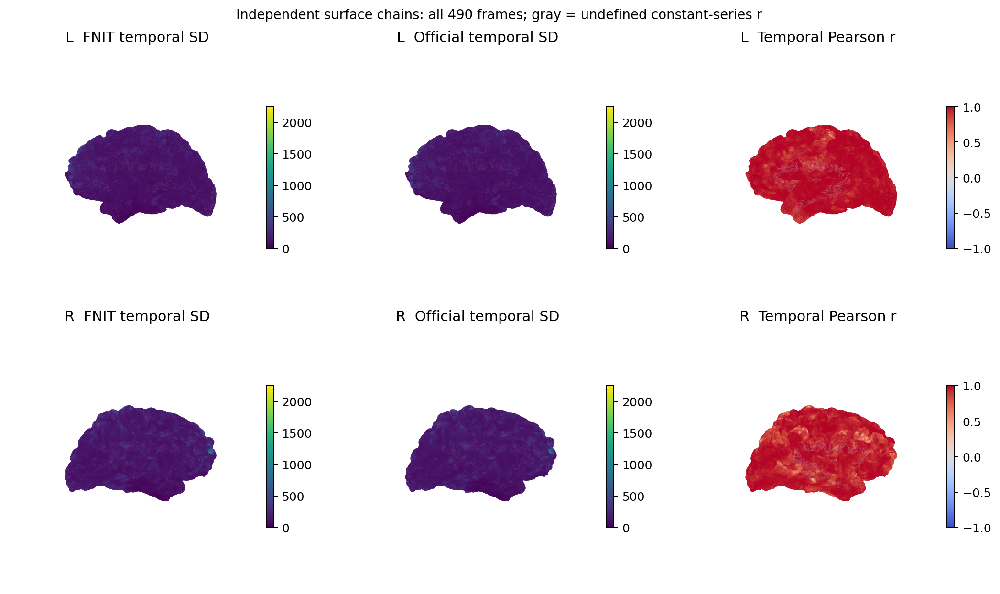

# fMRI 表面流程：fsLR32k 时间序列与 91k CIFTI

## 功能简介与流程图

`fMRISurface_pipeline` 将同一 run 的 [FNIT volume BIDS Derivatives](README.md) 和 T1w recon-all 几何转换为双侧 fsLR32k GIFTI 与 91k CIFTI。默认 `signal="preproc"`：皮层读取 volume 保存的 T1w 空间、原生 BOLD 分辨率时间序列，皮层下读取对应的 MNI152NLin6Asym 2 mm 时间序列；两者保留相同原始帧数与 BIDS TR。该输入包含 volume 实际执行的切片时间校正和运动变换，不经过 AROMA、混杂回归、时间滤波或全局强度归一化。

可选 [MSMAll](../msm/msmall.md) 在 MSMSulc 后使用明确提供的个体/参考多特征球面配准。无个体髓鞘图时可明确使用连接特征 `C`；`CA`、`CAT` 需要额外提供个体髓鞘图及相应特征。本入口不自动执行 HCP `CA_CAT` 外层迭代、UKB DeDrift 或 FIX。

切片时间校正默认关闭，由 volume 的 `slice_timing=False` 控制；volume CLI 可显式写 `--ignore-slice-timing`。surface 读取其实际 STC 状态，不再次进行时间校正。需要开启时在 volume API 设置 `slice_timing=True`，重新生成对应 preproc 后再投影。

表面路径包括 FS→fsLR 初始球面、MSMSulc、Workbench ribbon 投影、10 mm 最近邻填补、原生 ROI、ADAP_BARY_AREA 重采样、32k ROI，最后按 NiWorkflows 1.14.4 组装 CIFTI。最新复测从已有 volume 和 recon-all 开始，完整执行默认 MSMSulc、投影与组装，与固定 fMRIPrep 25.2.4/sMRIPrep 0.19.2 和官方 newMSM 独立 surface 链比较；MSM 的独立用法见 [MSMSulc 子函数](../msm/README.md)。运行时使用 FNIT、PyTorch、nibabel 和 Connectome Workbench；原软件用于独立参考对照。

本地 MSMSulc 扩展须与源码同步。拉取包含 C++ 变更的更新后，在已激活的 FNIT 环境、仓库根目录执行 `python -m pip install .` 重新编译；本轮重建与复测记录见验证部分。


## Python 调用、输入输出与参数

### 输入与资源

先运行当前 `fMRIVolume_pipeline`，保留以下输入：

| 输入 | 格式与用途 |
|---|---|
| 原始 BIDS 根目录 | 与 volume 相同；提供被试/run 实体、源 BOLD、源 T1w 和原始 `RepetitionTime`。 |
| FNIT volume Derivatives | 默认读取 `space-T1w_res-native_desc-preproc_bold.nii.gz` 和 `space-MNI152NLin6Asym_res-2_desc-preproc_bold.nii.gz` 及其 JSON；同时需要 T1w 脑图。 |
| recon-all subject 目录或 ZIP | `mri/orig.mgz`、`mri/orig/001.mgz` 和双侧 `surf/{white,pial,sphere,sphere.reg,sulc,thickness}`；每侧还需 `midthickness` 或 `graymid`。ZIP 内路径以 `FreeSurfer/` 开头。 |
| HCP/fsLR 与 TemplateFlow 资源 | 32k/164k 球面、脑沟参考图、ROI、MSMSulc Finalconf，以及 MNI152NLin6Asym 2 mm HCP 皮层下 dseg；安装器逐文件检查 SHA-256。 |
| Connectome Workbench | 主页 Conda 环境包含此程序；`wb_command` 必须能够执行。 |
| 可选 MSMAll 输入 | 双侧 `MSMAllInputs` 或 JSON 清单；每侧特征和权重须匹配原生顶点顺序，或使用经 MSMSulc 映射的 canonical fsLR32k 球面顺序。 |

流程先读取 volume JSON 的 `FNIT.SourceT1w` 再选择对应 T1 产物，并核对原始 BOLD 来源与标准模板身份。旧 volume JSON 缺少模板身份或默认 preproc 输入时，需要重新运行 volume；若使用当前已核验来源的去噪结果，可显式选择 `signal="clean"`。clean 分支核对 ICA-AROMA 已完成，使用 BBR 将原生 EPI clean BOLD 重采样到 T1w 后投影；WM、CSF 和运动回归可选。

T1w 可以通过 BIDS 内的文件符号链接指向外部存储。表面入口保留其 BIDS 逻辑路径用于解剖产物命名与 `Sources`；此前解析真实目标后再取 BIDS 相对路径会失败。多个 BIDS 文件链接到同一目标时，按 `SourceT1w` 的明确逻辑路径选择；无法唯一选择时拒绝处理。该字段必须是相对 BIDS 路径，不能包含绝对路径或 `..`。

未提供 `fsnative_to_t1w` 时，`mri/orig/001.mgz` 与 volume 所用原始 T1w 在规范 RAS 方向下必须具有一致网格、仿射和体素内容。已有重建若使用另一 T1w 空间，需提供经过核对的正向 **fsnative scanner-RAS → 源 T1w scanner-RAS** 4×4 仿射；流程检查矩阵有限、齐次且可逆，并记录矩阵与来源。该参数使用毫米世界坐标，不接受直接把 FSL FLIRT 矩阵作为世界变换。

几何转换使用 `mri/orig.mgz` 的 scanner-RAS/tkRAS 对应关系。每侧优先读取已有 `midthickness`，其次读取 `graymid`；两者均缺失时明确报错，需要补齐同一重建来源的中层面。流程不使用 white/pial 顶点均值生成替代中层面。默认只需要 T1w；T2w、FLAIR 可用于先前的 recon-all 重建，本流程不读取它们或自动生成髓鞘图。MSMAll 仅在提供 `msmall_inputs` 时运行。

T1w preproc 的网格可与 T1w 脑图不同；其实际体素大小必须与所选 SBRef（没有 SBRef 时为原始 BOLD）在规范 RAS 方向下的体素大小一致，按采样参考规则保留三位小数。不能仅靠 JSON 的 `Resolution` 字段把其他分辨率标为原生 BOLD 分辨率。

资源准备：

```bash
fnit-setup-fmri-surface-assets \
  --output-dir /absolute/path/hcp_surface_assets \
  --fmriprep
```

使用可选 MSMAll 时在资源命令中加 `--msmall`，安装多特征配置、d40 参考和 WRN 的 d7–d21 图；新增低维模板从固定 HCP 上游下载，逐文件检查大小与 SHA-256。

已核对再分发许可的 HCP 文件优先从 [FNIT 固定 Release](https://github.com/weikanggong1/Fudan-Neuroimaging-toolkit/releases/tag/assets-v1)获取，失败后回退 HCPpipelines 原站；TemplateFlow HCP dseg 保持原站下载。文件清单与许可见[权重和资源说明](../WEIGHTS.md)。

clean 的原生/MNI JSON 都须匹配来源、TR 和已完成的 ICA-AROMA；旧 clean JSON 可没有 `Signal`，但若显式标成其他信号会拒绝。preproc 缺失时需重跑 volume 或明确选择 clean，不能自动换分支。

### 单独准备已有重建的表面

这两个公开子函数与完整 surface 入口共用几何转换代码，读取已有中层面，不生成 white/pial 的均值替代物。

| 函数 | 输入与参数 | 输出 |
|---|---|---|
| `prepare_t1w_surface_geometry` | `subject_dir` 为 recon-all 目录；`output_dir` 为输出目录；`fsnative_to_t1w=None` 表示不追加世界仿射，或提供上述正向 4×4 变换；`overwrite=False` 保护已有文件。 | 双侧 T1w scanner-RAS 的 white、pial、midthickness，共六个 GIFTI；返回左右路径、顶点数和实际中层面来源。 |
| `prepare_fmriprep_surface_inputs` | `subject_dir` 同上；`hcp_assets_dir` 为已校验资源目录；`output_dir` 为输出目录；`wb_command="wb_command"` 为 Workbench 路径；`fsnative_to_t1w=None` 与 `overwrite=False` 同上。 | `native/` 下六个几何 GIFTI，以及双侧原生 FS 球面、FS→fsLR 初始化球面、原始/填洞/去岛 ROI，共 16 个文件；返回几何、初始化球面和最终个体 ROI 路径。 |

```python
from fnit.fmri import prepare_t1w_surface_geometry, prepare_fmriprep_surface_inputs

t1w_surface_geometry = prepare_t1w_surface_geometry(
    subject_dir="/absolute/path/recon-all/sub-0001",         # 同源已有重建
    output_dir="/absolute/path/t1w_surfaces",                # 只保存六个几何 GIFTI
    fsnative_to_t1w=None,                                   # 或正向 scanner-RAS 世界仿射
    overwrite=False,                                       # 任一已有文件均阻止覆盖
)
left_t1w_middle = t1w_surface_geometry.left.midthickness

surface_preparation = prepare_fmriprep_surface_inputs(
    subject_dir="/absolute/path/recon-all/sub-0001",        # 已有重建，含 midthickness 或 graymid
    hcp_assets_dir="/absolute/path/hcp_surface_assets",      # 固定 HCP/fsLR 资源
    output_dir="/absolute/path/prepared_surfaces",           # 完整准备结果的保存目录
    wb_command="wb_command",                               # Connectome Workbench
    fsnative_to_t1w=None,                                   # 或正向 scanner-RAS 世界仿射
    overwrite=False,                                       # 任一已有产物均阻止覆盖
)
left_t1w_middle = surface_preparation.geometry.left.midthickness
left_initial_sphere, right_initial_sphere = surface_preparation.initial_spheres
left_native_roi, right_native_roi = surface_preparation.individual_rois
```

共享准备子函数已修复发布问题：原几何函数可能先写左侧、再因右侧缺文件或已有输出失败；完整准备函数原先没有对球面和 ROI 应用覆盖保护。现在对六个或 16 个产物统一预检，在同一文件系统中暂存后发布，失败保留之前的完整结果。`overwrite=False` 同样保护悬空符号链接，并在创建最终文件时拒绝并发出现的同名文件。该修改保留原坐标变换、顶点顺序和 Workbench 运算。

低层 `run_fmriprep_surface_projection` 也共用覆盖保护，要求 T1w BOLD 使用有限、可逆的毫米世界仿射；帧数、TR 单位及 MNI/dseg 网格检查与完整入口一致。

### Python 调用与参数

```python
from fnit import fMRISurface_pipeline

surface_result = fMRISurface_pipeline(
    bids_root="/absolute/path/bids",                       # volume 使用的原始 BIDS 根目录
    derivatives_root="/absolute/path/bids/derivatives/fnit", # 当前 FNIT volume 结果根目录
    subject="0001",                                        # sub 标签，不含 sub-
    recon_all="/absolute/path/recon-all/sub-0001",           # 匹配源 T1w 的 subject 目录或 ZIP
    hcp_assets_dir="/absolute/path/hcp_surface_assets",     # 安装器核验的表面资源目录
    session=None,                                          # ses 标签；无 session 时为 None
    task="rest",                                           # task 标签
    run=None,                                              # 多 run 时指定 run 标签
    acquisition=None,                                      # 按 acq 标签筛选
    direction=None,                                        # 按 dir 标签筛选
    reconstruction=None,                                   # 按 rec 标签筛选
    echo=None,                                             # 按 echo 标签筛选
    signal="preproc",                                      # 默认 minimally preprocessed 输入；可显式选 clean
    fsnative_to_t1w=None,                                  # 同源 T1 身份检查；或提供正向世界仿射文件/数组
    registered_spheres=None,                               # 默认估计 MSMSulc；或给 (左球面, 右球面)
    msm_config=None,                                      # 默认 HCP 四级配置；或 MSMSulcConfig / 官方配置文件
    msm_execution="optimized",                           # 缓存与传输优化；reference 用于同算法执行对照
    msmall_inputs=None,                                   # 可选 L/R MSMAllInputs 字典或 JSON 清单
    msmall_config=None,                                   # 默认三级 refine；或 MSMAllConfig / 官方配置文件
    goodvoxels=None,                                       # 默认无额外 volume ROI
    wb_command="wb_command",                               # Workbench 命令名或绝对路径
    device="cuda:0",                                       # PyTorch 计算设备，也可为 cpu
    overwrite=False,                                       # 保护全部同名最终产物
)
print(surface_result.left)                # 左半球 T 帧 × 32,492 顶点 GIFTI
print(surface_result.right)               # 右半球 T 帧 × 32,492 顶点 GIFTI
print(surface_result.dtseries)            # T × 91,282 CIFTI
print(surface_result.qc_report)           # 持久化 QC JSON
print(surface_result.registered_spheres)  # 持久化的 (左, 右) 注册球面
```

| 参数 | 含义与默认值 |
|---|---|
| `bids_root` | 原始 BIDS 数据根目录；必填。 |
| `derivatives_root` | 同一 BIDS 数据集的 FNIT Derivatives 根目录；必填。 |
| `subject` | 被试标签，不含 `sub-`；必填。 |
| `recon_all` | recon-all subject 目录、含 `FreeSurfer/` 的父目录，或具有该内部结构的 ZIP；必填。 |
| `hcp_assets_dir` | 经安装器核验的 HCP/fsLR 和 fMRIPrep dseg 资源根目录；必填。 |
| `session` | `ses` 标签，默认 `None`。 |
| `task` | `task` 标签，默认 `"rest"`。 |
| `run` | `run` 标签，默认 `None`；多候选时需明确选择。 |
| `acquisition` | `acq` 标签，默认 `None`。 |
| `direction` | `dir` 标签，默认 `None`。 |
| `reconstruction` | `rec` 标签，默认 `None`。 |
| `echo` | `echo` 标签，默认 `None`。 |
| `signal` | 默认 `"preproc"`；`"clean"` 显式选择去噪 volume 输入。 |
| `fsnative_to_t1w` | 默认 `None`；可传 4×4 NumPy 数组或文本矩阵路径，方向为 fsnative scanner-RAS 到源 T1w scanner-RAS。 |
| `registered_spheres` | 默认 `None`，运行 FNIT MSMSulc；可传 `(left_path, right_path)`，必须与原生表面顶点和拓扑相符。提供球面时记录 `provided registered spheres` 与 `EstimatedHere=False`。 |
| `msm_config` | 默认 `None`，使用 HCP 四级配置；可传 `MSMSulcConfig` 或受支持的官方配置文件路径。不能与 `registered_spheres` 同时指定。 |
| `msm_execution` | 默认 `"optimized"`，缓存固定几何并合并传输；`"reference"` 保留逐块检查，使用相同算法与停止条件。 |
| `msmall_inputs` | 默认 `None`；可传含 `L`、`R` 的 `MSMAllInputs` 字典或 JSON 清单。在本次 MSMSulc 之后估计多特征配准，不能与 `registered_spheres` 同时使用。 |
| `msmall_config` | 默认 `None`，使用 HCP 三级 refine；可传 `MSMAllConfig` 或受支持的配置文件路径。仅与 `msmall_inputs` 一起使用。 |
| `goodvoxels` | 默认 `None`，与固定参考的默认投影一致；可传与实际 T1w BOLD 同网格的有限、非负、非空 3D ROI，限制 ribbon 内参与采样的体素。 |
| `wb_command` | 默认 `"wb_command"`；命令名或可执行文件绝对路径。 |
| `device` | 默认 `"cuda:0"`；PyTorch 重采样和 MSMSulc 的设备。Workbench 使用 CPU。 |
| `overwrite` | 默认 `False`；任一最终数据、JSON、QC 或注册球面已存在时拒绝覆盖。成功检查所有结果后整批发布；发布异常回滚已有结果。 |

估计球面时，JSON 还记录实际 MSM 配置、执行方式和双侧配准报告；`msmsulc_preparation_and_registration` 单列准备与球面估计时间，提供外部球面时不生成这项计时。

MSMAll 模式另记录 `msmall_registration_and_native_composition` 耗时、实际多特征配置、每侧特征网格与输入 SHA-256；QC 同时保留初始 MSMSulc 和 MSMAll 的双侧报告。

默认球面遵循 HCP/sMRIPrep 的 `simval=3,2,2,2`、最大迭代数 `50,10,15,15`。`msm_config` 仅在估计球面时使用，不能与 `registered_spheres` 同时指定。独立用法及各配置参数见 [MSMSulc](../msm/README.md)。命令行可加 `--msm-config /absolute/path/MSMSulcStrainFinalconf` 和 `--msm-execution reference` 复测相同科学配置的执行路径。

### 可选 MSMAll 接续

先用 [VN、DR/WRN 与特征准备模块](../msm/features.md)从已清理的时间序列准备同一空间的连接图和权重，再把双侧 `MSMAllInputs` 传给上述 `msmall_inputs`。原生特征保留 recon-all 顶点顺序，未填写 `initial_sphere` 时由入口使用本次 MSMSulc 球面；canonical fsLR32k 特征对应已经投影到 MSMSulc 表示的时序，求得的 32k 变形会合成到原生 MSMSulc 球面后重新投影 BOLD。不能把 32k 特征附在原生球面上。

`C` 只使用连接特征；`CA`、`CAT` 的个体髓鞘、bias 和拓扑特征须显式提供，输入准备不自动降成 `C`。MSMAll 的配置、源/参考坐标与输出范围见[功能页](../msm/msmall.md)。此步骤估计空间配准，不重新进行 AROMA、混杂回归或 FIX。注册特征来自已清理的时序，最终投影仍由 `signal` 明确选择；要保存去噪时序，设置 `signal="clean"`。

### 输出与检查

输出位于 `sub-0001/func/`；有 session 时为 `sub-0001/ses-<label>/func/`。文件名继承源 BOLD 的 run、acq 等实体。默认 `preproc` 的完整产物如下；显式 clean 分支将对应 `desc-preproc`/`desc-preprocReg` 改为 `desc-clean`/`desc-cleanReg`。

使用 MSMAll 时，时间序列与报告分别使用 `desc-MSMAllpreproc` 或 `desc-MSMAllclean`，球面分别使用 `desc-MSMAllpreprocReg` 或 `desc-MSMAllcleanReg`。它们与默认 MSMSulc 文件分别保存；帧数、fsLR32k/91k 结构和信号分支规则相同。

```text
sub-0001/func/
├── sub-0001_task-rest_hemi-L_space-fsLR_den-32k_desc-preproc_bold.func.gii
├── sub-0001_task-rest_hemi-L_space-fsLR_den-32k_desc-preproc_bold.json
├── sub-0001_task-rest_hemi-R_space-fsLR_den-32k_desc-preproc_bold.func.gii
├── sub-0001_task-rest_hemi-R_space-fsLR_den-32k_desc-preproc_bold.json
├── sub-0001_task-rest_space-fsLR_den-91k_desc-preproc_bold.dtseries.nii
├── sub-0001_task-rest_space-fsLR_den-91k_desc-preproc_bold.json
├── sub-0001_task-rest_space-fsLR_den-91k_desc-preproc_report.json
├── sub-0001_task-rest_hemi-L_space-fsLR_desc-preprocReg_sphere.surf.gii
├── sub-0001_task-rest_hemi-L_space-fsLR_desc-preprocReg_sphere.json
├── sub-0001_task-rest_hemi-R_space-fsLR_desc-preprocReg_sphere.surf.gii
└── sub-0001_task-rest_hemi-R_space-fsLR_desc-preprocReg_sphere.json
```

| 产物 | 内容 |
|---|---|
| 双侧 GIFTI | 每帧 32,492 个有限 float32 值；非皮层 ROI 顶点置零。 |
| CIFTI dtseries | 29,696 个左皮层、29,716 个右皮层和 31,870 个皮层下坐标，共 91,282 个；包含固定 HCP dseg 的全部 19 个皮层下结构。 |
| 三个时间序列 JSON | volume 来源、真实 BIDS TR、STC 时间信息、信号分支、标准空间身份、资源 SHA-256、几何变换、中层面来源、配准方法与球面校验和。CIFTI 内嵌 metadata 和 JSON 共享相同 `Density`/`SpatialReference`；GIFTI 分别记录自身 32k reference。 |
| `*_report.json` | 帧数、灰坐标总数、随时间变化的灰坐标数、非有限值计数、投影分步耗时、几何与注册球面来源。自行估计时，`MSM` 原样保存配准器返回的报告与每个配准输入的 SHA-256；提供外部球面时该项为 `null`。变化坐标数描述信号覆盖，不是配准精度指标。 |
| 双侧注册球面与 JSON | 原生顶点顺序的注册球面，供复用与对照；记录 SHA-256、实际方法和是否在本次估计。球面顶点数保持原生网格，并非 32k。 |

固定资源必须通过 SHA-256、32k ROI、2 mm dseg 网格和全部 19 结构检查。输入 BOLD、GIFTI 的帧数与原始 BOLD 一致，NIfTI 秒/毫秒/微秒 TR 归一到秒后须与原始 BIDS TR 一致；输出 CIFTI 时间轴从零开始，步长使用原始 BIDS TR，STC 偏移保存在 `StartTime` metadata 中。

共享投影函数原来以默认内存映射读取暂存 CIFTI 计算 QC，NFS 上文件发布后仍保留打开的 mapping，可能使临时目录清理报 `EBUSY`，完整入口因而在计算完成后失败。当前仅对这份暂存 CIFTI 使用非映射读取并关闭持续文件句柄；覆盖报告与影像数值保持原定义。

`FMRISurfaceResult` 返回 `left`、`right`、`dtseries`、CIFTI JSON 的 `metadata`、分步 `timing_seconds`、`qc_report` 和 `registered_spheres`。其中 `total` 在最终 JSON 和发布前记录；完整 API 墙钟时间由调用方测量。CUDA 峰值记录需同时核对所选配准器是否重置内部计数；最新完整复测在每次内部重置前保存峰值，覆盖两侧配准及整个 API。

## 命令行调用

<a id="命令行与原版参考"></a>

```bash
fnit-fmri surface \
  --bids-root /absolute/path/bids \
  --derivatives-root /absolute/path/bids/derivatives/fnit \
  --subject 0001 \
  --recon-all /absolute/path/recon-all/sub-0001 \
  --surface-assets-dir /absolute/path/hcp_surface_assets \
  --signal preproc \
  --device cuda:0
```

`--signal clean` 选择 clean 分支；`--fsnative-to-t1w /absolute/path/fsnative_to_T1w_world.txt` 提供世界仿射。`--registered-spheres /absolute/path/L.surf.gii /absolute/path/R.surf.gii` 选择外部球面，`--goodvoxels /absolute/path/roi.nii.gz` 提供额外 volume ROI；对应 Python 参数见上表。完整 CLI 参数用 `fnit-fmri surface --help` 查看。

可选 `--msmall-inputs-json /absolute/path/msmall.inputs.json` 和 `--msmall-config /absolute/path/MSMAll.conf` 分别对应 `msmall_inputs` 与 `msmall_config`；JSON 的相对路径按清单所在目录解析。

CLI 的 `--surface-assets-dir` 对应 Python 的 `hcp_assets_dir`；`--msm-config` 只接受配置路径，Python 还可传 `MSMSulcConfig` 对象；`--fsnative-to-t1w` 只接受文本矩阵路径，Python 还可传 4×4 数组。其余选项与上表逐项对应。

## 原软件调用

以下原版命令供独立参考环境使用，固定 fMRIPrep 25.2.4 和已完成的同源 FreeSurfer subjects；按当前默认关闭 STC 与 SDC，保留全部帧。`--msm` 选择原版 MSMSulc 配准。FNIT 不执行该命令。

```bash
original_bids_root=/absolute/path/bids                 # 原始 BIDS
reference_derivatives_root=/absolute/path/reference  # 独立参照输出
reference_subjects_root=/absolute/path/subjects      # 已完成的同源重建
freesurfer_license_path=/absolute/path/license.txt    # 用户自行取得的许可
reference_work_root=/absolute/path/reference-work    # 新的参照工作目录

fmriprep "$original_bids_root" "$reference_derivatives_root" participant \
  --participant-label 0001 \
  --fs-subjects-dir "$reference_subjects_root" \
  --fs-license-file "$freesurfer_license_path" \
  --output-spaces T1w MNI152NLin6Asym:res-2 fsnative \
  --cifti-output 91k \
  --msm \
  --ignore fieldmaps slicetiming \
  --dummy-scans 0 \
  --random-seed 0 \
  --nprocs 8 --omp-nthreads 8 --mem-mb 19000 \
  --work-dir "$reference_work_root"
```

具体对照环境、输入约束和运行脚本见[固定参考清单](../../validation/fmri/fmriprep/reference_image.public.json)与[参考运行脚本](../../validation/fmri/fmriprep/run_reference.py)。

该完整原命令还会执行 volume；最新 surface-only 复测用[独立原版驱动](../../validation/fmri/fmriprep/run_surface_reference.py)从已完成的 T1w/MNI preproc 和同源重建开始，转换几何、估计双侧 MSM、投影并保存 CIFTI，调用方法见[最新复测说明](../../validation/fmri/surface_e2e/README.md#复现命令)。固定实际输入的投影/grayords 节点通过[原工作流驱动](../../validation/fmri/fmriprep/run_projection_reference.py)独立执行，输入 SHA 与版本见[当前配对报告](../../validation/fmri/fmriprep/surface_stcoff_ca3df003_projection_paired.public.json)。仅球面配准的原 `newmsm` 调用和配置见 [MSMSulc 原命令](../msm/README.md#原版对照命令)。

## 最新真实数据精度、耗时与脑图

<a id="实测快照与历史记录"></a>

<a id="surface-e2e-latest"></a>

### 最新完整默认 surface：排除 recon-all 和 volume

2026-10-01，冻结源码 `7102c187`，使用 `cfb7beee` 完整 volume 的 **490 帧 preproc**、TR 0.735 s，以及同源已有 FreeSurfer 7 重建和 graymid。FNIT 与原版从相同 T1w/MNI BOLD 开始，分别准备几何、皮层 ROI、FS→fsLR 初始化球面和 MSM 输入；各自重新估计双侧四级 MSMSulc，再生成对应面积表面、投影、CIFTI、QC 和最终文件。原版没有使用 FNIT 捕获的几何或球面。

计时从 surface 入口开始，包含身份核验、准备、双侧 MSM、全部 490 帧投影、组装和最终保存；**不含 recon-all、前序 volume、安装/编译、包导入和 CUDA 初始化**。FNIT 两次均为新进程、新输出目录，`registered_spheres=None`、`signal="preproc"`、`msm_execution="optimized"`。8 个 CPU 线程、共享 H100、TF32；没有启用 float16/bfloat16。

| 连续完整链 | 实测墙钟 |
|---|---:|
| FNIT 第一次完整 API，含捕获及最终输出保存 | **443.929 s（7 分 23.93 秒）** |
| FNIT 第二次完整 API，含捕获及最终输出保存 | **441.334 s（7 分 21.33 秒）** |
| 验证捕获开销，第一次 / 第二次 | 0.03594 / 0.03738 s |
| 扣除捕获的完整 API，第一次 / 第二次 | 443.893 / 441.297 s |
| 原版完整链，MSM 严格单线程精度参照 | **2825.612 s（47 分 5.61 秒）** |
| 原版完整链，MSM 8 线程速度观察 | **846.768 s（14 分 6.77 秒）** |
| FNIT 峰值 CUDA allocated / reserved，十进制 GB | **0.344 / 0.426** |

原版的几何、投影和 CIFTI 使用 8 个 CPU 线程；上表的 1/8 线程仅改变 newMSM。严格精度使用单线程，8 线程结果仅列时间。原版连续 worker 时间包含其输入/输出检查和哈希；容器启动另为 2838.953 / 860.102 s，详见原始报告。共享 GPU 和并发 CPU 任务的负载已记录，不将这些观测推广为固定加速比。

| 第一次 FNIT 内部阶段 | 秒 |
|---|---:|
| MSM 输入准备＋双侧配准 | 205.609 |
| 左 / 右 ribbon 投影 | 28.665 / 28.581 |
| 左 / 右 10 mm dilate | 36.877 / 37.069 |
| 左 / 右 native mask | 17.850 / 18.140 |
| 左 / 右 ADAP_BARY_AREA | 10.373 / 10.574 |
| 左 / 右 atlas mask | 4.647 / 4.659 |
| CIFTI 组装 | 25.263 |

内部阶段是嵌套计时，最终 JSON 和发布边界不同；完整耗时取外层 API 墙钟，不能用各行相加替代。两次最终 GIFTI 解码时序、CIFTI 和注册球面逐值相同；GIFTI XML 的临时路径来源不同，文件 SHA 不同。全部 11 个持久输出通过检查：每侧 490×32,492、CIFTI 490×91,282，float32、全部有限、TR 0.735 s。

### 独立完整 surface 的全帧精度

不拟合强度尺度、偏移或追加平滑，比较全部数值；时间 r 在每个非恒定灰坐标内用全部 490 帧计算。CIFTI 的 91,282 个灰坐标中，双方各有 1 条相同的恒定时序，91,281 对参与 r；恒定时序仍参与逐值误差。GIFTI r 排除 medial wall 的零序列，所有 32,492 顶点仍参与误差。

| 输出 | 有效时序 | 时间 r 均值 / 中位数 | RMSE / relative RMSE | 最大绝对误差 |
|---|---:|---:|---:|---:|
| 左 fsLR32k | 29,695 | **0.979065 / 0.991411** | 146.5825 / 0.017778 | 2676.0938 |
| 右 fsLR32k | 29,716 | **0.953067 / 0.980258** | 258.1970 / 0.029083 | 3593.6602 |
| 完整 91k CIFTI | 91,281 | **0.977911 / 0.997039** | 177.1381 / 0.022418 | 3593.6602 |

完整 CIFTI 比较 **44,728,180** 个值，其中 28,936,116 个不同，MAE 77.3913；全部 19 个皮层下结构逐值相同。时间轴、灰坐标顺序、21 个结构和内嵌 metadata 相同。皮层投影尚未逐值一致。

| 新估计的注册球面 | 左侧 | 右侧 |
|---|---:|---:|
| 角差 mean / p95 / max | 0.221050° / 0.489326° / 0.951417° | 0.319595° / 0.704916° / 1.429378° |
| 顶点弦差 mean / max，mm | 0.385805 / 1.660517 | 0.557797 / 2.494671 |
| 保存球面翻折面数，FNIT / 原版 | 2 / 4 | 2 / 2 |

双方原生拓扑、初始化/旋转球面、native sulc、参考球面/参考 sulc 数值、ROI 和有效四级配置相同。native sulc 的 GIFTI intent 为 2005/11，保存方式不同，标量值完全一致。独立 white/pial/midthickness scanner-RAS 转换最大坐标差为 **8.53e-6 mm**；经各自注册球面生成的 32k 面积表面最大顶点差为左 2.694、右 2.823 mm。当前运行定位到球面估计及其下游皮层差异，尚未确定配准差异的内部原因；不能用历史固定输入的零误差替代本轮结果。

[完整复测说明与命令](../../validation/fmri/surface_e2e/README.md) · [全帧精度及 21 结构统计](../../validation/fmri/surface_e2e/precision.public.json) · [第一次 API](../../validation/fmri/surface_e2e/fnit_run1.public.json) · [第二次 API](../../validation/fmri/surface_e2e/fnit_run2.public.json) · [原版单线程参照](../../validation/fmri/surface_e2e/reference_strict1.public.json) · [原版 8 线程时间](../../validation/fmri/surface_e2e/reference_speed8.public.json) · [重复运行检查](../../validation/fmri/surface_e2e/repeatability.public.json)。公开源码哈希与实际编译器/扩展 SHA 保存在这些报告及[编译记录](../../validation/fmri/surface_e2e/build_provenance.public.json)，本次没有修改 FNIT 运行算法。

### 最新全帧脑图

上下行为左右半球，三列为 FNIT 时间标准差、独立原版时间标准差和逐顶点时间 r。两套标准差共用完整数据的色阶，r 色阶为 −1 到 1；灰色表示恒定时序的未定义 r。图使用原版独立准备的 32k 中层面，不追加平滑；PNG SHA-256 绑定[本轮精度报告](../../validation/fmri/surface_e2e/precision.public.json)。



### 历史：提供初始化球面的公开 API 与原 fMRIPrep 投影

源码 `ca3df003` 读取 `50eb098` 保存的完整 490 帧 preproc，STC 关闭、TR 为 0.735 s，输入 SHA-256 与 volume 报告一致。显式提供 FS→fsLR 初始化球面；API 执行同源 T1 身份核验、已有中层面与 ROI 准备、投影、CIFTI 组装、QC 和发布，成功保存全部 11 个持久输出并清理 NFS 临时目录。

| 检查或测量范围 | 结果 |
|---|---:|
| 公开 API 墙钟，含输出写盘和清理，扣除验证捕获复制 | **234.313 s** |
| 额外验证输入捕获复制，单独记录 | **3.656 s** |
| 外层验证进程墙钟，含导入、捕获、哈希和输出检查 | **245.27 s** |
| 外层进程最大 RSS | 4,156,108 KiB |
| 左、右 GIFTI | 各 490×32,492，全部有限 float32 |
| CIFTI | 490×91,282，全部有限；TR 0.735 s |
| CIFTI 结构 | 2 个皮层与 19 个皮层下结构 |
| 实际信号覆盖 | 91,251 个随时间变化的灰坐标，31 个恒定坐标 |
| 注册球面 | `EstimatedHere=False`，`MSM=None` |
| PyTorch CUDA allocated / reserved | **0 / 0 GB** |

计时起点为完成的 volume 和已有 recon-all 几何，包含本页准备与发布步骤。Workbench 2.1.0 使用 8 个 CPU 线程；球面由调用方提供，本次不估计 MSM。几何来自同源存档重建及官方 FreeSurfer 7 生成的已有 graymid，投影双方共同使用。一次观测的耗时不用于推断稳定加速比。完整输出、来源、配置和源码哈希见[公开 API 报告](../../validation/fmri/fmriprep/surface_stcoff_ca3df003.public.json)；实际投影输入逐文件保存在[输入哈希清单](../../validation/fmri/fmriprep/surface_stcoff_ca3df003_actual_inputs.public.json)。

### 历史：相同实际输入的官方投影对照

将上述成功 API 保留的 14 个 volume、几何、ROI 与面积文件原样交给 fMRIPrep 25.2.4 的 fsLR 重采样和 grayords 工作流。两边逐文件 SHA-256 一致，官方工作流使用 NiWorkflows 1.14.4、Workbench 2.0.1 和 8 个 CPU 线程。

| 全部 490 帧数值对照 | 数值个数 | 不同值个数 | 最大绝对误差 / RMSE / relative RMSE |
|---|---:|---:|---:|
| 左 fsLR32k GIFTI，490×32,492 | 15,921,080 | 0 | 0 / 0 / 0 |
| 右 fsLR32k GIFTI，490×32,492 | 15,921,080 | 0 | 0 / 0 / 0 |
| 91k CIFTI，490×91,282 | 44,728,180 | 0 | 0 / 0 / 0 |

两侧 GIFTI 和 CIFTI 的 Pearson r 均为 1；全部有限。21 个结构、时间轴、灰坐标顺序与内嵌 metadata 相同，起点 0 s、TR 0.735 s；两边均为 91,251 个变化坐标与 31 个恒定坐标。官方投影和组装工作流耗时 **183.835 s**，从已准备输入开始。

该对照核验固定输入下的投影和 CIFTI 组装。FNIT 的 234.313 s 还包含几何准备与最终发布，两个计时范围不同。完整逐值结果见[配对报告](../../validation/fmri/fmriprep/surface_stcoff_ca3df003_projection_paired.public.json)，官方执行、资源与输入校验见[参考报告](../../validation/fmri/fmriprep/reference_projection_stcoff_ca3df003_actual_api.public.json)。配对使用同一套已准备几何与球面；独立原始 BIDS volume 的差异另见[完整 MNI 对照](../../validation/fmri/fmriprep/independent_mni_stcoff_50eb098.public.json)。

### 历史：MSMSulc 子函数与固定 clean 的真实对照

[当前 MSM 报告](../../validation/msm/current.public.json)绑定实测快照 `4f7bd9f2` 及逐文件 SHA；后续清理保留数值实现和报告，没有重命名为新的整链运行。真实同一 run 的几何、sulc、HCP 模板与四级配置用于双方。精度参照固定到可重复的官方 newMSM 单线程输出；该次官方 8 线程重复球面有差异，仅列耗时。

| 独立测量 | FNIT | 原软件 / 固定参照 |
|---|---:|---:|
| 双侧球面配准，冷 / 紧接热调用 | **201.99 / 198.08 s** | 单线程 **1587.70 s**；8 线程 **378.03 s** |
| 保存球面的角差，左右 mean/median/p95/max | 全部 **0°** | 同原生顶点与拓扑，float32 保存球面逐值一致 |
| 固定 clean volume，490 帧全部 21 个结构的逐点时间 r | 全部 **1** | MAE、最大绝对差均为 **0**；时间轴与 BrainModelAxis 相同 |
| 固定 clean 投影，含各球面重新生成的 32k 面积表面 | **303.77 s** | 复用官方固定球面已完成投影，另一次观测 **315.41 s** |
| 默认配准峰值 CUDA allocated | **0.344 GB** | FNIT 使用共享 H100；四个 CPU 线程 |

配准计时含双侧输入读取和球面/报告保存，排除投影及事后比较；“冷”是在导入和 CUDA 初始化后的首次完整调用。投影排除 T1w volume 准备与球面估计，两次不能相加为新的完整 surface API。最终 float32 球面翻折数左 1、右 0，与参照相同并保存在 QC。配准分步时间为嵌套主机钟，详见[MSM 分步表](../../validation/msm/README.md#阶段耗时与-profile)。

这两项控制分别验证球面估计及固定输入下的投影/组装。最新默认 `registered_spheres=None` 的完整 surface 已在上述 `cfb7beee` volume 上重测；其结果与这份历史控制分别报告。原始 BIDS 独立估计的历史 volume 对照见[独立 MNI 差异](../../validation/fmri/fmriprep/independent_mni_stcoff_50eb098.public.json)。

官方 DeepPrep 25.1.0 的 fsaverage6 为 **1969.45 s**，从完整 T1w＋BOLD 开始，包含结构重建、预处理及 QC；其顶点数、起点和输出空间与上述 FNIT 控制不同，见 [DeepPrep 参照](../../validation/fmri/deepprep/README.md)。

### 可选 MSMAll：真实连接特征与固定投影

本次用真实已清理 CIFTI 生成双侧各 33 列 WRN `C` 特征，分别验收固定 HCP 一级 coarse 与三级 refine 配置。同一 source/reference 球面、特征、权重与初始变形下，双方保存的左右球面逐值相同，角差和弦长差均为 0，实际 float32 球面均无翻折。FNIT H100 冷/热双侧配准为 **20.31/20.39 s**、**167.72/166.63 s**，官方单 CPU 线程分别为 **105.02 s**、**2,155.63 s**；峰值 allocated 为 **0.095/1.213 GB**。这两项是独立配置测量，不是 HCP `CA_CAT` 的外层全流程。

各套 32k 变形合成到同一原生 MSMSulc 球面，分别建立面积表面，再将相同固定 BOLD 投影为 490×91,282 CIFTI。两配置全部值的 MAE 和最大差均为 **0**；左、右及全部有效灰质点的跨时间 Pearson 均值均为 **1**，时间轴与 BrainModel 轴相同。FNIT 球面投影为 **345.12/344.73 s**，官方球面投影为 **346.39/340.31 s**，均使用相同 Workbench。配准时间排除投影，投影排除几何与 volume 准备；本次未重新执行 raw BIDS 到 CIFTI 的整条 pipeline。完整覆盖、各级时间及来源哈希见 [MSMAll 匿名汇总](../../validation/msm/msmall.current.public.json)与[功能页](../msm/msmall.md)。

特征准备耗时 **47.498 s**，VN/WRN 保存地图对独立源码公式逐值一致；未运行 MATLAB 二进制，也没有个体髓鞘、DeDrift 或重复 FIX 清理。注册特征来自 clean CIFTI，最终 surface API 输出仍由 `signal="preproc"` 或显式 `signal="clean"` 选择；默认 MSMSulc 完整链及历史 release 图保留各自的原测量范围。

<a id="已公开脑图历史-ukb-release-的下游网络对照"></a>

### 脑图示例：已公开的历史下游网络

现有公开 surface 脑图来自上游 `3f8b756`、MS-HBM 推断 `09a0313` 的历史实验：分别给 FNIT clean CIFTI 与同一扫描的 UKB 官方 **FIX/MSMAll release** 运行相同 HCP_40 17-network MS-HBM。图的上下行为左右半球，三列依次为 FNIT 网络标签、官方 release 网络标签、标签不同的位置（红色）。这是下游网络图，不是本次 `ca3df003` 与 fMRIPrep 的 preproc 投影图。

| 图对应的历史指标 | 结果 |
|---|---:|
| 完整皮层顶点数 | 59,412 |
| 网络标签一致率 / 平均 Dice | 0.724365 / 0.717516 |
| 原时序逐顶点 r 均值 / 中位数 | 0.269508 / 0.246646 |
| 固定官方标签的 17-network FC 上三角 r | 0.818932 |

官方 release 含 FIX、GDC/B0、MSMAll 和表面 2 mm 平滑；历史 FNIT 用 ICA-AROMA/混杂回归、无 GDC/B0、MSMSulc。图和这些指标衡量处理协议差异后的网络结果，不表示当前固定投影的误差，也不将差异归因到单个步骤。来源和定义见[历史下游报告](../../validation/mshbm/processed_release.md)与[surface 聚合指标](../../validation/mshbm/surface_release_comparison.public.json)。


图的公开来源与 SHA-256 见[脑图清单](../../validation/fmri/fmriprep/published_comparison_figures.public.json)。历史图保持原协议；最新完整 surface 脑图见本节开头。

## 最近版本与 benchmark 记录

| 源码 / 报告快照 | 变化、实际测量与记录 |
|---|---|
| `3940a72` | STC 开启的 volume 与固定输入投影，见[ON 历史](../../validation/fmri/HISTORY_20261001_STCON_PREPROC.md)。 |
| `c3c921cc` / `bac3c395` | NFS 暂存 CIFTI 的 mapping 导致清理 `EBUSY`，改为非映射读取并关闭句柄后通过完整 API；数值定义保持，见[OFF 历史](../../validation/fmri/HISTORY_20261001_STCOFF_PREPROC.md)。 |
| `50eb098` / `ca3df003` | volume 增加 preproc；surface 修复外部 BIDS T1w 符号链接来源路径。完整 surface API **234.313 s**，固定实际输入投影逐值同；未估计 MSM。见[API 报告](../../validation/fmri/fmriprep/surface_stcoff_ca3df003.public.json)。 |
| MSM 实测 `4f7bd9f2` | 修复子函数的缓存面积、浮点配置、刚性 WLS 和 Rodrigues 旋转规则；保存球面与固定 clean CIFTI 逐值同，冷/热双侧 **201.99 / 198.08 s**。见[当前 MSM 报告](../../validation/msm/current.public.json)。 |
| volume `cfb7beee` | 新完整 FNIRT preproc＋clean **707.287 s**；该 volume 记录当时未重测 surface；随后独立 surface 复测见下一行，仍不合成 raw BIDS→CIFTI 时间。见[volume 复测](../../validation/fmri/mcflirt_optimization.md)。 |
| `7102c187` 完整默认 surface | 从 `cfb7beee` volume 和已有 recon-all 开始，两次完整 API **443.929 / 441.334 s**；独立原版严格参照 CIFTI 时间 r 均值 **0.977911**，未逐值相同。见[新复测](../../validation/fmri/surface_e2e/README.md)。 |
| 2026-10 MSMAll 扩展 | 新增独立多特征配准、VN/DR/WRN 与 C/CA/CAT 特征准备；surface 可显式接入，保留默认 MSMSulc 和既有信号/几何合同。真实 C 特征完整准备 47.498 s；完整一级/三级球面及 490 帧固定投影逐值匹配官方。三级冷/热 167.72/166.63 s，官方单线程 2,155.63 s。修正三角形最近角点、Mesh 拷贝面积与共享入口首次 CUDA 统计初始化。详见[功能页](../msm/msmall.md)。 |
| 2026-10-01 代码与文档整理 | 按七项结构统一参数、输出、CLI、原软件命令与版本记录；surface 算法保持当前实现，CIFTI 公共模板合同及输入/发布测试通过。见[本次 85 项检查与真实覆盖验证](../../validation/fmri/organization_20261001.public.json)。 |

共享准备函数对六个几何或 16 个完整准备产物统一预检、暂存和发布，保护悬空链接并回滚失败；低层投影与完整入口共用覆盖保护。具体检查由[CIFTI 合同](../../tests/test_fmri_surface_contracts.py)、[公开 surface API 合同](../../tests/test_fmri_surface_public_contracts.py)和[准备函数](../../tests/test_fmri_surface_preparation.py)覆盖。

实测源码与发布源码的逐文件差异、248 项合同门禁、42 项路径复测、原生扩展重建及 47 项公共 API 刷新分别保留在[验证索引](../../validation/fmri/README.md)和[源码回溯](../../validation/fmri/fmriprep/publication_runtime_provenance.public.json)。旧 MSM 完整 API 测量已移除；历史图保留其原协议和来源。

## 参考文献与原实现

- 多特征注册：[HCPpipelines v4.7.0 MSMAll](https://github.com/Washington-University/HCPpipelines/blob/v4.7.0/MSMAll/scripts/MSMAll.sh)、[newMSM 固定源码](https://github.com/rbesenczi/newMSM/tree/260718953547743c028a45f8c885d163441df87a)。
- Esteban 等，*fMRIPrep*，Nature Methods，2019，[DOI](https://doi.org/10.1038/s41592-018-0235-4)。
- Glasser 等，*The Minimal Preprocessing Pipelines for the Human Connectome Project*，NeuroImage，2013，[DOI](https://doi.org/10.1016/j.neuroimage.2013.04.127)。
- 固定源码：[fMRIPrep 25.2.4 fsLR 重采样](https://github.com/nipreps/fmriprep/blob/25.2.4/fmriprep/workflows/bold/resampling.py)、[时间 metadata](https://github.com/nipreps/fmriprep/blob/25.2.4/fmriprep/workflows/bold/outputs.py)、[NiWorkflows 1.14.4 CIFTI](https://github.com/nipreps/niworkflows/blob/1.14.4/niworkflows/interfaces/cifti.py)、[sMRIPrep 0.19.2 表面流程](https://github.com/nipreps/smriprep/blob/0.19.2/src/smriprep/workflows/surfaces.py)、[Connectome Workbench](https://github.com/Washington-University/workbench)。
