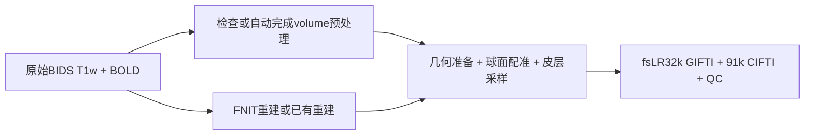
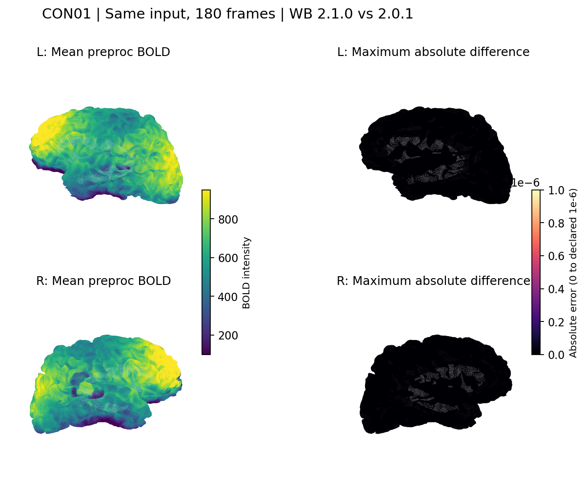

# fMRI Surface pipeline

| 摘要 | 内容 |
|---|---|
| 输入 | 配对BIDS T1w＋BOLD、HCP表面资源；可提供已有recon-all。 |
| 输出 | 双侧fsLR32k GIFTI、91k CIFTI、注册球面与QC。 |
| 对应原软件 | recon-all、fMRIPrep皮层采样和CIFTI组装。 |
| Python / CLI | `fnit.fMRISurface_pipeline` / `fnit-fmri surface`。 |
| CPU / GPU | 混合CPU/GPU；使用Workbench及独立native重建程序。 |

## 1. 功能简介

入口从一个原始BIDS run完成volume检查、解剖重建与表面处理。
该run的volume完全缺失时先自动运行 [Volume pipeline](README.md)，
已有完整结果时核验并复用，随后输出双侧32,492顶点时序与91,282灰坐标CIFTI。
默认使用 `preproc`，也可明确选择经过ICA-AROMA的 `clean`。

重建来源支持FNIT新重建、用户已有subject目录/ZIP，以及显式官方FreeSurfer参考。
生产示例采用 `fnit` 或 `provided`；兼容的 `freesurfer` 分支实际执行官方recon-all，只用于独立benchmark。
FNIT重建使用PyTorch/Numba和Conda中独立编译的native节点；皮层采样使用Workbench，
所以本流程仍有CPU/C++阶段，不能称为全GPU或全部纯PyTorch。



模块说明见 [recon-all](../recon_all/README.md)、[MSM](../msm/README.md) 和 [volume](README.md)。
流程图只列主要数据流；不把重建与volume缓存的内部检查展开为调用图。

## 2. Python 调用

<a id="python-调用输入输出与参数"></a>

先准备主页Conda环境及资源：

```bash
fnit-setup-weights --model fmri
fnit-setup-fmri-surface-assets --output-dir /data/hcp_assets --fmriprep
```

最短示例复用用户已有同源重建，缺少volume时由入口自动处理：

```python
from fnit import fMRISurface_pipeline

bids_directory = "/data/bids"                         # 原始BIDS目录
output_directory = "/data/derivatives/fnit"           # volume和surface共用结果目录
subject_directory = "/data/subjects/sub-01"          # 与源T1w一致的已有subject
surface_assets_directory = "/data/hcp_assets"         # 已校验HCP和TemplateFlow资源
surface_result = fMRISurface_pipeline(                 # 返回最终路径与阶段时间
    bids_root=bids_directory,
    derivatives_root=output_directory,
    subject="01",                                    # 选择sub-01
    hcp_assets_dir=surface_assets_directory,
    recon_all=subject_directory,
    recon_all_backend="provided",                     # 只读已有重建
    volume_options={"registration_backend": "fnirt"}, # 缺volume时采用FLIRT + FNIRT
    device="cuda:0",                                 # FNIT计算设备
    cpu_threads=4,                                    # 整个surface调用的CPU预算
)
print(surface_result.dtseries)                        # 91k CIFTI文件
```

已有重建必须含有效中层面；缺中层面时还须安装独立native `mris_expand`，
入口在复制后的自产目录补面，保持原subject只读。

选择FNIT新重建前，按 [recon-all安装](../recon_all/README.md) 配置权重、图谱和native程序：

```python
from fnit import fMRISurface_pipeline

reconstruction_options = {                            # FNIT重建所需资源与CPU预算
    "weights_dir": "/data/recon_weights",              # 完整recon-all模型组
    "assets_dir": "/data/recon_assets",                # 经哈希校验的图谱
    "native_bin_dir": "/data/fnit_native/bin",          # 独立源码构建程序
    "threads": 4,                                    # 重建CPU线程
}
surface_result = fMRISurface_pipeline(                 # 从原始MRI完成缺失阶段
    bids_root="/data/bids",                            # 配对原始BIDS
    derivatives_root="/data/derivatives/fnit",          # 新输出根目录
    subject="01",                                    # 被试标签
    hcp_assets_dir="/data/hcp_assets",                  # 表面与MNI模板
    recon_all_backend="fnit",                          # FNIT重建来源
    recon_all_output_dir="/data/recon/sub-01",          # 重建持久输出
    recon_all_options=reconstruction_options,
    volume_options={"registration_backend": "fnirt"}, # 自动volume配置
    device="cuda:0",                                 # GPU设备
)
```

### 输入数据格式

- 原始BIDS：一个四维BOLD NIfTI `[X,Y,Z,T]`、非空TaskName、正值TR秒值且与NIfTI一致的JSON和同被试三维T1w。
  BOLD可为整数/浮点强度，T1w无需预先脑提取，不能用短截取代替完整run。
- 影像affine：有效毫米scanner-RAS；文件存储方向可不同。
  原生BOLD、T1w和MNI不是相同网格，必须使用实际变换连接。
- `provided`：subject目录或无路径越界的ZIP。
  包含 `mri/orig.mgz`、`mri/orig/001.mgz` 和左右 white/pial/sphere/sphere.reg/thickness/sulc。
  每侧有midthickness或graymid；没有时在自产目录运行厚度一半处的 `mris_expand`。
- 重建与源T1w：省略 `fsnative_to_t1w` 时，原始T1在规范RAS后网格与体素内容必须相符。
  若来自不同T1空间，明确提供经过核对的正向scanner-RAS世界仿射。
- 变换：4×4有限、可逆、齐次矩阵，单位mm。
  FSL矩阵或官方ITK pull不能直接作为正向RAS矩阵传入；方向说明及实际证明见
  [provided变换记录](../../validation/fmri/public_ten_20261003/provided_transform_provenance.public.json)。
- 现成volume：T1w原生BOLD分辨率preproc与对应MNI6-2mm preproc，
  来源、TR、完整帧、模板、grid和有限值须通过检查。
  clean分支还检查ICA-AROMA完成状态；不把preproc缺失改成使用clean。
- `goodvoxels`：可选三维二值ROI，与T1w BOLD实际网格相同。
- HCP/fsLR资源：固定版本球面、sulc、ROI和MSM配置；
  CIFTI另需与MNI BOLD完全同网格的HCP dseg。
- 注册球面：左右GIFTI surface，原生顶点/三角顺序须与该subject一致。
  它们是球面几何，不是T1w毫米皮层表面，也不是4×4影像变换。
- MSMAll：明确提供L/R特征和权重；`C`可无髓鞘图，`CA/CAT`需要相应个体数据。
  默认只运行T1w脑沟MSMSulc，不自动执行FIX、HCP CA_CAT外层迭代或DeDrift。

### 输入参数

| 参数 | 必需 | 类型 | 默认值 | 含义 |
|---|---|---|---|---|
| `bids_root` | 是 | 路径 | — | 原始BIDS根目录，与volume来源一致。 |
| `derivatives_root` | 是 | 路径 | — | volume与surface共用的FNIT衍生结果根目录。 |
| `subject` | 是 | str | — | 被试标签。 |
| `hcp_assets_dir` | 是 | 路径 | — | 安装器准备的HCP/fsLR与TemplateFlow资源根目录。 |
| `recon_all` | 否 | 路径/None | `None` | provided输入：已有subject目录或ZIP，保持只读。 |
| `session` | 否 | str/None | `None` | ses筛选。 |
| `task` | 否 | str | `'rest'` | task筛选。 |
| `run` | 否 | str/None | `None` | run筛选。 |
| `acquisition` | 否 | str/None | `None` | acq筛选。 |
| `direction` | 否 | str/None | `None` | dir筛选。 |
| `reconstruction` | 否 | str/None | `None` | rec筛选。 |
| `echo` | 否 | str/None | `None` | echo筛选。 |
| `wb_command` | 否 | 路径/str | `'wb_command'` | Conda环境中的Connectome Workbench命令。 |
| `device` | 否 | str | `'cuda:0'` | FNIT计算设备。 |
| `overwrite` | 否 | bool | `False` | 只控制surface最终文件，不覆盖volume输入。 |
| `registered_spheres` | 否 | 左右路径二元组/None | `None` | 现成的原生顶点顺序注册球面；给出时不重新估计MSM。 |
| `msm_config` | 否 | MSMSulcConfig/路径/None | `None` | None为默认HCP四级配置；与provided球面互斥。 |
| `msm_execution` | 否 | str | `'optimized'` | optimized或reference，同算法执行策略。 |
| `msmall_inputs` | 否 | dict/路径/None | `None` | 明确的L/R MSMAllInputs或JSON清单；提供后在MSMSulc后refine。 |
| `msmall_config` | 否 | MSMAllConfig/路径/None | `None` | 默认三级refine；仅有msmall_inputs时可用。 |
| `goodvoxels` | 否 | 路径/None | `None` | 额外三维volume ROI，须与T1w BOLD同网格。 |
| `signal` | 否 | str | `'preproc'` | preproc或clean；缺preproc不自动切换clean。 |
| `fsnative_to_t1w` | 否 | 4×4数组/路径/None | `None` | 正向fsnative scanner-RAS→源T1w scanner-RAS，单位mm。 |
| `parallel` | 否 | bool | `True` | 左右半球独立准备、注册和投影可并行。 |
| `cpu_threads` | 否 | int/None | `None` | 总CPU线程预算；None读取OMP_NUM_THREADS或Torch当前预算。 |
| `recon_all_backend` | 否 | str/None | `None` | 省略时有recon_all即provided，否则fnit；freesurfer仅独立参考实验。 |
| `recon_all_output_dir` | 否 | 路径/None | `None` | 生成/复制并补面的持久目录，与只读输入分开。 |
| `recon_all_options` | 否 | dict/None | `None` | 所选重建backend公开选项，见下表。 |
| `t1w_image` | 否 | 路径/None | `None` | 明确同源T1w；已有volume时须匹配其SourceT1w。 |
| `auto_volume` | 否 | bool | `True` | 该run完全缺失volume时先自动执行；False要求已有完整volume。 |
| `volume_options` | 否 | dict/None | `None` | 传给volume的科学参数；不允许改写已选run、T1w或device。 |

重建选项与入口参数分开，未知键会报错：

| `recon_all_options` 键 | 适用来源 | 含义 |
|---|---|---|
| weights_dir / assets_dir | fnit | 已核验的模型与图谱目录。 |
| native_bin_dir | 三者 | 独立native程序目录。 |
| threads | fnit / freesurfer | 重建CPU预算，默认4。 |
| hemisphere_workers | fnit | 左右重建工作数。 |
| cuda_allocator_cache | fnit | 是否保留CUDA allocator缓存。 |
| native_optimizations | fnit | 原生节点优化策略。 |
| profile_stages | fnit | 是否保存阶段profiling。 |
| mris_expand_command | 三者 | 缺中层面时使用的独立扩面程序路径。 |
| fsnative_to_t1w | provided | 与入口相同的正向世界变换；两处同时给出须一致。 |
| fs_license | 三者 | 作者许可文件路径；仅记录路径，不读取内容展示。 |
| command / recon_all_command | freesurfer参考 | 官方recon-all命令，仅独立参考环境。 |

自动volume仅在该run所有volume影像、变换及sidecar均不存在时运行。
残缺结果为 `partial`、来源或几何不符为 `invalid`，保留文件并报告原因。
`overwrite=True` 只允许替换surface；它不能覆盖已有volume。
`volume_options` 中完整参数见 [volume参数表](README.md#输入参数)。

### 输出

最终BIDS输出保留源task/run/echo等实体，有session时增加 `ses-*`：

```text
derivatives/fnit/
  dataset_description.json
  sub-01/
    anat/                              # volume脑图/解剖缓存
    func/
      ...space-T1w_res-native_desc-preproc_bold.nii.gz
      ...space-MNI152NLin6Asym_res-2_desc-preproc_bold.nii.gz
      sub-01_task-rest_hemi-L_space-fsLR_den-32k_desc-preproc_bold.func.gii
      sub-01_task-rest_hemi-R_space-fsLR_den-32k_desc-preproc_bold.func.gii
      sub-01_task-rest_space-fsLR_den-91k_desc-preproc_bold.dtseries.nii
      sub-01_task-rest_space-fsLR_den-91k_desc-preproc_report.json
      sub-01_task-rest_hemi-L_space-fsLR_desc-preprocReg_sphere.surf.gii
      sub-01_task-rest_hemi-R_space-fsLR_desc-preprocReg_sphere.surf.gii
      ...json                          # 信号/球面sidecar
recon/sub-01/                          # 显式新重建持久输出
```

| 输出 | 文件格式、shape和含义 |
|---|---|
| `left` / `right` | float32 GIFTI；每帧32,492顶点，T个时序数组；fsLR32k顺序，非影像affine。 |
| `dtseries` | float32 CIFTI-2 `[T,91282]`；秒时间轴和21结构BrainModel轴，包括双侧皮层与19个皮层下结构。 |
| registered spheres | 左/右surface GIFTI，保留原生顶点及三角形拓扑；sphere用于注册，不能当成皮层毫米位置。 |
| `metadata` | CIFTI JSON路径；来源、信号、TR、表面配准、重建、配置和时间。 |
| `qc_report` | JSON路径；实际grid、轴、有限值与几何检查结果。 |
| `recon_all` | 实际使用的subject目录；新建来源或只读/复制来源由metadata声明。 |
| `volume_executed` | bool，是否在这次调用中自动生成volume。 |
| `timing_seconds` | 自动volume、重建、准备、注册、投影和CIFTI阶段时钟。 |

preproc强度保持volume定义；clean强度取其去噪结果，没有统一物理量单位。
CIFTI的皮层下部分使用MNI6-2mm影像affine；皮层部分使用表面轴，不虚构影像affine。
固定轴与fMRIPrep的对应采样契约兼容，但整体输出一致性须以同版本、同输入比较为依据。
所有输入subject和ZIP保持只读；临时native准备文件不是稳定公共输出。

## 3. 命令行调用

```bash
fnit-fmri surface --bids-root /data/bids \
  --derivatives-root /data/derivatives/fnit --subject 01 \
  --recon-all /data/subjects/sub-01 --recon-all-backend provided \
  --surface-assets-dir /data/hcp_assets --threads 4 --device cuda:0
```

如需FNIRT自动volume，将 `{"registration_backend":"fnirt"}` 保存到 `/data/volume_options.json`，
再添加 `--volume-options-json /data/volume_options.json`。
Python及CLI的volume后端默认仍为SynthMorph；该默认需要额外模型组 `fmri`。

| CLI 参数 | Python 参数 | 含义 |
|---|---|---|
| `--bids-root` | `bids_root` | 原始BIDS根目录，与volume来源一致。 |
| `--derivatives-root` | `derivatives_root` | volume与surface共用的FNIT衍生结果根目录。 |
| `--subject` | `subject` | 被试标签。 |
| `--session` | `session` | ses筛选。 |
| `--task` | `task` | task筛选。 |
| `--run` | `run` | run筛选。 |
| `--acquisition` | `acquisition` | acq筛选。 |
| `--direction` | `direction` | dir筛选。 |
| `--reconstruction` | `reconstruction` | rec筛选。 |
| `--echo` | `echo` | echo筛选。 |
| `--recon-all` | `recon_all` | provided输入：已有subject目录或ZIP，保持只读。 |
| `--recon-all-backend` | `recon_all_backend` | 省略时有recon_all即provided，否则fnit；freesurfer仅独立参考实验。 |
| `--recon-all-output-dir` | `recon_all_output_dir` | 生成/复制并补面的持久目录，与只读输入分开。 |
| `--recon-all-options-json` | `recon_all_options` | 所选重建backend公开选项，见下表。 |
| `--surface-assets-dir` | `hcp_assets_dir` | 安装器准备的HCP/fsLR与TemplateFlow资源根目录。 |
| `--wb-command` | `wb_command` | Conda环境中的Connectome Workbench命令。 |
| `--device` | `device` | FNIT计算设备。 |
| `--threads` | `cpu_threads` | 总CPU线程预算；None读取OMP_NUM_THREADS或Torch当前预算。 |
| `--serial-hemispheres` | `parallel=False` | 关闭半球并行。 |
| `--signal` | `signal` | preproc或clean；缺preproc不自动切换clean。 |
| `--fsnative-to-t1w` | `fsnative_to_t1w` | 正向fsnative scanner-RAS→源T1w scanner-RAS，单位mm。 |
| `--registered-spheres` | `registered_spheres` | 现成的原生顶点顺序注册球面；给出时不重新估计MSM。 |
| `--goodvoxels` | `goodvoxels` | 额外三维volume ROI，须与T1w BOLD同网格。 |
| `--msm-config` | `msm_config` | None为默认HCP四级配置；与provided球面互斥。 |
| `--msm-execution` | `msm_execution` | optimized或reference，同算法执行策略。 |
| `--msmall-inputs-json` | `msmall_inputs` | 明确的L/R MSMAllInputs或JSON清单；提供后在MSMSulc后refine。 |
| `--msmall-config` | `msmall_config` | 默认三级refine；仅有msmall_inputs时可用。 |
| `--require-volume` | `auto_volume=False` | 要求已有完整volume，不自动执行。 |
| `--volume-options-json` | `volume_options` | 传给volume的科学参数；不允许改写已选run、T1w或device。 |
| `--t1w-image` | `t1w_image` | 明确同源T1w；已有volume时须匹配其SourceT1w。 |
| `--overwrite` | `overwrite` | 只控制surface最终文件，不覆盖volume输入。 |
| `--mni-template`, `--mni-brain-mask` | volume_options | 自动volume的模板/脑mask。 |
| `--recon-all-weights-dir`, `--recon-all-assets-dir`, `--recon-all-native-bin-dir` | recon_all_options | FNIT重建资源。 |
| `--recon-all-threads`, `--mris-expand-command` | recon_all_options | 重建预算/补面程序。 |
| `--freesurfer-recon-all-command`, `--fs-license` | recon_all_options | 官方参考命令/个人许可路径。 |

CLI默认与Python一致：preproc、CUDA0、自动volume、左右并行。
`--threads` 为总CPU预算；`--serial-hemispheres` 将parallel设为False。
可用 `fnit-fmri surface --help` 查看全部真实参数。

## 4. 原软件调用

完整原始MRI参考使用 [volume页的fMRIPrep容器命令](README.md#4-原软件调用)。
fMRIPrep没有只执行皮层采样的独立用户CLI；固定输入对照使用其原Workbench步骤：

```bash
wb_command -volume-to-surface-mapping preproc_T1w.nii.gz native_mid.surf.gii native.func.gii -ribbon-constrained native_white.surf.gii native_pial.surf.gii
wb_command -metric-dilate native.func.gii native_mid.surf.gii 10 native_dilated.func.gii -nearest
wb_command -metric-mask native_dilated.func.gii native_roi.shape.gii native_masked.func.gii
wb_command -metric-resample native_masked.func.gii registered.surf.gii fsLR32k.sphere.surf.gii ADAP_BARY_AREA atlas.func.gii -area-surfs native_mid.surf.gii individual_mid32k.surf.gii -current-roi native_roi.shape.gii
wb_command -metric-mask atlas.func.gii atlas_roi.shape.gii final.func.gii
```

| FNIT 参数/阶段 | 原软件参数/阶段 |
|---|---|
| `goodvoxels` | 第一条命令附加 `-volume-roi`。 |
| native white/pial/mid | `-ribbon-constrained` 的相应几何。 |
| registered_spheres | `-metric-resample` 原生注册球面。 |
| fsLR32k目标与中层面 | 目标球面及 `-area-surfs` 面积校正。 |
| individual/atlas ROI | 原生及atlas的 `-metric-mask`。 |
| CIFTI组装 | NiWorkflows1.14.4 `_create_cifti_image`，独立参考源码见详细报告。 |
| `recon_all_backend="freesurfer"` | 官方 `recon-all -i T1w.nii.gz -sd subjects -s sub-01 -all`；仅参考环境。 |

已实现原生投影、填补、ROI、面积重采样和CIFTI组装。
本轮同输入控制复用FNIT自身重建/MSM；它只验证采样，不能验证重建或球面配准质量。
原软件整链的不同前处理结果另行比较，不把固定输入零差写成整链数值等价。

## 5. 最新精度和运行时间

### 本轮 CPU 官方测试范围

[2026-10-04 起的 CPU 官方对照](../../validation/fmri_cpu_20261004/task04_msm_surface/README.md)包含完整 490 帧固定几何投影/CIFTI，以及公开 180 帧 fresh surface 输出整链。后者以同一已完成 volume 和 recon-all 为起点，完整计入几何、ROI、MSMSulc、投影、CIFTI、QC 与保存；前序 volume/recon-all 计算分别由其独立测试记录。原 fMRIPrep 25.2.4、冻结基线和候选使用相同 1/8 物理核预算。固定 490 帧投影的 CPU1/8 左右全帧时序与 91k CIFTI 逐值及轴相同；原版 fresh 为 466.650/268.903 s，FNIT 完整 API 为 412.364/128.419 s。完整 180 帧 surface 已运行完成，但尚未达到严格匹配：球面左／右平均角差 0.302742/0.345475°，CIFTI RMSE 13.8695、平均时间相关 0.977986，CPU1/8 的 FNIT 输出相同。原版 fresh 为 1855.025/521.294 s，FNIT 完整 API 为 781.290/249.809 s；精度差异正在按保存 MSM 输入定位，未作为通过结果。全部指标和测量范围见[完整报告](../../validation/fmri_cpu_20261004/task04_msm_surface/projection_surface_metadata_v1.public.json)。仅发布聚合指标与既有公开图。

逐段诊断已确认同一例的全部准备数组、归一化网格、刚性坐标与前两轮离散更新一致；左右全部 85/89 次原版刚性成本重放一致，第二轮分别更新 11/59 个控制点，DATA、CP 与标签仍逐值一致。首个粗级自然收敛已完成：左右迭代 8/6 次，左侧末坐标/标签精确，右侧 3 个 float64 坐标最大差 3.553×10⁻¹⁴，CP/标签精确。但右侧两次中间全脑成本差为 0.0725037/0.0954643，整链尚未通过；细级 setup 已确认右侧源点→CP 三角面归属缓存存在分歧，首 alpha 最大差 0.120256；未执行新的细级优化或完整配准，具体边界运算仍需核对。见[细级聚合](../../validation/fmri_cpu_20261004/task04_msm_surface/surface_fine_setup_aggregate_v1.public.json)。见[粗级聚合](../../validation/fmri_cpu_20261004/task04_msm_surface/surface_coarse_level_aggregate_v1.public.json)与[已完成前缀聚合](../../validation/fmri_cpu_20261004/task04_msm_surface/surface_prefix_aggregate_complete_second_v1.public.json)。

本轮成熟 MSMSulc 子函数已修 CPU float64 Point 除法舍入，并优化 CPU containing-face 查询；CPU 与 CUDA 的执行边界见 [MSMSulc](../msm/README.md#cpu-官方配对与本轮修复)。最终三种配准的 12 次完整 GPU 旧/新调用已完成，全部球面坐标和有序 faces 相同，最大本任务进程树显存 4.161 GB；各项实测时间及繁忙共享 H100 的边界见 [完整 GPU 回归](../../validation/fmri_cpu_20261004/task04_msm_surface/gpu_registration_abba_final_recovery_v1.public.json)与 [计时/资源图表](../msm/README.md#本轮-cpu-优化后的完整-gpu-回归2026-10-05)。既有 GPU 专项和下方三 backend 报告保留各自实测版本。


最新正式采样控制为 [2026-10-04两例全180帧报告](../../validation/fmri/reference_alignment_20261004/surface/SURFACE_ALIGNMENT.md)。
采样源码绑定 `cc940273`；现行 `140c3739` 只补输入保护和参考来源记录。
完整连续链的同轮结果见 [连续报告](../../validation/fmri/reference_alignment_20261004/CONTINUOUS_BENCHMARK.md)。

| 条件 | 本轮记录 |
|---|---|
| 数据 / n | ds001226 v5.0.1（CC0），两例真实T1w＋完整180帧。 |
| 原软件 | fMRIPrep25.2.4步骤、NiWorkflows1.14.4 CIFTI、FNIT Workbench2.1.0、参考Workbench2.0.1。 |
| CPU / GPU | CPU具体型号未保存；采样CPU运行，CUDA未初始化；连续链共享H100。 |
| 线程 / precision | 采样4线程、串行半球，输出float32；连续GPU阶段默认TF32。 |
| GPU峰值 | 采样无CUDA分配；连续链自有进程采样峰值14.0551 GB。 |
| timing | 采样API检查到保存；官方含每次容器启动；排除volume/recon/MSM冷计算。 |

### 端到端 benchmark

| 指标，两病例中位数 | FNIT | 原软件 | 差异 |
|---|---:|---:|---|
| 固定输入采样墙钟 | 150.43 s | 168.17 s | 两次实测、不同容器启动开销。 |
| 11角色数组最大绝对差 / RMSE | 0 / 0 | 固定输入原算子 | 全180帧、完整轴；只适用于本采样控制。 |
| 连续volume→surface API（robust） | 719.11 s | 同复用边界未测 | 不含新的recon/MSM。 |
| 连续CIFTI时间r / NRMSE | 0.737295 / 9.170536% | fMRIPrep成品参照 | 整链仍存在差异。 |

### 分步骤 benchmark

| 采样阶段，两病例中位数 | FNIT | 原软件 |
|---|---:|---:|
| 几何/ROI准备，独立时钟 | 14.62 s | 同范围未测。 |
| 左ribbon投影 | 14.65 s | 14.94 s |
| 右ribbon投影 | 15.40 s | 15.16 s |
| CIFTI组装 | 10.39 s | 20.09 s |

逐侧dilate、mask与resample的原时钟在详细报告，不把嵌套时钟相加成总时间。
NRMSE使用全部91,282灰坐标，恒定时序仍保留；不筛零值或拟合幅度。
本次没有重新测完整冷重建的独立surface耗时。



## 6. 最近版本和 benchmark

<!-- 旧文档链接兼容锚点；原始记录在本页第6节的历史链接中。 -->
<a id="surface-e2e-latest"></a>
<a id="原软件调用"></a>
<a id="参考文献与原实现"></a>
<a id="命令行调用"></a>
<a id="实际计算设备"></a>

| 日期 | commit/version | 变化 | benchmark |
|---|---|---|---|
| 2026-10-04 | `140c3739` | 参考来源/输入覆盖保护。 | 原冻结MRI保持；77项相关合同通过。 |
| 2026-10-04 | `cc940273`＋source_v1 | 稳健参考连续链和同输入皮层采样控制。 | [两例报告](../../validation/fmri/reference_alignment_20261004/surface/SURFACE_ALIGNMENT.md)。 |
| 2026-10-03 | `1128bc52` | 自动volume与三种重建来源接通。 | [十例正式报告](../../validation/fmri/threeway_20261004/final10/REPORT.md)。 |
| 2026-10-02 | `81f1bb3` | 公共采样接口接入连续链。 | [历史连续链](../../validation/fmri/e2e_latest/README.md)。 |

更早benchmark、失败实验、内部发布过程和旧三路示例见 [历史技术记录](../../validation/fmri/surface_manual_archive_20261005.md)。
当前入口源码 [surface_pipeline.py](../../src/fnit/fmri/surface_pipeline.py)。

## 7. 参考文献、原软件和资源

- [fMRIPrep25.2.4采样源码](https://github.com/nipreps/fmriprep/blob/25.2.4/fmriprep/workflows/bold/resampling.py)。
- [NiWorkflows1.14.4 CIFTI源码](https://github.com/nipreps/niworkflows/blob/1.14.4/niworkflows/interfaces/cifti.py)。
- [Workbench官方命令](https://www.humanconnectome.org/software/workbench-command)。
- [HCPpipelines固定源码](https://github.com/Washington-University/HCPpipelines/tree/f8cac6892f88bdf889d644711ff038198eb81533)。
- Glasser et al. HCP minimal preprocessing. NeuroImage2013：[doi](https://doi.org/10.1016/j.neuroimage.2013.04.127)。
- Robinson et al. MSM. NeuroImage2014：[doi](https://doi.org/10.1016/j.neuroimage.2014.05.069)。

| 资源 | 用途 | 官方来源 | 大小 | SHA-256 | 是否允许 FNIT 再分发 |
|---|---|---|---|---|---|
| HCP固定模板/配置 | fsLR球面、ROI、sulc、配准 | [HCP固定commit](https://github.com/Washington-University/HCPpipelines/tree/f8cac6892f88bdf889d644711ff038198eb81533) | 30文件逐项见清单 | [完整清单](../RESOURCE_MANIFEST.md) | 按固定Release保存的HCP许可。 |
| TemplateFlow MNI6-2mm文件 | volume目标/皮层下dseg | [TemplateFlow](https://github.com/templateflow/tpl-MNI152NLin6Asym) | 3文件逐项见清单 | [完整清单](../RESOURCE_MANIFEST.md) | 未确认，只从原站下载。 |
| recon-all模型/图谱 | 新重建与native节点 | [FreeSurfer](https://surfer.nmr.mgh.harvard.edu/) | 模型11文件；默认核心图谱98项（完整清单111项） | [重建资源说明](../recon_all/README.md) | 模型按各许可；图谱不新增镜像。 |

权重/模板分开安装，完整大小与SHA见 [资源手册](../WEIGHTS.md)。
