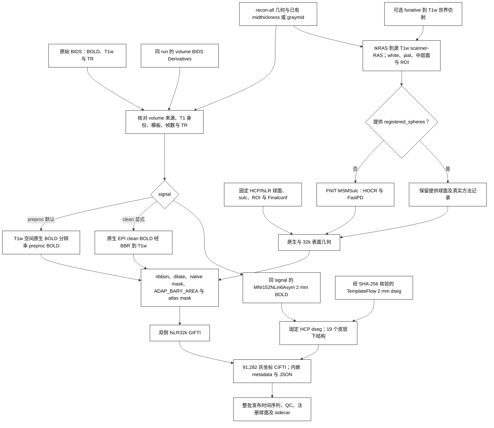

# fMRI 表面流程：fsLR32k 时间序列与 91k CIFTI

`fMRISurface_pipeline` 将同一 run 的 [FNIT volume BIDS Derivatives](README.md) 和 T1w recon-all 几何转换为双侧 fsLR32k GIFTI 与 91k CIFTI。默认 `signal="preproc"`：皮层读取 volume 保存的 T1w 空间、原生 BOLD 分辨率时间序列，皮层下读取对应的 MNI152NLin6Asym 2 mm 时间序列；两者保留相同原始帧数与 BIDS TR。该输入包含 volume 实际执行的切片时间校正和运动变换，不经过 AROMA、混杂回归、时间滤波或全局强度归一化。

切片时间校正默认关闭，由 volume 的 `slice_timing=False` 控制；volume CLI 可显式写 `--ignore-slice-timing`。surface 读取其实际 STC 状态，不再次进行时间校正。需要开启时在 volume API 设置 `slice_timing=True`，重新生成对应 preproc 后再投影。

表面路径包括 FS→fsLR 初始球面、MSMSulc、Workbench ribbon 投影、10 mm 最近邻填补、原生 ROI、ADAP_BARY_AREA 重采样、32k ROI，最后按 NiWorkflows 1.14.4 组装 CIFTI。本轮以固定 fMRIPrep 25.2.4 对照投影和组装；MSM 算法由 main 的 [独立 MSMSulc 子函数](../msm/README.md)实现，其配置与精度单列。运行时使用 FNIT、PyTorch、nibabel 和 Connectome Workbench；原软件用于独立参考对照。

## 输入与资源

先运行当前 `fMRIVolume_pipeline`，保留以下输入：

| 输入 | 格式与用途 |
|---|---|
| 原始 BIDS 根目录 | 与 volume 相同；提供被试/run 实体、源 BOLD、源 T1w 和原始 `RepetitionTime`。 |
| FNIT volume Derivatives | 默认读取 `space-T1w_res-native_desc-preproc_bold.nii.gz` 和 `space-MNI152NLin6Asym_res-2_desc-preproc_bold.nii.gz` 及其 JSON；同时需要 T1w 脑图。 |
| recon-all subject 目录或 ZIP | `mri/orig.mgz`、`mri/orig/001.mgz` 和双侧 `surf/{white,pial,sphere,sphere.reg,sulc,thickness}`；每侧还需 `midthickness` 或 `graymid`。ZIP 内路径以 `FreeSurfer/` 开头。 |
| HCP/fsLR 与 TemplateFlow 资源 | 32k/164k 球面、脑沟参考图、ROI、MSMSulc Finalconf，以及 MNI152NLin6Asym 2 mm HCP 皮层下 dseg；安装器逐文件检查 SHA-256。 |
| Connectome Workbench | 主页 Conda 环境包含此程序；`wb_command` 必须能够执行。 |

流程先读取 volume JSON 的 `FNIT.SourceT1w` 再选择对应 T1 产物，并核对原始 BOLD 来源与标准模板身份。旧 volume JSON 缺少模板身份或默认 preproc 输入时，需要重新运行 volume；若使用当前已核验来源的去噪结果，可显式选择 `signal="clean"`。clean 分支核对 ICA-AROMA 已完成，使用 BBR 将原生 EPI clean BOLD 重采样到 T1w 后投影；WM、CSF 和运动回归可选。

T1w 可以通过 BIDS 内的文件符号链接指向外部存储。表面入口保留其 BIDS 逻辑路径用于解剖产物命名与 `Sources`；此前解析真实目标后再取 BIDS 相对路径会失败。多个 BIDS 文件链接到同一目标时，按 `SourceT1w` 的明确逻辑路径选择；无法唯一选择时拒绝处理。该字段必须是相对 BIDS 路径，不能包含绝对路径或 `..`。

未提供 `fsnative_to_t1w` 时，`mri/orig/001.mgz` 与 volume 所用原始 T1w 在规范 RAS 方向下必须具有一致网格、仿射和体素内容。已有重建若使用另一 T1w 空间，需提供经过核对的正向 **fsnative scanner-RAS → 源 T1w scanner-RAS** 4×4 仿射；流程检查矩阵有限、齐次且可逆，并记录矩阵与来源。该参数使用毫米世界坐标，不接受直接把 FSL FLIRT 矩阵作为世界变换。

几何转换使用 `mri/orig.mgz` 的 scanner-RAS/tkRAS 对应关系。每侧优先读取已有 `midthickness`，其次读取 `graymid`；两者均缺失时明确报错，需要补齐同一重建来源的中层面。流程不使用 white/pial 顶点均值生成替代中层面。默认只需要 T1w；T2w、FLAIR、髓鞘图与 MSMAll 不参与本流程。

T1w preproc 的网格可与 T1w 脑图不同；其实际体素大小必须与所选 SBRef（没有 SBRef 时为原始 BOLD）在规范 RAS 方向下的体素大小一致，按采样参考规则保留三位小数。不能仅靠 JSON 的 `Resolution` 字段把其他分辨率标为原生 BOLD 分辨率。

资源准备：

```bash
fnit-setup-fmri-surface-assets \
  --output-dir /absolute/path/hcp_surface_assets \
  --fmriprep
```

已核对再分发许可的 HCP 文件优先从 [FNIT 固定 Release](https://github.com/weikanggong1/Fudan-Neuroimaging-toolkit/releases/tag/assets-v1)获取，失败后回退 HCPpipelines 原站；TemplateFlow HCP dseg 保持原站下载。文件清单与许可见[权重和资源说明](../WEIGHTS.md)。

显式 `signal="clean"` 可接续只完成 ICA-AROMA 的 volume；WM、CSF、运动、全脑信号回归和带通均可选。原生 clean BOLD 和 MNI clean BOLD 的 JSON 都必须匹配所选原始 BOLD、源 T1w 和 TR，并记录已完成的 ICA-AROMA；显式标为其他 `Signal` 的文件会被拒绝。旧 clean JSON 可没有 `Signal` 字段，但仍需通过上述来源和去噪检查。preproc 按自身来源与空间身份检查。旧 volume 缺少本页新增 preproc 或模板身份字段时需重跑，不以改名补齐。

### 单独准备已有重建的表面

这两个公开子函数与完整 surface 入口共用几何转换代码，读取已有中层面，不生成 white/pial 的均值替代物。

| 函数 | 输入与参数 | 输出 |
|---|---|---|
| `prepare_t1w_surface_geometry` | `subject_dir` 为 recon-all 目录；`output_dir` 为输出目录；`fsnative_to_t1w=None` 表示不追加世界仿射，或提供上述正向 4×4 变换；`overwrite=False` 保护已有文件。 | 双侧 T1w scanner-RAS 的 white、pial、midthickness，共六个 GIFTI；返回左右路径、顶点数和实际中层面来源。 |
| `prepare_fmriprep_surface_inputs` | `subject_dir` 同上；`hcp_assets_dir` 为已校验资源目录；`output_dir` 为输出目录；`wb_command="wb_command"` 为 Workbench 路径；`fsnative_to_t1w=None` 与 `overwrite=False` 同上。 | `native/` 下六个几何 GIFTI，以及双侧原生 FS 球面、FS→fsLR 初始化球面、原始/填洞/去岛 ROI，共 16 个文件；返回几何、初始化球面和最终个体 ROI 路径。 |

```python
from fnit.fmri import prepare_t1w_surface_geometry, prepare_fmriprep_surface_inputs

t1w_surface_geometry = prepare_t1w_surface_geometry(
    subject_dir="/absolute/path/recon-all/sub-0001",         # 同源已有重建
    output_dir="/absolute/path/t1w_surfaces",                # 只保存六个几何 GIFTI
    fsnative_to_t1w=None,                                   # 或正向 scanner-RAS 世界仿射
    overwrite=False,                                       # 任一已有文件均阻止覆盖
)
left_t1w_middle = t1w_surface_geometry.left.midthickness

surface_preparation = prepare_fmriprep_surface_inputs(
    subject_dir="/absolute/path/recon-all/sub-0001",        # 已有重建，含 midthickness 或 graymid
    hcp_assets_dir="/absolute/path/hcp_surface_assets",      # 固定 HCP/fsLR 资源
    output_dir="/absolute/path/prepared_surfaces",           # 完整准备结果的保存目录
    wb_command="wb_command",                               # Connectome Workbench
    fsnative_to_t1w=None,                                   # 或正向 scanner-RAS 世界仿射
    overwrite=False,                                       # 任一已有产物均阻止覆盖
)
left_t1w_middle = surface_preparation.geometry.left.midthickness
left_initial_sphere, right_initial_sphere = surface_preparation.initial_spheres
left_native_roi, right_native_roi = surface_preparation.individual_rois
```

本次修复了共享准备子函数的发布问题：原几何函数可能先写左侧、再因右侧缺文件或已有输出失败；完整准备函数原先没有对球面和 ROI 应用覆盖保护。现在对六个或 16 个产物统一预检，在同一文件系统中暂存后发布，失败保留之前的完整结果。`overwrite=False` 同样保护悬空符号链接，并在创建最终文件时拒绝并发出现的同名文件。该修改保留原坐标变换、顶点顺序和 Workbench 运算。

低层 `run_fmriprep_surface_projection` 也共用覆盖保护，要求 T1w BOLD 使用有限、可逆的毫米世界仿射；帧数、TR 单位及 MNI/dseg 网格检查与完整入口一致。

## 流程图



## Python 调用与参数

```python
from fnit import fMRISurface_pipeline

surface_result = fMRISurface_pipeline(
    bids_root="/absolute/path/bids",                       # volume 使用的原始 BIDS 根目录
    derivatives_root="/absolute/path/bids/derivatives/fnit", # 当前 FNIT volume 结果根目录
    subject="0001",                                        # sub 标签，不含 sub-
    recon_all="/absolute/path/recon-all/sub-0001",           # 匹配源 T1w 的 subject 目录或 ZIP
    hcp_assets_dir="/absolute/path/hcp_surface_assets",     # 安装器核验的表面资源目录
    session=None,                                          # ses 标签；无 session 时为 None
    task="rest",                                           # task 标签
    run=None,                                              # 多 run 时指定 run 标签
    acquisition=None,                                      # 按 acq 标签筛选
    direction=None,                                        # 按 dir 标签筛选
    reconstruction=None,                                   # 按 rec 标签筛选
    echo=None,                                             # 按 echo 标签筛选
    signal="preproc",                                      # 默认 minimally preprocessed 输入；可显式选 clean
    fsnative_to_t1w=None,                                  # 同源 T1 身份检查；或提供正向世界仿射文件/数组
    registered_spheres=None,                               # 默认估计 MSMSulc；或给 (左球面, 右球面)
    msm_config=None,                                      # 默认 HCP 四级配置；或 MSMSulcConfig / 官方配置文件
    msm_execution="optimized",                           # 缓存与传输优化；reference 用于同算法执行对照
    goodvoxels=None,                                       # 默认无额外 volume ROI
    wb_command="wb_command",                               # Workbench 命令名或绝对路径
    device="cuda:0",                                       # PyTorch 计算设备，也可为 cpu
    overwrite=False,                                       # 保护全部同名最终产物
)
print(surface_result.left)                # 左半球 T 帧 × 32,492 顶点 GIFTI
print(surface_result.right)               # 右半球 T 帧 × 32,492 顶点 GIFTI
print(surface_result.dtseries)            # T × 91,282 CIFTI
print(surface_result.qc_report)           # 持久化 QC JSON
print(surface_result.registered_spheres)  # 持久化的 (左, 右) 注册球面
```

| 参数 | 含义与默认值 |
|---|---|
| `bids_root` | 原始 BIDS 数据根目录；必填。 |
| `derivatives_root` | 同一 BIDS 数据集的 FNIT Derivatives 根目录；必填。 |
| `subject` | 被试标签，不含 `sub-`；必填。 |
| `recon_all` | recon-all subject 目录、含 `FreeSurfer/` 的父目录，或具有该内部结构的 ZIP；必填。 |
| `hcp_assets_dir` | 经安装器核验的 HCP/fsLR 和 fMRIPrep dseg 资源根目录；必填。 |
| `session` | `ses` 标签，默认 `None`。 |
| `task` | `task` 标签，默认 `"rest"`。 |
| `run` | `run` 标签，默认 `None`；多候选时需明确选择。 |
| `acquisition` | `acq` 标签，默认 `None`。 |
| `direction` | `dir` 标签，默认 `None`。 |
| `reconstruction` | `rec` 标签，默认 `None`。 |
| `echo` | `echo` 标签，默认 `None`。 |
| `signal` | 默认 `"preproc"`；`"clean"` 显式选择去噪 volume 输入。 |
| `fsnative_to_t1w` | 默认 `None`；可传 4×4 NumPy 数组或文本矩阵路径，方向为 fsnative scanner-RAS 到源 T1w scanner-RAS。 |
| `registered_spheres` | 默认 `None`，运行 FNIT MSMSulc；可传 `(left_path, right_path)`，必须与原生表面顶点和拓扑相符。提供球面时记录 `provided registered spheres` 与 `EstimatedHere=False`。 |
| `msm_config` | 默认 `None`，使用 HCP 四级配置；可传 `MSMSulcConfig` 或受支持的官方配置文件路径。不能与 `registered_spheres` 同时指定。 |
| `msm_execution` | 默认 `"optimized"`，缓存固定几何并合并传输；`"reference"` 保留逐块检查，使用相同算法与停止条件。 |
| `goodvoxels` | 默认 `None`，与固定参考的默认投影一致；可传与实际 T1w BOLD 同网格的有限、非负、非空 3D ROI，限制 ribbon 内参与采样的体素。 |
| `wb_command` | 默认 `"wb_command"`；命令名或可执行文件绝对路径。 |
| `device` | 默认 `"cuda:0"`；PyTorch 重采样和 MSMSulc 的设备。Workbench 使用 CPU。 |
| `overwrite` | 默认 `False`；任一最终数据、JSON、QC 或注册球面已存在时拒绝覆盖。成功检查所有结果后整批发布；发布异常回滚已有结果。 |

估计球面时，JSON 还记录实际 MSM 配置、执行方式和双侧配准报告；`msmsulc_preparation_and_registration` 单列准备与球面估计时间，提供外部球面时不生成这项计时。

默认球面遵循 HCP/sMRIPrep 的 `simval=3,2,2,2`、最大迭代数 `50,10,15,15`。`msm_config` 仅在估计球面时使用，不能与 `registered_spheres` 同时指定。独立用法及各配置参数见 [MSMSulc](../msm/README.md)。命令行可加 `--msm-config /absolute/path/MSMSulcStrainFinalconf` 和 `--msm-execution reference` 复测相同科学配置的执行路径。

## 命令行与原版参考

```bash
fnit-fmri surface \
  --bids-root /absolute/path/bids \
  --derivatives-root /absolute/path/bids/derivatives/fnit \
  --subject 0001 \
  --recon-all /absolute/path/recon-all/sub-0001 \
  --surface-assets-dir /absolute/path/hcp_surface_assets \
  --signal preproc \
  --device cuda:0
```

`--signal clean` 选择 clean 分支；`--fsnative-to-t1w /absolute/path/fsnative_to_T1w_world.txt` 提供世界仿射。`--registered-spheres /absolute/path/L.surf.gii /absolute/path/R.surf.gii` 选择外部球面，`--goodvoxels /absolute/path/roi.nii.gz` 提供额外 volume ROI；对应 Python 参数见上表。完整 CLI 参数用 `fnit-fmri surface --help` 查看。

以下原版命令供独立参考环境使用，固定 fMRIPrep 25.2.4 和已完成的同源 FreeSurfer subjects；按当前默认关闭 STC 与 SDC，保留全部帧。`--msm` 选择原版 MSMSulc 配准；本轮固定球面的投影对照不验证该配准。FNIT 不执行该命令。

```bash
fmriprep /absolute/path/bids /absolute/path/reference participant \
  --participant-label 0001 \
  --fs-subjects-dir /absolute/path/subjects \
  --fs-license-file /absolute/path/license.txt \
  --output-spaces T1w MNI152NLin6Asym:res-2 fsnative \
  --cifti-output 91k \
  --msm \
  --ignore fieldmaps slicetiming \
  --dummy-scans 0 \
  --random-seed 0
```

具体对照环境、输入约束和运行脚本见[固定参考清单](../../validation/fmri/fmriprep/reference_image.public.json)与[参考运行脚本](../../validation/fmri/fmriprep/run_reference.py)。

## 输出与检查

输出位于 `sub-0001/func/`；有 session 时为 `sub-0001/ses-<label>/func/`。文件名继承源 BOLD 的 run、acq 等实体。默认 `preproc` 的完整产物如下；显式 clean 分支将对应 `desc-preproc`/`desc-preprocReg` 改为 `desc-clean`/`desc-cleanReg`。

```text
sub-0001/func/
├── sub-0001_task-rest_hemi-L_space-fsLR_den-32k_desc-preproc_bold.func.gii
├── sub-0001_task-rest_hemi-L_space-fsLR_den-32k_desc-preproc_bold.json
├── sub-0001_task-rest_hemi-R_space-fsLR_den-32k_desc-preproc_bold.func.gii
├── sub-0001_task-rest_hemi-R_space-fsLR_den-32k_desc-preproc_bold.json
├── sub-0001_task-rest_space-fsLR_den-91k_desc-preproc_bold.dtseries.nii
├── sub-0001_task-rest_space-fsLR_den-91k_desc-preproc_bold.json
├── sub-0001_task-rest_space-fsLR_den-91k_desc-preproc_report.json
├── sub-0001_task-rest_hemi-L_space-fsLR_desc-preprocReg_sphere.surf.gii
├── sub-0001_task-rest_hemi-L_space-fsLR_desc-preprocReg_sphere.json
├── sub-0001_task-rest_hemi-R_space-fsLR_desc-preprocReg_sphere.surf.gii
└── sub-0001_task-rest_hemi-R_space-fsLR_desc-preprocReg_sphere.json
```

| 产物 | 内容 |
|---|---|
| 双侧 GIFTI | 每帧 32,492 个有限 float32 值；非皮层 ROI 顶点置零。 |
| CIFTI dtseries | 29,696 个左皮层、29,716 个右皮层和 31,870 个皮层下坐标，共 91,282 个；包含固定 HCP dseg 的全部 19 个皮层下结构。 |
| 三个时间序列 JSON | volume 来源、真实 BIDS TR、STC 时间信息、信号分支、标准空间身份、资源 SHA-256、几何变换、中层面来源、配准方法与球面校验和。CIFTI 内嵌 metadata 和 JSON 共享相同 `Density`/`SpatialReference`；GIFTI 分别记录自身 32k reference。 |
| `*_report.json` | 帧数、灰坐标总数、随时间变化的灰坐标数、非有限值计数、投影分步耗时、几何与注册球面来源。自行估计时，`MSM` 原样保存配准器返回的报告与每个配准输入的 SHA-256；提供外部球面时该项为 `null`。变化坐标数描述信号覆盖，不是配准精度指标。 |
| 双侧注册球面与 JSON | 原生顶点顺序的注册球面，供复用与对照；记录 SHA-256、实际方法和是否在本次估计。球面顶点数保持原生网格，并非 32k。 |

固定资源必须通过 SHA-256、32k ROI、2 mm dseg 网格和全部 19 结构检查。输入 BOLD、GIFTI 的帧数与原始 BOLD 一致，NIfTI 秒/毫秒/微秒 TR 归一到秒后须与原始 BIDS TR 一致；输出 CIFTI 时间轴从零开始，步长使用原始 BIDS TR，STC 偏移保存在 `StartTime` metadata 中。

共享投影函数原来以默认内存映射读取暂存 CIFTI 计算 QC，NFS 上文件发布后仍保留打开的 mapping，可能使临时目录清理报 `EBUSY`，完整入口因而在计算完成后失败。当前仅对这份暂存 CIFTI 使用非映射读取并关闭持续文件句柄；覆盖报告与影像数值保持原定义。

`FMRISurfaceResult` 返回 `left`、`right`、`dtseries`、CIFTI JSON 的 `metadata`、分步 `timing_seconds`、`qc_report` 和 `registered_spheres`。其中 `total` 在最终 JSON 和发布前记录；完整 API 墙钟时间由调用方测量。CUDA 峰值记录需同时核对所选配准器是否重置内部计数；本轮固定球面投影控制不调用该配准器。

## 实测快照与历史记录

### STC 关闭的真实公开 API（实测快照 `ca3df003`）

源码 `ca3df003` 读取 `50eb098` 保存的完整 490 帧 preproc，STC 关闭、TR 为 0.735 s，输入 SHA-256 与 volume 报告一致。显式提供 FS→fsLR 初始化球面；API 执行同源 T1 身份核验、已有中层面与 ROI 准备、投影、CIFTI 组装、QC 和发布，成功保存全部 11 个持久输出并清理 NFS 临时目录。

| 检查或测量范围 | 结果 |
|---|---:|
| 公开 API 墙钟，含输出写盘和清理，扣除验证捕获复制 | **234.313 s** |
| 额外验证输入捕获复制，单独记录 | **3.656 s** |
| 外层验证进程墙钟，含导入、捕获、哈希和输出检查 | **245.27 s** |
| 外层进程最大 RSS | 4,156,108 KiB |
| 左、右 GIFTI | 各 490×32,492，全部有限 float32 |
| CIFTI | 490×91,282，全部有限；TR 0.735 s |
| CIFTI 结构 | 2 个皮层与 19 个皮层下结构 |
| 实际信号覆盖 | 91,251 个随时间变化的灰坐标，31 个恒定坐标 |
| 注册球面 | `EstimatedHere=False`，`MSM=None` |
| PyTorch CUDA allocated / reserved | **0 / 0 GB** |

计时起点为完成的 volume 和已有 recon-all 几何，包含本页准备与发布步骤。Workbench 2.1.0 使用 8 个 CPU 线程；球面由调用方提供，本次不估计 MSM。几何来自同源存档重建及官方 FreeSurfer 7 生成的已有 graymid，投影双方共同使用。一次观测的耗时不用于推断稳定加速比。完整输出、来源、配置和源码哈希见[公开 API 报告](../../validation/fmri/fmriprep/surface_stcoff_ca3df003.public.json)；实际投影输入逐文件保存在[输入哈希清单](../../validation/fmri/fmriprep/surface_stcoff_ca3df003_actual_inputs.public.json)。

### 相同实际输入的官方投影对照

将上述成功 API 保留的 14 个 volume、几何、ROI 与面积文件原样交给 fMRIPrep 25.2.4 的 fsLR 重采样和 grayords 工作流。两边逐文件 SHA-256 一致，官方工作流使用 NiWorkflows 1.14.4、Workbench 2.0.1 和 8 个 CPU 线程。

| 对照范围 | 结果 |
|---|---|
| 左、右 GIFTI 各 490×32,492 个值 | 全部逐值相等，最大绝对误差、RMSE 和相对 RMSE 均为 0 |
| CIFTI 490×91,282 个值 | 全部逐值相等，21 个结构逐项误差均为 0 |
| 时间轴、灰坐标顺序与内嵌 metadata | 全部相同；起点 0 s，TR 0.735 s |
| 实际信号覆盖 | 两边均为 91,251 个变化坐标与 31 个恒定坐标 |
| 官方投影与组装工作流墙钟 | **183.835 s**，从已有准备输入开始 |

该对照核验固定输入下的投影和 CIFTI 组装。FNIT 的 234.313 s 还包含几何准备与最终发布，两个计时范围不同。完整逐值结果见[配对报告](../../validation/fmri/fmriprep/surface_stcoff_ca3df003_projection_paired.public.json)，官方执行、资源与输入校验见[参考报告](../../validation/fmri/fmriprep/reference_projection_stcoff_ca3df003_actual_api.public.json)。配对使用同一套已准备几何与球面；独立原始 BIDS volume 的差异另见[完整 MNI 对照](../../validation/fmri/fmriprep/independent_mni_stcoff_50eb098.public.json)。

### 契约测试与历史结果

[CIFTI 契约测试](../../tests/test_fmri_surface_contracts.py)、[灰坐标顺序测试](../../tests/test_fmri_surface_pipeline.py)、[公开 API 契约测试](../../tests/test_fmri_surface_public_contracts.py)和[共享准备函数测试](../../tests/test_fmri_surface_preparation.py)核对资源完整性、有限值、帧数、TR、来源匹配、实际体素大小、显式变换、错误半球、已有球面、悬空链接与发布回滚。锁定 NiWorkflows 1.14.4 的同输入组装对照中，两帧索引信号的数值、BrainModelAxis、SeriesAxis 和内嵌 metadata 逐项一致；检查范围为文件格式、灰坐标顺序与时间轴。

[合并合同门禁](../../validation/fmri/fmriprep/nonmsm_contract_gate.public.json)通过 **248 项、0 skipped**；随后 T1w 来源路径补丁的[局部门禁](../../validation/fmri/fmriprep/surface_source_path_gate.public.json)通过 **42 项、0 skipped**，包含 8 个新路径用例。两次门禁分别保留测试与源码哈希。[发布源码回溯](../../validation/fmri/fmriprep/publication_runtime_provenance.public.json)保留真实执行快照的逐文件 SHA；后续 main 的 MSM 更新及未使用旧函数清理单列，不能将该快照视为之后全部模块逐 SHA 相同的证明。

此前 `c3c921cc`/`bac3c395` 的完整测量与固定投影对照保留在[历史 STC 关闭记录](../../validation/fmri/HISTORY_20261001_STCOFF_PREPROC.md)。

源码 `3940a72` 开启 STC 的完整 volume、两次固定输入投影及公开 surface API 测量保留在[历史 STC 开启记录](../../validation/fmri/HISTORY_20261001_STCON_PREPROC.md)，包含原执行参数、计时边界和机器可读报告。

旧 MSMSulc 实现的完整 surface API 报告已移除，不作为当前实现的测量依据。

### main 的 MSMSulc 对照

main 的球面精度、冷/热配准速度和完整 490 帧逐顶点时间相关见 [MSMSulc 功能页](../msm/README.md)与[配准验证](../../validation/msm/README.md)。对照固定同一 clean volume、几何、ROI 和投影顺序，只改变注册球面；每套球面分别生成自己的 32k 面积表面。

这项测量覆盖球面估计及其对 fsLR32k 时间序列的影响：FNIT 双侧配准冷/热调用为 **201.99 / 198.08 s**，固定 clean volume 的投影为 **303.77 s**。配准、投影与完整 volume 分别测量，不能合成一次新的完整 surface API 或 raw BIDS→CIFTI 耗时。各次范围见[验证汇总](../../validation/fmri/README.md)。最终输出为左右 32k GIFTI 和 91k CIFTI；相关性按各灰质坐标的全部时间点计算，再平均。

固定官方球面时，Workbench 投影和 CIFTI 组装已逐值匹配独立命令对照。UKB MSMAll 发布空间、去噪方法以及从原始数据开始的整条 fMRIPrep 流程属于不同对照；相关结果见 [MS-HBM 验证](../../validation/mshbm/processed_release.md)和 [DeepPrep 实测](../../validation/fmri/deepprep/README.md)。

## 参考文献与原实现

- Esteban 等，*fMRIPrep*，Nature Methods，2019，[DOI](https://doi.org/10.1038/s41592-018-0235-4)。
- Glasser 等，*The Minimal Preprocessing Pipelines for the Human Connectome Project*，NeuroImage，2013，[DOI](https://doi.org/10.1016/j.neuroimage.2013.04.127)。
- 固定源码：[fMRIPrep 25.2.4 fsLR 重采样](https://github.com/nipreps/fmriprep/blob/25.2.4/fmriprep/workflows/bold/resampling.py)、[时间 metadata](https://github.com/nipreps/fmriprep/blob/25.2.4/fmriprep/workflows/bold/outputs.py)、[NiWorkflows 1.14.4 CIFTI](https://github.com/nipreps/niworkflows/blob/1.14.4/niworkflows/interfaces/cifti.py)、[sMRIPrep 0.19.2 表面流程](https://github.com/nipreps/smriprep/blob/0.19.2/src/smriprep/workflows/surfaces.py)、[Connectome Workbench](https://github.com/Washington-University/workbench)。
