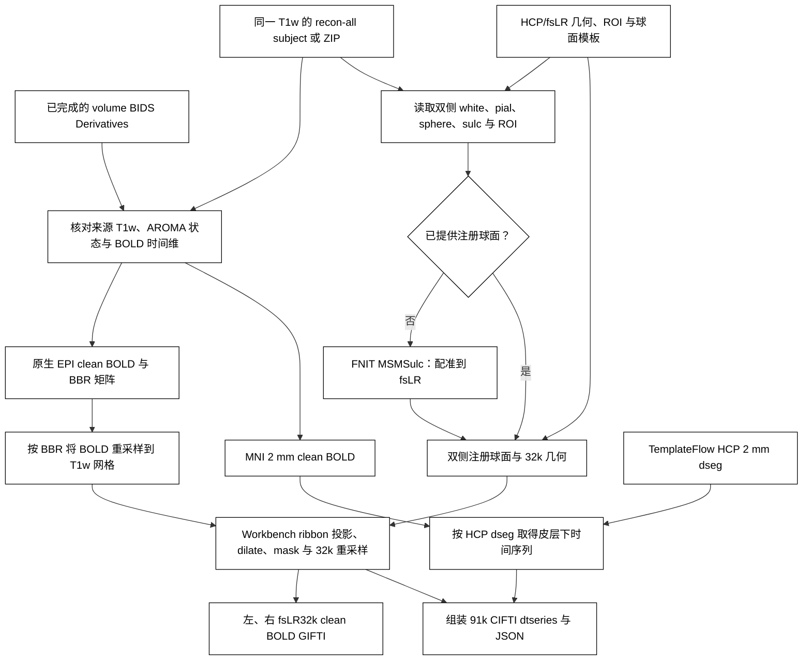

# fMRI 表面流程：fsLR32k 时间序列

`fMRISurface_pipeline` 读取已完成 ICA-AROMA 清理的 [FNIT volume BIDS Derivatives](README.md)，使用同被试 T1w 的 recon-all 结果和 HCP fsLR 模板。原生 EPI BOLD 经 BBR 重采样到 T1w 后投到 white/pial ribbon；MNI152 2 mm BOLD 提供皮层下信号。FS 初始球面再经 [FNIT MSMSulc](../msm/README.md) 注册到 fsLR，按 fMRIPrep 顺序运行 Workbench ribbon 投影、dilate、mask、ADAP_BARY_AREA 重采样，并组装 91k CIFTI。直接投向皮层的是 **T1w 网格的 BOLD**。运行时不调用 FreeSurfer、FSL、fMRIPrep 或 Nipype。

先运行 `fMRIVolume_pipeline`。额外的 WM、CSF、运动、全脑信号回归和带通均可选；仅 ICA-AROMA 清理后的 volume 也可接续。接口核对原始 BOLD/T1 来源、AROMA 完成状态、TR 与输出网格。`recon_all` 必须是同一源 T1w 已完成重建的目录，或含 `FreeSurfer/` 的 ZIP；代码核对 `mri/orig/001.mgz` 与 volume 所用 T1w 的尺寸和仿射。默认只需要 T1w。T2w 或 FLAIR 可用于外部 recon-all 重建，但本流程不读取它们，也不做髓鞘图或 MSMAll。HCP 资源下载：`fnit-setup-fmri-surface-assets --output-dir /absolute/path/hcp_surface_assets --fmriprep`。安装器优先从 [FNIT 固定 Release](https://github.com/weikanggong1/Fudan-Neuroimaging-toolkit/releases/tag/assets-v1)获取已核对许可的 HCP 文件，失败后回退 HCPpipelines 原站；TemplateFlow dseg 保持原站下载。需另安装允许使用的 Connectome Workbench。

## 流程策略



## Python 调用

```python
from fnit import fMRISurface_pipeline

result = fMRISurface_pipeline(
    bids_root="/absolute/path/bids",                   # 与 volume 使用的原始 BIDS 根目录
    derivatives_root="/absolute/path/bids/derivatives/fnit",  # 已有 volume 结果的 BIDS Derivatives 根目录
    subject="0001",                                   # sub 标签，不含 sub-
    recon_all="/absolute/path/recon-all/sub-0001",    # 同一 T1w 的完整 recon-all 结果目录或 ZIP
    hcp_assets_dir="/absolute/path/hcp_surface_assets",  # 经安装器验证的 HCP/fsLR 模板根目录
    session=None,                                      # ses 标签；没有 session 时为 None
    task="rest",                                      # task 标签
    run=None,                                         # run 标签；多 run 时指定
    acquisition=None,                                 # acq 标签；多候选时指定
    direction=None,                                   # dir 标签；多候选时指定
    reconstruction=None,                              # rec 标签；多候选时指定
    echo=None,                                        # echo 标签；多 echo 时指定
    wb_command="wb_command",                          # Workbench 可执行文件名或绝对路径
    device="cuda:0",                                  # BOLD 重采样与 MSMSulc 的 PyTorch 设备
    registered_spheres=None,                          # 默认运行 FNIT MSMSulc；给 L/R 球面可作固定球面对照
    msm_config=None,                                  # 默认 HCP 四级配置；也可填 MSMSulcConfig 或官方配置文件
    msm_execution="optimized",                       # 同一算法的缓存/传输优化；reference 用于执行对照
    goodvoxels=None,                                  # 可选 T1w 网格 3D 掩膜；默认不额外限制体素
    overwrite=False,                                  # 是否覆盖同名最终结果
)
print(result.left)      # 左半球 32k GIFTI 时间序列
print(result.right)     # 右半球 32k GIFTI 时间序列
print(result.dtseries)  # 91k CIFTI 时间序列
```

命令行：`fnit-fmri surface --bids-root /absolute/path/bids --derivatives-root /absolute/path/bids/derivatives/fnit --subject 0001 --recon-all /absolute/path/recon-all/sub-0001 --surface-assets-dir /absolute/path/hcp_surface_assets --device cuda:0`。

## 输出

输出写回同一个 BIDS Derivatives 数据集的 `sub-0001/func/`。若有 session，路径增加 `ses-<label>/`；文件名继承源 BOLD 的 run、acq 等实体。

| 文件名 | 内容 |
|---|---|
| `sub-0001_task-rest_hemi-L_space-fsLR_den-32k_desc-clean_bold.func.gii` | 左半球 32k 顶点的 T 帧时间序列。 |
| `sub-0001_task-rest_hemi-R_space-fsLR_den-32k_desc-clean_bold.func.gii` | 右半球 32k 顶点的 T 帧时间序列。 |
| `sub-0001_task-rest_space-fsLR_den-91k_desc-clean_bold.dtseries.nii` | 皮层加皮层下的 T×灰质坐标 CIFTI。 |

每个输出旁有 JSON，记录所用 volume 派生文件、TR、配准方法、实际 MSM 配置、执行方式、双侧配准显存/折叠数、投影耗时和 CIFTI 覆盖率。`msmsulc_preparation_and_registration` 单列输入准备与球面估计的时间；提供注册球面时不生成这项计时。volume 的 JSON 可进一步追溯到原始 BIDS BOLD。`FMRISurfaceResult` 返回三条绝对路径、CIFTI JSON 路径和分步耗时。

默认球面遵循 HCP/sMRIPrep 的 `simval=3,2,2,2`、最大迭代数 `50,10,15,15`。`msm_config` 仅在估计球面时使用，不能与 `registered_spheres` 同时指定。独立用法及各配置参数见 [MSMSulc](../msm/README.md)。命令行可加 `--msm-config /absolute/path/MSMSulcStrainFinalconf` 和 `--msm-execution reference` 复测相同科学配置的执行路径。

## 真实数据 benchmark

当前球面精度、冷/热配准速度和完整 490 帧逐顶点时间相关见 [MSMSulc 功能页](../msm/README.md)与[配准验证](../../validation/msm/README.md)。对照固定同一 clean volume、几何、ROI 和投影顺序，只改变注册球面；每套球面分别生成自己的 32k 面积表面。

这项测量覆盖球面估计及其对 fsLR32k 时间序列的影响。完整 volume 的当前测量与之前完整 surface API 的运行范围见[全流程验证](../../validation/fmri/README.md)，两种计时单列。最终输出为左右 32k GIFTI 和 91k CIFTI；相关性按各灰质坐标的全部时间点计算，再平均。

固定官方球面时，Workbench 投影和 CIFTI 组装已逐值匹配独立命令对照。UKB MSMAll 发布空间、去噪方法以及从原始数据开始的整条 fMRIPrep 流程属于不同对照；相关结果见 [MS-HBM 验证](../../validation/mshbm/processed_release.md)和 [DeepPrep 对照](../../validation/fmri/deepprep/README.md)。

## 参考文献与原实现

- Esteban 等，*fMRIPrep*，Nature Methods，2019，[DOI](https://doi.org/10.1038/s41592-018-0235-4)。
- Glasser 等，*The Minimal Preprocessing Pipelines for the Human Connectome Project*，NeuroImage，2013，[DOI](https://doi.org/10.1016/j.neuroimage.2013.04.127)。
- 原实现：[fMRIPrep fsLR 重采样](https://github.com/nipreps/fmriprep/blob/e56dc9938e742c789510705372f88fdb5a8206c2/fmriprep/workflows/bold/resampling.py)、[NiWorkflows CIFTI](https://github.com/nipreps/niworkflows/blob/0eb323521639665483f651cf088c86047382d656/niworkflows/interfaces/cifti.py)、[Connectome Workbench](https://github.com/Washington-University/workbench)。
