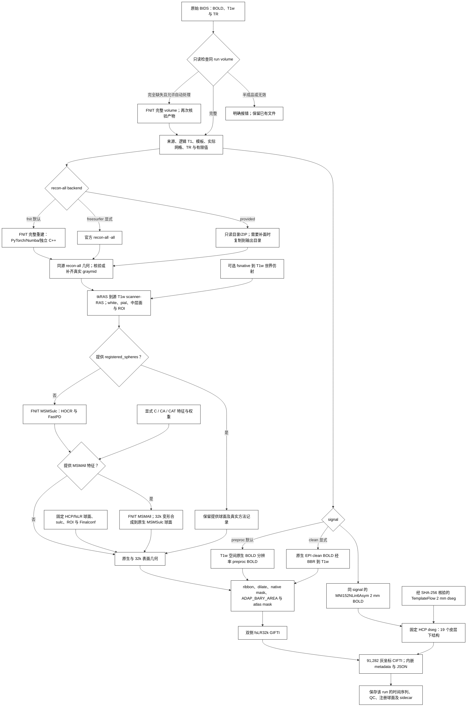

# fMRI 表面流程：fsLR32k 时间序列与 91k CIFTI

## 功能简介与流程图

`fMRISurface_pipeline` 从一个原始 BIDS T1w＋BOLD run 生成双侧 fsLR32k GIFTI 与 91k CIFTI。入口自动检查同 run 的 [FNIT volume BIDS Derivatives](README.md)：完全缺失时先调用成熟 volume pipeline，已有完整结果时核验后复用。T1w 重建有 `fnit`、`freesurfer`、`provided` 三种选择，分别调用 FNIT 完整 recon-all、显式指定的官方 FreeSurfer recon-all，或读取用户已有目录/ZIP。未传 `recon_all` 时默认 `fnit`；旧的 `recon_all=路径` 调用默认选择 `provided`。

默认 `signal="preproc"`：皮层读取 volume 保存的 T1w 空间、原生 BOLD 分辨率时间序列，皮层下读取对应的 MNI152NLin6Asym 2 mm 时间序列；两者保留相同原始帧数与 BIDS TR。该输入包含 volume 实际执行的切片时间校正和运动变换，不经过 AROMA、混杂回归、时间滤波或全局强度归一化。`signal="clean"` 明确选择已完成 ICA-AROMA 的分支，preproc 缺失不会自动换成 clean。

可选 [MSMAll](../msm/msmall.md) 在 MSMSulc 后使用明确提供的个体/参考多特征球面配准。无个体髓鞘图时可明确使用连接特征 `C`；`CA`、`CAT` 需要额外提供个体髓鞘图及相应特征。本入口不自动执行 HCP `CA_CAT` 外层迭代、UKB DeDrift 或 FIX。

切片时间校正默认关闭，由 volume 的 `slice_timing=False` 控制。自动 volume 时可传 `volume_options={"slice_timing": True}`，CLI 对应 volume JSON 中的同名字段；surface 读取实际 STC 状态，不再次校正。已有 volume 不因参数变化自动重算，需要另用 volume API 和新的输出目录生成对应分支。

表面路径包括 FS→fsLR 初始球面、MSMSulc、Workbench ribbon 投影、10 mm 最近邻填补、原生 ROI、ADAP_BARY_AREA 重采样、32k ROI，最后按 NiWorkflows 1.14.4 组装 CIFTI。FNIT 重建复用 PyTorch、Numba 与当前 Conda 内从固定源码独立编译的必要 C++ 程序，表面处理使用 nibabel 和 Connectome Workbench；这是一条混合 GPU/CPU 流程。只有显式选择 `freesurfer` backend 时调用用户安装的官方 `recon-all`。MSM 的独立用法见 [MSMSulc 子函数](../msm/README.md)。下文旧实测使用已有重建，未包含从 T1w 新做 recon-all 的时间。

本地 MSMSulc 扩展须与源码同步。拉取包含 C++ 变更的更新后，在已激活的 FNIT 环境、仓库根目录执行 `python -m pip install .` 重新编译；本轮重建与复测记录见验证部分。



## Python 调用、输入输出与参数

### 输入与资源

一次调用可完成缺失的 volume、所选 T1w 重建和 surface；输入与资源如下：

| 输入 | 格式与用途 |
|---|---|
| 原始 BIDS 根目录 | 与 volume 相同；提供被试/run 实体、源 BOLD、源 T1w 和原始 `RepetitionTime`。 |
| FNIT volume Derivatives | 可不存在。默认所需为 `space-T1w_res-native_desc-preproc_bold.nii.gz`、`space-MNI152NLin6Asym_res-2_desc-preproc_bold.nii.gz`、两个 JSON 和同源 T1w 脑图；全部缺失时自动生成。 |
| `provided` 的 recon-all 目录或 ZIP | `mri/orig.mgz`、`mri/orig/001.mgz` 和双侧 `surf/{white,pial,sphere,sphere.reg,sulc,thickness}`；已有 `midthickness`/`graymid` 可直接使用。缺中层面时，补面用的源码构建 `mris_expand` 可能需要已有合法个人许可；完整已有中层面不运行该 native 补面命令。ZIP 必须唯一包含一例完整输入，可沿用 `FreeSurfer/` 结构。 |
| `fnit` 的重建权重、图谱、native 程序与许可 | 与 fMRI volume 权重、HCP surface 资源分开配置；使用 [recon-all 安装器与 98 项资产校验](../recon_all/README.md#安装)及 Conda 内独立源码构建节点。该 native 节点也读取合法个人 FreeSurfer 许可，调用前须 `export FS_LICENSE=/absolute/path/license.txt`。 |
| `freesurfer` 的官方程序与许可 | 显式选择该 backend 时，使用用户安装的官方 `recon-all` 与合法个人许可；只有该 backend 调用官方安装的重建程序。 |
| HCP/fsLR 与 TemplateFlow 资源 | 32k/164k 球面、脑沟参考图、ROI、MSMSulc Finalconf，以及 MNI152NLin6Asym 2 mm HCP 皮层下 dseg；安装器逐文件检查 SHA-256。 |
| Connectome Workbench | 主页 Conda 环境包含此程序；`wb_command` 必须能够执行。 |
| 可选 MSMAll 输入 | 双侧 `MSMAllInputs` 或 JSON 清单；每侧特征和权重须匹配原生顶点顺序，或使用经 MSMSulc 映射的 canonical fsLR32k 球面顺序。 |

流程先读取 volume JSON 的 `FNIT.SourceT1w` 再选择对应 T1 产物；`t1w_image` 如显式提供必须一致。尚无 volume 时使用明确指定的 T1w，或唯一的 BIDS T1w 候选；多个候选会要求指定，避免挑选第一张。原始 BOLD 来源、TR/完整帧数、实际 native BOLD 分辨率、MNI/dseg 网格、模板身份与有限值都参与判断。显式传 `volume_options["mni_template"]` 时，进一步校验固定模板内容及与 volume 记录相同的文件 SHA-256；未传时优先使用 surface assets 内固定 T1w 模板。若该文件未安装，仅核验声明和固定 dseg 网格，不称为模板文件哈希匹配。

只有该 run 全部 volume 影像、变换及 sidecar 均不存在才为 `missing`；共享 T1w 脑图不妨碍新 run 自动处理。所需分支不完整为 `partial`，数据或来源不符为 `invalid`，这两种状态均停止并保留文件。已有 clean 而缺 preproc 属于 `partial`。旧结果需单独运行 volume 到新目录，或明确授权其 `overwrite`；surface 的 `overwrite=True` 只控制 surface 发布，不能重写 volume。设置 `auto_volume=False` 要求已完成的 volume。clean 分支核对 ICA-AROMA 已完成，使用 BBR 将原生 EPI clean BOLD 重采样到 T1w 后投影；WM、CSF 和运动回归可选。

T1w 可以通过 BIDS 内的文件符号链接指向外部存储。表面入口保留其 BIDS 逻辑路径用于解剖产物命名与 `Sources`；此前解析真实目标后再取 BIDS 相对路径会失败。多个 BIDS 文件链接到同一目标时，按 `SourceT1w` 的明确逻辑路径选择；无法唯一选择时拒绝处理。该字段必须是相对 BIDS 路径，不能包含绝对路径或 `..`。

未提供 `fsnative_to_t1w` 时，`mri/orig/001.mgz` 与 volume 所用原始 T1w 在规范 RAS 方向下必须具有一致网格、仿射和体素内容。provided 重建若使用另一 T1w 空间，需提供经过核对的正向 **fsnative scanner-RAS → 源 T1w scanner-RAS** 4×4 仿射；流程检查矩阵有限、齐次且可逆，并记录矩阵与来源。该参数使用毫米世界坐标，不接受直接把 FSL FLIRT 矩阵作为世界变换。

官方 fMRIPrep/sMRIPrep 的 `from-fsnative_to-T1w` ITK 文件保存的是影像 pull 变换；转为 RAS 后仍须取逆，才能传给这里的正向参数。使用该轮实际保存的变换，并先核对其 T1 来源与表面方向。公开 CON01 的[只读方向证明](../../validation/fmri/public_ten_20261003/provided_transform_provenance.public.json)显示，转换后的 white 与官方 GIFTI 左/右最大坐标差为 8.04×10⁻⁶/7.93×10⁻⁶ mm、有序面相同；`orig/001.mgz` 与 raw 的像素不相同，不能通过文件名或网格相同来假定体素身份。下面只转换已有 ITK，不估计新配准：

```python
from pathlib import Path
import sys
import numpy as np

# 仓库验证目录中的只读解析器：处理 ITK 固定中心与 LPS/RAS 坐标。
validation_tools_directory = Path("/absolute/path/Fudan-Neuroimaging-toolkit/validation/fmri/public_ten_20261003")
sys.path.insert(0, str(validation_tools_directory))
from verify_provided_transform import read_single_itk_pull

saved_fsnative_to_t1w_itk = Path("/absolute/path/sub-CON01_from-fsnative_to-T1w_mode-image_xfm.txt")
forward_scanner_ras_matrix = np.linalg.inv(read_single_itk_pull(saved_fsnative_to_t1w_itk))
forward_scanner_ras_path = Path("/absolute/path/fsnative_to_source_t1w_forward_ras.txt")
np.savetxt(forward_scanner_ras_path, forward_scanner_ras_matrix, fmt="%.17g")
# 在下面 provided Python 调用中使用 fsnative_to_t1w=forward_scanner_ras_path；
# CLI 对应 --fsnative-to-t1w "$forward_scanner_ras_path"。
```

几何转换使用 `mri/orig.mgz` 的 scanner-RAS/tkRAS 对应关系。每侧优先读取已有 `midthickness`，其次 `graymid`；缺失时用原算法 `mris_expand -thickness <white> 0.5 <graymid>` 补齐。FNIT/provided 默认使用当前 Conda 独立编译的程序，显式 FreeSurfer backend 也可使用其官方程序目录。provided 原目录/ZIP 保持只读：先复制必需文件或解压到自产目录，再补面；不以 white/pial 顶点均值替代。默认只需要 T1w；T2w、FLAIR 可用于先前重建，本入口不读取它们或自动生成髓鞘图。MSMAll 仅在提供 `msmall_inputs` 时运行。

T1w preproc 的网格可与 T1w 脑图不同；其实际体素大小必须与所选 SBRef（没有 SBRef 时为原始 BOLD）在规范 RAS 方向下的体素大小一致，按采样参考规则保留三位小数。不能仅靠 JSON 的 `Resolution` 字段把其他分辨率标为原生 BOLD 分辨率。

资源准备：

```bash
fnit-setup-fmri-surface-assets \
  --output-dir /absolute/path/hcp_surface_assets \
  --fmriprep
```

使用可选 MSMAll 时在资源命令中加 `--msmall`，安装多特征配置、d40 参考和 WRN 的 d7–d21 图；新增低维模板从固定 HCP 上游下载，逐文件检查大小与 SHA-256。

已核对再分发许可的 HCP 文件优先从 [FNIT 固定 Release](https://github.com/weikanggong1/Fudan-Neuroimaging-toolkit/releases/tag/assets-v1)获取，失败后回退 HCPpipelines 原站；TemplateFlow HCP dseg 保持原站下载。文件清单与许可见[权重和资源说明](../WEIGHTS.md)。

FNIT 重建和缺中层面的 provided 输入还需要独立 native 程序。按主页 Conda 路径安装，当前构建清单包含 `mris_expand`：

```bash
conda activate fnit
export FS_LICENSE=/private/license.txt                # 按 recon-all 原作者要求设置个人许可路径
bash tools/setup_recon_all_native_conda.sh             # 固定源码编译至当前 Conda；包含 mris_expand
fnit-setup-weights --model recon-all --dest /absolute/path/recon_weights
fnit-setup-recon-all-assets --dest /absolute/path/recon_assets
fnit-setup-weights --model recon-all --dest /absolute/path/recon_weights --verify-only
fnit-setup-recon-all-assets --dest /absolute/path/recon_assets --verify-only
```

重建权重/图谱的来源、再分发规则和个人许可设置沿用 [recon-all 说明](../recon_all/README.md#安装)，不把 `hcp_assets_dir` 当作重建资源目录。默认 backend 不调用系统安装的 FreeSurfer。此次新增 native 构建在干净环境的验证状态以最终整链报告为准。

clean 的原生/MNI JSON 都须匹配来源、TR 和已完成的 ICA-AROMA；旧 clean JSON 可没有 `Signal`，但若显式标成其他信号会拒绝。preproc 缺失时需重跑 volume 或明确选择 clean，不能自动换分支。

### 单独准备已有重建的表面

这两个公开子函数与完整 surface 入口共用几何转换代码，读取已有中层面，不生成 white/pial 的均值替代物。它们都支持 `parallel=True` 与 `cpu_threads=None`；左右半球分别准备，全部完成并通过检查后一起发布。

| 函数 | 输入与参数 | 输出 |
|---|---|---|
| `prepare_t1w_surface_geometry` | `subject_dir` 为 recon-all 目录；`output_dir` 为输出目录；`fsnative_to_t1w=None` 表示不追加世界仿射，或提供上述正向 4×4 变换；`overwrite=False` 保护已有文件。 | 双侧 T1w scanner-RAS 的 white、pial、midthickness，共六个 GIFTI；返回左右路径、顶点数和实际中层面来源。 |
| `prepare_fmriprep_surface_inputs` | `subject_dir` 同上；`hcp_assets_dir` 为已校验资源目录；`output_dir` 为输出目录；`wb_command="wb_command"` 为 Workbench 路径；`fsnative_to_t1w=None` 与 `overwrite=False` 同上。 | `native/` 下六个几何 GIFTI，以及双侧原生 FS 球面、FS→fsLR 初始化球面、原始/填洞/去岛 ROI，共 16 个文件；返回几何、初始化球面和最终个体 ROI 路径。 |

```python
from fnit.fmri import prepare_t1w_surface_geometry, prepare_fmriprep_surface_inputs

t1w_surface_geometry = prepare_t1w_surface_geometry(
    subject_dir="/absolute/path/recon-all/sub-0001",         # 同源已有重建
    output_dir="/absolute/path/t1w_surfaces",                # 只保存六个几何 GIFTI
    fsnative_to_t1w=None,                                   # 或正向 scanner-RAS 世界仿射
    overwrite=False,                                       # 任一已有文件均阻止覆盖
    parallel=True,                                         # 同时准备左右半球；False 为串行
    cpu_threads=8,                                         # 本次调用的总 CPU 线程预算
)
left_t1w_middle = t1w_surface_geometry.left.midthickness

surface_preparation = prepare_fmriprep_surface_inputs(
    subject_dir="/absolute/path/recon-all/sub-0001",        # 已有重建，含 midthickness 或 graymid
    hcp_assets_dir="/absolute/path/hcp_surface_assets",      # 固定 HCP/fsLR 资源
    output_dir="/absolute/path/prepared_surfaces",           # 完整准备结果的保存目录
    wb_command="wb_command",                               # Connectome Workbench
    fsnative_to_t1w=None,                                   # 或正向 scanner-RAS 世界仿射
    overwrite=False,                                       # 任一已有产物均阻止覆盖
    parallel=True,                                         # 左右独立准备，完成后一起发布
    cpu_threads=8,                                         # 并行时左右各分配四个 CPU 线程
)
left_t1w_middle = surface_preparation.geometry.left.midthickness
left_initial_sphere, right_initial_sphere = surface_preparation.initial_spheres
left_native_roi, right_native_roi = surface_preparation.individual_rois
```

共享准备子函数已修复发布问题：原几何函数可能先写左侧、再因右侧缺文件或已有输出失败；完整准备函数原先没有对球面和 ROI 应用覆盖保护。现在对六个或 16 个产物统一预检，在同一文件系统中暂存后发布，失败保留之前的完整结果。`overwrite=False` 同样保护悬空符号链接，并在创建最终文件时拒绝并发出现的同名文件。该修改保留原坐标变换、顶点顺序和 Workbench 运算。

低层 `run_fmriprep_surface_projection` 也共用覆盖保护，要求 T1w BOLD 使用有限、可逆的毫米世界仿射；帧数、TR 单位及 MNI/dseg 网格检查与完整入口一致。它与 `create_fmriprep_cifti` 同样接受 `parallel` 和 `cpu_threads`：前者独立投影双侧，后者独立读取皮层时序后按固定左、右顺序组装；CIFTI 轴、QC 和最终发布仍在双侧完成后执行。

### Python 调用与参数

```python
from fnit import fMRISurface_pipeline

surface_result = fMRISurface_pipeline(
    bids_root="/absolute/path/bids",                       # volume 使用的原始 BIDS 根目录
    derivatives_root="/absolute/path/bids/derivatives/fnit", # volume 与 surface 共用的输出根目录
    subject="0001",                                        # sub 标签，不含 sub-
    recon_all="/absolute/path/recon-all/sub-0001",           # 匹配源 T1w 的 subject 目录或 ZIP
    recon_all_backend="provided",                          # 明确选择用户已有重建；省略也会自动识别
    recon_all_output_dir=None,                             # 需要解压/补 graymid 时可指定独立持久目录
    recon_all_options=None,                                # 可指定独立 mris_expand_command/native_bin_dir
    t1w_image=None,                                        # volume 已有时沿用其 SourceT1w；尚无时需唯一候选
    auto_volume=True,                                      # 该 run 完全没做 volume 时先自动执行
    volume_options={"registration_backend": "fnirt"},       # 自动 volume 的科学参数；其余沿用成熟默认值
    hcp_assets_dir="/absolute/path/hcp_surface_assets",     # 安装器核验的表面资源目录
    session=None,                                          # ses 标签；无 session 时为 None
    task="rest",                                           # task 标签
    run=None,                                              # 多 run 时指定 run 标签
    acquisition=None,                                      # 按 acq 标签筛选
    direction=None,                                        # 按 dir 标签筛选
    reconstruction=None,                                   # 按 rec 标签筛选
    echo=None,                                             # 按 echo 标签筛选
    signal="preproc",                                      # 默认 minimally preprocessed 输入；可显式选 clean
    fsnative_to_t1w=None,                                  # 同源 T1 身份检查；或提供正向世界仿射文件/数组
    registered_spheres=None,                               # 默认估计 MSMSulc；或给 (左球面, 右球面)
    msm_config=None,                                      # 默认 HCP 四级配置；或 MSMSulcConfig / 官方配置文件
    msm_execution="optimized",                           # 缓存与传输优化；reference 用于同算法执行对照
    msmall_inputs=None,                                   # 可选 L/R MSMAllInputs 字典或 JSON 清单
    msmall_config=None,                                   # 默认三级 refine；或 MSMAllConfig / 官方配置文件
    goodvoxels=None,                                       # 默认无额外 volume ROI
    wb_command="wb_command",                               # Workbench 命令名或绝对路径
    device="cuda:0",                                       # PyTorch 计算设备，也可为 cpu
    overwrite=False,                                       # 保护全部同名最终产物
    parallel=True,                                         # 双侧准备、配准与投影分别并行
    cpu_threads=8,                                         # 总 CPU 预算；不是每侧八个线程
)
print(surface_result.left)                # 左半球 T 帧 × 32,492 顶点 GIFTI
print(surface_result.right)               # 右半球 T 帧 × 32,492 顶点 GIFTI
print(surface_result.dtseries)            # T × 91,282 CIFTI
print(surface_result.qc_report)           # 持久化 QC JSON
print(surface_result.registered_spheres)  # 持久化的 (左, 右) 注册球面
print(surface_result.recon_all)           # 本次 surface 实际使用的 recon-all subject 目录
print(surface_result.volume_executed)     # True 为本次先执行了 volume，False 为核验后复用
```

从原始 BIDS 用 FNIT 完整重建，不需要先手动跑 volume：

```python
import os
from fnit import fMRISurface_pipeline

os.environ["FS_LICENSE"] = "/absolute/path/license.txt"  # 调用前设置自己的合法许可；native 子进程继承
fnit_surface_result = fMRISurface_pipeline(
    bids_root="/absolute/path/bids",                         # 原始 T1w 与完整 BOLD
    derivatives_root="/absolute/path/derivatives/fnit",       # 缺失 volume 在这里生成
    subject="0001", task="rest",                            # 明确同一被试和 task
    hcp_assets_dir="/absolute/path/hcp_surface_assets",       # 固定 MNI T1w、dseg 与 fsLR 资源
    recon_all_backend="fnit",                               # 默认 backend：调用 FNIT 成熟完整重建
    recon_all_output_dir="/absolute/path/fnit_reconstruction", # 自产重建保存在该目录的 subject/
    recon_all_options={
        "weights_dir": "/absolute/path/recon_weights",       # recon-all 模型；与 volume 模型分别配置
        "assets_dir": "/absolute/path/recon_assets",         # recon-all 图谱，安装器逐项核验
        "threads": 8,                                      # 重建总 CPU 预算；默认 4
        "hemisphere_workers": 1,                           # 默认重建半球串行；2 为该子函数的进程并行
    },
    t1w_image="/absolute/path/bids/sub-0001/anat/sub-0001_T1w.nii.gz", # 多 T1 时明确选择
    auto_volume=True,                                      # 完全缺失才运行，随后再次核验
    volume_options={"registration_backend": "fnirt"},       # 未指定模板时读取 hcp_assets_dir 的固定 T1w
    signal="preproc", device="cuda:0", cpu_threads=8,        # surface 默认 preproc 与双侧并行
)
```

显式选择官方 FreeSurfer 重建；其实际 `recon-all` 和补面命令计入本次耗时：

```python
from fnit import fMRISurface_pipeline

freesurfer_surface_result = fMRISurface_pipeline(
    bids_root="/absolute/path/bids",                         # 与 volume 共用的原始 BIDS
    derivatives_root="/absolute/path/derivatives/fs_backend", # 独立输出目录
    subject="0001", task="rest",                            # 同一被试和 run 选择
    hcp_assets_dir="/absolute/path/hcp_surface_assets",       # 同一固定 MNI/fsLR 空间
    recon_all_backend="freesurfer",                         # 显式授权入口使用官方 recon-all
    recon_all_output_dir="/absolute/path/fs_reconstruction", # 自产 subject/ 与日志、校验清单
    recon_all_options={
        "command": "/absolute/path/freesurfer/bin/recon-all", # 原版程序的明确路径
        "fs_license": "/private/license.txt",               # 用户个人许可证，仅运行时读取
        "threads": 8,                                      # 官方 -parallel -openmp 8
    },
    auto_volume=True, volume_options={"registration_backend": "fnirt"},
    signal="preproc", device="cuda:0", cpu_threads=8,        # 后续 volume/surface 仍使用 FNIT 接口
)
```

| 参数 | 含义与默认值 |
|---|---|
| `bids_root` | 原始 BIDS 数据根目录；必填。 |
| `derivatives_root` | 同一 BIDS 数据集的 FNIT Derivatives 根目录；必填。 |
| `subject` | 被试标签，不含 `sub-`；必填。 |
| `recon_all` | 默认 `None`；`provided` 时必填，接受已有 subject 目录、含 `FreeSurfer/` 的父目录或唯一包含一例必需文件的 ZIP。为只读输入；`fnit/freesurfer` 不能传此参数。 |
| `recon_all_backend` | 默认 `None`：传了 `recon_all` 则 `provided`，否则 `fnit`。可显式选择 `fnit`、`freesurfer`、`provided`。 |
| `recon_all_output_dir` | 默认 `None`；新重建默认置于对应 `anat/<T1w实体>_desc-<backend>_reconall/subject/`；可明确指定输出根目录。已有完整 provided 目录直接只读复用；解压或补面使用独立输出，不改输入。 |
| `recon_all_options` | 默认 `None`，接受下表 backend 对应的字典；未知字段报错，不静默忽略。与 `recon_all` 输入、`recon_all_output_dir` 输出和顶层 `device` 分开。 |
| `t1w_image` | 默认 `None`；已有 volume 时沿用其逻辑 `SourceT1w`，显式路径必须相符。volume 缺失时仅自动选唯一候选；多候选必须指定 BIDS T1w 路径。 |
| `auto_volume` | 默认 `True`。完全缺失时先运行 volume；`False` 要求已有可复用 volume。任何值都不会自动覆盖 partial/invalid 结果。 |
| `volume_options` | 默认 `None`；字典可设置成熟 volume API 的科学参数，完整默认值见 [volume 参数表](README.md#python-调用输入输出与参数)。被试/run 实体、两个根目录、`device` 和 `t1w_image` 固定由 surface 选择，不能在此覆盖。 |
| `hcp_assets_dir` | 经安装器核验的 HCP/fsLR 和 fMRIPrep dseg 资源根目录；必填。 |
| `session` | `ses` 标签，默认 `None`。 |
| `task` | `task` 标签，默认 `"rest"`。 |
| `run` | `run` 标签，默认 `None`；多候选时需明确选择。 |
| `acquisition` | `acq` 标签，默认 `None`。 |
| `direction` | `dir` 标签，默认 `None`。 |
| `reconstruction` | `rec` 标签，默认 `None`。 |
| `echo` | `echo` 标签，默认 `None`。 |
| `signal` | 默认 `"preproc"`；`"clean"` 显式选择去噪 volume 输入。 |
| `fsnative_to_t1w` | 默认 `None`；仅用于 provided 重建，可传 4×4 NumPy 数组或文本矩阵路径，方向为 fsnative scanner-RAS 到源 T1w scanner-RAS。自产重建必须直接使用所选 T1w。 |
| `registered_spheres` | 默认 `None`，运行 FNIT MSMSulc；可传 `(left_path, right_path)`，必须与原生表面顶点和拓扑相符。提供球面时记录 `provided registered spheres` 与 `EstimatedHere=False`。 |
| `msm_config` | 默认 `None`，使用 HCP 四级配置；可传 `MSMSulcConfig` 或受支持的官方配置文件路径。不能与 `registered_spheres` 同时指定。 |
| `msm_execution` | 默认 `"optimized"`，缓存固定几何并合并传输；`"reference"` 保留逐块检查，使用相同算法与停止条件。 |
| `msmall_inputs` | 默认 `None`；可传含 `L`、`R` 的 `MSMAllInputs` 字典或 JSON 清单。在本次 MSMSulc 之后估计多特征配准，不能与 `registered_spheres` 同时使用。 |
| `msmall_config` | 默认 `None`，使用 HCP 三级 refine；可传 `MSMAllConfig` 或受支持的配置文件路径。仅与 `msmall_inputs` 一起使用。 |
| `goodvoxels` | 默认 `None`，与固定参考的默认投影一致；可传与实际 T1w BOLD 同网格的有限、非负、非空 3D ROI，限制 ribbon 内参与采样的体素。 |
| `wb_command` | 默认 `"wb_command"`；命令名或可执行文件绝对路径。 |
| `device` | 默认 `"cuda:0"`；PyTorch 重采样和 MSMSulc 的设备。Workbench 使用 CPU。 |
| `overwrite` | 默认 `False`；任一最终 surface 数据、JSON、QC 或注册球面已存在时拒绝覆盖。成功检查所有结果后整批发布；发布异常回滚已有结果。此参数不授权覆盖 volume 或任意现存 recon-all 目录。 |
| `parallel` | 默认 `True`；独立执行左右半球的准备、配准和投影。`False` 保留串行执行，输出顺序与算法配置相同。 |
| `cpu_threads` | 默认 `None`，依次读取 `OMP_NUM_THREADS`、`torch.get_num_threads()`；必须为正整数，表示总 CPU 预算。并行时分给双侧，8 为 4/4；预算 1 自动串行。此参数限制局部邻域搜索和 Workbench 子进程，不改变进程的 PyTorch 线程池。 |

`recon_all_options` 的逐项含义如下；目录和程序均应为已安装、可读的路径，不在 pipeline 内下载资源：

| 字段 | backend、默认值与用途 |
|---|---|
| `weights_dir` | `fnit`；默认由 FNIT 权重解析器定位 SynthStrip 所在模型目录。应包含完整 recon-all 权重组。 |
| `assets_dir` | `fnit`；依次读取显式路径、`FNIT_ASSETS`、已配置目录和默认 recon-all 缓存。要求成熟入口的完整图谱清单。 |
| `threads` | `fnit/freesurfer`；默认 `4`，正整数。FNIT 传入成熟重建总预算，双 worker 时 4 分为 2＋2。官方模式传给 `recon-all -parallel -openmp 4`，表示该命令的 OpenMP 设置；双半球可同时各用 4 个线程，不能将它理解为整个官方进程树严格总计 4。 |
| `native_bin_dir` | 三种 backend 共用；依次使用显式路径、`FNIT_RECON_ALL_BIN_DIR` 和当前 Conda `bin`。FNIT native 节点及缺中层面时的 `mris_expand` 从这里定位。 |
| `profile_stages` | `fnit`；默认 `False`。显式开启时记录各阶段 CUDA 等待和父子 CPU 时间，计时包含剖析开销。 |
| `cuda_allocator_cache` | `fnit`；默认 `"auto"`，还接受 `"enabled"/"disabled"`。显式 enabled/disabled 要求 CUDA 尚未初始化；auto 保留实际已有 allocator。自动 volume 可能先初始化 CUDA，建议保持 auto。关闭缓存需在启动 Python/API 和首次 CUDA 分配前设置 `PYTORCH_NO_CUDA_MEMORY_CACHING=1`；旧 `19c8e0a3` 的 MCFLIRT CUDA graph 在此策略下失败，当前成熟子函数已通过完整 180 帧的[同输入兼容回归](../mcflirt/README.md#2026-10-03-公开-con03-的无缓存修复回归)，整链另用 fresh 批次验收。 |
| `hemisphere_workers` | `fnit`；默认 `1`，`2` 为独立左右进程且总线程预算至少 2；不等同于 surface 的 `parallel`。 |
| `native_optimizations` | `fnit`；默认 `"auto"`，按已验证能力选 native 优化；`"original"` 固定原 native 实现，不替换成不完整的 Python 阶段。 |
| `command` / `recon_all_command` | `freesurfer`；两者为别名，不能同时传；默认 `"recon-all"`。建议明确官方可执行文件路径。 |
| `fs_license` | 三种 backend 执行 native 命令时的合法个人许可路径，默认沿用 `FS_LICENSE`；不保存许可内容。FNIT 显式传路径会解析为绝对路径，须与调用前已 export 的进程 `FS_LICENSE` 字符串相同；adapter 不更改 FNIT 调用者的全局环境。 |
| `mris_expand_command` | 三种 backend 共用；默认定位上述 native 目录；仅显式 freesurfer 模式可回退到官方程序目录。补 graymid 时使用原厚度展开算法。 |
| `fsnative_to_t1w` | 仅 provided 的 adapter 世界仿射参数。完整 pipeline 请使用顶层同名参数，使重建身份检查与后续坐标转换一致。 |

`volume_options` 支持 `mni_template`、`mni_brain_mask`、`registration_backend`、`fnirt_config`、`synthstrip_weights`、`synthmorph_weights`、`ica_n_components`、`aroma_mode`、`regress_wm`、`regress_csf`、`regress_motion`、`motion_model`、`bandpass`、`global_signal`、`highpass_cutoff_seconds`、`slice_timing`、`slice_time_reference`、`batch_size`、`motion_iterations`、`ica_max_iter`、`n_splits`、`random_state`、`overwrite`、`reuse_anatomical`、`bbr_execution` 和 `fnirt_execution`，默认值沿用 volume。未提供 `mni_template` 时自动查找 `hcp_assets_dir/fmriprep/tpl-MNI152NLin6Asym_res-02_T1w.nii.gz`；文件不存在时须显式提供。`mni_brain_mask=None` 沿用 volume 的模板脑提取，不自动把安装目录中的 mask 当作参数。只在缺失 volume 时执行这些计算参数；对已有 volume 不因此静默重算。

自产重建仅在其专属 manifest、原始 T1w SHA、参数/程序及必要文件校验和均吻合时复用；不完整或无归属的现存目录明确拒绝。更改输入或配置不会借 `overwrite=True` 覆盖陌生目录。

### 单独检查 volume 状态

`inspect_surface_volume` 是上述入口复用的只读判断工具，无独立 CLI 或对应原软件命令。它不创建目录、不修补 sidecar、不运行 volume：

```python
from fnit.fmri.bids import locate_bids_inputs
from fnit.fmri.surface_volume import inspect_surface_volume

bids_inputs = locate_bids_inputs("/absolute/path/bids", subject="0001", task="rest")
volume_status = inspect_surface_volume(
    bids_inputs,                                             # 已选定 run 的 BIDSInputs
    "/absolute/path/derivatives/fnit",                       # 待检查的 FNIT 输出根目录
    signal="preproc",                                       # 所选信号；默认 preproc，另可 clean
    t1w_image=None,                                          # 已有元数据选择 T1；缺失时要求唯一/显式候选
    mni_template=None,                                       # 显式路径时核验真实模板内容和记录的字节 SHA
    hcp_assets_dir="/absolute/path/hcp_surface_assets",        # 可选；实际核验 ROI/dseg 和物理网格
    check_finite=True,                                       # 默认逐 8 帧检查；False 仅跳过有限值扫描
)
print(volume_status.state)                 # ready / missing / partial / invalid
print(volume_status.source_t1w)            # 保留逻辑 BIDS 文件名的 Path；无法选择时 None
print(volume_status.reasons)               # 原因字符串 tuple；ready 时为空
print(volume_status.expected_paths)        # 该信号分支必要输入的 Path tuple
```

返回 `SurfaceVolumeStatus` 为冻结 dataclass。未给 `mni_template` 时不会宣称实际模板文件匹配；未给 `hcp_assets_dir` 时仍须匹配固定 MNI6 2-mm 网格。两者都提供时分别核验模板和 dseg。状态/来源/TR、真实网格、NaN、悬空链接和显式 T1 选择的合同测试见[状态检查测试](../../tests/test_fmri_surface_volume_status.py)，不作为实测 benchmark。

估计球面时，JSON 还记录实际 MSM 配置、执行方式和双侧配准报告；`msmsulc_preparation_and_registration` 单列准备与球面估计时间，提供外部球面时不生成这项计时。

MSMAll 模式另记录 `msmall_registration_and_native_composition` 耗时、实际多特征配置、每侧特征网格与输入 SHA-256；QC 同时保留初始 MSMSulc 和 MSMAll 的双侧报告。

### 实际计算设备

| 步骤 | 当前后端 | 运算与执行边界 |
|---|---|---|
| 球面最近邻、特征重采样 | PyTorch GPU | 最近邻先检查相邻 27 个网格单元，只有外部单元距离下界证明候选足够近时才采用；近并列或范围不足交给原 cKDTree。有序 CSR 保留原 SciPy 稀疏权重和 NumPy 累加顺序。 |
| 配准三角形成本、位移标签和变形 | PyTorch GPU | 保持 float64、标签顺序与停止条件；左右使用独立模型和 CUDA stream。 |
| 严格 WLS、旋转矩阵、HOCR/FastPD、源码精度回退及展开 | 包内 C++ / CPU | 保留有序标量舍入、离散标签选择和逐顶点展开。原生算子释放 GIL 后可处理独立双侧模型；每轮旋转矩阵缓存后在 GPU 应用。 |
| 影像与几何读写、scanner-RAS 仿射、分位数/统计、有限值 QC、CIFTI 组装 | nibabel / NumPy CPU | 文件解析、格式 metadata 和最终写盘在 CPU；几何仿射保留 double 运算。搬到 GPU 还需要传输数组与回传结果，本轮没有单独测量这些操作的 GPU 收益。 |
| Ribbon、10 mm dilate、native mask、ADAP_BARY_AREA、atlas mask，以及面积表面与 ROI 准备 | Connectome Workbench CPU | 保留原参考步骤，左右独立执行并共享总 CPU 预算；组装之前等待双方完成。 |

本轮评估了 GPU 最近邻与有序稀疏重采样，并保留严格标量和图优化边界。ribbon 的几何体素权重、测地最近邻填补及面积校正重采样仍使用 Workbench；新实现的完整耗时和精度由同输入 490 帧复测确定。

开发并行入口时修复了成熟配准子函数的两项问题：逐侧重置 CUDA 统计会破坏完整 API 峰值，当前改为调用方统一统计；空位移标签原形状 `(0,)` 会使拼接失败，当前保留 `(0,3)`，默认标签及优化计算不变。修复说明同步到 [MSMSulc 子函数](../msm/README.md#左右并行与资源预算)，完整旧版/新版串行/新版并行记录见[本轮验证页](../../validation/fmri/surface_gpu_parallel/README.md)。

默认球面遵循 HCP/sMRIPrep 的 `simval=3,2,2,2`、最大迭代数 `50,10,15,15`。`msm_config` 仅在估计球面时使用，不能与 `registered_spheres` 同时指定。独立用法及各配置参数见 [MSMSulc](../msm/README.md)。命令行可加 `--msm-config /absolute/path/MSMSulcStrainFinalconf` 和 `--msm-execution reference` 复测相同科学配置的执行路径。

### 可选 MSMAll 接续

先用 [VN、DR/WRN 与特征准备模块](../msm/features.md)从已清理的时间序列准备同一空间的连接图和权重，再把双侧 `MSMAllInputs` 传给上述 `msmall_inputs`。原生特征保留 recon-all 顶点顺序，未填写 `initial_sphere` 时由入口使用本次 MSMSulc 球面；canonical fsLR32k 特征对应已经投影到 MSMSulc 表示的时序，求得的 32k 变形会合成到原生 MSMSulc 球面后重新投影 BOLD。不能把 32k 特征附在原生球面上。

`C` 只使用连接特征；`CA`、`CAT` 的个体髓鞘、bias 和拓扑特征须显式提供，输入准备不自动降成 `C`。MSMAll 的配置、源/参考坐标与输出范围见[功能页](../msm/msmall.md)。此步骤估计空间配准，不重新进行 AROMA、混杂回归或 FIX。注册特征来自已清理的时序，最终投影仍由 `signal` 明确选择；要保存去噪时序，设置 `signal="clean"`。

### 输出与检查

输出位于 `sub-0001/func/`；有 session 时为 `sub-0001/ses-<label>/func/`。文件名继承源 BOLD 的 run、acq 等实体。默认 `preproc` 的完整产物如下；显式 clean 分支将对应 `desc-preproc`/`desc-preprocReg` 改为 `desc-clean`/`desc-cleanReg`。

使用 MSMAll 时，时间序列与报告分别使用 `desc-MSMAllpreproc` 或 `desc-MSMAllclean`，球面分别使用 `desc-MSMAllpreprocReg` 或 `desc-MSMAllcleanReg`。它们与默认 MSMSulc 文件分别保存；帧数、fsLR32k/91k 结构和信号分支规则相同。

```text
sub-0001/func/
├── sub-0001_task-rest_hemi-L_space-fsLR_den-32k_desc-preproc_bold.func.gii
├── sub-0001_task-rest_hemi-L_space-fsLR_den-32k_desc-preproc_bold.json
├── sub-0001_task-rest_hemi-R_space-fsLR_den-32k_desc-preproc_bold.func.gii
├── sub-0001_task-rest_hemi-R_space-fsLR_den-32k_desc-preproc_bold.json
├── sub-0001_task-rest_space-fsLR_den-91k_desc-preproc_bold.dtseries.nii
├── sub-0001_task-rest_space-fsLR_den-91k_desc-preproc_bold.json
├── sub-0001_task-rest_space-fsLR_den-91k_desc-preproc_report.json
├── sub-0001_task-rest_hemi-L_space-fsLR_desc-preprocReg_sphere.surf.gii
├── sub-0001_task-rest_hemi-L_space-fsLR_desc-preprocReg_sphere.json
├── sub-0001_task-rest_hemi-R_space-fsLR_desc-preprocReg_sphere.surf.gii
└── sub-0001_task-rest_hemi-R_space-fsLR_desc-preprocReg_sphere.json
```

| 产物 | 内容 |
|---|---|
| 双侧 GIFTI | 每帧 32,492 个有限 float32 值；非皮层 ROI 顶点置零。 |
| CIFTI dtseries | 29,696 个左皮层、29,716 个右皮层和 31,870 个皮层下坐标，共 91,282 个；包含固定 HCP dseg 的全部 19 个皮层下结构。 |
| 三个时间序列 JSON | volume 来源、真实 BIDS TR、STC 时间信息、信号分支、标准空间身份、资源 SHA-256、几何变换、中层面来源、配准方法与球面校验和。CIFTI 内嵌 metadata 和 JSON 共享相同 `Density`/`SpatialReference`；GIFTI 分别记录自身 32k reference。 |
| `*_report.json` | 帧数、灰坐标总数、随时间变化的灰坐标数、非有限值计数、投影分步耗时、几何与注册球面来源。自行估计时，`MSM` 原样保存配准器返回的报告与每个配准输入的 SHA-256；提供外部球面时该项为 `null`。变化坐标数描述信号覆盖，不是配准精度指标。 |
| 双侧注册球面与 JSON | 原生顶点顺序的注册球面，供复用与对照；记录 SHA-256、实际方法和是否在本次估计。球面顶点数保持原生网格，并非 32k。 |

固定资源必须通过 SHA-256、32k ROI、2 mm dseg 网格和全部 19 结构检查。输入 BOLD、GIFTI 的帧数与原始 BOLD 一致，NIfTI 秒/毫秒/微秒 TR 归一到秒后须与原始 BIDS TR 一致；输出 CIFTI 时间轴从零开始，步长使用原始 BIDS TR，STC 偏移保存在 `StartTime` metadata 中。

共享投影函数原来以默认内存映射读取暂存 CIFTI 计算 QC，NFS 上文件发布后仍保留打开的 mapping，可能使临时目录清理报 `EBUSY`，完整入口因而在计算完成后失败。当前仅对这份暂存 CIFTI 使用非映射读取并关闭持续文件句柄；覆盖报告与影像数值保持原定义。

`FMRISurfaceResult` 返回 `left`、`right`、`dtseries`、CIFTI JSON 的 `metadata`、分步 `timing_seconds`、`qc_report`、`registered_spheres`，以及实际使用的重建 subject 路径 `recon_all` 和本次是否执行 volume 的 `volume_executed`。自产重建目录包含 `subject/`、`fnit-surface-reconstruction.json` 及实际命令日志；输入 T1w、参数、程序、产物校验和与复用状态保留在清单和 surface JSON 中。surface JSON 的 `FNIT.VolumePrerequisite` 记录初始状态、实际执行/复用和 volume 时间，`FNIT.Reconstruction` 记录 backend、实际调用、输入准备、中层面补齐及复用。

返回的 `timing_seconds["total"]` 从入口开始计到最终发布和临时目录清理完成，包含本次实际执行的自动 volume、重建、surface 与校验；JSON 的 `FNIT.TimingSeconds.total_before_publication` 为最终 sidecar/QC 序列化和整批发布前的快照，两者边界不同。`automatic_volume` 单列实际 volume API 墙钟，复用时为 0；`volume_status_validation` 为状态检查等开销，排除自动 volume 自身；`reconstruction_adapter` 包括执行或复用校验、复制/解压和补中层面。重建清单另保留真正的 `reconstruction_seconds`，完整 API 外层墙钟由调用方测量，嵌套字段不重复相加。任何结果复用都要单列，不能记作重新计算完整重建的时间。

双侧任务结束后才组装、检查和发布结果；一侧失败时也先等待另一侧退出，随后清理临时目录。选择 CUDA、开启并行且总线程预算大于 1 时，配准使用所选 GPU 上的两个 stream；MSM 库内部不重置调用方显存计数。其报告峰值从调用方上次 reset 开始计算，双侧共享该范围；新自动重建整链中 recon profiler 有各自的 reset，不能将该 allocator 值解释成整 API 统一峰值。完整进程树另用外层 `nvidia-smi` 同时占用采样；禁用缓存时统计值 0 可能 unavailable，不代表实际零显存。

## 命令行调用

<a id="命令行与原版参考"></a>

```bash
export FS_LICENSE=/absolute/path/license.txt  # FNIT 源码构建 native 及官方重建使用自己的合法许可
# 1. FNIT：一个入口从原始 BIDS 自动生成缺失 volume 与完整重建
fnit-fmri surface \
  --bids-root /absolute/path/bids \
  --derivatives-root /absolute/path/bids/derivatives/fnit \
  --subject 0001 \
  --recon-all-backend fnit \
  --recon-all-weights-dir /absolute/path/recon_weights \
  --recon-all-assets-dir /absolute/path/recon_assets \
  --recon-all-threads 8 \
  --recon-all-output-dir /absolute/path/fnit_reconstruction \
  --surface-assets-dir /absolute/path/hcp_surface_assets \
  --signal preproc \
  --threads 8 \
  --device cuda:0

# 2. 官方 FreeSurfer：只有显式选择此 backend 才执行官方 recon-all
fnit-fmri surface \
  --bids-root /absolute/path/bids \
  --derivatives-root /absolute/path/bids/derivatives/fs_backend \
  --subject 0001 \
  --recon-all-backend freesurfer \
  --freesurfer-recon-all-command /absolute/path/freesurfer/bin/recon-all \
  --fs-license /private/license.txt \
  --recon-all-threads 8 \
  --recon-all-output-dir /absolute/path/fs_reconstruction \
  --surface-assets-dir /absolute/path/hcp_surface_assets \
  --signal preproc --threads 8 --device cuda:0

# 3. 已有重建：目录/ZIP保持只读，已有 volume 核验后复用
fnit-fmri surface \
  --bids-root /absolute/path/bids \
  --derivatives-root /absolute/path/bids/derivatives/provided \
  --subject 0001 \
  --recon-all-backend provided \
  --recon-all /absolute/path/recon-all/sub-0001 \
  --surface-assets-dir /absolute/path/hcp_surface_assets \
  --signal preproc --threads 8 --device cuda:0
```

`--threads 8` 设置总 CPU 预算，默认双侧并行；追加 `--serial-hemispheres` 对应 `parallel=False`。`--signal clean` 选择 clean 分支；`--fsnative-to-t1w /absolute/path/fsnative_to_T1w_world.txt` 提供世界仿射。`--registered-spheres /absolute/path/L.surf.gii /absolute/path/R.surf.gii` 选择外部球面，`--goodvoxels /absolute/path/roi.nii.gz` 提供额外 volume ROI；对应 Python 参数见上表。完整 CLI 参数用 `fnit-fmri surface --help` 查看。

可选 `--msmall-inputs-json /absolute/path/msmall.inputs.json` 和 `--msmall-config /absolute/path/MSMAll.conf` 分别对应 `msmall_inputs` 与 `msmall_config`；JSON 的相对路径按清单所在目录解析。

CLI 的 `--surface-assets-dir` 对应 Python 的 `hcp_assets_dir`；`--msm-config` 只接受配置路径，Python 还可传 `MSMSulcConfig` 对象；`--fsnative-to-t1w` 只接受文本矩阵路径，Python 还可传 4×4 数组。其余选项与上表逐项对应。

新增入口参数的映射如下。options JSON 须为对象，内含路径请使用绝对路径；本入口不把这些路径自动重定位到 JSON 所在目录。同一字段的明确 CLI 选项覆盖 JSON 值。

| CLI | Python 参数或 options 字段 |
|---|---|
| `--recon-all-backend` | `recon_all_backend`。 |
| `--recon-all-output-dir` | `recon_all_output_dir`。 |
| `--recon-all-options-json` | 读取 `recon_all_options` 字典。 |
| `--recon-all-weights-dir` / `--recon-all-assets-dir` | `recon_all_options["weights_dir"]` / `["assets_dir"]`。 |
| `--recon-all-native-bin-dir` | `recon_all_options["native_bin_dir"]`。 |
| `--recon-all-threads` | `recon_all_options["threads"]`；与 surface 总预算 `--threads` 分开。 |
| `--freesurfer-recon-all-command` | `recon_all_options["command"]`，仅 freesurfer。 |
| `--fs-license` | `recon_all_options["fs_license"]`，只传许可路径。 |
| `--mris-expand-command` | `recon_all_options["mris_expand_command"]`。 |
| `--require-volume` | `auto_volume=False`；默认未提供时自动处理 missing。 |
| `--volume-options-json` | 读取 `volume_options` 字典；字段和默认值见上表及 volume 页。 |
| `--mni-template` / `--mni-brain-mask` | `volume_options["mni_template"]` / `["mni_brain_mask"]`。 |
| `--t1w-image` | 顶层 `t1w_image`，同时锁定 volume 与重建来源。 |

例如自动 volume 使用 FNIRT、关闭 STC 和解剖缓存时，`volume.options.json` 内容可为：

```json
{
  "registration_backend": "fnirt",
  "slice_timing": false,
  "reuse_anatomical": false,
  "regress_wm": false,
  "regress_csf": false,
  "regress_motion": false
}
```

在上述任一 surface 命令追加 `--volume-options-json /absolute/path/volume.options.json`。该 JSON 不允许改变当前 run 实体、根目录、T1w 选择或 device；已有完整 volume 仍复用，half-finished/invalid 结果仍报错。

## 原软件调用

新官方 backend 实际执行的重建与中层面命令如下。默认 FNIT backend 调用自己的完整 API 和 Conda 独立构建节点；仅 `recon_all_backend="freesurfer"` 使用下面的官方 `recon-all`：

```bash
source_t1w=/absolute/path/bids/sub-0001/anat/sub-0001_T1w.nii.gz # volume 所选的同源 T1w
reconstruction_root=/absolute/path/fs_reconstruction           # 与只读原始数据分开
freesurfer_recon_all_command=/absolute/path/freesurfer/bin/recon-all
mris_expand_command=/absolute/path/freesurfer/bin/mris_expand   # 或 Conda 独立编译的同算法程序
export FS_LICENSE=/private/license.txt                         # 用户个人许可

"$freesurfer_recon_all_command" -all -i "$source_t1w" \
  -s subject -sd "$reconstruction_root" -parallel -openmp 8
"$mris_expand_command" -thickness "$reconstruction_root/subject/surf/lh.white" \
  0.5 "$reconstruction_root/subject/surf/lh.graymid"
"$mris_expand_command" -thickness "$reconstruction_root/subject/surf/rh.white" \
  0.5 "$reconstruction_root/subject/surf/rh.graymid"
```

补面只在缺少 `midthickness/graymid` 时执行；provided 输入复制到独立目录后使用相同厚度展开算法。对应固定原源码：[FreeSurfer recon-all](https://github.com/freesurfer/freesurfer/blob/d932c45b7941662ea380a05efef580568b98d41a/scripts/recon-all)、[mris_expand](https://github.com/freesurfer/freesurfer/tree/d932c45b7941662ea380a05efef580568b98d41a/mris_expand)。

以下原版命令供独立参考环境使用，固定 fMRIPrep 25.2.4 和已完成的同源 FreeSurfer subjects；按当前默认关闭 STC 与 SDC，保留全部帧。`--msm` 选择原版 MSMSulc 配准。FNIT 不执行该命令。

```bash
original_bids_root=/absolute/path/bids                 # 原始 BIDS
reference_derivatives_root=/absolute/path/reference  # 独立参照输出
reference_subjects_root=/absolute/path/subjects      # 已完成的同源重建
freesurfer_license_path=/absolute/path/license.txt    # 用户自行取得的许可
reference_work_root=/absolute/path/reference-work    # 新的参照工作目录

fmriprep "$original_bids_root" "$reference_derivatives_root" participant \
  --participant-label 0001 \
  --fs-subjects-dir "$reference_subjects_root" \
  --fs-license-file "$freesurfer_license_path" \
  --output-spaces T1w MNI152NLin6Asym:res-2 fsnative \
  --cifti-output 91k \
  --msm \
  --ignore fieldmaps slicetiming \
  --dummy-scans 0 \
  --random-seed 0 \
  --nprocs 8 --omp-nthreads 8 --mem-mb 19000 \
  --work-dir "$reference_work_root"
```

具体对照环境、输入约束和运行脚本见[固定参考清单](../../validation/fmri/fmriprep/reference_image.public.json)与[参考运行脚本](../../validation/fmri/fmriprep/run_reference.py)。

本轮完整原参照为 **fMRIPrep 25.2.4＋显式指定的官方 newMSM**。参考驱动的 `--newmsm-env` 选择该程序，原 MSMSulc Finalconf 保持原科学参数，仅在配置副本中加入 `--numthreads=1`；newMSM 不接受这个命令行参数。其子进程的 OMP、MKL、OpenBLAS 均为 1，完整工作流仍按 8 线程调度。这与镜像默认 `msm` 的调用记录分别标明。原 fMRIPrep 可以更新自己的私有 FreeSurfer 副本，实际追加结构处理计入它的完整墙钟；FNIT 使用的共享初始几何不因此改变。

该完整原命令还会执行 volume；最新 surface-only 复测用[独立原版驱动](../../validation/fmri/fmriprep/run_surface_reference.py)从已完成的 T1w/MNI preproc 和同源重建开始，转换几何、估计双侧 MSM、投影并保存 CIFTI，调用方法和最新原始来源见[本次完整复测](../../validation/fmri/e2e_latest/README.md)。固定实际输入的投影/grayords 节点通过[原工作流驱动](../../validation/fmri/fmriprep/run_projection_reference.py)独立执行，输入 SHA 与版本见[当前配对报告](../../validation/fmri/fmriprep/surface_stcoff_ca3df003_projection_paired.public.json)。仅球面配准的原 `newmsm` 调用和配置见 [MSMSulc 原命令](../msm/README.md#原版对照命令)。

## 最新真实数据精度、耗时与脑图

### 本轮 CPU 官方测试范围

[2026-10-04 起的 CPU 官方对照](../../validation/fmri_cpu_20261004/task04_msm_surface/README.md)包含完整 490 帧固定几何投影/CIFTI，以及公开 180 帧 fresh surface 输出整链。后者以同一已完成 volume 和 recon-all 为起点，完整计入几何、ROI、MSMSulc、投影、CIFTI、QC 与保存；前序 volume/recon-all 计算分别由其独立测试记录。原 fMRIPrep 25.2.4、冻结基线和候选使用相同 1/8 物理核预算。当前完整测试排队或执行中，最终表将同时核对全帧、全部顶点、有序 faces、CIFTI 轴和保存 dtype。仅发布聚合指标与既有公开图。

本轮成熟 MSMSulc 子函数已修 CPU float64 Point 除法舍入，并优化 CPU containing-face 查询；CPU 与 CUDA 的执行边界见 [MSMSulc](../msm/README.md#cpu-官方配对与本轮修复)。既有 GPU 专项和下方三 backend 报告保留各自实测版本，完整 GPU 旧/新配对完成后另行更新。

最终[发布验证汇总](../../validation/fmri/public_ten_20261003/final_publication_validation.public.json)绑定 10 例候选、10 例原流程完整输出、210 个结构比较、主队列 80 个完整自交扫描及额外 CON08 的已测量范围与未完成预算；执行完成和数值差异分别记录。

<a id="新的三-backend-完整整链验收进行中"></a>

### 新的三 backend 完整整链：十例全帧比较完成

正式 `1128bc52` 已从 raw T1w/BOLD 完成 CON01/CON03/CON04/CON05/CON06/CON07/CON08/CON09/CON10/CON11 的自动 volume、FNIT 完整重建、MSMSulc 和最终 surface，并完成独立全帧配对。数据固定 ds001226 v5.0.1、CC0、CON01/03–11，每例完整 180 帧，TR 2.1 或 2.4 s；CON02 沿用既有 dMRI 队列选择，不是本轮 T1w/BOLD 质量排除。[16:49:42 gpucw1 host-clock 快照](../../validation/fmri/public_ten_20261003/paired_batches/v12_batch_007/runtime_snapshot.public.json)显示正式执行完成 **10/10**、全帧配对比较 **10/10**，FNIT 10 complete／0 running／0 pending；参考 10 例 strict corrected 已齐。十例完整队列已全部执行并保存全帧比较；初始两例、首四例及旧 v2/v3 快照保持原字节。 `complete` 表示执行与全帧统计完成，尚未建立两条实现的等价性；CON07 候选、CON09 参考及 CON10 双方的球面质量异常分别保留。

十例 FNIT API 的中位墙钟为 **4,604.252 s（76.738 min）**，queue 完整进程中位数为 **4,621.708 s**；原参考容器进程中位数为 **12,288.721 s**。自动 volume（含 ICA/AROMA clean）、完整重建 adapter、MSMSulc 的逐病例中位数分别为 254.317、4,170.757、120.288 s，阶段有嵌套和并行，不能相加重造整例墙钟。MNI volume 的平均时间 r 在十个病例中的中位数为 **0.545735**（范围 0.488992–0.626175），全域 NRMSE 中位数为 **22.394%**（范围 15.402%–31.917%）。91k CIFTI 的平均时间 r 在十个病例中的中位数为 **0.724853**（范围 0.531948–0.776488），全域 NRMSE 中位数为 **8.904%**（范围 7.546%–16.103%）。这些是十个病例指标的等权统计；空间 P05–P95 另列，不作为置信区间。不同硬件、线程及工作范围的时长分别报告；完整执行没有建立数值或几何等价。

两套流程从同一公开 raw T1w/BOLD 开始，完整保留 180 帧。FNIT 使用固定 FreeSurfer 8.2 算法的独立重建节点与 FNIRT；官方 fMRIPrep 25.2.4 使用 FreeSurfer 7.3.2 与 ANTs。FNIT 自动 volume 即使 surface 选 preproc，仍计算 ICA/AROMA clean 并保存四个 volume；官方不做 BOLD 去噪，但实际额外运行内部 MNI152NLin2009cAsym 解剖配准。主要精度只比较原值 preproc 和对应 CIFTI，不拟合尺度、偏移或追加平滑。preproc 不经过 FEAT 的中位数 10,000 缩放/高通或 FNIRT Jacobian；FEAT 处理进入 clean 分支。

新数据的原始 SHA、模板许可/大小/哈希、线程、程序来源及固定科学参数见[十例验证页](../../validation/fmri/public_ten_20261003/README.md)。FNIT 在共享 H100 上，volume/surface CPU 8、重建总预算 4／双侧 worker 2；官方在 CPU 节点 `nprocs=8`、`omp-nthreads=4`。时钟是各进程内实测 elapsed，不由跨主机 UTC/GPFS mtime 推导速度。

| 病例（全部 180 帧） | FNIT queue 完整进程 | FNIT API | FNIT 至保存验证 | 原容器进程 | 原 wrapper | 原 wrapper QC | 独立补检 QC |
|---|---:|---:|---:|---:|---:|---:|---:|
| CON01 | 4,921.688 s | 4,904.868 s | 4,916.531 s | 11,738.532 s | 11,812.228 s | original filename-check failed | 8.229 s |
| CON03 | 4,422.618 s | 4,405.173 s | 4,416.981 s | 11,580.622 s | 11,653.293 s | original filename-check failed | 7.195 s |
| CON04 | 4,214.446 s | 4,197.878 s | 4,209.593 s | 10,982.994 s | 11,056.696 s | original filename-check failed | 6.923 s |
| CON05 | 4,755.978 s | 4,739.115 s | 4,751.051 s | 12,259.018 s | 12,334.254 s | original filename-check failed | 8.213 s |
| CON06 | 4,539.839 s | 4,522.408 s | 4,534.181 s | 12,474.838 s | 12,548.969 s | original filename-check failed | 8.261 s |
| CON07 | 4,997.480 s | 4,980.582 s | 4,992.677 s | 11,803.857 s | 11,878.075 s | original filename-check failed | 7.935 s |
| CON08 | 4,175.742 s | 4,158.997 s | 4,170.689 s | 12,318.424 s | 12,394.508 s | original QC passed | 8.207 s |
| CON09 | 5,150.091 s | 5,133.078 s | 5,145.080 s | 12,796.919 s | 12,874.742 s | original QC passed | 9.162 s |
| CON10 | 4,703.576 s | 4,686.097 s | 4,698.249 s | 13,579.763 s | 13,656.370 s | original QC passed | 8.269 s |
| CON11 | 4,302.528 s | 4,285.483 s | 4,297.407 s | 12,733.820 s | 12,809.904 s | original QC passed | 7.373 s |

queue 从进程启动至退出，包含导入、初始化和最终报告；API 从导入/CUDA 初始化后开始至最终同步。至保存验证列与 API 同起点，包含保存影像/轴、raw/config/metadata 检查，但截止于 monitor join、最终源码检查及最终报告之前。参考容器从启动至退出独立计时；CON01/CON03/CON04/CON05/CON06/CON07 原 wrapper 在文件实体顺序检查处 failed，CON08/CON09/CON10/CON11 原 wrapper QC passed，各原始报告和连续时钟保持原字节；后续 strict QC 独立计时。各列不能拼接成同边界时间或通用 speedup，见[详细时间表](../../validation/fmri/public_ten_20261003/README.md#整例计时与实际边界)及[参考恢复](../../validation/fmri/public_ten_20261003/reference_recovery.md)。

| FNIT 实际阶段 | CON01 | CON03 | CON04 | CON05 | CON06 | CON07 | CON08 | CON09 | CON10 | CON11 |
|---|---:|---:|---:|---:|---:|---:|---:|---:|---:|---:|
| 自动 volume（preproc＋ICA/AROMA clean） | 281.436 s | 286.029 s | 258.639 s | 263.915 s | 196.621 s | 241.046 s | 249.995 s | 243.477 s | 247.119 s | 277.364 s |
| 完整 FNIT 重建 adapter（含 graymid 与检查） | 4,403.117 s | 3,874.656 s | 3,708.131 s | 4,252.906 s | 4,111.470 s | 4,505.827 s | 3,704.298 s | 4,652.353 s | 4,230.045 s | 3,808.472 s |
| 原生表面准备 | 6.460 s | 5.954 s | 5.837 s | 6.670 s | 6.872 s | 6.551 s | 6.138 s | 6.728 s | 6.433 s | 6.065 s |
| MSMSulc 准备及双侧求解 | 117.689 s | 150.666 s | 139.656 s | 122.888 s | 115.698 s | 135.070 s | 111.499 s | 128.132 s | 109.952 s | 111.063 s |
| 双侧投影外层 | 71.949 s | 63.857 s | 62.267 s | 68.816 s | 68.435 s | 68.058 s | 64.199 s | 77.925 s | 68.943 s | 59.405 s |
| CIFTI 组装 | 9.480 s | 10.257 s | 10.009 s | 10.429 s | 9.854 s | 10.265 s | 9.739 s | 9.789 s | 10.062 s | 9.390 s |
| sidecar total_before_publication | 4,903.564 s | 4,403.202 s | 4,196.799 s | 4,738.024 s | 4,521.423 s | 4,979.238 s | 4,158.034 s | 5,131.597 s | 4,684.973 s | 4,284.423 s |
| API 返回的 pipeline total | 4,904.849 s | 4,405.154 s | 4,197.860 s | 4,739.097 s | 4,522.391 s | 4,980.560 s | 4,158.978 s | 5,133.058 s | 4,686.078 s | 4,285.467 s |

嵌套与双侧重叠阶段不相加。sidecar `total_before_publication` 截止于 staging 发布前；返回的 `timing_seconds.total` 包含发布/临时目录清理；外层 API 还包含最终同步。原软件的[真实 workflow 阶段](../../validation/fmri/public_ten_20261003/reference_stages_all10_20261003.public.json)列活动 union 和含依赖等待的 span，不按 span 推断纯计算耗时。

MNI 比较固定原站脑掩膜全部 **228,483** 体素，仅无损重排到 RAS 后核对物理网格；未追加插值。CIFTI 为 **180×91,282**，SeriesAxis、BrainModelAxis 与固定 HCP/TemplateFlow 顶点/体素及 21 结构逐项相同。每点用完整 180 帧计算 Pearson r，零/常数序列仍进入全域误差；r 未定义另计。RMSE 为全部点×帧差值的均方根；**NRMSE = RMSE / sqrt(mean(reference²))**，表中同时给出实际参考 RMS。时间均值偏差为 FNIT−参考，平均绝对偏差按逐点均值差计算。十例均无非有限值。

| 病例 / 固定域 | 有效时间 r 数 | r 均值 / 中位数 | P05 / P95 | RMSE / 参考 RMS | NRMSE | 时间均值偏差 / 平均绝对偏差 |
|---|---:|---:|---:|---:|---:|---:|
| CON01 / MNI 228,483 体素 | 228,483 | 0.534949 / 0.647000 | -0.218529 / 0.965598 | 88.073 / 544.637 | 16.171% | -5.213 / 43.671 |
| CON01 / 91,282 灰坐标 | 90,634 | 0.705385 / 0.794948 | 0.147420 / 0.977138 | 48.713 / 526.583 | 9.251% | 1.990 / 26.183 |
| CON03 / MNI 228,483 体素 | 228,483 | 0.626175 / 0.751793 | -0.119051 / 0.970349 | 104.381 / 639.710 | 16.317% | -2.128 / 50.768 |
| CON03 / 91,282 灰坐标 | 90,698 | 0.776488 / 0.868212 | 0.234855 / 0.980147 | 51.706 / 617.863 | 8.369% | 2.103 / 27.839 |
| CON04 / MNI 228,483 体素 | 228,483 | 0.563780 / 0.675255 | -0.134854 / 0.974060 | 137.534 / 578.607 | 23.770% | -16.734 / 64.729 |
| CON04 / 91,282 灰坐标 | 90,704 | 0.754573 / 0.856579 | 0.169430 / 0.989483 | 43.837 / 568.236 | 7.714% | 2.326 / 25.875 |
| CON05 / MNI 228,483 体素 | 228,483 | 0.593894 / 0.724368 | -0.204173 / 0.976293 | 106.657 / 692.483 | 15.402% | -3.057 / 50.838 |
| CON05 / 91,282 灰坐标 | 90,660 | 0.735789 / 0.855447 | 0.088676 / 0.986927 | 50.162 / 664.704 | 7.546% | -1.747 / 29.216 |
| CON06 / MNI 228,483 体素 | 228,483 | 0.488992 / 0.579080 | -0.283860 / 0.960510 | 191.244 / 599.183 | 31.917% | -33.388 / 86.267 |
| CON06 / 91,282 灰坐标 | 90,636 | 0.729887 / 0.832926 | 0.144926 / 0.980499 | 53.133 / 574.592 | 9.247% | -1.222 / 30.779 |
| CON07 / MNI 228,483 体素 | 228,483 | 0.547697 / 0.662246 | -0.220505 / 0.971658 | 158.675 / 637.936 | 24.873% | -19.214 / 69.203 |
| CON07 / 91,282 灰坐标 | 90,656 | 0.719819 / 0.826270 | 0.102099 / 0.983642 | 54.042 / 604.027 | 8.947% | -2.139 / 28.586 |
| CON08 / MNI 228,483 体素 | 228,483 | 0.532360 / 0.644862 | -0.250782 / 0.966153 | 165.738 / 558.348 | 29.684% | -17.742 / 77.034 |
| CON08 / 91,282 灰坐标 | 90,661 | 0.531948 / 0.610485 | -0.164760 / 0.961633 | 88.975 / 552.548 | 16.103% | 6.463 / 56.441 |
| CON09 / MNI 228,483 体素 | 228,483 | 0.505292 / 0.606955 | -0.246312 / 0.963275 | 139.660 / 616.382 | 22.658% | -15.515 / 66.452 |
| CON09 / 91,282 灰坐标 | 90,743 | 0.708225 / 0.816222 | 0.087272 / 0.978138 | 56.099 / 601.541 | 9.326% | 2.190 / 32.056 |
| CON10 / MNI 228,483 体素 | 228,483 | 0.547657 / 0.679659 | -0.301783 / 0.966258 | 117.793 / 635.801 | 18.527% | -8.910 / 56.113 |
| CON10 / 91,282 灰坐标 | 90,529 | 0.684988 / 0.795293 | 0.030498 / 0.974686 | 54.123 / 610.740 | 8.862% | -2.261 / 31.210 |
| CON11 / MNI 228,483 体素 | 228,483 | 0.543812 / 0.647152 | -0.182020 / 0.971369 | 125.554 / 567.354 | 22.130% | -14.242 / 59.042 |
| CON11 / 91,282 灰坐标 | 90,735 | 0.771973 / 0.864186 | 0.239606 / 0.985744 | 42.058 / 555.519 | 7.571% | 2.427 / 24.821 |

| 病例 / CIFTI 域 | 点数 / 有效时间 r 数 | r 均值 | RMSE / NRMSE |
|---|---:|---:|---:|
| CON01 / 左皮层 | 29,696 / 29,384 | 0.745720 | 47.190 / 7.723% |
| CON01 / 右皮层 | 29,716 / 29,380 | 0.701935 | 63.152 / 10.958% |
| CON01 / 全部 19 个皮层下结构 | 31,870 / 31,870 | 0.671377 | 31.670 / 8.569% |
| CON03 / 左皮层 | 29,696 / 29,372 | 0.746792 | 64.364 / 8.920% |
| CON03 / 右皮层 | 29,716 / 29,456 | 0.836398 | 45.897 / 6.812% |
| CON03 / 全部 19 个皮层下结构 | 31,870 / 31,870 | 0.748483 | 42.816 / 9.954% |
| CON04 / 左皮层 | 29,696 / 29,384 | 0.816229 | 42.471 / 6.965% |
| CON04 / 右皮层 | 29,716 / 29,450 | 0.789775 | 46.884 / 7.403% |
| CON04 / 全部 19 个皮层下结构 | 31,870 / 31,870 | 0.665196 | 42.116 / 9.314% |
| CON05 / 左皮层 | 29,696 / 29,383 | 0.719417 | 58.061 / 7.696% |
| CON05 / 右皮层 | 29,716 / 29,407 | 0.787284 | 49.886 / 6.577% |
| CON05 / 全部 19 个皮层下结构 | 31,870 / 31,870 | 0.703368 | 41.778 / 9.373% |
| CON06 / 左皮层 | 29,696 / 29,375 | 0.822930 | 44.663 / 6.651% |
| CON06 / 右皮层 | 29,716 / 29,391 | 0.740894 | 59.337 / 9.322% |
| CON06 / 全部 19 个皮层下结构 | 31,870 / 31,870 | 0.633976 | 54.261 / 14.117% |
| CON07 / 左皮层 | 29,696 / 29,381 | 0.730191 | 62.259 / 8.774% |
| CON07 / 右皮层 | 29,716 / 29,405 | 0.719263 | 59.488 / 8.787% |
| CON07 / 全部 19 个皮层下结构 | 31,870 / 31,870 | 0.710769 | 38.125 / 9.894% |
| CON08 / 左皮层 | 29,696 / 29,380 | 0.507137 | 93.727 / 15.072% |
| CON08 / 右皮层 | 29,716 / 29,411 | 0.485674 | 110.027 / 17.540% |
| CON08 / 全部 19 个皮层下结构 | 31,870 / 31,870 | 0.597524 | 56.579 / 14.745% |
| CON09 / 左皮层 | 29,696 / 29,432 | 0.716355 | 56.272 / 8.551% |
| CON09 / 右皮层 | 29,716 / 29,441 | 0.727583 | 60.844 / 8.791% |
| CON09 / 全部 19 个皮层下结构 | 31,870 / 31,870 | 0.682833 | 51.103 / 11.843% |
| CON10 / 左皮层 | 29,696 / 29,311 | 0.669506 | 61.639 / 8.743% |
| CON10 / 右皮层 | 29,716 / 29,348 | 0.675667 | 59.108 / 8.808% |
| CON10 / 全部 19 个皮层下结构 | 31,870 / 31,870 | 0.707811 | 39.903 / 9.270% |
| CON11 / 左皮层 | 29,696 / 29,400 | 0.824362 | 36.821 / 6.031% |
| CON11 / 右皮层 | 29,716 / 29,465 | 0.799470 | 41.335 / 6.787% |
| CON11 / 全部 19 个皮层下结构 | 31,870 / 31,870 | 0.698221 | 47.010 / 10.764% |

19 个皮层下结构汇总按有效时序数加权 r；全部 21 结构的 mean/median/P05/P95 与零/常数均保留在 [CON01](../../validation/fmri/public_ten_20261003/paired_batches/v12_batch_007/CON01.public.json)／[CON03](../../validation/fmri/public_ten_20261003/paired_batches/v12_batch_007/CON03.public.json)／[CON04](../../validation/fmri/public_ten_20261003/paired_batches/v12_batch_007/CON04.public.json)／[CON05](../../validation/fmri/public_ten_20261003/paired_batches/v12_batch_007/CON05.public.json)／[CON06](../../validation/fmri/public_ten_20261003/paired_batches/v12_batch_007/CON06.public.json)／[CON07](../../validation/fmri/public_ten_20261003/paired_batches/v12_batch_007/CON07.public.json)／[CON08](../../validation/fmri/public_ten_20261003/paired_batches/v12_batch_007/CON08.public.json)／[CON09](../../validation/fmri/public_ten_20261003/paired_batches/v12_batch_007/CON09.public.json)／[CON10](../../validation/fmri/public_ten_20261003/paired_batches/v12_batch_007/CON10.public.json)／[CON11](../../validation/fmri/public_ten_20261003/paired_batches/v12_batch_007/CON11.public.json) JSON。CIFTI 未定义 r 按 CON01/CON03/CON04/CON05/CON06/CON07/CON08/CON09/CON10/CON11 为 648/584/578/622/646/626/621/539/753/547 条，误差仍保留这些常数；十例原值 preproc/CIFTI 均无非有限值，但存在明显数值差异，不支持近等价。完整任务树每 2 秒显存采样最大观测：CON01/CON03/CON04/CON05/CON08/CON09/CON10/CON11 为 **17,332,961,280 B（17.333 GB）**；CON06/CON07 为 **17,632,854,016 B（17.633 GB）**。已完成十例均无采样错误，raw/config/driver/source 守卫通过；该值是成功采样的最大观测，未覆盖采样间隙。

CON01 的真实脑内 MNI 时间均值、差值与逐体素时间 r；双方均值同一色阶，差值色阶对称，r 为 −1 至 1。只显示固定脑内域。


下面使用正式 CON01 **实际折叠 graymid**，经成熟 scanner-RAS 准备与其最终保存 MSMSulc sphere / 固定 atlas sphere 的 Workbench BARYCENTRIC 得到 fsLR32k；不使用 sphere 作为脑几何。每例 scalar 按自己的 CIFTI vertex index 填入 32,492 顶点，灰色为内侧壁或未定义 r。CON03/04/05/06/07/08/09/10/11 图共用 CON01 的显示几何；各例颜色来自各自 CIFTI，未称为各例个体形状。


[CON03 MNI 图](../../validation/fmri/public_ten_20261003/paired_batches/v12_batch_007/figures/CON03_mni_mean_difference.png)、[CON03 皮层图](../../validation/fmri/public_ten_20261003/paired_batches/v12_batch_007/figures/CON03_cortical_temporal_r.png)及 [21 图输入/输出 SHA 清单](../../validation/fmri/public_ten_20261003/paired_batches/v12_batch_007/figures_provenance.public.json)均保留。实际显示几何准备 8.031 s，独立于 MRI benchmark，见 [geometry provenance](../../validation/fmri/public_ten_20261003/initial_pairs/display_geometry.public.json)。初次独立 helper 的 MGH shape `np.int32` JSON 序列化失败记录 [attempt01](../../validation/fmri/public_ten_20261003/initial_pairs/failed_geometry_attempt01.public.json)保持原样；v11 仅修序列化，fresh attempt02 成功，生产源码及 MRI 结果未改。


P05–P95 描述空间点分布，不是置信区间；未完成病例仍显示。只发布匿名数字、来源 SHA 与获准 CC0 纯脑 PNG；影像、派生数组、网格、完整命令和实际输入路径保持私有。

原生重建另有 [CON01](../../validation/fmri/public_ten_20261003/reconstruction_completed/CON01.public.json)／[CON03](../../validation/fmri/public_ten_20261003/reconstruction_completed/CON03.public.json) 的 `partially_measured` 报告：拓扑与球面 QC 不代替完整自交/穿越/标签质量。CON03 ribbon 宏 Dice 0.941853，但 CSF 体积大差异、white/pial 真横穿与原自交预算不足记录均保留。后续[完整分块自交补测](../../validation/fmri/public_ten_20261003/self_intersection_scan.md)已对同一 8 张网格完成并测得 0 自交；这不消除跨 white/pial 的阳性穿越，详见[独立重建质量与方向定义](../../validation/fmri/public_ten_20261003/reconstruction_comparison.md)。后验时间不算生产 pipeline。


[全21结构明细CSV](../../validation/fmri/public_ten_20261003/paired_batches/v12_batch_007_tables/structures.csv)和[FNIT步骤与双方独立时钟CSV](../../validation/fmri/public_ten_20261003/paired_batches/v12_batch_007_tables/timings.csv)绑定[来源/输出SHA](../../validation/fmri/public_ten_20261003/paired_batches/v12_batch_007_tables/tables_provenance.public.json)，保留十例全部210个实测结构及此前未测历史。 [原参考节点union/span CSV](../../validation/fmri/public_ten_20261003/paired_batches/v12_batch_007_tables/reference_stages.csv)另列活动区间与实际资源未测范围，不与整例或其它组相加。

[CON04 MNI 图](../../validation/fmri/public_ten_20261003/paired_batches/v12_batch_007/figures/CON04_mni_mean_difference.png)、[CON04 皮层图](../../validation/fmri/public_ten_20261003/paired_batches/v12_batch_007/figures/CON04_cortical_temporal_r.png)、[CON05 MNI 图](../../validation/fmri/public_ten_20261003/paired_batches/v12_batch_007/figures/CON05_mni_mean_difference.png)和[CON05 皮层图](../../validation/fmri/public_ten_20261003/paired_batches/v12_batch_007/figures/CON05_cortical_temporal_r.png)来自各自完整 180 帧；[当前自动收集 dispatch](../../validation/fmri/public_ten_20261003/paired_batches/v12_batch_007/dispatch.public.json)绑定十例报告、配置与完整图清单的 SHA。


[CON06 MNI 图](../../validation/fmri/public_ten_20261003/paired_batches/v12_batch_007/figures/CON06_mni_mean_difference.png)和[CON06 皮层图](../../validation/fmri/public_ten_20261003/paired_batches/v12_batch_007/figures/CON06_cortical_temporal_r.png)来自该例完整 180 帧，皮层显示几何共用正式 CON01，颜色为该例自己的 CIFTI。


[CON07 MNI 图](../../validation/fmri/public_ten_20261003/paired_batches/v12_batch_007/figures/CON07_mni_mean_difference.png)和[CON07 皮层图](../../validation/fmri/public_ten_20261003/paired_batches/v12_batch_007/figures/CON07_cortical_temporal_r.png)来自该例完整 180 帧，皮层显示几何共用正式 CON01，颜色为该例自己的 CIFTI。

独立原生重建后验另保留新增病例的差异：[CON06](../../validation/fmri/public_ten_20261003/reconstruction_completed/CON06.public.json) ribbon 宏 Dice 0.912873、厚度 MAE 左/右 0.125824/0.153235 mm；[CON07](../../validation/fmri/public_ten_20261003/reconstruction_completed/CON07.public.json) 左 native sphere / sphere.reg / 最终保存 MSMSulc 球面实测绝对向外负面积面数为 28/23/26，右侧与参考双侧为 0。后验相对 native 基线为 2 个方向翻转面、最小 ratio −96.878214；生产相对 rotated 基线另记录最后 native 插值后、保存 cast 前的 folded_solver_faces=0、minimum ratio=0.684196，以及保存 FP32 folded=1、minimum ratio=−0.808071；前一字段名中的 solver 指 native 保存前数组，不是 DATA/control 优化网格阶段。涉及的两个面均由基线向内变为保存后向外，这些 relative folded 计数不能解读为新增绝对向内面；未保存的 native 保存前坐标不能恢复其绝对向内面数，见[逐面方向和重建基线诊断](../../validation/fmri/public_ten_20261003/reconstruction_completed/CON07.sphere-orientation-baseline.public.json)。完整有限的 fMRI 输出仍纳入上述统计；这些几何异常和自交预算未完成状态独立保留，不能将前例的零 fold 概括为全队列质量通过。

[同 raw CON01 的独立版本诊断](../../validation/fmri/public_ten_20261003/reconstruction_completed/CON01.csf-version-diagnostic.public.json)实测标签 24：FNIT/原 FreeSurfer 8.2 硬计数 337,192/337,193 体素、PV 325,714.2/325,658.8 mm³；原 fMRIPrep 内 FreeSurfer 7.3.2 为 776 体素、810.3 mm³。该单例保留不同实现的原分割域，只比较已保存标签与统计，不替代十例 7.3.2 参考，也不据此声称跨版本等价。

独立[完整自交追加检查](../../validation/fmri/public_ten_20261003/self_intersection_scan.md)已对CON01/03–11 十例共 **80 张 white/pial 网格全部完成**，均未检出自交面或标记顶点，逐网格来源守卫通过，见[完整十例来源汇总](../../validation/fmri/public_ten_20261003/self_intersection_complete/cohort.public.json)；该结果与两层间的阳性横穿、球面方向异常分别报告。CON07 的异常规模及其实际 graymid 上的纯脑图见[球面质量诊断](../../validation/fmri/public_ten_20261003/CON07_sphere_quality_diagnostic.md)，诊断未改原件，独立 CPU 15.504451 s 不计入生产时钟。


[CON08 MNI 图](../../validation/fmri/public_ten_20261003/paired_batches/v12_batch_007/figures/CON08_mni_mean_difference.png)和[CON08 皮层图](../../validation/fmri/public_ten_20261003/paired_batches/v12_batch_007/figures/CON08_cortical_temporal_r.png)来自该例完整 180 帧，皮层显示几何共用正式 CON01，颜色为该例自己的 CIFTI。


CON08 的独立解剖对照也有较大差异：ribbon 非背景宏 Dice 为 0.702521，左右 aparc 区域厚度 MAE 为 0.283/0.449 mm，见[完整重建对照](../../validation/fmri/public_ten_20261003/reconstruction_comparison.md)。原生及已注册球面方向检查、保存坐标核验与 BOLD 指标分别记录；当前结果未将较低时间 r 归因于单个步骤。

额外同 raw CON08 的 FS8.2 冷重建和完整 CPU surface 复用 formal-v4 已完成的 volume；原独立驱动在产物检查后序列化 Path 时失败，[原 failed 报告](../../validation/fmri/public_ten_20261003/backend_CON08_freesurfer82_cpu1128_original_reporter_failed.public.json)保持不变。[独立晚复核](../../validation/fmri/public_ten_20261003/backend_CON08_freesurfer82_cpu1128_late_saved_outputs.public.json)已检查全部 180 帧/TR2.4、21 个 CIFTI 结构及完整产物，额外 7.458315 s；完整 API 与返回 total 仍为 null，不能用 7,952.462965 s 驱动失败墙钟或 7,948.804876 s 保存前内部时间补造。

[该 CPU 产物与正式 FNIT GPU 的完整同轴时序比较](../../validation/fmri/public_ten_20261003/backend_CON08_freesurfer82_cpu_vs_fnit_gpu_saved_timeseries.public.json)实测 91k NRMSE **4.583386%**（除以 FNIT reference RMS）、定义时间 r 均值 **0.933849**；左/右皮层 NRMSE 为 5.492133%/4.566258%，时间 r 均值 0.885776/0.910186，19 个皮层下结构逐值相同。CPU/GPU 设备与线程范围同时不同，不能只归因于重建版本；比较和晚复核为独立后验时钟，不计入生产。这项单例补充不替换十例 FS7.3.2 主参考，[完整边界与步骤](../../validation/fmri/public_ten_20261003/backend_demos.md)另列；额外解剖对照也已保存，见下述实际报告。

同一 raw T1 的[额外 FS8.2/FNIT 解剖报告](../../validation/fmri/public_ten_20261003/standalone_FS82_reconstruction/CON08.public.json)及[摘要](../../validation/fmri/public_ten_20261003/standalone_FS82_reconstruction/CON08.summary.public.json)记录 aseg、aparc、wmparc、ribbon 非背景标签宏平均 Dice 为 **0.998778、0.970045、0.961796、0.987644**；双侧各 34 个 aparc 区域的平均厚度 MAE 为 **0.013029/0.026118 mm**，white/pial 双向顶点到完整三角面距离的均值为 **0.0457–0.0511 mm**。没有拟合新配准；各自 orig001 与同一 raw 的像素、scanner 网格及前后 SHA 均核验。独立 CPU 后验耗时 **352.732 s**，不计生产时间。双方 native sphere/sphere.reg 的 8 份球面均无负面、零面积或非有限值；white/pial 真横穿对数为 FS8.2 **21/22**、FNIT **19/22**。这项额外对照的 8 个 white/pial 自交扫描全部因 2000 万候选预算未完成，保留 `partially_measured`/`incomplete_candidate_budget`，不加入主十例已完整测量的 **80/80** 网格。


上图使用实际 CON08 正式 FNIT graymid 经该例保存 MSM 球面重采样后的 fsLR32k 显示几何：第一组为主参考 FS7.3.2 CPU→FNIT GPU，第二组为 FNIT GPU→额外 FS8.2 CPU；颜色由各自完整 180 帧 CIFTI 产生。每个顶点 NRMSE 的分母为该组 reference 顶点的 180 帧 RMS，显示上限为该组已定义皮层顶点的第 99 百分位，真实最大值与超限数量另列；灰色为 medial wall 或未定义值。[图来源与全部 SHA](../../validation/fmri/public_ten_20261003/backend_figures/CON08_backend_saved_cortical_comparisons.public.json)绑定原失败报告、晚复核、正式十例配对及实际输入。该图与额外解剖结果不替换十例 FS7.3.2 基线，也不据 CPU/GPU 混合对照宣称版本等价。


[CON09 MNI 图](../../validation/fmri/public_ten_20261003/paired_batches/v12_batch_007/figures/CON09_mni_mean_difference.png)和[CON09 皮层图](../../validation/fmri/public_ten_20261003/paired_batches/v12_batch_007/figures/CON09_cortical_temporal_r.png)来自该例完整 180 帧，皮层显示几何共用正式 CON01，颜色为该例自己的 CIFTI。


CON09 原参考的右侧最终 MSM 保存球面有 1 个绝对向内面，其余三份已保存球面为 0，见[双链双侧独立取向读数](../../validation/fmri/public_ten_20261003/reconstruction_completed/CON09.saved-MSM-absolute.public.json)。该结果按实际 float32 保存坐标及 float64 复核记录，与相对基线比值、未保存的 solver 状态分开；原参考和候选的异常均保留，不改变精度汇总的病例集合。

十例的[独立重建统计、标签、距离与拓扑报告](../../validation/fmri/public_ten_20261003/reconstruction_comparison.md)也已全部保存，输入和代码前后守卫通过；原 posthoc v7 的十份 `partially_measured` 报告保留其预算与未完成状态，完整自交的后续80网格补测另存，不改写原报告。该独立 CPU 后验分析不计入生产时长，也不替代跨层穿越、球面取向或分割语义的质量判断。

CON10 的[实际保存球面追加读数](../../validation/fmri/public_ten_20261003/reconstruction_completed/CON10.saved-MSM-absolute.public.json)记录候选左/右 **1/0**、参考左/右 **14/0** 个绝对向内面。候选面 27100 的成熟有符号面积为 −0.108021 mm²；参考左侧最小值为 −1.091105×10⁻⁵ mm²。FP32/FP64 的负面集合相同，全部坐标有限、有序面及输入/源码守卫通过；候选 native sphere 基线没有负面，因此该保存面与 CON07 基线向内→向外的相对翻转不同。后验相对其原生基线的 folded_saved_faces 为 1、最小 ratio 为 -0.425968。[原生产 QC 的实际阶段证明](../../validation/fmri/public_ten_20261003/reconstruction_completed/CON10.production-MSM-qc.public.json)相对 rotated 基线已记录 native 插值后、保存 cast 前 folded_solver_faces=1、minimum ratio=−0.448699；保存 FP32 后 folded_output_faces=1、minimum ratio=−0.448690。不能将已有的相对方向异常仅归因于保存 cast；未保存的 native cast 前坐标无法恢复其绝对负面集合。成熟 [MSMSulc](../msm/README.md) 在最后的 native 插值后报告 QC，不追加新的展开；本轮保持该冻结行为，记录几何质量异常，尚未认定为移植 bug。CON11 的[双链双侧读数](../../validation/fmri/public_ten_20261003/reconstruction_completed/CON11.saved-MSM-absolute.public.json)均为 0。上述异常保留在完整十例结果中；有限值与正常退出不能代替严格球面质量验收。

### 独立完整 GPU surface 调用

四次独立 source1128 调用均已保存完整 180 帧/TR2.1 的双侧 GIFTI 和 91k CIFTI，输入、源码、工具和配置前后 SHA 守卫通过。它们从已核验的 ready volume 与已完成重建开始；表内排除冷 volume、冷 recon-all、复制/ZIP 准备、导入初始化与排队。显式官方重建本身使用 CPU，随后 surface 使用共享 H100；这些时长不加入十例 raw 整链。API 与至保存验证为两个嵌套边界，显存为成功离散采样的最大观测，单位是十进制 GB。

| 接入方式（独立 CON01 控制） | 完整 surface API / s | 至保存验证 / s | owned 进程树采样峰 / GB |
|---|---:|---:|---:|
| [显式 freesurfer，复用已完成官方重建](../../validation/fmri/public_ten_20261003/backend_freesurfer_gpu1128.public.json) | 248.843 | 261.106 | 2.195718 |
| [provided 目录](../../validation/fmri/public_ten_20261003/backend_provided_dir_gpu1128.public.json) | 211.870 | 223.594 | 1.950351 |
| [provided ZIP](../../validation/fmri/public_ten_20261003/backend_provided_zip_gpu1128.public.json) | 248.647 | 260.911 | 1.950351 |
| [FNIT，复用正式 CON01 重建](../../validation/fmri/public_ten_20261003/backend_fnit_surface_only_gpu1128.public.json) | 215.282 | 242.732 | 1.998586 |

[GPU provided 目录与 ZIP](../../validation/fmri/public_ten_20261003/backend_provided_dir_vs_zip_gpu1128.public.json)、[正式 FNIT CON01 与独立复用重建的 surface](../../validation/fmri/public_ten_20261003/backend_fnit_formal_vs_surface_only_gpu1128.public.json)的完整 CIFTI 数组、文件 bytes 和保存球面坐标/有序面均相同。[provided CPU/GPU 对照](../../validation/fmri/public_ten_20261003/backend_provided_dir_cpu_vs_gpu1128.public.json)则存在差异：全部 91,282 点的 RMSE 为 26.892244，reference RMS 为 528.404711，NRMSE 为 **5.089327%**；90,617 条已定义时间 r 的均值为 **0.922608**，665 条未定义时序保留。左/右皮层平均时间 r 为 0.872057/0.889193，保存球面坐标分量最大差为 **7.131283/3.433142 mm**，有序面相同；19 个皮层下结构逐值相同。目录 CPU/GPU 线程设置为 4/8，ZIP 为 4/4；这些比较未建立 CPU/GPU 等价，也未将差异归因于单个步骤。完整执行状态及报告中的 `passed` 不表示精度验收通过，球面相对基线质量记录另保留。

[实际纯脑图与完整控制范围](../../validation/fmri/public_ten_20261003/backend_demos.md)绑定正式 CON01 显示几何及各路线自己的 CIFTI；这些独立控制不替代十例原参考。


[CON10 MNI 图](../../validation/fmri/public_ten_20261003/paired_batches/v12_batch_007/figures/CON10_mni_mean_difference.png)和[CON10 皮层图](../../validation/fmri/public_ten_20261003/paired_batches/v12_batch_007/figures/CON10_cortical_temporal_r.png)来自该例完整 180 帧，皮层显示几何共用正式 CON01，颜色为该例自己的 CIFTI。


[CON11 MNI 图](../../validation/fmri/public_ten_20261003/paired_batches/v12_batch_007/figures/CON11_mni_mean_difference.png)和[CON11 皮层图](../../validation/fmri/public_ten_20261003/paired_batches/v12_batch_007/figures/CON11_cortical_temporal_r.png)来自该例完整 180 帧，皮层显示几何共用正式 CON01，颜色为该例自己的 CIFTI。

[自动等待器完整终态](../../validation/fmri/public_ten_20261003/paired_batches/v12_batch_007/watch_complete.public.json)绑定全部十例和七批历史的报告/脑图 SHA；最后一批 collector 与 renderer 均正常退出，等待耗时不计入 MRI benchmark。此前 8/10、9/10 等各时点保留原字节。

### 另外两个 backend 的真实范围

各次 cold/cache、目录/ZIP 与完整 surface 的实际状态集中保留在[三 backend 验证页](../../validation/fmri/public_ten_20261003/backend_demos.md)。

显式官方 `freesurfer` backend 的 [source1128 CPU adapter cold/cache](../../validation/fmri/public_ten_20261003/backend_fs_cpu_final1128.public.json)已经完成：cold **6,390.436 s**，其中官方 recon-all **4,742.235 s**、graymid **1,647.380 s**，exact-request cache **0.912 s**、`reused=True`，raw/source/helper/runner 守卫全部通过。请求 `device="cuda:0"` 是缓存身份，实际 stock FreeSurfer CPU、CUDA 不可见；OpenMP 4 配合 `-parallel` 不能称为全树硬限 4 CPU。该 adapter 准备未包含 BOLD volume、完整 surface 或 imports，不能并入十例 FNIT 冷整链。旧 alias/内部 pial 链接的接入问题、原失败和第三次保留 cold 均见下节，原算法未因该接入修复更改。

provided 的[官方 ITK 正向变换实证](../../validation/fmri/public_ten_20261003/provided_transform_provenance.public.json)及两个 fresh 副本的完整 CPU surface 已通过：

| provided 接入（CPU 4、CUDA 不可见） | 完整 surface API | 至保存验证 | 重建 / volume |
|---|---:|---:|---|
| [目录](../../validation/fmri/public_ten_20261003/backend_provided_dir_cpu1128.public.json) | 392.438 s | 402.291 s | 已有官方重建只读复用；ready volume 复用 |
| [ZIP](../../validation/fmri/public_ten_20261003/backend_provided_zip_cpu1128.public.json) | 400.659 s | 410.801 s | owned manifest 缓存复用；ready volume 复用 |

两例均完整 180 帧/TR2.1，左右 GIFTI 为 180×32,492、CIFTI 为 180×91,282，全部有限；raw/副本/源码/helper/runner/config 前后 SHA 守卫通过。两路线 CIFTI 文件 SHA 完全相同。volume 副本来源于旧 `01de7f30` v2 CON01 的已完成 volume 输出；完整 v2 surface 后续失败，不能将副本的相同 MRI bytes 重标为新 producer/冷运行。该单被试 CPU 控制排除冷 volume、重建、复制、ZIP 导入和进程排队，不计入正式十例 raw 整链或 GPU 性能。首次示例副本因 DatasetLinks 相对路径格式错误在 surface 重算前失败，原记录保留；fresh 副本仅修准备格式，冻结科学源码未改。

[同主机 CON01 CPU 完整 fMRIPrep 控制](../../validation/fmri/public_ten_20261003/hardware_control.md)已完成：容器 **12,859.637 s**、原 filename-failed wrapper **12,924.445 s**、独立 strict QC **9.046 s**，三者保持各自边界。该单例不进十例统计、不替代独立 CPU10 参考，原报告与源码 SHA 守卫通过。

### 子功能与历史 benchmark

成熟 [MCFLIRT](../mcflirt/README.md#2026-10-03-公开-con03-的无缓存修复回归)、[半球空闲缓存](../recon_all/HEMISPHERE_GPU_MEMORY.md)、[volmask](../recon_all/VOLMASK.md)及 [graymid](../../validation/fmri/public_ten_20261003/middle_same_input.md)均有真实同输入控制；graymid 自编/官方 1,253.192/855.665 s、坐标/有序面相同，本例自编耗时更长。它们是独立子功能，未并入 formal-v4 总时钟。

<a id="实测快照与历史记录"></a>

<a id="surface-e2e-latest"></a>

2026-10-02 的 [490 帧连续验收](../../validation/fmri/e2e_latest/README.md)使用已有共同 recon-all，`81f1bb3` 全链含捕获 817.564 s、surface 246.004 s。与同步骤原 FSL/FS CIFTI 时间 r 均值 0.976638、与完整 fMRIPrep 为 0.798662；原 graph 还更新 white/thickness、计算内部第二模板。这些旧终点和 [MSM/投影阶段控制](../../validation/fmri/surface_gpu_parallel/README.md)、[固定球面投影](../../validation/fmri/fmriprep/surface_stcoff_ca3df003_projection_paired.public.json)保留原输入/版本/轴/脑图，不能将固定球面的234秒或已有重建的全链时间当成新 raw→recon→surface。

可选 [MSMAll](../msm/msmall.md)、[下游 MS-HBM/FIX release 历史](../../validation/mshbm/processed_release.md)分别保留独立协议范围，未替代本页默认 preproc/MSMSulc 结果。

## 最近版本与 benchmark 记录

- 2026-10-04 起：新增实际原程序的同预算 CPU1/8 配对，分别保留 fixed projection 与 whole surface 边界；MSMSulc CPU Point 修复由子功能完整候选验证，执行状态见新报告。
| 源码 / 报告快照 | 变化与实际测量 |
|---|---|
| 2026-10-03，最新 main 集成 `b77d5315`（上游 `9a1069b9`） | 合入最新 main 后 15 个定向模块重新验证：222 passed、12 skipped，pytest 82.05 s、外层 85.170 s。246 个相关生产文件与 15 个测试文件相对此前定向验收字节不变，见[实际集成记录](../../validation/fmri/public_ten_20261003/local_latest_main_focused_validation.public.json)。资源/CUDA skipped 不代替 MRI 验收；正式十例和 backend 实测仍绑定冻结 `1128bc52`，未重标为新 main。 |
| 2026-10-03，成熟统计单体素警告修复（发布代码） | 仅在 count>1 时计算原方差，单体素仍保存 std=0；真实 CON04 完整 aseg/wmparc 旧/新重算与原生产文本逐字节相同，旧警告消除，见[统计专属页](../recon_all/SEGMENTATION_STATS.md)。正式十例及后续 GPU backend 示例仍执行冻结1128，不能重标为该修复的执行结果。 |
| 2026-10-03 三 backend 与自动 volume（本次工作版） | 新增 missing/partial/invalid/ready 判断、三种重建、真实 graymid 补齐及持久复用。十例数据已校验；v2 CON01 在 ribbon odd-ray 检查失败，CON03 完成但超显存预算，两例仅保留诊断。正式 v3 绑定 `19c8e0a3` fresh raw 重跑，CON03 CUDA graph capture 失败 1,352.027 s；成熟 MCFLIRT 子功能已完成兼容回归；新冻结 `1128bc52` 的正式 v4 已完成十例执行与全帧统计；失败和超显存诊断仍独立保留。graymid 同输入坐标/面一致但自编耗时更长，见[子功能记录](../../validation/fmri/public_ten_20261003/middle_same_input.md)。 |
| `1128bc52` / 2026-10-03，正式 v4 | 全部十例配置、Python 源码及程序在启动前冻结，fresh exec 启用缓存、成熟半球组前释放空闲 parent cache；实际程序/配置/flag 与原始失败历史见[当前来源快照](../../validation/fmri/public_ten_20261003/paired_batches/v12_batch_007/runtime_snapshot.public.json)。当前完整配对为 10/10，不以子功能回归代替整链结果。 |
| `96859a4f` 的半球模块 / 2026-10-03 | 真正执行 SynthSeg warmup 后的完整双侧 register/avg_curv；组墙钟 252.039→238.156 s、采样峰值 15.095→1.550 GB，四份科学输出文件和解码值相同。仅阶段控制，见[显存记录](../recon_all/HEMISPHERE_GPU_MEMORY.md)。 |
| 2026-10-03，显式官方 backend 缓存接入修复 | 官方标准 `pial→pial.T1` 内部链接被旧 adapter 缓存检查拒绝，导致同请求误启动重建；在 adapter 修复受控内部链接校验，31 项合同测试通过，外链/坏链/逃逸/改变 bytes 继续拒绝。这是 pipeline 接入问题，已纳入 `1128bc52`；fresh 官方 CPU adapter cold/cache 已验收，完整 surface 另记，旧诊断见[匿名记录](../../validation/fmri/public_ten_20261003/backend_fs_cpu_diagnostic.public.json)。 |
| `19c8e0a3` / 2026-10-03 | 修复成熟 CPU volmask 的几何精度/共享边归属。真实同输入复测无奇数/溢出射线；保留官方合并 ribbon 的 3 个体素差异和各启动/JIT 计时范围。目标回归 184 passed、10 skipped；独立步骤不替代十例整链结果，见 [volmask 记录](../recon_all/VOLMASK.md)。 |
| 2026-10-03，MCFLIRT 无缓存兼容控制 | 修复成熟 cost/spline graph 在无缓存 allocator 下不可 capture 的路径。公开 CON03 完整 180 帧两种配置的矩阵、参数与校正图逐 bit 相同，API 52.151/290.753 s；仅为独立子功能，见 [MCFLIRT 记录](../mcflirt/README.md#2026-10-03-公开-con03-的无缓存修复回归)。 |
| `e21d21f8` / 2026-10-03 | 补齐显式官方 backend 的 `FREESURFER` 环境别名，24 项合同回归通过；首次 0.092 s 的启动失败记录保留，尚不计完整重建精度/时间。 |
| `81f1bb3` 公开空间变换链 | 新连续 raw→volume→surface 为 **817.564 / 781.414 s**（含/扣捕获），surface **246.004 / 245.964 s**。39 项科学输出与中间产物解码值逐位同 `6f67cc0`，继承其正式精度：同步骤原 FSL/FS CIFTI 时间 r 均值 **0.976638**，完整原 fMRIPrep **0.798662**，均未与原软件逐值相同。见[实际运行](../../validation/fmri/e2e_latest/fnit_public_warp.public.json)与[版本门禁](../../validation/fmri/e2e_latest/fnit_public_warp_equivalence.public.json)。 |
| `6f67cc0` 上一次连续运行与原版精度基准 | raw→CIFTI 含/扣捕获为 **915.876 / 883.340 s**，surface **266.814 / 266.777 s**。490帧历史页对两套原软件的精度与脑图来自该输出；39 项解码值同 `ac692bb`，见[实际记录](../../validation/fmri/e2e_latest/fnit_main.public.json)与[前次配对](../../validation/fmri/e2e_latest/fnit_revision_comparison.public.json)。 |
| `ac692bb` 本轮更新前连续控制 | raw→CIFTI 含/扣捕获为 **832.586 / 793.314 s**，surface 含捕获 **257.629 s**。保留原始计时、源码与输出用于新版本配对，见[连续运行记录](../../validation/fmri/e2e_latest/fnit_combined.public.json)。 |

`954ad19`、`9f9f63e` 与本次注册球面坐标、实际 MSM 输入和配置逐值相同，说明当前球面差异并非本轮采样或并行新引入；这不等于与原软件逐值一致。见[球面回溯](../../validation/fmri/e2e_latest/sphere_orientation_historical.public.json)。

更早的 GPU 重采样与左右并行、完整 surface 测量、固定球面投影和 STC 开关记录分别保留在[GPU/并行验证页](../../validation/fmri/surface_gpu_parallel/README.md)、[完整 surface 验证页](../../validation/fmri/surface_e2e/README.md)、[固定输入投影报告](../../validation/fmri/fmriprep/surface_stcoff_ca3df003_projection_paired.public.json)、[STC OFF](../../validation/fmri/HISTORY_20261001_STCOFF_PREPROC.md)与[STC ON](../../validation/fmri/HISTORY_20261001_STCON_PREPROC.md)。原始报告和脑图未删除，各自保留原源码、输入与计时边界。

输入、模板、发布与覆盖保护的合同检查见[验证索引](../../validation/fmri/README.md)，具体由[CIFTI 合同](../../tests/test_fmri_surface_contracts.py)、[公开 API 合同](../../tests/test_fmri_surface_public_contracts.py)和[准备函数检查](../../tests/test_fmri_surface_preparation.py)覆盖。

## 参考文献与原实现

- Recon-all 与中层面：[FNIT recon-all 说明和文献](../recon_all/README.md)、[FreeSurfer 固定源码](https://github.com/freesurfer/freesurfer/tree/d932c45b7941662ea380a05efef580568b98d41a)、[mris_expand 厚度展开](https://github.com/freesurfer/freesurfer/tree/d932c45b7941662ea380a05efef580568b98d41a/mris_expand)；公开配对数据：[ds001226 v5.0.1](https://openneuro.org/datasets/ds001226/versions/5.0.1)。
- 多特征注册：[HCPpipelines v4.7.0 MSMAll](https://github.com/Washington-University/HCPpipelines/blob/v4.7.0/MSMAll/scripts/MSMAll.sh)、[newMSM 固定源码](https://github.com/rbesenczi/newMSM/tree/260718953547743c028a45f8c885d163441df87a)。
- Esteban 等，*fMRIPrep*，Nature Methods，2019，[DOI](https://doi.org/10.1038/s41592-018-0235-4)。
- Glasser 等，*The Minimal Preprocessing Pipelines for the Human Connectome Project*，NeuroImage，2013，[DOI](https://doi.org/10.1016/j.neuroimage.2013.04.127)。
- 固定源码：[fMRIPrep 25.2.4 fsLR 重采样](https://github.com/nipreps/fmriprep/blob/25.2.4/fmriprep/workflows/bold/resampling.py)、[时间 metadata](https://github.com/nipreps/fmriprep/blob/25.2.4/fmriprep/workflows/bold/outputs.py)、[NiWorkflows 1.14.4 CIFTI](https://github.com/nipreps/niworkflows/blob/1.14.4/niworkflows/interfaces/cifti.py)、[sMRIPrep 0.19.2 表面流程](https://github.com/nipreps/smriprep/blob/0.19.2/src/smriprep/workflows/surfaces.py)、[Connectome Workbench](https://github.com/Washington-University/workbench)。
