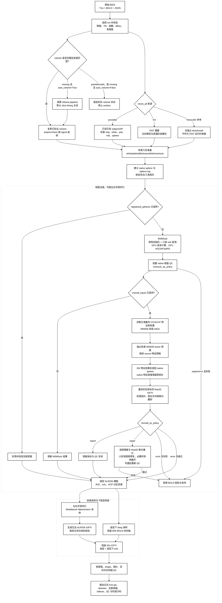

# fMRI Surface pipeline

| 摘要 | 内容 |
|---|---|
| 输入 | 配对BIDS T1w＋BOLD、HCP表面资源；可提供已有recon-all。 |
| 输出 | 双侧fsLR32k GIFTI、91k CIFTI、注册球面与QC。 |
| 对应原软件 | recon-all、fMRIPrep皮层采样和CIFTI组装。 |
| Python / CLI | `fnit.fMRISurface_pipeline` / `fnit-fmri surface`。 |
| CPU / GPU | 混合CPU/GPU；使用Workbench及独立native重建程序。 |

## 1. 功能简介

入口从一个原始BIDS run完成volume检查、解剖重建与表面处理。
该run的volume完全缺失时先自动运行 [Volume pipeline](README.md)，
已有完整结果时核验并复用，随后输出双侧32,492顶点时序与91,282灰坐标CIFTI。
默认使用 `preproc`，也可明确选择经过ICA-AROMA的 `clean`。

重建来源支持FNIT新重建、用户已有subject目录/ZIP，以及显式官方FreeSurfer参考。
生产示例采用 `fnit` 或 `provided`；兼容的 `freesurfer` 分支实际执行官方recon-all，只用于独立benchmark。
FNIT重建使用PyTorch/Numba和Conda中独立编译的native节点；皮层采样使用Workbench，
所以本流程仍有CPU/C++阶段，不能称为全GPU或全部纯PyTorch。



模块说明见 [recon-all](../recon_all/README.md)、[MSM](../msm/README.md) 和 [volume](README.md)。
流程图只列主要数据流；不把重建与volume缓存的内部检查展开为调用图。

## 2. Python 调用

<a id="python-调用输入输出与参数"></a>

先准备主页Conda环境及资源：

```bash
fnit-setup-weights --model fmri
fnit-setup-fmri-surface-assets --output-dir /data/hcp_assets --fmriprep
```

最短示例复用用户已有同源重建，缺少volume时由入口自动处理：

```python
from fnit import fMRISurface_pipeline

bids_directory = "/data/bids"                         # 原始BIDS目录
output_directory = "/data/derivatives/fnit"           # volume和surface共用结果目录
subject_directory = "/data/subjects/sub-01"          # 与源T1w一致的已有subject
surface_assets_directory = "/data/hcp_assets"         # 已校验HCP和TemplateFlow资源
surface_result = fMRISurface_pipeline(                 # 返回最终路径与阶段时间
    bids_root=bids_directory,
    derivatives_root=output_directory,
    subject="01",                                    # 选择sub-01
    hcp_assets_dir=surface_assets_directory,
    recon_all=subject_directory,
    recon_all_backend="provided",                     # 只读已有重建
    volume_options={"registration_backend": "fnirt"}, # 缺volume时采用FLIRT + FNIRT
    device="cuda:0",                                 # FNIT计算设备
    cpu_threads=4,                                    # 整个surface调用的CPU预算
)
print(surface_result.dtseries)                        # 91k CIFTI文件
```

已有重建必须含有效中层面；缺中层面时还须安装独立native `mris_expand`，
入口在复制后的自产目录补面，保持原subject只读。

选择FNIT新重建前，按 [recon-all安装](../recon_all/README.md) 配置权重、图谱和native程序：

```python
from fnit import fMRISurface_pipeline

reconstruction_options = {                            # FNIT重建所需资源与CPU预算
    "weights_dir": "/data/recon_weights",              # 完整recon-all模型组
    "assets_dir": "/data/recon_assets",                # 经哈希校验的图谱
    "native_bin_dir": "/data/fnit_native/bin",          # 独立源码构建程序
    "threads": 4,                                    # 重建CPU线程
}
surface_result = fMRISurface_pipeline(                 # 从原始MRI完成缺失阶段
    bids_root="/data/bids",                            # 配对原始BIDS
    derivatives_root="/data/derivatives/fnit",          # 新输出根目录
    subject="01",                                    # 被试标签
    hcp_assets_dir="/data/hcp_assets",                  # 表面与MNI模板
    recon_all_backend="fnit",                          # FNIT重建来源
    recon_all_output_dir="/data/recon/sub-01",          # 重建持久输出
    recon_all_options=reconstruction_options,
    volume_options={"registration_backend": "fnirt"}, # 自动volume配置
    device="cuda:0",                                 # GPU设备
)
```

### 输入数据格式

- 原始BIDS：一个四维BOLD NIfTI `[X,Y,Z,T]`、非空TaskName、正值TR秒值且与NIfTI一致的JSON和同被试三维T1w。
  BOLD可为整数/浮点强度，T1w无需预先脑提取，不能用短截取代替完整run。
- 影像affine：有效毫米scanner-RAS；文件存储方向可不同。
  原生BOLD、T1w和MNI不是相同网格，必须使用实际变换连接。
- `provided`：subject目录或无路径越界的ZIP。
  包含 `mri/orig.mgz`、`mri/orig/001.mgz` 和左右 white/pial/sphere/sphere.reg/thickness/sulc。
  每侧有midthickness或graymid；没有时在自产目录运行厚度一半处的 `mris_expand`。
- 重建与源T1w：省略 `fsnative_to_t1w` 时，原始T1在规范RAS后网格与体素内容必须相符。
  若来自不同T1空间，明确提供经过核对的正向scanner-RAS世界仿射。
- 变换：4×4有限、可逆、齐次矩阵，单位mm。
  FSL矩阵或官方ITK pull不能直接作为正向RAS矩阵传入；方向说明及实际证明见
  [provided变换记录](../../validation/fmri/public_ten_20261003/provided_transform_provenance.public.json)。
- 现成volume：T1w原生BOLD分辨率preproc与对应MNI6-2mm preproc，
  来源、TR、完整帧、模板、grid和有限值须通过检查。
  clean分支还检查ICA-AROMA完成状态；不把preproc缺失改成使用clean。
- `goodvoxels`：可选三维二值ROI，与T1w BOLD实际网格相同。
- HCP/fsLR资源：固定版本球面、sulc、ROI和MSM配置；
  CIFTI另需与MNI BOLD完全同网格的HCP dseg。
- 注册球面：左右GIFTI surface，原生顶点/三角顺序须与该subject一致。
  它们是球面几何，不是T1w毫米皮层表面，也不是4×4影像变换。
- MSMAll：明确提供L/R特征和权重；`C`可无髓鞘图，`CA/CAT`需要相应个体数据。
  默认只运行T1w脑沟MSMSulc，不自动执行FIX、HCP CA_CAT外层迭代或DeDrift。

### 输入参数

| 参数 | 必需 | 类型 | 默认值 | 含义 |
|---|---|---|---|---|
| `bids_root` | 是 | 路径 | — | 原始BIDS根目录，与volume来源一致。 |
| `derivatives_root` | 是 | 路径 | — | volume与surface共用的FNIT衍生结果根目录。 |
| `subject` | 是 | str | — | 被试标签。 |
| `hcp_assets_dir` | 是 | 路径 | — | 安装器准备的HCP/fsLR与TemplateFlow资源根目录。 |
| `recon_all` | 否 | 路径/None | `None` | provided输入：已有subject目录或ZIP，保持只读。 |
| `session` | 否 | str/None | `None` | ses筛选。 |
| `task` | 否 | str | `'rest'` | task筛选。 |
| `run` | 否 | str/None | `None` | run筛选。 |
| `acquisition` | 否 | str/None | `None` | acq筛选。 |
| `direction` | 否 | str/None | `None` | dir筛选。 |
| `reconstruction` | 否 | str/None | `None` | rec筛选。 |
| `echo` | 否 | str/None | `None` | echo筛选。 |
| `wb_command` | 否 | 路径/str | `'wb_command'` | Conda环境中的Connectome Workbench命令。 |
| `device` | 否 | str | `'cuda:0'` | FNIT计算设备。 |
| `overwrite` | 否 | bool | `False` | 只控制surface最终文件，不覆盖volume输入。 |
| `registered_spheres` | 否 | 左右路径二元组/None | `None` | 现成的原生顶点顺序注册球面；给出时不重新估计MSM。 |
| `msm_config` | 否 | MSMSulcConfig/路径/None | `None` | None为默认HCP四级配置；与provided球面互斥。 |
| `msm_execution` | 否 | str | `'optimized'` | optimized或reference，同算法执行策略。 |
| `msmsulc_qc_policy` | 否 | str | `report` | 前置 MSMSulc 输出球面 QC：report 保持官方插值，repair 显式修复翻折，error 拒绝写出。 |
| `msmall_inputs` | 否 | dict/路径/None | `None` | 明确的L/R MSMAllInputs或JSON清单；提供后在MSMSulc后refine。 |
| `msmall_config` | 否 | MSMAllConfig/路径/None | `None` | 默认三级refine；仅有msmall_inputs时可用。 |
| `msmall_qc_policy` | 否 | str | `report` | MSMAll 最终 native 球面策略：report 保留官方 composition 坐标，repair 显式修复翻折，error 在投影和最终发布前拒绝。 |
| `goodvoxels` | 否 | 路径/None | `None` | 额外三维volume ROI，须与T1w BOLD同网格。 |
| `signal` | 否 | str | `'preproc'` | preproc或clean；缺preproc不自动切换clean。 |
| `fsnative_to_t1w` | 否 | 4×4数组/路径/None | `None` | 正向fsnative scanner-RAS→源T1w scanner-RAS，单位mm。 |
| `parallel` | 否 | bool | `True` | 左右半球独立准备、注册和投影可并行。 |
| `cpu_threads` | 否 | int/None | `None` | 总CPU线程预算；None读取OMP_NUM_THREADS或Torch当前预算。 |
| `recon_all_backend` | 否 | str/None | `None` | 省略时有recon_all即provided，否则fnit；freesurfer仅独立参考实验。 |
| `recon_all_output_dir` | 否 | 路径/None | `None` | 生成/复制并补面的持久目录，与只读输入分开。 |
| `recon_all_options` | 否 | dict/None | `None` | 所选重建backend公开选项，见下表。 |
| `t1w_image` | 否 | 路径/None | `None` | 明确同源T1w；已有volume时须匹配其SourceT1w。 |
| `auto_volume` | 否 | bool | `True` | 该run完全缺失volume时先自动执行；False要求已有完整volume。 |
| `volume_options` | 否 | dict/None | `None` | 传给volume的科学参数；不允许改写已选run、T1w或device。 |

重建选项与入口参数分开，未知键会报错：

| `recon_all_options` 键 | 适用来源 | 含义 |
|---|---|---|
| weights_dir / assets_dir | fnit | 已核验的模型与图谱目录。 |
| native_bin_dir | 三者 | 独立native程序目录。 |
| threads | fnit / freesurfer | 重建CPU预算，默认4。 |
| hemisphere_workers | fnit | 左右重建工作数。 |
| cuda_allocator_cache | fnit | 是否保留CUDA allocator缓存。 |
| native_optimizations | fnit | 原生节点优化策略。 |
| profile_stages | fnit | 是否保存阶段profiling。 |
| mris_expand_command | 三者 | 缺中层面时使用的独立扩面程序路径。 |
| fsnative_to_t1w | provided | 与入口相同的正向世界变换；两处同时给出须一致。 |
| fs_license | 三者 | 作者许可文件路径；仅记录路径，不读取内容展示。 |
| command / recon_all_command | freesurfer参考 | 官方recon-all命令，仅独立参考环境。 |

自动volume仅在该run所有volume影像、变换及sidecar均不存在时运行。
残缺结果为 `partial`、来源或几何不符为 `invalid`，保留文件并报告原因。
`overwrite=True` 只允许替换surface；它不能覆盖已有volume。
`volume_options` 中完整参数见 [volume参数表](README.md#输入参数)。

### 输出

最终BIDS输出保留源task/run/echo等实体，有session时增加 `ses-*`：

```text
derivatives/fnit/
  dataset_description.json
  sub-01/
    anat/                              # volume脑图/解剖缓存
    func/
      ...space-T1w_res-native_desc-preproc_bold.nii.gz
      ...space-MNI152NLin6Asym_res-2_desc-preproc_bold.nii.gz
      sub-01_task-rest_hemi-L_space-fsLR_den-32k_desc-preproc_bold.func.gii
      sub-01_task-rest_hemi-R_space-fsLR_den-32k_desc-preproc_bold.func.gii
      sub-01_task-rest_space-fsLR_den-91k_desc-preproc_bold.dtseries.nii
      sub-01_task-rest_space-fsLR_den-91k_desc-preproc_report.json
      sub-01_task-rest_hemi-L_space-fsLR_desc-preprocReg_sphere.surf.gii
      sub-01_task-rest_hemi-R_space-fsLR_desc-preprocReg_sphere.surf.gii
      ...json                          # 信号/球面sidecar
recon/sub-01/                          # 显式新重建持久输出
```

| 输出 | 文件格式、shape和含义 |
|---|---|
| `left` / `right` | float32 GIFTI；每帧32,492顶点，T个时序数组；fsLR32k顺序，非影像affine。 |
| `dtseries` | float32 CIFTI-2 `[T,91282]`；秒时间轴和21结构BrainModel轴，包括双侧皮层与19个皮层下结构。 |
| registered spheres | 左/右surface GIFTI，保留原生顶点及三角形拓扑；sphere用于注册，不能当成皮层毫米位置。 |
| `metadata` | CIFTI JSON路径；来源、信号、TR、表面配准、重建、配置和时间。 |
| `qc_report` | JSON路径；实际grid、轴、有限值与几何检查结果。 |
| `recon_all` | 实际使用的subject目录；新建来源或只读/复制来源由metadata声明。 |
| `volume_executed` | bool，是否在这次调用中自动生成volume。 |
| `timing_seconds` | 自动 volume、重建、准备、注册、投影和 CIFTI 阶段时钟；返回值 `total` 包含发布和临时清理，sidecar 的 `total_before_publication` 截止于最终序列化/发布之前。 |

preproc强度保持volume定义；clean强度取其去噪结果，没有统一物理量单位。
CIFTI的皮层下部分使用MNI6-2mm影像affine；皮层部分使用表面轴，不虚构影像affine。
固定轴与fMRIPrep的对应采样契约兼容，但整体输出一致性须以同版本、同输入比较为依据。
所有输入subject和ZIP保持只读；临时native准备文件不是稳定公共输出。


### MSMSulc 与 MSMAll 分支

不提供 `msmall_inputs` 时，surface pipeline 执行 `MSMSulc → ribbon 投影 → CIFTI`；提供 L/R `msmall_inputs` 后，执行 `MSMSulc → MSMAll → native sphere 合成 → ribbon 投影 → CIFTI`，输出描述改为 `desc-MSMAllpreproc/clean`。`msm_config` 只控制 MSMSulc，`msmall_config` 只控制 MSMAll；`registered_spheres` 与两者互斥。

C-only 分支只需要真实 fMRI 连接特征；CA 需要个体 T1w/T2w-derived myelin，CAT 还需要功能拓扑。T2w/FLAIR 不是可静默替代项，缺少 CA/CAT 输入时直接报错。

`msmsulc_qc_policy` 只作用于前置 MSMSulc 输出，语义见 [MSMSulc 说明](../msm/README.md)。`msmall_qc_policy` 独立控制 MSMAll 最终 native composition：默认 `report` 保留官方坐标并报告；`repair` 显式修复最终 native 插值的翻折；`error` 在存在翻折时于 BOLD 投影和最终发布前报错。两个参数可以分别选择 report/repair/error。solver 球面与最终 native sphere 分别检查，solver 无翻折不代表最终 native 无翻折。

MSMSulc 单独分支的 `repair/error` 也在最终 float32 球面复核未通过时拒绝投影。提供 `registered_spheres` 时没有前置 MSMSulc 计算，因此不能同时选择非默认 `msmsulc_qc_policy`；没有 `msmall_inputs` 时同样不能选择非默认 `msmall_qc_policy`。这些组合会在读取 BIDS 数据前报错。

两处显式 `repair` 均使用有界局部移动、三个顶点的联合 float32 检查及必要时从已配准 native 原坐标重新开始的固定边界区域修复；局部候选不得翻转正常相邻面。策略以 `absolute_folded_output_faces` 判断最终取向，参考方向取其多数面方向；旧 `folded_output_faces` 相对计数保留，输入已有反向面及其修正另行记录。具体预算和诊断字段见 [MSMSulc 的 native 修复说明](../msm/README.md#输入数据格式)。

最终球面从实际保存的 float32 GIFTI 重新读取，核对未变形 native 网格的顶点顺序、三角形和方向。QC 文件的 `MSM.FinalNative.qc_policy` 记录策略；每半球的 `native_output_qc_before_repair`、`fold_repair` 与 `orientation_qc` 分别记录修复前状态、改动和最终检查。`fold_repair` 包括是否执行、改动顶点数、展开更新数、耗时和成功状态，注册元数据的 `QCPolicy` 也记录所选策略。`OrientationQC` 按初始 MSMSulc、MSMAll solver、最终 native 和全部阶段汇总。上游 warning 持续保留，缺少阶段检查记为 `not_assessed`。修复后 0 翻折只证明该项几何 QC，通过官方精度仍需分别比较球面坐标、特征和最终 BOLD。

以下示例对前置 MSMSulc 和最终 MSMAll native sphere 分别执行显式修复，并在投影前复核：

```python
from fnit.fmri import fMRISurface_pipeline

surface_result = fMRISurface_pipeline(
    bids_root="/absolute/path/bids",
    derivatives_root="/absolute/path/derivatives",
    subject="0001",
    recon_all="/absolute/path/recon-all/sub-0001",  # 已完成的 T1w 表面
    hcp_assets_dir="/absolute/path/hcp_surface_assets",
    msmall_inputs="/absolute/path/msmall.inputs.json",  # 左右半球显式特征与权重
    msmsulc_qc_policy="repair",  # 前置球面显式修复并复核
    msmall_qc_policy="repair",   # 最终 native 球面显式修复后再投影
    device="cuda:0",
    parallel=True,
    cpu_threads=8,
)
```

## 3. 命令行调用

```bash
fnit-fmri surface --bids-root /data/bids \
  --derivatives-root /data/derivatives/fnit --subject 01 \
  --recon-all /data/subjects/sub-01 --recon-all-backend provided \
  --surface-assets-dir /data/hcp_assets --threads 4 --device cuda:0
```

如需FNIRT自动volume，将 `{"registration_backend":"fnirt"}` 保存到 `/data/volume_options.json`，
再添加 `--volume-options-json /data/volume_options.json`。
Python及CLI的volume后端默认仍为SynthMorph；该默认需要额外模型组 `fmri`。

| CLI 参数 | Python 参数 | 含义 |
|---|---|---|
| `--bids-root` | `bids_root` | 原始BIDS根目录，与volume来源一致。 |
| `--derivatives-root` | `derivatives_root` | volume与surface共用的FNIT衍生结果根目录。 |
| `--subject` | `subject` | 被试标签。 |
| `--session` | `session` | ses筛选。 |
| `--task` | `task` | task筛选。 |
| `--run` | `run` | run筛选。 |
| `--acquisition` | `acquisition` | acq筛选。 |
| `--direction` | `direction` | dir筛选。 |
| `--reconstruction` | `reconstruction` | rec筛选。 |
| `--echo` | `echo` | echo筛选。 |
| `--recon-all` | `recon_all` | provided输入：已有subject目录或ZIP，保持只读。 |
| `--recon-all-backend` | `recon_all_backend` | 省略时有recon_all即provided，否则fnit；freesurfer仅独立参考实验。 |
| `--recon-all-output-dir` | `recon_all_output_dir` | 生成/复制并补面的持久目录，与只读输入分开。 |
| `--recon-all-options-json` | `recon_all_options` | 所选重建backend公开选项，见下表。 |
| `--surface-assets-dir` | `hcp_assets_dir` | 安装器准备的HCP/fsLR与TemplateFlow资源根目录。 |
| `--wb-command` | `wb_command` | Conda环境中的Connectome Workbench命令。 |
| `--device` | `device` | FNIT计算设备。 |
| `--threads` | `cpu_threads` | 总CPU线程预算；None读取OMP_NUM_THREADS或Torch当前预算。 |
| `--serial-hemispheres` | `parallel=False` | 关闭半球并行。 |
| `--signal` | `signal` | preproc或clean；缺preproc不自动切换clean。 |
| `--fsnative-to-t1w` | `fsnative_to_t1w` | 正向fsnative scanner-RAS→源T1w scanner-RAS，单位mm。 |
| `--registered-spheres` | `registered_spheres` | 现成的原生顶点顺序注册球面；给出时不重新估计MSM。 |
| `--goodvoxels` | `goodvoxels` | 额外三维volume ROI，须与T1w BOLD同网格。 |
| `--msm-config` | `msm_config` | None为默认HCP四级配置；与provided球面互斥。 |
| `--msm-execution` | `msm_execution` | optimized或reference，同算法执行策略。 |
| `--msmsulc-qc-policy` | `msmsulc_qc_policy` | report/repair/error；前置 MSMSulc 输出球面的翻折策略。 |
| `--msmall-inputs-json` | `msmall_inputs` | 明确的L/R MSMAllInputs或JSON清单；提供后在MSMSulc后refine。 |
| `--msmall-config` | `msmall_config` | 默认三级refine；仅有msmall_inputs时可用。 |
| `--msmall-qc-policy` | `msmall_qc_policy` | report/repair/error；MSMAll 最终 native 球面的翻折策略，独立于前置 MSMSulc。 |
| `--require-volume` | `auto_volume=False` | 要求已有完整volume，不自动执行。 |
| `--volume-options-json` | `volume_options` | 传给volume的科学参数；不允许改写已选run、T1w或device。 |
| `--t1w-image` | `t1w_image` | 明确同源T1w；已有volume时须匹配其SourceT1w。 |
| `--overwrite` | `overwrite` | 只控制surface最终文件，不覆盖volume输入。 |
| `--mni-template`, `--mni-brain-mask` | volume_options | 自动volume的模板/脑mask。 |
| `--recon-all-weights-dir`, `--recon-all-assets-dir`, `--recon-all-native-bin-dir` | recon_all_options | FNIT重建资源。 |
| `--recon-all-threads`, `--mris-expand-command` | recon_all_options | 重建预算/补面程序。 |
| `--freesurfer-recon-all-command`, `--fs-license` | recon_all_options | 官方参考命令/个人许可路径。 |

CLI默认与Python一致：preproc、CUDA0、自动volume、左右并行。
`--threads` 为总CPU预算；`--serial-hemispheres` 将parallel设为False。
可用 `fnit-fmri surface --help` 查看全部真实参数。

前述 MSMAll 具名示例的命令行为：

```bash
fnit-fmri surface --bids-root /absolute/path/bids \
  --derivatives-root /absolute/path/derivatives --subject 0001 \
  --recon-all /absolute/path/recon-all/sub-0001 \
  --surface-assets-dir /absolute/path/hcp_surface_assets \
  --msmall-inputs-json /absolute/path/msmall.inputs.json \
  --msmsulc-qc-policy repair --msmall-qc-policy repair \
  --threads 8 --device cuda:0
```

## 4. 原软件调用

完整原始MRI参考使用 [volume页的fMRIPrep容器命令](README.md#4-原软件调用)。
fMRIPrep没有只执行皮层采样的独立用户CLI；固定输入对照使用其原Workbench步骤：

```bash
wb_command -volume-to-surface-mapping preproc_T1w.nii.gz native_mid.surf.gii native.func.gii -ribbon-constrained native_white.surf.gii native_pial.surf.gii
wb_command -metric-dilate native.func.gii native_mid.surf.gii 10 native_dilated.func.gii -nearest
wb_command -metric-mask native_dilated.func.gii native_roi.shape.gii native_masked.func.gii
wb_command -metric-resample native_masked.func.gii registered.surf.gii fsLR32k.sphere.surf.gii ADAP_BARY_AREA atlas.func.gii -area-surfs native_mid.surf.gii individual_mid32k.surf.gii -current-roi native_roi.shape.gii
wb_command -metric-mask atlas.func.gii atlas_roi.shape.gii final.func.gii
```

| FNIT 参数/阶段 | 原软件参数/阶段 |
|---|---|
| `goodvoxels` | 第一条命令附加 `-volume-roi`。 |
| native white/pial/mid | `-ribbon-constrained` 的相应几何。 |
| registered_spheres | `-metric-resample` 原生注册球面。 |
| fsLR32k目标与中层面 | 目标球面及 `-area-surfs` 面积校正。 |
| individual/atlas ROI | 原生及atlas的 `-metric-mask`。 |
| CIFTI组装 | NiWorkflows1.14.4 `_create_cifti_image`，独立参考源码见详细报告。 |
| `recon_all_backend="freesurfer"` | 官方 `recon-all -i T1w.nii.gz -sd subjects -s sub-01 -all`；仅参考环境。 |

已实现原生投影、填补、ROI、面积重采样和CIFTI组装。
本轮同输入控制复用FNIT自身重建/MSM；它只验证采样，不能验证重建或球面配准质量。
原软件整链的不同前处理结果另行比较，不把固定输入零差写成整链数值等价。

## 5. 最新精度和运行时间

### 2026-10-09：最终修复版完整配准核心

| 完整双侧 API / s | 原版 CPU8 | FNIT CPU8 | 观测原版/FNIT | A100，CPU 总预算 8 | 对严格官方 CPU1 保存精度 |
|---|---:|---:|---:|---:|---|
| MSMSulc，默认四级，`report` | 507.392 | 347.914 | 1.458 | 130.669 | 两侧 float32 坐标、有序 faces 逐位一致 |
| MSMAll，固定 21C、三级 λ=0.05 | 507.310 | 312.104 | 1.625 | 97.685 | 两侧 float32 坐标、有序 faces 逐位一致 |

同预算 CPU 复测按原版→FNIT 顺序执行，均固定 0–7 核，总预算 8、左右各 4，并行双侧、串行两项 API；CUDA 未初始化。墙钟包括读入、完整求解、球面/报告保存，排除导入、哈希、离线比较和资源监测。上表比值仅描述这一次共享节点配对。A100 核心为另一次观察，TF32 开启、几何/成本 float64、保存 float32，allocator 上限 20 GB；峰值 allocation 2.241/2.266 GB，reserved 最大 7.376 GB。核心不含新特征、native 合成、BOLD 投影或 CIFTI。

FNIT CPU8 和 GPU 四侧对严格原版 CPU1 的角差、弦差均为 0。此次原版 CPU8 本身相对严格 CPU1 有差异：MSMSulc 右侧平均/最大角差 **0.120077/0.935965°**，MSMAll 左侧 **0.032034/0.807579°**，其余两侧相同；FNIT 对新原版 CPU8 的差异等于该原版自身的单/多线程差异。数值精度参照与同预算速度参照分别保留。MSMSulc 默认 `report` 与严格原版同为左右 2/0 翻折；显式 native 修复在完整 surface 单独验收。MSMAll 0/0 属于 solver QC。

最初未配对的 FNIT CPU8 观察为 489.870/479.163 s，保留在原报告中；最新 CPU 比值使用上述新配对。旁路资源记录覆盖部分原版 MSMAll 和 FNIT 记录期，记录内内存失败/CPU throttle 增量为 0，不能单凭该窗口确定跨时段时差原因。GPU 实际加载/编译的 22 个源码依赖与保守误差界版相同，默认 report 未调用新增 native 修复模块。见[最新同预算 CPU 配对](../../validation/msm/native_qc_20261009/a100/final_cpu8_matched.public.json)、[完整 GPU](../../validation/msm/native_qc_20261009/a100/final_gpu8.public.json)、[实际源码一致性](../../validation/msm/native_qc_20261009/a100/clear_to_final_code_identity.public.json)及[逐步骤/历史验证](../../validation/msm/native_qc_20261009/a100/README.md)。

此前缓存优化的同输入 A/B 完整 GPU 观察为 MSMSulc 均值 91.109→83.939 s、MSMAll 72.162→68.859 s，迭代轨迹和保存坐标不变；历史 CPU8 为 157.476/192.269 s。历史与本轮各按实际源码、输入和时段记录。

### 2026-10-09：最终修复版两分支 surface，10/10 例

同一冻结源码完成十例 MSMSulc-only surface、自产 d20/21C，再独立运行 MSMSulc→MSMAll→native composition→投影/CIFTI。两个 native 策略均为 `repair`，A100、CPU 总预算 4、左右各 2，TF32 开启，allocator 上限 20 GB。全部阶段保存球面左右绝对翻折 0/0、无新增正常面翻折；两分支全部 180 帧 finite，实际投影球面与发布球面数组相同。

| 完整测量 / s | 十例均值 | 中位数 | 最小–最大 |
|---|---:|---:|---:|
| Stage A：MSMSulc-only surface API | 270.562 | 259.184 | 224.083–352.201 |
| 本次时序生成 d20/21C | 8.113 | 8.073 | 4.968–12.183 |
| Stage B：MSMSulc＋MSMAll surface API | 345.813 | 338.727 | 261.365–478.690 |
| 连续两分支外层 | 626.908 | 601.855 | 492.216–846.974 |

最大 allocation/reserved 为 **2.390 / 11.044 GB**。外层由独立连续时钟测量，含两次 API、新特征、阶段准备、实际投影输入捕获及输出 QC/保存；导入、CUDA 初始化和前后置哈希审计在时钟外。前序 volume/recon-all 已完成，不计入本轮 surface。C-only 不需 T2w/FLAIR；完整 HCP CA/CAT 另需其相应特征。

本次自产 21C 首例另外重算官方 CPU1/1，并在 GPU 完整重放 MSMAll：左右 float32 坐标、有序 faces 逐位一致，角差/弦差全部为 0，solver 翻折 0/0；GPU API **139.522 s**、allocation **2.275 GB**。严格 CPU1/1 是精度参照，不能作为 CPU8 的速度分母。显式修复后的 native 几何、未修复 solver 数值及独立投影分别验收。

详见[十例完整报告](../../validation/msm/native_qc_20261009/a100/final_surface10.public.json)、[新特征 GPU 精度报告](../../validation/msm/native_qc_20261009/a100/final_case01_actual_gpu_precision.public.json)和[逐步骤验证页](../../validation/msm/native_qc_20261009/a100/README.md#最终修复版完整-surface)。

### 十例完整 surface 分步骤

| 阶段 / s | MSMSulc-only 均值 | MSMSulc＋MSMAll 均值 |
|---|---:|---:|
| native 表面准备 | 6.940 | 6.996 |
| volume 状态核验 | 6.236 | 6.471 |
| 重建适配/读取 | 0.618 | 0.877 |
| atlas 面积表面 | 2.278 | 1.708 |
| MSMSulc 准备＋配准/修复 | 101.372 | 104.481 |
| MSMAll 配准＋native 合成/修复 | 0.000 | 89.510 |
| 左右投影 | 136.584 | 122.663 |
| CIFTI 组装/保存 | 9.852 | 8.488 |

两分支各为十次完整 API 的分阶段观察，前序 volume/recon-all 已完成。逐例范围、左右 Workbench 算子和新特征时钟见[完整逐步骤报告](../../validation/msm/native_qc_20261009/a100/README.md#十例分步骤)。左右时钟不相加为双侧墙钟，未覆盖的发布/捕获开销仍计入 API。

### 两分支实际球面的独立官方投影对照

首例两分支均用本次完整运行捕获的实际 T1w/MNI 时序、white/pial、面积、ROI 和最终保存球面，独立调用固定 Workbench 2.1.0 及原 NiWorkflows CIFTI 源函数，覆盖全部 180 帧。左右 GIFTI 与 91k CIFTI 共 **56,255,760** 个值逐位一致，MAE、RMSE 和最大绝对误差均为 0；时间/脑结构轴、intent、科学元数据及 540 字节 NIfTI 头一致。

完整 CIFTI XML 字节不同：`Volume` 子节点在 FNIT 中位于两个皮层节点之后，原函数中位于全部 21 个 BrainModel 之后；所有属性、文本及 BrainModel 顺序/内容一致。GIFTI 图像级字段仅 `Provenance`、`ParentProvenance`、`WorkingDirectory` 不同，记录各自命令路径；逐帧元数据相同。

原版仅采样与 CIFTI 组装的 CPU4（左右各2）墙钟分别为 **85.654 / 88.394 s**；该单次对照不含配准、新特征、native 修复或离线比较，不能与完整 surface 的总耗时计算加速比。见[实际球面官方投影报告](../../validation/msm/native_qc_20261009/a100/matched_sphere_sampler.public.json)。

### 2026-10-09：H100 初次双侧配准核心与 native QC

修复球面查面规则后，同一真实病例的完整双侧 `run_msmsulc` 为 **93.130 s / 1.756 GB allocation**，双侧三级 `run_msmall` 为 **73.608 s / 1.787 GB allocation**。四侧实际保存的 float32 坐标及有序 faces 均与固定 newMSM 单线程参照逐值一致，角差和弦差全部统计为 0。两项 API 使用 H100 PCIe、CPU 总预算 8、左右各 4、20 GB allocator 上限；实际 TF32 开启，配准几何为 float64。

这组时钟包含球面与特征读取、完整配准和报告写盘，排除特征估计、native composition、BOLD 投影及 CIFTI；它是 surface 中可复用的完整配准核心。MSMSulc `report` 与固定原版均为左/右翻折 **2/0**，记为 warning；MSMAll 的 **0/0** 是 32k solver 的结果，最终 native sphere 另行检查。详细阶段、源码及输入哈希见[本轮验证页](../../validation/msm/native_qc_20261009/README.md)和[聚合报告](../../validation/msm/native_qc_20261009/gpu_cores.public.json)。显式修复分支的示例见[两个可选分支](#msmsulc-与-msmall-分支)。

### 本轮 CPU 官方测试范围

[2026-10-04 起的 CPU 官方对照](../../validation/fmri_cpu_20261004/task04_msm_surface/README.md)包含完整 490 帧固定几何投影/CIFTI，以及公开 180 帧 fresh surface 输出整链。后者以同一已完成 volume 和 recon-all 为起点，完整计入几何、ROI、MSMSulc、投影、CIFTI、QC 与保存；前序 volume/recon-all 计算分别由其独立测试记录。原 fMRIPrep 25.2.4、冻结基线和候选使用相同 1/8 物理核预算。固定 490 帧投影的 CPU1/8 左右全帧时序与 91k CIFTI 逐值及轴相同；原版 fresh 为 466.650/268.903 s，FNIT 完整 API 为 412.364/128.419 s。完整 180 帧 surface 已运行完成，但尚未达到严格匹配：球面左／右平均角差 0.302742/0.345475°，CIFTI RMSE 13.8695、平均时间相关 0.977986，CPU1/8 的 FNIT 输出相同。原版 fresh 为 1855.025/521.294 s，FNIT 完整 API 为 781.290/249.809 s；精度差异正在按保存 MSM 输入定位，未作为通过结果。全部指标和测量范围见[完整报告](../../validation/fmri_cpu_20261004/task04_msm_surface/projection_surface_metadata_v1.public.json)。仅发布聚合指标与既有公开图。

逐段诊断已确认同一例的全部准备数组、归一化网格、刚性坐标与前两轮离散更新一致；左右全部 85/89 次原版刚性成本重放一致，第二轮分别更新 11/59 个控制点，DATA、CP 与标签仍逐值一致。首个粗级自然收敛已完成：左右迭代 8/6 次，左侧末坐标/标签精确，右侧 3 个 float64 坐标最大差 3.553×10⁻¹⁴，CP/标签精确。但右侧两次中间全脑成本差为 0.0725037/0.0954643，整链尚未通过；细级 setup 已确认右侧源点→CP 三角面归属缓存存在分歧，首 alpha 最大差 0.120256；保存几何的四组交叉重放进一步确认：完整 10,242 点的三种 FNIT 查询与实际官方 Octree 在固定几何下均逐值一致，右侧只有 2 个源顶点因上游 double 几何舍入改变归属；104 是缓存槽位数。这些固定几何检查点未出现选面分歧；本轮进一步检查迭代更新后的几何，发现最近顶点邻面与原版 Octree 候选池不等价，已按上节修复。该历史记录当时未执行新的细级优化或完整配准。见[四组合重放](../../validation/fmri_cpu_20261004/task04_msm_surface/surface_saved_geometry_mapping_aggregate_v1.public.json)。见[细级聚合](../../validation/fmri_cpu_20261004/task04_msm_surface/surface_fine_setup_aggregate_v1.public.json)。见[粗级聚合](../../validation/fmri_cpu_20261004/task04_msm_surface/surface_coarse_level_aggregate_v1.public.json)与[已完成前缀聚合](../../validation/fmri_cpu_20261004/task04_msm_surface/surface_prefix_aggregate_complete_second_v1.public.json)。

本轮成熟 MSMSulc 子函数已修 CPU float64 Point 除法舍入，并优化 CPU containing-face 查询；CPU 与 CUDA 的执行边界见 [MSMSulc](../msm/README.md#cpu-官方配对与历史修复2026-10-0405)。最终三种配准的 12 次完整 GPU 旧/新调用已完成，全部球面坐标和有序 faces 相同，最大本任务进程树显存 4.161 GB；各项实测时间及繁忙共享 H100 的边界见 [完整 GPU 回归](../../validation/fmri_cpu_20261004/task04_msm_surface/gpu_registration_abba_final_recovery_v1.public.json)与 [计时/资源图表](../msm/README.md#本轮-cpu-优化后的完整-gpu-回归2026-10-05)。既有 GPU 专项和下方三 backend 报告保留各自实测版本。


最新正式采样控制为 [2026-10-04两例全180帧报告](../../validation/fmri/reference_alignment_20261004/surface/SURFACE_ALIGNMENT.md)。
采样源码绑定 `cc940273`；现行 `140c3739` 只补输入保护和参考来源记录。
完整连续链的同轮结果见 [连续报告](../../validation/fmri/reference_alignment_20261004/CONTINUOUS_BENCHMARK.md)。

| 条件 | 本轮记录 |
|---|---|
| 数据 / n | ds001226 v5.0.1（CC0），两例真实T1w＋完整180帧。 |
| 原软件 | fMRIPrep25.2.4步骤、NiWorkflows1.14.4 CIFTI、FNIT Workbench2.1.0、参考Workbench2.0.1。 |
| CPU / GPU | CPU具体型号未保存；采样CPU运行，CUDA未初始化；连续链共享H100。 |
| 线程 / precision | 采样4线程、串行半球，输出float32；连续GPU阶段默认TF32。 |
| GPU峰值 | 采样无CUDA分配；连续链自有进程采样峰值14.0551 GB。 |
| timing | 采样API检查到保存；官方含每次容器启动；排除volume/recon/MSM冷计算。 |

### 端到端 benchmark

| 指标，两病例中位数 | FNIT | 原软件 | 差异 |
|---|---:|---:|---|
| 固定输入采样墙钟 | 150.43 s | 168.17 s | 两次实测、不同容器启动开销。 |
| 11角色数组最大绝对差 / RMSE | 0 / 0 | 固定输入原算子 | 全180帧、完整轴；只适用于本采样控制。 |
| 连续volume→surface API（robust） | 719.11 s | 同复用边界未测 | 不含新的recon/MSM。 |
| 连续CIFTI时间r / NRMSE | 0.737295 / 9.170536% | fMRIPrep成品参照 | 整链仍存在差异。 |

### 分步骤 benchmark

| 采样阶段，两病例中位数 | FNIT | 原软件 |
|---|---:|---:|
| 几何/ROI准备，独立时钟 | 14.62 s | 同范围未测。 |
| 左ribbon投影 | 14.65 s | 14.94 s |
| 右ribbon投影 | 15.40 s | 15.16 s |
| CIFTI组装 | 10.39 s | 20.09 s |

逐侧dilate、mask与resample的原时钟在详细报告，不把嵌套时钟相加成总时间。
NRMSE使用全部91,282灰坐标，恒定时序仍保留；不筛零值或拟合幅度。
本次没有重新测完整冷重建的独立surface耗时。


<!-- FNIT-UNIFIED-BENCHMARK-20261008 -->
### 本轮 GPU/并行 benchmark 摘要（2026-10-08）

#### MSMSulc：完整 surface API

在相同固定输入上，surface API（不含 recon-all/volume）旧串行、新串行、左右半球并行分别为 **436.245/343.056/243.695 s**，PyTorch allocation 为 **0.344/0.644/1.049 GB**。官方 CIFTI 时间序列 mean/median `r=0.977911/0.997039`；19 个皮层下结构逐体素一致，皮层和 sphere 仍不是逐值一致。MSMSulc FNIT 双侧冷/热 **201.99/198.08 s**，官方 newMSM 单线程/8线程 **1587.70/378.03 s**；固定 490 帧 fsLR32k/91k 输出逐值一致。该项目范围包含几何与 ROI 准备、双侧 MSMSulc、面积表面、全部时序投影、CIFTI、QC 和发布写盘，排除已经完成的 volume/recon-all。

#### MSMAll：真实 GPU 配准核心（full-surface 入口的可复用阶段）

现有真实配对输入可严格验证 `fMRISurface_pipeline(..., msmall_inputs=...)` 所调用的 MSMAll 注册核心，但不能把它误写成完整 surface E2E：C-only coarse **23.237→11.430 s**、三级 refine **181.790→90.796 s**，PyTorch allocation 分别为 **0.2194/1.4662 GB**，双侧坐标、拓扑和 metadata 严格一致。该记录包含特征/球面读取、注册和 sphere/report 写盘，排除特征估计、BOLD 投影、CIFTI、Workbench 外层发布和 Python/CUDA 冷启动；详见 [MSMAll 配对报告](../../validation/fmri/surface_gpu_parallel/msmall_paired.public.json)。

上述 490 帧专项尚无 MSMAll full-surface E2E GPU 计时：该 paired workspace 的 native sphere 顶点数为 120,035/122,950，而官方 SOURCE 特征为 40,962，缺少网格匹配的真实特征包。该专项需补齐特征后按同一 490 帧、H100、20 GB 上限协议重跑完整链路。另一个公开配对基准已执行一例 **180 帧 d20 C-only outer pipeline**，包括从 FNIT stage-A dtseries 准备特征、MSMAll、native composition、投影和 CIFTI；MSMAll 层 QC 通过，但前置 MSMSulc 为左/右翻折 2/0，未通过全链 QC 或严格官方精度。按原 runner 复核，历史 `460.962 s` 为第二次 surface API 的总墙钟，不含 stage-A 与特征准备，报告改用 `stage_b_surface_total`；阶段记录见 [MSMAll 十人配对章节](../msm/msmall.md#十人配对-c-only-集成基准2026-10-08)及[单例观察报告](../../validation/msm/msmall_outer_e2e_one_case.public.json)。两项基准的数据与范围分别保留。

2026-10-08 修复了一个会在进入 MSMAll 前误拒绝合法输入的拓扑判定问题：`_refine_msmall` 现在以实际传入的 MSMSulc 注册球面作为 native source 的拓扑基准；Workbench 导出的 midthickness 仅用于后续面积表面投影，不再承担球面拓扑判断。这样即使 midthickness 保持相同顶点而改变三角形序列，native MSMAll 特征仍会进入注册。固定服务器 Conda 环境中的 `tests/test_msmall_surface_composition.py` 与 `tests/test_msm_multivariate.py` 为 **29 passed, 1 skipped**，新增回归覆盖该三角形序列变化；其余完整 MSMSulc GPU E2E 指标沿用上面的已公开报告。490 帧 MSMAll 专项与 180 帧 C-only outer 观察的范围见上段，C-only 注册核心的速度与精度不能替代完整链路结果。

#### 本轮进一步提速

在 `925c5866` 中，`RadialSphereMap` 的 optimized CUDA + source-precision 路径只在 GPU containment 不确定、边界重叠或缺失时把 query/nearest 缓存复制到主机；已证明的点不再发生整批 D2H。CPU、reference 和所有 fallback 的 FP64/native 算术顺序保持不变。远端 Conda 环境的 `tests/test_msm_sphere_execution.py` 与 `tests/test_msm_sphere_cpu.py` 为 **14 passed, 5 skipped**；需要 native FastPD 扩展的严格 source-precision 测试因该环境缺少 `_fastpd_native`，未被伪造为通过。GPU 全链的新稳定加速比待匹配 MSMAll 特征补齐后与上述 E2E 协议一并复测。

既有 CPU 固定输入与 fresh 180 帧结果保留在上表；完整范围见 [统一 benchmark 索引](../BENCHMARK_INDEX.md)。

## 6. 最近版本和 benchmark

- 2026-10-09：更新 MSMSulc→自产 d20/21C→MSMAll→native composition 两分支的详细流程图，两个 QC 策略独立配置。修复成熟 MSM 子函数的原顺序展开误差及保存后绝对翻折检查，使用同一冻结源码重跑完整 surface；配准数值、显式修复几何和实际球面的独立官方投影分别验收。

- 2026-10-09：在 A100 复测优化后的成熟 MSMSulc/MSMAll 共享子函数，CPU 同预算对照和 GPU AB/BA 坐标、面序及轨迹检查通过；最新数字、显存代价和完整 surface 范围分别记录。

- 2026-10-09：补齐最终 native sphere 的独立 QC。报告分开记录初始 MSMSulc、MSMAll solver 和最终 composition，汇总保留上游 warning。新增 `msmall_qc_policy` 与 CLI：默认 report 保留官方 composition 坐标，repair 显式修复最终 native 翻折，error 在投影和最终发布前拒绝；它与前置 MSMSulc 策略独立。同步纠正历史 stage-B 总墙钟的范围。

<!-- 旧文档链接兼容锚点；原始记录在本页第6节的历史链接中。 -->
<a id="surface-e2e-latest"></a>
<a id="原软件调用"></a>
<a id="参考文献与原实现"></a>
<a id="命令行调用"></a>
<a id="实际计算设备"></a>

| 日期 | commit/version | 变化 | benchmark |
|---|---|---|---|
| 2026-10-04 | `140c3739` | 参考来源/输入覆盖保护。 | 原冻结MRI保持；77项相关合同通过。 |
| 2026-10-04 | `cc940273`＋source_v1 | 稳健参考连续链和同输入皮层采样控制。 | [两例报告](../../validation/fmri/reference_alignment_20261004/surface/SURFACE_ALIGNMENT.md)。 |
| 2026-10-03 | `1128bc52` | 自动volume与三种重建来源接通。 | [十例正式报告](../../validation/fmri/threeway_20261004/final10/REPORT.md)。 |
| 2026-10-02 | `81f1bb3` | 公共采样接口接入连续链。 | [历史连续链](../../validation/fmri/e2e_latest/README.md)。 |

更早benchmark、失败实验、内部发布过程和旧三路示例见 [历史技术记录](../../validation/fmri/surface_manual_archive_20261005.md)。
当前入口源码 [surface_pipeline.py](../../src/fnit/fmri/surface_pipeline.py)。

## 7. 参考文献、原软件和资源

- [fMRIPrep25.2.4采样源码](https://github.com/nipreps/fmriprep/blob/25.2.4/fmriprep/workflows/bold/resampling.py)。
- [NiWorkflows1.14.4 CIFTI源码](https://github.com/nipreps/niworkflows/blob/1.14.4/niworkflows/interfaces/cifti.py)。
- [Workbench官方命令](https://www.humanconnectome.org/software/workbench-command)。
- [HCPpipelines固定源码](https://github.com/Washington-University/HCPpipelines/tree/f8cac6892f88bdf889d644711ff038198eb81533)。
- Glasser et al. HCP minimal preprocessing. NeuroImage2013：[doi](https://doi.org/10.1016/j.neuroimage.2013.04.127)。
- Robinson et al. MSM. NeuroImage2014：[doi](https://doi.org/10.1016/j.neuroimage.2014.05.069)。

| 资源 | 用途 | 官方来源 | 大小 | SHA-256 | 是否允许 FNIT 再分发 |
|---|---|---|---|---|---|
| HCP固定模板/配置 | fsLR球面、ROI、sulc、MSMAll低维参考和配准 | [HCP固定commit](https://github.com/Washington-University/HCPpipelines/tree/f8cac6892f88bdf889d644711ff038198eb81533) | 按选项逐文件见目录 | [发布目录](../../src/fnit/_release_asset_catalog.json) | 按固定HCP许可，已发布项优先Release。 |
| TemplateFlow MNI6-2mm文件 | volume目标/皮层下dseg | [TemplateFlow](https://github.com/templateflow/tpl-MNI152NLin6Asym) | 3文件逐项见清单 | [发布目录](../../src/fnit/_release_asset_catalog.json) | 按逐资源许可；已发布项优先Release，保留官方来源回退。 |
| recon-all模型/图谱 | 新重建与native节点 | [FreeSurfer](https://surfer.nmr.mgh.harvard.edu/) | 模型11文件；默认核心图谱98项（完整清单111项） | [重建资源说明](../recon_all/README.md) | 模型/图谱含VPNL均已发布，优先Release；个人许可证由用户提供。 |

权重/模板分开安装，下载例外及完整大小/SHA见[统一安装说明](../ASSETS.md)与[资源手册](../WEIGHTS.md)。
