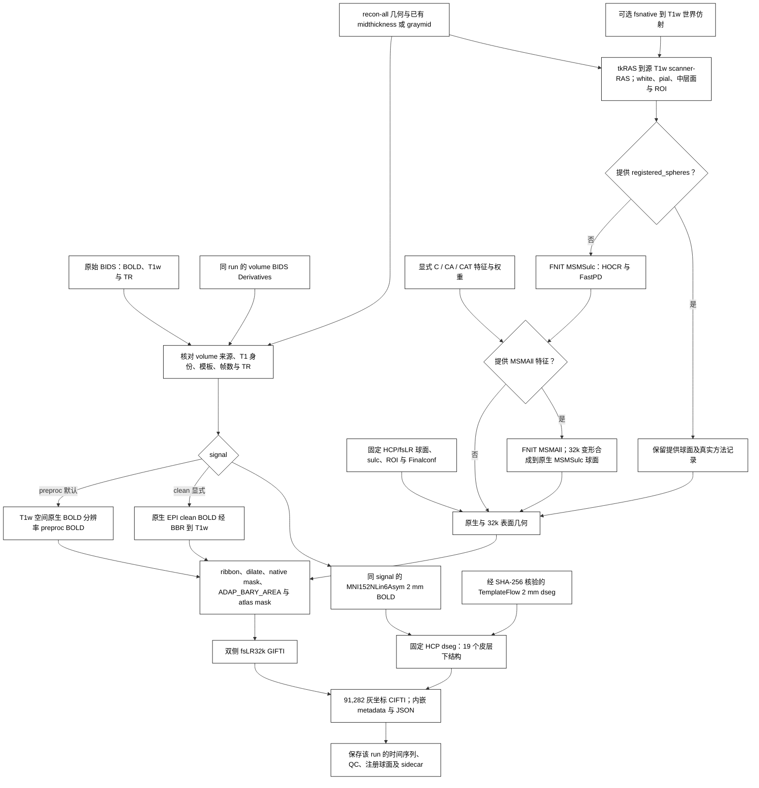

# fMRI 表面流程：fsLR32k 时间序列与 91k CIFTI

## 功能简介与流程图

`fMRISurface_pipeline` 将同一 run 的 [FNIT volume BIDS Derivatives](README.md) 和 T1w recon-all 几何转换为双侧 fsLR32k GIFTI 与 91k CIFTI。默认 `signal="preproc"`：皮层读取 volume 保存的 T1w 空间、原生 BOLD 分辨率时间序列，皮层下读取对应的 MNI152NLin6Asym 2 mm 时间序列；两者保留相同原始帧数与 BIDS TR。该输入包含 volume 实际执行的切片时间校正和运动变换，不经过 AROMA、混杂回归、时间滤波或全局强度归一化。

可选 [MSMAll](../msm/msmall.md) 在 MSMSulc 后使用明确提供的个体/参考多特征球面配准。无个体髓鞘图时可明确使用连接特征 `C`；`CA`、`CAT` 需要额外提供个体髓鞘图及相应特征。本入口不自动执行 HCP `CA_CAT` 外层迭代、UKB DeDrift 或 FIX。

切片时间校正默认关闭，由 volume 的 `slice_timing=False` 控制；volume CLI 可显式写 `--ignore-slice-timing`。surface 读取其实际 STC 状态，不再次进行时间校正。需要开启时在 volume API 设置 `slice_timing=True`，重新生成对应 preproc 后再投影。

表面路径包括 FS→fsLR 初始球面、MSMSulc、Workbench ribbon 投影、10 mm 最近邻填补、原生 ROI、ADAP_BARY_AREA 重采样、32k ROI，最后按 NiWorkflows 1.14.4 组装 CIFTI。最新复测从原始 BIDS 连续运行 volume 和默认 surface，另设原软件完整流程及同步骤 FSL/FreeSurfer 对照；三种边界分别记录。MSM 的独立用法见 [MSMSulc 子函数](../msm/README.md)。运行时使用 FNIT、PyTorch、nibabel 和 Connectome Workbench；原软件用于独立参考对照。

本地 MSMSulc 扩展须与源码同步。拉取包含 C++ 变更的更新后，在已激活的 FNIT 环境、仓库根目录执行 `python -m pip install .` 重新编译；本轮重建与复测记录见验证部分。



## Python 调用、输入输出与参数

### 输入与资源

先运行当前 `fMRIVolume_pipeline`，保留以下输入：

| 输入 | 格式与用途 |
|---|---|
| 原始 BIDS 根目录 | 与 volume 相同；提供被试/run 实体、源 BOLD、源 T1w 和原始 `RepetitionTime`。 |
| FNIT volume Derivatives | 默认读取 `space-T1w_res-native_desc-preproc_bold.nii.gz` 和 `space-MNI152NLin6Asym_res-2_desc-preproc_bold.nii.gz` 及其 JSON；同时需要 T1w 脑图。 |
| recon-all subject 目录或 ZIP | `mri/orig.mgz`、`mri/orig/001.mgz` 和双侧 `surf/{white,pial,sphere,sphere.reg,sulc,thickness}`；每侧还需 `midthickness` 或 `graymid`。ZIP 内路径以 `FreeSurfer/` 开头。 |
| HCP/fsLR 与 TemplateFlow 资源 | 32k/164k 球面、脑沟参考图、ROI、MSMSulc Finalconf，以及 MNI152NLin6Asym 2 mm HCP 皮层下 dseg；安装器逐文件检查 SHA-256。 |
| Connectome Workbench | 主页 Conda 环境包含此程序；`wb_command` 必须能够执行。 |
| 可选 MSMAll 输入 | 双侧 `MSMAllInputs` 或 JSON 清单；每侧特征和权重须匹配原生顶点顺序，或使用经 MSMSulc 映射的 canonical fsLR32k 球面顺序。 |

流程先读取 volume JSON 的 `FNIT.SourceT1w` 再选择对应 T1 产物，并核对原始 BOLD 来源与标准模板身份。旧 volume JSON 缺少模板身份或默认 preproc 输入时，需要重新运行 volume；若使用当前已核验来源的去噪结果，可显式选择 `signal="clean"`。clean 分支核对 ICA-AROMA 已完成，使用 BBR 将原生 EPI clean BOLD 重采样到 T1w 后投影；WM、CSF 和运动回归可选。

T1w 可以通过 BIDS 内的文件符号链接指向外部存储。表面入口保留其 BIDS 逻辑路径用于解剖产物命名与 `Sources`；此前解析真实目标后再取 BIDS 相对路径会失败。多个 BIDS 文件链接到同一目标时，按 `SourceT1w` 的明确逻辑路径选择；无法唯一选择时拒绝处理。该字段必须是相对 BIDS 路径，不能包含绝对路径或 `..`。

未提供 `fsnative_to_t1w` 时，`mri/orig/001.mgz` 与 volume 所用原始 T1w 在规范 RAS 方向下必须具有一致网格、仿射和体素内容。已有重建若使用另一 T1w 空间，需提供经过核对的正向 **fsnative scanner-RAS → 源 T1w scanner-RAS** 4×4 仿射；流程检查矩阵有限、齐次且可逆，并记录矩阵与来源。该参数使用毫米世界坐标，不接受直接把 FSL FLIRT 矩阵作为世界变换。

几何转换使用 `mri/orig.mgz` 的 scanner-RAS/tkRAS 对应关系。每侧优先读取已有 `midthickness`，其次读取 `graymid`；两者均缺失时明确报错，需要补齐同一重建来源的中层面。流程不使用 white/pial 顶点均值生成替代中层面。默认只需要 T1w；T2w、FLAIR 可用于先前的 recon-all 重建，本流程不读取它们或自动生成髓鞘图。MSMAll 仅在提供 `msmall_inputs` 时运行。

T1w preproc 的网格可与 T1w 脑图不同；其实际体素大小必须与所选 SBRef（没有 SBRef 时为原始 BOLD）在规范 RAS 方向下的体素大小一致，按采样参考规则保留三位小数。不能仅靠 JSON 的 `Resolution` 字段把其他分辨率标为原生 BOLD 分辨率。

资源准备：

```bash
fnit-setup-fmri-surface-assets \
  --output-dir /absolute/path/hcp_surface_assets \
  --fmriprep
```

使用可选 MSMAll 时在资源命令中加 `--msmall`，安装多特征配置、d40 参考和 WRN 的 d7–d21 图；新增低维模板从固定 HCP 上游下载，逐文件检查大小与 SHA-256。

已核对再分发许可的 HCP 文件优先从 [FNIT 固定 Release](https://github.com/weikanggong1/Fudan-Neuroimaging-toolkit/releases/tag/assets-v1)获取，失败后回退 HCPpipelines 原站；TemplateFlow HCP dseg 保持原站下载。文件清单与许可见[权重和资源说明](../WEIGHTS.md)。

clean 的原生/MNI JSON 都须匹配来源、TR 和已完成的 ICA-AROMA；旧 clean JSON 可没有 `Signal`，但若显式标成其他信号会拒绝。preproc 缺失时需重跑 volume 或明确选择 clean，不能自动换分支。

### 单独准备已有重建的表面

这两个公开子函数与完整 surface 入口共用几何转换代码，读取已有中层面，不生成 white/pial 的均值替代物。它们都支持 `parallel=True` 与 `cpu_threads=None`；左右半球分别准备，全部完成并通过检查后一起发布。

| 函数 | 输入与参数 | 输出 |
|---|---|---|
| `prepare_t1w_surface_geometry` | `subject_dir` 为 recon-all 目录；`output_dir` 为输出目录；`fsnative_to_t1w=None` 表示不追加世界仿射，或提供上述正向 4×4 变换；`overwrite=False` 保护已有文件。 | 双侧 T1w scanner-RAS 的 white、pial、midthickness，共六个 GIFTI；返回左右路径、顶点数和实际中层面来源。 |
| `prepare_fmriprep_surface_inputs` | `subject_dir` 同上；`hcp_assets_dir` 为已校验资源目录；`output_dir` 为输出目录；`wb_command="wb_command"` 为 Workbench 路径；`fsnative_to_t1w=None` 与 `overwrite=False` 同上。 | `native/` 下六个几何 GIFTI，以及双侧原生 FS 球面、FS→fsLR 初始化球面、原始/填洞/去岛 ROI，共 16 个文件；返回几何、初始化球面和最终个体 ROI 路径。 |

```python
from fnit.fmri import prepare_t1w_surface_geometry, prepare_fmriprep_surface_inputs

t1w_surface_geometry = prepare_t1w_surface_geometry(
    subject_dir="/absolute/path/recon-all/sub-0001",         # 同源已有重建
    output_dir="/absolute/path/t1w_surfaces",                # 只保存六个几何 GIFTI
    fsnative_to_t1w=None,                                   # 或正向 scanner-RAS 世界仿射
    overwrite=False,                                       # 任一已有文件均阻止覆盖
    parallel=True,                                         # 同时准备左右半球；False 为串行
    cpu_threads=8,                                         # 本次调用的总 CPU 线程预算
)
left_t1w_middle = t1w_surface_geometry.left.midthickness

surface_preparation = prepare_fmriprep_surface_inputs(
    subject_dir="/absolute/path/recon-all/sub-0001",        # 已有重建，含 midthickness 或 graymid
    hcp_assets_dir="/absolute/path/hcp_surface_assets",      # 固定 HCP/fsLR 资源
    output_dir="/absolute/path/prepared_surfaces",           # 完整准备结果的保存目录
    wb_command="wb_command",                               # Connectome Workbench
    fsnative_to_t1w=None,                                   # 或正向 scanner-RAS 世界仿射
    overwrite=False,                                       # 任一已有产物均阻止覆盖
    parallel=True,                                         # 左右独立准备，完成后一起发布
    cpu_threads=8,                                         # 并行时左右各分配四个 CPU 线程
)
left_t1w_middle = surface_preparation.geometry.left.midthickness
left_initial_sphere, right_initial_sphere = surface_preparation.initial_spheres
left_native_roi, right_native_roi = surface_preparation.individual_rois
```

共享准备子函数已修复发布问题：原几何函数可能先写左侧、再因右侧缺文件或已有输出失败；完整准备函数原先没有对球面和 ROI 应用覆盖保护。现在对六个或 16 个产物统一预检，在同一文件系统中暂存后发布，失败保留之前的完整结果。`overwrite=False` 同样保护悬空符号链接，并在创建最终文件时拒绝并发出现的同名文件。该修改保留原坐标变换、顶点顺序和 Workbench 运算。

低层 `run_fmriprep_surface_projection` 也共用覆盖保护，要求 T1w BOLD 使用有限、可逆的毫米世界仿射；帧数、TR 单位及 MNI/dseg 网格检查与完整入口一致。它与 `create_fmriprep_cifti` 同样接受 `parallel` 和 `cpu_threads`：前者独立投影双侧，后者独立读取皮层时序后按固定左、右顺序组装；CIFTI 轴、QC 和最终发布仍在双侧完成后执行。

### Python 调用与参数

```python
from fnit import fMRISurface_pipeline

surface_result = fMRISurface_pipeline(
    bids_root="/absolute/path/bids",                       # volume 使用的原始 BIDS 根目录
    derivatives_root="/absolute/path/bids/derivatives/fnit", # 当前 FNIT volume 结果根目录
    subject="0001",                                        # sub 标签，不含 sub-
    recon_all="/absolute/path/recon-all/sub-0001",           # 匹配源 T1w 的 subject 目录或 ZIP
    hcp_assets_dir="/absolute/path/hcp_surface_assets",     # 安装器核验的表面资源目录
    session=None,                                          # ses 标签；无 session 时为 None
    task="rest",                                           # task 标签
    run=None,                                              # 多 run 时指定 run 标签
    acquisition=None,                                      # 按 acq 标签筛选
    direction=None,                                        # 按 dir 标签筛选
    reconstruction=None,                                   # 按 rec 标签筛选
    echo=None,                                             # 按 echo 标签筛选
    signal="preproc",                                      # 默认 minimally preprocessed 输入；可显式选 clean
    fsnative_to_t1w=None,                                  # 同源 T1 身份检查；或提供正向世界仿射文件/数组
    registered_spheres=None,                               # 默认估计 MSMSulc；或给 (左球面, 右球面)
    msm_config=None,                                      # 默认 HCP 四级配置；或 MSMSulcConfig / 官方配置文件
    msm_execution="optimized",                           # 缓存与传输优化；reference 用于同算法执行对照
    msmall_inputs=None,                                   # 可选 L/R MSMAllInputs 字典或 JSON 清单
    msmall_config=None,                                   # 默认三级 refine；或 MSMAllConfig / 官方配置文件
    goodvoxels=None,                                       # 默认无额外 volume ROI
    wb_command="wb_command",                               # Workbench 命令名或绝对路径
    device="cuda:0",                                       # PyTorch 计算设备，也可为 cpu
    overwrite=False,                                       # 保护全部同名最终产物
    parallel=True,                                         # 双侧准备、配准与投影分别并行
    cpu_threads=8,                                         # 总 CPU 预算；不是每侧八个线程
)
print(surface_result.left)                # 左半球 T 帧 × 32,492 顶点 GIFTI
print(surface_result.right)               # 右半球 T 帧 × 32,492 顶点 GIFTI
print(surface_result.dtseries)            # T × 91,282 CIFTI
print(surface_result.qc_report)           # 持久化 QC JSON
print(surface_result.registered_spheres)  # 持久化的 (左, 右) 注册球面
```

| 参数 | 含义与默认值 |
|---|---|
| `bids_root` | 原始 BIDS 数据根目录；必填。 |
| `derivatives_root` | 同一 BIDS 数据集的 FNIT Derivatives 根目录；必填。 |
| `subject` | 被试标签，不含 `sub-`；必填。 |
| `recon_all` | recon-all subject 目录、含 `FreeSurfer/` 的父目录，或具有该内部结构的 ZIP；必填。 |
| `hcp_assets_dir` | 经安装器核验的 HCP/fsLR 和 fMRIPrep dseg 资源根目录；必填。 |
| `session` | `ses` 标签，默认 `None`。 |
| `task` | `task` 标签，默认 `"rest"`。 |
| `run` | `run` 标签，默认 `None`；多候选时需明确选择。 |
| `acquisition` | `acq` 标签，默认 `None`。 |
| `direction` | `dir` 标签，默认 `None`。 |
| `reconstruction` | `rec` 标签，默认 `None`。 |
| `echo` | `echo` 标签，默认 `None`。 |
| `signal` | 默认 `"preproc"`；`"clean"` 显式选择去噪 volume 输入。 |
| `fsnative_to_t1w` | 默认 `None`；可传 4×4 NumPy 数组或文本矩阵路径，方向为 fsnative scanner-RAS 到源 T1w scanner-RAS。 |
| `registered_spheres` | 默认 `None`，运行 FNIT MSMSulc；可传 `(left_path, right_path)`，必须与原生表面顶点和拓扑相符。提供球面时记录 `provided registered spheres` 与 `EstimatedHere=False`。 |
| `msm_config` | 默认 `None`，使用 HCP 四级配置；可传 `MSMSulcConfig` 或受支持的官方配置文件路径。不能与 `registered_spheres` 同时指定。 |
| `msm_execution` | 默认 `"optimized"`，缓存固定几何并合并传输；`"reference"` 保留逐块检查，使用相同算法与停止条件。 |
| `msmall_inputs` | 默认 `None`；可传含 `L`、`R` 的 `MSMAllInputs` 字典或 JSON 清单。在本次 MSMSulc 之后估计多特征配准，不能与 `registered_spheres` 同时使用。 |
| `msmall_config` | 默认 `None`，使用 HCP 三级 refine；可传 `MSMAllConfig` 或受支持的配置文件路径。仅与 `msmall_inputs` 一起使用。 |
| `goodvoxels` | 默认 `None`，与固定参考的默认投影一致；可传与实际 T1w BOLD 同网格的有限、非负、非空 3D ROI，限制 ribbon 内参与采样的体素。 |
| `wb_command` | 默认 `"wb_command"`；命令名或可执行文件绝对路径。 |
| `device` | 默认 `"cuda:0"`；PyTorch 重采样和 MSMSulc 的设备。Workbench 使用 CPU。 |
| `overwrite` | 默认 `False`；任一最终数据、JSON、QC 或注册球面已存在时拒绝覆盖。成功检查所有结果后整批发布；发布异常回滚已有结果。 |
| `parallel` | 默认 `True`；独立执行左右半球的准备、配准和投影。`False` 保留串行执行，输出顺序与算法配置相同。 |
| `cpu_threads` | 默认 `None`，依次读取 `OMP_NUM_THREADS`、`torch.get_num_threads()`；必须为正整数，表示总 CPU 预算。并行时分给双侧，8 为 4/4；预算 1 自动串行。此参数限制局部邻域搜索和 Workbench 子进程，不改变进程的 PyTorch 线程池。 |

估计球面时，JSON 还记录实际 MSM 配置、执行方式和双侧配准报告；`msmsulc_preparation_and_registration` 单列准备与球面估计时间，提供外部球面时不生成这项计时。

MSMAll 模式另记录 `msmall_registration_and_native_composition` 耗时、实际多特征配置、每侧特征网格与输入 SHA-256；QC 同时保留初始 MSMSulc 和 MSMAll 的双侧报告。

### 实际计算设备

| 步骤 | 当前后端 | 运算与执行边界 |
|---|---|---|
| 球面最近邻、特征重采样 | PyTorch GPU | 最近邻先检查相邻 27 个网格单元，只有外部单元距离下界证明候选足够近时才采用；近并列或范围不足交给原 cKDTree。有序 CSR 保留原 SciPy 稀疏权重和 NumPy 累加顺序。 |
| 配准三角形成本、位移标签和变形 | PyTorch GPU | 保持 float64、标签顺序与停止条件；左右使用独立模型和 CUDA stream。 |
| 严格 WLS、旋转矩阵、HOCR/FastPD、源码精度回退及展开 | 包内 C++ / CPU | 保留有序标量舍入、离散标签选择和逐顶点展开。原生算子释放 GIL 后可处理独立双侧模型；每轮旋转矩阵缓存后在 GPU 应用。 |
| 影像与几何读写、scanner-RAS 仿射、分位数/统计、有限值 QC、CIFTI 组装 | nibabel / NumPy CPU | 文件解析、格式 metadata 和最终写盘在 CPU；几何仿射保留 double 运算。搬到 GPU 还需要传输数组与回传结果，本轮没有单独测量这些操作的 GPU 收益。 |
| Ribbon、10 mm dilate、native mask、ADAP_BARY_AREA、atlas mask，以及面积表面与 ROI 准备 | Connectome Workbench CPU | 保留原参考步骤，左右独立执行并共享总 CPU 预算；组装之前等待双方完成。 |

本轮评估了 GPU 最近邻与有序稀疏重采样，并保留严格标量和图优化边界。ribbon 的几何体素权重、测地最近邻填补及面积校正重采样仍使用 Workbench；新实现的完整耗时和精度由同输入 490 帧复测确定。

开发并行入口时修复了成熟配准子函数的两项问题：逐侧重置 CUDA 统计会破坏完整 API 峰值，当前改为调用方统一统计；空位移标签原形状 `(0,)` 会使拼接失败，当前保留 `(0,3)`，默认标签及优化计算不变。修复说明同步到 [MSMSulc 子函数](../msm/README.md#左右并行与资源预算)，完整旧版/新版串行/新版并行记录见[本轮验证页](../../validation/fmri/surface_gpu_parallel/README.md)。

默认球面遵循 HCP/sMRIPrep 的 `simval=3,2,2,2`、最大迭代数 `50,10,15,15`。`msm_config` 仅在估计球面时使用，不能与 `registered_spheres` 同时指定。独立用法及各配置参数见 [MSMSulc](../msm/README.md)。命令行可加 `--msm-config /absolute/path/MSMSulcStrainFinalconf` 和 `--msm-execution reference` 复测相同科学配置的执行路径。

### 可选 MSMAll 接续

先用 [VN、DR/WRN 与特征准备模块](../msm/features.md)从已清理的时间序列准备同一空间的连接图和权重，再把双侧 `MSMAllInputs` 传给上述 `msmall_inputs`。原生特征保留 recon-all 顶点顺序，未填写 `initial_sphere` 时由入口使用本次 MSMSulc 球面；canonical fsLR32k 特征对应已经投影到 MSMSulc 表示的时序，求得的 32k 变形会合成到原生 MSMSulc 球面后重新投影 BOLD。不能把 32k 特征附在原生球面上。

`C` 只使用连接特征；`CA`、`CAT` 的个体髓鞘、bias 和拓扑特征须显式提供，输入准备不自动降成 `C`。MSMAll 的配置、源/参考坐标与输出范围见[功能页](../msm/msmall.md)。此步骤估计空间配准，不重新进行 AROMA、混杂回归或 FIX。注册特征来自已清理的时序，最终投影仍由 `signal` 明确选择；要保存去噪时序，设置 `signal="clean"`。

### 输出与检查

输出位于 `sub-0001/func/`；有 session 时为 `sub-0001/ses-<label>/func/`。文件名继承源 BOLD 的 run、acq 等实体。默认 `preproc` 的完整产物如下；显式 clean 分支将对应 `desc-preproc`/`desc-preprocReg` 改为 `desc-clean`/`desc-cleanReg`。

使用 MSMAll 时，时间序列与报告分别使用 `desc-MSMAllpreproc` 或 `desc-MSMAllclean`，球面分别使用 `desc-MSMAllpreprocReg` 或 `desc-MSMAllcleanReg`。它们与默认 MSMSulc 文件分别保存；帧数、fsLR32k/91k 结构和信号分支规则相同。

```text
sub-0001/func/
├── sub-0001_task-rest_hemi-L_space-fsLR_den-32k_desc-preproc_bold.func.gii
├── sub-0001_task-rest_hemi-L_space-fsLR_den-32k_desc-preproc_bold.json
├── sub-0001_task-rest_hemi-R_space-fsLR_den-32k_desc-preproc_bold.func.gii
├── sub-0001_task-rest_hemi-R_space-fsLR_den-32k_desc-preproc_bold.json
├── sub-0001_task-rest_space-fsLR_den-91k_desc-preproc_bold.dtseries.nii
├── sub-0001_task-rest_space-fsLR_den-91k_desc-preproc_bold.json
├── sub-0001_task-rest_space-fsLR_den-91k_desc-preproc_report.json
├── sub-0001_task-rest_hemi-L_space-fsLR_desc-preprocReg_sphere.surf.gii
├── sub-0001_task-rest_hemi-L_space-fsLR_desc-preprocReg_sphere.json
├── sub-0001_task-rest_hemi-R_space-fsLR_desc-preprocReg_sphere.surf.gii
└── sub-0001_task-rest_hemi-R_space-fsLR_desc-preprocReg_sphere.json
```

| 产物 | 内容 |
|---|---|
| 双侧 GIFTI | 每帧 32,492 个有限 float32 值；非皮层 ROI 顶点置零。 |
| CIFTI dtseries | 29,696 个左皮层、29,716 个右皮层和 31,870 个皮层下坐标，共 91,282 个；包含固定 HCP dseg 的全部 19 个皮层下结构。 |
| 三个时间序列 JSON | volume 来源、真实 BIDS TR、STC 时间信息、信号分支、标准空间身份、资源 SHA-256、几何变换、中层面来源、配准方法与球面校验和。CIFTI 内嵌 metadata 和 JSON 共享相同 `Density`/`SpatialReference`；GIFTI 分别记录自身 32k reference。 |
| `*_report.json` | 帧数、灰坐标总数、随时间变化的灰坐标数、非有限值计数、投影分步耗时、几何与注册球面来源。自行估计时，`MSM` 原样保存配准器返回的报告与每个配准输入的 SHA-256；提供外部球面时该项为 `null`。变化坐标数描述信号覆盖，不是配准精度指标。 |
| 双侧注册球面与 JSON | 原生顶点顺序的注册球面，供复用与对照；记录 SHA-256、实际方法和是否在本次估计。球面顶点数保持原生网格，并非 32k。 |

固定资源必须通过 SHA-256、32k ROI、2 mm dseg 网格和全部 19 结构检查。输入 BOLD、GIFTI 的帧数与原始 BOLD 一致，NIfTI 秒/毫秒/微秒 TR 归一到秒后须与原始 BIDS TR 一致；输出 CIFTI 时间轴从零开始，步长使用原始 BIDS TR，STC 偏移保存在 `StartTime` metadata 中。

共享投影函数原来以默认内存映射读取暂存 CIFTI 计算 QC，NFS 上文件发布后仍保留打开的 mapping，可能使临时目录清理报 `EBUSY`，完整入口因而在计算完成后失败。当前仅对这份暂存 CIFTI 使用非映射读取并关闭持续文件句柄；覆盖报告与影像数值保持原定义。

`FMRISurfaceResult` 返回 `left`、`right`、`dtseries`、CIFTI JSON 的 `metadata`、分步 `timing_seconds`、`qc_report` 和 `registered_spheres`。其中 `total` 在最终 JSON 和发布前记录；完整 API 墙钟时间由调用方测量。双侧任务结束后才组装、检查和发布结果；一侧失败时也先等待另一侧退出，随后清理临时目录。选择 CUDA、开启并行且总线程预算大于 1 时，配准使用所选 GPU 上的两个 stream；库内部不重置调用方显存计数。MSM 报告中的峰值表示调用方上次重置以来的设备 allocator 峰值，双侧共享该统计范围；完整 API benchmark 在外层统一重置并统计。

## 命令行调用

<a id="命令行与原版参考"></a>

```bash
fnit-fmri surface \
  --bids-root /absolute/path/bids \
  --derivatives-root /absolute/path/bids/derivatives/fnit \
  --subject 0001 \
  --recon-all /absolute/path/recon-all/sub-0001 \
  --surface-assets-dir /absolute/path/hcp_surface_assets \
  --signal preproc \
  --threads 8 \
  --device cuda:0
```

`--threads 8` 设置总 CPU 预算，默认双侧并行；追加 `--serial-hemispheres` 对应 `parallel=False`。`--signal clean` 选择 clean 分支；`--fsnative-to-t1w /absolute/path/fsnative_to_T1w_world.txt` 提供世界仿射。`--registered-spheres /absolute/path/L.surf.gii /absolute/path/R.surf.gii` 选择外部球面，`--goodvoxels /absolute/path/roi.nii.gz` 提供额外 volume ROI；对应 Python 参数见上表。完整 CLI 参数用 `fnit-fmri surface --help` 查看。

可选 `--msmall-inputs-json /absolute/path/msmall.inputs.json` 和 `--msmall-config /absolute/path/MSMAll.conf` 分别对应 `msmall_inputs` 与 `msmall_config`；JSON 的相对路径按清单所在目录解析。

CLI 的 `--surface-assets-dir` 对应 Python 的 `hcp_assets_dir`；`--msm-config` 只接受配置路径，Python 还可传 `MSMSulcConfig` 对象；`--fsnative-to-t1w` 只接受文本矩阵路径，Python 还可传 4×4 数组。其余选项与上表逐项对应。

## 原软件调用

以下原版命令供独立参考环境使用，固定 fMRIPrep 25.2.4 和已完成的同源 FreeSurfer subjects；按当前默认关闭 STC 与 SDC，保留全部帧。`--msm` 选择原版 MSMSulc 配准。FNIT 不执行该命令。

```bash
original_bids_root=/absolute/path/bids                 # 原始 BIDS
reference_derivatives_root=/absolute/path/reference  # 独立参照输出
reference_subjects_root=/absolute/path/subjects      # 已完成的同源重建
freesurfer_license_path=/absolute/path/license.txt    # 用户自行取得的许可
reference_work_root=/absolute/path/reference-work    # 新的参照工作目录

fmriprep "$original_bids_root" "$reference_derivatives_root" participant \
  --participant-label 0001 \
  --fs-subjects-dir "$reference_subjects_root" \
  --fs-license-file "$freesurfer_license_path" \
  --output-spaces T1w MNI152NLin6Asym:res-2 fsnative \
  --cifti-output 91k \
  --msm \
  --ignore fieldmaps slicetiming \
  --dummy-scans 0 \
  --random-seed 0 \
  --nprocs 8 --omp-nthreads 8 --mem-mb 19000 \
  --work-dir "$reference_work_root"
```

具体对照环境、输入约束和运行脚本见[固定参考清单](../../validation/fmri/fmriprep/reference_image.public.json)与[参考运行脚本](../../validation/fmri/fmriprep/run_reference.py)。

本轮完整原参照为 **fMRIPrep 25.2.4＋显式指定的官方 newMSM**。参考驱动的 `--newmsm-env` 选择该程序，原 MSMSulc Finalconf 保持原科学参数，仅在配置副本中加入 `--numthreads=1`；newMSM 不接受这个命令行参数。其子进程的 OMP、MKL、OpenBLAS 均为 1，完整工作流仍按 8 线程调度。这与镜像默认 `msm` 的调用记录分别标明。原 fMRIPrep 可以更新自己的私有 FreeSurfer 副本，实际追加结构处理计入它的完整墙钟；FNIT 使用的共享初始几何不因此改变。

该完整原命令还会执行 volume；最新 surface-only 复测用[独立原版驱动](../../validation/fmri/fmriprep/run_surface_reference.py)从已完成的 T1w/MNI preproc 和同源重建开始，转换几何、估计双侧 MSM、投影并保存 CIFTI，调用方法和最新原始来源见[本次完整复测](../../validation/fmri/e2e_latest/README.md)。固定实际输入的投影/grayords 节点通过[原工作流驱动](../../validation/fmri/fmriprep/run_projection_reference.py)独立执行，输入 SHA 与版本见[当前配对报告](../../validation/fmri/fmriprep/surface_stcoff_ca3df003_projection_paired.public.json)。仅球面配准的原 `newmsm` 调用和配置见 [MSMSulc 原命令](../msm/README.md#原版对照命令)。

## 最新真实数据精度、耗时与脑图

<a id="实测快照与历史记录"></a>

<a id="surface-e2e-latest"></a>

### 最新连续 raw BIDS → volume → surface：`81f1bb3`

2026-10-02，在 `gpucw1` 用新进程、新目录运行冻结的 `81f1bb3`，从同一例原始 BOLD、SBRef、匹配存档 T1w 和同源已有 FreeSurfer 7 重建开始，连续调用 volume 与默认 surface。本版将 volume 最终重采样接入公开的 `WorldTransformChain`，surface 调用方式保持相同。T1w 来自已有重建存档，本轮未核验为扫描仪原始 T1。输入为 **490 帧、TR 0.735 s**；关闭 STC、SDC，开启 TF32，没有使用半精度。surface 为 `signal="preproc"`、`registered_spheres=None`、完整四级 MSMSulc、双侧并行；clean volume 是另一个输出分支。

| 连续运行边界 | FNIT 实测墙钟 |
|---|---:|
| raw BIDS 到最终 91k CIFTI，含验证捕获与最终保存 | **817.564 s** |
| 独立记录的验证捕获 | 36.150 s |
| 从本次观测扣除捕获后的估计 | **781.414 s** |
| 同进程 volume API，含捕获 / 扣除捕获 | 571.548 / 535.449 s |
| 同进程 surface API，含捕获 / 扣除捕获 | **246.004 / 245.964 s** |

包导入、CUDA 初始化、资源部署和此前已完成的 recon-all 不在 FNIT API 墙钟内；最终保存包含在内。运行前后源码哈希相同，外层 benchmark 退出 0。四份 volume 均为有限 float32，左右 GIFTI 各为 `490×32,492`，CIFTI 为 `490×91,282`，时间轴、TR、21 个结构与 metadata 均通过检查。“扣除捕获”是同一次实际运行的观察开销调整，不是另一遍无捕获运行。共享 H100 上各一次观测不能替代重复时间统计。见[实际 API 记录](../../validation/fmri/e2e_latest/fnit_public_warp.public.json)、[进程记录](../../validation/fmri/e2e_latest/fnit_public_warp_process.public.json)与[经验证的原生扩展构建身份](../../validation/fmri/e2e_latest/fnit_public_warp_build.public.json)。

新版本与此前实际运行的 `6f67cc0` 使用相同输入、资源和配置，全部 **39 项**科学输出与数值中间产物、共 **2,145,516,652** 个值逐位相同，科学 header、affine 和 CIFTI 轴一致。37 项文件字节也相同；左右 BOLD GIFTI 文件字节不同，但各 `490×32,492` 个 float32 数值逐位相同，文件 SHA 与保存 metadata 单独记录。见[完整版本配对](../../validation/fmri/e2e_latest/fnit_public_warp_equivalence.public.json)。

下列原软件精度、球面 QC 和两张脑图在 `6f67cc0` 的全帧输出上计算，公开报告保留该实测源码；上述逐值门禁证明它们也适用于 `81f1bb3` 的最新输出。这次没有重跑原软件或把旧耗时改作新耗时，表中的 FNIT 时间全部来自新连续运行。

### 最新独立完整原流程：raw BIDS 到原 fMRIPrep CIFTI

使用相同 BOLD、SBRef、匹配存档 T1w 和共同初始 FS7 几何，以新工作目录和私有 FS 副本运行 **fMRIPrep 25.2.4＋官方 newMSM 单线程**完整命令。原命令与控制器均退出 0，全部原始输入和 sidecar 哈希前后不变，最终 T1w/MNI BOLD 与 `490×91,282` CIFTI 完整有限，TR 0.735 s。[原完整记录](../../validation/fmri/e2e_latest/native_fmriprep_full_strict__run.public.json)保留 actual source/binary/config 和输出 SHA。

| 真正连续运行 | 起点与实际边界 | 墙钟 |
|---|---|---:|
| FNIT `81f1bb3` | raw BIDS→volume API→surface API→最终保存；此前重建、导入/CUDA 初始化另计 | **817.564 s**，含 36.150 s 捕获 |
| 原完整 fMRIPrep | raw BIDS＋已有重建的私有副本→完整原 command；含容器启动、原 graph 与追加 FS 处理 | **6,087.099 s** |
| 原参考外层控制器 | 额外包含 SIF 核查、启动与后验完整输出检查 | 6,130.724 s |

两条流程的输出可比，实际科学步骤有差别：FNIT volume 使用 SynthStrip、FAST、FLIRT/BBR、FNIRT，并另外生成 AROMA clean；原 fMRIPrep 使用自己的脑提取、结构处理、bbregister、ANTs normalization 和混杂表，比较选 minimally preprocessed。原 graph 还实际计算了内部 MNI2009cAsym normalization，全部纳入墙钟；不能按 FNIT 同指令等价链解读这个时间差。共享 CPU/GPU 上的单次观测保留实际负载边界。

| 原完整流程中的实际阶段 | 完成接口的时间 |
|---|---:|
| 解剖脑提取阶段全部叶接口 | 430.752 s |
| 既有 FS 私有副本追加结构处理全部叶接口 | 617.955 s |
| 原 motion 阶段叶接口 | 214.702 s |
| 原 EPI→T1 注册阶段叶接口 | 59.905 s |
| 原 FAST 接口 | 54.884 s |
| ANTs MNI152NLin6Asym normalization | **1,023.220 s** |
| ANTs 内部 MNI152NLin2009cAsym normalization | **1,250.816 s** |
| 官方 newMSM，左 / 右 | **1,258.368 / 1,257.435 s**；两侧时间重叠 |
| T1w 全490帧 ResampleSeries | 39.631 s |
| CIFTI 所用 MNI6 全490帧 ResampleSeries | 122.553 s |
| 标准体积发布分支另一次 MNI6 ResampleSeries | 124.532 s |
| fsLR 皮层投影叶接口合计 | 189.316 s |
| GenerateCifti 接口 | 18.745 s |

这些是已完成原接口的实际时长，可能嵌套或并发，不相加替代 6,087.099 s。全部 **541** 个结果文件、MapNode 父节点和叶节点的分离计时、阶段区间与实际模板哈希见[最终只读节点记录](../../validation/fmri/e2e_latest/native_fmriprep_full_strict__nodes_final.public.json)。原启动失败的第一次尝试保留服务器日志，不计入这次成功 benchmark；成功链没有从失败目录恢复缓存。

完整原 workflow 更新自己的 `white` 和 `thickness` 共四个文件，共享初始 FS 14 文件未变。原生白面最大位移左 **4.108213 mm**、右 **3.571384 mm**，厚度最大差 **1.796915 / 1.720999 mm**，拓扑相同；不是仅保存头变化。最终独立 scanner-RAS 产物还包含原 workflow 估计的 fsnative→T1w 变换。因此该组输出反映完整协议的累积差异；下一节在未修改共同几何上的同指令链用于另外观察实现差异。初始/最终 SHA 与全部解码统计见[几何更新记录](../../validation/fmri/e2e_latest/native_fmriprep_full_strict__geometry_final.public.json)。

surface 比较使用**原 GenerateCifti 真正读取的 MNI6 中间图**和原 ribbon 真正读取的 T1w 中间图，不替换为其他发布产物。FNIT 的 MNI 为 LAS，原中间图为 RAS；显式索引翻转验证两者 2 mm 物理体素格相同，不改原文件、不插值。原 T1w 裁剪网格为 `57×73×60`，FNIT 为 `59×75×64`，各自按自己的真实网格投影到同一 fsLR 轴。原中间 NIfTI 的时间单位为 `unknown`、第四 zoom 正确为 0.735；完整原 raw BIDS 的 TR、GenerateCifti 参数及实际 CIFTI 秒时间轴提供单位依据。默认比较要求明确单位，本组只在原完整成功报告、原文件 SHA 和实际 CIFTI 轴全部验证后允许该中间保存方式；最终原发布 BOLD 为 sec，原文件没有改写。

| 对完整原 fMRIPrep 的最新输出精度 | 有效非恒定时序 | 时间 r 均值 / 中位数 | RMSE / relative RMSE | 最大绝对误差 |
|---|---:|---:|---:|---:|
| 左 fsLR32k | 29,695 | **0.921622 / 0.941497** | 274.4378 / 3.31105% | 4204.3350 |
| 右 fsLR32k | 29,687 | **0.902863 / 0.931978** | 395.7959 / 4.43878% | 6144.0684 |
| 完整 91k CIFTI | 91,252 | **0.798662 / 0.909246** | 502.6868 / 6.33289% | 16326.1118 |

全部 **44,728,180** 个值参加误差统计；FNIT 有 1 条恒定 CIFTI 时序，原完整结果有 30 条，其中 29 条位于右皮层且只有一侧恒定，这些条不参与 r。19 个皮层下结构的 31,870 点加权平均时间 r 为 **0.587032**，左右小脑为 0.433143 / 0.484338，因此完整 CIFTI 平均低于纯皮层的 0.921622 / 0.902863。时间轴、灰坐标顺序、21 结构、内嵌 metadata 与 float32/有限值检查全部通过，数值未逐值相同。

双方真正送入 MSM 的输入解码值及四级科学配置仍相同，注册球面的角差与下一节相同，方向 QC 为 FNIT 左 1/右 0、原左 3/右 0。完整流程还存在 volume、白面/ROI 与 fsnative→T1w 处理差异，不能把整体 r 降幅归为单一算子。全部逐结构精度及原执行证据绑定见[全帧精度源报告](../../validation/fmri/e2e_latest/surface_full_main.public.json)与[实际节点来源绑定](../../validation/fmri/e2e_latest/native_fmriprep_full_strict__surface_analysis_v2__manifest_build.public.json)。


### 最新同步骤原软件对照：独立 FSL volume 与完整原 surface

另外用本轮原 FSL MCFLIRT、FLIRT/BBR、FNIRT 与逐帧单次 `applywarp` 输出，接入独立原 FreeSurfer/sMRIPrep 几何转换、官方 newMSM 和 fMRIPrep 投影/CIFTI。原 surface 没有使用 FNIT 准备的几何、ROI 或球面；双方使用同源、未被修改的初始 FreeSurfer 7 重建。原 newMSM 左右分别为单线程，两个独立进程同时运行，完整 CPU 预算为 8。FNIT 和原参考分别使用 Workbench **2.1.0 / 2.0.1**；本轮版本与二进制 SHA 均记录，不把跨版本观察当作同二进制控制。

原 surface 科学 worker 成功退出 0，完整墙钟 **1,572.593 s**，容器墙钟 1,587.690 s。外层控制器在已完成数据跨文件系统发布时退出 1；独立后验检查后，按 SHA 不变复制发布，另计 **2.505 s**，没有重跑科学计算或改写原退出记录。[正式恢复记录](../../validation/fmri/e2e_latest/native_matched_surface__post_validation_recovery.public.json)保留 worker 0 / controller 1 及全部数据、资源和源码哈希。前序原 FSL preproc 也有 benchmark 观察器发布恢复，影像完整 QC 已通过；这个额外对照是分阶段运行，**没有测得连续 raw→CIFTI 墙钟**，不把各阶段相加当整链实测。

| surface 内部步骤 | FNIT `81f1bb3` | 本轮原软件参考 |
|---|---:|---:|
| 原生几何、ROI 与初始化准备 | 5.004 s：FNIT 原生准备 | 11.949 / 11.233 s：左/右，含球面 affine 准备 |
| MSM 输入准备与双侧求解外层 | 93.634 s | 输入准备包含在上一行 |
| 双侧实际 MSMSulc 求解墙钟 | **91.699 s** | **1,271.761 s**；左右 1,271.760 / 1,258.158 s，重叠 |
| 对应注册球面的 32k 面积表面 | 0.774 s | 左/右 0.750 / 0.703 s |
| 双侧投影外层墙钟 | 117.178 s | 原投影/CIFTI graph 合计 211.539 s |
| ribbon，左/右 | 32.384 / 31.788 s | 两侧接口 26.413 / 26.662 s |
| 10 mm dilate，左/右 | 51.490 / 50.415 s | 两侧接口 37.293 / 35.587 s |
| 原生 ROI，左/右 | 18.269 / 18.581 s | 两侧接口 17.097 / 17.602 s |
| ADAP_BARY_AREA，左/右 | 10.399 / 10.745 s | 两侧接口 10.469 / 10.665 s |
| 32k ROI，左/右 | 4.636 / 4.648 s | 两侧接口 4.380 / 4.518 s |
| CIFTI 组装 | 24.622 s | 原 GenerateCifti 接口 17.604 s |
| 完整 surface API / 科学 worker，含输出保存 | **246.004 s**，含捕获 | **1,572.593 s** |

原公开接口列表未标明两个值的左右次序，所以其接口列按“两侧”列出；FNIT 的左右顺序明确。原 graph 时间包含两个皮层投影及 CIFTI，接口时间不含 scheduler、QC、最终复制等；科学 worker 投影/CIFTI/QC/暂存共 275.968 s。左右与内部计时存在重叠，不能相加替代完整墙钟。FNIT 的 Workbench 某些单侧调用比原参考更慢，当前完整 surface 时间下降主要来自 MSM 求解与左右并行，不能声称每个算子都加速。

比较所有 490 帧，不拟合强度尺度或偏移，不追加平滑。每个非恒定灰坐标在时间方向计算 Pearson r，恒定时序排除 r、仍纳入误差；relative RMSE 为 RMSE 除以原参考数值的均方根。两套 T1w 和 MNI preproc 分别由各自 volume 分支估计，SHA 不同，网格、帧数和 TR 相同。

| 最新输出 | 有效非恒定时序 | 时间 r 均值 / 中位数 | RMSE / relative RMSE | 最大绝对误差 |
|---|---:|---:|---:|---:|
| 左 fsLR32k | 29,695 | **0.978339 / 0.990640** | 146.6368 / 1.77843% | 2693.4287 |
| 右 fsLR32k | 29,716 | **0.952432 / 0.979639** | 258.2387 / 2.90879% | 3594.1611 |
| 完整 91k CIFTI | 91,281 | **0.976638 / 0.994898** | 179.3274 / 2.26929% | 3594.1611 |

时间轴、BrainModelAxis、21 结构、内嵌 metadata、float32、全部有限值均一致；数值尚未逐值一致。双方真正送入 MSM 的 rotated native sphere、native sulc、参考球面与参考 sulc 的解码数值全部相同，原生 ROI 逐值相同，四级科学配置相同。独立 scanner-RAS 几何转换最大坐标差为 **8.53e-6 mm**。注册球面角差均值为左 **0.221050°**、右 **0.319595°**，最大为 0.951417° / 1.429378°；因此皮层结果仍包含独立球面求解差异。完整统计、源码 SHA 与每个结构的时间 r 见[全帧精度源报告](../../validation/fmri/e2e_latest/surface_matched_main.public.json)。

上下行为左右半球，三列分别是 FNIT 时间标准差、原软件时间标准差、逐顶点时间 r；两套标准差使用同一色阶，r 为 −1 到 1，灰色表示恒定时序。图使用原软件 32k 中层面，没有追加平滑。


球面 QC 以**真正送入求解器的 rotated native sphere**为方向基准：左侧 FNIT **1** 个翻折面、原软件 **3** 个，均完全在皮层 ROI 内；方向比最小为 −2.380745 / −2.614972。右侧双方 **0** 个，最小方向比 0.478165 / 0.298781。FS→fsLR 初始球面的局部方向与 rotated sphere 不同，历史按初始球面统计的 2/2、4/2 与这里不能混用。

将这些面的原生 ROI 顶点标记经各自实际 Workbench、球面与面积表面进行 ADAP_BARY_AREA 投影，左侧 FNIT 影响范围为 **8** 个 32k 顶点、原参考 **12** 个，合并为 **13** 个；这 13 点的全部 490 帧时间 r 均值 **0.985428**，RMSE **60.029**。右侧没有该范围，而整体右侧时间 r 较低，不能把整体差异归因于左侧翻折。这个范围统计描述当前输出，没有隔离翻折的因果影响。具体定义与实际二进制 SHA 见[范围报告](../../validation/fmri/e2e_latest/surface_matched_main_fold_footprint_actual_binaries.public.json)。

### 两套原软件协议之间的完整输出差异

对上述新鲜 FSL/FS surface 与连续原 fMRIPrep CIFTI 另外进行只读全 490 帧对照，双方均为原软件输出，未加入 FNIT 影像。CIFTI 时间轴、灰坐标轴与 metadata 严格匹配，不拟合强度或选择帧。

| 原软件对原软件 | 有效时序 | 时间 r 均值 / 中位数 | RMSE / relative RMSE |
|---|---:|---:|---:|
| 全 91k CIFTI | 91,252 | **0.820252 / 0.935909** | 465.0203 / 5.85837% |
| CIFTI 左皮层 | 29,695 | **0.942058 / 0.954873** | 241.4516 / 2.78492% |
| CIFTI 右皮层 | 29,687 | **0.943113 / 0.955719** | 315.2678 / 3.38126% |

原协议之间已经存在完整输出差异；FNIT 对完整原链的 0.798662 同时包含这类协议差异和实现差异，不能由这一个终点数字定位单个算子。左/右小脑的原协议时间 r 为 0.445428 / 0.496294。这个对照没有新的 pipeline 计时，也没有替代 FNIT 与原软件两组正式结果；完整数值与源报告 SHA 见[两套原协议](../../validation/fmri/e2e_latest/surface_two_original_protocols.public.json)，复现计算见[只读验证脚本](../../validation/fmri/compare_original_surface_protocols.py)。

### 可选功能的独立验证

可选 MSMAll 使用真实 clean CIFTI 生成的连接特征，按固定 HCP 一级 coarse 和三级 refine 配置独立测过球面与固定输入投影。其输入、计时边界和原版比较见 [MSMAll 功能页](../msm/msmall.md)、[匿名汇总](../../validation/msm/msmall.current.public.json)与[共享核心并行复测](../../validation/fmri/surface_gpu_parallel/msmall_paired.public.json)。这组独立验证没有连续运行 raw BIDS→CIFTI，也不替代本页默认 MSMSulc 的完整结果。

<a id="已公开脑图历史-ukb-release-的下游网络对照"></a>

历史 MS-HBM 实验比较 FNIT clean 与同一扫描的 UKB FIX/MSMAll release，包含不同的去噪、畸变校正和表面配准协议。网络图、标签精度和时序指标保留在[下游网络验证页](../../validation/mshbm/processed_release.md)及[surface 聚合报告](../../validation/mshbm/surface_release_comparison.public.json)；这些结果不表示当前默认 preproc 的误差。

## 最近版本与 benchmark 记录

| 源码 / 报告快照 | 变化与实际测量 |
|---|---|
| `81f1bb3` 公开空间变换链 | 新连续 raw→volume→surface 为 **817.564 / 781.414 s**（含/扣捕获），surface **246.004 / 245.964 s**。39 项科学输出与中间产物解码值逐位同 `6f67cc0`，继承其正式精度：同步骤原 FSL/FS CIFTI 时间 r 均值 **0.976638**，完整原 fMRIPrep **0.798662**，均未与原软件逐值相同。见[实际运行](../../validation/fmri/e2e_latest/fnit_public_warp.public.json)与[版本门禁](../../validation/fmri/e2e_latest/fnit_public_warp_equivalence.public.json)。 |
| `6f67cc0` 上一次连续运行与原版精度基准 | raw→CIFTI 含/扣捕获为 **915.876 / 883.340 s**，surface **266.814 / 266.777 s**。本页对两套原软件的全帧精度与脑图来自该输出；39 项解码值同 `ac692bb`，见[实际记录](../../validation/fmri/e2e_latest/fnit_main.public.json)与[前次配对](../../validation/fmri/e2e_latest/fnit_revision_comparison.public.json)。 |
| `ac692bb` 本轮更新前连续控制 | raw→CIFTI 含/扣捕获为 **832.586 / 793.314 s**，surface 含捕获 **257.629 s**。保留原始计时、源码与输出用于新版本配对，见[连续运行记录](../../validation/fmri/e2e_latest/fnit_combined.public.json)。 |

`954ad19`、`9f9f63e` 与本次注册球面坐标、实际 MSM 输入和配置逐值相同，说明当前球面差异并非本轮采样或并行新引入；这不等于与原软件逐值一致。见[球面回溯](../../validation/fmri/e2e_latest/sphere_orientation_historical.public.json)。

更早的 GPU 重采样与左右并行、完整 surface 测量、固定球面投影和 STC 开关记录分别保留在[GPU/并行验证页](../../validation/fmri/surface_gpu_parallel/README.md)、[完整 surface 验证页](../../validation/fmri/surface_e2e/README.md)、[固定输入投影报告](../../validation/fmri/fmriprep/surface_stcoff_ca3df003_projection_paired.public.json)、[STC OFF](../../validation/fmri/HISTORY_20261001_STCOFF_PREPROC.md)与[STC ON](../../validation/fmri/HISTORY_20261001_STCON_PREPROC.md)。原始报告和脑图未删除，各自保留原源码、输入与计时边界。

输入、模板、发布与覆盖保护的合同检查见[验证索引](../../validation/fmri/README.md)，具体由[CIFTI 合同](../../tests/test_fmri_surface_contracts.py)、[公开 API 合同](../../tests/test_fmri_surface_public_contracts.py)和[准备函数检查](../../tests/test_fmri_surface_preparation.py)覆盖。

## 参考文献与原实现

- 多特征注册：[HCPpipelines v4.7.0 MSMAll](https://github.com/Washington-University/HCPpipelines/blob/v4.7.0/MSMAll/scripts/MSMAll.sh)、[newMSM 固定源码](https://github.com/rbesenczi/newMSM/tree/260718953547743c028a45f8c885d163441df87a)。
- Esteban 等，*fMRIPrep*，Nature Methods，2019，[DOI](https://doi.org/10.1038/s41592-018-0235-4)。
- Glasser 等，*The Minimal Preprocessing Pipelines for the Human Connectome Project*，NeuroImage，2013，[DOI](https://doi.org/10.1016/j.neuroimage.2013.04.127)。
- 固定源码：[fMRIPrep 25.2.4 fsLR 重采样](https://github.com/nipreps/fmriprep/blob/25.2.4/fmriprep/workflows/bold/resampling.py)、[时间 metadata](https://github.com/nipreps/fmriprep/blob/25.2.4/fmriprep/workflows/bold/outputs.py)、[NiWorkflows 1.14.4 CIFTI](https://github.com/nipreps/niworkflows/blob/1.14.4/niworkflows/interfaces/cifti.py)、[sMRIPrep 0.19.2 表面流程](https://github.com/nipreps/smriprep/blob/0.19.2/src/smriprep/workflows/surfaces.py)、[Connectome Workbench](https://github.com/Washington-University/workbench)。
