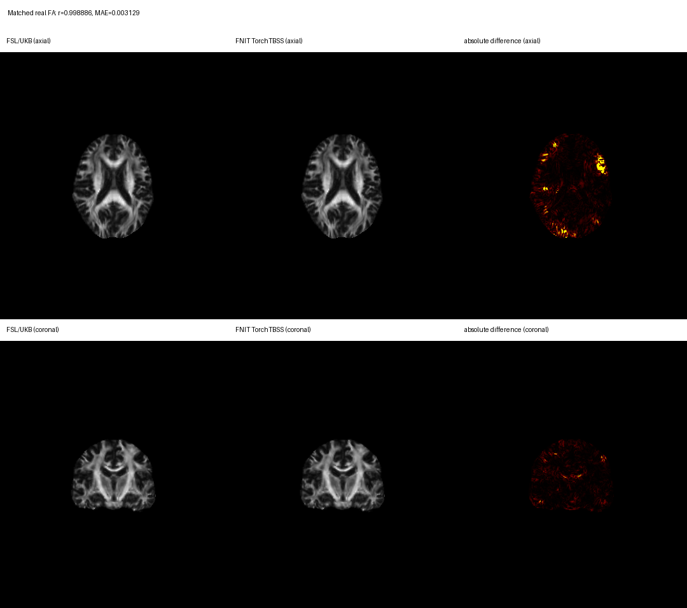

# TorchFNIRT

[返回首页](../../README.md) · [dMRI/TBSS pipeline](../dmri_pipeline/README.md)

`TorchFNIRT` 是 FNIT 对 FSL FNIRT 非线性配准核心的 PyTorch 实现。独立命令对应
FSL 6.0.7.4 的 `GM_2_MNI152GM_2mm.cnf` 灰质路径；dMRI pipeline 使用同一核心执行
UK Biobank 的 `oxford_s1.cnf` → `oxford_s2.cnf` → `oxford_s3.cnf` 三阶段 FA
配准。运行时不启动 FSL executable。

CUDA 默认允许 TF32 matmul 和 cuDNN，但图像和写出的 coefficient NIfTI 为 float32，优化器内部 coefficient state 和
主计算为 float64；不使用 float16 或 bfloat16。实际设置写入
`result.qc["tf32"]`。

## 独立命令行：灰质 FNIRT

```bash
python -m fnit.fnirt \
  --in subject_GM.nii.gz \
  --ref template_GM.nii.gz \
  --aff subject_GM_to_template_GM.mat \
  --cout subject_GM_to_template_GM_warp.nii.gz \
  --iout subject_GM_to_template_GM.nii.gz \
  --jout subject_GM_JAC_nl.nii.gz \
  --refmask MNI152_T1_2mm_brain_mask_dil.nii.gz \
  --config GM_2_MNI152GM_2mm.cnf \
  --device cuda:0
```

| 参数 | 输入或输出 | 作用 |
|---|---|---|
| `--in` | 输入 | 单张 3D moving 灰质概率图。 |
| `--ref` | 输入 | 单张 3D fixed 灰质模板；决定 `iout`/`jout` 的网格。 |
| `--aff` | 输入，可省略 | 4×4 FSL scaled-mm 矩阵，方向为 input → reference；省略时使用 FSL scaled-mm identity。 |
| `--refmask` | 输入 | reference 网格上的二值 mask；省略时从 `$FSLDIR/data/standard` 读取官方 mask。 |
| `--config` | 输入 | 只接受未经修改的 `GM_2_MNI152GM_2mm.cnf` 或该名称。 |
| `--cout` | 输出 | FSL intent-2007 cubic B-spline coefficient NIfTI；它不是 dense warp。 |
| `--iout` | 输出，可省略 | 原始 input 经 affine 和 nonlinear warp 后的 reference-grid 图像。 |
| `--jout` | 输出，可省略 | nonlinear-only Jacobian determinant，不含 FLIRT affine determinant。 |
| `--device` | 运行选项 | `cpu`、`cuda` 或 `cuda:N`；省略时优先 CUDA。 |
| `--overwrite` | 运行选项 | 允许替换已有输出；默认保护已有文件。 |

`cout` 总会写出。省略 `--cout` 时，输入 `subject_GM.nii.gz` 生成
`subject_GM_warpcoef.nii.gz`。不带扩展名的输出遵循 `FSLOUTPUTTYPE=NIFTI` 或
`NIFTI_GZ`。三个输出路径必须不同，也不能覆盖 input、reference、affine 或 mask。

等价的原软件调用形式是：

```bash
fnirt \
  --in=subject_GM.nii.gz \
  --ref=template_GM.nii.gz \
  --aff=subject_GM_to_template_GM.mat \
  --cout=subject_GM_to_template_GM_warp.nii.gz \
  --iout=subject_GM_to_template_GM.nii.gz \
  --jout=subject_GM_JAC_nl.nii.gz \
  --refmask=MNI152_T1_2mm_brain_mask_dil.nii.gz \
  --config=GM_2_MNI152GM_2mm.cnf
```

两条命令的参数角色和输出文件类型一致；`--device`、`--overwrite` 是 FNIT 选项。
当前验证尚未达到逐体素数值等价，因此这里的“等价调用”只表示接口与文件契约对应。

## Python：灰质 FNIRT

```python
from fnit.fnirt.standalone import run_fnirt

result = run_fnirt(
    input="subject_GM.nii.gz",  # 输入：待配准的 3D 个体 GM 概率图
    reference="template_GM.nii.gz",  # 输入：fixed GM 模板及输出网格
    affine="subject_GM_to_template_GM.mat",  # 输入：input -> reference 的 FSL scaled-mm 4x4 矩阵
    cout="subject_GM_to_template_GM_warp.nii.gz",  # 输出：intent-2007 B-spline coefficient NIfTI
    iout="subject_GM_to_template_GM.nii.gz",  # 输出：reference-grid warped GM
    jout="subject_GM_JAC_nl.nii.gz",  # 输出：仅 nonlinear warp 的 Jacobian determinant
    refmask="MNI152_T1_2mm_brain_mask_dil.nii.gz",  # 输入：reference-grid 二值 mask
    config="GM_2_MNI152GM_2mm.cnf",  # 配置：只支持该官方 GM 配置
    device="cuda:0",  # 运行设备：第一张 CUDA GPU
    overwrite=False,  # 写盘策略：不覆盖已有文件
)
```

`result` 是 `TorchFNIRTResult`：

| 属性 | shape/类型 | 含义 |
|---|---|---|
| `coefficient_image` | intent-2007 NIfTI | 与 `cout` 相同，可交给 FNIT `TorchApplyWarp`。 |
| `coefficients` | `[Cx,Cy,Cz,3]` NumPy array | cubic residual coefficient，不是 reference-grid dense displacement。 |
| `moved` | reference-grid `surfa.Volume` | 与 `iout` 相同。 |
| `nonlinear_jacobian` | reference-grid `surfa.Volume` | 与 `jout` 相同，排除 affine determinant。 |
| `full_pull_jacobian` | reference-grid `surfa.Volume` | 包含 affine 的完整 pull Jacobian；FSL `fnirt --jout` 不写这一项。 |
| `pull_transform` | `surfa.Warp` | reference → input 的 world-RAS pull transform。 |
| `qc` | `dict` | schedule、mask、优化、拓扑、设备、TF32 和数值验证状态。 |

## coefficient 和坐标定义

FLIRT `.mat` 不是 NIfTI world affine。设 `Vin`、`Vref` 是 input/reference voxel
到 FSL scaled-mm 的矩阵，`Win`、`Wref` 是 voxel-to-world affine，`A` 是
`--aff`，则 FNIT 传给配准器的 input → reference world-RAS affine 为：

```text
Wref · inverse(Vref) · A · Vin · inverse(Win)
```

`cout` 的 sform 保存 forward FLIRT affine；qform offset 保存 dense reference field
size；pixdim 保存 knot spacing；intent parameters 保存 dense field voxel size。展开系数
得到 residual `d` 后，FSL scaled-mm pull 关系为：

```text
x_input = inverse(A) · x_reference + d(x_reference)
```

因此 coefficient array 不能当作 `[X,Y,Z,3]` dense warp 使用。`jout` 定义为
`det(I + ∂d_nonlinear/∂x_reference)`。

## 当前实现与 FSL 对应关系

| FSL 行为 | 当前实现 |
|---|---|
| SPM-like mean normalization、float32 image scaling | 相同顺序实现 |
| implicit input/reference zero mask | 使用 `1e-16` 判零；reference mask 在归一化前建立，input mask 在 float32 归一化后建立 |
| warped input mask | 按 FSL `volume<char>` 语义，三线性插值后先截断为 char，再执行 `>0.5` |
| 有效 FOV 边界 | 使用 newimage 的 `1e-8` tolerance、原始 floor index 和 zero-padded neighbor |
| input masked smoothing 与 reference zero-padded Gaussian smoothing | 已实现 |
| cubic B-spline field、bending regularization、SSD-weighted lambda | 已实现 |
| LM stages | matrix-free analytic `JᵀJ` + FP64 PCG |
| `minmet=scg` stages | 按 MISCMATHS `sccngr` 更新顺序实现 |
| `inwarp`/`intin` process handoff | 在内存中执行 float32 coefficient/header、10 位 intensity 交接 |
| `FullResKsp` 与 `ZoomField` | 按每个进程最后 subsampling 计算 full-grid spacing |
| coefficient NIfTI | 输出 FSL intent 2007，shape、spacing、sform 契约已验证 |
| `ForceJacobianRange` | 已移植；外部逐步 topology oracle 仍未通过 |

独立 GM schedule 为 `subsampling=4,2,1,1`、`maxiter=5,5,10,5`、input FWHM
`6,4,2,2 mm`、reference FWHM `4,2,0,0 mm`、bending lambda
`150,75,50,30`、10 mm warp resolution，四层使用 LM。dMRI/TBSS schedule 见
[dMRI 页面](../dmri_pipeline/README.md#ukb-tbss-对应关系)。

## 当前真实数据 benchmark：TBSS 中的 TorchFNIRT

验证使用一例去标识、真实 UKB 格式 dMRI。FSL 和 FNIT 从同一组九张 native
DTI/NODDI 参数图开始。官方路径执行 weighted FLIRT、三个 FNIRT 进程、九次
`applywarp` 和 skeleton multiplication。A 是发布的默认路径
TorchFLIRT + TorchFNIRT；B 固定官方 FLIRT matrix，只隔离 TorchFNIRT 和后续传播。

| 运行 | affine | 观测时间 | peak CUDA allocation |
|---|---|---:|---:|
| FSL 6.0.7.4 / UKB CPU | FSL FLIRT | 976.88 s external wall | 不适用 |
| FNIT A / H100 | 本次重新运行 TorchFLIRT | 106.186 s Python pipeline；121.48 s external wall | 3.607 GB |
| FNIT B / H100 | 固定官方 FLIRT matrix | 18.884 s Python pipeline | 3.608 GB |

B 不包含 affine 优化，不能与 A 或官方端到端时间直接相除。A 的 TorchFLIRT 完成
8038 次 cost evaluation；三次运行都在共享节点上完成，负载未隔离。单独 stage 1
四层优化的 FSL CPU、Torch CPU 和 Torch GPU 时间分别为 57.62、56.54 和 7.503 s；
GPU peak allocation 为 3.229 GB。CUDA 使用默认 TF32，FNIRT solver 保持 FP64。

九张 standard 和 skeleton 图的 shape、affine、dtype 都与官方输出一致。Pearson `r`：

| map | A standard | A skeleton | B standard | B skeleton |
|---|---:|---:|---:|---:|
| FA | 0.998886 | 0.999463 | 0.999523 | 0.999679 |
| MD | 0.997129 | 0.997087 | 0.998712 | 0.994744 |
| L1 | 0.996619 | 0.997320 | 0.998438 | 0.994806 |
| L2 | 0.997222 | 0.997592 | 0.998738 | 0.995896 |
| L3 | 0.997640 | 0.997887 | 0.998937 | 0.996788 |
| MO | 0.996725 | 0.998206 | 0.998262 | 0.998889 |
| ICVF | 0.995086 | 0.996789 | 0.997483 | 0.994425 |
| OD | 0.997079 | 0.998257 | 0.998542 | 0.997927 |
| ISOVF | 0.997986 | 0.997748 | 0.999087 | 0.997208 |

A 的 standard FA MAE/RMSE 为 `0.003129/0.007914`，skeleton FA 为
`0.003111/0.005992`。B 的对应值为 `0.002418/0.005184` 和
`0.002422/0.004642`。A/B full-pull Jacobian 范围分别为
`0.239943–4.894929` 和 `0.237161–4.875982`；本例均未进入 topology projection。
完整逐图指标见
[`tbss_diagnosis.public.json`](../../validation/dmri_pipeline/tbss_diagnosis.public.json)。



图像和数值来自同一次 current A 运行。图的上行为轴位，下行为冠状位；灰度范围为
`0–1`，差值按完整非零 support 的 99.5 百分位显示。指标由完整 3D 图计算。

## Stage 1 LM oracle 与修复原因

固定官方 affine 后，FSL verbose trace 和 Torch 的 level-1 LM 使用相同 mask voxel
数和相同接受序列。FSL cost 只打印六位有效数字：

| point | Torch cost | FSL printed cost | mask voxels | decision |
|---:|---:|---:|---:|---|
| initial | 639.821722 | 639.822 | 2598 | initial |
| 1 | 525.149285 | 525.149 | 2540 | accept |
| 2 | 492.883311 | 492.883 | 2519 | accept |
| 3 | 481.481318 | 481.483 | 2499 | accept |
| 4 | 485.874090 | 485.885 | 2513 | reject |
| 5 | 485.869969 | 485.881 | 2513 | reject |
| 6 | 485.831044 | 485.842 | 2513 | reject |
| 7 | 485.663228 | 485.671 | 2513 | reject |
| 8 | 479.312016 | 479.320 | 2508 | accept |
| 9 | 479.583059 | 479.589 | 2503 | reject |
| 10 | 478.784565 | 478.784 | 2508 | accept |

FSL 在 `update_robjmask()` 中把二值 input mask 重采样到 `volume<char>`。边界的三线性
小数先被截断，再由 `Mask()` 执行 `>0.5`。当前实现先转换为 `char`，再执行
`>0.5`，从而排除相同的边界体素；同时匹配 newimage 的
`1e-8` valid-FOV tolerance、zero-padded boundary neighbor 和 implicit-zero
`1e-16` 比较顺序。

完整四层 stage 1 的 CPU coefficient `r=0.999832`、MAE `0.019687`；warped FA
`r=0.999004`、MAE `0.003580`。GPU 对应值为 `r=0.999879` 和 `r=0.999148`。
coefficient shape 均为 `[39,46,39,3]`。这组逐步结果支持 SSD、global-linear
intensity mapping、SSD-weighted lambda、LM damping/acceptance 和 spline basis
在该病例上的语义一致性。

后续 level 的 sparse BFMatrix/NEWMAT 与 matrix-free FP64 reduction 仍会产生小的
数值路径差异；三进程 handoff 在一个 Python 进程内模拟。topology projection 在本例
没有触发，当前验证也只有一例，因此仍保留
`fsl_fnirt_numerically_equivalent=false` 和 `ukb_tbss_numerically_equivalent=false`。
定向测试命令为
`pytest -q tests/fnirt tests/dmri_pipeline/test_dmri_pipeline.py`，结果为
`63 passed`。

## 支持范围与许可

独立 CLI 只支持一个 3D input/reference、可选 4×4 FLIRT affine、binary reference
mask 和官方 `GM_2_MNI152GM_2mm.cnf`。它不接受任意 FNIRT config、DCT basis、
quadratic spline、局部 intensity model 或通用 `--inwarp`。TBSS 的 Oxford schedule
只由 `TorchTBSS` 内部调用。

实现依据 FSL FNIRT 2203.0、basisfield 2203.1、miscmaths 2203.2、newimage
2203.11 和 warpfns 2203.0，受
[`FSL Software Licence, Release 6.0`](../../licenses/FSL-6.0.txt) 约束，仅用于该许可
允许的非商业用途。本项目不是官方 FSL 发布。上游版本、commit 和文件哈希见
[`_vendor_fsl`](../../src/fnit/_vendor_fsl/README.md)。
