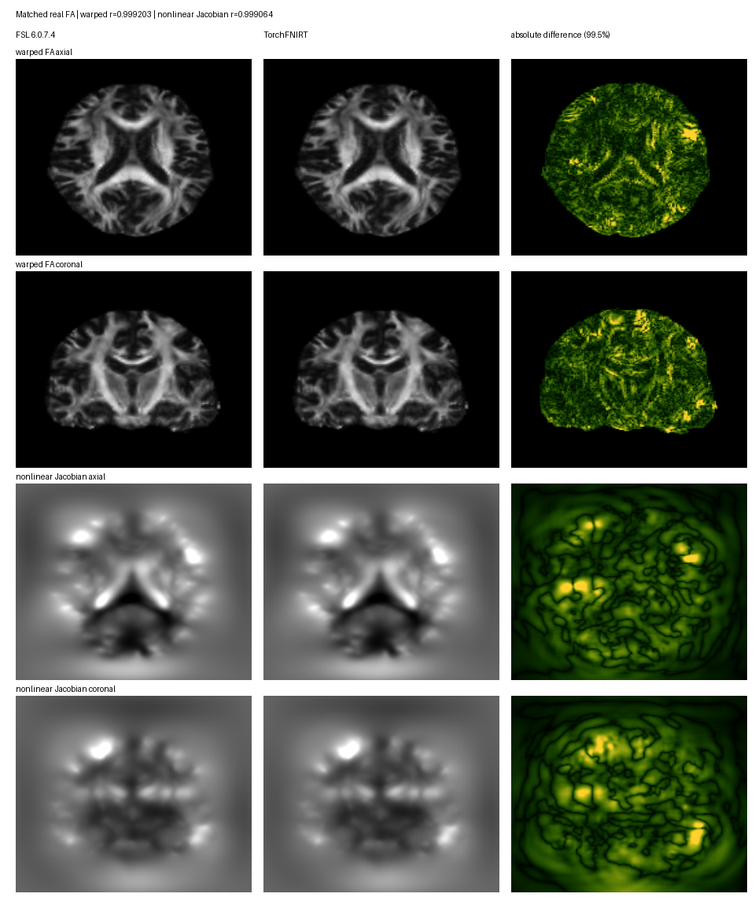

# TorchFNIRT：非线性配准

[返回首页](../../README.md) · [dMRI/TBSS pipeline](../dmri_pipeline/README.md)

`TorchFNIRT` 是 FNIT 的 PyTorch FNIRT 非线性配准核心。直接调用且不传配置时，
使用 FSL `fnirt` **不带 `--config`** 的参数默认值；GM、T1w 和 UKB TBSS
各有独立预设。FNIT 配准运行时不启动 FSL。

CUDA 默认允许 TF32 matmul 和 cuDNN，但图像和写出的 coefficient NIfTI 为 float32，优化器内部 coefficient state 和
主计算为 float64；不使用 float16 或 bfloat16。实际设置写入
`result.qc["tf32"]`。

## 选择预设

| 名称 | Python 配置 | 独立命令 `--config` | 流程默认入口 |
|---|---|---|---|
| `default` | `FNIRTConfig()` | 省略 `--config`，或写 `default` | 直接 `TorchFNIRT()`、`run_fnirt()` |
| `gm` | `GMFNIRTConfig()` | `gm` 或未修改的 `GM_2_MNI152GM_2mm.cnf` | FastVBM 灰质配准 |
| `t1` | `T1FNIRTConfig()` | `t1` 或未修改的 `T1_2_MNI152_2mm.cnf` | fMRI volume 的 T1→MNI |
| `tbss` | `TBSSFNIRTConfig()` | `tbss` | dMRI pipeline 的 UKB 三阶段 FA 配准 |

`default` 的各级参数已与 FSL 帮助及无配置运行日志核对：`subsamp=4,2,1,1`，
`miter=5,5,5,5`，`infwhm=6,4,2,2`，`reffwhm=4,2,0,0`，
`lambda=120,60,30,30`，`estint=1,1,1,0`，`applyrefmask=1,1,1,1`。
其余默认值为 `imprefm=1`、`impinm=1`、`warpres=10,10,10`、
`ssqlambda=1`、`jacrange=0.01,100`、`intmod=global_non_linear_with_bias`、
`intorder=5`、`biasres=50,50,50`、`biaslambda=10000`；固定使用三次 B 样条、
bending energy 正则化和线性重采样。[FSL 官方 FNIRT 参数说明](https://fsl.fmrib.ox.ac.uk/fsl/docs/registration/fnirt/user_guide.html)
解释各选项；参数匹配不代表形变和强度优化逐步数值等价。

fMRI 的默认值仍是 `t1`，TBSS 的默认值仍是 `tbss`；两条流程不会因为直接
`TorchFNIRT()` 改用 FSL 无配置默认值而换掉自己的配准 schedule。FastVBM 的默认
GM 配置与 `GMFNIRTConfig()` 一致，包括关闭两个隐式零值掩膜，详见
[FastVBM 掩膜说明](../fast_vbm/README.md#fnirt-gm-掩膜)。

## 配置与覆盖规则

Python 用 `dataclasses.replace` 更改单项参数，并把配置对象传给 `TorchFNIRT`、
`run_fnirt`、fMRI 的 `fnirt_config` 或 dMRI 的 `fnirt_config`。函数也接受上述四个
预设名称；fMRI 和 TBSS 未指定时分别选 `t1`、`tbss`。命令行覆盖选中的预设，
只接受已实现的 FNIRT 选项：

| 命令行选项 | `FNIRTConfig` 字段 | 输入规则 |
|---|---|---|
| `--subsamp`、`--miter` | `subsampling`、`maximum_iterations` | 各级逗号分隔整数 |
| `--infwhm`、`--reffwhm`、`--lambda` | `input_fwhm_mm`、`reference_fwhm_mm`、`regularization` | 各级逗号分隔数值；FWHM 单位 mm |
| `--estint`、`--applyrefmask` | `estimate_intensity`、`apply_reference_mask` | 各级逗号分隔的 0/1 |
| `--warpres`、`--biasres` | `warp_resolution_mm`、`bias_resolution_mm` | `x,y,z`，单位 mm；TBSS 的 `--warpres` 覆盖全部级别 |
| `--jacrange` | `jacobian_range` | 最小值、最大值 |
| `--intmod`、`--intorder` | `intensity_model`、`intensity_order` | 当前支持 `global_linear` 或 `global_non_linear_with_bias`；多项式阶数为 2–5 |
| `--biaslambda`、`--ssqlambda` | `bias_regularization`、`ssd_weighted_lambda` | 正则化数值、0/1 |
| `--imprefm`、`--impinm`、`--minmet` | `implicit_reference_mask`、`implicit_input_mask`、`minimization_methods` | 0/1、`lm` 或 `scg`；优化器可写各级列表 |

各级列表必须与所选预设的级数相同；更改级数时，需要同时给出对应的全部列表。
`--ssqlambda=0` 还须显式给出 `--lambda`，因为 FSL 的默认 λ 随该开关变化。
Python 配置另可设置 `process_stages` 和逐级 `warp_resolution_schedule_mm`。
未实现的 FSL 选项不会被默默忽略；独立命令不读取 `$FSLDIR` 中的 mask。

## 单次配准

### 命令行：无配置默认值

```bash
# --in：待变形的单张 3D 影像；--ref：目标 3D 影像和输出网格。
# --aff：input→reference 的 FSL scaled-mm 初始矩阵；省略时使用单位矩阵。
# --config：default 使用 FSL 不带配置文件的参数默认值。
# --cout：保存 FSL intent-2007 系数；--iout：保存目标网格上的变形图像。
# --device：选择 PyTorch 设备；省略时优先 CUDA。
python -m fnit.fnirt \
  --in moving.nii.gz --ref reference.nii.gz \
  --aff moving_to_reference.mat --config default \
  --cout warp_coeff.nii.gz --iout moving_in_reference.nii.gz \
  --device cuda:0
```

同一输入的原版 FSL 调用不传 `--config`：

```bash
# --in、--ref、--aff 分别是 moving、reference 和 input→reference 初始矩阵。
# --cout 写系数图，--iout 写 reference 网格上的 warped input。
fnirt --in=moving.nii.gz --ref=reference.nii.gz \
  --aff=moving_to_reference.mat \
  --cout=warp_coeff.nii.gz --iout=moving_in_reference.nii.gz
```

### 命令行：GM 专用预设

```bash
python -m fnit.fnirt \
  --in subject_GM.nii.gz \
  --ref template_GM.nii.gz \
  --aff subject_GM_to_template_GM.mat \
  --cout subject_GM_to_template_GM_warp.nii.gz \
  --iout subject_GM_to_template_GM.nii.gz \
  --jout subject_GM_JAC_nl.nii.gz \
  --refmask MNI152_T1_2mm_brain_mask_dil.nii.gz \
  --config GM_2_MNI152GM_2mm.cnf \
  --device cuda:0
```

| 参数 | 输入或输出 | 作用 |
|---|---|---|
| `--in` | 输入 | 单张 3D moving 灰质概率图或 T1 影像，与 `--config` 对应。 |
| `--ref` | 输入 | 单张 3D fixed 灰质或 T1 模板；决定 `iout`/`jout` 的网格。 |
| `--aff` | 输入，可省略 | 4×4 FSL scaled-mm 矩阵，方向为 input → reference；省略时使用 FSL scaled-mm identity。 |
| `--refmask` | 输入，GM/T1 必需 | reference 网格上的非空二值 mask；default/TBSS 可省略。 |
| `--config` | 输入 | `default`、`gm`、`t1`、`tbss`，或未修改的官方 GM/T1 `.cnf`；省略时使用 `default`。 |
| `--cout` | 输出 | FSL intent-2007 cubic B-spline coefficient NIfTI；它不是 dense warp。 |
| `--iout` | 输出，可省略 | 原始 input 经 affine 和 nonlinear warp 后的 reference-grid 图像。 |
| `--jout` | 输出，可省略 | nonlinear-only Jacobian determinant，不含 FLIRT affine determinant。 |
| `--device` | 运行选项 | `cpu`、`cuda` 或 `cuda:N`；省略时优先 CUDA。 |
| `--overwrite` | 运行选项 | 允许替换已有输出；默认保护已有文件。 |

`cout` 总会写出。省略 `--cout` 时，输入 `subject_GM.nii.gz` 生成
`subject_GM_warpcoef.nii.gz`。不带扩展名的输出遵循 `FSLOUTPUTTYPE=NIFTI` 或
`NIFTI_GZ`。三个输出路径必须不同，也不能覆盖 input、reference、affine 或 mask。

等价的原软件调用形式是：

```bash
fnirt \
  --in=subject_GM.nii.gz \
  --ref=template_GM.nii.gz \
  --aff=subject_GM_to_template_GM.mat \
  --cout=subject_GM_to_template_GM_warp.nii.gz \
  --iout=subject_GM_to_template_GM.nii.gz \
  --jout=subject_GM_JAC_nl.nii.gz \
  --refmask=MNI152_T1_2mm_brain_mask_dil.nii.gz \
  --config=GM_2_MNI152GM_2mm.cnf
```

两条命令的参数角色和输出文件类型一致；`--device`、`--overwrite` 是 FNIT 选项。
当前验证尚未达到逐体素数值等价，因此这里的“等价调用”只表示接口与文件契约对应。

### Python：GM 专用预设

```python
from fnit.fnirt.standalone import run_fnirt

result = run_fnirt(
    input="subject_GM.nii.gz",  # 输入：待配准的 3D 个体 GM 概率图
    reference="template_GM.nii.gz",  # 输入：fixed GM 模板及输出网格
    affine="subject_GM_to_template_GM.mat",  # 输入：input -> reference 的 FSL scaled-mm 4x4 矩阵
    cout="subject_GM_to_template_GM_warp.nii.gz",  # 输出：intent-2007 B-spline coefficient NIfTI
    iout="subject_GM_to_template_GM.nii.gz",  # 输出：reference-grid warped GM
    jout="subject_GM_JAC_nl.nii.gz",  # 输出：仅 nonlinear warp 的 Jacobian determinant
    refmask="MNI152_T1_2mm_brain_mask_dil.nii.gz",  # 输入：reference-grid 二值 mask
    config="gm",  # 配置：官方 GM 预设；也可传 GMFNIRTConfig() 或原配置名称
    device="cuda:0",  # 运行设备：第一张 CUDA GPU
    overwrite=False,  # 写盘策略：不覆盖已有文件
)
```

### Python 与命令行：T1w 专用预设

`T1FNIRTConfig` 采用官方 `T1_2_MNI152_2mm.cnf` 的六级采样、平滑、
形变正则化、五阶全局强度多项式和 50 mm 偏置场设置。以下是直接调用核心的例子；
fMRI volume 的完整入口见[T1→MNI 用法](../fmri/normalization.md)。

```python
import nibabel as nib
from fnit.flirt import TorchFLIRT
from fnit.fnirt import T1FNIRTConfig, TorchFNIRT

moving = nib.load("/absolute/path/T1_brain.nii.gz")  # 输入：同被试 3D 去脑 T1
fixed = nib.load("/absolute/path/MNI152_T1_2mm_brain.nii.gz")  # 输入：3D MNI 脑模板，决定输出网格
mask = nib.load("/absolute/path/MNI152_T1_2mm_brain_mask.nii.gz")  # 输入：模板同网格二值脑掩膜
linear = TorchFLIRT(device="cuda:0")(moving=moving, fixed=fixed)  # 初始 12 自由度 T1→MNI 配准
result = TorchFNIRT(device="cuda:0", config=T1FNIRTConfig())(
    moving=moving,  # 待变形的 T1 NIfTI
    fixed=fixed,  # 固定的 MNI NIfTI 与输出网格
    moving_to_fixed=linear.moving_to_fixed_world,  # 输入：T1→MNI 的 4×4 RAS-world 初始矩阵
    reference_mask=mask,  # 输入：只在模板网格的脑内估计配准
)
result.moved.save("/absolute/path/T1_in_MNI.nii.gz")  # 输出：MNI 网格重采样 T1
nib.save(result.coefficient_image, "/absolute/path/T1_to_MNI_coeff.nii.gz")  # 输出：FSL intent-2007 系数图
```

`result` 与上表的 `TorchFNIRTResult` 结构相同；`pull_transform` 是 MNI→T1
的 world-RAS 位移，可与 EPI→T1 BBR 合成，一次插值输出 BOLD。`qc["levels"]`
记录各级强度多项式、偏置场范围和偏置场 PCG 收敛情况。该分支在前五级形变优化前
拟合多项式与三次 B 样条偏置场，末级沿用上一结果；偏置场限制在 0.25–4 倍。
FSL 对强度、偏置和形变进行联合优化，因此这不是逐步数值等价的移植。
T1w 可用上述 Python API、fMRI volume 入口，或独立命令行：

```bash
# --in：待配准的单张去脑 T1。
# --ref：MNI 脑模板，同时决定输出图像网格。
# --aff：T1→MNI 的 FSL scaled-mm 初始矩阵。
# --refmask：与模板同网格的二值脑掩膜。
# --config：选择 T1w 六级配准和强度模型。
# --cout：写出 FSL intent-2007 形变系数。
# --iout：写出模板网格上的 T1 图像。
# --device：指定 PyTorch 计算设备。
python -m fnit.fnirt \
  --in T1_brain.nii.gz \
  --ref MNI152_T1_2mm_brain.nii.gz \
  --aff T1_to_MNI_affine.mat \
  --refmask MNI152_T1_2mm_brain_mask.nii.gz \
  --config T1_2_MNI152_2mm.cnf \
  --cout T1_to_MNI_coeff.nii.gz \
  --iout T1_in_MNI.nii.gz \
  --device cuda:0
```

`--aff` 是 FSL scaled-mm 的 T1→MNI 初始矩阵；`--refmask` 与 `--ref` 同网格；
`--cout` 写 intent-2007 系数，`--iout` 写模板网格的变形 T1。其余选项见上表。

同输入的原软件命令是：

```bash
flirt -in T1_brain.nii.gz -ref MNI152_T1_2mm_brain.nii.gz \
  -dof 12 -omat T1_to_MNI_affine.mat
fnirt --in=T1_brain.nii.gz --ref=MNI152_T1_2mm_brain.nii.gz \
  --aff=T1_to_MNI_affine.mat --refmask=MNI152_T1_2mm_brain_mask.nii.gz \
  --config=T1_2_MNI152_2mm.cnf --cout=T1_to_MNI_coeff.nii.gz \
  --iout=T1_in_MNI.nii.gz
```

## 输出结构与坐标

`run_fnirt` 和 `TorchFNIRT` 返回 `TorchFNIRTResult`：

| 属性 | shape/类型 | 含义 |
|---|---|---|
| `coefficient_image` | intent-2007 NIfTI | 与 `cout` 相同，可交给 FNIT `TorchApplyWarp`。 |
| `coefficients` | `[Cx,Cy,Cz,3]` NumPy array | cubic residual coefficient，不是 reference-grid dense displacement。 |
| `moved` | reference-grid `FNITNifti1Image` | 与 `iout` 相同。 |
| `nonlinear_jacobian` | reference-grid `FNITNifti1Image` | 与 `jout` 相同，排除 affine determinant。 |
| `full_pull_jacobian` | reference-grid `FNITNifti1Image` | 包含 affine 的完整 pull Jacobian；FSL `fnirt --jout` 不写这一项。 |
| `pull_transform` | `DenseWarp`（`nibabel.Nifti1Image` 子类） | reference → input 的 world-RAS 毫米位移场，保存 source/target geometry。 |
| `qc` | `dict` | schedule、mask、优化、拓扑、设备、TF32 和数值验证状态。 |

FLIRT `.mat` 不是 NIfTI world affine。设 `Vin`、`Vref` 是 input/reference voxel
到 FSL scaled-mm 的矩阵，`Win`、`Wref` 是 voxel-to-world affine，`A` 是
`--aff`，则 FNIT 传给配准器的 input → reference world-RAS affine 为：

```text
Wref · inverse(Vref) · A · Vin · inverse(Win)
```

`cout` 的 sform 保存 forward FLIRT affine；qform offset 保存 dense reference field
size；pixdim 保存 knot spacing；intent parameters 保存 dense field voxel size。展开系数
得到 residual `d` 后，FSL scaled-mm pull 关系为：

```text
x_input = inverse(A) · x_reference + d(x_reference)
```

因此 coefficient array 不能当作 `[X,Y,Z,3]` dense warp 使用。`jout` 定义为
`det(I + ∂d_nonlinear/∂x_reference)`。

## 算法对应与数值边界

| FSL 行为 | 当前实现 |
|---|---|
| SPM-like mean normalization、float32 image scaling | 相同顺序实现 |
| implicit input/reference zero mask | 使用 `1e-16` 判零；reference mask 在归一化前建立，input mask 在 float32 归一化后建立 |
| warped input mask | 按 FSL `volume<char>` 语义，三线性插值后先截断为 char，再执行 `>0.5` |
| 有效 FOV 边界 | 使用 newimage 的 `1e-8` tolerance、原始 floor index 和 zero-padded neighbor |
| input masked smoothing 与 reference zero-padded Gaussian smoothing | 已实现 |
| cubic B-spline field、bending regularization、SSD-weighted lambda | 已实现 |
| LM stages | matrix-free analytic `JᵀJ` + FP64 PCG |
| `minmet=scg` stages | 按 MISCMATHS `sccngr` 更新顺序实现 |
| `inwarp`/`intin` process handoff | 在内存中执行 float32 coefficient/header、10 位 intensity 交接 |
| `FullResKsp` 与 `ZoomField` | 按每个进程最后 subsampling 计算 full-grid spacing |
| coefficient NIfTI | 输出 FSL intent 2007，shape、spacing、sform 契约已验证 |
| `ForceJacobianRange` | 已移植；外部逐步 topology oracle 仍未通过 |

独立 GM schedule 为 `subsampling=4,2,1,1`、`maxiter=5,5,10,5`、input FWHM
`6,4,2,2 mm`、reference FWHM `4,2,0,0 mm`、bending lambda
`150,75,50,30`、10 mm warp resolution，四层使用 LM。dMRI/TBSS schedule 见
[dMRI 页面](../dmri_pipeline/README.md#ukb-tbss-对应关系)。

## 真实数据验证

### FSL 无配置默认值

同输入、同初始 FLIRT 矩阵的真实去脑 T1 对照见
[默认预设报告](../../validation/fnirt/default_preset_20260929.public.json)。该对照分别
运行不带 `--config` 的 FSL FNIRT 和 `--config default` 的 FNIT；验证报告记录
warped T1 脑内 Pearson r 0.9274、支持区 Dice 0.9884、coefficient Pearson r
0.8824，FNIT 配准与写出 14.91 s、GPU 峰值分配 0.992 GB。FSL CPU 进程
253.51 s，但写出可检查文件后退出状态为 255；这里只作条件性输出对照，不据此
比较速度。报告另记录输出网格、gzip/有限值检查和源码哈希。

### T1w 专用预设

真实去脑 T1 的同输入对照中，fMRI 配准入口对 FSL warped T1 的脑内相关为
0.9216，脑支持区 Dice 为 0.9825，MNI→T1 坐标差中位数 0.882 mm；FNIT
配准与重采样共 125.52 s，GPU 峰值分配 0.997 GB。独立 T1 CLI 使用同一输入、
模板、掩膜和 FSL 初始矩阵，输出图脑内相关为 0.9214，系数图 intent 为 2007，
网格、gzip 和有限值检查通过，进程耗时 33.65 s。两次 FNIT 入口的初始仿射
不同，不能直接比较耗时与形变。FSL FLIRT+FNIRT 的两段 CPU 时间合计 161.78 s，
参照进程写出文件后返回 255；运行环境未隔离，不据此排序。输入哈希、指标定义与
参照状态见[T1w 报告](../../validation/fmri/t1_fnirt_20260929.public.json)。fMRI volume
分支的 490 帧真实 BOLD 整链见[整链报告](../../validation/fmri/fmri_volume_fnirt_20260929.public.json)。

### TBSS/FA 专用预设的既有验证

2026 年 9 月 28 日在 gpucw1 上完成 1 例去标识化真实 UKB 格式 FA 的 matched-input
验证。FSL 6.0.7.4 和当时的 TorchFNIRT 候选使用完全相同的 preprocessed FA、
`FMRIB58_FA_1mm`、FSL scaled-mm affine、implicit zero mask 和
`oxford_s1/s2/s3.cnf` 参数。`dti_FA_mask` 只用于前一步 FLIRT 加权，两个 FNIRT
实现都不接收它。候选源码快照 tar SHA-256 为
`f7547d0a39ddd9fb6ba70deb720f229ecedc6385fa72d457efb2ded78b6c173d`，
`registration.py` 为
`a63ed0b09e43a5af4bf63b2f583e710b1d0fc73aac548a326c552334a741cd83`。
旧报告的包入口与 0.16.0 的
[源码等价分析](../../validation/runtime_dependencies/package_entry_source_equivalence.public.json)
只适用于当时注明的路径与版本；不把它当作本次预设改动的复测。
当次 FSL 参考重新执行三个进程；新旧官方 coefficient 和 warped FA 逐体素完全相同。

TorchFNIRT 在一个 Python 进程内执行相同的六层 schedule 和三次 process handoff。
比较范围为 coefficient 全数组、warped FA 两图非零并集，以及模板非零区内的两类
Jacobian：

| 输出 | 合同 | Pearson r | MAE | RMSE | 最大绝对误差 |
|---|---|---:|---:|---:|---:|
| cubic coefficient | shape/affine/float32/intent-2007 通过 | 0.999893 | 0.018804 | 0.038019 | 1.342859 |
| warped FA (`iout`) | shape/affine/float32 通过 | 0.999203 | 0.003795 | 0.006697 | 0.217295 |
| nonlinear Jacobian (`jout`) | shape/affine/float32 通过 | 0.999064 | 0.010260 | 0.016942 | 0.422846 |
| 含 affine 的完整 Jacobian | shape/affine/float32 通过 | 0.994737 | 0.037611 | 0.050840 | 0.613320 |

四类输出的文件合同均通过，但误差明显大于单纯浮点舍入；报告据此保留
`numerical_equivalence_passed=false`。该候选不能宣称与 FSL 逐体素数值等价，
同时也说明此前 raw-to-standard 结果不能只用上游输入分叉解释。普通 API 返回的
`qc["equivalence_status"]` 仍写“external numerical gate not passed”：该字段表示一次普通
调用不会自行启动外部 FSL oracle；本次独立报告已经执行外部 gate，结论仍为未达到数值等价。

| 运行 | 实测时间 | 内存 |
|---|---:|---:|
| TorchFNIRT / H100，同步优化核心 | 16.933 s | peak CUDA allocation 3.598 GB |
| TorchFNIRT / H100，进程外部 wall | 25.16 s | max CPU RSS 1,091,028 KiB |
| FSL stage 1 / CPU | 95.20 s | max RSS 794,696 KiB |
| FSL stage 2 / CPU | 795.08 s | max RSS 1,161,748 KiB |
| FSL stage 3 / CPU | 374.86 s | max RSS 1,180,244 KiB |
| FSL 三阶段合计 | 1265.14 s | 上表最大值 |
| FSL 三阶段加 full-affine Jacobian utility | 1273.20 s | max RSS 1,180,244 KiB |

Torch 启动时物理 GPU 0 利用率为 0%，但同卡常驻进程已占 48,310 MiB，余
32,697 MiB。FSL 启动时主机 load average 为 94.86/89.93/88.62。两个计时都不是隔离
benchmark，而且候选为单进程、FSL 为三进程，因此不发布加速比；机器报告保留观测 wall
比值供复核。



完整 3D 指标、输入和配置 SHA-256、12 个源码 SHA-256、命令、环境、计时和显存见
[`report.real.current.json`](../../validation/fnirt/report.real.current.json)。候选执行脚本为
[`run_current_matched.py`](../../validation/fnirt/run_current_matched.py)，官方参考脚本为
[`run_official_matched.sh`](../../validation/fnirt/run_official_matched.sh)，报告生成脚本为
[`validate_real_current.py`](../../validation/fnirt/validate_real_current.py)。仓库不保存原始 FA
或受试者标识。

当时的候选源码还完成了从 raw AP/PA 开始的
[TBSS 端到端单例](../../validation/dmri_pipeline/tbss_e2e.real.current.json)。九张 standard
与九张 skeleton 图的网格和 dtype 合同通过，但上游 native 参数图已经分叉，整条流程数值
等价失败；该 444.93 s wall time 受同卡 100% 训练任务影响，也不用于加速比。

## 支持范围与许可

独立 CLI 支持一个 3D input/reference、可选 4×4 FLIRT affine、显式 binary reference
mask，以及上表四种预设和已实现参数的覆盖。传入官方 GM/T1 配置文件路径时，
先核对文件 SHA-256；不支持任意 `.cnf`、DCT basis、quadratic spline、局部
intensity model 或通用 `--inwarp`。TBSS 预设在直接配准时可选，dMRI pipeline
仍负责 weighted FLIRT 与九张参数图传播。

实现依据 FSL FNIRT 2203.0、basisfield 2203.1、miscmaths 2203.2、newimage
2203.11 和 warpfns 2203.0，受
[`FSL Software Licence, Release 6.0`](../../licenses/FSL-6.0.txt) 约束，仅用于该许可
允许的非商业用途。本项目不是官方 FSL 发布。上游版本、commit 和文件哈希见
[`_vendor_fsl`](../../src/fnit/_vendor_fsl/README.md)。
