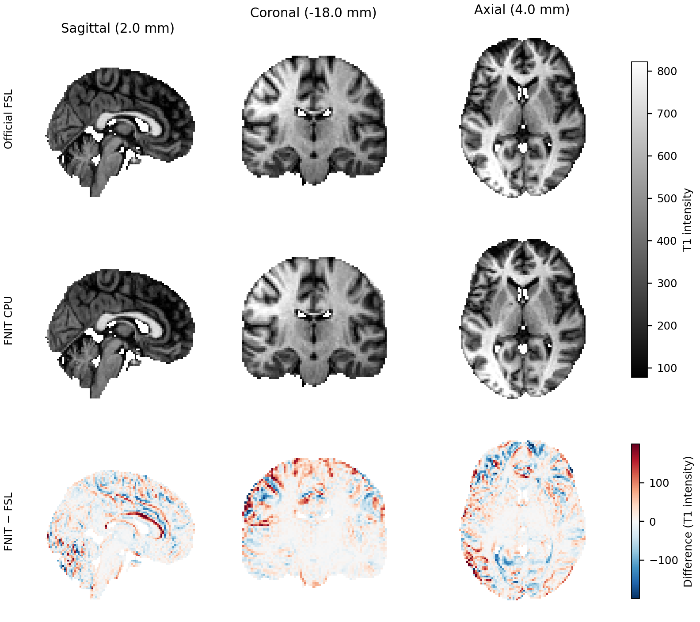
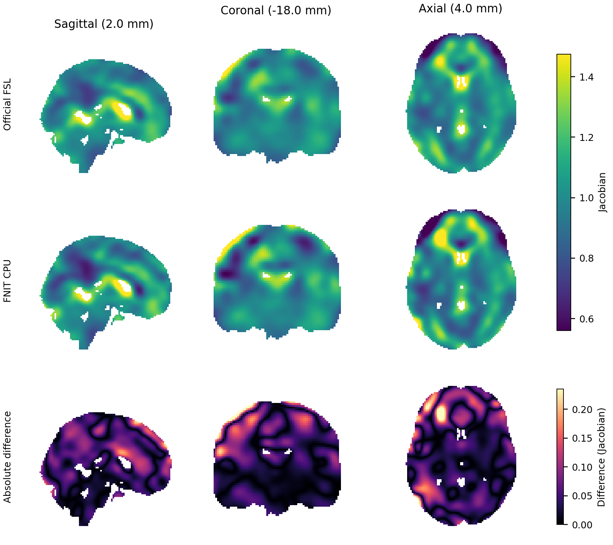

# TorchFNIRT：非线性配准

| 项目 | 内容 |
|---|---|
| 输入 | 3D个体/参考影像、可选FLIRT初值及参考掩膜 |
| 输出 | FSL样条系数、目标图像、Jacobian和QC |
| 对应原软件 | FSL fnirt；default/gm/t1/tbss预设 |
| Python / CLI | run_fnirt、TorchFNIRT / fnit fnirt、fnit-fnirt |
| CPU / GPU | CPU或CUDA；样条和求解器保留FP64 |

## 1. 功能简介

`TorchFNIRT` 是 FNIT 的 PyTorch FNIRT 非线性配准核心。直接调用且不传配置时，
使用 FSL `fnirt` **不带 `--config`** 的参数默认值；GM、T1w 和 UKB TBSS
各有独立预设。FNIT 配准运行时不启动 FSL。

CUDA 默认允许 TF32 matmul 和 cuDNN，但图像和写出的 coefficient NIfTI 为 float32，优化器内部 coefficient state 和
主计算为 float64；不使用 float16 或 bfloat16。实际设置写入
`result.qc["tf32"]`。

## 2. Python 调用

```python
from fnit.fnirt.standalone import run_fnirt

moving_image_path = "/data/T1_brain.nii.gz"  # 个体3D去脑T1
reference_image_path = "/data/MNI152_T1_2mm_brain.nii.gz"  # 目标模板
reference_mask_path = "/data/MNI152_brain_mask.nii.gz"  # 模板同网格二值掩膜
forward_matrix_path = "/data/T1_to_MNI.mat"  # input→reference的FLIRT scaled-mm初值
coefficient_output_path = "/data/T1_to_MNI_coeff.nii.gz"  # FSL intent-2007系数
registered_output_path = "/data/T1_in_MNI.nii.gz"  # 完整目标网格影像
nonlinear_result = run_fnirt(
    input=moving_image_path, reference=reference_image_path,
    affine=forward_matrix_path, refmask=reference_mask_path,
    cout=coefficient_output_path, iout=registered_output_path,
    config="t1", device="cuda:0",  # 完整T1六级预设
)
```

### 输入数据格式

input/reference为单张有限3D NIfTI；reference决定输出shape、affine和空间。affine为input→reference的FLIRT scaled-mm矩阵，省略为identity；refmask必须同参考网格，GM/T1预设必需。GM输入是灰质概率图，TBSS输入是FA；不能以改预设替代输入预处理。

| 名称 | Python 配置 | 独立命令 `--config` | 流程默认入口 |
|---|---|---|---|
| `default` | `FNIRTConfig()` | 省略 `--config`，或写 `default` | 直接 `TorchFNIRT()`、`run_fnirt()` |
| `gm` | `GMFNIRTConfig()` | `gm` 或未修改的 `GM_2_MNI152GM_2mm.cnf` | FastVBM 灰质配准 |
| `t1` | `T1FNIRTConfig()` | `t1` 或未修改的 `T1_2_MNI152_2mm.cnf` | fMRI volume 的 T1→MNI |
| `tbss` | `TBSSFNIRTConfig()` | `tbss` | dMRI pipeline 的 UKB 三阶段 FA 配准 |

### 输入参数

| 参数 | 必需 | 类型 | 默认值 | 含义 |
|---|---|---|---|---|
| `input` | 是 | 路径 / NIfTI | 无 | 待处理影像，网格与空间由 NIfTI affine 定义。 |
| `reference` | 是 | 路径 / NIfTI / None | 无 | 参考图；决定输出空间、shape、affine。 |
| `affine` | 否 | 路径 / (4,4)数组 / None | `None` | source/input→reference的 FSL scaled-mm 矩阵。 |
| `cout` | 否 | 路径 / None | `None` | FSL intent-2007 系数；未给时默认<input>_warpcoef。 |
| `iout` | 否 | 路径 / None | `None` | reference网格上的重采样图。 |
| `jout` | 否 | 路径 / None | `None` | 仅非线性形变的无量纲Jacobian。 |
| `refmask` | 否 | 路径 / NIfTI / None | `None` | reference同网格二值掩膜；GM/T1预设必需。 |
| `config` | 否 | 配置对象 / str / None | `None` | 本功能配置或预设；接受范围见本页。 |
| `device` | 否 | str / torch.device / None | `None` | 计算设备；显式 CUDA 不可用时报错。 |
| `execution` | 否 | str | `'optimized'` | 执行策略；本页说明实际支持值。 |
| `overwrite` | 否 | bool | `False` | 是否覆盖已有结果，默认保护原文件。 |

### 配置参数

| 参数 | 必需 | 类型 | 默认值 | 含义 |
|---|---|---|---|---|
| `subsampling` | 否 | tuple[int, ...] | `(4, 2, 1, 1)` | 每层降采样倍数。 |
| `maximum_iterations` | 否 | tuple[int, ...] | `(5, 5, 5, 5)` | 每层最大迭代/接受步数。 |
| `input_fwhm_mm` | 否 | tuple[float, ...] | `(6.0, 4.0, 2.0, 2.0)` | 输入每层Gaussian FWHM，mm。 |
| `reference_fwhm_mm` | 否 | tuple[float, ...] | `(4.0, 2.0, 0.0, 0.0)` | 参考每层FWHM，mm。 |
| `regularization` | 否 | tuple[float, ...] | `(120.0, 60.0, 30.0, 30.0)` | 各层形变正则化权重。 |
| `estimate_intensity` | 否 | tuple[bool, ...] | `(True, True, True, False)` | 各层是否估计强度模型。 |
| `apply_reference_mask` | 否 | tuple[bool, ...] | `(True,) * 4` | 各层是否使用参考掩膜。 |
| `minimization_methods` | 否 | tuple[str, ...] / None | `None` | 各层lm/scg；None沿用预设。 |
| `process_stages` | 否 | tuple[int, ...] / None | `None` | TBSS多阶段交接编号；None为普通流程。 |
| `implicit_reference_mask` | 否 | bool | `True` | 参考零值是否隐式排除。 |
| `implicit_input_mask` | 否 | bool | `True` | 输入零值是否隐式排除。 |
| `warp_resolution_mm` | 否 | tuple[float, float, float] | `(10.0, 10.0, 10.0)` | 控制点分辨率，mm。 |
| `warp_resolution_schedule_mm` | 否 | tuple[tuple[float, float, float], ...] / None | `None` | 逐层控制点分辨率，None沿用固定值。 |
| `jacobian_range` | 否 | tuple[float, float] | `(0.01, 100.0)` | Jacobian允许范围。 |
| `ssd_weighted_lambda` | 否 | bool | `True` | 正则化是否乘SSD。 |
| `intensity_model` | 否 | str | `'global_non_linear_with_bias'` | global_linear或global_non_linear_with_bias。 |
| `intensity_order` | 否 | int | `5` | 多项式系数个数，最高次数为本值减1。 |
| `bias_resolution_mm` | 否 | tuple[float, float, float] | `(50.0, 50.0, 50.0)` | 偏置场控制点分辨率，mm。 |
| `bias_regularization` | 否 | float | `10000.0` | 偏置场正则权重。 |

T1/GM/TBSS覆写对应层数、平滑、正则、强度及掩膜设置；[全部预设的具体数值与覆盖规则](../../validation/fnirt/readme_archive_20261005.md#选择预设)。逐层列表长度须与预设一致。intensity_order为系数个数；5对应常数至四次项。`TorchFNIRT`使用world-RAS初值，直接调用参数见[源码入口](../../src/fnit/fnirt/registration.py)；不要将其初值与run_fnirt的scaled-mm矩阵混用。

### 输出

```text
/data/
├── T1_to_MNI_coeff.nii.gz
└── T1_in_MNI.nii.gz
```

`run_fnirt` 和 `TorchFNIRT` 返回 `TorchFNIRTResult`：

| 属性 | shape/类型 | 含义 |
|---|---|---|
| `coefficient_image` | intent-2007 NIfTI | 与 `cout` 相同，可交给 FNIT `TorchApplyWarp`。 |
| `coefficients` | `[Cx,Cy,Cz,3]` NumPy array | cubic residual coefficient，不是 reference-grid dense displacement。 |
| `moved` | reference-grid `FNITNifti1Image` | 与 `iout` 相同。 |
| `nonlinear_jacobian` | reference-grid `FNITNifti1Image` | 与 `jout` 相同，排除 affine determinant。 |
| `full_pull_jacobian` | reference-grid `FNITNifti1Image` | 包含 affine 的完整 pull Jacobian；FSL `fnirt --jout` 不写这一项。 |
| `pull_transform` | `DenseWarp`（`nibabel.Nifti1Image` 子类） | reference → input 的 world-RAS 毫米位移场，保存 source/target geometry。 |
| `qc` | `dict` | schedule、mask、优化、拓扑、设备、TF32 和数值验证状态。 |

FLIRT `.mat` 不是 NIfTI world affine。设 `Vin`、`Vref` 是 input/reference voxel
到 FSL scaled-mm 的矩阵，`Win`、`Wref` 是 voxel-to-world affine，`A` 是
`--aff`，则 FNIT 传给配准器的 input → reference world-RAS affine 为：

```text
Wref · inverse(Vref) · A · Vin · inverse(Win)
```

`cout` 的 sform 保存 forward FLIRT affine；qform offset 保存 dense reference field
size；pixdim 保存 knot spacing；intent parameters 保存 dense field voxel size。展开系数
得到 residual `d` 后，FSL scaled-mm pull 关系为：

```text
x_input = inverse(A) · x_reference + d(x_reference)
```

因此 coefficient array 不能当作 `[X,Y,Z,3]` dense warp 使用。`jout` 定义为 `det(I + ∂d_nonlinear/∂x_reference)`。

NIfTI结果以float32写出，moved和两类Jacobian的shape为reference.shape，affine来自reference；Jacobian无量纲。系数为(Cx,Cy,Cz,3)，不是dense场；pull_transform为reference→input的world-RAS毫米位移。

### 算法对应与数值边界

| FSL 行为 | 当前实现 |
|---|---|
| SPM-like mean normalization、float32 image scaling | 相同顺序实现 |
| implicit input/reference zero mask | 使用 `1e-16` 判零；reference mask 在归一化前建立，input mask 在 float32 归一化后建立 |
| warped input mask | 按 FSL `volume<char>` 语义，三线性插值后先截断为 char，再执行 `>0.5` |
| 有效 FOV 边界 | 使用 newimage 的 `1e-8` tolerance、原始 floor index 和 zero-padded neighbor |
| input masked smoothing 与 reference zero-padded Gaussian smoothing | 已实现 |
| cubic B-spline field、bending regularization、SSD-weighted lambda | 已实现 |
| LM stages | matrix-free analytic `JᵀJ` + FP64 PCG |
| T1 强度映射 | 5 系数全局多项式、B 样条乘性偏置场与形变联合进入 LM 法方程；强度关闭的末级固定上一层参数 |
| `minmet=scg` stages | 按 MISCMATHS `sccngr` 更新顺序实现 |
| `inwarp`/`intin` process handoff | 在内存中执行 float32 coefficient/header、10 位 intensity 交接 |
| `FullResKsp` 与 `ZoomField` | 按每个进程最后 subsampling 计算 full-grid spacing |
| coefficient NIfTI | 输出 FSL intent 2007，shape、spacing、sform 契约已验证 |
| `ForceJacobianRange` | 已移植；外部逐步 topology oracle 仍未通过 |

独立 GM schedule 为 `subsampling=4,2,1,1`、`maxiter=5,5,10,5`、input FWHM
`6,4,2,2 mm`、reference FWHM `4,2,0,0 mm`、bending lambda
`150,75,50,30`、10 mm warp resolution，四层使用 LM。dMRI/TBSS schedule 见
[dMRI 页面](../dmri_pipeline/README.md#ukb-tbss-对应关系)。

### CPU 平滑方向候选与验证（2026-10-04）

成熟子函数的首差定位发现：NEWIMAGE 读取 affine 行列式为正的 NIfTI 时先在内部翻转 X，再按该方向累计 FP32 Gaussian 卷积；FNIT CPU 在 nibabel 数组原方向累计，产生末位差。隔离候选分别检查 moving 和 template 的实际 affine，必要时翻转 X、调用原平滑函数、再翻回；隐式 moving mask 同步翻转。候选保留影像网格、header、thread budget 和原 CUDA 分支，FP64 coefficients、gradient、solver 和 objective 未降低精度。

同一真实官方 GM 的完整 `224×288×288` 平滑图中，原 CPU 最大差 `3.8147e-5`（归一化强度）；按内部方向累计后与官方逐值相同。但固定官方 GM/FLIRT/template/mask 的完整 CPU 配对中，warped GM 脑区 RMSE 从 `0.020061` 增至 `0.031622`，非线性 Jacobian 从 `0.013270` 增至 `0.020135`，用时从 `365.786` 增至 `422.257 s`。因此未采纳候选，默认源码保持原路径；独立 patch、完整 QC 和脑图见[阶段报告](../../validation/smri_cpu/fnirt_cpu_orientation_20261004/README.md)。首次接受更新及共享系数网格转换的证据另见[首差诊断](../../validation/smri_cpu/fnirt_first_diff_20261004/README.md)。完整 nonlinear estimation 仍未通过官方等价门。

### GPU 执行方式

`TorchFNIRT(..., execution="optimized")`、`run_fnirt(..., execution="optimized")` 与 CLI `--execution optimized` 默认启用：

- 每个方向一个 Gaussian kernel，保留官方零填充、核生成和每个偏移赋值回 float32 的舍入顺序。未安装 Triton 时自动使用原张量平滑。
- PCG 每轮合并分母与残差标量的 GPU→CPU 传输；每轮仍检查相同停止条件，无效分母不接受试算更新，不跳过迭代检查。
- 缓存分辨率层内的 affine 网格、固定张量类型转换和 bending diagonal。
- bending Hessian 在系数空间计算 `BᵀB` 的三个方向 Gram 乘积，避免每轮展开六张全网格导数场；energy 保留原 dense 算法及求和顺序。

本轮继续减少重复计算：只在需要导数时计算 trilinear 梯度；T1 联合 linearization 复用已算好的强度多项式和 bias；每次联合 PCG matvec 只展开一次 FP64 形变增量，图像线性项仍按原路径转换为 FP32。上述三个改动保留原浮点运算和求和顺序，按冻结 optimized 基线逐位验证。

`execution="reference"` 保留逐偏移平滑、逐标量 PCG 主机判断和 dense bending Hessian，用于检查执行改动。两条路径都采用修正后的 header `pixdim`、相同 cubic spline、SSD、强度模型、LM/SCG、PCG 容差、Jacobian 约束和配置。Gram 改变 FP64 求和顺序，不能称为逐 bit 相同；固定 FSL basisfield oracle 和真实 T1 配对用于验收。

图像与插值为 float32；系数、法方程、Gram、PCG、强度模型及关键归约保留 float64。不使用 FP16/BF16。GPU 默认允许 TF32，不降低 FP64 算子的精度。上述优化使用主页环境已有的 PyTorch/Triton，无新增编译依赖，也不启动 FSL。对应原软件没有 `--execution` 或 `--device` 选项。

### CPU 执行方式

`device="cpu", execution="optimized"` 使用设备对应的保序平滑、弯曲能量、角点筛选和法方程缓冲。空间法方程在每次线性化时固定权重布局，PCG 中按原 FP64 运算顺序处理八个体素；尾部、非连续布局和非有限值块使用原标量算式。函数遵循调用方的 CPU 线程预算，不自行修改全局线程数。没有新增运行依赖，CPU helper 使用主页环境已有的 Numba；CUDA、需要梯度的 CPU 张量和 `execution="reference"` 保留各自路径。布局内存、逐位门槛、真实精度及速度见 [CPU 专页](CPU_BENCHMARK.md)。

最新 v27 的 CPU 采样合并图像值、FOV 判定与所需梯度，SCG 梯度跳过未使用的代价计算；原插值舍入、真实 cost、有效 lambda 和 CUDA 路径保持原方式。当前组合源 v28 保留该注册器和采样 helper 的相同 SHA。[完整真实 SCG 阶段检查](CPU_BENCHMARK.md#v27-的完整-scg-阶段检查)记录了输出与迭代轨迹的逐位一致性；[完整功能报告](assets/cpu-functional-v27-node8-20261004.public.json)包含 13 项预设/参数分支在 1/8 线程预算的 26 项完整输出检查及八项新官方配对。

## 3. 命令行调用

```bash
# --in：待变形的单张 3D 影像；--ref：目标 3D 影像和输出网格。
# --aff：input→reference 的 FSL scaled-mm 初始矩阵；省略时使用单位矩阵。
# --config：default 使用 FSL 不带配置文件的参数默认值。
# --cout：保存 FSL intent-2007 系数；--iout：保存目标网格上的变形图像。
# --device：选择 PyTorch 设备；省略时优先 CUDA。
python -m fnit.fnirt \
  --in moving.nii.gz --ref reference.nii.gz \
  --aff moving_to_reference.mat --config default \
  --cout warp_coeff.nii.gz --iout moving_in_reference.nii.gz \
  --device cuda:0
```

| 命令行选项 | `FNIRTConfig` 字段 | 输入规则 |
|---|---|---|
| `--subsamp`、`--miter` | `subsampling`、`maximum_iterations` | 各级逗号分隔整数 |
| `--infwhm`、`--reffwhm`、`--lambda` | `input_fwhm_mm`、`reference_fwhm_mm`、`regularization` | 各级逗号分隔数值；FWHM 单位 mm |
| `--estint`、`--applyrefmask` | `estimate_intensity`、`apply_reference_mask` | 各级逗号分隔的 0/1 |
| `--warpres`、`--biasres` | `warp_resolution_mm`、`bias_resolution_mm` | `x,y,z`，单位 mm；TBSS 的 `--warpres` 覆盖全部级别 |
| `--jacrange` | `jacobian_range` | 最小值、最大值 |
| `--intmod`、`--intorder` | `intensity_model`、`intensity_order` | 当前支持 `global_linear` 或 `global_non_linear_with_bias`；后者的 `intorder` 为系数个数 2–5，最高次数为 `intorder−1` |
| `--biaslambda`、`--ssqlambda` | `bias_regularization`、`ssd_weighted_lambda` | 正则化数值、0/1 |
| `--imprefm`、`--impinm`、`--minmet` | `implicit_reference_mask`、`implicit_input_mask`、`minimization_methods` | 0/1、`lm` 或 `scg`；优化器可写各级列表 |

各级列表必须与所选预设的级数相同；更改级数时，需要同时给出对应的全部列表。
`--ssqlambda=0` 还须显式给出 `--lambda`，因为 FSL 的默认 λ 随该开关变化。
Python 配置另可设置 `process_stages` 和逐级 `warp_resolution_schedule_mm`。

基础参数`--in/--ref/--aff/--cout/--iout/--jout/--refmask/--config/--device/--execution/--overwrite`逐项对应`input/reference/affine/cout/iout/jout/refmask/config/device/execution/overwrite`。配置覆盖项只接受上表已实现参数；GM/T1掩膜必须显式给出。

## 4. 原软件调用

同一输入的原版 FSL 调用不传 `--config`：

```bash
# --in、--ref、--aff 分别是 moving、reference 和 input→reference 初始矩阵。
# --cout 写系数图，--iout 写 reference 网格上的 warped input。
fnirt --in=moving.nii.gz --ref=reference.nii.gz \
  --aff=moving_to_reference.mat \
  --cout=warp_coeff.nii.gz --iout=moving_in_reference.nii.gz
```

等价的原软件调用形式是：

```bash
fnirt \
  --in=subject_GM.nii.gz \
  --ref=template_GM.nii.gz \
  --aff=subject_GM_to_template_GM.mat \
  --cout=subject_GM_to_template_GM_warp.nii.gz \
  --iout=subject_GM_to_template_GM.nii.gz \
  --jout=subject_GM_JAC_nl.nii.gz \
  --refmask=MNI152_T1_2mm_brain_mask_dil.nii.gz \
  --config=GM_2_MNI152GM_2mm.cnf
```

两条命令的参数角色和输出文件类型一致；`--device`、`--execution`、`--overwrite` 是 FNIT 选项。
当前验证尚未达到逐体素数值等价，因此这里的“等价调用”只表示接口与文件契约对应。

同输入的原软件命令是：

```bash
flirt -in T1_brain.nii.gz -ref MNI152_T1_2mm_brain.nii.gz \
  -dof 12 -omat T1_to_MNI_affine.mat
fnirt --in=T1_brain.nii.gz --ref=MNI152_T1_2mm_brain.nii.gz \
  --aff=T1_to_MNI_affine.mat --refmask=MNI152_T1_2mm_brain_mask.nii.gz \
  --config=T1_2_MNI152_2mm.cnf --cout=T1_to_MNI_coeff.nii.gz \
  --iout=T1_in_MNI.nii.gz
```

## 5. 最新精度和运行时间

2026-10-04正式CPU对照绑定v27，组合源v28保留其注册器/采样SHA；官方FSL6.0.7.4，Intel Xeon Gold6418H、1/8线程预算，四种预设各1例完整观察（不是队列）。float32图像/输出，float64系数/法方程。

| 完整预设 | 线程上限 | 原版完整进程 | FNIT 完整进程 | FNIT 已导入 API（含读写） | 脑掩膜内 iout Pearson r | Jacobian MAE |
|---|---:|---:|---:|---:|---:|---:|
| default | 1 | 181.04 s | 149.12 s | 146.56 s | 0.956660 | 0.050896 |
| default | 8 | 172.21 s | 57.68 s | 55.67 s | 0.955977 | 0.051218 |
| T1 六级 | 1 | 224.02 s | 293.71 s | 291.49 s | 0.999078 | 0.008707 |
| T1 六级 | 8 | 221.80 s | 169.21 s | 166.93 s | 0.999243 | 0.008490 |
| TBSS 六级/三阶段 | 1 | 836.24 s | 795.22 s | 793.07 s | 0.999704 | 0.011844 |
| TBSS 六级/三阶段 | 8 | 831.94 s | 400.19 s | 398.29 s | 0.999032 | 0.019836 |
| GM 四级/末级 SCG | 1 | 548.11 s | 143.57 s | 141.42 s | 0.970540 | 0.029834 |
| GM 四级/末级 SCG | 8 | 556.22 s | 63.28 s | 60.73 s | 0.973537 | 0.028395 |

七项观察快于官方，T1单核仍较慢；原版与FNIT优化轨迹存在差异。完整进程含启动、导入、读写；已加载API另列。[正式来源和源码SHA](assets/cpu-primary-v27-node8-20261004.public.json)。

### 分步骤 benchmark

| 阶段 | FNIT | FSL |
|---|---|---|
| T1六级法方程乘积 | 独立instrumented累计158.905s；API362.182s，不能与正式总时钟相加 | 未记录 |
| TBSS完整六级/三阶段GPU API | v28两组14.854/14.102s；peak3,565,562,368B | 本轮未测GPU |

GPU为共享H100、TF32、20GB上限，完整TBSS保存16次，与FNIT基线1d31e7b逐位一致，不是本轮FSL等价对照。[GPU报告](../../validation/multimodal_cpu_20261004/gpu_cpu_final_v28_ready_retry_20261004.public.json)。





公开ds000114 CC0脑图绑定v27 CPU8，分别展示重采样T1和非线性Jacobian；[图示范围/SHA](assets/cpu-public-v27-node8/figures.public.json)。

## 6. 最近版本和 benchmark

| 日期 | 更新与验收 |
|---|---|
| 2026-10-04，最新 v27/v28 | CPU float32 采样的值、FOV 和梯度融合；SCG 梯度跳过未使用的能量/cost。83 项采样专项、33 项 SCG 专项和[完整真实末阶段轨迹](assets/cpu-scg-cost-skip-stage3-node8-20261004.public.json)通过；CPU评测节点 [26 项完整功能输出检查](assets/cpu-functional-v27-node8-20261004.public.json)及[八项新官方单次配对](assets/cpu-primary-v27-node8-20261004.public.json)完成，T1 单线程未达速度目标。H100 default 和完整 TBSS 各 16 次保存逐位相同、对应位置 allocation 不增加。 |
| 2026-10-04，normal SIMD v2 | FP64 空间法方程按原运算顺序执行八点 SIMD；105 项局部回归通过，完整 default/T1 的输出 SHA、停止条件和 PCG 计数保持一致。CPU评测节点 的四项完整官方单次配对见[历史报告](assets/cpu-default-t1-normal-simd-v2-20261004.public.json)。 |
| 2026-10-04 | CPU Gaussian 合并 offset 循环，bending 保留 dense 展开/原 sum 并融合逐元素乘方，FP64 法方程缓冲/固定 weight 布局复用，Jacobian limiter 保序筛选角点。216 项函数专项通过；v17/v19/v20 在完整公开 default 的 1/8 预算三输出 SHA 一致。最新 CPU 官方观测与 GPU 门槛见[专页](CPU_BENCHMARK.md)。 |
| 2026-10-02 | 跳过无用插值梯度、T1 强度映射复用、联合 PCG 增量场复用；三种预设在完整 pipeline 中实际执行，固定输入逐位比较，见[最新报告](../../validation/registration_lossless_20261002/README.md) |
| 2026-10-01 | T1 六级 joint intensity/bias、GPU smoothing/PCG/Gram 优化与同输入 FSL 对照，见[历史报告](../../validation/fmri/registration_gpu.current.public.json) |

## 7. 参考文献、原软件和资源

源码位置：[原软件 `fnirt-2203.0/fnirt.cpp`](../../src/fnit/_vendor_fsl/sources/fnirt-2203.0/fnirt.cpp)；[FNIT `fnirt/registration.py`](../../src/fnit/fnirt/registration.py)。固定 tag/commit、Git tree 及每文件 SHA-256 见[来源清单](../../src/fnit/_vendor_fsl/manifest.json)。

代码改写沿用 [FSL 6.0 非商业许可证](../../licenses/FSL-6.0.txt)，完整来源与再分发要求见[第三方声明](../../THIRD_PARTY_NOTICES.md)。

### 支持范围与许可

独立 CLI 支持一个 3D input/reference、可选 4×4 FLIRT affine、显式 binary reference
mask，以及上表四种预设和已实现参数的覆盖。传入官方 GM/T1 配置文件路径时，
先核对文件 SHA-256；不支持任意 `.cnf`、DCT basis、quadratic spline、局部
intensity model 或通用 `--inwarp`。TBSS 预设在直接配准时可选，dMRI pipeline
仍负责 weighted FLIRT 与九张参数图传播。

实现依据 FSL FNIRT 2203.0、basisfield 2203.1、miscmaths 2203.2、newimage
2203.11 和 warpfns 2203.0，受
[`FSL Software Licence, Release 6.0`](../../licenses/FSL-6.0.txt) 约束，仅用于该许可
允许的非商业用途。本项目不是官方 FSL 发布。上游版本、commit 和文件哈希见
[`_vendor_fsl`](../../src/fnit/_vendor_fsl/README.md)。

### 参考文献

- 参考文献：Andersson, Jenkinson & Smith, *Non-linear registration, aka spatial normalisation*, FMRIB Technical Report TR07JA2 (2007), [原文](https://www.fmrib.ox.ac.uk/datasets/techrep/tr07ja2/tr07ja2.pdf)。
- 原实现代码库：[FSL `fnirt`](https://git.fmrib.ox.ac.uk/fsl/fnirt)。

| 资源 | 用途 | 官方来源 | 大小 | SHA-256 | 是否允许 FNIT 再分发 |
|---|---|---|---|---|---|
| 本功能无模型权重；用户自备参考影像、掩膜或变换 | 定义目标网格/变换 | 各文件原作者 | 按实际文件 | 按实际文件 | 不随本功能发布用户数据 |

[完整历史说明与调试证据](../../validation/fnirt/readme_archive_20261005.md) · [返回主页](../../README.md)

<!-- 旧版文档锚点兼容 -->
<a id="1-功能简介"></a> <a id="2-python-调用输入输出与参数"></a> <a id="选择预设"></a> <a id="配置与覆盖规则"></a> <a id="pythongm-专用预设"></a> <a id="python-与命令行t1w-专用预设"></a> <a id="输出结构与坐标"></a> <a id="算法对应与数值边界"></a> <a id="gpu-执行方式"></a> <a id="cpu-执行方式"></a> <a id="3-命令行调用"></a> <a id="命令行无配置默认值"></a> <a id="命令行gm-专用预设"></a> <a id="t1w-六级预设"></a> <a id="4-原软件调用"></a> <a id="5-最新真实数据精度耗时与脑图"></a> <a id="2026-10-04最新-v27-的同-cpu-预算官方对照"></a> <a id="2026-10-02同输入无损复用"></a> <a id="t1w-专用预设当前-gpu-修复版"></a> <a id="其他预设的独立验证"></a> <a id="6-最近版本与-benchmark-记录"></a> <a id="7-参考文献原实现与许可"></a> <a id="支持范围与许可"></a> <a id="参考文献"></a>
