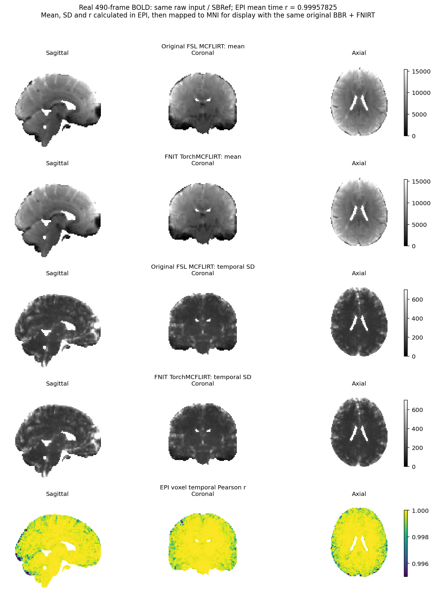

# MCFLIRT：BOLD运动校正

| 项目 | 内容 |
|---|---|
| 输入 | 4D BOLD与可选同网格SBRef |
| 输出 | 逐帧刚体矩阵、运动参数与可选校正图 |
| 对应原软件 | FSL mcflirt三阶段NCC路径 |
| Python / CLI | TorchMCFLIRT / fnit mcflirt、fnit-mcflirt |
| CPU / GPU | CPU或CUDA；复用FNIT FLIRT核心 |

## 1. 功能简介

`TorchMCFLIRT`为每帧BOLD估计到参考图的六自由度刚体变换，再按需要生成同参考网格的校正序列。默认8/4/4mm三个阶段，NCC代价和原程序的逐帧初始化顺序保留。生产不启动FSL。

计算使用FP32，变换组合和运动参数解析用FP64，CUDA默认TF32。2026-10-03修复pipeline无allocator缓存时CUDA graph空闲流调度失败；计算、接口和正常缓存结果保留，真实回归见第5节。

CPU 使用独立的有序 Numba 采样与 cost 内核，保持 float32 坐标、插值和行/平面归约顺序；CPU 样条保留 double 累加和每轴前滤波舍入。CUDA 沿用成熟采样、归约及 graph 路径。完整 180/490 帧的默认输出逐值回归见 [CPU 专页](CPU_BENCHMARK_20261004.md)。

## 2. Python 调用

```python
from fnit.mcflirt import TorchMCFLIRT

input_bold_path = "/data/sub-01_task-rest_bold.nii.gz"  # 完整4D原始BOLD
reference_image_path = "/data/sub-01_task-rest_sbref.nii.gz"  # 同网格3D SBRef
corrected_output_prefix = "/data/motion/prefiltered_func_data_mcf"  # 输出文件前缀
motion_result = TorchMCFLIRT(device="cuda:0").run(
    input_bold=input_bold_path, reference=reference_image_path,
    output=corrected_output_prefix, mats=True, plots=True,
    interpolation="spline",  # 连续BOLD的最终三阶样条
)
```

### 输入数据格式

BOLD为(X,Y,Z,T)NIfTI或nibabel影像；reference为同shape/affine的3D影像，None用第T//2帧。运动优化始终三线性，默认最终输出linear；spline须显式选择。支持完整三维6DOF/NCC，未提供2D、meanvol、第四阶段sinc或其他cost。

### 输入参数

| 参数 | 必需 | 类型 | 默认值 | 含义 |
|---|---|---|---|---|
| `device` | 否 | str / torch.device / None | `None` | 计算设备；显式 CUDA 不可用时报错。 |
| `input_bold` | 是 | 路径 / NIfTI | 无 | 完整(X,Y,Z,T) BOLD。 |
| `reference` | 否 | 路径 / NIfTI / None | `None` | 参考图；决定输出空间、shape、affine。 |
| `stages` | 否 | int | `3` | 1/2/3个8/4/4mm阶段。 |
| `stage_iterations` | 否 | 整数元组 | `(1, 1, 1)` | 各阶段坐标轮回次数；0跳过相应阶段。 |
| `resample` | 否 | bool | `False` | True生成校正图；指定output也会重采样。 |
| `interpolation` | 否 | str | `'linear'` | 最终插值方法；可选范围见本页输入格式。 |
| `output` | 否 | 路径 / None | `None` | 输出文件或前缀；父目录按接口创建。 |
| `mats` | 否 | bool | `False` | 保存每帧MAT_####，需output。 |
| `plots` | 否 | bool | `False` | 保存六列rad/mm运动参数，需output。 |
| `overwrite` | 否 | bool | `False` | 是否覆盖已有结果，默认保护原文件。 |
| `rmsrel` | 否 | bool | `False` | 保存相邻帧80mm球体RMS位移。 |
| `rmsabs` | 否 | bool | `False` | 保存相对identity的80mm球体RMS位移。 |

### 输出

```text
motion/
├── prefiltered_func_data_mcf.nii.gz
├── prefiltered_func_data_mcf.par       # plots=True
└── prefiltered_func_data_mcf.mat/      # mats=True
    ├── MAT_0000
    └── MAT_0001 ...
```

返回 `MCFLIRTResult`：

| 属性 | 内容 |
|---|---|
| `matrices` | T×4×4 的 NumPy float64 数组，逐帧 input→reference 的 FSL scaled-mm 矩阵。 |
| `parameters` | T×6 数组，依次为三个 Euler 转角（弧度）和三个平移（mm）。平移围绕 reference 的强度重心定义，对应原 `.par`。 |
| `reference` | 实际使用的三维 nibabel 参考图。 |
| `corrected` | 未请求重采样时为 `None`；否则为 reference 网格、保留输入时间轴和 TR 的 NIfTI。 |
| `cost_evaluations` | 本次 NCC 目标函数调用次数。 |
| `output_paths` | 已请求的输出文件路径字典；未指定 `output` 时为空字典。 |

整数图保存时沿用 NEWIMAGE 的向零截断；unsigned 16-bit 输入提升为 signed int32。uint32、int64 和 uint64 输入按原程序提升为 float32；int8 输出保存为 uint8，float64 输出保留 float64。这与把校正值四舍五入或始终保存 float32 不同。当前支持同网格三维参考、六自由度 Euler、默认 NCC、1–3 阶段和三线性/三阶样条最终采样。2D、小于 20 mm 的 z 向 FOV、`meanvol`、第四阶段 sinc 优化和其它 cost 不在本接口范围内，不能将上述结果推广为这些模式的等价性结论。

reference网格和输入时间轴/TR保留；矩阵为每帧input→reference scaled-mm正向变换。rmsrel/rmsabs额外生成相应位移文件及均值，mm。只估计不写盘用output=None,resample=False。

### 只取得运动矩阵

```python
from fnit.mcflirt import TorchMCFLIRT

input_bold_path = "/data/sub-01_task-rest_bold.nii.gz"  # 待估计的全部帧
reference_image_path = "/data/sub-01_task-rest_sbref.nii.gz"  # 同网格参考
motion_estimate = TorchMCFLIRT(device="cuda:0").run(
    input_bold=input_bold_path, reference=reference_image_path,
    resample=False, output=None,  # 返回矩阵，保留原始影像供后续一次重采样
)
frame_to_reference_matrices = motion_estimate.matrices  # T×4×4正向矩阵
motion_parameters_radians_mm = motion_estimate.parameters  # T×6，角度前三列
```

若后续还需畸变或标准空间变换，可组合对应pull链后一次采样，避免先写出中间校正图再反复插值。

### RMS文件和保存类型

同时请求rmsrel/rmsabs时额外写出：

```text
motion/
├── prefiltered_func_data_mcf_rel.rms
├── prefiltered_func_data_mcf_rel_mean.rms
├── prefiltered_func_data_mcf_abs.rms
└── prefiltered_func_data_mcf_abs_mean.rms
```

每帧RMS为mm，均值文件为一个标量。相邻帧RMS与相对identity的RMS含义不同，不能当作同一FD指标。

校正图保留输入存盘类型规则：整数向零截断；uint16提升int32，uint32/int64/uint64提升float32，int8写uint8，float64保留float64。这决定了图像差异的解释，不能一律按float32结果处理。

stage_iterations只由Python暴露，默认(1,1,1)；CLI的-stages仅选择阶段数。指定output必定重采样，即使resample=False。

## 3. 命令行调用

```bash
# 将 raw BOLD 配准到 SBRef，最终用样条采样；保存矩阵、参数及两类 RMS。
fnit mcflirt -in sub-01_task-rest_bold.nii.gz \
  -reffile sub-01_task-rest_sbref.nii.gz \
  -out motion/prefiltered_func_data_mcf \
  -mats -plots -rmsrel -rmsabs -spline_final --device cuda:1
```

正常缓存可用 `env -u PYTORCH_NO_CUDA_MEMORY_CACHING fnit mcflirt ...` 启动；无缓存模式可在启动前设置 `PYTORCH_NO_CUDA_MEMORY_CACHING=1`。该配置只改变 graph 的执行方式，CLI 参数含义同 Python 表。

| CLI 参数 | Python 参数 | 含义 |
|---|---|---|
| `-in / -reffile / -out` | `input_bold / reference / output` | 完整BOLD、3D参考与输出 |
| `-mats / -plots` | `mats / plots` | 矩阵和参数文件 |
| `-rmsrel / -rmsabs` | `rmsrel / rmsabs` | 两种位移指标 |
| `-stages` | `stages` | 1–3阶段 |
| `-spline_final / -trilinear_final` | `interpolation` | spline / linear |
| `--device / --overwrite` | `device / overwrite` | 设备与覆盖 |

## 4. 原软件调用

对应的原 FSL benchmark 命令：

```bash
mcflirt -in sub-01_task-rest_bold.nii.gz \
  -reffile sub-01_task-rest_sbref.nii.gz \
  -out motion/prefiltered_func_data_mcf \
  -mats -plots -rmsrel -rmsabs -spline_final
```

省略 `-reffile` 使用中间帧；省略 `-spline_final` 使用三线性最终采样。`-mats`、`-plots` 和 RMS 开关只控制文件输出，不改变估计流程。

## 5. 最新精度和运行时间

### 2026-10-04 完整 CPU 官方 benchmark

[CPU 专页](CPU_BENCHMARK_20261004.md)记录完整 180/490 帧、默认三阶段、最终样条及正常文件。最新 CPU v5 的 17,456 次真实成本原始字节、六项默认/10 组完整输出、标准文件和 31 项功能组合门槛已通过；最终额外一次完整 CUDA 180 帧的影像、header、矩阵、参数和成本计数与已接受 v4 精确相同，CPU 成本模块未导入。CUDA/BBR 源码保持原实现，v4 的 36 次完整 CUDA ABBA 和历史 CPU/FSL 时钟保留在专页。180 帧 CPU8 热 API 为 36.542 s，此前官方完整进程为 35.233 s，速度目标仍有差距；共享 CPU 调度诊断与正常原始时钟分开记录，不宣布稳定加速比。


最新2026-10-03公开CON03回归为ds001226 v5.0.1的一例完整64×64×42×180 BOLD，H100 GPU0、PyTorch2.5.1、8CPU线程、TF32，FP32计算/FP64矩阵；各配置独立进程各一次。源码与输入SHA见[正式组件报告](../../validation/mcflirt/nocache_public_con03_20261003.public.json)。

| 完整 180 帧 `TorchMCFLIRT.run` | 正常 allocator 缓存 | 禁用 allocator 缓存 |
| --- | ---: | ---: |
| API 墙钟 | 52.151 s | 290.753 s |
| NCC cost 次数 | 17,465 | 17,465 |
| `180×4×4` 矩阵、`180×6` 参数 | 两组 float64 数组逐 bit 相同，最大差 0 | 同左 |
| 校正 BOLD | 两组完整 int16 数组逐 bit 相同，最大差 0 | 同左 |
| 本任务进程树显存采样峰值，十进制 GB | 1.327497 | 1.126171 |
| 同一峰值，GiB | 1.236328 | 1.048828 |

API含读取、准备、延迟编译、运动估计和采样/类型转换，排除包导入、参考准备、结果保存与核验。这是allocator执行方式回归，未新增原FSL配对。前次完整490帧FSL精度/时间及图示保留其冻结版本，见[详细历史](../../validation/mcflirt/readme_archive_20261005.md#前次正常缓存的完整-490-帧核对)。

### 分步骤 benchmark

| 阶段 | FNIT | 原FSL |
|---|---|---|
| 三阶段估计/最终采样单列 | 本次未单列 | 本次未测 |

### 前次正常缓存的原软件脑图



同一例 490 帧 BOLD。本轮原生对照的均值、temporal SD（`ddof=0`）及逐体素时间 r 先在 EPI 空间计算，再用同一原 BBR 和 FNIRT pull 将三维指标图变换到 MNI，仅用于展示。均值和 SD 使用各自统一的色阶；时间 r 的色阶为 0.995–1，低于下限的体素显示为下限颜色。这里的 SD 不是将四维 BOLD 重采样到 MNI 后重新计算的 SD。没有额外空间平滑，只有获授权的去标识化模板空间 PNG 被公开。复现命令见[独立验证说明](../../validation/mcflirt/README.md)，图示实现为 [render_comparison.py](../../validation/mcflirt/render_comparison.py)。

## 6. 最近版本和 benchmark

| 版本与日期 | 功能变化 | 真实数据 benchmark 与核对 |
|---|---|---|
| 2026-10-03 无缓存兼容修复 | 成熟 cost 与最终 spline 在 capture 前按 flag presence 选路；正常配置保留 graph，无缓存直接执行相同归约和样条函数。`0`、空字符串和 `1` 均禁用 allocator 缓存；配置在启动进程前设置。 | 公开 CON03 完整 180 帧、两个独立进程：17,465 次 cost 不变，矩阵、参数及校正 int16 图逐 bit 相同；API **52.151 / 290.753 s**，范围见[本轮报告](../../validation/mcflirt/nocache_public_con03_20261003.public.json)。原 `19c8e0a3` 无缓存整链失败记录保留，新正式整链从原数据另起。 |
| `8a3f2276`，2026-10-02 | 精确角度/旋转缓存和 pull 对角矩阵复用；每次调用按参考尺寸复用原 NCC graph；motion-only 样条采样 graph；按请求计算 RMS。 | 完整 490 帧两回合同卡配对，API 均值 **97.91 → 57.98 秒**；45,972 次 cost 不变，未舍入矩阵/参数和校正图逐 bit 相同，未截断样条 float32 全相同。同 TR 的高通结果全相同。原 FSL 本轮脑内时间 r 均值 0.999557；见[最新配对报告](../../validation/mcflirt/paired_exact_latest.public.json)。 |
| `cfb7beee`，2026-10-01 | 最终合并主线后复测；MCFLIRT 运行时源码哈希与初次融合版本一致。 | 历史完整 490 帧、固定 FEAT 参考，物理 GPU 0 上 API **278.45 秒、45,972 次 cost**，其中样条采样 32.01 秒；矩阵/参数文本和校正/高通图与冻结 FNIT 逐值相同。详见[历史融合报告](../../validation/mcflirt/gpu_optimization_latest.public.json)。 |
| 冻结状态 `1eb9c417`，2026-10-01 | 数值匹配修复后的基线：保留源 NCC 计数、逐次 float32 坐标累加及输出数据类型，保存完整 490 帧 GPU 对照。 | 相对原 FSL，脑内 pull RMS 均值 0.00881 mm，校正图脑内时间 r 均值 0.99957825。历史 **973.12 秒是 FEAT 阶段合计**，包含运动校正、掩膜准备、缩放和高通；MCFLIRT 估计与采样未单独计时。详见[冻结 GPU 报告](../../validation/mcflirt/full490_gpu.public.json)。 |

## 7. 参考文献、原软件和资源

源码位置：[原软件 `mcflirt-2111.0/mcflirt.cc`](../../src/fnit/_vendor_fsl/sources/mcflirt-2111.0/mcflirt.cc)；[FNIT `mcflirt/core.py`](../../src/fnit/mcflirt/core.py)。固定 tag/commit、Git tree 及每文件 SHA-256 见[来源清单](../../src/fnit/_vendor_fsl/manifest.json)。

本模块是基于 FSL 源码改写的 Python/PyTorch 实现，沿用 [FSL Software Licence, Release 6.0](../../licenses/FSL-6.0.txt) 的非商业使用条款。许可证要求在无财务回报的再分发中向接收者保留条款，并随产品提供原始及修改后的源代码。因此，本包同时提供改写后的 `src/fnit/mcflirt/` 和官方 tag `2111.0` 的[完整六文件源码快照](../../src/fnit/_vendor_fsl/sources/mcflirt-2111.0/)；原始文件未修改，FNIT 不编译或执行这些文件。

官方提交为 `fa24cb88fba970fb9adc959713fee57bf3706d3e`，Git tree 为 `ee503629cf36f06a698eb4bfc516e2ad2df8feff`。官方仓库、无前缀 `git archive --format=tar` 的 SHA-256、逐文件大小及 SHA-256 见[源码清单](../../src/fnit/_vendor_fsl/manifest.json)；共享 NEWIMAGE/MISCMATHS 来源及许可见[vendor 说明](../../src/fnit/_vendor_fsl/README.md)和[第三方声明](../../THIRD_PARTY_NOTICES.md)。这些来源记录不将 FNIT 标记为官方 FSL，也不扩大上文已测量的数值范围。

参考：[FSL MCFLIRT 文档](https://fsl.fmrib.ox.ac.uk/fsl/docs/registration/mcflirt.html)；Jenkinson M, Bannister P, Brady M, Smith S. Improved optimization for the robust and accurate linear registration and motion correction of brain images. *NeuroImage* 17:825–841, 2002. [DOI](https://doi.org/10.1006/nimg.2002.1132)。

CUDA allocator 的配置语义与 graph 私有内存池见 [PyTorch 2.5.1 CUDACachingAllocator](https://github.com/pytorch/pytorch/blob/v2.5.1/c10/cuda/CUDACachingAllocator.cpp#L80) 及其 [`forceUncachedAllocator`](https://github.com/pytorch/pytorch/blob/v2.5.1/c10/cuda/CUDACachingAllocator.cpp#L2913)。

| 资源 | 用途 | 官方来源 | 大小 | SHA-256 | 是否允许 FNIT 再分发 |
|---|---|---|---|---|---|
| 本功能无模型权重；用户自备参考影像、掩膜或变换 | 定义目标网格/变换 | 各文件原作者 | 按实际文件 | 按实际文件 | 不随本功能发布用户数据 |

[完整历史说明与调试证据](../../validation/mcflirt/readme_archive_20261005.md) · [返回主页](../../README.md)

<!-- 旧版文档锚点兼容 -->
<a id="1-功能与流程"></a> <a id="从-torchflirt-复用的实现"></a> <a id="2026-10-03-pipeline-接入暴露的成熟子函数-bug"></a> <a id="2-python-调用输入与输出"></a> <a id="单被试-python-调用"></a> <a id="3-命令行调用"></a> <a id="4-对应原软件调用"></a> <a id="5-真实数据精度耗时与脑图"></a> <a id="2026-10-03-公开-con03-的无缓存修复回归"></a> <a id="前次正常缓存的完整-490-帧核对"></a> <a id="前次正常缓存的原软件脑图"></a> <a id="6-最近版本更新与-benchmark-记录"></a> <a id="7-参考文献许可证与原实现"></a>
