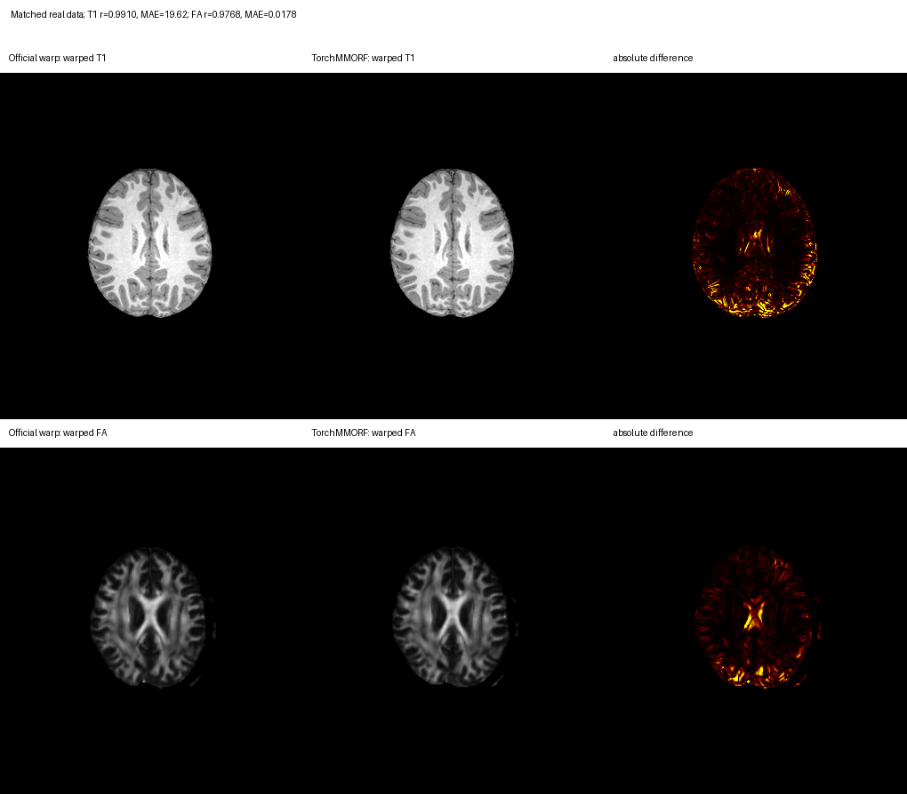

# TorchMMORF：多标量模态与扩散张量联合配准

[返回首页](../../README.md) · [dMRI 参数图 pipeline](../dmri_pipeline/README.md) · [验证工件](../../validation/mmorf/README.md)

`run_mmorf` 按顺序接收一组或多组标量图配对，以及一组 diffusion tensor 配对，并估计一套共享的非线性形变。第一张 reference scalar 定义输出网格。缺少线性矩阵时，函数会先调用 FNIT 的 PyTorchFLIRT 计算矩阵；显式传入矩阵时直接使用。`fnit-mmorf` 与 dMRI pipeline 的 MMORF 分支都调用这个函数，运行时不启动 FSL executable。

CUDA 路径使用 float32 并默认允许 TF32，不使用 float16 或 bfloat16。默认五层计划与 MMORF 0.3.2 配置一致：控制点分辨率为 32、32、16、8、4 mm，平滑为 8、8、4、2、1 mm，每层 5 次更新。当前实现包含 world-mm cubic 控制格点、reference-axis mm warp、多组标量与张量代价、逐模态初始代价缩放、tensor reorientation、Bkk/SPRED 正则和 LBFGS 优化路径；数值结果仍未与官方逐体素等价。

## 输入

| 参数 | 类型与 shape | 含义 |
|---|---|---|
| `moving_scalar` | 单张 3D NIfTI，或按模态排序的路径/image 列表 | 个体标量图，例如 `[T1w, FA]`。 |
| `reference_scalar` | 与 `moving_scalar` 等长的 3D NIfTI 列表，或单张图 | 每张 moving 图对应的模板；第一张定义输出 grid。 |
| `moving_tensor` | 4D NIfTI，`[X,Y,Z,6]` | 个体 diffusion tensor。六通道顺序必须为 `Dxx,Dxy,Dxz,Dyy,Dyz,Dzz`。 |
| `reference_tensor` | 4D NIfTI，`[X,Y,Z,6]` | 公共空间 diffusion tensor 模板。 |
| `moving_scalar_affine` | 单个 4×4 矩阵/`.mat`，或按模态排序的列表，可省略 | 每张 moving scalar → 第一张 reference scalar 的 FSL scaled-mm 矩阵；缺失项自动估计。 |
| `reference_scalar_affine` | 按模态排序的矩阵/`.mat` 列表，可省略 | 各 reference scalar → 第一张 reference scalar 的矩阵；首项必须为 identity。 |
| `moving_tensor_affine` | 4×4 array 或 `.mat` 路径，可省略 | moving tensor → 第一张 reference scalar 的矩阵；缺失时先由六通道 tensor 算 FA，再用 PyTorchFLIRT 估计。 |
| `reference_tensor_affine` | 4×4 array 或 `.mat` 路径，可省略 | reference tensor → 第一张 reference scalar 的矩阵；同网格时使用 identity。 |
| `scalar_weights` | 每组标量一个非负数，可省略 | 各标量代价的权重；默认每组 `1/N`。 |
| `auto_linear` | bool | 默认 `True`；关闭时缺失矩阵按 identity 处理。 |
| `output_dir` | 目录 | 一个受试者的 warp、Jacobian、全部 warped 图和 JSON 报告。 |
| `device` | `cpu`、`cuda` 或 `cuda:N` | 省略时由 FNIT 选择可用设备。 |
| `config` | `MMORFConfig`，可省略 | 默认使用上述五层计划。 |
| `overwrite` | bool | 默认 `False`；已有任一结果时停止。 |

所有图像必须为有限值。自动线性配准先把每组 moving scalar 配准到对应 reference scalar；若该 reference 与第一张 reference 不同网格，再用 6-DOF NormMI 配到输出空间，并组合两个 FSL scaled-mm 矩阵。moving tensor 使用由六通道数据计算的 FA 与第一张 reference scalar 做 6-DOF NormMI。显式矩阵始终优先；同网格的 reference 图按已对齐处理。同网格但内容未对齐时应提供矩阵。自动估计可能受跨模态对比度影响，矩阵与估计方式写入 `mmorf_report.json`。

## Python 单被试调用

```python
from fnit import run_mmorf

result = run_mmorf(
    moving_scalar=["t1_brain.nii.gz", "dti_FA.nii.gz"],  # 输入：个体 T1w、FA，顺序与模板一一对应
    reference_scalar=["MNI152_T1_1mm_brain.nii.gz", "FSL_HCP1065_FA_1mm.nii.gz"],  # 输入：T1、FA 模板；首张决定输出网格
    moving_tensor="dti_tensor.nii.gz",  # 输入：个体 [X,Y,Z,6] FSL tensor
    reference_tensor="FSL_HCP1065_tensor_1mm.nii.gz",  # 输入：公共空间六通道 tensor
    output_dir="mmorf",  # 输出：本受试者的多文件结果目录
    moving_scalar_affine=[None, None],  # 输入：两张 moving scalar 的矩阵均由 PyTorchFLIRT 估计
    reference_scalar_affine=[None, None],  # 输入：第一张是 warp space；第二张同网格时使用 identity
    moving_tensor_affine=None,  # 输入：用 moving tensor 计算 FA 后自动估计至 T1 模板的矩阵
    reference_tensor_affine=None,  # 输入：reference tensor 同网格时使用 identity
    scalar_weights=[0.5, 0.5],  # 代价权重：两种标量模态各占 0.5
    auto_linear=True,  # 线性初始化：对缺失矩阵调用 PyTorchFLIRT
    device="cuda:0",  # 运行设备：第一张 CUDA GPU
    config=None,  # 配置：使用 MMORFConfig 默认五层计划
    overwrite=False,  # 写盘策略：不覆盖已有文件
)
```

这次调用完成一名受试者的联合配准并写盘。已计算的矩阵保存在 `result.qc["linear_alignment"]`。`result` 为 `MMORFResult`：

| Python 属性 | 类型 | 内容 |
|---|---|---|
| `warp` | nibabel NIfTI | reference grid 上的三通道 relative pull displacement。 |
| `jacobian` | nibabel NIfTI | nonlinear warp 的 Jacobian determinant。 |
| `warped_scalar` | nibabel NIfTI | 第一张 moving scalar 的 reference-grid cubic 重采样结果。 |
| `warped_scalars` | NIfTI tuple | 所有 moving scalar 的公共空间结果，顺序与输入一致。 |
| `warped_tensor` | nibabel NIfTI | moving tensor 的六通道 cubic 重采样结果；这是 FNIT 便利输出。 |
| `qc` | dict | 每组线性矩阵与方式、设备、TF32、层级损失、耗时、峰值显存和非等价边界。 |

只在内存中计算时使用低层接口：

```python
from fnit import TorchMMORF

model = TorchMMORF(
    device="cuda:0",  # 运行设备
    config=None,  # 使用默认 MMORFConfig
)
result = model(
    moving_scalar="t1_brain.nii.gz",  # 输入：个体脑提取 T1w
    reference_scalar="MNI152_T1_1mm_brain.nii.gz",  # 输入：T1 模板及输出网格
    moving_tensor="dti_tensor.nii.gz",  # 输入：个体六通道 tensor
    reference_tensor="FSL_HCP1065_tensor_1mm.nii.gz",  # 输入：公共空间六通道 tensor
    moving_scalar_affine="t1_to_MNI.mat",  # 输入：moving T1 -> reference 矩阵
    reference_scalar_affine=None,  # 输入：首张 reference scalar 定义 warp space
    moving_tensor_affine="FA_to_MNI.mat",  # 输入：moving tensor -> reference 矩阵
    reference_tensor_affine=None,  # 输入：reference tensor 已与 T1 模板同网格
    scalar_weights=None,  # 代价权重：单模态默认 1.0
    auto_linear=True,  # 缺失矩阵自动估计；此例均无需额外估计
)
```

应用已有 MMORF warp：

```python
from fnit import apply_mmorf_warp

warped_fa = apply_mmorf_warp(
    image="dti_FA.nii.gz",  # 输入：待重采样的 native FA
    reference="MNI152_T1_1mm_brain.nii.gz",  # 输入：输出网格
    warp=result.warp,  # 输入：reference-grid、reference-axis mm pull warp
    affine="FA_to_MNI.mat",  # 输入：FA -> reference 的 FSL scaled-mm 矩阵
    device="cuda:0",  # 运行设备
    interpolation="linear",  # 插值：连续参数图使用线性插值
)
```

`apply_mmorf_warp` 的 `image` 是待重采样图，`reference` 决定输出 grid，`warp` 必须与 reference 同 shape 和 affine，`affine` 是 image → reference 的 FLIRT 矩阵。`interpolation` 可为 `linear`、`nearest` 或 `cubic`；dMRI 参数图 pipeline 使用 linear，MMORF 标量输出使用 cubic。

## 命令行单被试调用

```bash
fnit-mmorf \
  --mov-scalar t1_brain.nii.gz \
  --ref-scalar MNI152_T1_1mm_brain.nii.gz \
  --mov-scalar dti_FA.nii.gz \
  --ref-scalar FSL_HCP1065_FA_1mm.nii.gz \
  --mov-tensor dti_tensor.nii.gz \
  --ref-tensor FSL_HCP1065_tensor_1mm.nii.gz \
  --aff-mov-scalar t1_to_MNI.mat \
  --aff-mov-scalar AUTO \
  --aff-mov-tensor FA_to_MNI.mat \
  --scalar-weight 0.5 \
  --scalar-weight 0.5 \
  -o mmorf \
  --device cuda:0
```

重复的 `--mov-scalar` 和 `--ref-scalar` 按出现顺序配对；上例依次为 T1 和 FA。`--aff-mov-scalar` 的第一个值是 T1 → T1 模板的已有矩阵，第二个 `AUTO` 让内部 PyTorchFLIRT 配准 FA → FA 模板；`--aff-mov-tensor` 是 tensor → 输出空间的已有矩阵。两次 `--scalar-weight` 分别设置两组标量代价。其他缺失矩阵默认自动计算；若第二张 reference scalar 不与首张同网格，可重复 `--aff-ref-scalar` 并用 `AUTO` 占位需要自动计算的位置。`--no-auto-linear` 会把缺失矩阵改为 identity。`-o` 指定目录，`--device` 指定设备；覆盖已有结果必须显式加 `--overwrite`。

## 输出目录与坐标定义

```text
mmorf/
├── mmorf_warp.nii.gz
├── mmorf_jacobian.nii.gz
├── mmorf_warped_scalar.nii.gz
├── mmorf_warped_scalar_2.nii.gz
├── mmorf_warped_tensor.nii.gz
└── mmorf_report.json
```

| 文件 | shape | dtype | 定义 |
|---|---|---|---|
| `mmorf_warp.nii.gz` | `[Xref,Yref,Zref,3]` | float32 | relative pull displacement；三通道为沿 reference image axes 的毫米位移。 |
| `mmorf_jacobian.nii.gz` | `[Xref,Yref,Zref]` | float32 | `det(I + ∂u/∂x)`，只含 nonlinear warp。 |
| `mmorf_warped_scalar.nii.gz` | `[Xref,Yref,Zref]` | float32 | 第一张 moving scalar 的公共空间结果。 |
| `mmorf_warped_scalar_2.nii.gz` 等 | `[Xref,Yref,Zref]` | float32 | 第 2 张及之后的标量结果；单模态时没有。 |
| `mmorf_warped_tensor.nii.gz` | `[Xref,Yref,Zref,6]` | float32 | 六通道 moving tensor 的公共空间采样结果。 |
| `mmorf_report.json` | JSON | — | 各模态线性矩阵、配准方式、设备、五层 QC、耗时和显存。 |

MMORF warp 与 FNIRT/applywarp 的 coefficient/dense-warp 文件不是同一种坐标合同，不能互换。设 `u_axis(x)` 为保存的三通道值，`Rref` 为 reference affine 去除 voxel scaling 后的轴方向矩阵，则公共 world 位移为 `Rref · u_axis(x)`；pull 位置再通过 input affine 的逆映射到 moving voxel。这个定义已用 anisotropic 和 oblique affine 单元测试验证。

官方 MMORF 只直接输出 warp 和 Jacobian；debug 路径可保存 warped scalar。`mmorf_warped_tensor.nii.gz` 是 FNIT 的便利输出，本次官方对照没有 warped-tensor oracle，因此不声明它逐体素等价。

## 对应的官方 MMORF 0.3.2 调用

将相同输入与 FNIT 自动计算的 FA 矩阵写入 `multimodal.ini`。官方 MMORF 要求在运行前准备各模态的 FLIRT 矩阵：[官方参数说明](https://fsl.fmrib.ox.ac.uk/fsl/docs/registration/mmorf.html)。`FA_auto.mat` 可从 FNIT 的 `mmorf_report.json` 导出：

```python
import json
import numpy as np

report = json.load(open("mmorf/mmorf_report.json", encoding="utf-8"))  # 输入：FNIT 注册报告
matrix = report["linear_alignment"]["moving_scalar"][1]["matrix"]  # 输入：第二组 FA 的自动线性矩阵
np.savetxt("FA_auto.mat", matrix, fmt="%.12g")  # 输出：供官方 MMORF 读取的 FSL scaled-mm 矩阵
```

官方配置为：

```ini
warp_res_init           = 32
warp_scaling            = 1 1 2 2 2
img_warp_space          = MNI152_T1_1mm_brain.nii.gz
lambda_reg              = 4.0e5 3.7e-1 3.1e-1 2.6e-1 2.2e-1
hires                   = 6
optimiser_lowres        = LM
optimiser_hires         = MM
optimiser_max_it_lowres = 5
optimiser_max_it_hires  = 5
warp_out                = official_warp
jac_det_out             = official_jacobian

img_ref_scalar      = MNI152_T1_1mm_brain.nii.gz
img_mov_scalar      = t1_brain.nii.gz
aff_ref_scalar      = identity.mat
aff_mov_scalar      = t1_to_MNI.mat
use_implicit_mask   = 0
use_mask_ref_scalar = 0 0 0 0 0
use_mask_mov_scalar = 0 0 0 0 0
mask_ref_scalar     = NULL
mask_mov_scalar     = NULL
fwhm_ref_scalar     = 8 8 4 2 1
fwhm_mov_scalar     = 8 8 4 2 1
lambda_scalar       = 0.5 0.5 0.5 0.5 0.5
estimate_bias       = 0
bias_res_init       = 32
lambda_bias_reg     = 1e9 1e9 1e9 1e9 1e9

img_ref_scalar      = FSL_HCP1065_FA_1mm.nii.gz
img_mov_scalar      = dti_FA.nii.gz
aff_ref_scalar      = identity.mat
aff_mov_scalar      = FA_auto.mat
use_implicit_mask   = 0
use_mask_ref_scalar = 0 0 0 0 0
use_mask_mov_scalar = 0 0 0 0 0
mask_ref_scalar     = NULL
mask_mov_scalar     = NULL
fwhm_ref_scalar     = 8 8 4 2 1
fwhm_mov_scalar     = 8 8 4 2 1
lambda_scalar       = 0.5 0.5 0.5 0.5 0.5
estimate_bias       = 0
bias_res_init       = 32
lambda_bias_reg     = 1e9 1e9 1e9 1e9 1e9

img_ref_tensor      = FSL_HCP1065_tensor_1mm.nii.gz
img_mov_tensor      = dti_tensor.nii.gz
aff_ref_tensor      = identity.mat
aff_mov_tensor      = FA_to_MNI.mat
use_mask_ref_tensor = 0 0 0 0 0
use_mask_mov_tensor = 0 0 0 0 0
mask_ref_tensor     = NULL
mask_mov_tensor     = NULL
fwhm_ref_tensor     = 8 8 4 2 1
fwhm_mov_tensor     = 8 8 4 2 1
lambda_tensor       = 1 1 1 1 1
```

```bash
mmorf --config multimodal.ini
```

`img_ref_scalar`、`img_mov_scalar` 和对应 affine 在官方配置中每组重复一次，顺序与 FNIT 列表一致。默认 `MMORFConfig` 对应 `warp_res_init`、`warp_scaling`、FWHM、`lambda_reg` 和五次更新。FNIT 的自动线性配准、输出目录和设备选项属于 Python 包接口。

## 源码对应与剩余差异

| MMORF 0.3.2 行为 | 当前 TorchMMORF |
|---|---|
| 多组标量模态联合估计一个 warp | 已实现，按输入顺序配对，每组可以单独赋权。 |
| 各模态预先手工线性配准 | 缺失矩阵时内部调用 PyTorchFLIRT；显式矩阵保持优先。 |
| world-mm cubic B-spline warp | 已实现，并按整数 scaling 精确细化控制格点。 |
| robust world sample grid 和逐模态采样频率 | 已实现。 |
| cubic image coefficient/pull sampling | 已实现；使用 SciPy mirror prefilter 与 PyTorch 64-neighbour sampler。 |
| robust scalar normalization | 已实现。 |
| 各模态单独按初始代价缩放至 50 | 已实现；官方在找到更低总损失时会更新逐模态缩放，当前固定为初始值。 |
| `0.5*(1+detJ)` symmetric quadrature | 已实现；按官方 gradient/Hessian 语义把该权重视为固定权重。 |
| full tensor Frobenius cost | 已实现。 |
| affine 与 local finite-strain tensor rotation | 已实现。 |
| 首层 Bkk、后续 SPRED | 已实现。 |
| coarse full / fine diagonal Gauss–Newton Hessian，Levenberg damping | 未等价；当前使用 LBFGS strong-Wolfe。 |
| analytic tensor-rotation gradient/Hessian | 当前由 PyTorch autograd 求导。 |
| analytic dense spline Jacobian | 当前输出使用 finite differences。 |

因此 `mmorf_report.json` 保持 `mmorf_numerically_equivalent=false`。文件角色、grid、dtype、warp 方向和单位已对齐；数值误差仍明显大于浮点舍入。

## 真实数据 benchmark

既有官方对照报告使用一例真实 T1w、DTI FA 和六通道 tensor，对应的 T1、FA 与 tensor 模板，计算两组标量加一组张量的共享 warp。T1 与 tensor 的既有线性矩阵保持固定；FA 标量的矩阵由内部 PyTorchFLIRT 12-DOF CorRatio 自动估计。两组标量权重均为 0.5。对照使用同一组图像和矩阵运行官方 MMORF 0.3.2。具体命令、完整 3D 指标及输入边界见[当前报告](../../validation/mmorf/report.public.json)。

| 运行 | 时间 | 峰值分配显存 |
|---|---:|---:|
| FNIT：使用相同线性矩阵，五层非线性求解 | 63.22 s | 14.30 GB |
| FNIT：使用相同线性矩阵，含载入与写盘 | 79.78 s | 14.30 GB |
| FNIT：内部自动估计 FA 矩阵 | 210.27 s | 0.82 GB |
| FNIT：自动线性、非线性和写盘全程 | 287.12 s | 14.30 GB |
| 官方 MMORF：非线性求解 | 1161.31 s | 未提供进程 GPU 峰值 |
| 官方 MMORF：含写盘完整命令 | 1183.61 s | 未提供进程 GPU 峰值 |

FNIT 与官方的输出均可读取，warp 和 Jacobian 的 shape、affine、dtype 合同一致。以下 Pearson、MAE、RMSE 由同一参考脑掩膜上的完整 3D 图计算；FA 还要求两张输出都非零。两组 warped scalar 均用 FNIT cubic sampler 从各自 warp 生成。

| 输出 | Pearson r | MAE | RMSE |
|---|---:|---:|---:|
| warp 三通道，mm | 0.978064 | 0.275535 | 0.434509 |
| Jacobian | 0.970834 | 0.036512 | 0.061564 |
| warped T1，原图强度 | 0.958732 | 49.158114 | 86.690190 |
| warped FA | 0.983303 | 0.015765 | 0.029957 |



自动配准得到的 FA 矩阵与配对对照所用矩阵相同，自动和显式矩阵两次 FNIT warp 的最大绝对差为 0。共享 H100 GPU 运行前已有其他进程，FNIT 进程限制为整卡显存的 24%，前后全卡占用见机器报告。上述时间是本例实测，不能推断稳定加速比；各输出尚未达到逐体素数值等价。

## 来源与许可

实现参考[官方 MMORF 源码](https://git.fmrib.ox.ac.uk/fsl/MMORF)的 v0.3.2、commit `1c1c13b8368f05e1a79a6dafe919d6b61df36bd6`。发行包不含官方 MMORF 源码或可执行文件。源代码改写仍遵守 [`FSL Software Licence, Release 6.0`](../../licenses/FSL-6.0.txt)；FNIT 不是官方 FSL 发布。

## 2026-10-02：同网格多指标图传播

新增采样计划先准备固定 warp/affine 的坐标，再对每张图独立插值。源 shape、affine、header pixdim 和 FSL scaled-mm 网格须完全相同；参考图还核验完整 header 和 extensions。保留原混合精度：矩阵与位移转换使用 float64，基础网格、最终采样坐标、图像和 reference axes 极分解保持原 float32 计算。

2026-10-02 在 H100 上，使用既有真实数据的九张指标图、固定 MMORF warp 与 affine，输出网格为 `182×218×182`，CPU 线程为 8，PyTorch CUDA 分配限额为 20,000,000,000 bytes。每轮交替先后顺序，三轮的九图解码体素、完整 header 和 affine 均逐值一致。

| 九图传播计时 | 原逐图调用 | 复用采样计划 |
|---|---:|---:|
| 首轮，含冷启动 | 0.645693060 s | 0.224990048 s |
| 后两轮热调用中位数 | 0.517138056 s | 0.270091293 s |

热调用观察到约 **1.91 倍**速度。新方案的计时包含准备计划、九图采样与输出回传；输入加载和输出写盘在计时外。这是固定形变的九图传播结果，不代表整条 pipeline 或配准估计的加速比，也不改变本页官方 MMORF 对照的数值等价结论。完整参数和 Python 示例见[组件文档](../../src/fnit/mmorf/README.md)，三轮记录及复现命令见[九图验收](../../validation/dmri_pipeline/map_propagation_20261002.md)，整体进展见[主报告](../../validation/dmri_pipeline/lossless_20261002.md)。

## Reference

- 参考文献：Lange et al., *MMORF—FSL’s MultiMOdal Registration Framework*, Imaging Neuroscience (2024), [doi:10.1162/imag_a_00100](https://doi.org/10.1162/imag_a_00100)。
- 原实现代码库：[FSL `MMORF`](https://git.fmrib.ox.ac.uk/fsl/MMORF)。
