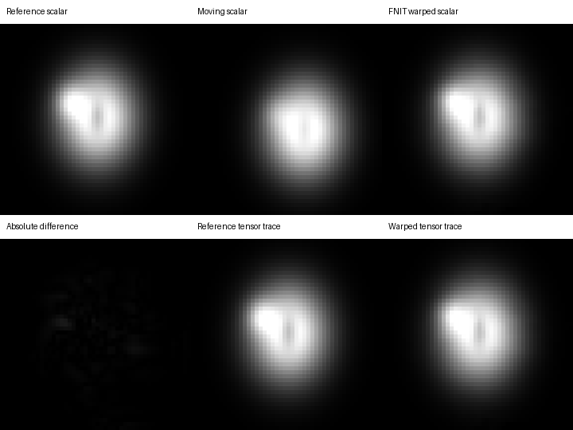

# PyTorch MMORF

[返回首页](../../README.md) · [端到端 dMRI pipeline](../dmri_pipeline/README.md)

本模块用一个共享的非线性形变同时配准一对标量图和一对 FSL 六通道 diffusion tensor 图。当前公开接口固定为单被试调用。输入仿射矩阵沿用 FLIRT 的 input → reference scaled-mm 定义；输出 warp 位于 reference grid，保存 reference voxel units 的三通道相对 pull displacement。这个单位与 FNIRT/applywarp 的 mm displacement 不同，不能混用。

该实现复用了 FNIT 的 FSL 坐标转换和 nibabel I/O，CUDA 路径使用 float32 并默认允许 TF32。默认五层计划来自 MMORF 0.3.2：32、32、16、8、4 mm control resolution，8、8、4、2、1 mm smoothing，每层 5 次更新。

## Python 单被试调用

~~~python
from fnit import TorchMMORF

result = TorchMMORF(device="cuda:0").run(
    "t1_brain.nii.gz",                    # moving scalar
    "MNI152_T1_1mm_brain.nii.gz",         # scalar reference and output grid
    "dti_tensor.nii.gz",                  # moving tensor: Dxx,Dxy,Dxz,Dyy,Dyz,Dzz
    "FSL_HCP1065_tensor_1mm.nii.gz",       # reference tensor
    moving_scalar_affine="t1_to_MNI.mat", # FLIRT scaled-mm input→reference
    moving_tensor_affine="FA_to_MNI.mat", # FLIRT scaled-mm input→reference
    output_dir="mmorf",
)
~~~

第一至第四个位置参数分别定义 moving scalar、reference scalar、moving tensor 和 reference tensor。两个 moving affine 先把各自图像放到共同 reference grid；未提供 reference tensor affine 时按同网格 identity 处理。run 会保存结果；直接调用 TorchMMORF(...)(...) 只返回内存中的 MMORFResult。

输出：

| 文件 | 内容 |
|---|---|
| mmorf_warp.nii.gz | reference grid 上的三通道相对 pull displacement，单位为 reference voxel |
| mmorf_jacobian.nii.gz | 仅非线性形变的 Jacobian determinant |
| mmorf_warped_scalar.nii.gz | moving scalar 的 reference-grid 图像 |
| mmorf_warped_tensor.nii.gz | moving tensor 的 reference-grid 图像 |
| mmorf_report.json | 设备、精度、五层损失、耗时、峰值 CUDA 显存和等价性边界 |

## 命令行单被试调用

~~~bash
fnit-mmorf \
  --mov-scalar t1_brain.nii.gz \
  --ref-scalar MNI152_T1_1mm_brain.nii.gz \
  --mov-tensor dti_tensor.nii.gz \
  --ref-tensor FSL_HCP1065_tensor_1mm.nii.gz \
  --aff-mov-scalar t1_to_MNI.mat \
  --aff-mov-tensor FA_to_MNI.mat \
  -o mmorf \
  --device cuda:0
~~~

每一行依次选择 subject T1、MNI T1 reference、subject DTI tensor、标准 tensor、两份 FLIRT 初始仿射和输出目录。reference tensor 已与 MNI T1 同网格时不用 --aff-ref-tensor。--device 选择计算设备；现有目录默认受保护，需要替换时显式加 --overwrite。

## 对应的官方 MMORF 0.3.2

相同输入可写入以下配置并运行 mmorf --config multimodal.ini：

~~~ini
warp_res_init           = 32
warp_scaling            = 1 1 2 2 2
img_warp_space          = MNI152_T1_1mm_brain.nii.gz
lambda_reg              = 4.0e5 3.7e-1 3.1e-1 2.6e-1 2.2e-1
hires                   = 6
optimiser_lowres        = LM
optimiser_hires         = MM
optimiser_max_it_lowres = 5
optimiser_max_it_hires  = 5
warp_out                = official_warp
jac_det_out             = official_jacobian

img_ref_scalar      = MNI152_T1_1mm_brain.nii.gz
img_mov_scalar      = t1_brain.nii.gz
aff_ref_scalar      = identity.mat
aff_mov_scalar      = t1_to_MNI.mat
use_implicit_mask   = 0
use_mask_ref_scalar = 0 0 0 0 0
use_mask_mov_scalar = 0 0 0 0 0
mask_ref_scalar     = NULL
mask_mov_scalar     = NULL
fwhm_ref_scalar     = 8 8 4 2 1
fwhm_mov_scalar     = 8 8 4 2 1
lambda_scalar       = 1 1 1 1 1
estimate_bias       = 0
bias_res_init       = 32
lambda_bias_reg     = 1e9 1e9 1e9 1e9 1e9

img_ref_tensor      = FSL_HCP1065_tensor_1mm.nii.gz
img_mov_tensor      = dti_tensor.nii.gz
aff_ref_tensor      = identity.mat
aff_mov_tensor      = FA_to_MNI.mat
use_mask_ref_tensor = 0 0 0 0 0
use_mask_mov_tensor = 0 0 0 0 0
mask_ref_tensor     = NULL
mask_mov_tensor     = NULL
fwhm_ref_tensor     = 8 8 4 2 1
fwhm_mov_tensor     = 8 8 4 2 1
lambda_tensor       = 1 1 1 1 1
~~~

## 实现边界

接口、FSL affine contract、reference-grid warp shape 和 voxel-displacement 单位与 MMORF 0.3.2 对齐。优化算法目前不数值等价：本实现使用 Adam 和 trilinear control lattice；官方实现使用 cubic B-spline parameterization、LM/MM 二阶优化、后期 SPRED 正则、对称标量/张量代价，并在非线性形变中进行局部 finite-strain tensor reorientation。本实现仅在仿射初始化后旋转 tensor。mmorf_report.json 会把 mmorf_numerically_equivalent 写为 false，并逐项记录这些差异。

因此，官方 warp 和本包 warp 可以直接按相同 grid/voxel-unit contract 比较，但不能预期只剩浮点舍入误差。用于研究分析前应查看下方 benchmark，而不能根据文件名判断算法等价。

## Benchmark

真实单被试验证使用 FSL 6.0.7.4 的 MMORF 0.3.2、MNI152_T1_1mm_brain 和 FSL_HCP1065_tensor_1mm。两次运行使用相同的脑提取 T1w、六通道 tensor 和 FLIRT 初始矩阵。验证目录提供的 T1w 与 dMRI 被当作同一被试输入，未通过外部 subject ID 再核对。

| 相同输出上的比较 | Pearson r | MAE | RMSE |
|---|---:|---:|---:|
| 三通道 warp，单位 voxel | 0.527691 | 1.464864 | 1.949349 |
| nonlinear Jacobian | 0.484008 | 0.214845 | 0.284804 |
| warped T1 scalar | 0.781866 | 135.721347 | 194.641680 |

九图比较先用官方 warp 和本包 `apply_mmorf_warp` 重采样，再与本包 warp 的结果比较，因此主要反映 warp 估计差异：

| map | Pearson r | MAE | RMSE |
|---|---:|---:|---:|
| FA | 0.747300 | 0.078185 | 0.118048 |
| MD | 0.774835 | 0.000238 | 0.000412 |
| L1 | 0.768286 | 0.000257 | 0.000440 |
| L2 | 0.775145 | 0.000250 | 0.000418 |
| L3 | 0.773008 | 0.000252 | 0.000415 |
| MO | 0.500443 | 0.317123 | 0.425215 |
| ICVF | 0.709535 | 0.082935 | 0.137288 |
| OD | 0.743666 | 0.107760 | 0.159574 |
| ISOVF | 0.744602 | 0.117846 | 0.200685 |

| 实现 | 设备 | MMORF stage wall time | 说明 |
|---|---|---:|---|
| FSL MMORF 0.3.2 | H100 GPU | 947.62 s | 官方完整命令 |
| FNIT TorchMMORF | H100 GPU | 23.89 s | 含该 stage 的 NIfTI 读写；核心计时 11.12 s |

FNIT 注册链还包括 SynthStrip 10.97 s、T1 FLIRT 316.67 s、FA FLIRT 343.99 s 和九图传播 13.87 s，总计 709.40 s。最高 PyTorch CUDA allocation 出现在 SynthStrip，为 8.32 GB；MMORF stage 为 4.54 GB。计时来自共享节点。39.7 倍的 MMORF stage 时间差伴随上节列出的算法差异，不能作为等价实现的加速比。完整去标识汇总见[公开报告](../../validation/mmorf/report.public.json)。

下图使用解析合成的 scalar 与正定 tensor phantom，展示同一 warp 的标量和 tensor 输出；它用于说明 I/O 和形变方向，不计入真实数据精度表。

## 来源

实现对照官方 [MMORF 文档](https://fsl.fmrib.ox.ac.uk/fsl/docs/registration/mmorf.html)和 MMORF v0.3.2 源码。仓库随包保留 commit 1c1c13b8368f05e1a79a6dafe919d6b61df36bd6 的未修改源码快照及逐文件哈希；FSL Software Licence 6.0 的非商业条款适用。
