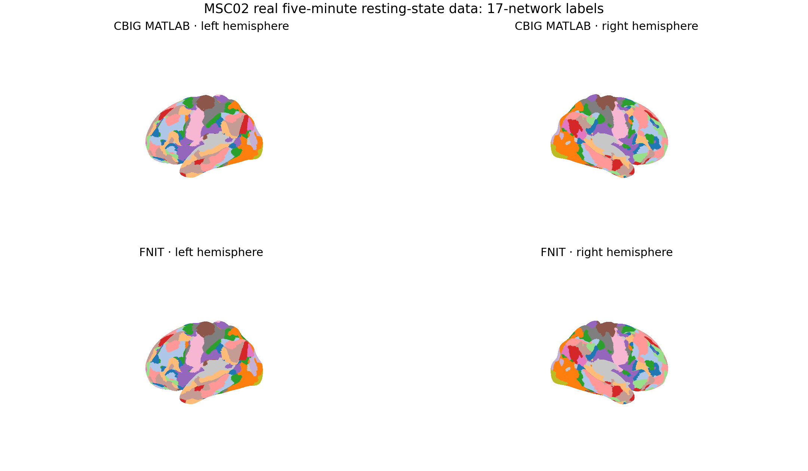

# MS-HBM：fsLR32k 单被试 17 网络划分

`fnit.mshbm` 将静息态 fMRI 皮层时序划分为单被试 17 网络。当前实现固定使用 CBIG Kong2019 MS-HBM 的 HCP_40 group prior，只支持 fsLR32k cortex；计算使用 NumPy/SciPy CPU，不调用 MATLAB、CBIG、FreeSurfer 或 Workbench。

随包资产包含 HCP_40 17-network prior、fsLR32k medial-wall mask、fs_LR_900 seed 和 mesh adjacency，来源为 CBIG commit `b69b822a15e2a94f1e439606552fc44b6858cf3c`，许可证为 CBIG MIT。

## 输入

CLI 支持以下单被试输入：

| 输入 | shape / 格式 | 含义 |
|---|---|---|
| `--timeseries` | 一个或多个 `.npy` 或 `.dtseries.nii` | 每个文件是一节 session；`.npy` 可为 `time×59412`、`59412×time`、`time×64984` 或 `64984×time` |
| `--censor` | 每个时序对应一个 0/1 文本向量，可省略 | 一行对应一个 frame；1 保留，0 剔除 |
| `--assets` | `.npz`，可省略 | 自定义资产；省略时使用随包 HCP_40 fsLR32k 资产 |
| `--w` | 浮点数，默认 200 | group spatial prior 权重 |
| `--c` | 浮点数，默认 50 | mesh MRF 平滑权重 |

CIFTI 通过 nibabel 读取，只取两个 cortex structure，并检查每侧有 32,492 个顶点。64984 列输入包含 medial wall；59412 列输入已经去掉 medial wall。单个时序文件会按未 censor frame 的前后两半拆成两个 pseudo-session，与 CBIG 单 run wrapper 的 `split_flag` 作用一致。多个文件时每个文件作为一节 session，不再拆分。

Python 核心接口只接受已经整理成 `time×59412` 的 NumPy 数组；`.dtseries.nii` 与 64984 列转换由 CLI 的 `read_cortex()` 完成。

## Python 单被试调用

```python
import numpy as np
from fnit.mshbm import load_assets, profiles_from_timeseries, parcellate

assets = load_assets(
    path=None,  # 资产输入：None 使用随包 HCP_40 fsLR32k 17-network 资产
)
series = np.load(
    file="cortical_5min_T_by_59412.npy",  # 输入：time×59412 的皮层时序
    allow_pickle=False,  # 禁止从输入文件反序列化 Python 对象
)
censor = np.loadtxt(
    fname="censor.txt",  # 输入：每个 frame 一个 0/1 值；1 表示保留
)
profiles = profiles_from_timeseries(
    series=series,  # 输入：有限值的 time×59412 float 数组
    assets=assets,  # 输入：load_assets() 返回的 prior、mask、seed 和 mesh
    censor=censor,  # 可选输入：长度等于 frame 数的 0/1 向量
)
labels, history = parcellate(
    profiles=profiles,  # 输入：至少两节 59412×1483、逐行归一化的 session profile
    assets=assets,  # 输入：与 profile 空间匹配的 HCP_40 资产
    w=200.0,  # group spatial prior 权重
    c=50.0,  # mesh MRF 平滑权重
    max_outer=50,  # subject-level outer iteration 上限
    max_em=101,  # 每个 outer iteration 的 EM 上限
    max_m=300,  # 每次 EM 的 M-step 上限
    max_lambda=101,  # 每次 E-step 的 spatial posterior 更新上限
)
np.save(
    file="labels_fslr32k_64984.npy",  # 输出：完整 fsLR32k 17-network 标签
    arr=labels,  # 64984 个 uint8 标签；medial wall 为 0，网络为 1–17
)
```

`profiles_from_timeseries()` 至少需要 8 个未 censor frame，返回两个 `59412×1483` float32 profile。`parcellate()` 返回：

- `labels`：shape `(64984,)` 的 `uint8` 数组；左右半球各 32,492 个顶点，medial wall 和无效顶点为 0，网络编号按 CBIG HCP_40 固定顺序为 1–17；
- `history`：每个 outer iteration 的字典列表，字段为 `outer`、`em`、`kappa` 和 `cost`，用于检查收敛。

直接 Python 接口不自动写 provenance；需要标准输出目录时使用 CLI。

## 命令行

```bash
fnit-mshbm \
  --timeseries cortical_5min.npy \
  --censor censor.txt \
  --output-dir out/sub-01 \
  --w 200 \
  --c 50
```

参数含义：

- `--timeseries` 后可列一个或多个单被试 session 文件；
- `--censor` 的文件数必须与 `--timeseries` 相同；不 censor 时省略整项；
- `--output-dir` 是该被试的结果目录；
- `--assets` 可替换随包资产；
- `--w`、`--c` 分别控制 group spatial prior 和邻接顶点标签不一致的惩罚。

当前实现为 CPU-only，不接受 `--device`。完整 fsLR32k profile 和 posterior 需要数 GB 内存。

## 输出结构

```text
out/sub-01/
├── labels_fslr32k_64984.npy   # (64984,) uint8；左半球后接右半球，0 为 medial wall
├── lh_labels.npy              # (32492,) uint8；左半球标签
├── rh_labels.npy              # (32492,) uint8；右半球标签
└── provenance.json            # 输入绝对路径、censor、w/c、session 数、收敛记录和来源 commit
```

三个标签数组的顶点次序与标准 fsLR32k CIFTI cortex 次序一致。CLI 当前不写 `.dlabel.nii`；如果下游需要 CIFTI label，调用者应以原 `.dtseries.nii` 的 brain-model axis 建立输出，并保留本页的左右半球和 medial-wall 约定。

## 与 CBIG 原实现对应

对应的 CBIG 简化单被试入口为 `CBIG_MSHBM_parcellation_single_subject.m`。fsLR32k 两节 session 的 MATLAB 调用形式为：

```matlab
params.project_dir = '/myproject/sub1';  % 单被试工作目录
params.censor_list = {'/mydata/sub1/censor1.txt', ...  % 每节 session 的 0/1 censor
                      '/mydata/sub1/censor2.txt'};
params.lh_fMRI_list = {'/mydata/sub1/fs_LR_32k_sess1_surf.dtseries.nii', ...  % session 1 时序
                       '/mydata/sub1/fs_LR_32k_sess2_surf.dtseries.nii'};  % session 2 时序
params.target_mesh = 'fs_LR_32k';  % 固定表面空间
params.w = '200';  % group spatial prior 权重
params.c = '50';  % mesh MRF 权重
CBIG_MSHBM_parcellation_single_subject(params);
```

FNIT 的 `--timeseries` 对应 `params.lh_fMRI_list`，`--censor` 对应 `params.censor_list`，固定 mesh 为 `fs_LR_32k`，`--w/--c` 对应同名参数。官方 wrapper 还负责 CBIG 工程目录与 MATLAB 文件组织；FNIT 直接写上节列出的 NumPy 输出，因此文件布局不相同。算法来源和官方三步工作流见 [CBIG Kong2019 MS-HBM](https://github.com/ThomasYeoLab/CBIG/tree/master/stable_projects/brain_parcellation/Kong2019_MSHBM)。

## 算法范围

每节 session 以 1,483 个 fs_LR_900 seed 计算 Pearson correlation，按整节 profile 的全局 top 10% 二值化，再逐顶点做单位长度归一化。推断交替更新 session-specific vMF direction、共享 concentration、含 mesh MRF 的 spatial posterior 和 subject direction。

本实现只覆盖 HCP_40 prior、17 网络和 fsLR32k cortex。它不训练新的 group prior，也不支持 fsaverage5/6、其他网络数、其他 seed mesh 或 CBIG 的 validation-set 参数搜索。

## 当前真实数据 benchmark

2026-09-27 在 headcw 的 Intel Xeon Gold 6418H 上固定 8 个 BLAS/MATLAB 线程，用 MSC02 的 100-frame、`100×59412` 真实五分钟 fsLR32k 静息态时序运行当前源码。输入按前后各 50 frame 构成两节 pseudo-session。CBIG 参考为 commit `b69b822a15e2a94f1e439606552fc44b6858cf3c` 与 MATLAB R2018b。

| 比较项 | CBIG MATLAB | FNIT 当前源码 | 结果 |
|---|---:|---:|---:|
| session 1 二值 profile | 88,107,996 值 | 88,107,996 值 | 0 个不同 |
| session 2 二值 profile | 88,107,996 值 | 88,107,996 值 | 0 个不同 |
| 完整表面标签 | 64,984 顶点 | 64,984 顶点 | 0 个不同 |
| 皮层标签 | 59,412 顶点 | 59,412 顶点 | 0 个不同 |
| 17 个网络 Dice | 1.000 | 1.000 | 最小值 1.000 |
| 相同冻结 profile 到标签 | 145.71 s | 141.29 s | FNIT 快 1.03 倍 |
| 最大 RSS | 2,680,168 KiB | 2,257,836 KiB | FNIT 少 15.8% |
| 原始 `.npy` 时序到标签 | — | 186.29 s | 含 profile 生成、推断与保存 |

Matched 计时从相同的两份冻结二值 profile 开始，到标签写出结束，均包含解释器启动和文件 I/O。原始时序到标签的 186.29 秒多了相关矩阵与 profile 构建，因此不与 CBIG 的 matched 计时作加速比较。MS-HBM 是 CPU 算法，不使用 CUDA、TF32 或半精度。



上下两行分别为 CBIG MATLAB 和 FNIT，左右列为两个半球。标签逐顶点相同，因此两行视觉一致。机器可读指标、输入 SHA-256、峰值内存、计时和当前源码哈希见 [`validation/mshbm/report.public.json`](../../validation/mshbm/report.public.json)；复现步骤见 [`validation/mshbm/README.md`](../../validation/mshbm/README.md)。

该 benchmark 只覆盖一名真实被试、一个五分钟 run 和 HCP_40 17-network 配置。结果证明本例的 profile 与最终标签数值等价，不代表其他队列、时长或采集协议已完成验证。
