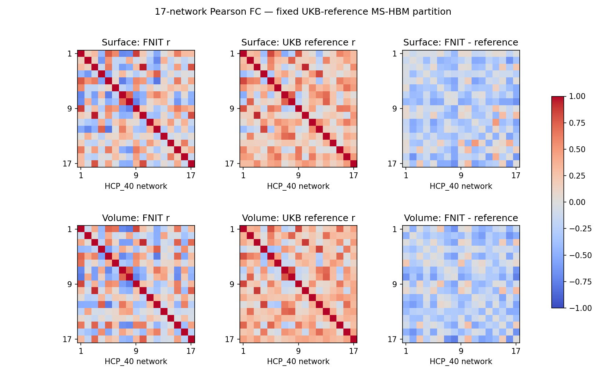

# MS-HBM：fsLR32k 单被试 17 网络划分

`fnit.mshbm` 将静息态 fMRI 皮层时序划分为单被试 17 网络。当前实现固定使用 CBIG Kong2019 MS-HBM 的 HCP_40 group prior，推断只在 fsLR32k cortex 进行。表面输入直接推断；MNI 体积输入先用 PyTorch 采样到 fsLR32k，再推断并映射回体积。MS-HBM 使用 NumPy/SciPy CPU，体积采样与标签映射使用 PyTorch CPU/CUDA，不调用 MATLAB、CBIG、FreeSurfer 或 Workbench。

随包资产包含 HCP_40 17-network prior、fsLR32k medial-wall mask、fs_LR_900 seed 和 mesh adjacency，来源为 CBIG commit `b69b822a15e2a94f1e439606552fc44b6858cf3c`，许可证为 CBIG MIT。

## 输入

CLI 支持以下单被试输入：

| 输入 | shape / 格式 | 含义 |
|---|---|---|
| `--timeseries` | 一个或多个 `.npy` 或 `.dtseries.nii` | 每个文件是一节 session；`.npy` 可为 `time×59412`、`59412×time`、`time×64984` 或 `64984×time` |
| `--censor` | 每个时序对应一个 0/1 文本向量，可省略 | 一行对应一个 frame；1 保留，0 剔除 |
| `--assets` | `.npz`，可省略 | 自定义资产；省略时使用随包 HCP_40 fsLR32k 资产 |
| `--w` | 浮点数，默认 200 | group spatial prior 权重 |
| `--c` | 浮点数，默认 50 | mesh MRF 平滑权重 |

CIFTI 通过 nibabel 读取，只取两个 cortex structure，并检查每侧有 32,492 个顶点。64984 列输入包含 medial wall；59412 列输入已经去掉 medial wall。单个时序文件会按未 censor frame 的前后两半拆成两个 pseudo-session，与 CBIG 单 run wrapper 的 `split_flag` 作用一致。多个文件时每个文件作为一节 session，不再拆分。

Python 核心接口只接受已经整理成 `time×59412` 的 NumPy 数组；`.dtseries.nii` 与 64984 列转换由 CLI 的 `read_cortex()` 完成。

## Python 单被试调用

```python
import numpy as np
from fnit.mshbm import load_assets, profiles_from_timeseries, parcellate

assets = load_assets(
    path=None,  # 资产输入：None 使用随包 HCP_40 fsLR32k 17-network 资产
)
series = np.load(
    file="cortical_5min_T_by_59412.npy",  # 输入：time×59412 的皮层时序
    allow_pickle=False,  # 禁止从输入文件反序列化 Python 对象
)
censor = np.loadtxt(
    fname="censor.txt",  # 输入：每个 frame 一个 0/1 值；1 表示保留
)
profiles = profiles_from_timeseries(
    series=series,  # 输入：有限值的 time×59412 float 数组
    assets=assets,  # 输入：load_assets() 返回的 prior、mask、seed 和 mesh
    censor=censor,  # 可选输入：长度等于 frame 数的 0/1 向量
)
labels, history = parcellate(
    profiles=profiles,  # 输入：至少两节 59412×1483、逐行归一化的 session profile
    assets=assets,  # 输入：与 profile 空间匹配的 HCP_40 资产
    w=200.0,  # group spatial prior 权重
    c=50.0,  # mesh MRF 平滑权重
    max_outer=50,  # subject-level outer iteration 上限
    max_em=101,  # 每个 outer iteration 的 EM 上限
    max_m=300,  # 每次 EM 的 M-step 上限
    max_lambda=101,  # 每次 E-step 的 spatial posterior 更新上限
)
np.save(
    file="labels_fslr32k_64984.npy",  # 输出：完整 fsLR32k 17-network 标签
    arr=labels,  # 64984 个 uint8 标签；medial wall 为 0，网络为 1–17
)
```

`profiles_from_timeseries()` 至少需要 8 个未 censor frame，返回两个 `59412×1483` float32 profile。`parcellate()` 返回：

- `labels`：shape `(64984,)` 的 `uint8` 数组；左右半球各 32,492 个顶点，medial wall 和无效顶点为 0，网络编号按 CBIG HCP_40 固定顺序为 1–17；
- `history`：每个 outer iteration 的字典列表，字段为 `outer`、`em`、`kappa` 和 `cost`，用于检查收敛。

直接 Python 接口不自动写 provenance；需要标准输出目录时使用 CLI。

## 命令行

```bash
fnit-mshbm \
  --timeseries cortical_5min.npy \
  --censor censor.txt \
  --output-dir out/sub-01 \
  --w 200 \
  --c 50
```

参数含义：

- `--timeseries` 后可列一个或多个单被试 session 文件；
- `--censor` 的文件数必须与 `--timeseries` 相同；不 censor 时省略整项；
- `--output-dir` 是该被试的结果目录；
- `--assets` 可替换随包资产；
- `--w`、`--c` 分别控制 group spatial prior 和邻接顶点标签不一致的惩罚。

MS-HBM 推断始终使用 CPU。`--device` 只控制体积采样和标签映射，默认 `cuda:0`；完整 fsLR32k profile 和 posterior 需要数 GB 内存。

## 输出结构

```text
out/sub-01/
├── labels_fslr32k_64984.npy   # (64984,) uint8；左半球后接右半球，0 为 medial wall
├── lh_labels.npy              # (32492,) uint8；左半球标签
├── rh_labels.npy              # (32492,) uint8；右半球标签
├── labels_fslr32k.dlabel.nii  # 1×59412 cortex-only CIFTI label
├── network_timeseries.tsv     # 保留帧×17；各网络的顶点平均时序
├── network_correlation.tsv    # 17×17 Pearson r，行列为网络 1–17
└── provenance.json            # CLI 输入、censor、w/c、session 数、收敛记录和来源 commit
```

三个标签数组的顶点次序与标准 fsLR32k CIFTI cortex 次序一致。CIFTI label 只包含 59,412 个皮层顶点，不包含原 91k dtseries 的皮层下结构。CIFTI 名称为 `HCP40_Network01` 到 `HCP40_Network17`，保留 HCP_40 prior 的固定编号；不将这些编号直接命名为 Yeo2011 的网络。TSV 首行为 17 个网络名。未出现的网络时序及其连接值为 NaN。

## MNI 2 mm 体积输入

MS-HBM 原模型在表面推断。体积接口在解剖中层表面做三线性采样，不对时间做插值或平滑；沿用上述 profile 和推断，再将整数标签写回输入体积网格。标签回写取最近中层顶点，只处理皮层掩膜中的体素，并将距离大于 3 mm 的体素保留为 0。这是 FNIT 的投影接口，不是 CBIG 原生体积分割。

投影需要双侧标准 fsLR32k **解剖表面**，坐标与 BOLD 位于相同 scanner-RAS mm 空间。球面与 inflated 表面不能用于体积采样。可提供该被试配准到 MNI 的 fsLR32k 中层表面；仅有 MNI BOLD 时，下面的安装脚本下载 CBIG 固定版本的群体平均 MNI 中层表面与 FSL MNI152 皮层估计掩膜。群体表面投影不代替个体 ribbon 投影。

```bash
# 从 CBIG 原站下载固定资源并校验大小/SHA-256，将掩膜最近邻重采样到 BOLD 网格。
python tools/setup_mshbm_projection_assets.py \
  --reference sub-01_space-MNI152NLin6Asym_res-2_desc-clean_bold.nii.gz \
  --output-dir assets/mshbm-mni

# 一名被试：MNI BOLD → fsLR32k 时序 → MS-HBM → MNI 皮层标签及网络连接。
fnit-mshbm \
  --volume sub-01_space-MNI152NLin6Asym_res-2_desc-clean_bold.nii.gz \
  --left-surface assets/mshbm-mni/left_mni.surf.gii \
  --right-surface assets/mshbm-mni/right_mni.surf.gii \
  --cortical-mask assets/mshbm-mni/cortical_mask.nii.gz \
  --output-dir out/sub-01-volume --device cuda:0 --frame-chunk 8 \
  --max-distance-mm 3 --w 200 --c 50
```

资源来自 CBIG commit `b69b822a15e2a94f1e439606552fc44b6858cf3c`。固定 FNIT `assets-v1` 中没有这两份解剖表面。CBIG 的 Readme 说明表面源自 Caret；这些文件仅从原站下载，不上传 FNIT Release。资源清单、大小和 SHA-256 固定在 [`assets_setup.py`](../../src/fnit/mshbm/assets_setup.py)。安装阶段使用 SciPy 做一次掩膜最近邻重采样，推断时不联网。默认资源对应 FSL MNI152 / MNI152NLin6Asym；其他 MNI 模板需提供该空间的表面及掩膜。

```python
from fnit.mshbm.assets_setup import prepare_projection_assets
from fnit.mshbm import parcellate_volume

bold_volume = "sub-01_space-MNI152NLin6Asym_res-2_desc-clean_bold.nii.gz"
projection_assets = prepare_projection_assets(
    output_dir="assets/mshbm-mni",  # 安装资源并检查下载内容
    reference=bold_volume,  # 将皮层掩膜放到该 BOLD 的空间网格
)
labels, history = parcellate_volume(
    volume=bold_volume,  # 4D 已处理 BOLD；至少 8 帧，保留原始时间次序
    left_surface=projection_assets["left_surface"],  # 32492×3，左半球 MNI mm
    right_surface=projection_assets["right_surface"],  # 32492×3，右半球 MNI mm
    cortical_mask=projection_assets["cortical_mask"],  # 3D，与 BOLD 同网格
    output_dir="out/sub-01-volume",  # 写出表面标签、网络 TSV 和 labels_mni.nii.gz
    assets=None,  # None 使用随包 HCP_40 MS-HBM prior
    censor=None,  # 可选：每帧 0/1；1 保留
    w=200.0,  # group prior 权重
    c=50.0,  # 邻接标签不一致的惩罚
    device="cuda:0",  # 体积采样和标签映射设备；MS-HBM 推断仍在 CPU
    frame_chunk=8,  # 一次传入 GPU 的帧数，计算保持 float32
    max_distance_mm=3.0,  # 体素中心到最近中层顶点的最大距离
)
```

体积模式的 `--volume` 与 `--timeseries` 二选一；必须同时提供 `--left-surface`、`--right-surface`、`--cortical-mask`。其他新增参数与上面 Python 同名参数含义相同。`--censor` 只接受一个向量。输出增加 `labels_mni.nii.gz`：3D uint8、原 BOLD 的空间尺寸和 affine，背景为 0，网络为 1–17。它不包含时间轴，掩膜外与距离过远的体素为 0；不分割皮层下或小脑。

分步 Python 入口为 `project_volume(volume, left_surface, right_surface, assets=None, device="cuda:0", frame_chunk=8)`，返回 `T×59412` float32；`labels_to_volume(labels, reference, left_surface, right_surface, cortical_mask, output, device="cuda:0", max_distance_mm=3.0)` 接受 `(64984,)` 标签并返回输出路径；`network_timeseries(series, labels, mask, censor=None)` 返回保留帧×17 的网络平均时序。这些接口不自动改变输入空间。

## 与 CBIG 原实现对应

对应的 CBIG 简化单被试入口为 `CBIG_MSHBM_parcellation_single_subject.m`。fsLR32k 两节 session 的 MATLAB 调用形式为：

```matlab
params.project_dir = '/myproject/sub1';  % 单被试工作目录
params.censor_list = {'/mydata/sub1/censor1.txt', ...  % 每节 session 的 0/1 censor
                      '/mydata/sub1/censor2.txt'};
params.lh_fMRI_list = {'/mydata/sub1/fs_LR_32k_sess1_surf.dtseries.nii', ...  % session 1 时序
                       '/mydata/sub1/fs_LR_32k_sess2_surf.dtseries.nii'};  % session 2 时序
params.target_mesh = 'fs_LR_32k';  % 固定表面空间
params.w = '200';  % group spatial prior 权重
params.c = '50';  % mesh MRF 权重
CBIG_MSHBM_parcellation_single_subject(params);
```

FNIT 的 `--timeseries` 对应 `params.lh_fMRI_list`，`--censor` 对应 `params.censor_list`，固定 mesh 为 `fs_LR_32k`，`--w/--c` 对应同名参数。官方 wrapper 还负责 CBIG 工程目录与 MATLAB 文件组织；FNIT 直接写上节列出的 NumPy 输出，因此文件布局不相同。算法来源和官方三步工作流见 [CBIG Kong2019 MS-HBM](https://github.com/ThomasYeoLab/CBIG/tree/master/stable_projects/brain_parcellation/Kong2019_MSHBM)。

## 算法范围

每节 session 以 1,483 个 fs_LR_900 seed 计算 Pearson correlation，按整节 profile 的全局 top 10% 二值化，再逐顶点做单位长度归一化。推断交替更新 session-specific vMF direction、共享 concentration、含 mesh MRF 的 spatial posterior 和 subject direction。

本实现只覆盖 HCP_40 prior、17 网络和 fsLR32k cortex。它不训练新的 group prior，也不支持 fsaverage5/6、其他网络数、其他 seed mesh 或 CBIG 的 validation-set 参数搜索。

## UKB 官方发布数据对照（2026-10-01）

本次使用同一例真实 UKB 扫描的完整 490 帧，TR 0.735 s。surface 参照为用户提供的官方 `surf_fMRI/CIFTIs/bb.rfMRI.MNI.MSMAll.dtseries.nii`；volume 参照为官方 ZIP 的 FIX 清理 BOLD，用 ZIP 中发布的 `example_func2standard_warp.nii.gz` 经原版 FSL `applywarp --interp=spline` 放到 MNI 2 mm。两组候选均取自 2026-09-30 的完整 FNIT volume/surface 运行，不用 FNIT 的投影结果充当官方 release。

候选与参照分别运行相同的 HCP_40 MS-HBM，固定 `w=200`、`c=50`，各自按前后 245 帧拆成两节 pseudo-session。volume 两边共用固定 CBIG 群体中层表面和皮层掩膜。网络 FC 比较固定使用官方输入推断出的标签，先取各网络的平均时序，再比较 17×17 Pearson 矩阵的 136 条非对角边。

| 输出/统计 | Volume 对官方 FIX + FSL warp | Surface 对官方 MSMAll release |
|---|---:|---:|
| 最终标签一致率 | 83.58%（MNI 非零并集） | 72.44%（59,412 皮层顶点） |
| 17 网络平均 Dice | 0.8336（MNI 标签） | 0.7175 |
| 最低网络 Dice | 0.7434 | 0.5978 |
| 固定参照网络 FC 的 r | 0.8456 | 0.8189 |
| FC 的平均绝对差 | 0.2764 | 0.2604 |
| 逐顶点时间相关性均值 | 0.3255（体积采样后） | 0.2695 |
| FNIT 输入到 MS-HBM 输出 | 83.03 s | 78.75 s |
| 官方输入到相同 MS-HBM 输出 | 96.54 s | 73.60 s |

计时只包含读取**已处理时序**、profile、MS-HBM、标签/网络文件写出；volume 还包含采样和标签回写。两边使用相同 FNIT MS-HBM，不是 MATLAB 与 Python 的速度比较，也不包含上游 UKB/FNIT 预处理。官方 volume 的 FSL 变换另耗时 558.38 s；完整官方预处理时间未知。CPU 固定 8 个 BLAS 线程，GPU 为共享 H100；本例计时不代表稳定加速比。




两份输出仍不等价。官方数据使用 FIX、GDC/B0 校正与 MSMAll；FNIT 本次运行采用 ICA-AROMA 和混杂回归、未启用 GDC/B0，表面配准为 MSMSulc。官方 CIFTI provenance 还记录了 2 mm FWHM 表面平滑。当前对照同时包含这些差异，不能将它们全部归因于 MS-HBM。两边共享空间先验，因此网络图相似度也不能代替时序和连接值的一致性。

真实前八帧的 GPU 三线性采样与 SciPy 独立插值比较为 `r=0.9999999999928`，MAE 0.000313；最大绝对差 0.01514（原始 BOLD 强度单位）。该结果验证采样坐标与插值，不验证整条 fMRI 预处理。单被试 Python/CLI 接口与 CPU/CUDA 坐标测试见[完整验证说明](../../validation/mshbm/processed_release.md)，其中记录每个网络 Dice、资源和输入 SHA-256、代码版本与计时。

## CBIG 算法数值对照

2026-09-27 在 headcw 的 Intel Xeon Gold 6418H 上固定 8 个 BLAS/MATLAB 线程，用 MSC02 的 100-frame、`100×59412` 真实五分钟 fsLR32k 静息态时序运行当时的发布源码。输入按前后各 50 frame 构成两节 pseudo-session。CBIG 参考为 commit `b69b822a15e2a94f1e439606552fc44b6858cf3c` 与 MATLAB R2018b。

| 比较项 | CBIG MATLAB | FNIT 当前源码 | 结果 |
|---|---:|---:|---:|
| session 1 二值 profile | 88,107,996 值 | 88,107,996 值 | 0 个不同 |
| session 2 二值 profile | 88,107,996 值 | 88,107,996 值 | 0 个不同 |
| 完整表面标签 | 64,984 顶点 | 64,984 顶点 | 0 个不同 |
| 皮层标签 | 59,412 顶点 | 59,412 顶点 | 0 个不同 |
| 17 个网络 Dice | 1.000 | 1.000 | 最小值 1.000 |
| 相同冻结 profile 到标签 | 145.71 s | 141.29 s | FNIT 快 1.03 倍 |
| 最大 RSS | 2,680,168 KiB | 2,257,836 KiB | FNIT 少 15.8% |
| 原始 `.npy` 时序到标签 | — | 186.29 s | 含 profile 生成、推断与保存 |

Matched 计时从相同的两份冻结二值 profile 开始，到标签写出结束，均包含解释器启动和文件 I/O。原始时序到标签的 186.29 秒多了相关矩阵与 profile 构建，因此不与 CBIG 的 matched 计时作加速比较。该推断部分使用 CPU，不使用 CUDA 或半精度。新增体积投影使用 CUDA；没有改变 `core.py` 的 MS-HBM 算法和固定 prior。


上下两行分别为 CBIG MATLAB 和 FNIT，左右列为两个半球。标签逐顶点相同，因此两行视觉一致。机器可读指标、输入 SHA-256、峰值内存、计时和该次源码哈希见 [`validation/mshbm/report.public.json`](../../validation/mshbm/report.public.json)；复现步骤见 [`validation/mshbm/README.md`](../../validation/mshbm/README.md)。

该 benchmark 只覆盖一名真实被试、一个五分钟 run 和 HCP_40 17-network 配置。结果证明本例的 profile 与最终标签数值等价，不代表其他队列、时长或采集协议已完成验证。

## Reference

- 参考文献：Kong et al., *Spatial Topography of Individual-Specific Cortical Networks Predicts Human Cognition, Personality, and Emotion*, Cerebral Cortex (2019), [doi:10.1093/cercor/bhy123](https://doi.org/10.1093/cercor/bhy123)。
- 原实现代码库：[CBIG Kong2019 MS-HBM](https://github.com/ThomasYeoLab/CBIG/tree/master/stable_projects/brain_parcellation/Kong2019_MSHBM)。
