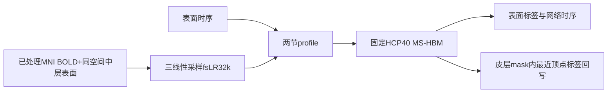
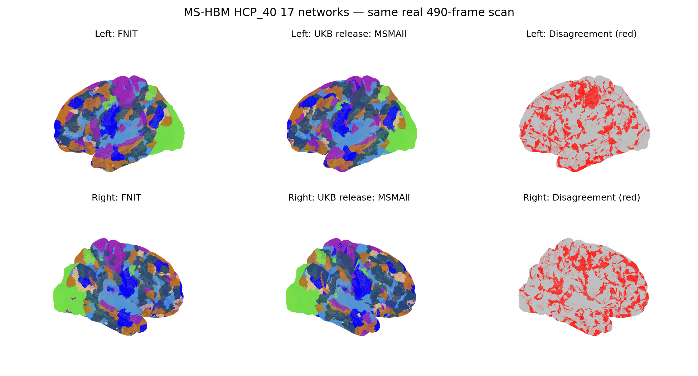
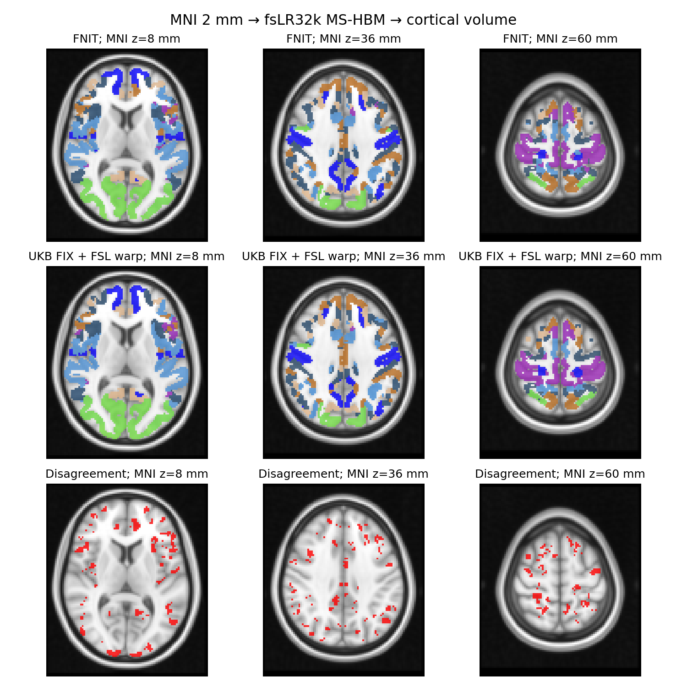

# MS-HBM：单被试 17 网络分区

| 项目 | 内容 |
|---|---|
| 输入 | fsLR32k表面时序，或已处理MNI BOLD与解剖中层表面 |
| 输出 | 左右/完整表面标签、CIFTI、网络时序/相关矩阵及可选MNI标签 |
| 对应原软件 | CBIG Kong2019 MS-HBM，固定HCP_40 prior |
| Python / CLI | fnit.mshbm公开函数 / fnit-mshbm |
| CPU / GPU | MS-HBM推断CPU；体积采样与标签回写CPU/CUDA |

## 1. 功能简介

本功能从一名被试的静息态BOLD时序估计fsLR32k皮层17网络分区，采用CBIG Kong2019 MS-HBM的固定HCP_40群体先验。输入可以是表面时序，也可以是已经配准的MNI BOLD；体积模式先在解剖中层表面采样，再推断并回写皮层标签。

读写使用nibabel，MS-HBM核心沿用经真实数据核对的NumPy/SciPy CPU实现，体积采样与最近顶点映射使用PyTorch。生产运行不调用MATLAB、Workbench、FSL或FreeSurfer。该功能不训练群体先验，也不覆盖其他网络数、fsaverage网格、皮层下或小脑分区。



## 2. Python 调用

```python
from fnit.mshbm import parcellate_volume

surface_labels, inference_history = parcellate_volume(
    volume="/data/bold/clean_mni_bold.nii.gz",  # 已配准到MNI的4D BOLD
    left_surface="/data/assets/left_mni.surf.gii",  # fsLR32k左中层表面，MNI毫米坐标
    right_surface="/data/assets/right_mni.surf.gii",  # fsLR32k右中层表面，相同坐标空间
    cortical_mask="/data/assets/cortical_mask.nii.gz",  # 与BOLD同网格的皮层mask
    output_dir="/data/results/mshbm",  # 表面、MNI标签及网络文件目录
    device="cuda:0",  # 只控制投影/映射，MS-HBM推断仍在CPU
    frame_chunk=8,  # 每批传入GPU的帧数，保留float32
)
```

仅有表面时序时，以下公开接口不自动写文件；可用CLI写出完整结果。

```python
import numpy as np
from fnit.mshbm import load_assets, profiles_from_timeseries, parcellate, network_timeseries

mshbm_assets = load_assets()  # 固定HCP_40先验、mesh邻接及cortex mask
cortical_timeseries = np.load("/data/bold/cortex_timeseries.npy", allow_pickle=False)  # T×59412
session_profiles = profiles_from_timeseries(cortical_timeseries, mshbm_assets)  # 前后半段profile
surface_labels, inference_history = parcellate(session_profiles, mshbm_assets)  # 64984标签及收敛记录
mean_network_timeseries = network_timeseries(
    series=cortical_timeseries,  # 原始保留帧时序
    labels=surface_labels,  # 左右完整顶点标签，包含medial wall
    mask=mshbm_assets["cortex_mask"],  # 64984个布尔值，选择59412皮层顶点
)
```

### 输入数据格式

- 直接Python表面输入：有限二维NumPy `[T,59412]`，读入float32，列次序为固定fsLR32k cortex mask选中的顶点。至少8个保留帧；单run按前后半段生成两节pseudo-session。
- CLI另接受 `.npy` `[T,64984]` 的左右完整顶点或转置矩阵，自动提取59412个皮层顶点；fsLR32k `.dtseries.nii`须有每半球32492顶点的BrainModelAxis，皮层下结构不参与。
- profiles：至少两节 `[59412,1483]` 有限矩阵；Pearson相关按整节全局top10%二值化并逐行单位归一化。需沿用同一prior和seed顺序。
- censor：每原始帧一个0/1，1保留，长度须等于T，不能按秒给出。多session CLI每输入文件对应一个censor文件；不用censor则保留所有帧。
- 体积BOLD：4D NIfTI `[X,Y,Z,T]`，T≥8，有限数值，读取float32，已经完成所需前处理并处于所选MNI空间。采样沿用强度单位，不做时间插值/平滑。
- 左右表面：解剖中层GIFTI，各 `[32492,3]` scanner-RAS毫米坐标，fsLR32k固定顶点次序；所有皮层顶点须落在BOLD网格内。球面或inflated表面不能用作体积采样。
- cortical_mask：3D NIfTI，与BOLD/reference完全相同shape、affine、orientation和空间单位（通常mm）；有限非零值为待回写皮层。排除背景、medial wall、皮层下、小脑，不能把全脑mask当皮层mask。
- 表面矩阵没有NIfTI affine；其空间由fsLR32k顶点编号与解剖表面定义。群体MNI中层表面投影不能代替个体ribbon投影；其他MNI模板要提供同空间表面和mask。
- `load_assets`返回mu、sigma、epsil、theta、cortex_mask、seed_vertices及mesh邻接资产字典。替代NPZ必须保持该固定模型结构，不是任意标签图。

体积分步入口 `project_volume` 返回float32 `[T,59412]`；`labels_to_volume`接受完整64984标签并返回写出的Path。两者都不估计配准变换，坐标须由调用者准备。

**`load_assets` 参数**

| 参数 | 必需 | 类型 | 默认值 | 含义 |
|---|---|---|---|---|
| `path` | 否 | `路径或None` | `None` | 替代资产.npz路径；None用随包HCP_40。 |

**`profiles_from_timeseries` 参数**

| 参数 | 必需 | 类型 | 默认值 | 含义 |
|---|---|---|---|---|
| `series` | 是 | `ndarray` | `—` | 有限值时间×59412皮层NumPy数组，按cortex mask顶点次序。 |
| `assets` | 是 | `dict或None` | `—` | load_assets()返回的固定prior/mask/seed/mesh字典；None用默认资产。 |
| `censor` | 否 | `ndarray或None` | `None` | 每帧0/1向量，1保留；None保留所有帧。 |

**`parcellate` 参数**

| 参数 | 必需 | 类型 | 默认值 | 含义 |
|---|---|---|---|---|
| `profiles` | 是 | `序列[ndarray]` | `—` | 至少两节59412×1483、逐行单位范数的profile。 |
| `assets` | 是 | `dict或None` | `—` | load_assets()返回的固定prior/mask/seed/mesh字典；None用默认资产。 |
| `w` | 否 | `float` | `200.0` | group spatial prior权重。 |
| `c` | 否 | `float` | `50.0` | mesh MRF邻接平滑权重。 |
| `max_outer` | 否 | `int` | `50` | subject outer迭代上限。 |
| `max_em` | 否 | `int` | `101` | 每次outer内EM迭代上限。 |
| `max_m` | 否 | `int` | `300` | 每次EM内M-step迭代上限。 |
| `max_lambda` | 否 | `int` | `101` | 每次E-step spatial posterior更新上限。 |

**`parcellate_volume` 参数**

| 参数 | 必需 | 类型 | 默认值 | 含义 |
|---|---|---|---|---|
| `volume` | 是 | `路径` | `—` | 4D已预处理MNI BOLD，保留时间顺序。 |
| `left_surface` | 是 | `路径` | `—` | 左半球fsLR32k中层GIFTI，32492×3，scanner-RAS毫米坐标。 |
| `right_surface` | 是 | `路径` | `—` | 右半球fsLR32k中层GIFTI，32492×3，scanner-RAS毫米坐标。 |
| `cortical_mask` | 是 | `路径` | `—` | 与BOLD/reference同网格的3D皮层掩膜。 |
| `output_dir` | 是 | `路径` | `—` | 本次结果目录；路径按当前工作目录解析。 |
| `assets` | 否 | `dict或None` | `None` | load_assets()返回的固定prior/mask/seed/mesh字典；None用默认资产。 |
| `censor` | 否 | `ndarray或None` | `None` | 每帧0/1向量，1保留；None保留所有帧。 |
| `w` | 否 | `float` | `200.0` | group spatial prior权重。 |
| `c` | 否 | `float` | `50.0` | mesh MRF邻接平滑权重。 |
| `device` | 否 | `str/torch.device` | `'cuda:0'` | 指定PyTorch设备；默认cuda:0，CPU支持按该入口说明选择。 |
| `frame_chunk` | 否 | `int` | `8` | GPU每批采样帧数，正整数。 |
| `max_distance_mm` | 否 | `float` | `3.0` | 体素中心到中层最近顶点的距离上限，单位mm。 |

**`project_volume` 参数**

| 参数 | 必需 | 类型 | 默认值 | 含义 |
|---|---|---|---|---|
| `volume` | 是 | `路径` | `—` | 4D已预处理MNI BOLD，保留时间顺序。 |
| `left_surface` | 是 | `路径` | `—` | 左半球fsLR32k中层GIFTI，32492×3，scanner-RAS毫米坐标。 |
| `right_surface` | 是 | `路径` | `—` | 右半球fsLR32k中层GIFTI，32492×3，scanner-RAS毫米坐标。 |
| `assets` | 否 | `dict或None` | `None` | load_assets()返回的固定prior/mask/seed/mesh字典；None用默认资产。 |
| `device` | 否 | `str/torch.device` | `'cuda:0'` | 指定PyTorch设备；默认cuda:0，CPU支持按该入口说明选择。 |
| `frame_chunk` | 否 | `int` | `8` | GPU每批采样帧数，正整数。 |

**`labels_to_volume` 参数**

| 参数 | 必需 | 类型 | 默认值 | 含义 |
|---|---|---|---|---|
| `labels` | 是 | `ndarray或映射` | `—` | 显示名映射或64984个0–17标签；具体依对应接口。 |
| `reference` | 是 | `路径` | `—` | 定义标签回写shape/affine的3D或4D MNI NIfTI。 |
| `left_surface` | 是 | `路径` | `—` | 左半球fsLR32k中层GIFTI，32492×3，scanner-RAS毫米坐标。 |
| `right_surface` | 是 | `路径` | `—` | 右半球fsLR32k中层GIFTI，32492×3，scanner-RAS毫米坐标。 |
| `cortical_mask` | 是 | `路径` | `—` | 与BOLD/reference同网格的3D皮层掩膜。 |
| `output` | 是 | `路径` | `—` | 用户指定输出文件路径。 |
| `device` | 否 | `str/torch.device` | `'cuda:0'` | 指定PyTorch设备；默认cuda:0，CPU支持按该入口说明选择。 |
| `max_distance_mm` | 否 | `float` | `3.0` | 体素中心到中层最近顶点的距离上限，单位mm。 |

**`network_timeseries` 参数**

| 参数 | 必需 | 类型 | 默认值 | 含义 |
|---|---|---|---|---|
| `series` | 是 | `ndarray` | `—` | 有限值时间×59412皮层NumPy数组，按cortex mask顶点次序。 |
| `labels` | 是 | `ndarray或映射` | `—` | 显示名映射或64984个0–17标签；具体依对应接口。 |
| `mask` | 是 | `路径` | `—` | 与 DWI 相同 shape、affine 和方向的 3D 脑掩膜。 |
| `censor` | 否 | `ndarray或None` | `None` | 每帧0/1向量，1保留；None保留所有帧。 |

### 输出

```text
mshbm/
├── labels_fslr32k_64984.npy
├── lh_labels.npy
├── rh_labels.npy
├── labels_fslr32k.dlabel.nii
├── network_timeseries.tsv
├── network_correlation.tsv
├── labels_mni.nii.gz        # 只在volume模式
└── provenance.json          # CLI附加；直接Python不写此文件
```

| 输出 | 格式与意义 |
|---|---|
| surface_labels | uint8 `[64984]`；前32492左、后32492右，0为medial wall/背景，1–17为HCP_40固定编号。 |
| lh/rh_labels.npy | uint8 `[32492]`；各半球完整顶点次序。 |
| CIFTI label | int32 `[1,59412]` cortex-only；LabelAxis名称HCP40_Network01–17，不包括91k dtseries中的皮层下结构。 |
| labels_mni.nii.gz | uint8 `[X,Y,Z]`，原BOLD/reference affine、orientation，label intent；mask外、medial wall及距离>max_distance_mm为0。 |
| network_timeseries.tsv | 有表头 `[T保留,17]`，float64平均BOLD，沿用输入强度单位。 |
| network_correlation.tsv | 有表头 `[17,17]` Pearson相关，无量纲；未出现网络的时序/连接为NaN。 |
| inference_history | 每次outer的收敛记录，由parcellate/parcellate_volume返回；不是空间变换。 |
| provenance.json | CLI记录输入路径、prior版本、w/c、projection设备及历史，保留在用户结果目录。 |

标签回写方向为fsLR32k中层顶点标签→reference体素中心的最近顶点，不是体积形变场。网络编号不直接重命名为Yeo2011编号；固定编号顺序用于下游FC比较。

## 3. 命令行调用

```bash
fnit-mshbm --timeseries /data/bold/run1.dtseries.nii \
  --output-dir /data/results/surface_mshbm --w 200 --c 50

fnit-mshbm --volume /data/bold/clean_mni_bold.nii.gz \
  --left-surface /data/assets/left_mni.surf.gii \
  --right-surface /data/assets/right_mni.surf.gii \
  --cortical-mask /data/assets/cortical_mask.nii.gz \
  --output-dir /data/results/volume_mshbm --device cuda:0 --frame-chunk 8
```

| CLI参数 | Python对应 | 说明/默认 |
|---|---|---|
| --timeseries | profiles_from_timeseries→parcellate | 与volume二选一；一个或多个NPY/CIFTI；一个输入拆半，多输入各为一节。 |
| --volume | parcellate_volume.volume | 与timeseries二选一；4D MNI BOLD。 |
| --censor | censor | 每输入一个0/1文本；volume模式恰好一个。 |
| --left-surface/--right-surface | 同名参数 | volume模式必需，解剖中层表面。 |
| --cortical-mask | cortical_mask | volume模式必需，相同体积网格。 |
| --output-dir | output_dir | 必需，保存上述完整文件。 |
| --assets | load_assets.path | 可选替代NPZ；默认随包HCP_40。 |
| --w / --c | w / c | 200.0 / 50.0。 |
| --device | device | 默认cuda:0，只控制体积采样/映射。 |
| --frame-chunk | frame_chunk | 默认8。 |
| --max-distance-mm | max_distance_mm | 默认3.0 mm。 |

公共Python可调四个推断迭代上限；CLI未暴露它们，使用默认值。输出目录不会通过overwrite开关保护已有结果，调用前为本次任务选择新目录。

## 4. 原软件调用

对应CBIG简化单被试入口 `CBIG_MSHBM_parcellation_single_subject.m`，在独立MATLAB/CBIG环境调用；路径指向同一被试的两节真实表面输入。

```matlab
params.project_dir = '/data/reference/mshbm';  % CBIG工作目录
params.censor_list = {'/data/bold/censor1.txt', '/data/bold/censor2.txt'};  % 每节0/1
params.lh_fMRI_list = {'/data/bold/run1.dtseries.nii', '/data/bold/run2.dtseries.nii'};  % fsLR32k时序
params.target_mesh = 'fs_LR_32k';  % 固定网格
params.w = '200';  % 空间先验权重
params.c = '50';  % mesh MRF权重
CBIG_MSHBM_parcellation_single_subject(params);
```

| FNIT | CBIG |
|---|---|
| timeseries / censor | params.lh_fMRI_list / params.censor_list |
| output_dir | params.project_dir；文件组织不同 |
| w / c | 同名权重 |
| 固定prior/mesh | HCP_40、17网络、fs_LR_32k |
| project_volume / labels_to_volume | FNIT新增投影/回写，CBIG此wrapper无原生体积入口 |

原wrapper负责profile工程文件与subject-level inference。FNIT固定HCP_40模型，不覆盖group prior训练、fsaverage5/6、其他网络数、其他seed mesh或validation-set参数搜索。

## 5. 最新精度和运行时间

最新完整 CPU 精度、1/8 物理核速度、分步骤时间与官方/GPU 验证状态见 [2026-10-04 CPU benchmark](cpu_benchmark_20261004.md)。本轮将固定有效顶点 profile 一次转换为 float64；完整 profile、标签与科学输出已完成冻结版本对照。 完整 490 帧官方 CBIG 对照已完成：固定 64,984 顶点的 CPU1 差 1 个标签、CPU8 全部相同；优化 FNIT 完整函数链为 603.380/181.457 s，官方为 1741.111/1199.323 s。节点负载约 2,415–2,539，各为一次完整运行观测。 同 run 额外 DVARS P95 控制保留465帧并与原版标签一致；无删帧 `w=100/c=25` 控制有79顶点差异（左42、右37），完整控制已确认旧、新 FNIT 标签一致，二者相对原版均有上述 79 顶点差异；来源与结果见[可选参数控制](cpu_benchmark_20261004.md#相同真实输入的可选参数控制)。

最新正式[2026-10-01已处理真实volume/surface对照](../../validation/mshbm/processed_release.md)绑定MS-HBM `09a0313c53e5d9f6e4a3c49a35022462718c9f15`，上游BOLD为 `3f8b756`；1例同扫描490帧，TR0.735 s。参考为原官方MSMAll CIFTI以及官方FIX+BOLD warp经FSL6.0.7.22生成的MNI BOLD；官方完整pipeline commit未记录。本轮未重跑MRI，源码SHA匹配结果见审核JSON。

两边均运行相同FNIT MS-HBM，先验/w/c相同；比较衡量上游处理差异，不能读作MATLAB与Python速度比较或完整pipeline加速比。8个BLAS线程、共享H100；信号float32、推断float64、GPU投影TF32，不用半精度。

| 结果 | Volume | Surface |
|---|---:|---:|
| 最终标签一致率 | 83.58%（MNI非零并集） | 72.44%（59412皮层顶点） |
| 平均/最低网络Dice | 0.8336 / 0.7434 | 0.7175 / 0.5978 |
| 固定参考标签FC r / MAE | 0.8456 / 0.2764 | 0.8189 / 0.2604 |
| FNIT已处理输入→文件输出 | 83.03 s | 78.75 s |
| 官方已处理输入→相同FNIT输出 | 96.54 s | 73.60 s |

计时含读取、profile、推断及文件输出；volume另含采样和回写。官方warp558.38 s另列，官方上游预处理时间未记录。官方用FIX、GDC/B0与MSMAll，候选用ICA-AROMA/混杂回归、无GDC/B0与MSMSulc；官方另有2mm表面平滑。本例未达到官方数值等价。

| 单阶段/完整API核查 | 已记录结果 |
|---|---|
| 八帧采样对独立SciPy，475296值 | r0.9999999999928，MAE0.0003133，max0.0151367原强度单位；GPU0.6678 s，allocated0.07553 GiB。 |
| 完整体积Python API | 87.2879 s，allocated/reserved0.17050/0.29883 GiB；Xeon Gold6430+H100PCIe、8线程；CLI与Python标签差异0。 |
| 其余profile/推断/回写阶段 | 未独立记录，不由总时间推算。 |

真正的[CBIG算法对照](../../validation/mshbm/report.public.json)为2026-09-27 MSC02五分钟100帧、CBIG `b69b822a`/MATLABR2018b，XeonGold6418H、8线程CPU。相同两份profile到标签含启动/I/O：FNIT141.29 s、CBIG145.71 s；64984标签全同、各网络Dice1。原NPY到FNIT标签186.29 s的范围不同，不能混作matched时间。该单例不扩展为多队列等价。






<!-- FNIT-UNIFIED-BENCHMARK-20261008 -->
### 本轮统一 benchmark 摘要（2026-10-08）

真实 490 帧、8 线程：FNIT **603.380 s**，官方 **1741.111 s**；优化版输出与官方在 CPU8 全部标签一致（CPU1 有 1 个标签差异）。MSC02 100 帧配对为 FNIT **141.29 s**、CBIG **145.71 s**，64,984 标签逐值一致、Dice=1；本轮没有新的可复核 GPU 端到端时钟。见 [统一 benchmark 索引](../BENCHMARK_INDEX.md)。

## 6. 最近版本和 benchmark

| 日期 | commit/version | 变化 | benchmark |
|---|---|---|---|
| 2026-10-06 | `assets_setup.py`空间单位修复 | 投影资源安装器继承reference空间单位，修复输出mask单位丢失；API/体素/affine/dtype不变。 | [真实模板缓存保存回放](../../validation/assets_release_20261006/mshbm_units_fix.public.json)；没有重测MRI benchmark。 |
| 2026-10-01 | 22d2faf0 | 发布已处理volume/surface对官方release对照 | 冻结09a0313推断、3f8b756上游；非同算法speedup |
| 2026-10-01 | 09a0313c | 公开体积API、CIFTI和网络TSV | 真实490帧、独立八帧插值、Python/CLI标签一致 |
| 2026-09-28 | 2ad53c5b | 真实MSC02与CBIG算法审核 | profile/64984标签全同；核心SHA未变 |
| 2026-09-26 | 2c651048 | 新增固定HCP40 17网络CPU模块 | 后续真实算法对照见2026-09-27报告 |

更早的debug、profiling和长表保留在[旧README归档](../../validation/mshbm/readme_archive_20261005.md)。归档已修复相对链接；旧科学报告与原始产物不修改。

<a id="输入"></a>
<a id="python-单被试调用"></a>
<a id="命令行"></a>
<a id="输出结构"></a>
<a id="mni-2-mm-体积输入"></a>
<a id="与-cbig-原实现对应"></a>
<a id="算法范围"></a>
<a id="ukb-官方发布数据对照2026-10-01"></a>
<a id="cbig-算法数值对照"></a>
<a id="reference"></a>

## 7. 参考文献、原软件和资源

- 文献：Kong等，2019，[Spatial topography of individual-specific cortical networks predicts human cognition, personality, and emotion](https://doi.org/10.1093/cercor/bhy123)。
- 原软件：[CBIG Kong2019 MS-HBM](https://github.com/ThomasYeoLab/CBIG/tree/b69b822a15e2a94f1e439606552fc44b6858cf3c/stable_projects/brain_parcellation/Kong2019_MSHBM)，公开[MIT许可](https://github.com/ThomasYeoLab/CBIG/blob/b69b822a15e2a94f1e439606552fc44b6858cf3c/LICENSE.md)；simple_wrapper中的单被试入口及step2 subject inference。
- FNIT：[core.py](../../src/fnit/mshbm/core.py)、[volume.py](../../src/fnit/mshbm/volume.py)、[output.py](../../src/fnit/mshbm/output.py)、[资源安装器](../../src/fnit/mshbm/assets_setup.py)。

### 外部资源

| 资源 | 用途 | 官方来源 | 大小 | SHA-256 | 是否允许 FNIT 再分发 |
|---|---|---|---|---|---|
| hcp40_fslr32k_17.npz | 固定prior/mesh/seed | [CBIG HCP_40](https://github.com/ThomasYeoLab/CBIG/tree/b69b822a15e2a94f1e439606552fc44b6858cf3c/stable_projects/brain_parcellation/Kong2019_MSHBM) | 1,497,800 bytes | `aece34ff3651a10e44c8905d5eac32a1e322acd5d3b028d54c0fbe05ad3f7c17` | CBIG MIT；FNIT转换资产随包附来源/许可。 |
| left_mni.surf.gii | 左群体MNI中层表面 | [固定CBIG原站](https://raw.githubusercontent.com/ThomasYeoLab/CBIG/b69b822a15e2a94f1e439606552fc44b6858cf3c/data/templates/surface/fs_LR_32k/fsaverage.L.midthickness_mni.32k_fs_LR.surf.gii) | 723,249 bytes | `ac51edc0f61ee988c6d941e073ae3275ef5da509233df9309bdf586b3b31838a` | Caret派生；已按用户确认补充Release，保留来源和引用。 |
| right_mni.surf.gii | 右群体MNI中层表面 | [固定CBIG原站](https://raw.githubusercontent.com/ThomasYeoLab/CBIG/b69b822a15e2a94f1e439606552fc44b6858cf3c/data/templates/surface/fs_LR_32k/fsaverage.R.midthickness_mni.32k_fs_LR.surf.gii) | 710,702 bytes | `6e1c9842efb303945abe0cd780422a9812d1eab59c08d3fa3c72276ec31e6a25` | 同上，已补充Release。 |
| cortex_estimate.nii.gz | 皮层估计mask，最近邻重采样 | [固定CBIG原站目录](https://github.com/ThomasYeoLab/CBIG/tree/b69b822a15e2a94f1e439606552fc44b6858cf3c/stable_projects/registration/Wu2017_RegistrationFusion/bin/liberal_cortex_masks_FS5.3) | 207,362 bytes | `e4d788be332be76d7429855aba8f20c02693625f400905573e9063b4001f0e2b` | 按逐资源许可；命中已发布目录时优先Release，保留固定CBIG来源回退。 |

安装器优先使用已发布并收录[发布目录](../../src/fnit/_release_asset_catalog.json)的三项文件，逐文件核验大小/SHA并原子保存；固定CBIG作者来源作为回退。资源来源与条款见[统一安装说明](../ASSETS.md)。运行前在用户输入BOLD的网格准备资源：

```bash
python tools/setup_mshbm_projection_assets.py \
  --reference /data/bold/clean_mni_bold.nii.gz --output-dir /data/assets/mshbm_mni
```

安装阶段用nibabel/SciPy将cortex estimate最近邻映射为3D uint8 `cortical_mask.nii.gz`，shape/affine和空间单位继承reference；reference单位为mm时输出mm，未记录单位时保留unknown，3D掩膜不设时间单位。生成文件SHA依reference网格和头信息，不套用源文件SHA。运行阶段只读本地资源，不联网。
