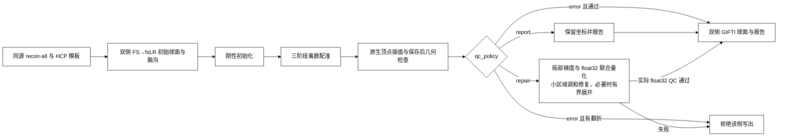

# FNIT MSM：MSMSulc球面配准

| 项目 | 内容 |
|---|---|
| 输入 | 左右原生/初始/参考球面与同顶点脑沟特征 |
| 输出 | 双侧注册球面与配准QC |
| 对应原软件 | newMSM MSMSulc；MSMAll另见专页 |
| Python / CLI | run_msmsulc / fnit-msm msmsulc |
| CPU / GPU | PyTorch CPU/CUDA+包内C++算子；准备用Workbench |

## 1. 功能简介

MSMSulc依据脑沟特征把个体原生球面注册到HCP参考球面，保留原生顶点顺序。默认刚性初始化和三级离散优化；输出球面供后续表面重采样。生产不启动官方MSM或FreeSurfer。

当前算法参照是固定版 `fsl-newmsm 1.0 h442c261_5`。它与 fMRIPrep 25.2.4 容器内的 2019 版 MSM 在刚性初始化的相似度语义上不同：配置中的 `simval=3` 在前者转为 Pearson，在后者使用 NMI。因此本页对固定 newMSM 的严格配对结果，不能延伸为 fMRIPrep 25.2.4 的严格等价结论；两个原版分别比较。

准备阶段使用Connectome Workbench，配准复用包内HOCR/FastPD算子，几何与代价FP64、GIFTI坐标FP32。MSMAll和特征准备分别见[MSMAll](msmall.md)、[特征页](features.md)。pipeline曾暴露首次CUDA峰值重置、双侧统计和空标签shape问题；修复及真实回归见版本表和完整档案。

2026-10-09 的共享球面修复按原版 Octree 的顺序检查候选面。原先只检查全局最近顶点的邻面，会遗漏共享边另一侧的候选，也可能选择原版叶节点不会检查的面；这会改变 DATA 顶点的控制三角形归属，随后影响配准。新实现保留原版构树、包含边界、叶节点顺序和直接兄弟节点回退。GPU 用 PyTorch 批量检查整个叶节点，唯一且远离边界的内点留在 GPU；边界、重叠和缺面情况交给包内原生算子按 literal double 顺序处理。CPU 原生检查按 `cpu_threads` 分配独立查询行，左右半球仍可并行。

这条查面规则同时用于 MSMSulc、MSMAll 和特征/权重重采样，无需安装或加载原版 FSL 库。几何始终为 float64；边界投影使用原版标量顺序，后续 warp 与特征计算保留各自定义。原生构树器保留相关 MIT 许可与来源，见[源码与许可](#7-参考文献原软件和资源)。

优化 CUDA 路径在每份球面快照内缓存三角形的边、法向和判定尺度，三条边一起计算，减少重复索引和小算子启动；跨轮几何更新仍重新建图。输入顶点和 faces 复制为独立快照，避免调用者原地修改 NumPy 数组后，CPU Tensor、Octree 与原生字节使用不同几何。内点和边界的判定门槛、标量运算顺序及 CPU 原生查询保持原定义。



## 2. Python 调用

```python
from fnit import prepare_fmriprep_surface_inputs
from fnit.msm import MSMSulcConfig, prepare_msmsulc_inputs, run_msmsulc

prepared = prepare_fmriprep_surface_inputs(
    subject_dir="/absolute/path/recon-all/sub-0001",  # 已完成 T1w recon-all 的目录
    hcp_assets_dir="/absolute/path/hcp_surface_assets",  # HCP fsLR 资源目录
    output_dir="/absolute/path/work/initial",       # FS→fsLR 初始球面及 ROI 工作目录
    wb_command="wb_command",                         # Workbench 命令
    overwrite=False,                                 # 是否替换准备结果
    parallel=True,                                   # 左右半球独立准备
    cpu_threads=8,                                   # 总 CPU 预算；并行时左右各四个
)
inputs = prepare_msmsulc_inputs(
    subject_dir="/absolute/path/recon-all/sub-0001",  # 与上一步相同的 recon-all 目录
    initial_spheres=prepared.initial_spheres,         # (左球面, 右球面)，原生顶点顺序
    hcp_assets_dir="/absolute/path/hcp_surface_assets",  # HCP 164k 参考球面和 sulc
    output_dir="/absolute/path/work/msm-inputs",    # 双侧球面、sulc、仿射矩阵工作目录
    wb_command="wb_command",                         # Workbench 命令
    parallel=True,                                   # 双侧转换和仿射准备并行
    cpu_threads=8,                                   # 本次准备的总 CPU 预算
)
spheres = run_msmsulc(
    inputs=inputs,                                    # {"L": MSMSulcInputs, "R": MSMSulcInputs}
    output_dir="/absolute/path/work/msm-output",    # 注册球面与 JSON 报告目录
    device="cuda:0",                                 # PyTorch 计算设备，也可为 cpu
    config=MSMSulcConfig(),                           # 默认 HCP 四级配置，也可填官方配置文件路径
    execution="optimized",                          # 缓存和合并传输；reference 用于执行方式对照
    parallel=True,                                   # 左右独立配准；False 保留串行执行
    cpu_threads=8,                                   # 原生查面总 CPU 预算；并行时左右各四个
    qc_policy="report",                             # report/repair/error；默认保留固定 newMSM 兼容插值
)
print(spheres["L"])  # L.sphere.MSMSulc.native.surf.gii
print(spheres["R"])  # R.sphere.MSMSulc.native.surf.gii
```

### 输入数据格式

先用同一 recon-all 结果和 `fnit-setup-fmri-surface-assets --output-dir /absolute/path/hcp_surface_assets --fmriprep` 准备 HCP 参考文件。需要 `surf/lh|rh.{white,pial,sphere,sphere.reg,sulc,thickness}` 和 `mri/orig/001.mgz`；T2w、FLAIR 不参与此配准。`prepare_fmriprep_surface_inputs` 产生的 `initial_spheres` 分别是左、右 FS→fsLR 初始球面，顶点顺序与原生 mesh 相同。

`MSMSulcInputs` 每侧包括 `native_sphere`、`rotated_sphere`、`native_sulc`、`reference_sphere`、`reference_sulc`、`affine` 六个绝对路径，分别保存原生球面、FS→fsLR 旋转球面、原生脑沟图、参考球面、参考脑沟图和初始旋转矩阵。`run_msmsulc` 返回 `{"L": Path, "R": Path}`；每个 `.surf.gii` 含 N×3 顶点坐标及 F×3 三角形索引，可直接用于 Workbench 表面重采样。

`registration_report.json` 记录实际配置、仿射角度、逐级能量、更新数量、停止位置、展开操作、耗时、峰值已分配显存和写出折叠数。球面可传给 `fMRISurface_pipeline(registered_spheres=(spheres["L"], spheres["R"]))` 做固定球面投影对照；使用已注册球面时不再指定 `msm_config`。独立配准输出是工作文件，最终 fMRI 时间序列由 surface 流程写成 BIDS Derivatives。

`qc_policy` 明确控制最终 native sphere 的翻折处理：

- `report`（默认）保留固定 newMSM 兼容的 native 插值坐标；若存在翻折，写入 `native_output_qc_before_repair`、`fold_repair` 和 `orientation_qc="warning"`，不静默改坐标，适合逐版本精度对照。
- `repair` 在写出前做有界局部取向修复，联合检查实际写入的 float32 坐标，并保存修复前后 QC；修复成功时 `orientation_qc="pass"`。这会改变最终坐标，修复后无翻折不能证明与任一原版严格等价。
- `error` 发现翻折时立即报错且不写出该侧球面。

中间 DATA/control 网格仍按原流程逐级检查和展开；该策略只作用于最终 native 插值边界。MSMSulc 本身只需要 native sphere、sulc 和 HCP 参考资源，不需要 T2w 或 FLAIR。

显式 native 修复先做最多 64 次局部检查，尝试邻点均值和有符号面梯度；随后联合搜索一个三角形三个顶点的相邻 float32 坐标，最多 8 次扫描。仍有异常时，从未经修复的已配准 native 坐标重新开始，固定局部区域边界，在切平面上求解邻点均值方程；区域最多向外扩展 16 层，每次最多 2,000 个内点，再做联合量化检查。这里的重启保留已完成的配准，不回到输入参考球面。候选只有在实际 float32 上改善翻折数或最小方向比、且未翻转正常相邻面时才接受；非凸边界的候选也必须经过同一实际检查。

若上述方法未通过，仍可从原 native 坐标分别尝试 128、512、1000 次顺序展开及局部保护。展开本身没有保护正常面的保证，因此另行记录展开后新增翻折。报告列出 `direct_guard`、`direct_quantized`、`raw_harmonic_restart`、`harmonic_quantized` 各阶段、候选/更新数量、停止原因及最终改动顶点数、最大/平均位移；最终是否继续投影由实际保存球面的 QC 决定。局部球面几何使用 float64，逐候选按输出 float32 检查；不会改用 float16。这些有界几何修复在 CPU 完成，左右仍分别执行，主配准的 GPU 路径保持原有计算。 报告中的毫米位移是半径 100 mm 注册球面的坐标弦距，不是皮层解剖表面的位移。

取向 QC 同时保留相对方向比和绝对检查。`folded_output_faces` 保留历史的逐面相对参考语义；`absolute_folded_output_faces` 按参考球面的多数面方向计数，并用于策略判断。若输入参考已有反向面，修正它会使旧相对计数增加；报告因此另列 `absolute_folded_input_faces` 与 `new_relative_folded_output_faces`（仅计算原本正常参考面的新翻转）。最终通过要求实际保存球面的绝对异常面数为零，输入已有异常仍保留在记录中。

在 `fMRISurface_pipeline` 中，前置策略名为 `msmsulc_qc_policy`；可选 MSMAll 合成后的策略名为 `msmall_qc_policy`，二者独立，默认均为 `report`。前者不能代替最终 MSMAll native sphere 的检查，后者不能消除前置阶段的 warning。pipeline 的 `FinalNative` 从实际保存的 float32 球面重新核对拓扑和取向；`OrientationQC` 分别记录 `initial_msmsulc`、`solver_msmall`、`final_native` 与 `all_stages`。使用外部 `registered_spheres` 时不能指定非默认前置策略。完整调用见 [MSMAll 分支与两个 QC 策略](msmall.md#surface-pipeline-的两个可选分支)。

### 输入参数

| 参数 | 必需 | 类型 | 默认值 | 含义 |
|---|---|---|---|---|
| `inputs` | 是 | dict | 无 | L/R 各一份 MSMSulcInputs；本入口不接收 MSMAllInputs。 |
| `output_dir` | 是 | 路径 | 无 | 本次调用的多文件输出目录。 |
| `device` | 否 | str / torch.device / None | `'cuda:0'` | 计算设备；显式 CUDA 不可用时报错。 |
| `config` | 否 | MSMSulcConfig / str / Path / None | `None` | 四级配置对象或官方格式配置路径；None 使用默认配置。 |
| `execution` | 否 | str | `'optimized'` | optimized 使用缓存、批量叶节点检查和合并传输；reference 保留候选几何重算供核对，算法配置相同。 |
| `parallel` | 否 | bool | `True` | 左右半球独立并行；预算1时自动串行。 |
| `cpu_threads` | 否 | int / None | `None` | 双侧合计 CPU 预算，用于包内原生查询；None 读环境/PyTorch 线程设置，不重设调用方的 PyTorch 线程池。 |
| `qc_policy` | 否 | `"report"` / `"repair"` / `"error"` | `"report"` | 最终 native sphere 翻折策略；report 保持固定 newMSM 兼容插值，repair 显式修复，error 拒绝写出。 |

准备接口`prepare_msmsulc_inputs`参数：

| 参数 | 必需 | 类型 | 默认值 | 含义 |
|---|---|---|---|---|
| `subject_dir` | 是 | 路径 | 无 | 已有同被试recon-all格式表面目录，不在本功能重建。 |
| `initial_spheres` | 是 | 左右路径元组 | 无 | 初始FS→fsLR球面，须保留原生顶点顺序。 |
| `hcp_assets_dir` | 是 | 路径 | 无 | 固定HCP参考球面/脑沟及配置目录。 |
| `output_dir` | 是 | 路径 | 无 | 本次调用的多文件输出目录。 |
| `wb_command` | 否 | str / 路径 | `'wb_command'` | Connectome Workbench命令或可执行文件路径。 |
| `parallel` | 否 | bool | `True` | 左右半球独立并行；预算1时自动串行。 |
| `cpu_threads` | 否 | int / None | `None` | 双侧合计CPU预算；None读环境/PyTorch线程设置。 |

每侧`MSMSulcInputs`的六个路径均必需：native_sphere/rotated_sphere/reference_sphere为N×3/F×3 GIFTI mesh，native_sulc/reference_sulc为对应顶点的GIFTI脑沟标量，affine为初始4×4旋转。所有顶点顺序须匹配；球面参考空间由HCP文件定义，不是volume affine。

### 配置参数

| 参数 | 必需 | 类型 | 默认值 | 含义 |
|---|---|---|---|---|
| `simval` | 否 | tuple[int, ...] | `(3, 2, 2, 2)` | 1=SSD，2=Pearson；按固定 newMSM 语义，刚性阶段3转为2。fMRIPrep 25.2.4 所带旧版 MSM 的3为NMI，当前不复现该初始化。 |
| `iterations` | 否 | tuple[int, ...] | `(50, 10, 15, 15)` | 刚性阶段及三级离散配准的最大更新次数。 |
| `control_grid` | 否 | tuple[int, ...] | `(6, 2, 3, 4)` | 各阶段icosphere控制网格级别。 |
| `sampling_grid` | 否 | tuple[int, ...] | `(6, 4, 5, 6)` | 各阶段位移标签网格级别。 |
| `data_grid` | 否 | tuple[int, ...] | `(6, 4, 5, 6)` | 各阶段特征采样网格级别。 |
| `regularization` | 否 | tuple[float, ...] | `(0.0, 10.0, 7.5, 7.5)` | 各层形变正则化权重。 |
| `affine_step_size` | 否 | float | `0.01` | 刚性Euler初始步长，rad。 |
| `affine_gradient_spacing` | 否 | float | `0.5` | 刚性有限差分角度间隔，rad。 |
| `shear_modulus` | 否 | float | `0.4` | 形状应变权重。 |
| `bulk_modulus` | 否 | float | `1.6` | 面积应变权重。 |
| `strain_exponent` | 否 | float | `2.0` | 应变势指数。 |
| `regularization_exponent` | 否 | float | `2.0` | 正则项指数。 |

### 输出

```text
msm-output/
├── L.sphere.MSMSulc.native.surf.gii
├── R.sphere.MSMSulc.native.surf.gii
└── registration_report.json
```

返回L/R→Path字典。球面坐标N×3为float32，faces为有序F×3索引；保留原生顶点拓扑，单位为球面mm。JSON记录设备、配置、逐级能量/停止、时间、峰值统计范围和fold数。MSMAll独立输入/参数见[MSMAll用户手册](msmall.md)；本节不能直接替换为MSMAll配置。

左右总线程cpu_threads=8分为4/4；None读取OMP/PyTorch预算。CUDA模型各用stream；进程峰值不能把双侧报告相加。

## 3. 命令行调用

```bash
fnit-msm msmsulc \
  --inputs-json /absolute/path/msmsulc.inputs.json \
  --output-dir /absolute/path/work/msmsulc \
  --cpu-threads 8 \
  --device cuda:0
```

JSON 顶层含 `L`、`R`；每侧填 `MSMSulcInputs` 的六个文件路径，可用绝对路径或相对清单目录的路径。`--config` 与 `--execution` 对应上述 Python 参数；`--cpu-threads` 为总 CPU 预算，`--no-parallel` 对应 `parallel=False`。MSMAll 命令使用 `fnit-msm msmall`，支持相同执行参数；完整输入和例子见[功能页](msmall.md)。

| CLI 参数 | Python 参数 | 含义 |
|---|---|---|
| `--inputs-json` | `inputs` | L/R六路径；相对路径以JSON目录为基准 |
| `--output-dir / --device / --config` | `output_dir / device / config` | 输出、设备与官方配置 |
| `--execution` | `execution` | optimized/reference |
| `--qc-policy` | `qc_policy` | report/repair/error；最终 native sphere 的翻折策略。 |
| `--no-parallel / --cpu-threads` | `parallel=False / cpu_threads` | 执行与总CPU预算 |

## 4. 原软件调用

以下命令只在独立基准环境中运行。安装器提供的 HCP 配置 SHA-256 为 `46b250404cb2570b4f645d8e53c30fabde799663d61761d61cf54ff110318203`，未指定线程数。对照时复制配置并在末尾追加 `--numthreads=1`；线程数是配置选项。FNIT 不调用官方命令。

### 两个原版的版本和目标函数

| 对照程序 | 版本与二进制 SHA-256 | `simval=3` 的刚性初始化 | 本页结论范围 |
|---|---|---|---|
| 固定 newMSM | `fsl-newmsm 1.0 h442c261_5`；`af5c04246cfeea19233232168acbc1f31266f28b1a7cb6779b8f1bfa32eb9615` | 转为 Pearson（2）。 | FNIT 当前实现的数值参照；严格坐标结论只绑定实际报告的输入、配置与源码。 |
| fMRIPrep 25.2.4 容器内 MSM | `FSL 6.0.2:a4f562d9`、2019 版 `MSM_HOCR`；`3c0cbdb709f7263e08827f44aa57bbaa0eff2647291426ec8a43aa911e11d6e7` | NMI（3）。 | 独立的 fMRIPrep 链对照；不能用固定 newMSM 的零差替代。 |

版本和语义来自实际二进制及对应源码核查；容器构建来源见 [fMRIPrep 25.2.4 Dockerfile](https://github.com/nipreps/fmriprep/blob/25.2.4/Dockerfile.base)，固定 newMSM 来源见本页参考文献。相同 HCP 配置文本并不保证两个程序计算相同目标函数。下列命令明确使用第一行的固定 newMSM，启动前核对其 SHA-256。

```bash
mkdir -p /absolute/path/reference
FNIT_MSM_ORACLE=/absolute/path/fsl-newmsm-1.0-h442c261_5/newmsm
sha256sum "$FNIT_MSM_ORACLE"
cp /absolute/path/hcp_surface_assets/MSMConfig/MSMSulcStrainFinalconf \
  /absolute/path/reference/MSMSulc.singlethread.conf
printf '\n--numthreads=1\n' >> /absolute/path/reference/MSMSulc.singlethread.conf

"$FNIT_MSM_ORACLE" --inmesh=/absolute/path/work/msm-inputs/L.sphere_rot.surf.gii \
  --refmesh=/absolute/path/hcp_surface_assets/global/templates/standard_mesh_atlases/fsaverage.L_LR.spherical_std.164k_fs_LR.surf.gii \
  --indata=/absolute/path/work/msm-inputs/L.sulc.native.shape.gii \
  --refdata=/absolute/path/hcp_surface_assets/global/templates/standard_mesh_atlases/L.refsulc.164k_fs_LR.shape.gii \
  --conf=/absolute/path/reference/MSMSulc.singlethread.conf \
  --out=/absolute/path/reference/L.
```

## 5. 最新精度和运行时间

### 2026-10-09：最终修复版完整配准核心

| 完整双侧 API / s | 原版 CPU8 | FNIT CPU8 | 观测原版/FNIT | A100，CPU 总预算 8 | 对严格官方 CPU1 保存精度 |
|---|---:|---:|---:|---:|---|
| MSMSulc，默认四级，`report` | 507.392 | 347.914 | 1.458 | 130.669 | 两侧 float32 坐标、有序 faces 逐位一致 |
| MSMAll，固定 21C、三级 λ=0.05 | 507.310 | 312.104 | 1.625 | 97.685 | 两侧 float32 坐标、有序 faces 逐位一致 |

同预算 CPU 复测按原版→FNIT 顺序执行，均固定 0–7 核，总预算 8、左右各 4，并行双侧、串行两项 API；CUDA 未初始化。墙钟包括读入、完整求解、球面/报告保存，排除导入、哈希、离线比较和资源监测。上表比值仅描述这一次共享节点配对。A100 核心为另一次观察，TF32 开启、几何/成本 float64、保存 float32，allocator 上限 20 GB；峰值 allocation 2.241/2.266 GB，reserved 最大 7.376 GB。核心不含新特征、native 合成、BOLD 投影或 CIFTI。

FNIT CPU8 和 GPU 四侧对严格原版 CPU1 的角差、弦差均为 0。此次原版 CPU8 本身相对严格 CPU1 有差异：MSMSulc 右侧平均/最大角差 **0.120077/0.935965°**，MSMAll 左侧 **0.032034/0.807579°**，其余两侧相同；FNIT 对新原版 CPU8 的差异等于该原版自身的单/多线程差异。数值精度参照与同预算速度参照分别保留。MSMSulc 默认 `report` 与严格原版同为左右 2/0 翻折；显式 native 修复在完整 surface 单独验收。MSMAll 0/0 属于 solver QC。

最初未配对的 FNIT CPU8 观察为 489.870/479.163 s，保留在原报告中；最新 CPU 比值使用上述新配对。旁路资源记录覆盖部分原版 MSMAll 和 FNIT 记录期，记录内内存失败/CPU throttle 增量为 0，不能单凭该窗口确定跨时段时差原因。GPU 实际加载/编译的 22 个源码依赖与保守误差界版相同，默认 report 未调用新增 native 修复模块。见[最新同预算 CPU 配对](../../validation/msm/native_qc_20261009/a100/final_cpu8_matched.public.json)、[完整 GPU](../../validation/msm/native_qc_20261009/a100/final_gpu8.public.json)、[实际源码一致性](../../validation/msm/native_qc_20261009/a100/clear_to_final_code_identity.public.json)及[逐步骤/历史验证](../../validation/msm/native_qc_20261009/a100/README.md)。

### 最终修复版配准分步骤

| 阶段 / s | CPU8 左 | CPU8 右 | A100 左 | A100 右 |
|---|---:|---:|---:|---:|
| MSMSulc 刚性初始化/准备 | 22.864 | 25.628 | 15.060 | 16.097 |
| MSMSulc 离散第 1 级 | 22.023 | 14.154 | 15.764 | 13.918 |
| MSMSulc 离散第 2 级 | 60.804 | 53.071 | 21.886 | 17.271 |
| MSMSulc 离散第 3 级 | 144.754 | 252.919 | 49.062 | 80.037 |
| MSMSulc 每侧完整调用 | 253.204 | 347.910 | 104.686 | 130.514 |

CPU 为最新配对复测，GPU 为上表所列最终冻结核心的独立观察。左右并行，不能把两侧时间相加为双侧 API；层级时钟包含准备、采样、成本、融合、warp 和展开，不是 GPU kernel 时钟。CPU/GPU 每层迭代数相同，source/control unfold 更新均为 0，未删减计算轮数。原版本轮只测完整命令墙钟，未独立记录层级时钟。见[CPU 分层](../../validation/msm/native_qc_20261009/a100/final_cpu8_phases.public.json)、[GPU 分层](../../validation/msm/native_qc_20261009/a100/final_gpu8_phases.public.json)。

此前缓存优化的同输入 A/B 完整 GPU 观察为 MSMSulc 均值 91.109→83.939 s、MSMAll 72.162→68.859 s，迭代轨迹和保存坐标不变；历史 CPU8 为 157.476/192.269 s。历史与本轮各按实际源码、输入和时段记录。

### 2026-10-09：最终修复版两分支 surface，10/10 例

同一冻结源码完成十例 MSMSulc-only surface、自产 d20/21C，再独立运行 MSMSulc→MSMAll→native composition→投影/CIFTI。两个 native 策略均为 `repair`，A100、CPU 总预算 4、左右各 2，TF32 开启，allocator 上限 20 GB。全部阶段保存球面左右绝对翻折 0/0、无新增正常面翻折；两分支全部 180 帧 finite，实际投影球面与发布球面数组相同。

| 完整测量 / s | 十例均值 | 中位数 | 最小–最大 |
|---|---:|---:|---:|
| Stage A：MSMSulc-only surface API | 270.562 | 259.184 | 224.083–352.201 |
| 本次时序生成 d20/21C | 8.113 | 8.073 | 4.968–12.183 |
| Stage B：MSMSulc＋MSMAll surface API | 345.813 | 338.727 | 261.365–478.690 |
| 连续两分支外层 | 626.908 | 601.855 | 492.216–846.974 |

最大 allocation/reserved 为 **2.390 / 11.044 GB**。外层由独立连续时钟测量，含两次 API、新特征、阶段准备、实际投影输入捕获及输出 QC/保存；导入、CUDA 初始化和前后置哈希审计在时钟外。前序 volume/recon-all 已完成，不计入本轮 surface。C-only 不需 T2w/FLAIR；完整 HCP CA/CAT 另需其相应特征。

本次自产 21C 首例另外重算官方 CPU1/1，并在 GPU 完整重放 MSMAll：左右 float32 坐标、有序 faces 逐位一致，角差/弦差全部为 0，solver 翻折 0/0；GPU API **139.522 s**、allocation **2.275 GB**。严格 CPU1/1 是精度参照，不能作为 CPU8 的速度分母。显式修复后的 native 几何、未修复 solver 数值及独立投影分别验收。

详见[十例完整报告](../../validation/msm/native_qc_20261009/a100/final_surface10.public.json)、[新特征 GPU 精度报告](../../validation/msm/native_qc_20261009/a100/final_case01_actual_gpu_precision.public.json)和[逐步骤验证页](../../validation/msm/native_qc_20261009/a100/README.md#最终修复版完整-surface)。

### 两分支实际球面的独立官方投影对照

首例两分支均用本次完整运行捕获的实际 T1w/MNI 时序、white/pial、面积、ROI 和最终保存球面，独立调用固定 Workbench 2.1.0 及原 NiWorkflows CIFTI 源函数，覆盖全部 180 帧。左右 GIFTI 与 91k CIFTI 共 **56,255,760** 个值逐位一致，MAE、RMSE 和最大绝对误差均为 0；时间/脑结构轴、intent、科学元数据及 540 字节 NIfTI 头一致。

完整 CIFTI XML 字节不同：`Volume` 子节点在 FNIT 中位于两个皮层节点之后，原函数中位于全部 21 个 BrainModel 之后；所有属性、文本及 BrainModel 顺序/内容一致。GIFTI 图像级字段仅 `Provenance`、`ParentProvenance`、`WorkingDirectory` 不同，记录各自命令路径；逐帧元数据相同。

原版仅采样与 CIFTI 组装的 CPU4（左右各2）墙钟分别为 **85.654 / 88.394 s**；该单次对照不含配准、新特征、native 修复或离线比较，不能与完整 surface 的总耗时计算加速比。见[实际球面官方投影报告](../../validation/msm/native_qc_20261009/a100/matched_sphere_sampler.public.json)。

### 2026-10-09：H100 初次查面修复验证

本轮采用同一配对 T1w/fMRI 输入、匹配的初始球面和固定 newMSM 单线程重新核对。修复前 MSMSulc 右侧 CPU/GPU 的平均角差均为约 **0.386151°**，属于共享几何路径差异。原版最终 native 插值自身为左/右 **2/0** 翻折；这与配准精度是两项检查，不能仅凭相同翻折数认定坐标相同，也不能把原版插值的翻折全部归因于 FNIT。

在同一双精度检查点中，旧候选查面与原版有 **7/2,562** 个面号不同：6 个点遗漏了原候选面，1 个点选择了原叶节点之外的面。独立构树器加包内标量选择对 8 个实际迭代、共 **20,496** 次查询的面号和投影逐位相同，1/4 线程结果也相同。原版查面 API 替换的完整单侧诊断进一步确认此错误会传播到最终配准；该诊断用于定位，其时间不作为 FNIT 生产 benchmark。

随后用生产源码顺序运行两个完整双侧 GPU API：每项内部左右并行，总 CPU 预算 8，左右各 4；H100 PCIe、PyTorch 2.5.1 / CUDA 11.8，显存上限 20,000,000,000 字节，实际 TF32 开启，几何与成本 float64，保存坐标 float32。两项均未加载官方查面 helper 或 FSL 运行库。

| 完整双侧配准核心 | GPU API / s | 峰值 Torch allocated / GB | 对固定官方 CPU1 保存坐标及有序 faces | 角差 / 弦差 mean、p95、max | FNIT / 官方左、右翻折 |
|---|---:|---:|---|---|---|
| MSMSulc，默认四级，`qc_policy="report"` | **93.130** | **1.756** | 逐位相同 | **全为 0** | **2、0 / 2、0** |
| MSMAll，21 列 C，三级 `regularization=0.05` | **73.608** | **1.787** | 逐位相同 | **全为 0** | **0、0 / 0、0** |

MSMSulc 保存球面与固定原版严格相同，左侧仍有 2 个翻折，故该次 `report` 几何状态为 warning；它不是修复后 QC 通过的结果。MSMAll 表中检查的是 32k solver 球面，最终 native composition 和 BOLD 输出需由 surface pipeline 分别验证。

| MSMSulc 内部阶段 / s | 左 | 右 |
|---|---:|---:|
| 刚性初始化 | 7.798 | 7.848 |
| 第一级离散配准 | 10.498 | 8.545 |
| 第二级离散配准 | 17.176 | 13.598 |
| 第三级离散配准 | 39.193 | 61.804 |
| 每侧完整调用（含读取、native 插值和保存） | 76.498 | 93.106 |

左右同时执行，不能把两列相加得到双侧墙钟；逐阶段时间也不包含全部读取、初始化及保存开销。完整 API 时间包含输入读取、配准和球面/报告写盘，排除导入、哈希校验、CUDA 初始化、离线精度计算、特征准备和 BOLD 投影。GB 为十进制，显存统计为本任务进程共享峰值。该表是共享 GPU 上各一次观测，不推断稳定加速比。输入、源码、原生扩展、原版球面和配置在运行前后均未改变。实际回执见 [2026-10-09 验证页](../../validation/msm/native_qc_20261009/README.md)与 [GPU 核心报告](../../validation/msm/native_qc_20261009/gpu_cores.public.json)；同预算 CPU 配对与十人 fresh surface 分支另行统计。

### CPU 官方配对与历史修复（2026-10-04/05）

本节以下结果绑定其原输入、配置和源码快照，保留作版本记录；它们不能覆盖 2026-10-09 新配对输入的完整验证。

[2026-10-04 起的 CPU 官方对照](../../validation/fmri_cpu_20261004/task04_msm_surface/README.md)使用相同物理核预算和完整双侧顶点，分别运行上述固定 newMSM、冻结 `cc940273` 与优化候选；原版 1/8 线程和 GPU 旧/新结果分别记录。CPU1 基线完整 MSMSulc 为原版 1550.168 s、FNIT 2185.466 s，角差 L/R mean 0.587 / 0.554°，没有达到严格固定 newMSM 参照。

这次核对发现成熟球面子函数的 CPU 向量除法舍入会改变共享边面归属。已将 CPU float64 无梯度的 Point normalize、tangent、投影除法和 unsigned area 改为 literal double 顺序，并对 containing-face 查询复用静态几何。完整四级候选 CPU1/8 的全部双侧球面坐标与有序 faces 都和固定 newMSM 单线程逐位相同，角差为 0；CPU1/8 球面文件 SHA 相同。这是对 Pearson 初始化原版的结论，尚不是对 fMRIPrep NMI 初始化的验证。固定 newMSM 与候选左侧都存在 1 个取向改变面，右侧为 0，几何检查单独保留。

本次 CPU 移植另发现单点几何路径的标量除法缺陷：NumPy 返回零维标量，直接交给 `torch.from_numpy` 会报错。已用 `np.asarray` 保持标量 Tensor 返回；数组结果不新增运算或复制，原数组及 CUDA 分支保持相同。标量、单三角形距离与旧 Tensor 差分、既有 Point/SphereMap 定向检查共 29 项通过，见[标量修复回执](../../validation/fmri_cpu_20261004/task04_msm_surface/point_scalar_regression_20261006.public.json)。完整批量 benchmark 未触发此缺陷，其源码范围与最终修复的关系单列在[源码语义核对](../../validation/fmri_cpu_20261004/task04_msm_surface/surface_final_source_semantics_20261005.public.json)。

| 完整双侧 MSMSulc | 原版 fresh / s | FNIT fresh / s | FNIT 完整 API / s |
| --- | ---: | ---: | ---: |
| CPU1 | 1537.903 | 455.084 | 452.696 |
| CPU8 | 466.986 | 173.393 | 171.057 |

每项是在 nodecw8 同一 CPU 预算的一次完整运行，fresh 包括程序启动和读写。实际锁内候选源码树 SHA、输入不变检查、负载和 CPU 使用见[最新聚合回执](../../validation/fmri_cpu_20261004/task04_msm_surface/completion_status_20261005.public.json)。CUDA、float32 和梯度运算保留已有 Tensor 路径；最终快照的完整 GPU 回归见下一节；下方历史 GPU 专项保留其实际源码范围。


同一例已有 volume 和 recon-all/graymid、490 帧、TR 0.735 s、STC 关闭，三次均重新准备输入并估计双侧 MSMSulc。表中 MSM 时间**包含准备与配准**，完整 API 另含投影、CIFTI、QC 和最终保存；不包含前序 volume、recon-all、编译、包导入或 CUDA 初始化。

| 同一真实输入 | 旧版 `954ad19` 串行 | 新版 `9f9f63e` 串行 | 新版 `9f9f63e` 并行 |
|---|---:|---:|---:|
| MSM 准备＋双侧配准 | 202.029 s | 116.361 s | **94.773 s** |
| 完整 surface API，扣除捕获 | 436.245 s | 343.056 s | **243.695 s** |
| 物理 H100 | 1 | 1 | 0 |
| 完整 API 峰值 allocated，十进制 GB | 0.344 | 0.644 | 1.049 |

局部 CPU 总预算为 8，并行时左右各 4；CUDA 上限 20 GB、TF32 开启。注册球面、左右 GIFTI 与 CIFTI 的全部数值，及有效科学配置和 21 结构轴/metadata，旧→新版串行、串行→并行均严格相同。卡号和共享负载不同，耗时是各一次完整观测。新版初次在 GPU 1 初始化失败，未进入 API；表中并行为 GPU 0 新目录的成功运行。实际报告、严格 native 编译 SHA、逐侧执行计数及官方差异见[完整验证页](../../validation/fmri/surface_gpu_parallel/README.md)，实测/发布的全部 116 个 runtime 文件另由[源码回溯](../../validation/fmri/surface_gpu_parallel/publication_runtime.public.json)逐项核验。

完整 180 帧 surface 另有几何和时序差异，不能由上面的独立配准零差推断整链通过。对其保存细级几何的[左右各四组完整重放](../../validation/fmri_cpu_20261004/task04_msm_surface/surface_saved_geometry_mapping_aggregate_v1.public.json)，三种 FNIT 选面与官方 Octree 固定同一几何时逐值一致；右侧 2 个源顶点受上游 double 几何舍入影响。未更改选面规则，完整链差异见 [surface 说明](../fmri/surface.md#本轮-cpu-官方测试范围)。

### 本轮 CPU 优化后的完整 GPU 回归（2026-10-05）

同一 H100、CPU 总预算 8、TF32 开启，四级 MSMSulc、一级 MSMAll coarse 和三级 refine 各按旧／新／新／旧运行四个新进程，每个只调用一次完整双侧 API。保留全部顶点和原配置迭代，12 次均完成；所有重复和新旧配对的坐标、有序 faces 逐位相同。严格原生扩展 SHA 为 `69fda883c5022d412172eba2de164b79726d18c068b7c421a200b331b6502ad8`。

| 完整双侧功能 | 旧版 A1 / A2 | 优化版 B1 / B2 | 最大 Torch allocated / reserved | 最大本任务进程树显存 |
|---|---:|---:|---:|---:|
| MSMSulc 四级 | 122.910 / 94.794 s | 112.039 / 105.074 s | 1.098 / 1.449 GB | 2.074 GB |
| MSMAll coarse 一级 | 17.887 / 27.212 s | 29.399 / 28.669 s | 0.235 / 0.440 GB | 1.065 GB |
| MSMAll refine 三级 | 142.121 / 140.804 s | 138.971 / 141.350 s | 1.866 / 3.536 GB | 4.161 GB |


图中每点是一次完整 API；显存柱为该功能四次调用的最大值，GB 为十进制。本次 coarse 的优化版观测较慢；该组 A1 在恢复前，后续调用在共享 H100 利用率接近 100% 的时段执行，不能据此确定稳定速度变化。MSMSulc/refine 的新旧时间接近。CPU 专用修复保留 CUDA 分支，输出一致性已完整验证。第六个进程曾在设置显存上限时 CUDA 初始化失败，尚未进入 API；保留前五个成功结果，独立重试剩七个。所有实际调用的本任务进程树显存低于 20 GB。[完整 GPU 回执](../../validation/fmri_cpu_20261004/task04_msm_surface/gpu_registration_abba_final_recovery_v1.public.json)记录两份冻结绑定、输入和源码不变检查、采样负载与全部几何误差。

### 共享 MSMAll 真实回归

共享 MSMAll 另用同一真实 C 特征复测：旧版串行→新版并行，coarse 一级 **23.237→11.430 s**，refine 三级 **181.790→90.796 s**，两侧注册坐标/拓扑/GIFTI metadata 严格相同。四次均为 GPU 0、CPU 总预算 8，新版 allocated 峰值 **0.2194 / 1.4662 GB**；计时包含既有特征读取、配准和写盘，不含特征估计或 BOLD 投影。历史保存的单线程官方球面坐标/拓扑也相同，metadata 不同，且缺历史逐输入 SHA，仅作为保存结果回归。详细边界见[真实 MSMAll 配对](../../validation/fmri/surface_gpu_parallel/msmall_paired.public.json)。

### 原软件精度与几何质量

这1例完整490帧对独立单线程官方链，角差均值左0.221050°、右0.319595°，CIFTI时间相关均值0.977911，仍非逐值等价。报告分别绑定954ad19/9f9f63e，CPU总预算8、H100、TF32、20GB上限，计算FP64/保存FP32；官方版本及runtime/native源码SHA见[来源记录](../../validation/fmri/surface_gpu_parallel/publication_runtime.public.json)。官方配准阶段未取得同口径时钟。

历史质量诊断发现一例保存球面出现1个新增反向面，不能当几何质量通过；[CON10保存质量](../../validation/fmri/public_ten_20261003/reconstruction_completed/CON10.saved-MSM-absolute.public.json)。完整MSM独立函数本轮未新增公开脑图；[历史专项球面可视化与证据](../../validation/msm/README.md)。


<!-- FNIT-UNIFIED-BENCHMARK-20261008 -->
### 本轮统一 benchmark 摘要（2026-10-08）

MSMSulc FNIT 双侧冷/热 **201.99/198.08 s**，固定 newMSM 单线程/8线程 **1587.70/378.03 s**；该 Pearson 初始化专项中的固定 490 帧 fsLR32k/91k 输出逐值一致，不代表 fMRIPrep 25.2.4 的 NMI 初始化完整链等价。MSMAll C 模式 coarse **23.237→11.430 s**、refine **181.790→90.796 s**，坐标和拓扑严格一致。MSMAll 数字是完整双侧 `run_msmall` 配准核心（含输入读取和 sphere/report 写盘），不含特征估计、BOLD 投影、CIFTI 或完整 `fMRISurface_pipeline`；现有公开真实特征与 native sphere 网格不匹配，暂不冒充 full-surface E2E。CPU 严格配对与共享 H100 的边界仍按本页既有报告解释。见 [统一 benchmark 索引](../BENCHMARK_INDEX.md)。

历史提交 `925c5866` 延迟了 optimized CUDA + source-precision 的 query/nearest 主机复制，保留当时的 CPU/reference/fallback 顺序。其最近顶点证明不等于原版 Octree 候选面集合的等价证明；该路线由 2026-10-09 的原顺序叶节点检查替换。该提交当时的 sphere execution/CPU 回归为 **14 passed, 5 skipped**；需要 `_fastpd_native` 的 source-precision 测试因环境缺少扩展而未计入通过，原记录保留。


### 本轮 native sphere QC policy 真实验证（2026-10-08）

[匿名聚合报告](../../validation/msm/msmsulc_qc_policy_con01.public.json)使用同一真实单被试、H100 PCIe、CPU 总预算 8 和 optimized 执行。`report` 用时 **157.970 s**，左/右翻折面为 **2/0**，最小方向比为 **−4.375429/0.505472**；同输入的 fMRIPrep 25.2.4 路径也为左 2、右 0，但双方刚性目标函数不同；相同翻折数量不能证明相同坐标或相同错误来源，因此 FNIT 结果记为几何 warning，单独评估与该版本的精度。显式 `repair` 用时 **169.099 s**，左侧移动 9 个顶点后翻折面为 **0/0**，最小方向比为 **0.003251/0.505472**；修复改变 native 坐标，不能作为严格官方等价结果。该验证不需要 T2w 或 FLAIR。该版源码独立复跑为 `report=108.706 s`、`repair=114.151 s`，QC 字段完全一致；这是共享节点上的单次墙钟观察，公开对照表保留原始测量值。

## 6. 最近版本和 benchmark

2026-10-04 起：新增 CPU1/8 完整官方对照、Point 舍入修复和 containing-face 缓存；最新 CPU 实测与最终 GPU 配对分别记录。

| 实测或更新 | 范围与记录 |
|---|---|
| 2026-10-09 原顺序展开与保存后 QC | 新生成的 21C 暴露了标量归约顺序误差；独立原生展开保留原版运算顺序，真实首次分歧处 4,645 次更新后的 float64 坐标逐位一致。native QC 增加多数方向的绝对翻折及原本正常面的新增翻折，保留旧相对计数。显式修复使用局部梯度、联合 float32 量化与固定边界调和重启；真实薄面病例最终 0 翻折、无新增正常面翻折。相关本地测试 496 passed、44 skipped；实际 CUDA focused 110 passed、0 skipped。 |
| 2026-10-09 A100 固定几何缓存 | 三边批量判定保持原版叶候选和 double 顺序；两次均值 MSMSulc 91.109→83.939 s、MSMAll 72.162→68.859 s，保存坐标、面序和迭代轨迹不变。CPU8 为 157.476/192.269 s，对照原版同预算 346.568/308.102 s；显存代价及严格单线程参照单独记录。 |
| 2026-10-09 原顺序 Octree 共享修复 | MSMSulc/MSMAll 和特征、权重重采样检查原版叶候选；GPU 批量内点与原生边界共用同一规则。生产双侧 GPU API 为 **93.130 / 73.608 s**，四侧保存坐标、faces 对固定官方 CPU1 逐位一致；MSMSulc report 仍为 2/0 warning。完整 pipeline 与配准核心分别记录。 |
| 2026-10-09 原版语义核对 | 区分固定 newMSM 的 Pearson 初始化与 fMRIPrep 25.2.4 所带 MSM 的 NMI 初始化；同一配置值3的计算含义不同，严格配对结果按原版分别解释。 |
| `msmsulc_qc_policy` | 默认 `report` 保留固定 newMSM 兼容 native 插值；`repair` 和 `error` 为显式 QC 分支，真实单例结果见上文聚合报告。 |
| `FinalNative` 与 `msmall_qc_policy` | 前置 MSMSulc 和最终 MSMAll native sphere 独立选择 report/repair/error；以实际保存的 float32 GIFTI 作最终检查，逐阶段记录取向状态，修复后 0 翻折不代替官方精度对照。 |
| `9f9f63e` GPU 重采样与双侧并行 | 严格最近邻证明、有序 GPU CSR、独立 stream 与原生 GIL 释放；完整 surface 的球面/490 帧时序保持旧版数值。MSM 准备＋配准串行/并行为 **116.361 / 94.773 s**，完整 API 为 **343.056 / 243.695 s**；两次物理 GPU 不同。修复调用方峰值统计和空标签形状，见[最新完整复测](../../validation/fmri/surface_gpu_parallel/README.md)。 |
| `925c5866` 延迟 source-precision D2H | optimized CUDA 路径延迟 query/nearest 主机缓存，保持 CPU/reference/fallback 精度顺序；14 项 sphere execution/CPU 测试通过，5 项跳过。完整 GPU 稳定加速比待匹配 MSMAll 特征复测。 |
| `4f7bd9f2` 独立 MSMSulc | 修复缓存面积、浮点配置、刚性 WLS 和 Rodrigues 顺序；本例保存球面及固定 clean 时序与固定 newMSM/Pearson 原版逐值相同，见上表和[专项报告](../../validation/msm/current.public.json)。 |
| `7102c187` 完整 surface 历史 | 重新准备几何、估计球面并投影 preproc；CIFTI 时间 r 均值 0.977911，范围包含完整 surface，见[历史完整报告](../../validation/fmri/surface_e2e/README.md)。 |
| 2026-10 MSMAll 扩展 | 新增独立 MSMAll、VN/DR/WRN 与 C/CA/CAT 特征准备；共享应变成本保留既有 MSMSulc 运算顺序。MSMAll 的真实 C 模式结果单独记录，以上测量保留原源码快照。 |

## 7. 参考文献、原软件和资源

当前 FNIT 刚性初始化匹配固定 newMSM 的 Pearson 语义；不复现 fMRIPrep 25.2.4 所带 2019 MSM 的 NMI 初始化。源码位置：[newMSM 固定提交 2607189](https://github.com/rbesenczi/newMSM/tree/260718953547743c028a45f8c885d163441df87a)；[原 FastPD 目录](https://github.com/rbesenczi/newMSM/tree/260718953547743c028a45f8c885d163441df87a/libraries/msm-newmeshreg/include/FastPD)；[FNIT MSMSulc](../../src/fnit/msm/msmsulc.py)。newMSM 的 MIT 许可与 FastPD 的研究/非商业限制分别适用，见[第三方声明](../../THIRD_PARTY_NOTICES.md)和[FastPD 许可](../../licenses/FastPD-research-only.txt)。

原顺序查面的相关来源为固定 newMSM 的 [node.cpp](https://github.com/rbesenczi/newMSM/blob/260718953547743c028a45f8c885d163441df87a/libraries/msm-newresampler/src/node.cpp) 与 [octree.cpp](https://github.com/rbesenczi/newMSM/blob/260718953547743c028a45f8c885d163441df87a/libraries/msm-newresampler/src/octree.cpp)。该子目录 MIT 声明为 ©2022 King's College London、MeTrICS Lab、Renato Besenczi，并注明获 Tim Coalson 许可使用 Washington University 的 Octree 搜索；它与根目录的 ©2023 声明分别保留。FNIT 的[独立原生构树器](../../src/fnit/msm/_fastpd_src/ordered_face_octree.h)保留完整许可与来源；[PyTorch 球面映射](../../src/fnit/msm/_sphere_map.py)和原生标量回退属于现有 FNIT 扩展，运行时不加载原版 newMSM 库。

- Robinson 等，*Multimodal surface matching with higher-order smoothness constraints*，NeuroImage，2018，[DOI](https://doi.org/10.1016/j.neuroimage.2017.10.037)。
- Ishikawa，*Transformation of General Binary MRF Minimization to the First-Order Case*，IEEE TPAMI，2011，[DOI](https://doi.org/10.1109/TPAMI.2010.91)。
- Komodakis 等，*Fast, Approximately Optimal Solutions for Single and Dynamic MRFs*，CVPR，2007，[论文](https://www.csd.uoc.gr/~tziritas/papers/CVPR07_FastPD.pdf)。
- 原实现：[newMSM](https://github.com/rbesenczi/newMSM)、[HCP Pipelines](https://github.com/Washington-University/HCPpipelines)、[Connectome Workbench](https://github.com/Washington-University/workbench)。

| 资源 | 用途 | 官方来源 | 大小 | SHA-256 | 是否允许 FNIT 再分发 |
|---|---|---|---|---|---|
| HCP四级MSMSulc配置及参考球面/脑沟 | 初始化与相似度目标 | [HCPpipelines固定v4.7.0](https://github.com/Washington-University/HCPpipelines/tree/f8cac6892f88bdf889d644711ff038198eb81533) | MSMSulc配置298B；左/右refsulc846142/847311B；其余见[固定资源清单](../RESOURCE_MANIFEST.md) | 配置46b250404cb2570b4f645d8e53c30fabde799663d61761d61cf54ff110318203；其余见[安装器清单](../../src/fnit/fmri/assets_setup.py) | [HCP许可证](https://github.com/Washington-University/HCPpipelines/blob/f8cac6892f88bdf889d644711ff038198eb81533/LICENSE.md)允许按条款再分发；只使用已审核资产 |

[完整历史说明与调试证据](../../validation/msm/readme_archive_20261005.md) · [返回主页](../../README.md)

<!-- 旧版文档锚点兼容 -->
<a id="输入与调用"></a> <a id="左右并行与资源预算"></a> <a id="配置参数"></a> <a id="命令行调用"></a> <a id="原版对照命令"></a> <a id="真实数据基准"></a> <a id="本轮完整-surface-内调用"></a> <a id="共享-msmall-真实回归"></a> <a id="固定输入专项历史4f7bd9f2"></a> <a id="最近版本与-benchmark-记录"></a> <a id="参考文献与原实现"></a>
