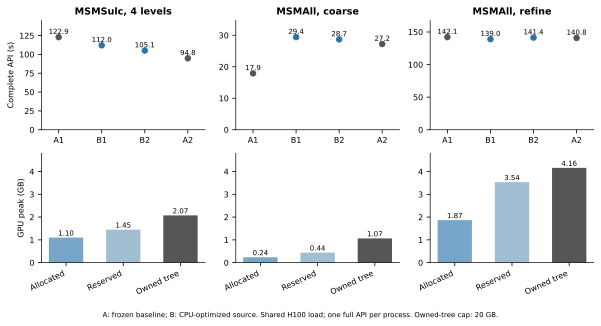

# FNIT MSM：MSMSulc球面配准

| 项目 | 内容 |
|---|---|
| 输入 | 左右原生/初始/参考球面与同顶点脑沟特征 |
| 输出 | 双侧注册球面与配准QC |
| 对应原软件 | newMSM MSMSulc；MSMAll另见专页 |
| Python / CLI | run_msmsulc / fnit-msm msmsulc |
| CPU / GPU | PyTorch CPU/CUDA+包内C++算子；准备用Workbench |

## 1. 功能简介

MSMSulc依据脑沟特征把个体原生球面注册到HCP参考球面，保留原生顶点顺序。默认刚性初始化和三级离散优化；输出球面供后续表面重采样。生产不启动官方MSM或FreeSurfer。

准备阶段使用Connectome Workbench，配准复用包内HOCR/FastPD算子，几何与代价FP64、GIFTI坐标FP32。MSMAll和特征准备分别见[MSMAll](msmall.md)、[特征页](features.md)。pipeline曾暴露首次CUDA峰值重置、双侧统计和空标签shape问题；修复及真实回归见版本表和完整档案。


## 2. Python 调用

```python
from fnit import prepare_fmriprep_surface_inputs
from fnit.msm import MSMSulcConfig, prepare_msmsulc_inputs, run_msmsulc

prepared = prepare_fmriprep_surface_inputs(
    subject_dir="/absolute/path/recon-all/sub-0001",  # 已完成 T1w recon-all 的目录
    hcp_assets_dir="/absolute/path/hcp_surface_assets",  # HCP fsLR 资源目录
    output_dir="/absolute/path/work/initial",       # FS→fsLR 初始球面及 ROI 工作目录
    wb_command="wb_command",                         # Workbench 命令
    overwrite=False,                                 # 是否替换准备结果
    parallel=True,                                   # 左右半球独立准备
    cpu_threads=8,                                   # 总 CPU 预算；并行时左右各四个
)
inputs = prepare_msmsulc_inputs(
    subject_dir="/absolute/path/recon-all/sub-0001",  # 与上一步相同的 recon-all 目录
    initial_spheres=prepared.initial_spheres,         # (左球面, 右球面)，原生顶点顺序
    hcp_assets_dir="/absolute/path/hcp_surface_assets",  # HCP 164k 参考球面和 sulc
    output_dir="/absolute/path/work/msm-inputs",    # 双侧球面、sulc、仿射矩阵工作目录
    wb_command="wb_command",                         # Workbench 命令
    parallel=True,                                   # 双侧转换和仿射准备并行
    cpu_threads=8,                                   # 本次准备的总 CPU 预算
)
spheres = run_msmsulc(
    inputs=inputs,                                    # {"L": MSMSulcInputs, "R": MSMSulcInputs}
    output_dir="/absolute/path/work/msm-output",    # 注册球面与 JSON 报告目录
    device="cuda:0",                                 # PyTorch 计算设备，也可为 cpu
    config=MSMSulcConfig(),                           # 默认 HCP 四级配置，也可填官方配置文件路径
    execution="optimized",                          # 缓存和合并传输；reference 用于执行方式对照
    parallel=True,                                   # 左右独立配准；False 保留串行执行
    cpu_threads=8,                                   # 局部邻域搜索的总 CPU 预算
)
print(spheres["L"])  # L.sphere.MSMSulc.native.surf.gii
print(spheres["R"])  # R.sphere.MSMSulc.native.surf.gii
```

### 输入数据格式

先用同一 recon-all 结果和 `fnit-setup-fmri-surface-assets --output-dir /absolute/path/hcp_surface_assets --fmriprep` 准备 HCP 参考文件。需要 `surf/lh|rh.{white,pial,sphere,sphere.reg,sulc,thickness}` 和 `mri/orig/001.mgz`；T2w、FLAIR 不参与此配准。`prepare_fmriprep_surface_inputs` 产生的 `initial_spheres` 分别是左、右 FS→fsLR 初始球面，顶点顺序与原生 mesh 相同。

`MSMSulcInputs` 每侧包括 `native_sphere`、`rotated_sphere`、`native_sulc`、`reference_sphere`、`reference_sulc`、`affine` 六个绝对路径，分别保存原生球面、FS→fsLR 旋转球面、原生脑沟图、参考球面、参考脑沟图和初始旋转矩阵。`run_msmsulc` 返回 `{"L": Path, "R": Path}`；每个 `.surf.gii` 含 N×3 顶点坐标及 F×3 三角形索引，可直接用于 Workbench 表面重采样。

`registration_report.json` 记录实际配置、仿射角度、逐级能量、更新数量、停止位置、展开操作、耗时、峰值已分配显存和写出折叠数。球面可传给 `fMRISurface_pipeline(registered_spheres=(spheres["L"], spheres["R"]))` 做固定球面投影对照；使用已注册球面时不再指定 `msm_config`。独立配准输出是工作文件，最终 fMRI 时间序列由 surface 流程写成 BIDS Derivatives。

### 输入参数

| 参数 | 必需 | 类型 | 默认值 | 含义 |
|---|---|---|---|---|
| `inputs` | 是 | dict | 无 | L/R 各一份 MSMSulcInputs；本入口不接收 MSMAllInputs。 |
| `output_dir` | 是 | 路径 | 无 | 本次调用的多文件输出目录。 |
| `device` | 否 | str / torch.device / None | `'cuda:0'` | 计算设备；显式 CUDA 不可用时报错。 |
| `config` | 否 | MSMSulcConfig / str / Path / None | `None` | 四级配置对象或官方格式配置路径；None 使用默认配置。 |
| `execution` | 否 | str | `'optimized'` | 执行策略；本页说明实际支持值。 |
| `parallel` | 否 | bool | `True` | 左右半球独立并行；预算1时自动串行。 |
| `cpu_threads` | 否 | int / None | `None` | 双侧合计CPU预算；None读环境/PyTorch线程设置。 |

准备接口`prepare_msmsulc_inputs`参数：

| 参数 | 必需 | 类型 | 默认值 | 含义 |
|---|---|---|---|---|
| `subject_dir` | 是 | 路径 | 无 | 已有同被试recon-all格式表面目录，不在本功能重建。 |
| `initial_spheres` | 是 | 左右路径元组 | 无 | 初始FS→fsLR球面，须保留原生顶点顺序。 |
| `hcp_assets_dir` | 是 | 路径 | 无 | 固定HCP参考球面/脑沟及配置目录。 |
| `output_dir` | 是 | 路径 | 无 | 本次调用的多文件输出目录。 |
| `wb_command` | 否 | str / 路径 | `'wb_command'` | Connectome Workbench命令或可执行文件路径。 |
| `parallel` | 否 | bool | `True` | 左右半球独立并行；预算1时自动串行。 |
| `cpu_threads` | 否 | int / None | `None` | 双侧合计CPU预算；None读环境/PyTorch线程设置。 |

每侧`MSMSulcInputs`的六个路径均必需：native_sphere/rotated_sphere/reference_sphere为N×3/F×3 GIFTI mesh，native_sulc/reference_sulc为对应顶点的GIFTI脑沟标量，affine为初始4×4旋转。所有顶点顺序须匹配；球面参考空间由HCP文件定义，不是volume affine。

### 配置参数

| 参数 | 必需 | 类型 | 默认值 | 含义 |
|---|---|---|---|---|
| `simval` | 否 | tuple[int, ...] | `(3, 2, 2, 2)` | 1=SSD，2=Pearson，刚性阶段3转为2。 |
| `iterations` | 否 | tuple[int, ...] | `(50, 10, 15, 15)` | 刚性阶段及三级离散配准的最大更新次数。 |
| `control_grid` | 否 | tuple[int, ...] | `(6, 2, 3, 4)` | 各阶段icosphere控制网格级别。 |
| `sampling_grid` | 否 | tuple[int, ...] | `(6, 4, 5, 6)` | 各阶段位移标签网格级别。 |
| `data_grid` | 否 | tuple[int, ...] | `(6, 4, 5, 6)` | 各阶段特征采样网格级别。 |
| `regularization` | 否 | tuple[float, ...] | `(0.0, 10.0, 7.5, 7.5)` | 各层形变正则化权重。 |
| `affine_step_size` | 否 | float | `0.01` | 刚性Euler初始步长，rad。 |
| `affine_gradient_spacing` | 否 | float | `0.5` | 刚性有限差分角度间隔，rad。 |
| `shear_modulus` | 否 | float | `0.4` | 形状应变权重。 |
| `bulk_modulus` | 否 | float | `1.6` | 面积应变权重。 |
| `strain_exponent` | 否 | float | `2.0` | 应变势指数。 |
| `regularization_exponent` | 否 | float | `2.0` | 正则项指数。 |

### 输出

```text
msm-output/
├── L.sphere.MSMSulc.native.surf.gii
├── R.sphere.MSMSulc.native.surf.gii
└── registration_report.json
```

返回L/R→Path字典。球面坐标N×3为float32，faces为有序F×3索引；保留原生顶点拓扑，单位为球面mm。JSON记录设备、配置、逐级能量/停止、时间、峰值统计范围和fold数。MSMAll独立输入/参数见[MSMAll用户手册](msmall.md)；本节不能直接替换为MSMAll配置。

左右总线程cpu_threads=8分为4/4；None读取OMP/PyTorch预算。CUDA模型各用stream；进程峰值不能把双侧报告相加。

## 3. 命令行调用

```bash
fnit-msm msmsulc \
  --inputs-json /absolute/path/msmsulc.inputs.json \
  --output-dir /absolute/path/work/msmsulc \
  --cpu-threads 8 \
  --device cuda:0
```

JSON 顶层含 `L`、`R`；每侧填 `MSMSulcInputs` 的六个文件路径，可用绝对路径或相对清单目录的路径。`--config` 与 `--execution` 对应上述 Python 参数；`--cpu-threads` 为总 CPU 预算，`--no-parallel` 对应 `parallel=False`。MSMAll 命令使用 `fnit-msm msmall`，支持相同执行参数；完整输入和例子见[功能页](msmall.md)。

| CLI 参数 | Python 参数 | 含义 |
|---|---|---|
| `--inputs-json` | `inputs` | L/R六路径；相对路径以JSON目录为基准 |
| `--output-dir / --device / --config` | `output_dir / device / config` | 输出、设备与官方配置 |
| `--execution` | `execution` | optimized/reference |
| `--no-parallel / --cpu-threads` | `parallel=False / cpu_threads` | 执行与总CPU预算 |

## 4. 原软件调用

以下命令只在独立基准环境中运行。安装器提供的 HCP 配置 SHA-256 为 `46b250404cb2570b4f645d8e53c30fabde799663d61761d61cf54ff110318203`，未指定线程数。对照时复制配置并在末尾追加 `--numthreads=1`；线程数是配置选项。FNIT 不调用官方命令。

```bash
mkdir -p /absolute/path/reference
cp /absolute/path/hcp_surface_assets/MSMConfig/MSMSulcStrainFinalconf \
  /absolute/path/reference/MSMSulc.singlethread.conf
printf '\n--numthreads=1\n' >> /absolute/path/reference/MSMSulc.singlethread.conf

newmsm --inmesh=/absolute/path/work/msm-inputs/L.sphere_rot.surf.gii \
  --refmesh=/absolute/path/hcp_surface_assets/global/templates/standard_mesh_atlases/fsaverage.L_LR.spherical_std.164k_fs_LR.surf.gii \
  --indata=/absolute/path/work/msm-inputs/L.sulc.native.shape.gii \
  --refdata=/absolute/path/hcp_surface_assets/global/templates/standard_mesh_atlases/L.refsulc.164k_fs_LR.shape.gii \
  --conf=/absolute/path/reference/MSMSulc.singlethread.conf \
  --out=/absolute/path/reference/L.
```

## 5. 最新精度和运行时间

### CPU 官方配对与本轮修复

[2026-10-04 起的 CPU 官方对照](../../validation/fmri_cpu_20261004/task04_msm_surface/README.md)使用相同物理核预算和完整双侧顶点，分别运行实际 newMSM、冻结 `cc940273` 与优化候选；原版 1/8 线程和 GPU 旧/新结果分别记录。CPU1 基线完整 MSMSulc 为原版 1550.168 s、FNIT 2185.466 s，角差 L/R mean 0.587 / 0.554°，没有达到严格原版参照。

这次核对发现成熟球面子函数的 CPU 向量除法舍入会改变共享边面归属。已将 CPU float64 无梯度的 Point normalize、tangent、投影除法和 unsigned area 改为 literal double 顺序，并对 containing-face 查询复用静态几何。完整四级候选 CPU1/8 的全部双侧球面坐标与有序 faces 都和原版严格单线程逐位相同，角差为 0；CPU1/8 球面文件 SHA 相同。原版与候选左侧都存在 1 个取向改变面，右侧为 0，几何检查单独保留。

本次 CPU 移植另发现单点几何路径的标量除法缺陷：NumPy 返回零维标量，直接交给 `torch.from_numpy` 会报错。已用 `np.asarray` 保持标量 Tensor 返回；数组结果不新增运算或复制，原数组及 CUDA 分支保持相同。标量、单三角形距离与旧 Tensor 差分、既有 Point/SphereMap 定向检查共 29 项通过，见[标量修复回执](../../validation/fmri_cpu_20261004/task04_msm_surface/point_scalar_regression_20261006.public.json)。完整批量 benchmark 未触发此缺陷，其源码范围与最终修复的关系单列在[源码语义核对](../../validation/fmri_cpu_20261004/task04_msm_surface/surface_final_source_semantics_20261005.public.json)。

| 完整双侧 MSMSulc | 原版 fresh / s | FNIT fresh / s | FNIT 完整 API / s |
| --- | ---: | ---: | ---: |
| CPU1 | 1537.903 | 455.084 | 452.696 |
| CPU8 | 466.986 | 173.393 | 171.057 |

每项是在 nodecw8 同一 CPU 预算的一次完整运行，fresh 包括程序启动和读写。实际锁内候选源码树 SHA、输入不变检查、负载和 CPU 使用见[最新聚合回执](../../validation/fmri_cpu_20261004/task04_msm_surface/completion_status_20261005.public.json)。CUDA、float32 和梯度运算保留已有 Tensor 路径；最终快照的完整 GPU 回归见下一节；下方历史 GPU 专项保留其实际源码范围。


同一例已有 volume 和 recon-all/graymid、490 帧、TR 0.735 s、STC 关闭，三次均重新准备输入并估计双侧 MSMSulc。表中 MSM 时间**包含准备与配准**，完整 API 另含投影、CIFTI、QC 和最终保存；不包含前序 volume、recon-all、编译、包导入或 CUDA 初始化。

| 同一真实输入 | 旧版 `954ad19` 串行 | 新版 `9f9f63e` 串行 | 新版 `9f9f63e` 并行 |
|---|---:|---:|---:|
| MSM 准备＋双侧配准 | 202.029 s | 116.361 s | **94.773 s** |
| 完整 surface API，扣除捕获 | 436.245 s | 343.056 s | **243.695 s** |
| 物理 H100 | 1 | 1 | 0 |
| 完整 API 峰值 allocated，十进制 GB | 0.344 | 0.644 | 1.049 |

局部 CPU 总预算为 8，并行时左右各 4；CUDA 上限 20 GB、TF32 开启。注册球面、左右 GIFTI 与 CIFTI 的全部数值，及有效科学配置和 21 结构轴/metadata，旧→新版串行、串行→并行均严格相同。卡号和共享负载不同，耗时是各一次完整观测。新版初次在 GPU 1 初始化失败，未进入 API；表中并行为 GPU 0 新目录的成功运行。实际报告、严格 native 编译 SHA、逐侧执行计数及官方差异见[完整验证页](../../validation/fmri/surface_gpu_parallel/README.md)，实测/发布的全部 116 个 runtime 文件另由[源码回溯](../../validation/fmri/surface_gpu_parallel/publication_runtime.public.json)逐项核验。

### 本轮 CPU 优化后的完整 GPU 回归（2026-10-05）

同一 H100、CPU 总预算 8、TF32 开启，四级 MSMSulc、一级 MSMAll coarse 和三级 refine 各按旧／新／新／旧运行四个新进程，每个只调用一次完整双侧 API。保留全部顶点和原配置迭代，12 次均完成；所有重复和新旧配对的坐标、有序 faces 逐位相同。严格原生扩展 SHA 为 `69fda883c5022d412172eba2de164b79726d18c068b7c421a200b331b6502ad8`。

| 完整双侧功能 | 旧版 A1 / A2 | 优化版 B1 / B2 | 最大 Torch allocated / reserved | 最大本任务进程树显存 |
|---|---:|---:|---:|---:|
| MSMSulc 四级 | 122.910 / 94.794 s | 112.039 / 105.074 s | 1.098 / 1.449 GB | 2.074 GB |
| MSMAll coarse 一级 | 17.887 / 27.212 s | 29.399 / 28.669 s | 0.235 / 0.440 GB | 1.065 GB |
| MSMAll refine 三级 | 142.121 / 140.804 s | 138.971 / 141.350 s | 1.866 / 3.536 GB | 4.161 GB |



图中每点是一次完整 API；显存柱为该功能四次调用的最大值，GB 为十进制。本次 coarse 的优化版观测较慢；该组 A1 在恢复前，后续调用在共享 H100 利用率接近 100% 的时段执行，不能据此确定稳定速度变化。MSMSulc/refine 的新旧时间接近。CPU 专用修复保留 CUDA 分支，输出一致性已完整验证。第六个进程曾在设置显存上限时 CUDA 初始化失败，尚未进入 API；保留前五个成功结果，独立重试剩七个。所有实际调用的本任务进程树显存低于 20 GB。[完整 GPU 回执](../../validation/fmri_cpu_20261004/task04_msm_surface/gpu_registration_abba_final_recovery_v1.public.json)记录两份冻结绑定、输入和源码不变检查、采样负载与全部几何误差。

### 共享 MSMAll 真实回归

共享 MSMAll 另用同一真实 C 特征复测：旧版串行→新版并行，coarse 一级 **23.237→11.430 s**，refine 三级 **181.790→90.796 s**，两侧注册坐标/拓扑/GIFTI metadata 严格相同。四次均为 GPU 0、CPU 总预算 8，新版 allocated 峰值 **0.2194 / 1.4662 GB**；计时包含既有特征读取、配准和写盘，不含特征估计或 BOLD 投影。历史保存的单线程官方球面坐标/拓扑也相同，metadata 不同，且缺历史逐输入 SHA，仅作为保存结果回归。详细边界见[真实 MSMAll 配对](../../validation/fmri/surface_gpu_parallel/msmall_paired.public.json)。

### 原软件精度与几何质量

这1例完整490帧对独立单线程官方链，角差均值左0.221050°、右0.319595°，CIFTI时间相关均值0.977911，仍非逐值等价。报告分别绑定954ad19/9f9f63e，CPU总预算8、H100、TF32、20GB上限，计算FP64/保存FP32；官方版本及runtime/native源码SHA见[来源记录](../../validation/fmri/surface_gpu_parallel/publication_runtime.public.json)。官方配准阶段未取得同口径时钟。

最新质量诊断发现一例保存球面出现1个新增反向面，不能当几何质量通过；[CON10保存质量](../../validation/fmri/public_ten_20261003/reconstruction_completed/CON10.saved-MSM-absolute.public.json)。完整MSM独立函数本轮未新增公开脑图；[历史专项球面可视化与证据](../../validation/msm/README.md)。

## 6. 最近版本和 benchmark

2026-10-04 起：新增 CPU1/8 完整官方对照、Point 舍入修复和 containing-face 缓存；最新 CPU 实测与最终 GPU 配对分别记录。

| 实测或更新 | 范围与记录 |
|---|---|
| `9f9f63e` GPU 重采样与双侧并行 | 严格最近邻证明、有序 GPU CSR、独立 stream 与原生 GIL 释放；完整 surface 的球面/490 帧时序保持旧版数值。MSM 准备＋配准串行/并行为 **116.361 / 94.773 s**，完整 API 为 **343.056 / 243.695 s**；两次物理 GPU 不同。修复调用方峰值统计和空标签形状，见[最新完整复测](../../validation/fmri/surface_gpu_parallel/README.md)。 |
| `4f7bd9f2` 独立 MSMSulc | 修复缓存面积、浮点配置、刚性 WLS 和 Rodrigues 顺序；本例保存球面及固定 clean 时序逐值相同，见上表和[专项报告](../../validation/msm/current.public.json)。 |
| `7102c187` 完整 surface 历史 | 重新准备几何、估计球面并投影 preproc；CIFTI 时间 r 均值 0.977911，范围包含完整 surface，见[历史完整报告](../../validation/fmri/surface_e2e/README.md)。 |
| 2026-10 MSMAll 扩展 | 新增独立 MSMAll、VN/DR/WRN 与 C/CA/CAT 特征准备；共享应变成本保留既有 MSMSulc 运算顺序。MSMAll 的真实 C 模式结果单独记录，以上测量保留原源码快照。 |

## 7. 参考文献、原软件和资源

源码位置：[newMSM 固定提交 2607189](https://github.com/rbesenczi/newMSM/tree/260718953547743c028a45f8c885d163441df87a)；[原 FastPD 目录](https://github.com/rbesenczi/newMSM/tree/260718953547743c028a45f8c885d163441df87a/libraries/msm-newmeshreg/include/FastPD)；[FNIT MSMSulc](../../src/fnit/msm/msmsulc.py)。newMSM 的 MIT 许可与 FastPD 的研究/非商业限制分别适用，见[第三方声明](../../THIRD_PARTY_NOTICES.md)和[FastPD 许可](../../licenses/FastPD-research-only.txt)。

- Robinson 等，*Multimodal surface matching with higher-order smoothness constraints*，NeuroImage，2018，[DOI](https://doi.org/10.1016/j.neuroimage.2017.10.037)。
- Ishikawa，*Transformation of General Binary MRF Minimization to the First-Order Case*，IEEE TPAMI，2011，[DOI](https://doi.org/10.1109/TPAMI.2010.91)。
- Komodakis 等，*Fast, Approximately Optimal Solutions for Single and Dynamic MRFs*，CVPR，2007，[论文](https://www.csd.uoc.gr/~tziritas/papers/CVPR07_FastPD.pdf)。
- 原实现：[newMSM](https://github.com/rbesenczi/newMSM)、[HCP Pipelines](https://github.com/Washington-University/HCPpipelines)、[Connectome Workbench](https://github.com/Washington-University/workbench)。

| 资源 | 用途 | 官方来源 | 大小 | SHA-256 | 是否允许 FNIT 再分发 |
|---|---|---|---|---|---|
| HCP四级MSMSulc配置及参考球面/脑沟 | 初始化与相似度目标 | [HCPpipelines固定v4.7.0](https://github.com/Washington-University/HCPpipelines/tree/f8cac6892f88bdf889d644711ff038198eb81533) | MSMSulc配置298B；左/右refsulc846142/847311B；其余见[固定资源清单](../RESOURCE_MANIFEST.md) | 配置46b250404cb2570b4f645d8e53c30fabde799663d61761d61cf54ff110318203；其余见[安装器清单](../../src/fnit/fmri/assets_setup.py) | [HCP许可证](https://github.com/Washington-University/HCPpipelines/blob/f8cac6892f88bdf889d644711ff038198eb81533/LICENSE.md)允许按条款再分发；只使用已审核资产 |

[完整历史说明与调试证据](../../validation/msm/readme_archive_20261005.md) · [返回主页](../../README.md)

<!-- 旧版文档锚点兼容 -->
<a id="输入与调用"></a> <a id="左右并行与资源预算"></a> <a id="配置参数"></a> <a id="命令行调用"></a> <a id="原版对照命令"></a> <a id="真实数据基准"></a> <a id="本轮完整-surface-内调用"></a> <a id="共享-msmall-真实回归"></a> <a id="固定输入专项历史4f7bd9f2"></a> <a id="最近版本与-benchmark-记录"></a> <a id="参考文献与原实现"></a>
