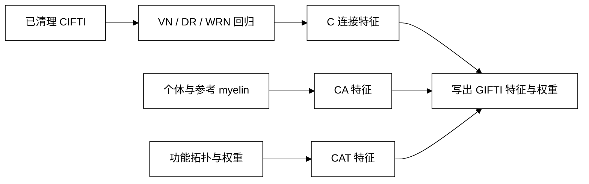

# MSMAll 特征准备：VN、DR/WRN 和 C/CA/CAT

| 项目 | 内容 |
|---|---|
| 输入 | 已清理 CIFTI、参考 RSN 图、可选个体 myelin/topography。 |
| 输出 | VN、回归地图、节点时序及 C/CA/CAT GIFTI 特征与权重。 |
| 设备 | PyTorch CPU/CUDA；Workbench 仅用于规定的表面平滑/重采样。 |
| 分支 | C 只需 fMRI；CA 需个体 myelin；CAT 另需功能拓扑。 |

## 1. 功能

这三个独立函数生成 [MSMAll](msmall.md) 使用的 VN、连接图及配准特征。VN 和回归使用 PyTorch；WRN 的 14 mm sigma 平滑使用 Connectome Workbench。输入为已清理的 CIFTI，不重新进行 ICA 分类或噪声清理。



## 2. Python 调用、输入和输出

### 方差归一化图

`compute_msmall_variance_normalization(clean_dtseries, ica_timecourses, noise_components, output_file, *, device="cuda:0")`

- `clean_dtseries`：已经完成清理的 CIFTI-2 `dtseries.nii`，文件内是时间×灰质点，时间轴为 `SeriesAxis`，至少两帧。
- `ica_timecourses`：ICA mixing 文本文件或数组，时间×ICA 组件；时间点必须与 clean dtseries 相同。
- `noise_components`：已有噪声分类的一基组件编号，可用列表、数字文本，或 FIX 分类文件最后的方括号列表。此函数不运行分类，也不重复去噪。
- `output_file`：输出 VN `dscalar.nii` 的绝对文件名。
- `device`：PyTorch 设备；默认单 GPU `cuda:0`，也可 `cpu`。

算法为 HCP `ComputeVN.m`：暂时从已清理数据中回归被分类为信号的 ICA mixing 列，以剩余非结构噪声的逐灰质点 sample SD（ddof=1，最小0.001）作为 VN。返回 VN Path；输出 CIFTI 为 1×灰质点，保留原 BrainModel 顺序。例如 `VN.dscalar.nii` 旁保存 `VN.dscalar.json` 方法与耗时记录。无需 ICA 空间图。使用已有 FNIT clean BOLD 和原始 UKB ICA 分类时，可验证这一算子，不能把输入清理协议写成 FIX 等价。

### 个体 RSN / topographic 回归

`run_msmall_regression(clean_dtseries, reference_maps, output_dir, *, variance_normalization, vertex_area=None, component_indices=None, low_dimensional_maps=None, left_midthickness=None, right_midthickness=None, method="WRN", device="cuda:0", wb_command="wb_command")`

- `clean_dtseries`：上述时间×灰质点的已清理 CIFTI，至少两帧；与 VN、参考图使用同一个 BrainModel 轴。
- `reference_maps`：CIFTI-2 群组参考地图，地图×灰质点；与 clean 文件灰质点顺序、表面顶点、体素和仿射必须一致。
- `output_dir`：绝对输出目录。
- `variance_normalization`：明确提供的 VN dscalar，文件内为 1×灰质点，各点为正值。明确传 `None` 只可用于普通 `DR`，不冒称默认 HCP WRN。
- `vertex_area`：WRN 必需。皮层专用 CIFTI dscalar，与 BOLD 前段左、右皮层顺序一致，正值、整体均值为1；皮层下点的面积权重按官方定义为1。
- `component_indices`：保留 RSN 的一基组件编号列表或 `Weights.txt`。默认为所有组件；它是选择索引，不是浮点权重。
- `low_dimensional_maps`：WRN 必需，按 d7、d8…d21 顺序给出15份群组 CIFTI 图。
- `left_midthickness`、`right_midthickness`：WRN 14 mm sigma CIFTI smoothing 所用个体32k midthickness。
- `method`：`DR` 为普通双回归；`WRN` 为面积和空间误配权重回归，再将个体地图皮层均值和sample SD匹配到参考图。
- `wb_command`：已有 Connectome Workbench 可执行路径。仅 WRN smoothing 使用，无 MATLAB/FSL/FIX运行依赖。
- `device`：默认 `cuda:0`，也可 `cpu`；回归使用 float64。

返回 `MSMAllRegressionResult`，包含 `spatial_maps`、`component_weights`、`node_timeseries`、`report` 四个 Path。地图和权重保留参考图全部组件顺序；未选择的组件权重为0。`node_timeseries.tsv` 为时间×组件，无表头；所有地图以 float32 CIFTI 输出，线性回归以 float64 PyTorch 执行。

| 返回字段与文件 | 文件结构与内容 |
|---|---|
| `spatial_maps`：`individual_maps.dscalar.nii` | 组件×灰质点；保留参考组件名称和 BrainModel 顺序，值为个体回归地图。 |
| `component_weights`：`component_weights.dscalar.nii` | 组件×灰质点；每个已选组件一整行为 1，未选组件一整行为 0。 |
| `node_timeseries`：`node_timeseries.tsv` | 时间×组件，无表头；对应同一组件顺序的节点时间序列。 |
| `report`：`regression.json` | 方法、VN 来源状态、模板数量、精度、耗时与设备；WRN 另记录空间权重范围。 |

WRN 包含官方15维低阶图各两轮双回归、逐灰质点跨组件相关的 Fisher z、原 MATLAB 隐式前3列零值参与平均、14 mm sigma平滑、正空间权重的三次方、完整高维回归和 WRN 均值/标准差归一化。没有自动以时序SD替代VN。

WRN 要求每个输入灰质点的 BOLD 随时间变化。恒定时序的相关未定义，函数会报告数量并停止。应明确选择有效覆盖，并对 BOLD、VN、所有参考地图和皮层面积使用同一个 BrainModel 轴；恢复到完整表面时，缺失顶点的 ROI 与特征权重设为 0。函数不自动删除这些点或将 NaN 填成 0。

### 单侧配准输入

`prepare_msmall_inputs(source_sphere, reference_sphere, output_dir, *, source_rsn, reference_rsn, source_rsn_weights, reference_rsn_weights, subject_myelin=None, reference_myelin=None, subject_myelin_bias=None, source_roi, reference_roi, modalities="CA", initial_sphere=None, source_topography=None, reference_topography=None, source_topography_weights=None, reference_topography_weights=None)`

- `source_sphere`、`reference_sphere`：GIFTI 球面。source 特征附着于 source_sphere 网格；reference 特征附着于 reference_sphere 网格。
- `output_dir`：四份 GIFTI 和 `features.json` 的输出目录。
- `initial_sphere`：可选的上轮/初始配准球面，对应官方 `--trans`，保持 source 顶点顺序和拓扑。不能拿它代替 source_sphere。
- `source_rsn`、`reference_rsn`：已完成当前轮空间重采样的单侧 GIFTI RSN 多列地图，每列一个 data array，组件顺序一致。
- `source_rsn_weights`、`reference_rsn_weights`：与 RSN 同行、同列的非负 GIFTI 权重。
- `source_roi`、`reference_roi`：相应网格的二值皮层ROI单列GIFTI。
- `modalities`：明确选择 `C`、`CA`（默认）或 `CAT`。`C` 只用 connectivity；`CA` 加个体 myelin；`CAT` 再加 functional topography。缺少 myelin 时不自动把 CA 降成 C。
- `subject_myelin`、`reference_myelin`：CA/CAT必需的个体与参考单列 myelin GIFTI，不能把参考图当作个体图。
- `subject_myelin_bias`：CA/CAT当前轮 bias 单列 GIFTI。HCP 外层先做个体32k myelin减reference，再以 sqrt(200) mm sigma平滑并重采样回source。此函数接收计算好的bias。
- `source_topography`、`reference_topography`及相应 `_weights`：CAT必需，四者一起提供；已有地图须完成当前轮空间重采样。

> **模态边界**：`C` 只使用静息态 fMRI 连接特征，不需要 T2w 或 FLAIR；`CA` 必须同时提供个体和参考 myelin 以及当前轮 bias；`CAT` 在此基础上还必须提供 source/reference topography 及权重。FLAIR 不能静默替代 HCP T1w/T2w myelin，缺少必需文件时函数直接报错。

返回 `MSMAllInputs`。目录内生成 source/reference features 和 weights 共4个GIFTI，加 `features.json`。按HCP定义计算各模态缩放、附加medial-wall特征、应用权重和移除参考权重全零的组件；保留组件名称与顺序。

输出文件为 `source_features.func.gii`、`reference_features.func.gii`、`source_weights.func.gii` 和 `reference_weights.func.gii`。每个 data array 保存一列 float32 顶点值；source 和 reference 分别保持各自球面的顶点顺序，保留的列数和名称相同。`features.json` 保存模态选择、缩放系数与删除列数。函数返回的 sphere 路径仍指向输入球面，不在这一步估计或生成球面变形。

### 完整调用示例

下面使用现成的 MSMSulc CIFTI 与已有 ICA 分类；所有个体工作文件留在 BIDS Derivatives 的工作目录。参考地图必须与时间序列 BrainModel 轴相同。

```python
from pathlib import Path
from fnit import compute_msmall_variance_normalization, run_msmall_regression, prepare_msmall_inputs

clean_dtseries = "/absolute/path/bids/derivatives/fnit/sub-0001/func/sub-0001_task-rest_space-fsLR_den-91k_desc-clean_bold.dtseries.nii"
template_directory = Path("/absolute/path/hcp_surface_assets/global/templates/MSMAll")
template_name = "rfMRI_REST_Atlas_MSMAll_2_d41_WRN_DeDrift_hp2000_clean_PCA.ica_d{dimension}_ROW_vn"
variance_normalization = compute_msmall_variance_normalization(
    clean_dtseries=clean_dtseries,                     # 时间×灰质点的已清理 CIFTI
    ica_timecourses="/absolute/path/work/ica/mixing.txt",  # 时间×ICA 组件
    noise_components="/absolute/path/work/ica/noise.txt",  # 已有一基噪声组件索引
    output_file="/absolute/path/work/msmall/VN.dscalar.nii",  # VN 输出文件名
    device="cuda:0",                                 # GPU 设备，也可 cpu
)
individual_rsn = run_msmall_regression(
    clean_dtseries=clean_dtseries,                     # 与 VN 对应的时间序列
    reference_maps=template_directory / template_name.format(dimension=40) / "melodic_oIC.dscalar.nii",
    output_dir="/absolute/path/work/msmall/rsn",      # 个体 RSN、权重、时序和报告目录
    variance_normalization=variance_normalization,     # 上一步 VN
    vertex_area="/absolute/path/work/msmall/mean_one_area.dscalar.nii",  # 同顺序、皮层专用均值1面积图
    component_indices=template_directory / template_name.format(dimension=40) / "Weights.txt",  # 选择一基组件
    low_dimensional_maps=[template_directory / template_name.format(dimension=dimension) /
                          "melodic_oIC.dscalar.nii" for dimension in range(7, 22)],  # d7–d21，严格按序
    left_midthickness="/absolute/path/work/surface/L.midthickness.32k.surf.gii",  # 对应个体32k几何
    right_midthickness="/absolute/path/work/surface/R.midthickness.32k.surf.gii",
    method="WRN",                                   # DR 可做普通双回归；不需要低维图与表面积
    device="cuda:0",                                 # 回归计算设备
    wb_command="wb_command",                         # Workbench 平滑命令
)

# 先按 CIFTI BrainModel 顶点编号，将地图与权重拆成单侧 GIFTI；不要按文件长度直接切片。
left_inputs = prepare_msmall_inputs(
    source_sphere="/absolute/path/work/msmall/L.sphere.32k.surf.gii",  # 个体特征所在网格
    reference_sphere="/absolute/path/work/msmall/L.reference.32k.surf.gii",  # 参考网格
    output_dir="/absolute/path/work/msmall/L-inputs",  # 四个特征/权重文件及报告
    source_rsn="/absolute/path/work/msmall/L.rsn.func.gii",  # 个体 RSN 单侧地图
    reference_rsn="/absolute/path/work/msmall/L.reference-rsn.func.gii",  # 同列顺序参考地图
    source_rsn_weights="/absolute/path/work/msmall/L.rsn-weights.func.gii",
    reference_rsn_weights="/absolute/path/work/msmall/L.reference-rsn-weights.func.gii",
    source_roi="/absolute/path/work/msmall/L.roi.shape.gii",  # 个体二值皮层ROI
    reference_roi="/absolute/path/work/msmall/L.reference-roi.shape.gii",  # 参考ROI
    modalities="C",                                 # 无个体髓鞘图时明确使用 C
    initial_sphere=None,                              # 32k MSMSulc 特征可从 identity 开始
    subject_myelin=None, reference_myelin=None, subject_myelin_bias=None,  # CA/CAT 时提供三者
    source_topography=None, reference_topography=None,  # CAT 时提供拓扑图
    source_topography_weights=None, reference_topography_weights=None,
)
print(individual_rsn.spatial_maps)  # individual_maps.dscalar.nii
print(individual_rsn.node_timeseries)  # node_timeseries.tsv
print(left_inputs.source_features)  # source_features.func.gii
```

## 3. 命令行

各函数可通过参数 JSON 单独调用。JSON 的键与 Python 参数名相同，路径可用绝对路径或相对清单目录的路径；索引数组与 `None` 分别写作数字数组和 `null`。它不自动串行运行其他步骤。

```bash
fnit-msm-features vn --inputs-json /absolute/path/work/vn.parameters.json
fnit-msm-features regression --inputs-json /absolute/path/work/regression.parameters.json
fnit-msm-features prepare --inputs-json /absolute/path/work/L-feature.parameters.json
```

VN 清单示例：

```json
{
  "clean_dtseries": "clean.dtseries.nii",
  "ica_timecourses": "mixing.txt",
  "noise_components": [1, 3, 5],
  "output_file": "VN.dscalar.nii",
  "device": "cuda:0"
}
```

## 4. 原软件调用

HCP 以 MATLAB 的 `ComputeVN` 和 `MSMregression` 执行相应计算，并由 `MSMAll.sh` 组合特征。独立对照可调用原函数，例如：

```matlab
% 参数使用原函数要求的个体工作目录，不能将 FNIT 参数清单直接传给 MATLAB。
ComputeVN('/absolute/path/work/clean.dtseries.nii', 'NONE', ...
          '/absolute/path/ica/mixing.txt', '/absolute/path/ica/noise.txt', ...
          '/absolute/path/reference/VN.dscalar.nii', '/absolute/path/wb_command');
```

完整官方参数签名与原版包装调用见下列固定源码；FNIT 的输入允许已清理 CIFTI 与显式 mixing/索引，以便避免重复清理。

## 5. 真实数据精度与耗时

### 本轮原 MATLAB CPU 对照

[CPU 官方报告](../../validation/fmri_cpu_20261004/task04_msm_surface/README.md)使用合法 MATLAB R2018b 和固定 HCP v4.7 原函数，完整读取同一 490×90,568 输入，候选 VN/DR/DR+VN/WRN CPU1/8 八项全部完成且输入不变。全部 maps 有限、形状与保存 float32 正确，所有 40 列 weights 逐位相同；VN 的 BrainModelAxis 相同，但 ScalarAxis 名称不同。原 nodes/spectra 六项完整输出已逐值核对，旧／新 FNIT 的 12 项完整 nodes 输出保存 SHA 相同；实际误差见下方全矩阵结果。

| 完整功能 | CPU 预算 | 原版 fresh / s | FNIT fresh / s | FNIT 完整 API / s | maps 最大误差 / RMSE |
| --- | ---: | ---: | ---: | ---: | --- |
| VN | 1 / 8 | 107.621 / 131.837 | 63.373 / 55.529 | 39.671 / 31.964 | 2.44e-4 / 1.84e-5 |
| DR | 1 / 8 | 112.120 / 95.747 | 86.136 / 74.894 | 60.982 / 52.172 | 5.05e-5 / 8.05e-7；2.10e-5 / 6.81e-7 |
| DR+VN | 1 / 8 | 381.639 / 184.906 | 103.930 / 99.782 | 78.871 / 74.660 | 6.91e-6 / 5.09e-7；8.26e-6 / 4.88e-7 |
| WRN d7–d21 | 1 / 8 | 1943.838 / 1373.877 | 723.399 / 533.785 | 699.610 / 509.053 | 3.28e-6 / 2.35e-7；2.28e-6 / 2.00e-7 |

每项是 nodecw10 的一次完整观测，源码、输入 SHA、实际核绑定和 CPU 使用见[最新回执](../../validation/fmri_cpu_20261004/task04_msm_surface/completion_status_20261005.public.json)。fresh process 包括 MATLAB 或 Python 的启动、读写和退出；原函数与 Workbench 分项另列在报告中。此前原 VN/DR 函数仍快于 FNIT 完整 API，本轮尚不能据 fresh 优势宣布计算已达到速度目标。

CPU1 WRN 原函数 1781.215 s，FNIT 冻结基线 API 954.113 s；保存 maps 最大差 `3.28e-6`、RMSE `2.35e-7`，40 列 weights 逐位相同，全部 CIFTI 轴相同。该节点负载约 2,500，这些是单次观测。原 nodes 的 spectra/绘图输出支路另行完整运行；不将没有写出的原节点时序标为通过。

候选 CPU WRN 复用 d7–d21 各轮共用的完整 BOLD demean，中间仍为 float64、输出 float32，pinv 容差与回归顺序不变。同一完整真实 CPU1 输入的缓存前后 maps、weights 和 nodes 三份保存文件 SHA 完全相同。增加约 710 MB CPU 内存；CUDA 或任一回归输入需要梯度时保留原运算序列。

### 完整 nodes 与振幅谱

[最新全矩阵报告](../../validation/fmri_cpu_20261004/task04_msm_surface/full_nodes_spectra_v3.public.json)核对原 DR、DR+VN、WRN 的 CPU1/8 全部 490×40 nodes 与 245×40 spectra，固定组件身份。旧／新 FNIT 每项 nodes 文件 SHA 相同。

| 功能 | CPU | nodes 最大差 / RMSE | 谱最大差 / RMSE |
| --- | ---: | --- | --- |
| DR | 1 / 8 | 5.288e-3 / 7.998e-4；5.087e-3 / 7.981e-4 | 4.949e-1 / 1.455e-2；4.949e-1 / 1.450e-2 |
| DR+VN | 1 / 8 | 5.424e-5 / 1.056e-5；5.169e-5 / 1.055e-5 | 4.830e-3 / 1.932e-4；4.830e-3 / 1.928e-4 |
| WRN | 1 / 8 | 9.570e-5 / 1.611e-5；5.746e-5 / 1.431e-5 | 6.511e-3 / 3.504e-4；4.998e-3 / 3.125e-4 |

原 `MSMregression` 文本只有 5 位有效数字，FNIT nodes 为 17 位。报告用原保存 nodes 重建谱，单列量化与 FFT 舍入控制；上表保留原样实际误差，全部组件平均相关大于 0.9999999998，不称为逐位一致。谱按 float64 时间去均值、振幅 FFT、前 245 点计算，没有 Welch、符号调整或组件重排。它用于验证已保存节点，生产 API 仍只提供文档列出的 nodes/maps/weights；原谱与绘图支路的额外时间不计入上方 maps/weights 主计时。

### 历史独立源码公式专项

安装器已补齐固定 HCP 的 d7–d21 低维模板。无个体 myelin 时可明确运行 `C`；本次真实数据 C 验证不等于完整默认 CA_CAT、髓鞘重建或 UKB 专用 DeDrift。

本次用一例 490 帧真实已清理 CIFTI 验证 `C` 特征。原文件有 91,282 个灰质点，其中 714 个时序恒定；明确选取其余 90,568 点，并同步调整 BOLD、VN 和参考图的 BrainModel 轴。有效皮层点为 59,380 个；拆回完整 32k 表面时，缺失点的 ROI 和权重为 0。d40 参考保留 32 个组件，附加 medial-wall 列后，左右两侧进入配准的特征均为 33 列。没有个体髓鞘图，也没有重新进行 FIX 分类或清理。[匿名特征报告](../../validation/msm/msmall.features.current.public.json)保存覆盖、精度、耗时与源码哈希。

下方历史专项的对照为独立 NumPy 实现的固定 HCP 源码公式：相同真实数据、VN 和参考图，均用 float64 回归，地图保存为 float32。当时节点的 MATLAB 因许可未启动，安装的 Runtime 与该版本编译程序不匹配，因此下表不称为 MATLAB 二进制对照。

| 输出 / 计算 | FNIT CPU 8 线程 | 独立源码公式 CPU 8 线程 | MAE / 最大绝对差 |
|---|---:|---:|---:|
| VN，90,568 个值 | 1.436 s | 1.311 s | **0 / 0** |
| WRN，40 张地图共 3,622,720 个值 | 26.705 s | 34.199 s（含节点时序） | **0 / 0** |
| WRN 节点时序，490×40 | 包含在 WRN 中 | 包含在 WRN 中 | `2.61e-15 / 1.98e-14` |
| VN→WRN→双侧 C 特征完整准备 | **47.498 s** | 未单独测量 | 两侧各 33 列 |

VN 和 WRN 地图为保存后的 float32 逐值一致；节点时序在 float64 下的相关为 1。完整准备包含输入输出、特征拆分与组合，不能把该时间加到单独的 VN 或 WRN 时间后再次求和。本次实测特征准备源码为 `47c3b354`；当前 `7e598efe` 的六个数值辅助函数 AST 相同，报告同时保留两个哈希。配准与 490 帧投影的独立结果见 [MSM 验证页](../../validation/msm/README.md)。

参考特征脑图见 [MSMAll 图例](msmall.md#特征脑图示例)：公开 HCP RSN 的左右内、外侧视角，展示输入空间结构。

## 6. 更新记录

- 2026-10-04 起：完整 490 帧真实原 MATLAB CPU1/8 对照；CPU WRN 缓存固定 BOLD demean，GPU 与梯度分支保留原计算路径。maps/weights、完整 nodes 与谱的聚合结果见本轮报告；CA/CAT 仍缺同被试髓鞘输入。
- 2026-10：新增三种独立特征准备接口；固定参考列顺序和 BrainModel 轴，补齐全部 15 份 WRN 低维模板。CA/CAT 缺少个体髓鞘图时明确报错。
- VN 保留 HCP ICA mixing 标准差下限 `1e-5`，残差 VN 下限 `0.001`；WRN 保留原 MATLAB 前三列零值参与 Fisher 平均的行为。
- 真实数据定位到恒定时序会产生未定义的 Fisher 权重，新增进入回归前的覆盖检查与具体报错；本次显式有效覆盖为 90,568 点。完整准备为 47.498 s，VN 与 WRN 保存地图对独立源码公式逐值一致。

## 7. 参考文献与源码

- Robinson 等，NeuroImage，2018，[DOI](https://doi.org/10.1016/j.neuroimage.2017.10.037)。
- [ComputeVN.m](https://github.com/Washington-University/HCPpipelines/blob/f8cac6892f88bdf889d644711ff038198eb81533/MSMAll/scripts/ComputeVN.m)、[MSMregression.m](https://github.com/Washington-University/HCPpipelines/blob/f8cac6892f88bdf889d644711ff038198eb81533/MSMAll/scripts/MSMregression.m)、[MSMAll.sh](https://github.com/Washington-University/HCPpipelines/blob/f8cac6892f88bdf889d644711ff038198eb81533/MSMAll/scripts/MSMAll.sh)。
