# FNIT MSMAll 多模态球面配准

| 项目 | 内容 |
|---|---|
| 输入 | 左右同网格的多列 C/CA/CAT 特征、可选权重与初始球面。 |
| 输出 | 双侧 MSMAll 注册球面、registration report，可接入 surface pipeline。 |
| 可选分支 | 在 surface pipeline 中，提供 `msmall_inputs` 才执行 MSMSulc→MSMAll；否则只执行 MSMSulc。 |
| 数据要求 | C-only 只需要 fMRI 连接特征；CA 需要个体 myelin；CAT 还需要功能拓扑。T2w/FLAIR 不自动替代 myelin。 |
| 设备 | PyTorch CPU/CUDA，几何与代价 float64，写出 float32；左右半球可并行。 |

## 1. 功能

`run_msmall` 在已有球面配准基础上，以每个顶点的多列特征做加权 Pearson 匹配，结合三角形应变、HOCR 和 FastPD 求解位移。它复现 HCP 的一级 coarse 与三级 refine 配置，复用 [MSMSulc](README.md) 已验证的网格变形、标签提案、展开和联合优化。计算使用 PyTorch 与包内 C++ 扩展，运行时不调用官方 newMSM、FSL、FreeSurfer 或 MATLAB。

MSMAll 的输入是准备好的个体和参考特征。`C` 使用静息态连接特征；`CA` 增加个体髓鞘图；`CAT` 再加入功能拓扑。没有个体 MyelinMap 时须明确选择 `C`。HCP 默认的 `CA_CAT` 外层流程、UKB 专用 DeDrift 和 FIX 不由本函数执行。本次真实数据对照采用 `C`，不将它称为标准 HCP/UKB 最终 MSMAll。

2026-10-09 修复了与 MSMSulc 共用的球面查面规则。全局最近顶点的邻面不是原版 Octree 的候选集合；共享边上漏检或多检一个面，会改变 DATA→控制三角形的归属，进而改变多特征成本和后续配准。现在按原版构树与叶节点顺序检查候选，GPU 批量保留唯一且远离边界的内点，边界、重叠和缺面情况由包内原生算子作 literal double 检查。CPU 原生查询使用局部线程预算，左右半球可独立并行；不调用或链接官方 newMSM。

```mermaid
%%{init: {"theme": "base", "themeVariables": {"primaryColor": "#ffffff", "primaryTextColor": "#000000", "primaryBorderColor": "#000000", "lineColor": "#000000"}}}%%
flowchart LR
    B[已清理的 MSMSulc CIFTI] --> V[已有 ICA mixing 与分类计算 VN]
    B --> R[DR 或 WRN 得到个体连接图]
    V --> R
    A[HCP RSN 参考图与权重] --> R
    R --> F[准备 C / CA / CAT 特征与权重]
    M[可选个体髓鞘图和功能拓扑] --> F
    F --> S[FNIT MSMAll：HOCR / FastPD]
    S --> W[solver 球面与独立几何 QC]
    W --> N[合成到原生 MSMSulc 球面]
    N --> Q[实际保存球面的 FinalNative QC]
    Q --> P{msmall_qc_policy}
    P -->|report| G[保留球面坐标及 warning]
    P -->|repair| H[局部梯度与 float32 联合量化<br/>小区域调和修复，必要时有界展开]
    H --> J[重读实际保存球面并检查绝对方向]
    J -->|通过| T[双侧 Workbench ribbon 采样<br/>ADAP_BARY_AREA 与 ROI]
    J -->|失败| X[拒绝 BOLD 投影]
    P -->|error 且失败| X
    P -->|error 且通过| T
    G --> T
    T --> O[fsLR32k GIFTI / 91k CIFTI]
    classDef mono fill:#ffffff,stroke:#000000,color:#000000;
    class B,V,R,A,F,M,S,W,N,Q,P,G,H,J,T,X,O mono;
```



## 2. Python 调用、输入与输出

安装公开参考资源：

```bash
fnit-setup-fmri-surface-assets --output-dir /absolute/path/hcp_surface_assets --msmall --fmriprep
```

安装器校验固定HCP v4.7.0文件的SHA-256；WRN d7–d21的15份模板另校验大小，共86,180,368字节。获许可且收录[发布目录](../../src/fnit/_release_asset_catalog.json)的精确文件优先从固定`assets-v1` Release下载，保留固定HCP上游回退；统一步骤见[资源安装说明](../ASSETS.md)。安装保留HCP许可文件，不包含个体特征或个体髓鞘图。

```python
from fnit import MSMAllConfig, MSMAllInputs, run_msmall

msmall_inputs = {
    hemisphere: MSMAllInputs(
        source_sphere=f"/absolute/path/features/{hemisphere}.sphere.surf.gii",  # 个体特征所在球面
        source_features=f"/absolute/path/features/{hemisphere}.source.func.gii",  # N×D 个体特征
        reference_sphere=f"/absolute/path/features/{hemisphere}.reference.surf.gii",  # 参考特征球面
        reference_features=f"/absolute/path/features/{hemisphere}.reference.func.gii",  # M×D 参考特征
        initial_sphere=f"/absolute/path/features/{hemisphere}.initial.surf.gii",  # 对应 --trans；与 source 同顶点顺序
        source_weights=f"/absolute/path/features/{hemisphere}.source.weights.func.gii",  # 个体成本权重
        reference_weights=f"/absolute/path/features/{hemisphere}.reference.weights.func.gii",  # 参考成本权重
    ) for hemisphere in ("L", "R")
}
registered_spheres = run_msmall(
    inputs=msmall_inputs,                              # 左、右 MSMAllInputs
    output_dir="/absolute/path/work/msmall",          # 注册球面及报告目录
    device="cuda:0",                                 # 单 GPU；也可 cpu
    config=MSMAllConfig.refine(),                      # HCP 三级配置；coarse() 为一级配置
    execution="optimized",                          # reference 保留执行方式对照
    parallel=True,                                   # 左右半球独立配准
    cpu_threads=8,                                   # 总原生 CPU 预算；左右并行时各四个
)
print(registered_spheres["L"])
print(registered_spheres["R"])
```

### 输入格式和参数

| 参数 | 数据与含义 |
|---|---|
| `inputs` | 只有 `L`、`R` 两个键的字典，值为 `MSMAllInputs`。 |
| `source_sphere` | GIFTI 球面，N×3 顶点及 F×3 三角形；特征附着于此网格。 |
| `source_features` | N×D GIFTI metric；可用每列一个 data array 或一个二维 data array，D≥2。 |
| `reference_sphere` / `reference_features` | M 个参考顶点及 M×D 特征；列数、含义和顺序必须与个体一致。 |
| `initial_sphere` | 可选上轮注册球面，对应官方 `--trans`；保持 source 顶点顺序和三角形。没有时从 source 球面开始。它不替代 source 特征坐标。 |
| `source_weights` / `reference_weights` | 可选 N×1/N×D 和 M×1/M×D GIFTI。双方同时提供才使用官方加权规则；只提供一方时按官方行为使用全 1 权重。 |
| `output_dir` | 独立配准工作目录，不是最终 BIDS fMRI 输出路径。 |
| `device` | `cuda:0` 或 `cpu`。几何、成本和优化采用 float64；无 FP16/BF16。 |
| `config` | `None`、`MSMAllConfig` 或受支持的官方配置文件。默认三级 refine。 |
| `execution` | `optimized` 缓存和合并传输；`reference` 用于比较执行方式，科学配置与停止条件相同。 |
| `parallel` | 默认 `True`，左右半球独立并行；预算 1 时串行。CUDA 使用独立 stream。 |
| `cpu_threads` | 可选总 CPU 预算；并行时按左右分配，用于包内原生查面与优化，不重设调用方的 PyTorch 线程池。 |

权重只有一列时，官方将它用于第一项特征，其余项权重为 1，不广播到所有特征。双方权重重叠列取均值，列数较多一方的剩余列保留。特征准备函数会生成完整逐特征权重，普通调用建议同时提供双方文件。

### 配置参数

| 参数 | coarse | refine（默认） | 含义 |
|---|---|---|---|
| `simval` | `(2,)` | `(2,2,2)` | 每个 DATA 顶点跨特征的加权 Pearson。 |
| `iterations` | `(10,)` | `(10,15,15)` | 每级最大迭代数；保留官方提前停止与回退规则。 |
| `control_grid` | `(2,)` | `(2,3,4)` | 控制网格级别，对应 162、642、2,562 个点。 |
| `sampling_grid` | `(4,)` | `(4,5,6)` | 候选位移采样网格。 |
| `data_grid` | `(4,)` | `(4,5,6)` | 特征网格级别，对应 2,562、10,242、40,962 个点。 |
| `regularization` | `(0.00001,)` | `(0.00001,0.0075,0.01)` | 各级应变正则权重。 |
| `shear_modulus` / `bulk_modulus` | `0.4 / 1.6` | 同左 | 形状与面积应变权重。 |
| `strain_exponent` / `regularization_exponent` | `2 / 2` | 同左 | 应变势和正则项指数。 |

配置读取保留官方 float32 选项提升为 double 的行为。支持 HCP 的 `DISCRETE`、`HOCR`、`regoption=3`、零特征平滑、`VN`、`rescaleL`、`triclique`；不接受静默改变算法的其他选项。

### 输出

返回 `{"L": Path, "R": Path}`：

- `L.sphere.MSMAll.native.surf.gii`、`R.sphere.MSMAll.native.surf.gii`：注册球面，float32 顶点、int32 三角形；顶点数量和顺序与 source 相同。source 是 32k 时输出也为 32k，文件名中的 native 指输入网格。
- `registration_report.json`：实际配置、特征数、是否加权、逐级能量和迭代、停止与回退、耗时、峰值显存及 float32 输出翻折质控。

执行记录中的 `octree_device_containment_queries` 为设备批量完成的内点查询数，`octree_native_queries` 为包内原生查询数；它们用于说明计算分工，不作为速度指标。几何与成本仍为 float64，最终球面为 float32。

配准结果可通过 [surface pipeline](../fmri/surface.md) 的 `msmall_inputs` 接入。该流程默认先估计 MSMSulc；32k 特征的注册结果合成到原生 MSMSulc 球面，再执行 ribbon 投影。默认 `signal="preproc"` 对应 `desc-MSMAllpreproc`；显式选择 `signal="clean"` 使用已去噪 volume，输出 `desc-MSMAllclean`。注册球面的描述分别为 `MSMAllpreprocReg` / `MSMAllcleanReg`，与默认 MSMSulc 结果分别保存。


### Surface pipeline 的两个可选分支

| 调用条件 | 实际链路 | 输出与限制 |
|---|---|---|
| 未提供 `msmall_inputs` | `prepare_msmsulc_inputs` → MSMSulc → 投影/CIFTI | 默认生成 `desc-preproc` 或 `desc-clean`；`msm_config` 只控制 MSMSulc。 |
| 提供 L/R `msmall_inputs` | MSMSulc → MSMAll → native sphere 合成 → 投影/CIFTI | 输出 `desc-MSMAllpreproc/clean`；`msmall_config` 只控制 MSMAll，缺省为三级 refine。 |
| 提供 `registered_spheres` | 跳过 MSMSulc 与 MSMAll | 不能同时传 `msm_config`、`msmall_inputs` 或非默认前置 QC 策略。 |

C-only 是可以在 T1w+fMRI 数据上运行的约束分支；它不需要 T2w 或 FLAIR。CA 必须显式提供个体与参考 myelin，CAT 还必须提供双方功能拓扑及权重；缺少输入时直接报错，不静默降级到 C。

surface API 提供两项独立策略，默认均为 `report`：

没有 `msmall_inputs` 时不能选择非默认 `msmall_qc_policy`；提供 `registered_spheres` 时不能选择非默认 `msmsulc_qc_policy`。这样可避免参数被静默忽略。MSMSulc-only 的 `repair/error` 同样在最终保存球面复核未通过时拒绝投影。

| 参数 | 作用位置 | `report` | `repair` | `error` |
|---|---|---|---|---|
| `msmsulc_qc_policy` | 前置 MSMSulc 输出 native sphere | 保留官方插值坐标并报告翻折。 | 显式局部/区域修复并在保存后复核。 | 有翻折时拒绝该阶段输出。 |
| `msmall_qc_policy` | MSMAll 结果合成到最终 native sphere 后 | 保留官方 composition 坐标并报告翻折。 | 显式修复最终 native 插值引入的翻折。 | 有翻折时在 BOLD 投影和最终发布前报错。 |

`msmsulc_qc_policy` 的实现见 [MSMSulc 说明](README.md)。MSMAll solver 的球面和最终 native sphere 分别检查；solver 无翻折不能代替最终 native 检查。最终 native QC 从实际保存的 float32 GIFTI 重新读取，以未变形 native sphere 核对顶点顺序、三角形、相对方向比和绝对异常面数。报告的 `FinalNative` 保留 `qc_policy`，每半球记录 `native_output_qc_before_repair`、`fold_repair` 和最终 `orientation_qc`；`fold_repair` 包含是否执行、改动顶点数、展开更新数、耗时与成功状态。`OrientationQC` 分别列出 `initial_msmsulc`、`solver_msmall`、`final_native` 和 `all_stages`。上游 warning 持续保留，缺少参照时记为 `not_assessed`。修复后 0 翻折只代表该项几何 QC 通过，不能据此声称与官方坐标、特征或 BOLD 输出严格等价。

MSMAll 工作目录另保存 `native_composition_report.json`。最终 BIDS sidecar 的 `FNIT.RegistrationDetails.FinalNativeHemispheres` 收录保存球面的检查结果；`FNIT.RegistrationQC` 指向 QC JSON，详细记录在该 JSON 的 `MSM.FinalNative` 中。`repair` 修复后仍未通过，或 `error` 检出翻折时，均在 BOLD 投影和最终发布前拒绝继续；32k solver 球面保留供独立精度比较。以下示例显式对前置和最终球面分别选择 `repair`，默认值仍为 `report`。

两处 native `repair` 复用同一[保存精度修复器](../../src/fnit/msm/_native_repair.py)：先做有界局部移动和三个顶点的联合 float32 检查；未通过时，从未经修复的已配准 native 坐标重启固定边界的局部区域修复，再检查量化后的取向。区域最多扩展 16 层，每次最多 2,000 个内点；候选必须改善翻折数或最小方向比，并保留正常相邻面的方向。必要时还可分别尝试 128、512、1000 次顺序展开，报告其新增翻折。`attempts` 区分局部、区域、量化和展开阶段；`moved_vertices` 是最终改动的独立顶点数，其他更新计数是过程事件数，并另记最大/平均坐标位移与耗时。具体预算见[MSMSulc 修复说明](README.md#输入数据格式)。 位移按注册球面的坐标计算，不解释为皮层解剖位移。配准中间网格保持原版展开预算。

`folded_output_faces` 保留逐面相对参考的历史定义；最终策略以 `absolute_folded_output_faces` 为准，方向由参考网格的多数面决定。参考自身已有反向面时，纠正它可能使旧相对计数增加，因此另外记录输入绝对异常数和原本正常参考面的新增翻转数。输入异常的记录与修复后的输出验收分别保留。

```python
from fnit.fmri import fMRISurface_pipeline

result = fMRISurface_pipeline(
    bids_root="/absolute/path/bids",
    derivatives_root="/absolute/path/derivatives",
    subject="0001",
    hcp_assets_dir="/absolute/path/hcp_surface_assets",
    recon_all="/absolute/path/recon-all/sub-0001",
    msmall_inputs="/absolute/path/msmall.inputs.json",  # L/R C/CA/CAT 特征清单
    msmall_config="/absolute/path/MSMAllStrainFinalconf1to1_1to3_2",
    msmsulc_qc_policy="repair",                      # 显式修复前置 MSMSulc native 输出并复核
    msmall_qc_policy="repair",                        # 最终 MSMAll native 球面显式修复；独立于前置策略
    device="cuda:0", parallel=True, cpu_threads=8,
)
```

命令行对应：

```bash
fnit-fmri surface --bids-root /absolute/path/bids \
  --derivatives-root /absolute/path/derivatives --subject 0001 \
  --recon-all /absolute/path/recon-all/sub-0001 \
  --surface-assets-dir /absolute/path/hcp_surface_assets \
  --msmall-inputs-json /absolute/path/msmall.inputs.json \
  --msmall-config /absolute/path/MSMAllStrainFinalconf1to1_1to3_2 \
  --msmsulc-qc-policy repair --msmall-qc-policy repair \
  --threads 8 --device cuda:0
```

## 3. 命令行

```bash
fnit-msm msmall --inputs-json /absolute/path/msmall.inputs.json \
  --output-dir /absolute/path/work/msmall --device cuda:0 \
  --config /absolute/path/hcp_surface_assets/MSMConfig/MSMAllStrainFinalconf1to1_1to3_2 \
  --execution optimized --cpu-threads 8
```

输入 JSON 顶层只含 `L`、`R`，每侧字段与上述 `MSMAllInputs` 相同。必填四个 sphere/features 字段；可选字段可省略或设为 `null`。相对文件名按 JSON 所在目录解析。此清单属于个体工作文件，不上传至公开仓库。

`--device`、`--config`、`--execution` 和 `--cpu-threads` 对应同名 Python 参数，`--no-parallel` 对应 `parallel=False`。`msmsulc_qc_policy` / `msmall_qc_policy` 是 surface pipeline 的阶段策略，使用 `fnit-fmri surface` 的两项同名选项；独立 `run_msmall` 不执行 native composition 或最终 BOLD 发布。

## 4. 官方对照调用

官方命令仅用于独立验证环境。将所选 HCP 配置复制到工作目录并追加 `--numthreads=1` 后运行左右两侧：

本页求解器参照固定 `fsl-newmsm 1.0 h442c261_5`，二进制 SHA-256 为 `af5c04246cfeea19233232168acbc1f31266f28b1a7cb6779b8f1bfa32eb9615`。原版多线程也会改变优化轨迹，因此精度参照使用其单线程结果，速度按相同线程预算另列。版本与 fMRIPrep 25.2.4 内旧 MSM 的区别见 [MSMSulc 原版说明](README.md#两个原版的版本和目标函数)。

```bash
newmsm --inmesh=/absolute/path/features/L.sphere.surf.gii \
  --trans=/absolute/path/features/L.initial.surf.gii \
  --refmesh=/absolute/path/features/L.reference.surf.gii \
  --indata=/absolute/path/features/L.source.func.gii \
  --refdata=/absolute/path/features/L.reference.func.gii \
  --inweight=/absolute/path/features/L.source.weights.func.gii \
  --refweight=/absolute/path/features/L.reference.weights.func.gii \
  --conf=/absolute/path/reference/MSMAll.singlethread.conf \
  --out=/absolute/path/reference/L.
```

官方 HCP 的特征准备见 `ComputeVN.m`、`MSMregression.m` 与 `MSMAll.sh`。[FNIT 特征准备](features.md) 分别实现 VN、DR/WRN 和 C/CA/CAT 特征组合；输入已清理时间序列，不再次分类或去噪。

如果 Python 输入没有 `initial_sphere`，原版命令也省略 `--trans`。配对验证使用同一 source/reference sphere、特征、权重、配置及初始球面；只比较相同名称的输出文件不足以保证输入一致。

## 5. 真实数据精度与速度

MSMAll 与 MSMSulc 共用球面查询：优化 CUDA 路径缓存固定三角形的边和法向，合并三条边的判定计算；每轮更新球面时重新创建快照，边界仍交给包内标量算子。CPU 输入数组与内部快照隔离，防止调用者原地修改几何造成缓存失配。完整配准精度与 API 墙钟分别核对。

### 2026-10-09：最终修复版完整配准核心

| 完整双侧 API / s | 原版 CPU8 | FNIT CPU8 | 观测原版/FNIT | A100，CPU 总预算 8 | 对严格官方 CPU1 保存精度 |
|---|---:|---:|---:|---:|---|
| MSMSulc，默认四级，`report` | 507.392 | 347.914 | 1.458 | 130.669 | 两侧 float32 坐标、有序 faces 逐位一致 |
| MSMAll，固定 21C、三级 λ=0.05 | 507.310 | 312.104 | 1.625 | 97.685 | 两侧 float32 坐标、有序 faces 逐位一致 |

同预算 CPU 复测按原版→FNIT 顺序执行，均固定 0–7 核，总预算 8、左右各 4，并行双侧、串行两项 API；CUDA 未初始化。墙钟包括读入、完整求解、球面/报告保存，排除导入、哈希、离线比较和资源监测。上表比值仅描述这一次共享节点配对。A100 核心为另一次观察，TF32 开启、几何/成本 float64、保存 float32，allocator 上限 20 GB；峰值 allocation 2.241/2.266 GB，reserved 最大 7.376 GB。核心不含新特征、native 合成、BOLD 投影或 CIFTI。

FNIT CPU8 和 GPU 四侧对严格原版 CPU1 的角差、弦差均为 0。此次原版 CPU8 本身相对严格 CPU1 有差异：MSMSulc 右侧平均/最大角差 **0.120077/0.935965°**，MSMAll 左侧 **0.032034/0.807579°**，其余两侧相同；FNIT 对新原版 CPU8 的差异等于该原版自身的单/多线程差异。数值精度参照与同预算速度参照分别保留。MSMSulc 默认 `report` 与严格原版同为左右 2/0 翻折；显式 native 修复在完整 surface 单独验收。MSMAll 0/0 属于 solver QC。

最初未配对的 FNIT CPU8 观察为 489.870/479.163 s，保留在原报告中；最新 CPU 比值使用上述新配对。旁路资源记录覆盖部分原版 MSMAll 和 FNIT 记录期，记录内内存失败/CPU throttle 增量为 0，不能单凭该窗口确定跨时段时差原因。GPU 实际加载/编译的 22 个源码依赖与保守误差界版相同，默认 report 未调用新增 native 修复模块。见[最新同预算 CPU 配对](../../validation/msm/native_qc_20261009/a100/final_cpu8_matched.public.json)、[完整 GPU](../../validation/msm/native_qc_20261009/a100/final_gpu8.public.json)、[实际源码一致性](../../validation/msm/native_qc_20261009/a100/clear_to_final_code_identity.public.json)及[逐步骤/历史验证](../../validation/msm/native_qc_20261009/a100/README.md)。

### 最终修复版配准分步骤

| 阶段 / s | CPU8 左 | CPU8 右 | A100 左 | A100 右 |
|---|---:|---:|---:|---:|
| MSMAll 离散第 1 级 | 10.002 | 11.553 | 11.670 | 10.351 |
| MSMAll 离散第 2 级 | 33.617 | 68.769 | 13.972 | 23.799 |
| MSMAll 离散第 3 级 | 210.624 | 231.188 | 63.292 | 62.709 |
| MSMAll 每侧完整调用 | 254.771 | 312.095 | 89.680 | 97.661 |

CPU 为最新配对复测，GPU 为上表所列最终冻结核心的独立观察。左右并行，不能把两侧时间相加为双侧 API；层级时钟包含准备、采样、成本、融合、warp 和展开，不是 GPU kernel 时钟。CPU/GPU 每层迭代数相同，source/control unfold 更新均为 0，未删减计算轮数。原版本轮只测完整命令墙钟，未独立记录层级时钟。见[CPU 分层](../../validation/msm/native_qc_20261009/a100/final_cpu8_phases.public.json)、[GPU 分层](../../validation/msm/native_qc_20261009/a100/final_gpu8_phases.public.json)。

此前缓存优化的同输入 A/B 完整 GPU 观察为 MSMSulc 均值 91.109→83.939 s、MSMAll 72.162→68.859 s，迭代轨迹和保存坐标不变；历史 CPU8 为 157.476/192.269 s。历史与本轮各按实际源码、输入和时段记录。

### 2026-10-09：最终修复版两分支 surface，10/10 例

同一冻结源码完成十例 MSMSulc-only surface、自产 d20/21C，再独立运行 MSMSulc→MSMAll→native composition→投影/CIFTI。两个 native 策略均为 `repair`，A100、CPU 总预算 4、左右各 2，TF32 开启，allocator 上限 20 GB。全部阶段保存球面左右绝对翻折 0/0、无新增正常面翻折；两分支全部 180 帧 finite，实际投影球面与发布球面数组相同。

| 完整测量 / s | 十例均值 | 中位数 | 最小–最大 |
|---|---:|---:|---:|
| Stage A：MSMSulc-only surface API | 270.562 | 259.184 | 224.083–352.201 |
| 本次时序生成 d20/21C | 8.113 | 8.073 | 4.968–12.183 |
| Stage B：MSMSulc＋MSMAll surface API | 345.813 | 338.727 | 261.365–478.690 |
| 连续两分支外层 | 626.908 | 601.855 | 492.216–846.974 |

最大 allocation/reserved 为 **2.390 / 11.044 GB**。外层由独立连续时钟测量，含两次 API、新特征、阶段准备、实际投影输入捕获及输出 QC/保存；导入、CUDA 初始化和前后置哈希审计在时钟外。前序 volume/recon-all 已完成，不计入本轮 surface。C-only 不需 T2w/FLAIR；完整 HCP CA/CAT 另需其相应特征。

本次自产 21C 首例另外重算官方 CPU1/1，并在 GPU 完整重放 MSMAll：左右 float32 坐标、有序 faces 逐位一致，角差/弦差全部为 0，solver 翻折 0/0；GPU API **139.522 s**、allocation **2.275 GB**。严格 CPU1/1 是精度参照，不能作为 CPU8 的速度分母。显式修复后的 native 几何、未修复 solver 数值及独立投影分别验收。

详见[十例完整报告](../../validation/msm/native_qc_20261009/a100/final_surface10.public.json)、[新特征 GPU 精度报告](../../validation/msm/native_qc_20261009/a100/final_case01_actual_gpu_precision.public.json)和[逐步骤验证页](../../validation/msm/native_qc_20261009/a100/README.md#最终修复版完整-surface)。

### 两分支实际球面的独立官方投影对照

首例两分支均用本次完整运行捕获的实际 T1w/MNI 时序、white/pial、面积、ROI 和最终保存球面，独立调用固定 Workbench 2.1.0 及原 NiWorkflows CIFTI 源函数，覆盖全部 180 帧。左右 GIFTI 与 91k CIFTI 共 **56,255,760** 个值逐位一致，MAE、RMSE 和最大绝对误差均为 0；时间/脑结构轴、intent、科学元数据及 540 字节 NIfTI 头一致。

完整 CIFTI XML 字节不同：`Volume` 子节点在 FNIT 中位于两个皮层节点之后，原函数中位于全部 21 个 BrainModel 之后；所有属性、文本及 BrainModel 顺序/内容一致。GIFTI 图像级字段仅 `Provenance`、`ParentProvenance`、`WorkingDirectory` 不同，记录各自命令路径；逐帧元数据相同。

原版仅采样与 CIFTI 组装的 CPU4（左右各2）墙钟分别为 **85.654 / 88.394 s**；该单次对照不含配准、新特征、native 修复或离线比较，不能与完整 surface 的总耗时计算加速比。见[实际球面官方投影报告](../../validation/msm/native_qc_20261009/a100/matched_sphere_sampler.public.json)。

### 2026-10-09：H100 初次 21 列 C-only 验证

本轮使用匹配的 d20 C 特征：每侧 20 个连接通道加 medial-wall，共 21 列；三级正则均为 `0.05`，原版与 FNIT 均保留选项的 float32→double 提升。这组输入与下方历史 33 列 WRN C 专项不同。修复前左侧完整 CPU1 球面对固定官方参照的平均角差为 **0.407599°**；CPU 与 GPU 差异接近，不能将它归因于 CUDA 舍入。

同一实际第二轮迭代的 2,562 个 DATA 查询中，旧查面与原版有 7 个面号不同。按原版叶候选修复后，8 个已有迭代、20,496 个查询的面号和投影逐位相同。将所有球面映射替换为原版 API 的完整左侧诊断得到角差和弦差全为 0，确认共享映射是剩余精度问题；该定位程序的时间不作为 FNIT 生产 benchmark。只替换 DATA→CP 归属仍不能恢复完整结果，因此特征和权重重采样也使用同一叶候选规则。

生产源码的完整双侧 GPU `run_msmall` 已通过同输入、同配置对照。每侧 32,492 个顶点、64,980 个有序三角形，21 列 C 特征，三级正则为 `0.05`，没有额外 `initial_sphere`。左右保存 float32 坐标和有序 faces 均与固定官方 CPU1 逐位相同，角差、弦差 mean、median、p95、max 全为 0，双方翻折均为 0。

| 完整配准核心 | GPU API / s | 峰值 Torch allocated / GB | 原版精度参照 | FNIT / 官方左、右翻折 |
|---|---:|---:|---|---|
| MSMAll，21 列 C，三级 `regularization=0.05` | **73.608** | **1.787** | 固定 newMSM CPU1；保存坐标与有序 faces 逐位相同 | **0、0 / 0、0** |

| MSMAll 内部阶段 / s | 左 | 右 |
|---|---:|---:|
| 第一级，CP2 / DATA4 | 5.477 | 5.362 |
| 第二级，CP3 / DATA5 | 9.590 | 18.493 |
| 第三级，CP4 / DATA6 | 51.710 | 49.309 |
| 每侧完整调用（含读取、插值和保存） | 67.539 | 73.591 |

H100 PCIe，PyTorch 2.5.1 / CUDA 11.8，CPU 总预算 8、左右各 4，显存上限 20,000,000,000 字节；实际 TF32 开启，几何与成本仍为 float64。左右并行，分阶段和逐侧时间不能相加为双侧墙钟。API 计时包含输入读取、完整三级配准和球面/报告保存，排除导入、CUDA 初始化、哈希校验、离线比较、特征生成及 BOLD 投影。峰值为本任务进程共享的 Torch allocation，GB 为十进制；该时间是共享 GPU 上一次观测，不推断稳定加速比。源码、原生扩展、输入、原版球面和配置前后不变，运行时没有加载官方 helper 或 FSL 库。回执见 [2026-10-09 验证页](../../validation/msm/native_qc_20261009/README.md)与 [GPU 核心报告](../../validation/msm/native_qc_20261009/gpu_cores.public.json)。

同次默认 `report` MSMSulc 为 **93.130 s**、峰值 allocation **1.756 GB**，保存坐标也与固定原版逐位相同，但双方左/右仍为 **2/0** 翻折，状态为 warning。上述 MSMAll 0/0 只属于 32k solver，不能替代前置 MSMSulc 或最终 native composition 的 QC。同预算 CPU 配对和十人 fresh surface 分支分别报告完整阶段、两项策略及最终输出。

### CPU 官方历史配对（2026-10-04/05）

[CPU 官方报告](../../validation/fmri_cpu_20261004/task04_msm_surface/README.md)完整运行双侧 32,492 顶点、33 列真实 WRN C 特征，保留一级 coarse 与三级 refine 全部停止条件。该版候选 CPU1 的全部坐标、有序 faces 与原版严格单线程逐位相同，0 相对翻面；候选 CPU8 与 CPU1 的球面文件 SHA 相同。

| 完整双侧功能 | CPU 预算 | 原版 fresh / s | FNIT fresh / s | FNIT 完整 API / s |
| --- | ---: | ---: | ---: | ---: |
| WRN C coarse | 1 | 96.724 | 58.948 | 56.162 |
| WRN C coarse | 8 | 28.814 | 26.671 | 24.196 |
| WRN C refine | 1 | 2020.025 | 1512.800 | 1510.518 |
| WRN C refine | 8 | 600.420 | 360.841 | 358.670 |

原版多线程会改变结果：coarse 右侧相对单线程平均角差 0.706°、p99 4.266°；refine 左/右平均角差 0.251/0.277°。FNIT CPU1/8 保持严格单线程参照。上述是同预算各一次 fresh-process 观测，包含读写和程序启动；实际源码、输入不变检查和全部角差见[最新回执](../../validation/fmri_cpu_20261004/task04_msm_surface/completion_status_20261005.public.json)。最终 GPU 旧/新配对已完成：coarse 旧版 17.887/27.212 s、优化版 29.399/28.669 s；refine 旧版 142.121/140.804 s、优化版 138.971/141.350 s。全部双侧坐标与 faces 相同，最大本任务进程树显存为 1.065/4.161 GB。共享 H100 接近满载，coarse 观测较慢；完整回执和聚合图见 [GPU 回归](README.md#本轮-cpu-优化后的完整-gpu-回归2026-10-05)。

该历史专项的匿名汇总、精度与耗时范围见 [MSM 验证页](../../validation/msm/README.md)。对照固定同一真实 BOLD、参考图、特征和权重，分别执行完整官方配置。球面误差按对应顶点计算；490 帧时间序列先逐灰质点计算 Pearson，再取均值。单次成本检查、完整球面和最终时间序列是不同检查项。

### 十人配对 C-only 集成基准（2026-10-08）

本轮使用公开配对 T1w/rest-fMRI 基准的 10 个病例。官方 fMRIPrep 产物中的 FreeSurfer 派生表面只作为私有输入准备；FNIT 运行时没有调用 FreeSurfer。每个 run 为 180 帧、TR 2.1 s、91,282 个 grayordinates。使用 HCP MSMAll d20 参考图，DR 回归不提供 VN，左右半球在固定 fsLR32k 球面上生成 `C` 特征。每侧最终为 20 个连接特征加 1 个 medial-wall 通道，共 21 列；所有 10 例输出均为 finite。

| 阶段 | 设备/线程 | 10 例耗时 | 结果 |
| --- | --- | ---: | --- |
| DR 回归 | CPU，8 线程预算 | 均值 1.419 s（1.340–1.455） | 10/10 finite |
| 特征准备 | CPU，左右并行 | 总均值 3.259 s（3.195–3.339） | 10/10 成功 |
| coarse，稳定配置 | CPU，8 线程预算 | 均值 6.960 s（4.426–15.310） | 翻折 0，退化输入 0 |
| coarse，稳定配置 | H100，左右并行 | 均值 13.146 s（10.287–15.629） | 翻折 0；峰值 allocation 0.212–0.233 GB |

为避免低维 `C` 特征在 32k 网格上发生折叠，本轮 coarse 使用 `regularization=0.05`、`simval=(2,)`、`iterations=(10,)`、`control_grid=(2,)`、`sampling_grid=(4,)`、`data_grid=(4,)`。这是 C-only 的稳定性配置，不是 HCP 默认 CA/CAT 参数。默认 `regularization=1e-5` 在该 d20 C-only 输入的首例出现翻折，未继续作为通过结果。CPU coarse 的 10/10 最小方向比范围为 0.595–0.679；GPU 观察批次为 0.595–0.677。GPU 当时共享 H100 负载较高，时间只作一次观测，不能解释为稳定加速。

三级 refine 的单例 GPU 试跑完成（148.994 s，翻折 0，最小方向比 0.630/0.570）；十人 refine 尚未纳入通过统计。仅凭 T1w 和 fMRI 不能生成完整 HCP `CA_CAT` 所需的个体 myelin 与 topography，因此本节结果称为 **20-component C-only constrained MSMAll integration**，不称为完整 HCP MSMAll 等价。匿名聚合字段见 [`msmall_c_only_ten.public.json`](../../validation/msm/msmall_c_only_ten.public.json)。

随后用同一基准中的一例执行了 matched outer `fMRISurface_pipeline`：先用官方 FreeSurfer 派生表面和显式 RAS 变换运行 FNIT MSMSulc，再从 FNIT stage-A 的 91k dtseries 生成 d20 C 特征，最后运行 MSMAll 并合成回 native MSMSulc 球面。历史报告记录 stage-A MSMSulc 加投影 **266.999 s**（其中 MSMSulc **162.324 s**）、特征回归与准备 **4.458 s**、stage-B MSMSulc **155.431 s**、MSMAll 注册和 native composition **201.426 s**、左右投影 **73.538 s**、CIFTI 写出 **9.852 s**。按原 stage-B runner 的计时边界复核，原 `outer_total=460.962 s` 实际是**第二次 surface API 的总墙钟**，包括该次 MSMSulc、MSMAll、投影和保存，不包括 stage-A 与特征准备；报告改用 `stage_b_surface_total`。此前没有独立测量包含两次 surface 调用的完整外层总墙钟。MSMAll 层自身为 21 列、左右翻折面 0、最小方向比 0.644/0.585，输出 finite；但前置 MSMSulc 左半球有 2 个翻折面且最小方向比为 −4.375，因此这次保留为 **outer C-only integration observation**，不能写成全链 QC 或严格官方精度通过。聚合字段见 [`msmall_outer_e2e_one_case.public.json`](../../validation/msm/msmall_outer_e2e_one_case.public.json)。

以下为历史冻结源码 `249919f2` 的双侧配准，设备为 H100 PCIe、PyTorch 2.5.1/CUDA 11.8，FNIT 的 CPU 线程数为 4；官方 newMSM 为单 CPU 线程。几何和成本用 float64，GIFTI/CIFTI 写出 float32。[该次正式汇总](../../validation/msm/msmall.current.public.json)保存完整配置、哈希与各级记录；该 33 列 WRN C 输入的严格结果不覆盖本轮 21 列 d20 C 输入。

| 双侧配准配置 | 官方 CPU 1 线程 | FNIT H100 冷调用 | 热调用 | 峰值已分配显存 |
|---|---:|---:|---:|---:|
| coarse，一级 `_1` | 105.02 s | **20.31 s** | **20.39 s** | 0.095 GB |
| refine，三级 `_2` | 2,155.63 s | **167.72 s** | **166.63 s** | 1.213 GB |

每套配置的冷、热调用保存球面都与官方左右两侧逐值相同：角差和弦长差的 mean、median、p95、maximum 均为 **0**，双方实际 float32 输出的翻折面数均为 **0**。本例相对官方单线程的冷调用速度分别为 5.17 倍和 12.85 倍。计时包含输入读取、配准及球面/报告写盘，排除导入、CUDA 初始化、离线比较和 BOLD 投影。冷调用指初始化后的首次配准，未清空文件系统缓存；coarse 与 refine 是相同固定特征的两次独立验收，不能相加为 HCP `CA_CAT` 外层的全流程时间。


### 本轮分支验证（2026-10-08）

- [MSMSulc QC policy 单例报告](../../validation/msm/msmsulc_qc_policy_con01.public.json)：`report` 157.970 s、左/右翻折 2/0；`repair` 169.099 s、修复后 0/0。默认 report 保持官方插值。
- [C-only MSMAll 分支核心报告](../../validation/msm/msmall_branch_c_only_one_case.public.json)：真实 21 列（20 个连接特征+medial-wall）双侧 fsLR32k，CPU 8 线程 coarse 稳定配置 **121.940 s**，输出 finite，翻折 0，最小方向比 L/R **0.625952/0.596072**。
  该版源码独立复跑为 **63.893 s**，21 列、finite、翻折 0 和拓扑结果完全一致；该时间是在 warm filesystem 状态下的单次观察，报告同时保留原始对照值。

该 C-only 结果验证了 surface pipeline 的可选 MSMAll 分支和 native composition 核心，不代表 CA/CAT，也不代表从 raw BIDS 到 CIFTI 的完整 E2E。此前 full outer C-only 观察仍保留在[十人配对章节](#十人配对-c-only-集成基准2026-10-08)：MSMAll 层 QC 通过，但初始 MSMSulc 左侧存在官方同样可见的翻折，因此不宣称全链 QC 通过。

### 固定 BOLD 到 fsLR32k / 91k

该历史 33 列专项的每套 32k 变形都合成到同一原生 MSMSulc 球面，分别生成 32k 面积表面，再用相同固定 BOLD、几何、ROI 和 Workbench 投影。该版入口初始化修复后的保存球面，与当次投影实际使用的球面逐值一致。

| 490 帧时序对照 | coarse | refine |
|---|---:|---:|
| CIFTI 灰质点 / 有效非恒定点 | 91,282 / 90,594 | 91,282 / 90,570 |
| 左皮层逐点时间 r 均值 | **1** | **1** |
| 右皮层逐点时间 r 均值 | **1** | **1** |
| 全部有效灰质点时间 r 均值 | **1** | **1** |
| 全部值 MAE / 最大绝对差 | **0 / 0** | **0 / 0** |
| 官方球面投影 / FNIT 球面投影 | 346.39 / 345.12 s | 340.31 / 344.73 s |

时间轴和 BrainModel 轴相同；19 个皮层下结构也全部 r=1、MAE/最大差=0。相关是在每点内跨全部时间帧计算，再取均值；恒定序列仅参与绝对误差。投影是独立墙钟，两个分支使用相同 Workbench，不表示 FNIT 改写了 Workbench 算法，也不作为 raw BIDS 到 CIFTI 的完整链测量。

该历史专项未提供可确认来源的个体髓鞘图，测试特征为 `C`。490 帧已清理 CIFTI 选取 90,568 个有效灰质点，WRN d40 参考保留 32 个组件，加 medial-wall 后两侧各为 33 列。完整特征准备耗时 47.498 s；VN 与 WRN 保存地图对独立 NumPy 源码公式逐值一致，节点时序最大差 `1.98e-14`。该历史专项的 MATLAB 特征程序未能启动；本轮已在 nodecw10 使用合法 MATLAB R2018b 完成原 HCP 函数对照，见 [CPU 官方报告](../../validation/fmri_cpu_20261004/task04_msm_surface/README.md)。官方 newMSM 球面求解器的结果仍按各自实测版本记录。特征覆盖、参数和逐项耗时见 [特征功能页](features.md#5-真实数据精度与耗时)与[匿名特征报告](../../validation/msm/msmall.features.current.public.json)。

该历史 33 列专项的第 2 级首次提案曾按其源码和检查点定位权重面积缓存；报告保存了 SOURCE、控制点、标签及拓扑一致时的面积反事实检查。其修复前后记录如下，仅解释该次版本和输入：

| 第 2 级检查点：对官方最大绝对差 | 修复前 | 修复后 |
|---|---:|---:|
| 合并的逐特征权重 | `3.89e-5` | `6.66e-16` |
| 控制点绝对权重 | `0.020014` | `9.99e-16` |
| 10,240 项三角形候选成本 | `0.004023` | `8.29e-10` |

修复后的候选成本 MAE 为 `1.97e-13`，全部成本转换为 float32 后逐值一致；零标签成本按原顺序相加为 `496.05739459784087`，与官方相同。[匿名定位记录](../../validation/msm/msmall.diagnostics.current.public.json)保留实际状态、两处面积反事实及来源哈希。上述完整三级球面和全帧时序复测随后通过。

2026-10-09 的 21 列输入重新核对了原版 Mesh 缓存与拷贝边界：坐标变形不等于所有缓存面积都应重算。本轮保持已核对的面积定义，修复候选面集合与投影顺序；没有把“每次使用变形网格重建面积”的诊断假设纳入修复。

### 特征脑图示例


图为公开 HCP d40 的第 10 个参考组件，使用 TemplateFlow 的 HCP fsLR32k inflated 表面；仅展示配准特征的空间结构，不是个体拟合结果或精度图。红、蓝为正、负参考特征值。CPU 绘图脚本与资源哈希见 [脚本](../../tools/plot_msmall_reference.py)和[图像来源](images/reference_rsn.json)。表面从 [TemplateFlow 原站](https://templateflow.s3.amazonaws.com/tpl-fsLR/template_description.json)获取，未镜像表面文件。

```bash
python tools/plot_msmall_reference.py \
  --reference-map /absolute/path/hcp_surface_assets/global/templates/MSMAll/rfMRI_REST_Atlas_MSMAll_2_d41_WRN_DeDrift_hp2000_clean_PCA.ica_d40_ROW_vn/melodic_oIC.dscalar.nii \
  --left-surface /absolute/path/templates/tpl-fsLR_den-32k_hemi-L_inflated.surf.gii \
  --right-surface /absolute/path/templates/tpl-fsLR_den-32k_hemi-R_inflated.surf.gii \
  --component 10 --color-limit 0.35 --threshold 0 \
  --output /absolute/path/figures/reference_rsn.png
```

`component` 为一基组件编号；`color-limit` 为红蓝对称色标的最大绝对值，省略时取皮层绝对值的第 98 百分位；`threshold` 以下显示灰色脑表面。图像和来源 JSON 写入 `output` 指定位置，无 GPU 绘图依赖。

## 6. 更新与基准记录

- 2026-10-09：自产 21C 的实际分歧定位到 DATA 展开中的乘法和归约顺序；新增保持原顺序的原生展开，不更改控制/数据网格的展开轮数。最终 native QC 改用参考多数方向，同时记录旧相对方向和新增正常面翻折。显式修复在实际 float32 保存精度验收，困难薄面病例完成 21→0，CPU/CUDA 入口保存坐标相同；默认 report 的原版数值检查独立保留。

- 2026-10-09：A100 固定三角形缓存与三边批量判定，两次完整 MSMAll 平均 72.162→68.859 s；迭代轨迹和保存坐标不变。CPU8 完整 API 为 192.269 s，原版同预算 308.102 s；实际几何和预算见最新表。

- 2026-10-09：共享球面映射按固定原版 Octree 的增量构树、包含边界、叶候选及直接兄弟节点顺序执行，替换最近顶点邻面近似。GPU 批量检查稳定内点，边界/重叠/缺面由现有原生扩展按 literal double 处理，CPU 查询遵守局部线程预算。生产双侧 21 列 C 三级配准 **73.608 s**、峰值 allocation **1.787 GB**；保存坐标和有序 faces 对固定官方 CPU1 逐位一致，双方翻折 0/0。配准核心与完整 pipeline 分别记录。

- 2026-10-09：修复 surface pipeline 的 QC 记录缺口。MSMAll 32k solver 的通过结果不再替代最终 native composition 检查；新增实际写出球面的独立 QC 与逐阶段汇总，保留上游 warning。新增 `msmall_qc_policy`：默认 report 保留官方 composition 坐标，repair 显式修复最终 native 翻折，error 在投影前拒绝。它与前置 MSMSulc 策略独立配置。复核并纠正历史 `460.962 s` 的 stage-B 计时范围。

- 2026-10-08：surface pipeline 明确 MSMSulc-only 与 MSMSulc→MSMAll 两个可选分支；新增前置 MSMSulc 的 report/repair/error native sphere QC 策略和真实 C-only 分支核心报告。

- 2026-10-04 起：加入 CPU 1/8 实际 newMSM 完整配对；一级和三级 CPU1 基线已验证全双侧坐标逐位一致，CPU containing-face 优化候选继续整例核对。
- 2026-10：新增独立 MSMAll 多列特征求解、一级/三级 HCP 配置、VN/DR/WRN 准备与 surface 可选接口；安装器补齐 d7–d21。真实 C 特征准备为 47.498 s，保存地图对独立源码公式逐值一致；球面与投影实测集中保留在验证页。
- 既有 MSMSulc 三角形正则计算提取为共享函数；CPU/CUDA、SSD/Pearson、单状态/八状态共 2,880 个成本逐位保持不变。此前真实 MSMSulc 结果仍按其原测量源码哈希记录。
- 历史版本修复 MSMAll 的歧义候选标量运算和逐级球面 warp 舍入，彼时默认 MSMSulc 未启用该新增路径。2026-10-09 两者共同采用原顺序叶候选；最终 warp 仍按各自定义执行。
- 权重重采样按官方定义先找包含三角形，再比较其三个角点，严格并列时保留原三角形顺序。全局最近顶点在非均匀球面上并不等价；该错误在真实左侧第三级影响 33 个权重值，已修正后再测。
- 修复独立 Python 进程首次调用 CUDA 时，显存统计早于 CUDA 初始化而报错的问题；MSMAll 与共享 MSMSulc 入口均在统计前完成初始化。两种入口的新进程 GPU 调用回归测试通过。初始化位于配准阶段计时前，几何、成本和求解步骤不变。
- 历史 33 列 WRN C 专项保留权重面积缓存的检查点、候选成本和配对结果。各 Mesh 缓存须按当时源码的构建/拷贝位置解释；本轮 21 列 C-only 的原顺序查面修复没有引入一律重算变形面积的规则。
- 2026-10-08：修复 surface pipeline 的 native MSMAll 拓扑门。注册前改用实际 MSMSulc sphere 比对 source faces；midthickness 三角形序列变化不再误拒绝合法特征。固定服务器 Conda 环境中 `tests/test_msmall_surface_composition.py` 与 `tests/test_msm_multivariate.py` 通过 **29 passed, 1 skipped**。新增十人 d20 C-only 配对输入基准：特征准备 10/10 finite，coarse 稳定配置 CPU/H100 均 10/10 无翻折；默认低正则 d20 C-only 首例翻折，已明确记录为稳定性边界。三级 refine 完成单例 GPU 观察；一例 matched outer pipeline 也已完成，但前置 MSMSulc 左半球 QC 未通过，故未宣称全链通过。

## 7. 参考文献与源码

- 原顺序查面来源：[固定 newMSM node.cpp](https://github.com/rbesenczi/newMSM/blob/260718953547743c028a45f8c885d163441df87a/libraries/msm-newresampler/src/node.cpp)、[octree.cpp](https://github.com/rbesenczi/newMSM/blob/260718953547743c028a45f8c885d163441df87a/libraries/msm-newresampler/src/octree.cpp)。子目录 MIT 声明为 ©2022 King's College London、MeTrICS Lab、Renato Besenczi，并注明获 Tim Coalson 许可使用 Washington University 的搜索；根目录 ©2023 声明分别保留。FNIT 的[独立构树器](../../src/fnit/msm/_fastpd_src/ordered_face_octree.h)保留完整许可和来源，运行时不链接原版库。HOCR/FastPD 的许可另见[第三方声明](../../THIRD_PARTY_NOTICES.md)。
- Robinson 等，*Multimodal surface matching with higher-order smoothness constraints*，NeuroImage，2018，[DOI](https://doi.org/10.1016/j.neuroimage.2017.10.037)。
- Glasser 等，*The Minimal Preprocessing Pipelines for the Human Connectome Project*，NeuroImage，2013，[DOI](https://doi.org/10.1016/j.neuroimage.2013.04.127)。
- [newMSM 固定源码](https://github.com/rbesenczi/newMSM/tree/260718953547743c028a45f8c885d163441df87a)、[HCP MSMAll v4.7.0](https://github.com/Washington-University/HCPpipelines/tree/f8cac6892f88bdf889d644711ff038198eb81533/MSMAll)、[HCP 许可](https://github.com/Washington-University/HCPpipelines/blob/f8cac6892f88bdf889d644711ff038198eb81533/LICENSE.md)。
