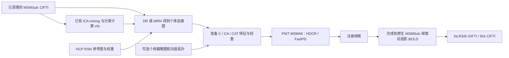

# FNIT MSMAll 多模态球面配准

## 1. 功能

`run_msmall` 在已有球面配准基础上，以每个顶点的多列特征做加权 Pearson 匹配，结合三角形应变、HOCR 和 FastPD 求解位移。它复现 HCP 的一级 coarse 与三级 refine 配置，复用 [MSMSulc](README.md) 已验证的网格变形、标签提案、展开和联合优化。计算使用 PyTorch 与包内 C++ 扩展，运行时不调用官方 newMSM、FSL、FreeSurfer 或 MATLAB。

MSMAll 的输入是准备好的个体和参考特征。`C` 使用静息态连接特征；`CA` 增加个体髓鞘图；`CAT` 再加入功能拓扑。没有个体 MyelinMap 时须明确选择 `C`。HCP 默认的 `CA_CAT` 外层流程、UKB 专用 DeDrift 和 FIX 不由本函数执行。本次真实数据对照采用 `C`，不将它称为标准 HCP/UKB 最终 MSMAll。



## 2. Python 调用、输入与输出

安装公开参考资源：

```bash
fnit-setup-fmri-surface-assets --output-dir /absolute/path/hcp_surface_assets --msmall --fmriprep
```

安装器校验固定 HCP v4.7.0 文件的 SHA-256；新增 WRN d7–d21 的 15 份模板另校验大小，共 86,180,368 字节。这 15 份文件从固定 HCP 上游下载，未列入 FNIT `assets-v1` Release。其他已镜像文件优先使用固定 Release。安装保留 HCP 许可文件，不包含个体特征或个体髓鞘图。

```python
from fnit import MSMAllConfig, MSMAllInputs, run_msmall

msmall_inputs = {
    hemisphere: MSMAllInputs(
        source_sphere=f"/absolute/path/features/{hemisphere}.sphere.surf.gii",  # 个体特征所在球面
        source_features=f"/absolute/path/features/{hemisphere}.source.func.gii",  # N×D 个体特征
        reference_sphere=f"/absolute/path/features/{hemisphere}.reference.surf.gii",  # 参考特征球面
        reference_features=f"/absolute/path/features/{hemisphere}.reference.func.gii",  # M×D 参考特征
        initial_sphere=f"/absolute/path/features/{hemisphere}.initial.surf.gii",  # 对应 --trans；与 source 同顶点顺序
        source_weights=f"/absolute/path/features/{hemisphere}.source.weights.func.gii",  # 个体成本权重
        reference_weights=f"/absolute/path/features/{hemisphere}.reference.weights.func.gii",  # 参考成本权重
    ) for hemisphere in ("L", "R")
}
registered_spheres = run_msmall(
    inputs=msmall_inputs,                              # 左、右 MSMAllInputs
    output_dir="/absolute/path/work/msmall",          # 注册球面及报告目录
    device="cuda:0",                                 # 单 GPU；也可 cpu
    config=MSMAllConfig.refine(),                      # HCP 三级配置；coarse() 为一级配置
    execution="optimized",                          # reference 保留执行方式对照
)
print(registered_spheres["L"])
print(registered_spheres["R"])
```

### 输入格式和参数

| 参数 | 数据与含义 |
|---|---|
| `inputs` | 只有 `L`、`R` 两个键的字典，值为 `MSMAllInputs`。 |
| `source_sphere` | GIFTI 球面，N×3 顶点及 F×3 三角形；特征附着于此网格。 |
| `source_features` | N×D GIFTI metric；可用每列一个 data array 或一个二维 data array，D≥2。 |
| `reference_sphere` / `reference_features` | M 个参考顶点及 M×D 特征；列数、含义和顺序必须与个体一致。 |
| `initial_sphere` | 可选上轮注册球面，对应官方 `--trans`；保持 source 顶点顺序和三角形。没有时从 source 球面开始。它不替代 source 特征坐标。 |
| `source_weights` / `reference_weights` | 可选 N×1/N×D 和 M×1/M×D GIFTI。双方同时提供才使用官方加权规则；只提供一方时按官方行为使用全 1 权重。 |
| `output_dir` | 独立配准工作目录，不是最终 BIDS fMRI 输出路径。 |
| `device` | `cuda:0` 或 `cpu`。几何、成本和优化采用 float64；无 FP16/BF16。 |
| `config` | `None`、`MSMAllConfig` 或受支持的官方配置文件。默认三级 refine。 |
| `execution` | `optimized` 缓存和合并传输；`reference` 用于比较执行方式，科学配置与停止条件相同。 |

权重只有一列时，官方将它用于第一项特征，其余项权重为 1，不广播到所有特征。双方权重重叠列取均值，列数较多一方的剩余列保留。特征准备函数会生成完整逐特征权重，普通调用建议同时提供双方文件。

### 配置参数

| 参数 | coarse | refine（默认） | 含义 |
|---|---|---|---|
| `simval` | `(2,)` | `(2,2,2)` | 每个 DATA 顶点跨特征的加权 Pearson。 |
| `iterations` | `(10,)` | `(10,15,15)` | 每级最大迭代数；保留官方提前停止与回退规则。 |
| `control_grid` | `(2,)` | `(2,3,4)` | 控制网格级别，对应 162、642、2,562 个点。 |
| `sampling_grid` | `(4,)` | `(4,5,6)` | 候选位移采样网格。 |
| `data_grid` | `(4,)` | `(4,5,6)` | 特征网格级别，对应 2,562、10,242、40,962 个点。 |
| `regularization` | `(0.00001,)` | `(0.00001,0.0075,0.01)` | 各级应变正则权重。 |
| `shear_modulus` / `bulk_modulus` | `0.4 / 1.6` | 同左 | 形状与面积应变权重。 |
| `strain_exponent` / `regularization_exponent` | `2 / 2` | 同左 | 应变势和正则项指数。 |

配置读取保留官方 float32 选项提升为 double 的行为。支持 HCP 的 `DISCRETE`、`HOCR`、`regoption=3`、零特征平滑、`VN`、`rescaleL`、`triclique`；不接受静默改变算法的其他选项。

### 输出

返回 `{"L": Path, "R": Path}`：

- `L.sphere.MSMAll.native.surf.gii`、`R.sphere.MSMAll.native.surf.gii`：注册球面，float32 顶点、int32 三角形；顶点数量和顺序与 source 相同。source 是 32k 时输出也为 32k，文件名中的 native 指输入网格。
- `registration_report.json`：实际配置、特征数、是否加权、逐级能量和迭代、停止与回退、耗时、峰值显存及 float32 输出翻折质控。

配准结果可通过 [surface pipeline](../fmri/surface.md) 的 `msmall_inputs` 接入。该流程默认先估计 MSMSulc；32k 特征的注册结果合成到原生 MSMSulc 球面，再执行 ribbon 投影。默认 `signal="preproc"` 对应 `desc-MSMAllpreproc`；显式选择 `signal="clean"` 使用已去噪 volume，输出 `desc-MSMAllclean`。注册球面的描述分别为 `MSMAllpreprocReg` / `MSMAllcleanReg`，与默认 MSMSulc 结果分别保存。

## 3. 命令行

```bash
fnit-msm msmall --inputs-json /absolute/path/msmall.inputs.json \
  --output-dir /absolute/path/work/msmall --device cuda:0 \
  --config /absolute/path/hcp_surface_assets/MSMConfig/MSMAllStrainFinalconf1to1_1to3_2 \
  --execution optimized
```

输入 JSON 顶层只含 `L`、`R`，每侧字段与上述 `MSMAllInputs` 相同。必填四个 sphere/features 字段；可选字段可省略或设为 `null`。相对文件名按 JSON 所在目录解析。此清单属于个体工作文件，不上传至公开仓库。

## 4. 官方对照调用

官方命令仅用于独立验证环境。将所选 HCP 配置复制到工作目录并追加 `--numthreads=1` 后运行左右两侧：

```bash
newmsm --inmesh=/absolute/path/features/L.sphere.surf.gii \
  --trans=/absolute/path/features/L.initial.surf.gii \
  --refmesh=/absolute/path/features/L.reference.surf.gii \
  --indata=/absolute/path/features/L.source.func.gii \
  --refdata=/absolute/path/features/L.reference.func.gii \
  --inweight=/absolute/path/features/L.source.weights.func.gii \
  --refweight=/absolute/path/features/L.reference.weights.func.gii \
  --conf=/absolute/path/reference/MSMAll.singlethread.conf \
  --out=/absolute/path/reference/L.
```

官方 HCP 的特征准备见 `ComputeVN.m`、`MSMregression.m` 与 `MSMAll.sh`。[FNIT 特征准备](features.md) 分别实现 VN、DR/WRN 和 C/CA/CAT 特征组合；输入已清理时间序列，不再次分类或去噪。

## 5. 真实数据精度与速度

### 本轮 CPU 官方配对

[CPU 官方报告](../../validation/fmri_cpu_20261004/task04_msm_surface/README.md)完整运行双侧 32,492 顶点、33 列真实 WRN C 特征，保留一级 coarse 与三级 refine 全部停止条件。最新候选 CPU1 的全部坐标、有序 faces 与原版严格单线程逐位相同，0 相对翻面；候选 CPU8 与 CPU1 的球面文件 SHA 相同。

| 完整双侧功能 | CPU 预算 | 原版 fresh / s | FNIT fresh / s | FNIT 完整 API / s |
| --- | ---: | ---: | ---: | ---: |
| WRN C coarse | 1 | 96.724 | 58.948 | 56.162 |
| WRN C coarse | 8 | 28.814 | 26.671 | 24.196 |
| WRN C refine | 1 | 2020.025 | 1512.800 | 1510.518 |
| WRN C refine | 8 | 600.420 | 360.841 | 358.670 |

原版多线程会改变结果：coarse 右侧相对单线程平均角差 0.706°、p99 4.266°；refine 左/右平均角差 0.251/0.277°。FNIT CPU1/8 保持严格单线程参照。上述是同预算各一次 fresh-process 观测，包含读写和程序启动；实际源码、输入不变检查和全部角差见[最新回执](../../validation/fmri_cpu_20261004/task04_msm_surface/completion_status_20261005.public.json)。最终 GPU 旧/新配对另列。

最新匿名汇总、精度与耗时的测量范围见 [MSM 验证页](../../validation/msm/README.md)。对照固定同一真实 BOLD、参考图、特征和权重，分别执行完整官方配置。球面误差按对应顶点计算；490 帧时间序列先逐灰质点计算 Pearson，再取均值。单次成本检查、完整球面和最终时间序列是不同检查项。

以下为当前源码 `249919f2` 的双侧配准，设备为 H100 PCIe、PyTorch 2.5.1/CUDA 11.8，FNIT 的 CPU 线程数为 4；官方 newMSM 为单 CPU 线程。几何和成本用 float64，GIFTI/CIFTI 写出 float32。[正式汇总](../../validation/msm/msmall.current.public.json)保存完整配置、哈希与各级记录。

| 双侧配准配置 | 官方 CPU 1 线程 | FNIT H100 冷调用 | 热调用 | 峰值已分配显存 |
|---|---:|---:|---:|---:|
| coarse，一级 `_1` | 105.02 s | **20.31 s** | **20.39 s** | 0.095 GB |
| refine，三级 `_2` | 2,155.63 s | **167.72 s** | **166.63 s** | 1.213 GB |

每套配置的冷、热调用保存球面都与官方左右两侧逐值相同：角差和弦长差的 mean、median、p95、maximum 均为 **0**，双方实际 float32 输出的翻折面数均为 **0**。本例相对官方单线程的冷调用速度分别为 5.17 倍和 12.85 倍。计时包含输入读取、配准及球面/报告写盘，排除导入、CUDA 初始化、离线比较和 BOLD 投影。冷调用指初始化后的首次配准，未清空文件系统缓存；coarse 与 refine 是相同固定特征的两次独立验收，不能相加为 HCP `CA_CAT` 外层的全流程时间。

### 固定 BOLD 到 fsLR32k / 91k

每套 32k 变形都合成到同一原生 MSMSulc 球面，分别生成 32k 面积表面，再用相同固定 BOLD、几何、ROI 和 Workbench 投影。当前入口初始化修复后的保存球面，与本次投影实际使用的球面逐值一致。

| 490 帧时序对照 | coarse | refine |
|---|---:|---:|
| CIFTI 灰质点 / 有效非恒定点 | 91,282 / 90,594 | 91,282 / 90,570 |
| 左皮层逐点时间 r 均值 | **1** | **1** |
| 右皮层逐点时间 r 均值 | **1** | **1** |
| 全部有效灰质点时间 r 均值 | **1** | **1** |
| 全部值 MAE / 最大绝对差 | **0 / 0** | **0 / 0** |
| 官方球面投影 / FNIT 球面投影 | 346.39 / 345.12 s | 340.31 / 344.73 s |

时间轴和 BrainModel 轴相同；19 个皮层下结构也全部 r=1、MAE/最大差=0。相关是在每点内跨全部时间帧计算，再取均值；恒定序列仅参与绝对误差。投影是独立墙钟，两个分支使用相同 Workbench，不表示 FNIT 改写了 Workbench 算法，也不作为 raw BIDS 到 CIFTI 的完整链测量。

该历史专项未提供可确认来源的个体髓鞘图，测试特征为 `C`。490 帧已清理 CIFTI 选取 90,568 个有效灰质点，WRN d40 参考保留 32 个组件，加 medial-wall 后两侧各为 33 列。完整特征准备耗时 47.498 s；VN 与 WRN 保存地图对独立 NumPy 源码公式逐值一致，节点时序最大差 `1.98e-14`。该历史专项的 MATLAB 特征程序未能启动；本轮已在 nodecw10 使用合法 MATLAB R2018b 完成原 HCP 函数对照，见 [CPU 官方报告](../../validation/fmri_cpu_20261004/task04_msm_surface/README.md)。官方 newMSM 球面求解器的结果仍按各自实测版本记录。特征覆盖、参数和逐项耗时见 [特征功能页](features.md#5-真实数据精度与耗时)与[匿名特征报告](../../validation/msm/msmall.features.current.public.json)。

三级配准的第 2 级首次提案已定位到权重面积缓存。两端进入该级的 SOURCE、控制点、标签坐标和三角形索引逐位一致；原权重重采样错误地沿用了固定构网面积。按官方 Mesh 拷贝时重建面积后，在同一真实状态下：

| 第 2 级检查点：对官方最大绝对差 | 修复前 | 修复后 |
|---|---:|---:|
| 合并的逐特征权重 | `3.89e-5` | `6.66e-16` |
| 控制点绝对权重 | `0.020014` | `9.99e-16` |
| 10,240 项三角形候选成本 | `0.004023` | `8.29e-10` |

修复后的候选成本 MAE 为 `1.97e-13`，全部成本转换为 float32 后逐值一致；零标签成本按原顺序相加为 `496.05739459784087`，与官方相同。[匿名定位记录](../../validation/msm/msmall.diagnostics.current.public.json)保留实际状态、两处面积反事实及来源哈希。上述完整三级球面和全帧时序复测随后通过。

### 特征脑图示例


图为公开 HCP d40 的第 10 个参考组件，使用 TemplateFlow 的 HCP fsLR32k inflated 表面；仅展示配准特征的空间结构，不是个体拟合结果或精度图。红、蓝为正、负参考特征值。CPU 绘图脚本与资源哈希见 [脚本](../../tools/plot_msmall_reference.py)和[图像来源](images/reference_rsn.json)。表面从 [TemplateFlow 原站](https://templateflow.s3.amazonaws.com/tpl-fsLR/template_description.json)获取，未镜像表面文件。

```bash
python tools/plot_msmall_reference.py \
  --reference-map /absolute/path/hcp_surface_assets/global/templates/MSMAll/rfMRI_REST_Atlas_MSMAll_2_d41_WRN_DeDrift_hp2000_clean_PCA.ica_d40_ROW_vn/melodic_oIC.dscalar.nii \
  --left-surface /absolute/path/templates/tpl-fsLR_den-32k_hemi-L_inflated.surf.gii \
  --right-surface /absolute/path/templates/tpl-fsLR_den-32k_hemi-R_inflated.surf.gii \
  --component 10 --color-limit 0.35 --threshold 0 \
  --output /absolute/path/figures/reference_rsn.png
```

`component` 为一基组件编号；`color-limit` 为红蓝对称色标的最大绝对值，省略时取皮层绝对值的第 98 百分位；`threshold` 以下显示灰色脑表面。图像和来源 JSON 写入 `output` 指定位置，无 GPU 绘图依赖。

## 6. 更新与基准记录

- 2026-10-04 起：加入 CPU 1/8 实际 newMSM 完整配对；一级和三级 CPU1 基线已验证全双侧坐标逐位一致，CPU containing-face 优化候选继续整例核对。
- 2026-10：新增独立 MSMAll 多列特征求解、一级/三级 HCP 配置、VN/DR/WRN 准备与 surface 可选接口；安装器补齐 d7–d21。真实 C 特征准备为 47.498 s，保存地图对独立源码公式逐值一致；球面与投影实测集中保留在验证页。
- 既有 MSMSulc 三角形正则计算提取为共享函数；CPU/CUDA、SSD/Pearson、单状态/八状态共 2,880 个成本逐位保持不变。此前真实 MSMSulc 结果仍按其原测量源码哈希记录。
- 修复 MSMAll 边界邻域选择及逐级球面重建中的舍入差异：歧义三角形用包内 C++ 保留标量运算和严格距离比较，球面 warp 在一次批量传输后按顶点编号重建与归一化。默认 MSMSulc 未启用这条新增执行路径。
- 权重重采样按官方定义先找包含三角形，再比较其三个角点，严格并列时保留原三角形顺序。全局最近顶点在非均匀球面上并不等价；该错误在真实左侧第三级影响 33 个权重值，已修正后再测。
- 修复独立 Python 进程首次调用 CUDA 时，显存统计早于 CUDA 初始化而报错的问题；MSMAll 与共享 MSMSulc 入口均在统计前完成初始化。两种入口的新进程 GPU 调用回归测试通过。初始化位于配准阶段计时前，几何、成本和求解步骤不变。
- 修正权重重采样的面积缓存：官方 Mesh 拷贝会重建三角形，重新计算拷贝时坐标的面积。参考权重使用归一化 DATA 网格的面积；绝对权重使用当前变形 SOURCE 和控制网格的面积。此前沿用构网时的固定面积，与这些拷贝边界不同。真实第 2 级检查点已确认此项是权重及候选成本差异的原因；特征初始化的 VN 面积缓存与默认 MSMSulc 保持原定义。

## 7. 参考文献与源码

- Robinson 等，*Multimodal surface matching with higher-order smoothness constraints*，NeuroImage，2018，[DOI](https://doi.org/10.1016/j.neuroimage.2017.10.037)。
- Glasser 等，*The Minimal Preprocessing Pipelines for the Human Connectome Project*，NeuroImage，2013，[DOI](https://doi.org/10.1016/j.neuroimage.2013.04.127)。
- [newMSM 固定源码](https://github.com/rbesenczi/newMSM/tree/260718953547743c028a45f8c885d163441df87a)、[HCP MSMAll v4.7.0](https://github.com/Washington-University/HCPpipelines/tree/f8cac6892f88bdf889d644711ff038198eb81533/MSMAll)、[HCP 许可](https://github.com/Washington-University/HCPpipelines/blob/f8cac6892f88bdf889d644711ff038198eb81533/LICENSE.md)。
