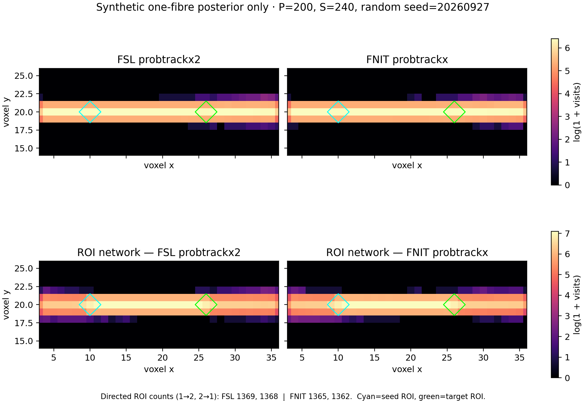

# PyTorch ProbtrackX：概率纤维束追踪

`fnit.probtrackx.TorchProbtrackX` 从 BEDPOSTX 方向后验生成两类体积空间结果：单个 seed 掩膜到全脑的 `fdt_paths.nii.gz`，以及多个 ROI 之间的有向 `fdt_network_matrix`。运行时不调用 FSL。输入必须已处于同一个扩散影像网格；本功能不替用户配准图谱。

## Python 调用

```python
from fnit import TorchProbtrackX

tracker = TorchProbtrackX(device="cuda:0", nsamples=5000, nsteps=2000)
seed_result = tracker.run(
    "/absolute/path/subject.bedpostX",
    "/absolute/path/seed_to_voxel",
    seed="/absolute/path/seed.nii.gz",
)
network_result = tracker.run(
    "/absolute/path/subject.bedpostX",
    "/absolute/path/network",
    regions=["/absolute/path/roi_01.nii.gz", "/absolute/path/roi_02.nii.gz"],
)
print(seed_result.paths, network_result.network_matrix)
```

`run()` 恰好接收 `seed` 或 `regions` 之一；`regions` 至少含两个互不重叠的 ROI。每次只处理一个被试。`samples_dir` 需要 FSL BEDPOSTX 格式的 `nodif_brain_mask.nii.gz` 与每条纤维对应的 `merged_th<i>samples.nii.gz`、`merged_ph<i>samples.nii.gz`、`merged_f<i>samples.nii.gz`。所有 ROI 的三维形状和 affine 都必须与后验 mask 一致。可以使用本包 `TorchBEDPOSTX` 或原版 FSL bedpostx 输出的这些文件。

| 参数 | 默认值 | 含义 |
| --- | ---: | --- |
| `device` | `cpu` | `cpu` 或 `cuda:0` 等 PyTorch 设备 |
| `nsamples` | 5000 | 每个 seed 体素的 Monte Carlo 轨迹数 |
| `nsteps` | 2000 | 双向总步数，各方向最多一半；必须为偶数 |
| `steplength` | 0.5 mm | 每步的物理长度 |
| `cthr` | 0.2 | 相邻方向绝对点积的下限 |
| `fibthresh` | 0.01 | 次要纤维后验体积分数阈值 |
| `batch_size` | 2048 | 同时追踪的轨迹数 |
| `seed` | 12345 | PyTorch 随机数种子 |

返回的 `ProbTrackXResult` 提供输出路径、seed 体素数、接受的轨迹数和包含读写的总运行时间。若输出文件已存在，`run()` 默认报错；明确传 `overwrite=True` 才覆盖。GPU 路径使用 float32，允许 TF32 matmul 和 cuDNN。Linux CUDA 环境安装 Triton 3.1.0 后，轨迹步进由融合内核执行；缺少 Triton 时使用原 PyTorch 步进，结果遵循相同的追踪规则，但随机数流不同。主页 `environment.yml` 已包含 Triton。

## 命令行

```bash
fnit probtrackx \
  --samples-dir /absolute/path/subject.bedpostX \
  --seed /absolute/path/seed.nii.gz \
  --output-dir /absolute/path/seed_to_voxel \
  --device cuda:0
```

网络模式把 ROI 路径每行写入一个 UTF-8 文本文件，行顺序就是矩阵行列顺序；相对路径相对于列表文件解析：

```bash
fnit probtrackx \
  --samples-dir /absolute/path/subject.bedpostX \
  --roi-list /absolute/path/roi_list.txt \
  --output-dir /absolute/path/network \
  --device cuda:0
```

与以上两个 FNIT 任务对应的原版 FSL 命令（`roi_list.txt` 每行一个 ROI 绝对路径）为：

```bash
"$FSLDIR/bin/probtrackx2" \
  -s /absolute/path/subject.bedpostX/merged \
  -m /absolute/path/subject.bedpostX/nodif_brain_mask.nii.gz \
  -x /absolute/path/seed.nii.gz \
  --dir=/absolute/path/fsl_seed --forcedir --opd \
  -P 5000 -S 2000 --steplength=0.5 --cthr=0.2 --fibthresh=0.01
"$FSLDIR/bin/probtrackx2" \
  -s /absolute/path/subject.bedpostX/merged \
  -m /absolute/path/subject.bedpostX/nodif_brain_mask.nii.gz \
  -x /absolute/path/roi_list.txt --network \
  --dir=/absolute/path/fsl_network --forcedir --opd \
  -P 5000 -S 2000 --steplength=0.5 --cthr=0.2 --fibthresh=0.01
```

独立入口 `fnit-probtrackx` 接受相同参数。`waytotal` 在单 seed 模式是一个整数，在网络模式是每个源 ROI 一行的整数。`fdt_paths.nii.gz` 对每条接受的双向轨迹经过的每个体素计数一次。网络矩阵第 *i* 行第 *j* 列记录从 ROI *i* 发出的轨迹中到达 ROI *j* 的条数；同一轨迹多次进入 ROI *j* 仍只计一次，主对角为零。原始计数随 ROI 体素数和 `nsamples` 增长，不能直接解释为标准化连接概率。

## 与官方 ProbtrackX 的功能覆盖

按 [FSL ProbtrackX 官方说明](https://fsl.fmrib.ox.ac.uk/fsl/docs/diffusion/probtrackx.html)及本次测试服务器 FSL 6.0.7.22 的 `probtrackx2 --help` 核对：**当前只实现了原版命令行功能的一个子集**，不能将其当作全部选项的替代。已实现路径为同一扩散网格的体积掩膜、简单 Euler 双向追踪、`--opd` 路径密度和 `--network` ROI 矩阵；初始固定取第一纤维，随后按方向一致性与 `fibthresh` 选择纤维。

| 官方功能类别 | 当前状态 | 尚未实现的主要选项 |
| --- | --- | --- |
| BEDPOSTX 输入和体积 seed | 支持后验目录、单个 NIfTI seed 或多个 NIfTI ROI；支持 `-P`、`-S`、`--steplength`、`--cthr`、`--fibthresh`、`--rseed` | 独立 `-m` 覆盖 mask、ASCII 坐标 `--simple`、表面 seed、`--seedref`、`--sampvox`、`--meshspace` |
| 空间 | seed、ROI 和后验必须共用扩散网格 | `--xfm`、`--invxfm` 跨空间线性/非线性变换 |
| 轨迹筛选和终止 | 支持后验 mask 边界、曲率和步数停止；网络模式要求到达另一 ROI | `--waypoints`、`--waycond`、`--wayorder`、`--onewaycondition`、`--avoid`、`--stop`、`--wtstop`、`--loopcheck`、`--distthresh` |
| 方向和积分 | 第一纤维起始、默认简单 Euler、次要纤维阈值 | `--randfib`、`--fibst` 的其他起始模式、`--usef`、`--modeuler` |
| 输出 | `fdt_paths.nii.gz`、`waytotal`、多 ROI 的 `fdt_network_matrix` | `--pd`、`--ompl`、`--fopd`、`--targetmasks`/`--os2t`、`--s2tastext`、`--opathdir`、`--omatrix1/2/3/4`、FSL 运行日志 |

`fdt_network_matrix` 是 ROI×ROI 计数；它**不是** FSL `--omatrix3` 的体素×体素稀疏矩阵。仅在上表已支持且参数匹配的路径上比较数值或速度。

## 与原版 FSL 的真实 DWI 配对 benchmark

在 `gpucw1` 上使用同一例真实 UK Biobank DWI 的**原版 FSL BEDPOSTX 三纤维后验**（104×104×72，50 帧）。JHU 白质图谱经已有 MNI→DWI 变换最近邻重采样，在胼胝体膝部、左右皮质脊髓束和左右上纵束各取 7 个 mask 内、FA≥0.3 的 seed 体素，选点不依赖追踪结果。FSL 6.0.7.22 与 FNIT 均设 `-P 200 -S 400`、步长 0.5 mm、`cthr=0.2`、`fibthresh=0.01`、`rseed=20260927`；FNIT 使用默认 `batch_size=2048`。计时包含进程启动、后验载入、追踪与写盘。

| Seed 区域 | CPU 图相关 *r* | CPU 高密度前 10% Dice | CPU 墙钟 FSL / FNIT |
| --- | ---: | ---: | ---: |
| 胼胝体膝部 | 0.9938 | 0.8902 | 12.24 / 15.58 s |
| 右皮质脊髓束 | 0.9961 | 0.8728 | 11.57 / 12.27 s |
| 左皮质脊髓束 | 0.9967 | 0.9020 | 13.69 / 15.08 s |
| 右上纵束 | 0.9954 | 0.8631 | 12.57 / 15.54 s |
| 左上纵束 | 0.9970 | 0.9416 | 12.54 / 15.06 s |

五个 seed 的 `waytotal` 两边均为 1400。GPU 胼胝体 seed：FSL / FNIT 墙钟 13.63 / 13.11 s，图相关 *r*=0.9939，高密度 Dice=0.8842。CPU 五例墙钟中位数分别为 12.54 / 15.08 s。并行解压载入在保持同 `batch_size=256` 时使 CPU、GPU 输出与旧版逐体素完全相同；GPU Triton 内核改用独立随机流，因此按分布和 FSL 比较。GPU 峰值已分配显存为 2.61 GiB。

五区有向网络使用 `-P 2000 -S 400` 减少稀疏连接的抽样波动：

| 网络运行 | FSL 墙钟 | 优化前 FNIT 墙钟 | 当前 FNIT 墙钟 | FSL–当前 FNIT 图相关 / 高密度 Dice |
| --- | ---: | ---: | ---: | ---: |
| CPU | 31.50 s | 111.62 s | 50.52 s | 0.9390 / 0.8142 |
| GPU | 11.66 s | 128.75 s | 17.84 s | 0.9575 / 0.7756 |

CPU 优化前使用 `batch_size=256`；当前为 2048，运行快 2.21 倍。GPU 优化前已使用 2048，但逐步 PyTorch 启动多个小内核；融合步进后快 7.22 倍。GPU 为共享的 H100，以上是该次配对墙钟观察，不代表独占 GPU 吞吐量。右皮质脊髓束→左皮质脊髓束：FSL CPU 53、FSL CPU 换随机种子 67、FSL GPU 73、当前 FNIT CPU 66、当前 FNIT GPU 67；其他边多为零或个位数。FSL CPU 两次网络密度图相关 0.9262、高密度 Dice 0.7611，可供判断这次 Monte Carlo 波动；低计数边不能据单次结果解释生物连接强度。

这组对照只检验追踪阶段。它不检验 BEDPOSTX 拟合，也不要求不同随机数流产生逐条相同的轨迹。参数低于 FSL 的默认 5000 条和 2000 步。完整 [当前优化指标](../../validation/probtrackx/report.optimization.public.json)、[优化前五区指标](../../validation/probtrackx/report.multiregion.public.json)及[复现步骤](../../validation/probtrackx/README.md)均在验证目录；真实被试影像和对照图留在授权服务器。

## 合成数据可视化



该图由 40×40×40 的管状单纤维 posterior（每体素 20 帧）生成，不含 UK Biobank 影像。两边均采用每 seed 体素 200 条轨迹、240 总步数及随机种子 20260927。seed-to-voxel 图在非零体素并集上的 Pearson *r*=0.9875；FSL 的 ROI 1→2/2→1 计数为 1369/1368，FNIT 为 1366/1369。合成数据的 [生成脚本](../../validation/probtrackx/generate_synthetic_posterior.py)、[复现命令](../../validation/probtrackx/run_synthetic_comparison.sh)、[完整指标](../../validation/probtrackx/synthetic_reference.public.json) 和 [验证记录](../../validation/probtrackx/README.md) 均可公开复现。上面的真实数据实验仅发布汇总指标。

## 来源

- [FSL ProbtrackX 官方说明](https://fsl.fmrib.ox.ac.uk/fsl/docs/diffusion/probtrackx.html)
- [FSL ptx2 官方源码及许可证](https://git.fmrib.ox.ac.uk/fsl/ptx2)
- [FSL 软件许可证](https://fsl.fmrib.ox.ac.uk/fsl/docs/license.html)
