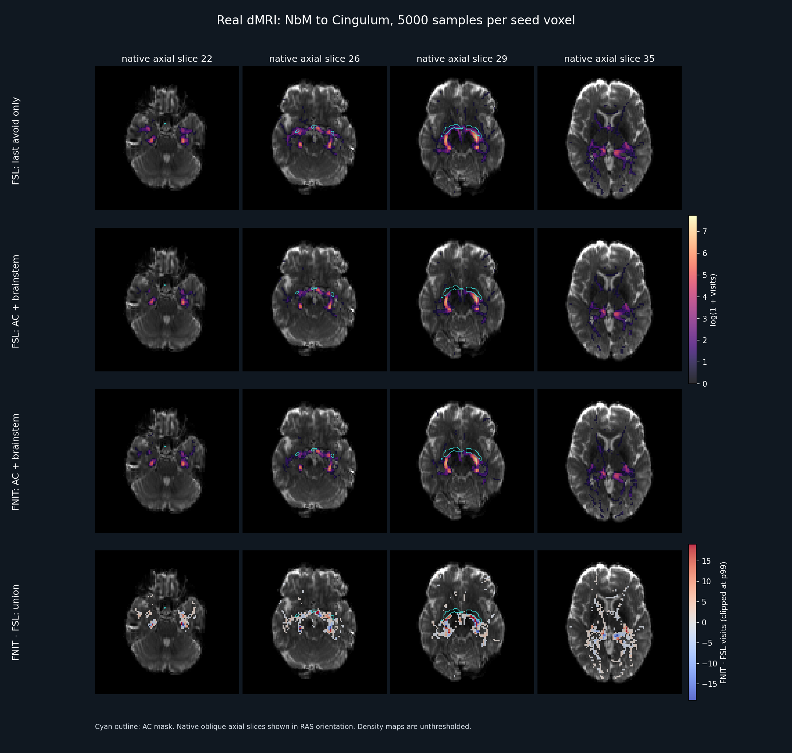

# TorchProbtrackX：概率纤维追踪与连接计数

| 项目 | 内容 |
|---|---|
| 输入 | BEDPOSTX后验及diffusion/MNI体积seed/ROI |
| 输出 | 路径密度、ROI网络及稀疏体素矩阵 |
| 对应原软件 | FSL probtrackx2 / probtrackx2_gpu的体积追踪 |
| Python / CLI | TorchProbtrackX.run / fnit-probtrackx |
| CPU / GPU | CPU PyTorch；CUDA Triton步进，CPU汇总/I/O |

## 1. 功能简介

`TorchProbtrackX` 从BEDPOSTX方向后验采样双向轨迹，输出seed→voxel路径密度、有向ROI→ROI矩阵或稀疏体素连接计数。MNI体积mask可用同被试FNIT dMRI配准结果先反映射到diffusion；实际追踪仍在diffusion网格完成。

CPU使用PyTorch，GPU步进用Triton，Numba/NumPy汇总和nibabel读写在CPU；float32、CUDA允许TF32，不用FP16/BF16。运行时不调用FSL。轨迹计数不是解剖纤维条数，归一化计数也不等同于无偏连接概率；随机数流与FSL不同。


## 2. Python 调用

```python
from fnit.probtrackx import TorchProbtrackX

tractography_model = TorchProbtrackX(
    device="cuda:0",  # Triton GPU步进
    nsamples=5000,  # 每seed体素的采样轨迹数
    nsteps=2000,  # 双向总步数，必须是偶数
    steplength=0.5,  # 每步长度，mm
    seed=12345,  # 随机种子
)
tractography_result = tractography_model.run(
    samples_dir="/data/results/subject.bedpostX",  # 后验与脑mask目录
    output_dir="/data/results/tractography",  # 新的追踪结果目录
    seed="/data/masks/seed_in_diffusion.nii.gz",  # 非空diffusion 3D seed
    overwrite=False,  # 保留已有结果
)
path_density_file = tractography_result.paths  # fdt_paths.nii.gz路径
accepted_streamline_file = tractography_result.waytotal  # 实际接受数文本
```

### 输入数据格式

```text
subject.bedpostX/
├── nodif_brain_mask.nii.gz
├── merged_th1samples.nii.gz
├── merged_ph1samples.nii.gz
├── merged_f1samples.nii.gz
└── ...                         # 按纤维数重复th/ph/f
```

- 后验NIfTI为`[X,Y,Z,Nsample]`，角度弧度、分数无量纲，所有文件与3D脑mask共享shape/affine/orientation，方向按该diffusion网格约定。
- `run(seed=...)`为非空3D体积mask；`regions`为至少两个非空、不重叠ROI，列表顺序定义矩阵行列。二者必须择一。
- 追踪/avoid/stop/waypoint/目标mask是3D非零NIfTI。diffusion输入必须同后验网格；MNI输入必须提供同被试配准。路径列表中的相对路径按列表文件所在目录解析。
- MNI映射使用最近邻，不改变ROI标签。`dmri_pipeline_dir`、单`diff2mni_warp`、成对`diff2struct_mat+struct2mni_warp`三种方式择一。
- TBSS系数场已含affine，不重复叠加同矩阵。MMORF参考图像轴mm场与FA scaled-mm矩阵先转换成FSL dense pull场。
- pipeline模式核对native FA与BEDPOSTX mask的shape/affine；auto只在唯一分支可识别时选择，两分支同时存在须指定tbss或mmorf。

ROI网络示例：

```python
network_result = tractography_model.run(
    samples_dir="/data/results/subject.bedpostX",  # 同一后验
    output_dir="/data/results/roi_network",  # 另一个新目录
    regions=["/data/masks/roi_01.nii.gz", "/data/masks/roi_02.nii.gz"],  # 不重叠ROI
    overwrite=False,  # 保留已有网络
)
```

MNI seed示例：

```python
mni_seed_result = tractography_model.run(
    samples_dir="/data/results/subject.bedpostX",  # 原生diffusion后验
    output_dir="/data/results/mni_seed_tracking",  # 新结果根
    seed="/data/masks/seed_in_mni.nii.gz",  # 标准空间seed
    dmri_pipeline_dir="/data/results/dmri_subject",  # 同被试native/registration输出
    registration_backend="auto",  # 唯一TBSS/MMORF分支；歧义时明确指定
    overwrite=False,  # 不覆盖
)
```

mask映射后先核对非空体素数及位置。不同方法若得到不同seed集合，追踪差异含上游空间映射，不能全归因于追踪器。

**`TorchProbtrackX.__init__` 参数**

| 参数 | 必需 | 类型 | 默认值 | 含义 |
|---|---|---|---|---|
| `device` | 否 | `str/torch.device/None` | `'cpu'` | PyTorch 设备；None 自动选择可用 CUDA，否则 CPU。 |
| `nsamples` | 否 | `int` | `5000` | 每个 seed 体素发出的采样轨迹数。 |
| `nsteps` | 否 | `int` | `2000` | 双向轨迹总步数，必须为≥2的偶数。 |
| `steplength` | 否 | `float` | `0.5` | 单步物理长度，单位 mm。 |
| `cthr` | 否 | `float` | `0.2` | 相邻方向的最小点积阈值，控制曲率。 |
| `fibthresh` | 否 | `float` | `0.01` | 可选纤维的最小后验体积分数。 |
| `batch_size` | 否 | `int` | `16384` | 每批并行样本数；具体约束见各入口。 |
| `seed` | 否 | `int` | `12345` | 随机种子；固定并不保证不同软件随机轨迹相同。 |
| `distthresh` | 否 | `float` | `0.0` | 单半路径最短长度，单位 mm。 |
| `sampvox` | 否 | `float` | `0.0` | seed 体素内位置抖动半径，单位 mm。 |
| `fibst` | 否 | `int或None` | `None` | 起始纤维编号；None 用默认选择规则。 |
| `usef` | 否 | `bool` | `False` | 是否按局部纤维分数选择方向。 |
| `randfib` | 否 | `int` | `0` | 起始纤维随机选择模式，支持0、1、2、3。 |
| `pathdist` | 否 | `bool` | `False` | 密度/ROI矩阵按路径长度加权；不支持新稀疏矩阵及 targetmasks 组合。 |
| `mean_path_length` | 否 | `bool` | `False` | 另写平均首次抵达长度；不支持新稀疏矩阵及 targetmasks 组合。 |

**`TorchProbtrackX.run` 参数**

| 参数 | 必需 | 类型 | 默认值 | 含义 |
|---|---|---|---|---|
| `samples_dir` | 是 | `路径` | `—` | 含 nodif_brain_mask 和 merged_th/ph/f 后验的 BEDPOSTX 目录。 |
| `output_dir` | 是 | `路径` | `—` | 本次结果目录；路径按当前工作目录解析。 |
| `seed` | 否 | `str/PathLike或None` | `None` | 非空3D seed掩膜路径；与regions二选一。 |
| `regions` | 否 | `路径/序列或None` | `None` | 至少两个不重叠、非空体积 ROI；与 run(seed=...) 二选一。 |
| `mask` | 否 | `路径` | `None` | 可选追踪mask，None用BEDPOSTX的nodif_brain_mask。 |
| `avoid` | 否 | `str/PathLike或None` | `None` | 轨迹经过即剔除的3D掩膜。 |
| `stop` | 否 | `str/PathLike或None` | `None` | 轨迹进入后停止的3D掩膜。 |
| `forcefirststep` | 否 | `bool` | `False` | 首步是否跳过 avoid/stop 判定。 |
| `waypoints` | 否 | `路径/序列或None` | `None` | 必经掩膜路径、路径列表或文本列表。 |
| `waycond` | 否 | `str` | `'AND'` | AND经过全部 waypoint；OR经过至少一个。 |
| `wayorder` | 否 | `bool` | `False` | AND条件下按 waypoint 列表顺序通过。 |
| `onewaycondition` | 否 | `bool` | `False` | 每条半轨迹单独满足 waypoint 条件。 |
| `wtstop` | 否 | `路径/序列或None` | `None` | 允许进入、首次离开后停止的掩膜或掩膜列表。 |
| `matrix1` | 否 | `bool` | `False` | 是否保存 seed体素×seed体素稀疏计数矩阵。 |
| `target2` | 否 | `str/PathLike或None` | `None` | matrix2 的目标体素掩膜，必须与追踪空间同网格。 |
| `target3` | 否 | `str/PathLike或None` | `None` | matrix3 共访矩阵的行目标体素掩膜。 |
| `lrtarget3` | 否 | `str/PathLike或None` | `None` | matrix3 列目标掩膜；None 使用 target3 的上三角矩阵。 |
| `distthresh1` | 否 | `float` | `0.0` | 仅 matrix1 更新的最短完整路径长度，单位 mm。 |
| `distthresh3` | 否 | `float` | `0.0` | 仅 matrix3 更新的最短完整路径长度，单位 mm。 |
| `targetmasks` | 否 | `路径/序列或None` | `None` | seed体素到ROI命中计数的目标掩膜列表或文本列表。 |
| `mni_reference` | 否 | `str/PathLike或None` | `None` | MNI掩膜所在的3D参考网格；pipeline模式可自动读取。 |
| `diff2struct_mat` | 否 | `str/PathLike或None` | `None` | diffusion→T1 FLIRT scaled-mm 矩阵，必须配合 struct2mni_warp。 |
| `struct2mni_warp` | 否 | `str/PathLike或None` | `None` | T1→MNI FSL warp，必须配合 diff2struct_mat。 |
| `diff2mni_warp` | 否 | `str/PathLike或None` | `None` | 已含 affine 的 diffusion→MNI FSL warp，不再重复组合相同矩阵。 |
| `dmri_pipeline_dir` | 否 | `str/PathLike或None` | `None` | 同被试 FNIT dMRI 输出根，含 native/ 和 registration/。 |
| `registration_backend` | 否 | `str` | `'auto'` | 选择配准分支；pipeline为tbss/mmorf，追踪另允许auto。 |
| `overwrite` | 否 | `bool` | `False` | 是否允许覆盖已有结果；默认已有结果时报错。 |

### 输出

```text
tractography/
├── fdt_paths.nii.gz / waytotal
├── fdt_paths_lengths.nii.gz              # mean_path_length
├── fdt_network_matrix                   # regions
├── fdt_network_matrix_{probability,symmetric,lengths}
├── fdt_matrix1.dot / coords_for_fdt_matrix1
├── fdt_matrix2.dot / coords_for_fdt_matrix2
├── tract_space_coords_for_fdt_matrix2
├── lookup_tractspace_fdt_matrix2.nii.gz
├── fdt_matrix3.dot / coords_for_fdt_matrix3
├── seeds_to_<target>.nii.gz / matrix_seeds_to_all_targets
└── mni_to_diffusion/                    # 仅MNI输入
    ├── diff2mni_warp.nii.gz
    ├── mni2diff_warp.nii.gz
    └── masks/<序号>/<input>.nii.gz
```

可选文件仅在启用对应输出时出现，完整文件规则见[matrix_io.py](../../src/fnit/probtrackx/matrix_io.py)。

| 输出 | shape、空间、索引与单位 |
|---|---|
| fdt_paths | `[X,Y,Z]` float32，同后验mask affine/orientation/diffusion空间；计数，或pathdist长度加权和。 |
| lengths | 同网格float32；首次抵达平均长度，mm。 |
| waytotal | seed模式一行；regions每ROI一行，接受轨迹计数。 |
| network矩阵 | `[Nroi,Nroi]`文本，有向计数；lengths为mm，probability/symmetric是FNIT附加归一化矩阵。 |
| matrix1 | `[Nseed,Nseed]`，无自连接。 |
| matrix2 | `[Nseed,Ntarget2]`，每轨迹对同一目标体素最多一次。 |
| matrix3 | 目标体素共同经过计数；同target时上三角无对角，lrtarget3时行目标×列目标。 |
| .dot与坐标表 | 1起始row/column/count三元组，末行Nrow Ncol 0；体素顺序必须读配套坐标表。 |
| lookup | 目标体素1起始列号，背景0；同target2网格。 |
| seeds_to_target | 每目标一张seed网格计数图；文本矩阵`[Nseed,Ntarget_ROI]`。 |
| diff2mni/mni2diff | 分别位于MNI/diffusion网格的pull场，须按文件方向和参考图使用，不能当普通方向图。 |

`ProbTrackXResult`返回目录、各实际输出路径、seed_points、accepted_streamlines、elapsed_seconds和可选矩阵/MNI转换目录。未启用路径为None/空tuple。

`wayorder`仅与AND联用；默认两个半轨迹合并满足waypoint，onewaycondition改为各半轨迹满足。stop进入即停，wtstop允许进入后离开再停。pathdist/mean_path_length与新matrix1/2/3、targetmasks组合会报错。

## 3. 命令行调用

```bash
fnit-probtrackx --samples-dir /data/results/subject.bedpostX    --seed /data/masks/seed_in_diffusion.nii.gz --output-dir /data/results/tractography    --device cuda:0 --nsamples 5000 --nsteps 2000 --steplength 0.5 --rseed 12345
```

统一入口 `fnit probtrackx` 相同。网络模式把--seed替换为--roi-list文本列表。

| CLI | Python | 含义 |
|---|---|---|
| --samples-dir / --output-dir | samples_dir / output_dir | 后验和结果目录 |
| --seed / --roi-list | run.seed / regions | 单seed或ROI网络，互斥 |
| --rseed | 构造函数seed | 随机种子；不要与输入seed混淆 |
| --nsamples / --nsteps / --steplength / --cthr / --fibthresh | 同名构造参数 | 轨迹、步长、曲率和分数 |
| --distthresh / --sampvox / --fibst / --randfib / --usef | 同名构造参数 | 起始方向与过滤 |
| --batch-size / --device | batch_size / device | 批大小和设备 |
| --pd / --ompl | pathdist / mean_path_length | 路径长度模式 |
| --mask / --avoid / --stop / --forcefirststep | 同名run参数 | 空间约束 |
| --waypoints / --waycond / --wayorder / --onewaycondition / --wtstop | 同名run参数 | 必经和终止条件 |
| --omatrix1 | matrix1=True | seed×seed |
| --omatrix2 + --target2 | target2 | 两项必须同时提供 |
| --omatrix3 + --target3 / --lrtarget3 | target3 / lrtarget3 | 两项必须同时提供，可选列target |
| --distthresh1 / --distthresh3 / --targetmasks | 同名run参数 | 矩阵过滤和ROI文本列表 |
| --dmri-pipeline-dir / --registration-backend / --mni-reference | 同名下划线参数 | 自动MNI转换 |
| --diff2mni-warp 或 --diff2struct-mat + --struct2mni-warp | 同名下划线参数 | 外部变换，三方式择一 |
| --overwrite | overwrite=True | 覆盖已有结果 |

CLI targetmasks读取文本列表；Python另接受路径序列。单值--avoid不应重复写来表示并集，先合并多个排除mask再传一次。

## 4. 原软件调用

原软件在独立环境中读取同一BEDPOSTX后验：

```bash
probtrackx2 -s /data/results/subject.bedpostX/merged    -m /data/results/subject.bedpostX/nodif_brain_mask.nii.gz    -x /data/masks/seed_in_diffusion.nii.gz --dir=/data/reference/tracking    --forcedir --opd -P 5000 -S 2000 --steplength=0.5    --cthr=0.2 --fibthresh=0.01 --rseed=12345
```

网络用 `-x roi_list.txt --network`；GPU程序为probtrackx2_gpu，原版本有矩阵组合限制。稀疏矩阵独立正式参考为CPU probtrackx2。

| FNIT | FSL |
|---|---|
| nsamples/nsteps/steplength | -P/-S/--steplength |
| pathdist / mean_path_length | --pd / --ompl |
| matrix1 / target2 / target3 | --omatrix1 / --omatrix2 --target2 / --omatrix3 --target3 |
| targetmasks | --targetmasks --os2t --s2tastext |
| avoid/stop/waypoint/wtstop | 原同名选项 |

当前支持同网格体积追踪与上述计数，不覆盖表面/ASCII seed、meshspace、seedref、modeuler、loopcheck、matrix4、方向场扩展和savepaths等全部选项。target2低分辨率网格不支持。FNIT固定写fdt_paths，归一化ROI矩阵是附加输出，非原raw计数。

MNI自动映射对应独立FSL convertwarp→invwarp→applywarp --interp=nn；生产使用项目对应Torch函数，不启动原命令。

## 5. 最新精度和运行时间

最新单waypoint+avoid真实DWI GPU对照见[2026-09-30报告](../../validation/probtrackx/cholinergic_nbm_cingulum.public.json)，开发提交56b7796e及源码SHA绑定；同一完整seed91体素、waypoint713体素、三纤维×50后验、每seed5000条、2000总步、0.5mm，参照FSL6.0.6.5 probtrackx2_gpu10.2。本轮未按140c3739重跑。

| 相同追踪协议 | FSL | FNIT |
|---|---:|---:|
| waytotal | 4212 | 4298 |
| 热缓存完整命令 | 10.21 s | 11.84 s |
| 对FSL密度r / 支持Dice / top10%Dice | 比较参照 | 0.99837 / 0.64773 / 0.86270 |
| FNIT优化前→后 | — | 109.64→11.84 s，密度和waytotal不变 |

H100共享GPU前后100%利用率，float32/TF32允许；FNIT peak allocated2.81GB。完整命令含载入、追踪和写盘，线程及源码细节见JSON，未提供该模式匹配的分阶段配对。双方随机数流不同，非逐轨迹等价，单次热缓存也不是稳定速度比。

重复--avoid只保留最后一项，不能借此实现多个避开区。需要同时避开AC与brainstem时先显式并集；该[并集扩展协议](../../validation/probtrackx/cholinergic_nbm_cingulum_union.public.json)的FSL/FNIT waytotal为3792/3866，密度r0.99859，与上表单avoid协议不同。



其他模式最新正式记录仍是[默认/长度模式](../../validation/probtrackx/README.md)：FSL6.0.7.22，8CPU线程；五区网络GPU默认FSL/FNIT13.81/17.75s，长度模式13.29/12.96s。进程内后验载入8.50s，旧→新调用16.20→10.98s，边界不同。

matrix1/2/3 CPU真实配对支持Dice0.739/0.789/0.770，虽高权重边r>0.9998，低计数支持仍有差异；FNIT均慢于参照。[MNI TBSS/MMORF报告](../../validation/probtrackx/README.md)核验自动映射与直接diffusion seed自产追踪结果相同，不把不同seed集合的差异当追踪精度。


该图属于2026-09-29网络设置，不重标为NbM waypoint新模式。全部长表和失败/未覆盖选项见历史归档及原JSON。

## 6. 最近版本和 benchmark

| 日期 | commit/version | 变化 | benchmark |
|---|---|---|---|
| 2026-09-30 | 56b7796e | 单waypoint+avoid计数使用成熟Numba汇总 | 完整91体素seed真实GPU配对 |
| 2026-09-29 | 3acd0493 | MNI体积mask自动组合反场与采样 | TBSS/MMORF同被试真实转换检查 |
| 2026-09-29 | 6f379535 | 合并seed批次、缓存步长与计数优化 | 默认/长度/稀疏矩阵真实对照 |

更早的debug、profiling和长表保留在[旧README归档](../../validation/probtrackx/readme_archive_20261005.md)。归档已修复相对链接；旧科学报告与原始产物不修改。

<a id="输入与-python-用法"></a>
<a id="mni-掩膜自动转换"></a>
<a id="输出及结构"></a>
<a id="cli-与原版-fsl-命令"></a>
<a id="与官方选项的差异"></a>
<a id="与-fsl-的真实-dwi-benchmark"></a>
<a id="seedvoxel-与-regionregion"></a>
<a id="voxelvoxel-稀疏矩阵"></a>
<a id="voxelroi-与归一化-roi-矩阵"></a>
<a id="nbmcingulum-真实-dwi-对照"></a>
<a id="同时避开-ac-与-brainstem"></a>
<a id="reference"></a>

## 7. 参考文献、原软件和资源

- 官方：[ProbtrackX文档](https://fsl.fmrib.ox.ac.uk/fsl/docs/diffusion/probtrackx.html)、[ptx2代码](https://git.fmrib.ox.ac.uk/fsl/ptx2)的probtrackx2及GPU步进/计数。
- Behrens等，2007，[多方向概率追踪](https://doi.org/10.1016/j.neuroimage.2006.09.018)。
- FNIT：[pipeline.py](../../src/fnit/probtrackx/pipeline.py)、[mni_masks.py](../../src/fnit/probtrackx/mni_masks.py)、[matrix_io.py](../../src/fnit/probtrackx/matrix_io.py)。

### 外部资源

| 资源 | 用途 | 官方来源 | 大小 | SHA-256 | 是否允许 FNIT 再分发 |
|---|---|---|---|---|---|
| 用户BEDPOSTX后验/seed/ROI | 后验输入与连接定义 | 用户自己的授权数据 | 按文件记录 | 运行前记录 | 不替用户授权 |
| MNI参考与变换（可选） | 把mask映射至diffusion | 同被试FNIT dMRI自产结果 | 按文件记录 | 对应pipeline报告 | 依模板/数据原许可 |

追踪本身不需要神经网络权重，不自动下载atlas。若使用外部atlas，核对其资源表和许可；配准所需资源见[dMRI页](../dmri_pipeline/README.md)。
