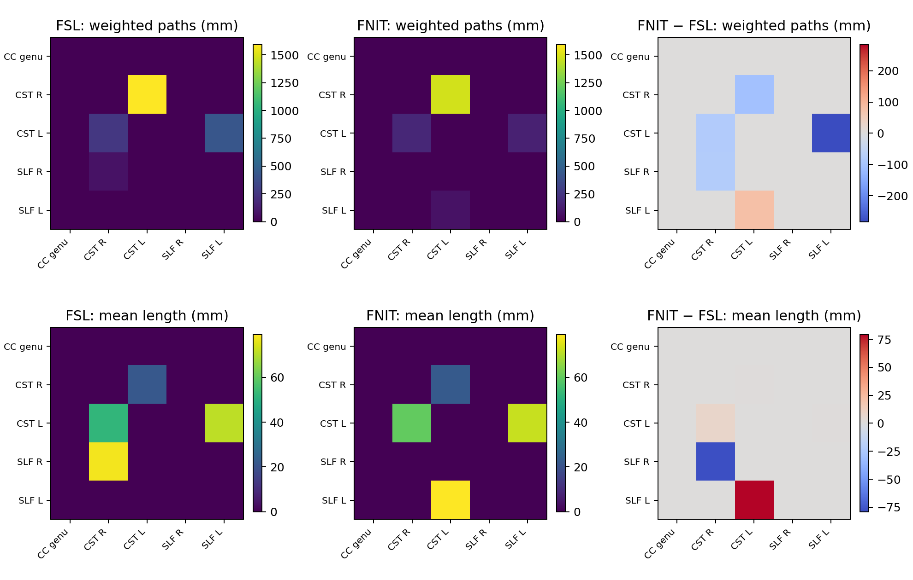

# ProbtrackX 概率纤维束追踪

`TorchProbtrackX` 从 BEDPOSTX 的方向后验独立追踪。MNI 空间体积掩膜可用本包 dMRI pipeline 的 TBSS 或 MMORF 配准结果自动反变换到 diffusion 网格；也可显式提供外部配准文件。追踪本身仍在 diffusion 网格进行。输出包括 seed→voxel 路径密度、稀疏 voxel→voxel 矩阵、有向 region→region 矩阵，以及每个种子体素到各目标 ROI 的计数图。CPU 使用 PyTorch，GPU 步进使用 Triton，float32 张量且默认允许 TF32。追踪时不调用 FSL。官方 [ProbtrackX 输出定义](https://fsl.fmrib.ox.ac.uk/fsl/docs/diffusion/probtrackx.html)中的 `matrix3` 是目标体素两两共同经过次数，和 `matrix2` 的种子体素×目标体素含义不同。下方的[覆盖表](#与官方选项的差异)列出尚未等价的模式。

## 输入与 Python 用法

`run(samples_dir, output_dir, ...)` 每次处理一个被试。`samples_dir` 需有 `nodif_brain_mask.nii.gz` 和各条纤维的 `merged_th<i>samples.nii.gz`、`merged_ph<i>samples.nii.gz`、`merged_f<i>samples.nii.gz`。`seed=` 是一个非空 3D NIfTI 掩膜；`regions=` 是按矩阵行列顺序排列的至少两个非空、不重叠 3D ROI，二者须择一。体积 mask 可与 BEDPOSTX mask 同网格，也可位于对应的 MNI 物理空间；后者须提供同一被试的 `dmri_pipeline_dir`，或一张已含 affine 的 `diff2mni_warp`，或成对的 `diff2struct_mat` 与 `struct2mni_warp`。`mask=` 可指定追踪 mask。`output_dir` 是绝对或相对结果目录；文件已存在时报错，除非设置 `overwrite=True`。

```python
from fnit import TorchProbtrackX

tracker = TorchProbtrackX(
    device="cuda:0",  # 计算设备；GPU 步进使用 Triton，可改为 "cpu"
    nsamples=5000,  # 每个种子体素发出的轨迹数
    nsteps=2000,  # 每条双向轨迹的总步数；必须是大于等于 2 的偶数
    steplength=0.5,  # 每一步的物理长度，单位 mm
    cthr=0.2,  # 相邻方向最小点积阈值，控制曲率
    fibthresh=0.01,  # 可选纤维方向的最小 volume fraction
    batch_size=16384,  # 同批并行推进的轨迹数；GPU 五区测试使用该值
    seed=12345,  # 随机数种子，对应 FSL --rseed
    distthresh=0.0,  # 每个半轨迹的最短距离阈值，单位 mm
    sampvox=0.0,  # 种子体素内随机抖动半径，单位 mm
    fibst=None,  # 起始纤维编号；None 使用默认选择规则
    usef=False,  # 是否按局部 fiber fraction 选择方向
    randfib=0,  # 起始纤维随机选择模式，支持 0、1、2、3
    pathdist=False,  # 是否把密度值改为路径长度加权和
    mean_path_length=False,  # 是否另写平均首次抵达长度图
)

voxel = tracker.run(
    samples_dir="/absolute/path/subject.bedpostX",  # 输入：BEDPOSTX 后验目录
    output_dir="/absolute/path/voxel_result",  # 输出：本次 seed 模式结果目录
    seed="/absolute/path/seed.nii.gz",  # 输入：非空 3D seed mask
    regions=None,  # ROI network 模式输入；单 seed 模式必须为 None
    mask=None,  # 可选追踪 mask；None 使用 nodif_brain_mask.nii.gz
    avoid=None,  # 可选排除 mask
    stop=None,  # 可选进入后停止的 mask
    forcefirststep=False,  # 首步是否跳过 avoid/stop 条件
    waypoints=None,  # 可选 waypoint mask、路径列表或文本列表
    waycond="AND",  # waypoint 组合条件：AND 或 OR
    wayorder=False,  # 是否要求按列表顺序通过 waypoint
    onewaycondition=False,  # 是否要求每个半轨迹单独满足 waypoint
    wtstop=None,  # 可选进入后首次离开即停止的 mask
    matrix1=True,  # 输出 seed voxel×seed voxel 稀疏矩阵
    target2="/absolute/path/target_union.nii.gz",  # matrix2 的目标体素 mask
    target3="/absolute/path/target_union.nii.gz",  # matrix3 的行目标 mask
    lrtarget3=None,  # 可选 matrix3 列目标 mask；None 使用 target3
    distthresh1=0.0,  # matrix1 有效路径总长度下限，单位 mm
    distthresh3=0.0,  # matrix3 有效路径总长度下限，单位 mm
    targetmasks=[  # 每个种子体素要统计命中的目标 ROI，列表顺序定义输出列
        "/absolute/path/roi_01.nii.gz",
        "/absolute/path/roi_02.nii.gz",
    ],
    mni_reference=None,  # 本例为 diffusion 掩膜；输入 MNI 掩膜时指定标准空间参考图
    dmri_pipeline_dir=None,  # 本例不需要 pipeline；MNI 掩膜可传同被试 pipeline 输出根
    registration_backend="auto",  # pipeline 中自动识别 TBSS 或 MMORF
    diff2mni_warp=None,  # 可选的已含 affine 的 diffusion→MNI FSL warp
    diff2struct_mat=None,  # 此例无 MNI mask；外部 diffusion→T1 FLIRT .mat 模式才填写
    struct2mni_warp=None,  # 外部 T1→MNI FSL warp 模式才填写
    overwrite=False,  # False 时已有输出会停止运行
)

network = tracker.run(
    samples_dir="/absolute/path/subject.bedpostX",  # 输入：同一 BEDPOSTX 后验目录
    output_dir="/absolute/path/network_result",  # 输出：ROI network 结果目录
    seed=None,  # network 模式不使用单 seed mask
    regions=[  # 输入：至少两个非空、不重叠 ROI；列表顺序定义矩阵行列
        "/absolute/path/roi_01.nii.gz",
        "/absolute/path/roi_02.nii.gz",
    ],
    overwrite=False,  # 是否覆盖已有结果
)

constrained = tracker.run(
    samples_dir="/absolute/path/subject.bedpostX",  # 输入：BEDPOSTX 后验目录
    output_dir="/absolute/path/constrained_result",  # 输出：带约束的 seed 结果目录
    seed="/absolute/path/seed.nii.gz",  # 输入：非空 3D seed mask
    regions=None,  # 单 seed 模式必须为 None
    waypoints="/absolute/path/waypoint_list.txt",  # 输入：waypoint 路径列表
    waycond="AND",  # 必须通过全部 waypoint
    wayorder=True,  # 必须按列表顺序通过 waypoint
    onewaycondition=True,  # 每个半轨迹单独检查 waypoint
    wtstop="/absolute/path/wtstop.nii.gz",  # 进入后首次离开即停止的 mask
    overwrite=False,  # 是否覆盖已有结果
)

print(voxel.paths, voxel.matrix2, voxel.matrix3)
print(network.network_matrix, network.network_probability)
print(constrained.paths)
```

### MNI 掩膜自动转换

默认直接传入本包 [dMRI pipeline](../dmri_pipeline/README.md) 的单被试输出根目录。程序读取 `registration/` 中的配准文件，调用本包 [TorchConvertWarp](../convertwarp/README.md)、[TorchInvWarp](../invwarp/README.md) 和 [TorchApplyWarp](../applywarp/README.md)，把 MNI 掩膜最近邻映射到 BEDPOSTX diffusion 网格。`registration_backend="auto"` 在目录中只存在一种 warp 时自动选择；如果两类文件同时存在，须指定 `"tbss"` 或 `"mmorf"`。

| pipeline 分支 | 读取的文件 | 组合方式 |
| --- | --- | --- |
| TBSS | `registration/dti_FA_to_MNI_warp.nii.gz`、`registration/standard/FA.nii.gz` | FNIRT 系数已含 FA→MNI affine，不再次应用 `dti_FA_to_MNI_affine.mat` |
| MMORF | `registration/mmorf_warp.nii.gz`、`registration/dti_FA_to_MNI_affine.mat`、`registration/standard/FA.nii.gz`、`native/dti_FA.nii.gz` | 把 MMORF 的参考图像轴 mm 场与 FA→MNI scaled-mm 矩阵转换成 FSL dense pull 场 |

两种分支都会核对 `native/dti_FA.nii.gz` 与 `samples_dir/nodif_brain_mask.nii.gz` 的 shape、affine。不同则不能假定两者是同一 diffusion 空间，程序会报错。

```python
from fnit import TorchProbtrackX

tracker = TorchProbtrackX(
    device="cuda:0",  # GPU 设备
    nsamples=5000,  # 每个 seed 体素的轨迹数
    nsteps=2000,  # 双向轨迹总步数
    steplength=0.5,  # 每步长度，单位 mm
    cthr=0.2,  # 曲率阈值
    fibthresh=0.01,  # 纤维体积分数阈值
    batch_size=16384,  # 并行轨迹数
    seed=12345,  # 随机种子
)
result = tracker.run(
    samples_dir="/data/subject.bedpostX",  # 该被试 BEDPOSTX 后验与 diffusion mask
    output_dir="/data/track_MNI_seed",  # 追踪图与自动转换中间文件目录
    seed="/data/seed_in_MNI.nii.gz",  # MNI 空间 3D 二值 seed 掩膜
    regions=None,  # 单 seed 模式不使用 ROI 列表
    dmri_pipeline_dir="/data/subject_tbss",  # 本包同一被试 dMRI pipeline 的输出根
    registration_backend="auto",  # 自动识别 tbss/mmorf；也可明确指定分支
    mni_reference=None,  # 使用 pipeline 的 registration/standard/FA.nii.gz
    overwrite=False,  # False 时不覆盖已有结果
)
print(result.paths, result.waytotal, result.mni_to_diffusion_dir)
```

若 pipeline 目录是 MMORF 结果，只需把 `dmri_pipeline_dir` 改为该被试的 MMORF 输出根。对应单被试 CLI：

```bash
# --dmri-pipeline-dir 指向含 native/ 和 registration/ 的同一被试结果根。
fnit probtrackx --samples-dir /data/subject.bedpostX \
  --seed /data/seed_in_MNI.nii.gz --output-dir /data/track_MNI_seed \
  --dmri-pipeline-dir /data/subject_tbss --registration-backend auto \
  --device cuda:0 --nsamples 5000 --nsteps 2000
```

若已有外部 FSL 配准文件，也可显式传 `diff2mni_warp=`（TBSS 类型，场内已含 affine），或同时传 `diff2struct_mat=` 与 `struct2mni_warp=`（diffusion→T1 再 T1→MNI）。三种输入方式只能选一种。下面展示后一种输入，不能把已含线性部分的 TBSS warp 再与同一个矩阵组合。

```python
from fnit import TorchProbtrackX

tracker = TorchProbtrackX(
    device="cuda:0",  # GPU 设备
    nsamples=5000,  # 每个 seed 体素的轨迹数
    nsteps=2000,  # 双向轨迹总步数
    steplength=0.5,  # 每步长度，单位 mm
    cthr=0.2,  # 曲率方向点积阈值
    fibthresh=0.01,  # 纤维体积分数阈值
    batch_size=16384,  # 同时计算的轨迹数
    seed=12345,  # 随机种子
)
result = tracker.run(
    samples_dir="/data/subject.bedpostX",  # BEDPOSTX 后验与 diffusion mask 目录
    output_dir="/data/track_MNI_seed",  # 路径密度、计数和中间 warp 的结果目录
    seed="/data/seed_in_MNI.nii.gz",  # MNI 网格中的非空二值 seed
    regions=None,  # 单 seed 模式不传 ROI 列表
    mni_reference="/data/MNI152_T1_2mm.nii.gz",  # MNI 输出网格，须匹配 T1→MNI warp
    diff2struct_mat="/data/diff_to_T1.mat",  # diffusion→T1 FLIRT 矩阵
    struct2mni_warp="/data/T1_to_MNI_warp.nii.gz",  # T1→MNI 非线性场
    overwrite=False,  # 是否覆盖已有结果
)
print(result.paths, result.waytotal, result.mni_to_diffusion_dir)
```

`mni_reference` 在 pipeline 模式下默认取 `registration/standard/FA.nii.gz`，独立配准文件模式下默认取第一张 MNI 掩膜。`seed`、`regions`、`mask`、`avoid`、`stop`、`waypoints`、`wtstop`、`target2`、`target3`、`lrtarget3` 和 `targetmasks` 可以在 MNI 网格，也可与 diffusion 网格掩膜混用；不同 MNI 掩膜可有不同分辨率，但 NIfTI affine 必须描述同一个 MNI 物理空间。输入应为 3D 二值掩膜，映射采用最近邻；所有追踪输出仍在 diffusion 网格。`result.mni_to_diffusion_dir` 指向组合场、逆场和映射后掩膜的目录；没有 MNI 掩膜时为 `None`。原版 `probtrackx2` 可借 `--xfm/--invxfm` 使用某些非 diffusion seed；本接口明确先映射掩膜再追踪，输出空间始终为 diffusion。

对应命令行：

```bash
# --seed 是 MNI seed；--mni-reference 是标准网格；两条变换依次是 diffusion→T1、T1→MNI。
fnit probtrackx --samples-dir /data/subject.bedpostX \
  --seed /data/seed_in_MNI.nii.gz --output-dir /data/track_MNI_seed \
  --mni-reference /data/MNI152_T1_2mm.nii.gz \
  --diff2struct-mat /data/diff_to_T1.mat \
  --struct2mni-warp /data/T1_to_MNI_warp.nii.gz \
  --device cuda:0 --nsamples 5000 --nsteps 2000

# FSL 对应的显式三步转换；追踪使用转换后的 diffusion seed。
convertwarp --ref=/data/MNI152_T1_2mm.nii.gz \
  --warp1=/data/T1_to_MNI_warp.nii.gz --premat=/data/diff_to_T1.mat \
  --out=/data/diff_to_MNI_warp.nii.gz --relout
invwarp --ref=/data/subject.bedpostX/nodif_brain_mask.nii.gz \
  --warp=/data/diff_to_MNI_warp.nii.gz --out=/data/MNI_to_diff_warp.nii.gz --rel
applywarp --in=/data/seed_in_MNI.nii.gz \
  --ref=/data/subject.bedpostX/nodif_brain_mask.nii.gz \
  --warp=/data/MNI_to_diff_warp.nii.gz --out=/data/seed_in_diff.nii.gz --interp=nn
probtrackx2 -s /data/subject.bedpostX/merged \
  -m /data/subject.bedpostX/nodif_brain_mask.nii.gz -x /data/seed_in_diff.nii.gz \
  --dir=/data/fsl_track --forcedir --opd -P 5000 -S 2000 --steplength=0.5
```

真实 DWI 检查使用 JHU 1 mm atlas 的第 9 号 MNI 标签作为 seed，同一例 BEDPOSTX 三纤维后验。用本包 dMRI pipeline 实际保存的两种配准结果时，同一 MNI seed 在 TBSS/MMORF 分支分别映射为 120/114 个 diffusion 体素；自动转换加追踪与直接传入保存的 diffusion 掩膜所得密度图各自完全相同，`waytotal` 分别为 2400/2280。转换后的 FA 与各自 pipeline 标准 FA 的非零并集相关性分别为 0.994361/0.999999999996；TBSS 标准图额外乘了模板非零掩膜，因此前者包含该末步差异。FSL 反场掩膜分别有 1 个体素不同，图示见[逆场对照](../invwarp/README.md)；完整计时和源码哈希见[两条分支的真实数据记录](../../validation/probtrackx/README.md)。不同 seed 集合的 FSL 与 FNIT 追踪结果不能直接解释为追踪算法本身的精度差。

| 参数 | 输入和含义 | FSL 对应 |
| --- | --- | --- |
| `nsamples`, `nsteps`, `steplength` | 每个种子体素的轨迹数、双向总步数（偶数≥2）、物理步长 mm | `-P`, `-S`, `--steplength` |
| `cthr`, `fibthresh`, `seed` | 方向点积阈值、纤维分数阈值、随机种子 | `--cthr`, `--fibthresh`, `--rseed` |
| `distthresh`, `sampvox`, `fibst`, `randfib`, `usef` | 单半路径最短距离、seed 抖动半径、起始纤维与纤维选择 | 同名官方选项 |
| `avoid`, `stop`, `forcefirststep` | 排除 mask、进入后停止的 mask、首步条件；MNI mask 先自动映射 | 同名官方选项 |
| `waypoints`, `waycond`, `wayorder`, `onewaycondition` | 必经 mask、AND/OR、按列表顺序通过、对每个半轨迹分别判定 | `--waypoints`, `--waycond`, `--wayorder`, `--onewaycondition` |
| `wtstop` | 进入 mask 后在首次离开时停止该半轨迹 | `--wtstop` |
| `matrix1=True`, `distthresh1` | 种子体素之间的稀疏矩阵；有效路径总长度下限 | `--omatrix1`, `--distthresh1` |
| `target2=...` | 种子体素×目标体素；MNI mask 先自动映射 | `--omatrix2 --target2=...` |
| `target3=...`, `lrtarget3=...`, `distthresh3` | 目标体素共访矩阵；可选不同的列目标；有效路径总长度下限 | `--omatrix3 --target3=... --lrtarget3=... --distthresh3` |
| `targetmasks=[...]` | 每个种子体素到多个目标 ROI 的命中次数 | `--targetmasks=... --os2t --s2tastext` |
| `dmri_pipeline_dir`, `registration_backend` | 本包同一被试 dMRI pipeline 输出根；自动或指定 TBSS/MMORF 分支 | TBSS 的 FSL warp，或 FNIT MMORF warp 与 affine → dense FSL 场 → `invwarp` → `applywarp --interp=nn` |
| `mni_reference`, `diff2mni_warp` | MNI 输出网格与已含 affine 的 diffusion→MNI FSL 场 | `convertwarp --warp1` → `invwarp` → `applywarp --interp=nn` |
| `diff2struct_mat`, `struct2mni_warp` | 可选外部 diffusion→T1 `.mat` 与 T1→MNI FSL warp；必须成对传入 | `convertwarp --premat --warp1` → `invwarp` → `applywarp --interp=nn` |
| `pathdist`, `mean_path_length` | 路径长度加权与平均路径长度，仅已有密度及 ROI 网络模式支持；和新稀疏矩阵或 `targetmasks` 同时使用会报错 | `--pd`, `--ompl` |
| `device`, `batch_size` | `cpu` 或 `cuda:0`，每批并行轨迹数 | FNIT 选项 |

`distthresh1/3` 仅过滤对应稀疏矩阵的更新，不改变 `fdt_paths` 与 `waytotal`。`matrix1`、`matrix2`、`matrix3` 可以同次运行。每条有效轨迹对 matrix1/2 的同一列及 seed→target 的同一 ROI 最多计一次；matrix3 对该轨迹经过的每对目标体素各计一次。`targetmasks` 可为 Python 路径列表，或文本列表路径；文本列表中的相对路径按列表所在目录解析。`waypoints`、`wtstop` 也接受单个同网格 3D NIfTI、Python 路径列表或文本列表；默认 `waycond="AND"` 要求经过全部 waypoint，`"OR"` 要求经过至少一个。默认两个半轨迹可合并满足条件；`onewaycondition=True` 改为逐半轨迹判定。`wayorder=True` 仅与 `AND` 合用，并按 waypoint 列表顺序检查。`stop` 在进入 mask 时终止，`wtstop` 则允许进入并在离开后终止。在 9 组 9×5×5 合成直线场的 waypoint/`wtstop` 配对中，FNIT 与 FSL 6.0.7.22 的 `waytotal` 和 `fdt_paths` 逐项相同，AND 条件下的 matrix2 `.dot` 也逐项相同。当前另有一例[真实 DWI 的单 waypoint 加 avoid GPU 对照](#nbmcingulum-真实-dwi-对照)；`wtstop` 的真实 DWI 数值和时间尚无公开配对。

## 输出及结构

```text
output_dir/
├── mni_to_diffusion/                       # 仅输入 MNI 掩膜时生成
│   ├── diff2mni_warp.nii.gz               # MNI 网格上的 diffusion→MNI pull 场
│   ├── mni2diff_warp.nii.gz               # diffusion 网格上的 MNI→diffusion pull 场
│   └── masks/000/<input_name>.nii.gz      # 最近邻映射后的二值 diffusion 掩膜
├── fdt_paths.nii.gz                         # seed→voxel 轨迹通过次数
├── fdt_paths_lengths.nii.gz                 # mean_path_length=True；平均首次抵达长度
├── waytotal                                 # 单 seed 一行；regions 每 ROI 一行
├── fdt_matrix1.dot                          # Nseed × Nseed；matrix1=True
├── coords_for_fdt_matrix1                   # 每行 x y z ROI编号 位置编号
├── fdt_matrix2.dot                          # Nseed × Ntarget2；target2=...
├── coords_for_fdt_matrix2                   # 行坐标，5列
├── tract_space_coords_for_fdt_matrix2       # 列坐标，3列
├── lookup_tractspace_fdt_matrix2.nii.gz     # 目标体素处为1起始列号，其余为0
├── fdt_matrix3.dot                          # Ntarget3 × Ntarget3或Nlrtarget3
├── coords_for_fdt_matrix3                   # 行坐标，5列
├── tract_space_coords_for_fdt_matrix3       # 仅lrtarget3时的列坐标，5列
├── fdt_network_matrix                       # regions模式；Nroi × Nroi，原始有向计数
├── fdt_network_matrix_lengths               # regions+mean_path_length；平均命中长度
├── fdt_network_matrix_probability           # FNIT归一化有向矩阵；计数模式
├── fdt_network_matrix_symmetric             # FNIT对称化矩阵；计数模式
├── seeds_to_<target>.nii.gz                 # targetmasks；每目标一张seed网格图
├── seeds_<roi>_to_<target>.nii.gz           # regions+targetmasks；roi从0编号
└── matrix_seeds_to_all_targets              # Nseed × Ntargetmasks文本矩阵
```

追踪 NIfTI 输出使用 BEDPOSTX diffusion mask 的形状和 affine；`mni_to_diffusion/diff2mni_warp.nii.gz` 使用 MNI 参考网格。`.dot` 文件按官方格式写入从 1 开始的 `row column count` 稀疏三元组，末行为 `Nrow Ncol 0` 维度标记；体素次序由配套坐标表定义，不能直接假定是 NIfTI 的线性索引。`matrix1` 排除自连接；`matrix3` 未指定 `lrtarget3` 时只存上三角且不含对角，指定后为行目标×列目标的有向组合。`fdt_paths` 是经过体素的采样轨迹次数，**不是解剖纤维条数**。

`run()` 返回 `ProbTrackXResult`。`output_dir`、`paths`、`waytotal` 为路径；`mni_to_diffusion_dir` 在自动转换时是中间目录路径，否则为 `None`。启用相应输出时，`lengths`、`network_matrix`、`network_lengths`、`network_probability`、`network_symmetric`、`matrix1`、`matrix1_coords`、`matrix2`、`matrix2_coords`、`matrix2_target_coords`、`matrix2_lookup`、`matrix3`、`matrix3_coords`、`matrix3_target_coords`、`seed_to_targets_matrix` 为对应文件路径，否则为 `None`。`seed_to_targets` 是目标图路径元组；`seed_points`、`accepted_streamlines` 和 `elapsed_seconds` 分别是种子体素数、有效采样轨迹数与运行秒数。`regions` 与 `targetmasks` 同用时，种子行按 ROI 列表顺序拼接，目标图使用从 0 开始的 `<roi>` 编号。

`regions` 与稀疏矩阵或 `targetmasks` 同用时，追踪先应用网络模式的“命中其他 ROI”筛选，因此这些输出是条件连接结果；若需要不经网络筛选的 voxel×voxel 矩阵，应把 ROI 并集作为单个 `seed` 输入。

ROI 矩阵的 `C[i,j]` 是从 ROI *i* 发出的样本抵达 ROI *j* 的次数，行列顺序由 `regions` 决定。FNIT 派生有向矩阵定义为 `P[i,j] = C[i,j] / (Ni × nsamples)`，其中 `Ni` 是第 *i* 个 seed ROI 的体素数；对称矩阵是 `(P[i,j] + P[j,i]) / 2`。只把原始 `fdt_network_matrix` 与 FSL 同名文件直接对照。`waytotal` 是有效轨迹数，不能替代发出的 `Ni × nsamples`；regions 模式的密度图只计命中其他 ROI 的有效轨迹。`pathdist=True` 时 `fdt_paths`/原始网络矩阵改为长度和；`mean_path_length=True` 另写 `fdt_paths_lengths.nii.gz` 与网络的 `fdt_network_matrix_lengths`。

## CLI 与原版 FSL 命令

```bash
fnit probtrackx --samples-dir /absolute/path/subject.bedpostX \
  --seed /absolute/path/seed.nii.gz --output-dir /absolute/path/fnit_voxel \
  --device cuda:0 --nsamples 5000 --nsteps 2000 \
  --omatrix1 --omatrix2 --target2 /absolute/path/target_union.nii.gz \
  --omatrix3 --target3 /absolute/path/target_union.nii.gz
fnit probtrackx --samples-dir /absolute/path/subject.bedpostX \
  --roi-list /absolute/path/roi_list.txt --output-dir /absolute/path/fnit_network \
  --device cuda:0 --nsamples 5000 --nsteps 2000
fnit probtrackx --samples-dir /absolute/path/subject.bedpostX \
  --seed /absolute/path/seed.nii.gz --output-dir /absolute/path/fnit_constrained \
  --device cuda:0 --nsamples 5000 --nsteps 2000 \
  --waypoints /absolute/path/waypoint_list.txt --waycond AND \
  --wayorder --onewaycondition --wtstop /absolute/path/wtstop.nii.gz
```

`roi_list.txt` 每行一个 ROI NIfTI 路径。单 seed 的 voxel→ROI 分类另加 `--targetmasks /absolute/path/target_list.txt`。`fnit-probtrackx` 接受同样参数。下例将三种矩阵合并调用；真实 DWI benchmark 为每种矩阵分别运行。对应的官方 CPU 命令为：

```bash
"$FSLDIR/bin/probtrackx2" -s /absolute/path/subject.bedpostX/merged \
  -m /absolute/path/subject.bedpostX/nodif_brain_mask.nii.gz \
  -x /absolute/path/seed.nii.gz --dir=/absolute/path/fsl_voxel \
  --forcedir --opd -P 5000 -S 2000 --steplength=0.5 \
  --cthr=0.2 --fibthresh=0.01 --rseed=12345 \
  --omatrix1 --omatrix2 --target2=/absolute/path/target_union.nii.gz \
  --omatrix3 --target3=/absolute/path/target_union.nii.gz
"$FSLDIR/bin/probtrackx2" -s /absolute/path/subject.bedpostX/merged \
  -m /absolute/path/subject.bedpostX/nodif_brain_mask.nii.gz \
  -x /absolute/path/roi_list.txt --network --dir=/absolute/path/fsl_network \
  --forcedir --opd -P 5000 -S 2000 --steplength=0.5 \
  --cthr=0.2 --fibthresh=0.01 --rseed=12345
"$FSLDIR/bin/probtrackx2" -s /absolute/path/subject.bedpostX/merged \
  -m /absolute/path/subject.bedpostX/nodif_brain_mask.nii.gz \
  -x /absolute/path/seed.nii.gz --dir=/absolute/path/fsl_constrained \
  --forcedir --opd -P 5000 -S 2000 --steplength=0.5 \
  --cthr=0.2 --fibthresh=0.01 --rseed=12345 \
  --waypoints=/absolute/path/waypoint_list.txt --waycond=AND \
  --wayorder --onewaycondition --wtstop=/absolute/path/wtstop.nii.gz
```

官方 voxel→ROI 分类需 `--targetmasks=/absolute/path/target_list.txt --os2t --s2tastext`。官方 GPU 使用 `probtrackx2_gpu`，但其部分矩阵选项的组合受限；本页稀疏矩阵的正式参照为 `probtrackx2` CPU。

## 与官方选项的差异

依据 [FSL 官方说明](https://fsl.fmrib.ox.ac.uk/fsl/docs/diffusion/probtrackx.html)及[官方源码](https://git.fmrib.ox.ac.uk/fsl/ptx2)。下表是目前的可执行范围，不把同名文件视为完整数值等价。

| 类别 | 已实现 | 尚有差异 |
| --- | --- | --- |
| 输入和空间 | BEDPOSTX 后验、diffusion 或 MNI 网格体积 mask；MNI mask 先显式反变换到 diffusion，独立追踪 mask、体积避让和停止 | `--simple` ASCII 点、表面 seed/target、`--seedref`、`--meshspace`、`--xfm`、`--invxfm`，以及非 network 多 ROI 输入；`target2` 低分辨率网格未支持 |
| 步进和过滤 | 双向 Euler、`-P/-S`、`--steplength`、`--cthr`、`--fibthresh`、`--randfib`、`--fibst`、`--usef`、`--sampvox`、`--distthresh`、`--rseed`、体积 `--avoid`、`--stop`、`--forcefirststep`、`--waypoints`/`--waycond`/`--wayorder`/`--onewaycondition`、`--wtstop` | `--modeuler`、`--loopcheck`、局部方向/曲率及表面约束选项；随机数流不逐轨迹一致；waypoint/停止组合已做合成场配对；单 waypoint 加 avoid 的真实 DWI 配对见下文，其他约束组合仍待验证 |
| 输出 | 密度图、`--pd`/`--ompl` 的密度及网络结果、`--network`、同网格体积计数的 `--omatrix1/2/3` 与 `--targetmasks/--os2t` | 新矩阵和 seed→target 的 `--pd/--ompl`、`--omatrix4`、`--fopd`、`--opathdir`、`--otargetpaths`、`--savepaths`、`--closestvertex`；`--s2tastext` 当前自动写，不能独立控制 |
| 文件和运行控制 | FSL 风格矩阵 `.dot`、坐标表、target2 lookup，FNIT 自有归一化连接矩阵 | 官方 `-o/--out`、`--dir/--forcedir` 目录命名、`--verbose`；FNIT 固定写密度图 |

官方仍有以下当前未接入的具体选项：`--simple`、表面 seed/target、`--seedref`、`--meshspace`、`--xfm`、`--invxfm`、`--closestvertex`；`--modeuler`、`--loopcheck`；`--omatrix4`、`--target4`、`--colmask4`、`--fopd`、`--opathdir`、`--otargetpaths`、`--savepaths`。官方帮助还包含方向与纤维选择相关的 `--prefdir`、`--no_integrity`、`--onewayonly`、`--locfibchoice`、`--loccurvthresh`、`--noprobinterpol`。FNIT 当前固定写 `fdt_paths.nii.gz`，不支持官方 `-o/--out` 与目录自动命名语义。上述选项会影响部分三类 connectome 的数值或输出结构，因此当前结果只应按本页明确支持的 diffusion 网格体积追踪模式使用。

## 与 FSL 的真实 DWI benchmark

在 gpucw1 使用同一例真实 UK Biobank DWI 的 FSL BEDPOSTX 三纤维后验，分别以 FSL 6.0.7.22 和本次 FNIT 源码运行。默认密度与长度加权模式采用 400 总步、0.5 mm 步长、`cthr=0.2`、`fibthresh=0.01`、相同随机种子；单 seed 每体素 200 条，五区网络每体素 2000 条。FNIT 批大小 16384；CPU 为 8 线程。时间为进程启动、后验载入、追踪及写盘的总墙钟。FSL 结果来自既有同输入同参数运行，FNIT 当前源码于 2026-09-29 复跑；GPU 1 当时非空闲，PyTorch 进程显存限为总量 20%，因此墙钟受其他任务影响。双方随机数流不同，比较汇总图和矩阵，不要求逐轨迹相同。

### Seed→voxel 与 region→region

默认计数 `--opd`。Pearson r 在双方非零并集计算；支持 Dice 比较非零体素集合，top 10% Dice 比较强连接体素。网络矩阵 MAE 是原始 `fdt_network_matrix` 的平均绝对计数差。

| 任务 | FSL / FNIT (s) | 密度 r | 支持 Dice | top 10% Dice | ROI 矩阵 MAE |
| --- | ---: | ---: | ---: | ---: | ---: |
| 单 seed CPU | 12.06 / 13.82 | 0.9935 | 0.6975 | 0.8792 | — |
| 单 seed GPU | 12.41 / 17.35 | 0.9942 | 0.7003 | 0.8763 | — |
| 五区网络 CPU | 37.93 / 36.22 | 0.9290 | 0.5516 | 0.7611 | 0.60 |
| 五区网络 GPU | 13.81 / 17.75 | 0.9436 | 0.5303 | 0.7179 | 0.76 |

长度加权 `--opd --pd --ompl`。平均路径长度的 r 和 MAE 仅在双方均为非零的体素上计算，MAE 单位为 mm。该模式的 ROI 矩阵为长度加权和，不能与计数矩阵直接相减。

| 任务 | FSL / FNIT (s) | 加权密度 r | 支持 Dice | 平均长度 r | 长度 MAE (mm) |
| --- | ---: | ---: | ---: | ---: | ---: |
| 单 seed CPU | 13.42 / 13.72 | 0.9752 | 0.6975 | 0.8694 | 5.55 |
| 单 seed GPU | 14.18 / 16.89 | 0.9772 | 0.7003 | 0.8642 | 5.64 |
| 五区网络 CPU | 32.94 / 33.63 | 0.8082 | 0.5504 | 0.8457 | 7.13 |
| 五区网络 GPU | 13.29 / 12.96 | 0.8422 | 0.5301 | 0.8821 | 6.24 |

以上四类模式的配对数值与源码 SHA-256 分别见[默认计数报告](../../validation/probtrackx/report.default.latest.public.json)和[长度加权报告](../../validation/probtrackx/report.current.latest.public.json)。单 seed 当前 CPU 比 GPU 快，五区网络 GPU 则比 CPU 快；长度加权 GPU 网络这次为 12.96 秒，既有 FSL 记录为 13.29 秒，同机独立复跑 FSL 为 12.65 秒。两次独立运行前 GPU 分别已有约 25.3 和 42.6 GiB 占用；这些单次墙钟只能用于定位瓶颈，不能证明稳定加速。

分段计时见[性能记录](../../validation/probtrackx/report.performance.public.json)：旧版 2048 批大小使 35 个 seed 体素触发 70 次双向追踪调用；当前 16384 批大小合并多个 seed 体素，仅需 10 次。缓存步长参数去掉每次调用前的 GPU→CPU 同步，Numba 汇总替代逐轨迹 Python 循环。真实长度加权五区网络的进程内调用由 16.20 秒降至 10.98 秒；其中后验载入仍占 8.50 秒，属于当前主要瓶颈。该分段计时不包含 Python 启动与模块导入，完整命令另见上表。

### Voxel→voxel 稀疏矩阵

同一组 ROI 的并集用于种子和目标，分别运行 matrix1（seed×seed）、matrix2（seed×target2）、matrix3（目标体素共访）；每体素 500 条。按官方坐标表对齐 `.dot` 边后，支持 Dice 比较非零边集合；r 和 MAE 在非零并集计算。以下均为 FSL CPU 与 FNIT CPU 的配对。

| 输出 | FSL / FNIT (s) | 非零边 FSL / FNIT | 支持 Dice | 边权 r | 边权 MAE |
| --- | ---: | ---: | ---: | ---: | ---: |
| matrix1 | 17.21 / 18.13 | 155 / 140 | 0.7390 | 0.99986 | 1.82 |
| matrix2 | 18.55 / 33.92 | 190 / 175 | 0.7890 | 0.99992 | 1.53 |
| matrix3 | 18.51 / 19.45 | 134 / 110 | 0.7705 | 0.99994 | 2.82 |

高权重边使 r 接近 1，但支持 Dice 为 0.74–0.79，表示低计数边仍不一致；本次 FNIT CPU 三种稀疏矩阵均慢于 FSL CPU。逐模式数值和源码哈希见[matrix1](../../validation/probtrackx/report.matrix1.cpu.latest.public.json)、[matrix2](../../validation/probtrackx/report.matrix2.cpu.latest.public.json)、[matrix3](../../validation/probtrackx/report.matrix3.cpu.latest.public.json)。

### Voxel→ROI 与归一化 ROI 矩阵

单个真实 ROI seed 到 5 个目标的 `--targetmasks --os2t` 配对：FSL / FNIT 为 12.35 / 14.03 秒；每个 seed 体素×目标的平均绝对计数误差为 0.0571，最大误差为 1。报告见[seed→ROI](../../validation/probtrackx/report.targets.cpu.latest.public.json)。

另一组每体素 500 条的五区网络计数配对：FSL / FNIT 为 20.13 / 21.39 秒；原始有向矩阵 MAE 为 0.12。FNIT 的额外归一化有向矩阵和对称矩阵按上文公式生成，和 FSL 原始矩阵含义不同；该组与 FSL 原始矩阵比较后的 MAE 均为 0.000034（比较时先对 FSL 原始矩阵施加相同公式）。



上图来自同一例真实 DWI 的 GPU 五区网络 `--opd --pd --ompl` 配对。上排为累计长度加权连接矩阵，下排为命中轨迹的平均长度；从左到右依次为 FSL、当前 FNIT 和 FNIT−FSL。区域标签只保留通用的 JHU 解剖名称，不含病例编号或服务器路径。图中矩阵来自当前源码哈希绑定的同一组输出，与[长度加权报告](../../validation/probtrackx/report.current.latest.public.json)中的矩阵 MAE、密度图和时间统计对应；绘图脚本见[plot_network_report.py](../../validation/probtrackx/plot_network_report.py)。

原始 DWI、BEDPOSTX 后验、seed、逐体素密度图和完整文本矩阵仍保留在授权服务器；仓库公开六份配对汇总 JSON、一份性能分段 JSON 和这一张去标识连接矩阵图。双方随机数流不同，这张图比较的是网络汇总结果，不能证明逐轨迹一致。当前证据只有一例数据、五个 ROI，且网络较稀疏；它不能替代多病例或全脑分区验证。[复现命令和指标定义](../../validation/probtrackx/README.md)列出比较方法。合成直线场的 FSL 逐项相同测试只验证计数规则，不替代这组真实数据误差。`tests/probtrackx/` 的 42 项 CPU/CUDA 测试已在 gpucw1 通过。

## NbM→Cingulum 真实 DWI 对照

用一例真实 DWI 的完整 NbM seed（91 体素）及 BEDPOSTX 三纤维、每纤维 50 份后验，复跑用户提供的 FSL 6.0.6.5 `probtrackx2_gpu10.2` 命令。追踪网格为 104×104×72，Cingulum waypoint 为 713 体素。每个 seed 体素 5000 条、总步数 2000、步长 0.5 mm，输出 `fdt_paths.nii.gz` 和 `waytotal`。原命令连续两次写 `--avoid`；该版本的单值选项解析器使后一个 brainstem 覆盖前一个 AC。原命令及其压缩包内输出复跑后字节哈希一致，`waytotal=4212`。若希望同时避开 AC 和 brainstem，应先将两张二值 mask 取并集，再传给一次 `--avoid`。

```bash
probtrackx2_gpu10.2 -s /data/subject.bedpostX/merged \
  -m /data/subject/nodif_brain_mask.nii.gz -x /data/subject/NbM.nii.gz \
  --waypoints=/data/subject/Cingulum_ALL.nii.gz \
  --avoid=/data/subject/AC.nii.gz --avoid=/data/subject/brainstem.nii.gz \
  --dir=/data/fsl_output -P 5000 --forcedir --opd

fnit probtrackx --samples-dir /data/subject.bedpostX \
  --mask /data/subject/nodif_brain_mask.nii.gz \
  --seed /data/subject/NbM.nii.gz \
  --waypoints /data/subject/Cingulum_ALL.nii.gz \
  --avoid /data/subject/brainstem.nii.gz \
  --output-dir /data/fnit_output --device cuda:0 --nsamples 5000 --nsteps 2000
```

| 同一输入的运行 | `waytotal` | 与 FSL 原图的密度 r / 非零支持 Dice / 强连接 top 10% Dice | 完整进程墙钟 |
| --- | ---: | ---: | ---: |
| FSL 原命令复跑 | 4212 | 1 / 1 / 1 | 28.63 s；热缓存重复 10.21 s |
| FNIT 优化前与优化后 | 4298 | 0.99837 / 0.64773 / 0.86270 | 热缓存优化前 109.64 s；优化后 11.84 s |
| FSL 更换随机种子为 67890 | 4195 | 0.99867 / 0.65319 / 0.88447 | 16.49 s |

FNIT 的新单 waypoint 加 avoid 计数路径将逐轨迹 Python 过滤和累加移到已有的 Numba 汇总层；优化前后完整 `fdt_paths.nii.gz` 哈希、全部体素及 `waytotal` 均相同。本次热缓存墙钟约缩短 9.3 倍，PyTorch 峰值分配约 2.81 GB；共享 H100 在运行前后均显示 100% 利用率，故耗时只表示这次观测。FSL 与 FNIT 的随机数流不同；强连接图接近，但稀疏非零支持及 `waytotal` 并不逐项一致。一种 FSL 随机种子变更仅提供波动参照，不构成等价阈值。输入与源码哈希、计时、密度指标及输出一致性见[去标识验证记录](../../validation/probtrackx/cholinergic_nbm_cingulum.public.json)。原始影像和逐体素输出仍在授权服务器。

### 同时避开 AC 与 brainstem

把两张同网格排除掩膜按非零取并集，作为唯一的 `--avoid` 输入。以下代码只写一张 3D NIfTI，不改 BEDPOSTX 后验或 seed：

```python
from pathlib import Path
import nibabel as nib
import numpy as np

ac_path = Path("/data/subject/AC.nii.gz")  # 输入：AC 二值掩膜
brainstem_path = Path("/data/subject/brainstem.nii.gz")  # 输入：brainstem 二值掩膜
union_path = Path("/data/subject/AC_brainstem_union.nii.gz")  # 输出：同网格 uint8 并集掩膜
ac_image = nib.load(ac_path)
brainstem_image = nib.load(brainstem_path)
assert ac_image.shape == brainstem_image.shape
assert np.allclose(ac_image.affine, brainstem_image.affine)
union_mask = (np.asarray(ac_image.dataobj) > 0) | (np.asarray(brainstem_image.dataobj) > 0)
union_header = ac_image.header.copy()
union_header.set_data_dtype(np.uint8)
nib.save(nib.Nifti1Image(union_mask.astype(np.uint8), ac_image.affine, union_header), union_path)
```

在前面的两条命令中，FSL 删除两个旧 `--avoid` 并使用一次 `--avoid=/data/subject/AC_brainstem_union.nii.gz`；FNIT 则把 `--avoid` 的值改为同一张并集掩膜。其他参数仍为 NbM seed、Cingulum waypoint、每体素 5000 条、2000 步和默认随机种子。

| 真实全输入结果 | 原命令有效排除 brainstem：FSL / FNIT | 合并排除 AC∪brainstem：FSL / FNIT |
| --- | ---: | ---: |
| `waytotal` | 4212 / 4298 | 3792 / 3866 |
| AC 内密度和 | 2574 / 2413 | 0 / 0 |
| brainstem 内密度和 | 0 / 0 | 0 / 0 |
| FSL 与 FNIT 密度 r | 0.99837 | 0.99859 |
| FSL 与 FNIT 非零支持 Dice | 0.64773 | 0.59879 |
| FSL 与 FNIT 强连接 top 10% Dice | 0.86270 | 0.88187 |

合并后 FSL 的 `waytotal` 比原命令减少 9.97%，FNIT 减少 10.05%；两者都清除了 AC 内的路径密度。合并版的强连接 Dice 略高，而稀疏支持 Dice 更低，仍不能认为两套随机追踪逐体素等价。合并版完整进程单次墙钟为 FSL 11.58 秒、FNIT 16.80 秒；GPU 0 当时已有约 43.4 GiB 占用且前后均为 100% 利用率，因此不据此判断稳定速度排名。输入、输出哈希与全部比较指标见[合并排除掩膜报告](../../validation/probtrackx/cholinergic_nbm_cingulum_union.public.json)。

## Reference

- 参考文献：Behrens et al., *Probabilistic diffusion tractography with multiple fibre orientations: What can we gain?*, NeuroImage (2007), [doi:10.1016/j.neuroimage.2006.09.018](https://doi.org/10.1016/j.neuroimage.2006.09.018)。
- 原实现代码库：[FSL `ptx2`（含 `probtrackx2`）](https://git.fmrib.ox.ac.uk/fsl/ptx2)。
