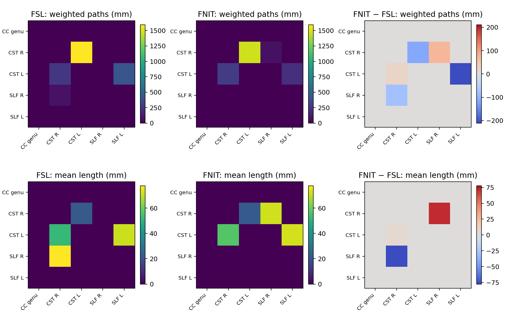

# ProbtrackX 概率纤维束追踪

`TorchProbtrackX` 独立读取 FSL BEDPOSTX 方向后验，执行同一扩散网格上的体积 seed 到体素追踪或有向 ROI×ROI 网络追踪。运行时不调用 FSL。CPU 使用 PyTorch，GPU 步进使用 Triton；张量为 float32，GPU 默认启用 TF32。本页给出当前已实现功能的完整调用和输出说明，以及同一真实 DWI 后验上与 FSL 6.0.7.22 的配对结果。[官方选项覆盖表](#官方选项覆盖)列出尚未完成的部分；当前版本不等同于完整的 probtrackx2。

## 输入、参数与 Python 调用

`run(samples_dir, output_dir, ...)` 每次处理一个被试。`samples_dir` 是 BEDPOSTX 输出目录，其中必须有 `nodif_brain_mask.nii.gz`，以及每条纤维的 `merged_th<i>samples.nii.gz`、`merged_ph<i>samples.nii.gz`、`merged_f<i>samples.nii.gz`。`seed=` 接受一个非空三维 NIfTI 掩膜；`regions=` 接受至少两个互不重叠的三维 NIfTI ROI。二者必须恰好提供一个。所有影像需具有与后验相同的形状及 affine；本实现当前不自动重采样或跨空间配准。`output_dir` 为要写入的目录，已存在的结果文件默认报错，`overwrite=True` 才覆盖。

```python
from fnit import TorchProbtrackX

tracker = TorchProbtrackX(
    device="cuda:0", nsamples=5000, nsteps=2000, batch_size=2048,
    steplength=0.5, cthr=0.2, fibthresh=0.01, seed=12345,
    pathdist=True, mean_path_length=True,
)
seed_result = tracker.run(
    "/absolute/path/subject.bedpostX", "/absolute/path/seed_result",
    seed="/absolute/path/seed.nii.gz",
)
network_result = tracker.run(
    "/absolute/path/subject.bedpostX", "/absolute/path/network_result",
    regions=["/absolute/path/roi_01.nii.gz", "/absolute/path/roi_02.nii.gz"],
)
print(seed_result.paths, seed_result.lengths)
print(network_result.network_matrix, network_result.network_lengths)
```

| 构造参数 | 默认值 | 含义；FSL 对应 |
| --- | ---: | --- |
| `device`, `batch_size` | `cpu`, 2048 | 计算设备及同时步进的轨迹数；FSL 无批大小选项 |
| `nsamples`, `nsteps` | 5000, 2000 | 每 seed 体素轨迹数、双向总步数；`-P`, `-S`；总步数须为不小于 2 的偶数 |
| `steplength`, `cthr`, `fibthresh` | 0.5 mm, 0.2, 0.01 | 物理步长、方向点积下限、纤维分数阈值；同名 FSL 选项 |
| `seed` | 12345 | 随机种子；`--rseed`；FNIT 与 FSL 随机数流不同 |
| `distthresh`, `sampvox` | 0, 0 mm | 单条半轨迹最小长度；seed 中心球内随机位移；同名 FSL 选项 |
| `fibst`, `randfib`, `usef` | `None`, 0, `False` | 指定起始纤维（从 1 编号）、随机起始模式 0–3、按纤维分数随机终止；同名 FSL 选项 |
| `pathdist`, `mean_path_length` | `False`, `False` | 对经过体素以首次抵达的路径长度加权；写平均路径长度；`--pd`, `--ompl` |

`run()` 的 `mask=` 对应 FSL `-m`，默认 BEDPOSTX mask；`avoid=`、`stop=`、`forcefirststep=True` 分别对应体积 `--avoid`、`--stop`、`--forcefirststep`。各约束接受同网格 NIfTI 路径。`ProbTrackXResult` 返回以下文件路径，以及 `seed_points`、`accepted_streamlines` 和包含载入、计算、写盘的 `elapsed_seconds`。

## 输出目录结构

```text
output_dir/
├── fdt_paths.nii.gz                 # 单 seed 和网络模式均写出
├── fdt_paths_lengths.nii.gz         # mean_path_length=True 时写出
├── waytotal                         # 单 seed 为 1 行；网络每个源 ROI 1 行
├── fdt_network_matrix              # regions 模式；N×N 文本矩阵
└── fdt_network_matrix_lengths      # regions 且 mean_path_length=True
```

`fdt_paths.nii.gz` 与输入扩散 mask 形状、affine 相同。默认每条接受轨迹对经过的每个体素最多加 1；`pathdist=True` 时加从 seed 沿该半轨迹首次到达该体素的距离，单位 mm。`fdt_paths_lengths.nii.gz` 给出各体素首次抵达距离的平均值，未访问体素为 0。`waytotal` 是接受轨迹数。网络矩阵第 *i* 行到第 *j* 列对应 `regions[i]` 到 `regions[j]`，主对角为 0；默认值为轨迹数，`pathdist=True` 时为首次抵达目标 ROI 的距离之和，单位 mm。`fdt_network_matrix_lengths` 是该方向命中轨迹的平均首次抵达长度，单位 mm；没有命中时为 0。网络运行仍写 `fdt_paths`，仅计入命中其他 ROI 的轨迹。

## 命令行与官方等价命令

```bash
fnit probtrackx --samples-dir /absolute/path/subject.bedpostX \
  --seed /absolute/path/seed.nii.gz --output-dir /absolute/path/fnit_seed \
  --device cuda:0 --nsamples 5000 --nsteps 2000 --pd --ompl
fnit probtrackx --samples-dir /absolute/path/subject.bedpostX \
  --roi-list /absolute/path/roi_list.txt --output-dir /absolute/path/fnit_network \
  --device cuda:0 --nsamples 5000 --nsteps 2000 --pd --ompl
```

`roi_list.txt` 每行一个 ROI 路径，顺序即矩阵行列顺序；相对路径按列表文件所在目录解析。`fnit-probtrackx` 接受相同参数。不指定 `--pd --ompl` 即运行默认计数模式。加入 `--mask`、`--avoid`、`--stop`、`--forcefirststep`、`--distthresh`、`--sampvox`、`--fibst`、`--randfib`、`--usef` 可使用上述已实现选项。

```bash
"$FSLDIR/bin/probtrackx2" -s /absolute/path/subject.bedpostX/merged \
  -m /absolute/path/subject.bedpostX/nodif_brain_mask.nii.gz \
  -x /absolute/path/seed.nii.gz --dir=/absolute/path/fsl_seed \
  --forcedir --opd --pd --ompl -P 5000 -S 2000 --steplength=0.5 \
  --cthr=0.2 --fibthresh=0.01 --rseed=12345
"$FSLDIR/bin/probtrackx2" -s /absolute/path/subject.bedpostX/merged \
  -m /absolute/path/subject.bedpostX/nodif_brain_mask.nii.gz \
  -x /absolute/path/roi_list.txt --network --dir=/absolute/path/fsl_network \
  --forcedir --opd --pd --ompl -P 5000 -S 2000 --steplength=0.5 \
  --cthr=0.2 --fibthresh=0.01 --rseed=12345
```

默认计数模式同时去掉双方命令的 `--pd --ompl`。GPU 对照把 `probtrackx2` 改为 `probtrackx2_gpu`。

## 官方选项覆盖

依据 [FSL ProbtrackX 官方文档](https://fsl.fmrib.ox.ac.uk/fsl/docs/diffusion/probtrackx.html)及[官方 ptx2 源码](https://git.fmrib.ox.ac.uk/fsl/ptx2)。这里的 ROI×ROI `--network` 矩阵不等于官方稀疏 `--omatrix3`。

| 类别 | 当前已实现 | 尚未实现 |
| --- | --- | --- |
| 输入和空间 | BEDPOSTX `-s`、同网格体积 `-x` seed/ROI、独立 `-m`、`-P`、`-S`、`--sampvox` | ASCII `--simple`、表面 seed、`--seedref`、`--meshspace`、`--xfm`、`--invxfm` |
| 步进和纤维 | Euler 双向追踪、`--steplength`、`--cthr`、`--fibthresh`、`--randfib` 0–3、`--fibst`、`--usef`、`--rseed` | `--modeuler`、`--loopcheck`、`--prefdir`、`--no_integrity`、`--locfibchoice`、`--loccurvthresh`、`--noprobinterpol`、表面 `--onewayonly` |
| 约束 | 后验 mask 边界、体积 `--avoid`、`--stop`、`--forcefirststep`、`--distthresh` | 表面约束、`--waypoints`/`--waycond`/`--wayorder`/`--onewaycondition`、`--wtstop` |
| 输出 | `--opd` 密度图、`--pd`、`--ompl`、`waytotal`、`--network` 有向 ROI 矩阵 | `-o` 自定义文件名、`--fopd`、`--targetmasks`/`--os2t`、`--s2tastext`、`--opathdir`、`--closestvertex`、`--otargetpaths`、`--savepaths`、`--omatrix1`–`--omatrix4` 与 `--distthresh1`/`--target2`/`--target3`/`--lrtarget3`/`--distthresh3`/`--target4`/`--colmask4` |
| 命令控制 | `--output-dir` 指定目录、`--overwrite` 控制已有结果 | FSL `--dir`/`--forcedir` 的目录自动命名语义、`--verbose`；官方源码的 `--osampfib` 标注为未完成 |


## 与原版 FSL 的真实 DWI benchmark

一例 UK Biobank DWI 使用同一份 FSL BEDPOSTX 三纤维后验（104×104×72，每体素 50 帧）。单 seed 有 7 体素；五区网络使用胼胝体膝部、左右皮质脊髓束、左右上纵束，各 7 个体素。双方均为 400 总步、0.5 mm、`cthr=0.2`、`fibthresh=0.01`、`rseed=20260927`；单 seed 每体素 200 条，网络每体素 2000 条。FNIT 批大小 2048，CPU 8 线程。时间包括进程启动、后验载入、追踪和写盘。随机数流不同，结果按图相关、空间支持和矩阵对照评估，不要求单条随机轨迹逐一对应。

**默认计数模式 `--opd`。**

| 任务 | FSL / FNIT 时间 (s) | 密度图 *r* | 前 10% Dice | `waytotal` FSL / FNIT |
| --- | ---: | ---: | ---: | ---: |
| 单 seed CPU | 11.22 / 13.41 | 0.9938 | 0.8881 | 1400 / 1400 |
| 单 seed GPU | 10.40 / 10.59 | 0.9939 | 0.8892 | 1400 / 1400 |
| 五区网络 CPU | 25.42 / 42.71 | 0.9390 | 0.8142 | 65 / 76 |
| 五区网络 GPU | 11.73 / 15.13 | 0.9575 | 0.7756 | 85 / 76 |

**路径长度模式 `--opd --pd --ompl`。** 密度图以首次抵达距离加权；平均长度图的单位是 mm。

| 任务 | FSL / FNIT 时间 (s) | 加权密度图 *r* | 平均长度图 *r* | 平均长度 MAE (mm) |
| --- | ---: | ---: | ---: | ---: |
| 单 seed CPU | 15.50 / 20.68 | 0.9765 | 0.8714 | 5.60 |
| 单 seed GPU | 20.64 / 34.65 | 0.9764 | 0.8709 | 5.61 |
| 五区网络 CPU | 39.44 / 54.60 | 0.8359 | 0.8198 | 7.42 |
| 五区网络 GPU | 13.22 / 16.62 | 0.8429 | 0.8564 | 6.38 |

平均长度图支持 Dice：单 seed CPU/GPU 为 0.6971/0.6967，五区网络 CPU/GPU 为 0.5338/0.5277。五区网络右皮质脊髓束→左皮质脊髓束的长度加权矩阵值在 CPU 为 FSL 1047.5、FNIT 1466.5 mm；GPU 为 1591.0、1476.0 mm。当前真实五区网络 `--pd --ompl` 的 PyTorch 峰值已分配 GPU 显存为 2.61 GiB。

平均长度图的相关与误差在双方都非零的体素上计算；支持 Dice 单独衡量空间覆盖差异。低计数网络边波动较大，矩阵原值和源码 SHA-256 保存在[默认计数报告](../../validation/probtrackx/report.default.public.json)与[长度加权报告](../../validation/probtrackx/report.current.public.json)。[显存记录](../../validation/probtrackx/memory.current.public.json)及[复现命令](../../validation/probtrackx/README.md)可核查计算条件。真实被试影像和后验仅保存在授权服务器。



合成直线场只用于规则回归：`--pd --ompl` 的单 seed 与双 ROI 网络输出、单独 `--ompl` 的网络输出，与 FSL 的密度图、平均长度图、两个矩阵及 `waytotal` 逐元素相同。当前 CPU/CUDA 回归测试 24 项通过；合成数据不用于正式精度或耗时结论。
