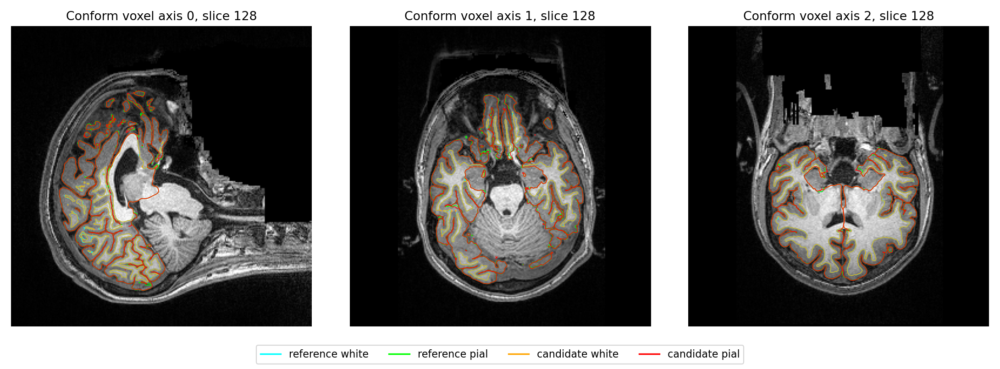
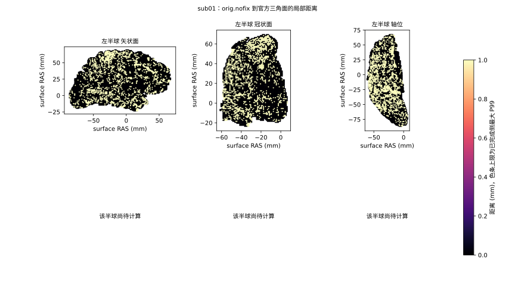

# 十例T1精度优化：当前证据

## 2026-10-07：九例完整官方比较已取回

冻结生产提交 `3a0c9aba6321b4981fd8174b4b191515459aa38b` 的原始T1执行及生产网格通过9/10，全部十例生成138项输出。完整18阶段官方比较已完成9/10；此前四例API只是allocator记录校验失败，新ed16评估工具已完成比较，没有重跑或覆盖原始重建。sub-10206左侧white/pial各16个独立相交面，保留失败状态，不能计为整例通过。

九例成功整例FNIT入口中位数2669.520秒，原官方中位数5839.091秒；逐例官方/FNIT比中位数2.248。这些是原始运行观测，本次未重做受控性能测量。自身父子同期采样峰6.143–13.571GB，连续显存峰与干净隔离部署均未验证。

68区aparc的厚度/面积/灰质体积MAE分别为0.013397–0.039662mm、19.911765–46.235294mm²、58.955882–159.308824mm³；最大单区厚度差0.221mm、面积差364mm²、体积差924mm³。aparc最低Dice在各例为0.79413–0.92162，a2009s最差0.64692；表面局部最大距离仍近6mm。这些差异不能统称浮点尾差。严格复现未通过，整体指标等效仍为`not_assessed`，未更改门槛。

[完整九例指标与耗时表](../../validation/recon_all/accuracy_20261003/runtime/server_refresh_20261007/README.md)包含逐脑区、逐标签、双向点到面距离、球面翻折和white/pial穿越；[机器报告](../../validation/recon_all/accuracy_20261003/runtime/server_refresh_20261007/public_summary.json)保留原始报告及程序绑定SHA。本地工作分支正在整合main@dbb64858，尚未从原始T1验证这个新的合并源码；上述MRI结果不会重标为合并版。


本轮从公开`main@816e5610417a4c587caf321049438a9554139016`开始，目标是在保持现有GPU速度的情况下提高官方输出一致性。五项任务全部使用`gpt-6.1-sol / medium`。本页是阶段进展，**十例最终候选整例尚未完成，整体指标等效未判定**。

## 最新归档核查：合并候选三例raw完成、两例官方数值比较完成

2026-10-05现场核查：实际源3a的十例队列已结束，原始T1执行验收 **9/10**、完整官方数值比较 **5/10**。成功整例入口墙钟2571.814–2988.228秒，中位数2669.520秒；失败sub-10206墙钟3078.458秒，输出138/138齐全，但左侧white/pial各16个面涉及自相交，末端网格验收未通过。其坐标字节及有序面与旧816基线相同，属于已有几何异常；不因输出完整而记为通过。四例API旧评估只在allocator记录校验失败；ed16修复工具已逐例通过原gpucw1的完整预检，独立官方比较已启动，原始重建和旧失败记录保持原样。严格复现、是否引入退化和整体指标等效分别记录，整体等效仍未判定。[逐例时间及局部问题](PRECISION_CANDIDATE_BENCHMARK_20261004.md#2026-10-05十例现场状态)列出全部十例；第三例内存证据仍见[API详细说明](PRECISION_CANDIDATE_BENCHMARK_20261004.md#第三例-sub-10159预初始化cuda-api)。下面各历史更新继续绑定当时实际版本和进度。

## 前次核查：合并候选两例完成，同输入指标回归完成

2026-10-04 15:28 UTC核查：实际源3a的sub-06、sub-07均完成原始T1空目录整例及完整官方对照，当前候选2/10。sub-06入口2948.559秒，自身同期采样峰13,570,670,592字节；138/138、生产网格检查通过，finish双侧算法前OOM限定重启成功。其18阶段官方比较完成，严格6/138，68脑区厚度/面积/体积MAE分别0.036015mm、31.705882mm²、109.808824mm³。sub-07入口2656.930秒，自身采样峰12,027,166,720字节、138/138和生产网格检查通过，八个半球阶段均首次启动成功，无OOM；18阶段官方对照完成、严格7/138，68区厚度/面积/体积MAE分别0.019676mm、30.117647mm²、79.838235mm³。其球面翻折及局部距离最大近6mm另列，整体等效未判定；其余八例串行执行。详见[现版结果与脑图](PRECISION_CANDIDATE_BENCHMARK_20261004.md)。

sub-06较旧8f观测慢约7%，最终GPU指标增加约52.5秒。同输入左侧冷/暖指标诊断已完成：8f为33.557/30.219秒，3a为33.154/30.547秒，未复现整例中的版本差；自身采样峰均2.047GB。五个已有算子门槛全部通过，六套ROI文本统计一致。首版验证脚本因keyword-only线程接口误用在算法前退出，失败保留；独立新版先通过接口检查，再执行真实阶段。原两例基线的输入SHA元数据纠正已独立重核完成，原数值未变。

## 此前快照：隔离启动候选整例开始

2026-10-04 10:12:48 UTC：仅改变两个半球调度模块的隔离候选`8f3e51f5`已在GPU0从原始sub-06和新空目录启动，输出在`startup_whole_sub06_v2/attempt_01`，整例尚未完成。两例GPU1同输入annotation回归通过，全部分区标签、色表、名称和有序网格相同；完整阶段墙钟sub-06为155.261→156.512秒、sub-07为149.794→137.693秒，共享环境的单次观测不用于宣布整例提速。最大观察自身采样峰4.469GB，连续峰未验证。详见[本次回归与脑图](CUDA_STARTUP_BENCHMARK_20261004.md)。

原CUDA错误已定位到新进程上下文建立，Driver primary context retain也曾返回OOM；具体驱动内部资源尚未确定。新增READY/GO和有限启动重试保留算法、精度与质量门槛。首次整例guard因缺少准备launch在预检退出，未执行算法；验证脚本已修复，并保留旧失败。28项调度CPU回归和8项候选准备回归通过。

冻结816基线sub-08新空目录已完成，入口3009.580秒、138/138输出、自身采样峰10.947GB。当前基线成功为8名不同被试/10，官方10/10；一例启动OOM和一例真实自相交仍未通过，最终合并精度候选0/10。下列带日期段落保留为历史快照。

## 四例资源重跑核查（2026-10-04 15:46，北京时间）

四例新空目录重跑已有2例整例成功、1例新CUDA初始化失败、1例显存准入等待。队列PID78104及准入PID78420仍存活。原十例成功5例，加上这次成功的两个新病例，冻结816现已有7名不同被试完成原始T1整例；最终精度候选仍0/10，新增两例与官方的完整数值评估尚未完成。

| 原失败病例 | 本次状态 | 完整入口/失败尝试秒数 | 同刻进程树采样峰 GB |
| --- | --- | ---: | ---: |
| ds000030_sub-10189 | 成功，138/138输出、双侧网格检查通过 | 2447.392 | 11.960 |
| ds000114_sub-06 | annotation双侧worker首次CUDA分配失败 | 2013.492，失败尝试 | 10.951 |
| ds000114_sub-07 | 成功，138/138输出、双侧网格检查通过 | 2537.136 | 8.791 |
| ds000114_sub-08 | 目标GPU空闲不足20GB，锁外等待 | 算法未启动 | 未测 |

成功两例的Euler=2、无未闭合边、坐标有限、有序面保持及white/pial各自相交面0均通过。这是既有网格与输出检查，不能代替与官方的分区Dice、双向表面距离和脑区指标评估。显存按字节除以10⁹显示GB；请求采样间隔2秒、三例GPU/apps查询失败0、最大实际间隔3.21–3.46秒，周期采样不能保证捕获连续峰值。当前共享GPU负载不用于宣布新的性能提升。

sub-06原先的brain_second_normalize OOM本次已经越过，但注释前LH/RH新进程均在冻结 `hemisphere_worker.py:30` 的 `torch.empty(1, float32)` 报CUDA OOM；实际annotation函数未执行。故障窗口6次整卡采样均2674MiB（2.804GB），本例同刻进程树1.946GB、外部843MB，不能将这次归为整卡满载。现有Python栈不能区分CUDA初始化、context创建和首次驱动分配；根因未证明。只查看父command.log会漏掉子worker的OOM，分类须结合group报告和子日志。

15:46:40现场GPU0空闲15,549,333,504字节，低于原20,000,000,000字节准入要求，sub-08未启动算法且不持有共享锁；资源恢复后由现有队列继续。没有更改冻结源码、降低精度、放宽网格门槛或覆盖原失败。

原始完成/失败回执及网格检查见[现场四例快照](../../validation/recon_all/accuracy_20261003/runtime/resource_replay_status_latest_20261004.json)，显存见[采样审计](../../validation/recon_all/accuracy_20261003/runtime/resource_replay_sampling_20261004_0739.json)，新增失败的完整traceback、输入/程序哈希及故障窗口见[sub-06 CUDA初始化诊断](../../validation/recon_all/accuracy_20261003/runtime/sub06_retry_annotation_bootstrap_audit_20261004.json)。下一项独立诊断是新进程显式分开记录 `torch.cuda.init()` 与首个float32分配，保留C++栈和库/资源绑定；尚未将该诊断或启动重试接入生产。

## 前次四例重跑启动核查（2026-10-04 13:02，北京时间）

原四例 CUDA OOM 已在 gpucw1 使用新空目录顺序重跑。首例 `ds000030_sub-10189` 于12:45启动，13:02现场双侧均已生成自产 `orig.nofix`、`qsphere.nofix` 和 `inflated.nofix`，已通过原故障处的独立RH首次CUDA标量分配和同步。该判断来自冻结worker的必经调用顺序与新空目录产物；最终worker耗时回执须等待整段完成。**原RH初始化OOM本次未重现，整例仍在运行，不代表原原因已经修复。** 另三例 `ds000114_sub-06/sub-07/sub-08` 依次等待，当前整例重跑成功数仍为0/4。

原始代码仍冻结为 `816e5610`，同一 GPU0 物理 UUID、总线程4、双侧2×2及 CLI/API 方式保持不变，只改输出与诊断目录。原算法、TF32/FP32策略及关闭分配缓存的设置未调整。启动前获得已有共享锁后，实测空闲显存为 **50,198,478,848 字节**。核对4例输入、1,212个归档源码文件、11个权重、102个资产和15个独立程序，以及PyTorch/CUDA/cuDNN等实际版本，全部与原冻结记录相符。

第三例原RH bootstrap失败窗口的整卡采样约42–43GB，本次父子进程约2GB，不能归因于整卡满载；后三例有同期整卡接近容量的证据。两次采样之间的瞬时峰值、CUDA初始化及驱动/主机资源问题尚未隔离，不将所有OOM统称为同一原因。

新工具仅用于benchmark资源准入、版本绑定和跨session子进程清理，9项本地契约测试通过，包装器提交为 `a9a2aa71`；没有修改生产算法。队列PID `78104`，产物位于 `FNIT/runs/recon_accuracy_20261003/baseline_resource_replays_v1`。H100仍有共享计算负载，本次耗时不能作为独占硬件提速证据。整体指标等效继续未判定，原失败和第五例自相交失败均保留。

复现参数和完整输入/输出见[四例重跑说明](../../validation/recon_all/accuracy_20261003/RESOURCE_REPLAYS_20261004.md)；实际版本、PID和部署哈希见[启动回执](../../validation/recon_all/accuracy_20261003/runtime/resource_replay_queue_launch_20261004.json)，现场进程、设备和资源设置见[运行快照](../../validation/recon_all/accuracy_20261003/runtime/resource_replay_live_20261004_0448UTC.json)。 首例越过原故障点的请求、源码及自产网格SHA见[RH初始化检查点](../../validation/recon_all/accuracy_20261003/runtime/resource_replay_rh_bootstrap_passed_20261004.json)。目前没有发现显式MPS限额或进程/cgroup主机内存限制；当前可读内核环形日志没有NVIDIA错误条目，历史journal和系统日志无权限读取，不能排除历史驱动故障，见[资源环境诊断](../../validation/recon_all/accuracy_20261003/runtime/resource_environment_readonly_20261004.json)。

## 前次运行核查（2026-10-04 12:09，北京时间）

两条原始T1队列已经结束，全部20次整例尝试都有退出回执。官方10/10成功；FNIT冻结816基线5/10成功、5/10失败。不能把“十例尝试结束”写成“十例FNIT通过”。正式仓库现场仍为干净`main@1d31e7ba`；当前结果继续绑定冻结816，最终精度候选尚未冻结，原始T1候选整例0/10。

| 范围 | 当前结果 | 后续 |
| --- | --- | --- |
| 官方十例 | 10成功、0失败，父队列已退出。 | 原始参考与哈希保留。 |
| FNIT冻结基线十例 | 5成功、5失败，父队列已退出。 | 4项CUDA OOM、1项自相交失败保留；资源失败需要独立空目录重跑。 |
| 完整成对评估 | 首两例全部完成，包含Dice、各图谱、no-th3、距离、质量及脑图。 | 其余成功例评估仍未执行。 |
| 最终精度候选 | 0/10。 | 尚不能判断本轮整例退化、指标等效或速度稳定。 |

本轮原五个子会话已不在当前活跃推理列表，初始阶段回执和各工作树仍存在。不能继续称它们正在后台优化。任务5新增诊断提交`133c8498`已审查并合并工作分支，它只增加报告和复现工具，没有生产算法修改。

### 新增三项资源失败

新第8例`ds000114_sub-06`在`brain_second_normalize`的Voronoi源索引搬至GPU时OOM；第9/10例`ds000114_sub-07/sub-08`在`input_talairach`的SynthStrip卷积时OOM。三者退出1。失败时保存的nvidia-smi总占用接近80GB。第8例末采样自身634MiB，整个运行自身采样峰5858MiB；第9/10例自身采样峰616/626MiB。当时资源占用有记录，不由当前GPU状态倒推。完整输入/源码SHA、traceback与逐时资源摘要见[新增失败审计](../../validation/recon_all/accuracy_20261003/runtime/new_failures_audit_20261004.json)。

第三例的首次CUDA初始化OOM仍有独立未解决原因；不得把它与后面三例一概归为同一机制。本次12:09两张GPU当前也处于高占用，但这只是当前现场状态。下一步资源重跑要检查目标GPU可用显存、记录等待，并使用独立空目录；释放后是否成功仍需实测，不能把启动检查当算法修复或资源保证。

### 第五例自相交的最新定位

同一冻结检测器在LH white.preaparc、white、pial保存网格上均检测16相交面/10面对；官方对应三个保存网格均0。独立精确有理数见证证明white/prewhite至少1对、pial至少3对严格穿越，因此不能把全部结果当浮点检测误报。涉事orig面面积正常，小面积面已经在white.preaparc阶段出现，具体生成轮次与算子尚未定位。原生日志14面与文件重读16面差异也尚未隔离。质量门槛保持失败，未采用被试特例、强制平滑或参考坐标复制。

详细证据、程序/输入SHA及只读CPU复现见[相交诊断](../../validation/recon_all/accuracy_20261003/task_05/intersection_sub10206_v1/README.md)。本阶段没有新的相交生产修复。

### 第二例完整评估

`ds000030_sub-10171`完整基线对官方比较已结束，进程PID100248退出，18个评估阶段均complete。严格诊断2/138；指标等效仍未判定。厚度/面积/体积68个aparc脑区MAE分别0.015221mm、19.911765mm²、58.955882mm³，最大绝对差分别0.094mm、79mm²、220mm³。

| 分区图 | Dice最小 / P05 / 中位数 |
| --- | --- |
| aparc+aseg | 0.90445 / 0.92542 / 0.96725 |
| a2009s+aseg | 0.68371 / 0.84888 / 0.93133 |
| DKT+aseg | 0.90909 / 0.93969 / 0.96965 |
| aseg | 0.90909 / 0.98244 / 1.00000 |

双侧双向white平均点到三角面距离0.03971–0.04133mm，最差P99 0.27793mm、最大1.83811mm；pial平均0.07326–0.07475mm，最差P99 0.54052mm、最大4.49071mm。两方有序面与顶点数不同，不作同索引比较。拓扑有效、球面翻折0，但white/pial proper穿越对FNIT LH/RH为65/125、官方69/128，局部问题继续保留。

完整JSON、输入/程序绑定、逐标签与脑区、质量报告及3张图见[第二例汇总](../../validation/recon_all/accuracy_20261003/collected_20261004_1209CST/task_01/ds000030_sub-10171/metrics_summary.json)、[全部报告](../../validation/recon_all/accuracy_20261003/collected_20261004_1209CST/task_01/ds000030_sub-10171/)、[当前队列与退出回执](../../validation/recon_all/accuracy_20261003/runtime/five_tasks_20261004_040903UTC.json)。没有降低严格门槛或宣称当前指标等效通过。



## 前次运行核查（2026-10-04 06:24，北京时间）

已现场读取统一FNIT README和INDEX，正式仓库为干净`main@1d31e7ba`。本轮十例基线仍使用冻结`816e5610`，未切换为当前main，也尚未运行最终合并精度候选。

| 验证范围 | 成功 | 失败 | 运行或等待 |
| --- | ---: | ---: | --- |
| 新十例FNIT冻结基线整例 | 4/10 | 2/10 | 第七例等待共享锁，另三例待运行。四例成功均138项完整。 |
| 新十例官方整例 | 7/10 | 0/10 | 第八例`ds000114_sub-06`正在LH球面配准，另两例待运行。 |
| 最终精度候选整例 | 0/10 | 未开始 | 候选未冻结，优化退化和整体指标等效未判定。 |
| 完整基线对官方评估 | 1例完整 | 无评估失败 | 第二例已完成SHA、严格138项、几何和aparc脑区统计，Dice/距离/质量等在共享锁后等待。 |

五项初始阶段交付完成；任务2–4没有仍运行的旧阶段进程。任务1的第二例评估进程PID100248继续存在，其等待锁的时间不计入算法耗时。任务5已重新分配新增第五例相交问题定位；这不表示已修复或已运行候选整例。五个工作树只有统一位置规则未提交修改，没有未提交算法文件。

### 新增失败及成功整例

第五例`ds000030_sub-10206`生成了全部138项，但最终网格检查失败：LH white/pial各检测到16个相交面，RH均0。Euler=2、边界边0、坐标有限、有序面保留均通过，不能以这些结果掩盖自相交。程序在北京时间01:14:22退出1；监控墙钟3285.818秒是失败运行时间。原始报告、程序SHA和日志保留，任务5先核对相交检测与真实几何，不放宽质量门槛。

第三例`ds000030_sub-10189`的RH worker CUDA初始化失败仍未解决，未重跑。两条父队列继续存活，没有因失败停止后续病例。新增成功第四例墙钟2966.970秒、自身同刻父子进程采样峰10,961,813,504字节；第六例墙钟2702.066秒、采样峰10,945,036,288字节。请求间隔2秒、查询失败均0，连续显存峰未验证。这里是冻结基线结果，不是本轮修复带来的提速。

### 第二例部分端到端统计

`ds000030_sub-10171`冻结基线对官方已生成以下68个aparc脑区指标；严格诊断通过2/138，双侧white/pial网格不对应，因此不做同索引比较。

| 指标 | MAE | 最大绝对差 | 绝对相对差中位数 |
| --- | ---: | ---: | ---: |
| 厚度 mm | 0.015221 | 0.094 | 0.344% |
| 面积 mm² | 19.911765 | 79 | 0.820% |
| 灰质体积 mm³ | 58.955882 | 220 | 0.648% |

上述为当前已经生成的部分统计。标签Dice、扩展分区/no-th3、全部双向表面距离、网格质量和脑图尚未完成，整体等效保持`not_assessed`。第一例完整报告和全部失败仍保留，不以第二例较小误差替代十例分布。

现场回执见[五任务/队列快照](../../validation/recon_all/accuracy_20261003/runtime/five_tasks_20261003_222417UTC.json)、[新增失败与源报告SHA](../../validation/recon_all/accuracy_20261003/runtime/followup_summary_20261004_0624CST.json)、[第二例已完成部分报告](../../validation/recon_all/accuracy_20261003/collected_20261004_0624CST/task_01/ds000030_sub-10171/)。完整采集文件另备份在本地deliverables，服务器原始日志和冻结源码保持原位置。未推送main。

## 前次运行核查（2026-10-03 20:01，北京时间）

统一入口`/cwStorage/home/gongwk/Notebook_code/FNIT`的README与INDEX已现场读取。正式repo为干净`main@7af34e6d`；本轮整例继续使用原冻结`816e5610`和原实际环境prefix，没有因目录归并切换来源。

| 验证范围 | 成功 | 失败 | 正在计算 / 等待 |
| --- | ---: | ---: | --- |
| 新十例FNIT基线整例 | 2/10 | 1/10 | 第四例等待共享锁，其他待运行。 |
| 新十例官方整例 | 3/10 | 0/10 | 第四例`ds000030_sub-10193`正在GCA注册。 |
| 最终精度候选整例 | 0/10 | 未开始 | 候选尚未冻结；当前报告不是修复后整例验收。 |
| 新首例完整基线对官方评估 | 1 | 0 | 第二例`ds000030_sub-10171`评估已持久启动PID100248，等待共享锁；新产物在FNIT/runs/recon_accuracy_20261003/evaluation，源码/配置在FNIT/workspaces/recon_accuracy_20261003。 |

五项第一批阶段验证均有完整回执：前段十例20次、CA完整ABBA8次、网格/球面32条命令与固定种子两次LH sphere、旧首例双侧放置14次全部已归档。子会话交付状态和服务器持久作业分开记录，不能把五会话都称为仍在并行计算。任务2–4的通知曾遇到会话容量限制，统一位置规则已落入五个工作树的AGENTS及SERVER_LAYOUT；各树没有未提交算法文件。

### 第三例基线失败

`ds000030_sub-10189`在2026-10-03北京时间19:33失败，监控器墙钟780.277秒，不能算作成功整例时间。前段已运行至`brain_finalsurfs`；半球surface组启动后约9.82秒终止，RH worker首次`torch.empty(1, dtype=float32, device=cuda:0)`报告`CUDA error: out of memory`，父调度取消LH且没有发布成功表面组。它发生在worker计算网格之前，不是观察到白质放置数值验收失败。

整例自身同刻父子GPU采样峰10,949,230,592字节，363次采样、查询失败0、最大间隔4.592秒。采样低于20GB不能证明连续峰低于预算，也不能从该初始化报错直接归因于实际设备显存耗尽、禁用缓存或特定被试。原因仍待定位；原始失败、源码/输入哈希、worker traceback、显存和未发布状态保留，不自动改成CPU/低精度/近似流程。

两条整例队列继续存活，不因一个病例失败停止其他病例。现场PID、锁、逐例回执与官方当前日志见[20:01报告](../../validation/recon_all/accuracy_20261003/runtime/five_tasks_20261003_120118UTC.json)，完整失败见[失败报告](../../validation/recon_all/accuracy_20261003/runtime/baseline_ds000030_sub-10189_failure_20261003.json)。整体指标等效与本轮候选速度变化仍未判定；阶段已通过不代替十例整例验收。

## 前次完成情况（2026-10-03 16:41，北京时间）

第一批已启动阶段验证全部结束，五项初始验证均有回执；任务3/5正在收集完整记录。新十例原始T1整例仍为基线1/10、官方1/10完成；官方第二例运行，基线第二例等待共享锁。守护器在北京时间15:32:40确认已监控阶段进程全部退出后自动恢复两条整例队列。最终精度候选版本尚未冻结和整例运行，整体指标等效与候选退化均未判定。

| 任务 | 新完成结果 | 仍需处理 |
| --- | --- | --- |
| 1 | 新首例`ds000030_sub-10159`原始T1基线对官方比较全部完成，包含138项、脑区/标签、质量、全部表面双向三角面距离与脑图。 | 其余九例及最终候选三方评估。 |
| 2 | 十例前段20次配对运行完成；写出值/网格不变、dtype按设计修复，N4交叉及重复计时已归档。 | N4具体浮点算子仍需定位。 |
| 3 | 生产坐标修复8次完整ABBA回归完成。旧sub01两版本norm/ctrl均零差；旧sub02基线两次均11/6，候选两次均0/0。 | 新十例连续链回归；sub02阶段候选均值26.5025秒、基线25.1052秒，仅单组观察，不宣称速度稳定。 |
| 4 | 两例四半球共32条命令全部退出0。另固定seed1234的LH官方sphere重复两次，与FNIT有序面与坐标完全一致，官方两次几何也全同。 | 其余球面原诊断的未固定seed对照仍须按配置差异解释；不能把全部输出不一致归因于随机性。 |
| 5 | 旧第一例双侧14次放置运行全部退出0。完整Python pial双侧四轮均与官方有序坐标/面逐值相同。 | Python双侧1182.561/1007.901秒，较慢，保持当前原生默认；原生white/pial局部偏差、第二例和新十例仍需验证。 |

### 新首例端到端误差

这里比较冻结基线`816e5610`与官方FS8.2 d932c45，均从同一原始T1和空目录运行；不是本轮精度修复后的候选结果。完整输入、代码、程序、权重和资产SHA经比较入口复验。138项输出均存在，原严格比较通过2/138；文件计数不是整体算法验收比例。

| 68个aparc脑区指标 | 平均绝对误差 | 绝对相对误差中位数 / P90 | 最大绝对误差 |
| --- | ---: | ---: | ---: |
| 厚度 mm | 0.039662 | 1.031% / 4.011% | 0.221 |
| 面积 mm² | 45.426471 | 1.959% / 6.377% | 231 |
| 灰质体积 mm³ | 159.308824 | 2.363% / 5.406% | 792 |
| 平均曲率 mm⁻¹ | 0.003132 | 1.370% / 3.993% | 0.016 |

aparc+aseg标签Dice最小/P05/中位数为0.79413/0.86390/0.92638；a2009s+aseg为0.67547/0.77324/0.89344；aseg为0.80000/0.95122/1.00000。所有标签与脑区保留在原始报告；不以整数标签的Pearson r代替分割一致性。

white两个方向、双侧平均三角面距离范围0.07889–0.10996mm，最差P99为0.81013mm、最大局部距离4.35594mm。pial平均距离范围0.14736–0.17151mm，最差P99为1.19835mm、最大4.39785mm。顶点数/有序面不同，未进行同索引比较；上述是所有源顶点到完整目标三角面的距离，不是连续Hausdorff。

扩展质量检查两方均单连通、无边界/非流形、sphere及sphere.reg径向翻折0。但white/pial proper穿越对FNIT LH/RH为599/716、官方为343/495，属于需保留的局部问题，不能由拓扑检查通过声称全部网格质量验收通过。FNIT生产white和pial各自自相交0与二者互相穿越非零分别记录。

计时仍为冻结基线2565.521秒、官方5811.069秒；首例FNIT自身同刻父子GPU采样峰10,947,133,440字节，连续峰未验证。端到端比较与绘图耗时和锁等待独立记录，不纳入生产墙钟；后续候选精度/速度变化尚无整例实测。

完整新结果见[首例机器摘要](../../validation/recon_all/accuracy_20261003/collected_20261003_0841UTC/first_case_metrics_summary.json)、[逐项报告与脑图](../../validation/recon_all/accuracy_20261003/collected_20261003_0841UTC/task_01/pair_baseline_official_v1/ds000030_sub-10159/)、[当前进程和完成回执](../../validation/recon_all/accuracy_20261003/runtime/five_tasks_20261003_084150UTC.json)。仍保留严格复现、优化退化和指标等效三个独立状态，未降低阈值。

## 前次核查（2026-10-03 13:51，北京时间）

五个`gpt-6.1-sol / medium`子会话均完成本轮交接，后台验证与会话推理状态分别记录。十例输入复验完成；FNIT冻结基线、官方参考各完成1/10，最终候选0/10。官方首例退出0，墙钟5811.069秒；同主机、总线程4的FNIT基线首例为2565.521秒，均包含前置校验、加载、传输及读写。这是基线对官方的首例比较，不能称为本轮候选提速。

| 任务 | 最新交付 | 仍在执行或等待的真实验证 |
| --- | --- | --- |
| 1：数据与评估 | 十例数据/哈希完成；已启动首例基线对官方的138项、Dice、表面距离、脑区统计与脑图评估。 | PID32848等待共享锁；尚无这次整例数值汇总。 |
| 2：conform/N4/Synth | 十例前段配对、20次运行退出0；体素和几何0差，XFM一致、LTA矩阵0差，dtype按设计修复。N4交叉与重复计时结果已收集。 | 具体N4浮点算子原因仍未确定；旧工具链诊断约205秒，因此未替换较快生产路径。 |
| 3：GCA/归一化/WM | 8组交叉、6项尾段和2例坐标诊断完成。一般FP32坐标契约修复已合并工作分支，3项契约测试通过。 | 完整生产函数8次ABBA配对回归PID115793等待锁；没有把坐标诊断当作新十例整例。 |
| 4：网格/球面 | LH同输入remesh及register有序面与坐标全同；异拓扑距离报告已完成。原球面对照发现参考命令未固定种子。 | 原队列已进入RH；PID4972固定seed1234进行两次官方sphere复测，尚未完成。 |
| 5：white/pial | LH prewhite、最终white和原生pial六次运行完成，输入SHA和参数匹配，逐顶点与脑区报告已保存。 | Python LH pial正在计算，RH待运行；局部放置偏差仍未解决。 |

任务3在两例旧冻结真实输入上，FP32逆矩阵与逐项累计的坐标诊断使sub02 norm不同体素11→0、ctrl不同元素6→0，sub01保持零差，空间与dtype一致。正式修复保留边界、舍入和无效样本语义，不添加被试或体素特例；完整生产回归仍待结果。见[CA归一化说明](CA_NORMALIZATION.md)。

任务4原球面差异mean4.376mm的参考命令未设置seed，使用了时钟派生随机种子；FNIT为1234，因此这不是固定配置下的有效算法比较。新版官方首例的sphere日志确认seed1234；隔离复测另检查重复性，不将所有差异归因于随机性。

任务5同输入LH局部位移仍需定位：prewhite max1.148342mm、最终white max0.220274mm、pial max1.482209mm，超过0.1mm的顶点分别200、15、5844。均值很小不能掩盖局部异常。原因尚未解决，不能全部归为编译尾差；详见[完整表面精度报告](SURFACE_ACCURACY_20261003.md)。

现场进程、共享锁、回执SHA、完成数量及会话状态见[13:51机器报告](../../validation/recon_all/accuracy_20261003/runtime/five_tasks_20261003_final_status.json)。任务2旧父进程已退出且有完整凭据；任务3新回归、任务4队列/复测、任务5放置、任务1评估均存活。整例父队列由原阶段优先守护器暂缓后续提交，最长至北京时间16:26:50；新增PID115793、4972、32848不在原守护器静态名单内，仍通过共享锁串行取算力。没有重启或取消已有队列。

## 数据与实际运行

十例原始T1已经下载并独立复验，来自两个固定、CC0的OpenNeuro快照各5个不同被试。共107,511,490字节；每例记录文件SHA、形状、dtype、affine和qform/sform。详情、许可及下载复现见[数据清单](../../validation/recon_all/accuracy_20261003/cohort/README.md)。旧两例仅用于冻结同输入诊断，不计入新十例。

gpucw1上的816源码快照有1209个文件，逐文件SHA全部匹配公开提交。FNIT实际权重11项、资产102项、独立Conda程序15项及十例输入已复验。官方参考报告版本为`freesurfer-linux-centos7_x86_64-8.2.0-20260314-d932c45`，清单覆盖49个程序/环境入口及113项资源。完整清单、启动凭据在[runtime](../../validation/recon_all/accuracy_20261003/runtime/)。

十例FNIT基线与十例独立官方参考队列已后台启动，每例单独取得共享锁。启动凭据不表示已完成。基线使用H100 GPU0物理UUID，总线程4、半球worker2；官方使用同主机、总线程4、ITK1、种子1234和CPU Synth。前5例FNIT调用预初始化CUDA API，后5例调用CLI；最终候选沿用相同方式。完整流程和复现参数见[验证说明](../../validation/recon_all/accuracy_20261003/RUN_VALIDATION.md)。

## 已定位的问题与阶段结果

| 范围 | 当前实测与处理 | 证据边界 |
| --- | --- | --- |
| SynthStrip写出 | 原MGZ写成float32；新writer保持conform的uint8、网格和header，模型仍为FNIT GPU。旧两例AB/BA体素和空间0差。新十例中10例完成conform/SynthStrip/Talairach前段AB/BA，体素0差、XFM一致、两LTA矩阵0差。 | dtype变化是预期修复；这10例不是N4→filled或整例验收。完整重复计时与N4交叉结果已收集；前段不覆盖N4/filled。 |
| N4浮点尾差 | 同输入官方重跑与原官方浮点输出逐位一致。独立旧GCC/ITK诊断可重现官方，但约205秒，当前Conda约121秒，因此未替换生产。Conda下float/uchar掩膜模板四级中间量均逐位相同，排除该因素。 | 现代工具链链接旧ITK的诊断约128.254秒，中间量仍与现代结果逐位相同；具体算子归因仍未完成，不能归因于随机性，也不为尾差引入明显减速。 |
| GCA与CA归一化 | 新做旧真实sub01四组诊断：官方nu配两种mask，LTA和norm均0差；FNIT nu配两种mask，LTA max为0.000573515892，norm不同490692体素、ctrl_pts不同10617体素。固定官方nu/mask/LTA的归一化回放0差，含读写27.47秒。 | 该例nu仅2个体素差已经传播至注册/归一化，mask无额外贡献，不能一概视为无影响尾差。sub02基线同输入有norm11/ctrl6残差；最新FP32坐标诊断消除此处，一般生产修复已在工作分支，完整ABBA回归待完成。 |
| tessellation与主连通分量 | 旧真实sub01 LH用相同FNIT pretess输入：官方raw有102016顶点、102032个quad；与FNIT真实有序quad和坐标完全相同，主分量三角面及坐标也完全相同。 | 保存的自产/官方orig.nofix不同之前filled已不同；这不是两个网格算子的同输入失败证据。 |
| 球面质量 | 两例四半球已保存sphere与sphere.reg径向翻折均0。 | 自相交、同输入remesh/sphere/register及新十例质量仍需完成，不能由0径向翻折推断全部网格质量通过。 |
| 脑区面积 | 候选修复从float32面面积分摊后以float64汇总，避免先舍入顶点累计。真实同网格LH相对独立逐面oracle：基线max/P99为9.0969e-6/8.5924e-6 mm²，候选均0。6项缓存回归通过，2.61秒。 | `.area`图、厚度和no-th3定义不改。官方stats面积打印为整数，不能据该尾差宣称最终脑区指标显著改善。 |

详细修改说明：[SynthStrip写出](SYNTHSTRIP_MGH_DTYPE.md)、[统计缓存与面积定义](SURFACE_STATS_CACHE.md)；面积修复的[真实三方报告](../../validation/recon_all/accuracy_20261003/task_05/roi_lh_v1.json)保留全部脑区及原始误差。旧历史问题和当前重跑分别保存在[任务2](../../validation/recon_all/accuracy_20261003/task_02/README.md)、[任务3](../../validation/recon_all/accuracy_20261003/task_03/README.md)、[任务4](../../validation/recon_all/accuracy_20261003/task_04/README.md)中。

Python pial另修复了一处控制流问题：第三次缩步仍拒绝时，应恢复该步坐标并结束当前轮，继续后续轮；旧函数错误抛异常。7项回归通过，包含完整四轮终止/恢复控制流。真实white/pial队列已完成LH三项原生配对并记录局部差异，Python LH pial及RH仍未完成；生产默认仍保留已验证的Conda原生pial，不切换成较慢Python路径。新增逐试步trace仅诊断开启时记录。详见[Python pial说明](PYTHON_PIAL_PLACEMENT.md)。

## 网格误差图与比较口径

旧sub01 LH orig.nofix顶点数不同，使用双向点到三角面距离。候选→官方mean/P99/max为0.021496/1/3.162278 mm，反向为0.028786/1/2.449490 mm；每方向前64个真实点另经独立精确实现核对，差为0。它描述旧自产链的形状差异，不是逐顶点一致性，也不是十例修复后结果。



## 时间、显存和安装

十例Synth前段测得同刻进程采样峰约7.218 GB。基线/写出修复候选前段中位耗时18.688/18.764秒；另一次AB重复候选慢3.062秒，BA重复快1.212秒，变化主要在未改动的conform阶段。存在顺序、冷启动和负载波动，不能据此判定速度等效或提速。面积汇总热候选0.0223秒、热基线0.0211秒，首次基线0.2997秒；不能从首次冷加载宣布加速或速度等效。这些都是阶段数据，不是整例显存/耗时。

本轮整例计时包括校验、加载、传输及读写，锁等待单列。NVML请求采样间隔2秒，记录实际最大间隔；PyTorch统计不可用时不填零。20 GB预算按20,000,000,000字节计算。最终十例配对墙钟及显存尚待完成。

截至2026-10-03北京时间12:10，新十例中首例FNIT基线已完成；官方首例正在执行RH最终white，未生成完成回执。为优先完成阶段回归，两个整例父调度器暂缓提交后续病例，当前子计算继续；守护器在已启动阶段进程退出或6小时窗口结束后自动恢复。调度等待不是算法耗时，被观察进程退出也不表示验收通过。

没有新增生产依赖。修复继续使用主页Conda的nibabel/PyTorch，所有Synth维持FNIT GPU、默认TF32与经过验证的局部FP32例外，不使用半精度。官方只在隔离benchmark目录执行，生产不读取参考结果。当前服务器安装有官方软件，物理无预装软件的干净整例环境尚未验证。

## 当前整例进度（2026-10-03 12:10，北京时间）

| 范围 | 完成数量 | 本次实际结果 |
| --- | --- | --- |
| 原始T1下载与哈希复验 | 10/10 | 两个公开快照、10名不同被试。 |
| 写出修复的同输入前段回归 | 8/10 | 四幅体积值及空间均0差，XFM一致、LTA矩阵0差；不包含N4和filled。 |
| 冻结816基线原始T1整例 | 1/10 | `ds000030_sub-10159`端到端2565.521秒，pipeline内部2561.658秒，138/138项存在。 |
| 官方参考原始T1整例 | 0/10 | 首例仍在执行，已进入RH最终white；其余病例等待。 |
| 最终候选原始T1整例 | 0/10 | 候选版本尚未冻结，不能判断十例优化退化或整体等效。 |

首例基线双侧网格检查通过：LH/RH分别108392/105767个顶点，Euler均为2，未闭合边0，white/pial各自检测到的相交面0，有序面保持且坐标有限。这是当前检查的通过结果；尚未完成与官方的严格数值及脑区指标比较，也不代表white与pial互相穿越的额外检查已完成。

显存按GPU物理UUID记录同一时刻父子进程合计。首例1171次采样、失败查询0，请求间隔2秒、最大实际间隔2.697秒，采样峰10947133440字节（10.947 GB），低于20000000000字节；没有声称捕获连续峰值。首例使用已初始化CUDA的Python API，CLI及其他九例资源验证仍未完成。

本例最长父阶段为表面生成921.460秒、最终white/pial373.144秒、球面配准231.824秒，GCA注册175.101秒、N4 128.144秒。父阶段包含双侧子阶段，不能重复相加；当前官方尚未完成，不能计算整例提速。报告绑定基线`816e5610`，不将这些时间称为本轮候选结果。

完整计时、实际精度设置、网格检查及完成凭据SHA见[现场机器可读报告](../../validation/recon_all/accuracy_20261003/runtime/progress_20261003_0410UTC.json)。EM四组回放完成5/8组、尾段5/6阶段，坐标舍入诊断0/2；等待共享锁不计入算法阶段耗时，假设尚未证实。

### 五任务会话核查（2026-10-03 12:18，北京时间）

五个子会话当前均已完成阶段交付或本轮状态回复，处于空闲；后台验证与子会话的推理状态分别记录。任务1的数据准备完成且无下载进程。任务2的3个、任务3的3个、任务4的2个后台父进程全部存活并等待共享锁；任务5的放置shell及flock进程也存活，仍等待第一项`lh_prewhite_conda`。ROI回归已完成并退出0，完整white/pial对照没有结果。任务4已完成官方tessellate、extract、remesh三步，FNIT remesh待锁。

共享锁当前由官方首例持有，正在计算RH pial。两条整例父队列由阶段优先守护器暂缓提交后续病例，已启动的官方子计算继续。没有将等锁时间当作算法耗时，也没有将仅有输入哈希的病例占位计为已完成：坐标诊断仍0/2。任务5状态联系曾受子代理thread容量限制，在任务1/4返回后重试成功；服务器验证进程不受该限制影响。

现场PID、进程状态、锁等待、回执SHA和子会话确认见[五任务现场报告](../../validation/recon_all/accuracy_20261003/runtime/five_tasks_20261003_0418UTC.json)。只读复现工具为[inspect_background.py](../../validation/recon_all/accuracy_20261003/inspect_background.py)，在gpucw1执行：

```bash
# --root：本轮验证根目录；仅检查进程、锁和报告，不启动计算
python inspect_background.py --root /cwStorage/home/gongwk/Notebook_code/freesurfer_synth/work/recon_standard_20260929/accuracy_20261003
```

## 验收与剩余工作

保留138项严格复现诊断及原门槛，另报优化前后退化和最终分区Dice、双向表面距离、逐脑区厚度/面积/体积偏差及局部异常。整体等效标准尚未确认，状态保持`not_assessed`。

剩余重点为N4具体算子归因、归一化生产ABBA回归、固定种子球面重复性、white/pial局部异常及双侧完整同输入比较、十例最终候选整例和三方汇总。完整Python white尚非生产全流程；不以首轮诊断冒充完整第三方结果。十例最终候选版本未冻结，当前不发布“精度优化已经完成”或新的整例提速结论。

## 最近版本与参考

| 版本/日期 | 用途 |
| --- | --- |
| `816e5610`，2026-10-03 | 本轮固定公开基线，当前十例基线/官方队列绑定它及各自程序哈希。 |
| `c24b3d6d`，任务2 | SynthStrip dtype写出修复；旧两例及新十例前段回归逐项记录实际源码SHA。 |
| `03ca0dd5`，任务5 | ROI面积一般舍入修复候选与缓存回归；工作分支验证，不代表十例整例验收。 |
| `8d750e2`，2026-10-02 | 上轮两例性能结果，见[版本绑定报告](../../validation/recon_all/optimizations/20261002_parallel/FINAL_RESULTS.md)，不改标为本轮结果。 |

- [固定FreeSurfer源码](https://github.com/freesurfer/freesurfer/tree/d932c45b7941662ea380a05efef580568b98d41a)。
- Fischl B. FreeSurfer. *NeuroImage*. 2012;62:774–781. [doi:10.1016/j.neuroimage.2012.01.021](https://doi.org/10.1016/j.neuroimage.2012.01.021)。
