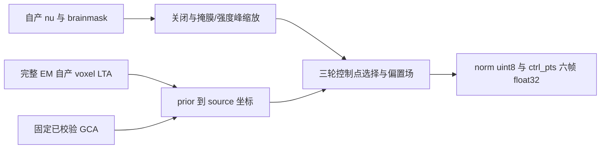

# GCA 强度归一化与坐标精度

## 功能简介

`run_ca_normalize` 在完整 EM 注册之后，利用固定 T1 GCA 选择三轮控制点并校正强度，生成 `norm.mgz` 和六帧 `ctrl_pts.mgz`。它使用已有 NumPy/SciPy/Numba 算法、nibabel 读写，不调用 FreeSurfer 程序，不改变其他阶段的 PyTorch GPU、TF32 或低精度策略。



## Python 调用及输入输出

```python
from fnit.recon_all.ca_normalize_python import run_ca_normalize

normalization_report = run_ca_normalize(
    nu_path=subject_mri_directory / "nu.mgz",           # 256³、1 mm conformed uint8 T1
    mask_path=subject_mri_directory / "brainmask.mgz",  # 与 nu 同网格；0和1不参与
    gca_path=verified_assets_directory / "average/RB_all_2020-01-02.gca", # 固定单通道图谱
    lta_path=subject_mri_directory / "transforms/talairach.lta", # source voxel→atlas voxel
    norm_path=subject_mri_directory / "norm.mgz",       # 同网格 uint8 强度输出
    ctrl_path=subject_mri_directory / "ctrl_pts.mgz",   # 同网格六帧 float32 控制点输出
)
```

六个路径参数必传，无隐藏默认值。`nu_path` 和 `mask_path` 必须是同一 conformed 网格，affine 的既有检查为绝对误差 1e-4、相对误差 0；nu 必须为 uint8。GCA 固定 128³ prior、256³ atlas 和当前单通道 T1 profile，不是任意多通道图谱。LTA 是 type=0 的单个 4×4 affine，携带两侧几何；不能把 scanner RAS 或 mm 变换直接当 voxel LTA。输出 norm 保留输入网格/dtype；ctrl_pts 前三帧为各轮控制点标签，后三帧为相应图谱均值。返回字典包含 atlas/image peak、setup、三轮 selection/bias、写出和总耗时，以及各标签控制点数量。缺文件、错误 dtype/geometry/LTA/affine 等明确报错。

内部坐标接口：

```python
import numpy as np
from fnit.recon_all.ca_normalize_python import prior_to_source_coordinates

source_voxel_indices = prior_to_source_coordinates(
    prior=atlas_prior_voxel_coordinates,        # N×3 整数，prior 网格 x/y/z
    voxel_lta=source_to_atlas_voxel_affine,      # 4×4 source→atlas affine
    prior_spacing=2.0,                          # prior 到 1 mm atlas 的缩放
    source_shape=(256, 256, 256),               # 可选；None只做坐标与nint
)  # N×3 int32 源体素索引，不涉及world/RAS或重采样
```

`prior`、`voxel_lta`、`prior_spacing` 必传；`source_shape` 默认为 None，只计算整数坐标。固定 GCA 调用传 256³：原生先在浮点坐标检查闭区间 `[0, size-1]`，有效时才更新整数 source 坐标；越界样本保留 `GCAfindAllSamples` 初始 atlas 坐标，不能裁到边界或使用 NumPy 负索引。逆矩阵复用已有 VNL FP32 affine 实现，spacing 只乘前三列、平移不缩放；每项乘积和累计均舍入 FP32。已产生的 FP32 坐标先提升到 double，再按正负半整数远离零的 nint 规则取整，避免 `.5` 在 FP32 中提前被舍入。非有限、奇异或非 affine 矩阵、错误坐标/shape/索引范围明确失败。此内部接口只声明固定 1 mm GCA profile，不用于任意 atlas 几何。

## 命令行及原软件调用

当前为 pipeline 内部 callable，没有新增生产独立 CLI。真实冻结阶段复现命令与所有参数见 [任务3脚本说明](../../validation/recon_all/accuracy_20261003/task_03/README.md)。原软件对应命令仅在隔离 benchmark 目录执行：

```bash
mri_ca_normalize -c ctrl_pts.mgz -mask brainmask.mgz \
  nu.mgz RB_all_2020-01-02.gca transforms/talairach.lta norm.mgz
```

坐标累计与 nint 是原软件内部步骤，没有单独 CLI。生产完整 EM 入口、图谱许可/大小/SHA 检查沿用项目既有安装与资源清单，本修复无新增依赖。

## 成熟子函数 bug 与当前验证

2026-10-03 定位到旧 `atlas_samples` 用 FP64 inverse/matmul 后才取整，与原生 FP32 inverse/逐项累计不同。在两例冻结完整官方输入上，sub01 原本零差；sub02 多出一个右 WM 控制点，在三轮标签和均值帧形成 6 个不同元素，norm 有 11 个体素差 1。进程内 FP32 坐标诊断使两例 norm/ctrl 全部零差、网格/dtype不变。这是一般坐标数值契约修复，不按某个被试或体素改写输出；生产的平滑、控制点过滤、三轮偏置场、峰值缩放均保留。

| 同输入阶段（旧两例） | 修复前 norm / ctrl 差异 | 坐标诊断 norm / ctrl 差异 | 坐标诊断含I/O秒 |
|---|---:|---:|---:|
| sub01 | 0 / 0 | 0 / 0 | 28.01 |
| sub02 | 11 / 6 | 0 / 0 | 25.55 |

[完整坐标诊断](../../validation/recon_all/accuracy_20261003/task_03/coordinates_fp32_completed.json)绑定输入、源码及输出哈希。生产 helper 还按原生完整链保留越界初始坐标；三项独立契约测试覆盖平移/spacing、负半整数、FP32 `.5` 提升和浮点边界。生产 helper 两例 ABBA（每例 baseline→candidate→candidate→baseline）短阶段回归已排队，完成结果将独立记录；不把诊断耗时当配对速度验收。目前没有脑图或新十例整例改善声明，138 项与全链由协调者统一评估，整体等效 `not_assessed`。

完整八组 nu/mask 输入诊断证明：两例有效 mask 支持集都相同；sub01 两个 nu 体素使完整 EM LTA 和控制点改变，norm 扩展为 490692 个不同体素；这是上游传播。sub02 当前自产输入有 norm 41 个不同体素，其中同官方输入的 11 个残差由本次坐标诊断消除，剩余上游传播不能由同输入修复的结果推断已经解决。[八组实测 CSV](../../validation/recon_all/accuracy_20261003/task_03/cross_completed.csv)、[同输入尾段六项零差报告](../../validation/recon_all/accuracy_20261003/task_03/tail_completed.json)与[原始两例审计](../../validation/recon_all/accuracy_20261003/task_03/audit.json)分别记录诊断层级。

## 版本与 benchmark 记录

- 2026-09-27：早期 CA 同输入单例验证见 `validation/recon_all/python_gpu_port/native_cpp_conda_20260927/ca_normalize_same_input.json`；不能代替本轮两例或十例。
- 基线 `816e5610`：sub02 冻结官方输入仍有 norm 11 / ctrl 6 残差；本轮完整八组诊断另存，不改写历史结果。
- 2026-10-03：一般 FP32 prior→source 坐标修复；诊断两例零差。生产 ABBA 状态与源码 SHA 见任务3当前报告。

## 原实现与参考文献

- [FreeSurfer 固定 GCA 坐标与采样源码](https://github.com/freesurfer/freesurfer/blob/d932c45b7941662ea380a05efef580568b98d41a/utils/gca.cpp)：`GCAfindAllSamples`、`GCAcomputeSampleCoords`、`GCApriorToSourceVoxel`。
- [固定矩阵源码](https://github.com/freesurfer/freesurfer/blob/d932c45b7941662ea380a05efef580568b98d41a/utils/matrix.cpp)：`MatrixMultiply` 的 FP32 累计。
- [固定 nint 源码](https://github.com/freesurfer/freesurfer/blob/d932c45b7941662ea380a05efef580568b98d41a/utils/utils.cpp)；[mri_ca_normalize](https://github.com/freesurfer/freesurfer/blob/d932c45b7941662ea380a05efef580568b98d41a/mri_ca_normalize/mri_ca_normalize.cpp)。
- Fischl et al. Whole brain segmentation: automated labeling of neuroanatomical structures in the human brain. Neuron 33, 341–355 (2002).
