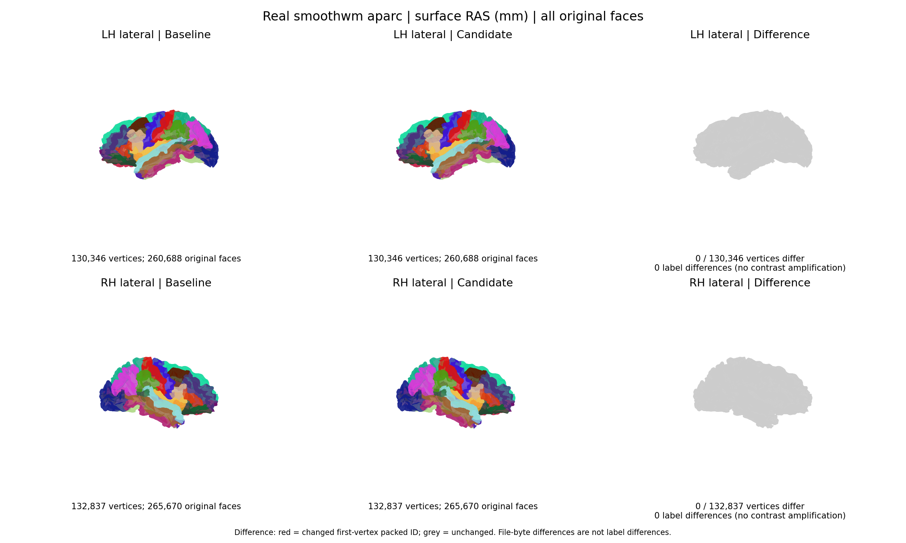
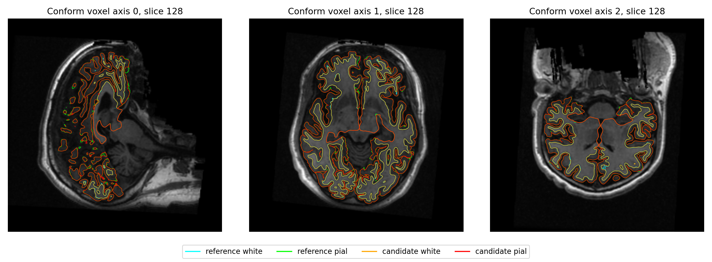
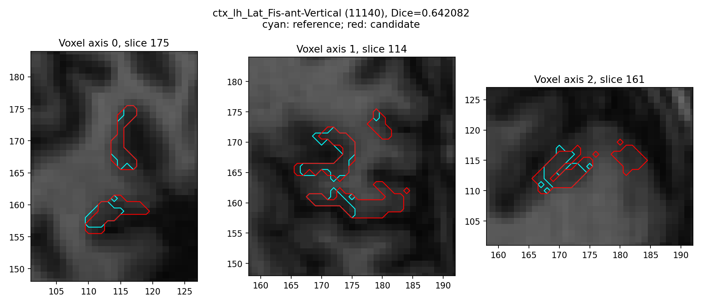

# CUDA 启动 OOM：修复与真实数据回归

本页隔离阶段和整例使用8f源码；[后续合并候选3a](PRECISION_CANDIDATE_BENCHMARK_20261004.md)已完成首例，并在finish双侧实际触发算法前OOM及安全重启。两次实际测试版本、计时和显存分别保留。

## 定位结果

原始 `sub-06` 的两个 annotation worker 在第一次 `torch.empty(1, float32)` 失败，算法函数尚未进入。故障窗口整卡采样占用约 2.804 GB，本例父子进程约 1.946 GB。新进程最小实验的 C++ 栈落在 `cudaDeviceGetStreamPriorityRange`；独立 Driver 调用 `cuDevicePrimaryCtxRetain` 也返回 CUDA OOM。最小实验定位到 CUDA 上下文建立，尚未调用张量的 `cudaMalloc`；原始 sub-06 未记录 C++ 栈，不能据此认定其底层原因完全相同。

这些证据定位了失败边界；驱动返回 OOM 的具体内部资源仍未确定。后续 ioctl 诊断 16/16 成功，没有捕获新的失败；成功进程也出现 `NV_ERR_NOT_SUPPORTED`，不能把该状态当作 OOM 原因。另三次 Synth/Voronoi 失败有整卡接近容量的同期记录，应分别保留。

## 本次修改

两个已有半球调度模块增加 READY/GO 屏障：实际 worker 完成原 FP32 标量分配、同步和设备核验后保持上下文，父进程确认同批全部就绪才发送 GO。每批默认 30 秒启动预算，仅明确、可信的函数进入前 CUDA OOM 可以回收失败进程后重新 exec。函数导入、算法执行和后同步错误仍直接失败；每侧算法至多进入一次。没有改变影像算法、精度、标签或缓存策略。

实现及全部输入输出见[调度说明](CUDA_STARTUP_RESOURCE_WAIT.md)。工作分支补丁提交 `5f75ed5c8f78cdc72658524b367adf86687dfd3c`。实际 GPU 测试使用仅替换两个调度模块的隔离提交 **`8f3e51f58c37d28e1283d5bb8e248e93530cd398`**；457 个生产 Python 文件中另 455 个与冻结基线 `816e5610417a4c587caf321049438a9554139016` 相同。其他精度候选没有混入本次评估。

## 同输入真实阶段结果

使用公开 `ds000114` 两例的 FNIT 自产检查点，固定 7 项被试输入、8 项图谱资产及 SHA。双侧执行 `aparc`、`aparc.a2009s`、`aparc.DKTatlas`，共 12 组配对。sub-06 两臂在父进程预初始化 CUDA，sub-07 两臂使用未预初始化父进程。实际 GPU 为 gpucw1 的 H100 GPU1，物理 UUID `GPU-e25cac06-0ce8-a833-abf9-09ab18c9c9ba`；每例总线程 4，两个 worker 各 2。实际 TF32 开启、float32、无 autocast。

| 病例 | 左 / 右顶点数 | 六套标签差异 | 全部出现标签 Dice | 色表 / 名称 | 有序网格 |
| --- | ---: | ---: | ---: | --- | --- |
| sub-06 | 130,346 / 132,837 | 0 | 1 | 完全相同 | 坐标、有序面、文件字节相同 |
| sub-07 | 114,342 / 114,824 | 0 | 1 | 完全相同 | 坐标、有序面、文件字节相同 |

六套 `.annot` 文件字节也分别相同。服务器比较器重读原始 annot/mesh；独立本地审阅重新校验 24 个 NPZ 及全部逐标签计数。当前归档包含语义 NPZ 和原始几何回执，不包含原始影像或 mesh 本体。

| 病例 | 基线完整阶段命令墙钟 s | 修复版 s | 基线进程树采样峰 GB | 修复版采样峰 GB |
| --- | ---: | ---: | ---: | ---: |
| sub-06 | 155.261 | 156.512 | 4.415 | 4.469 |
| sub-07 | 149.794 | 137.693 | 3.978 | 3.982 |

墙钟包括解释器、校验、导入、私有拷贝、传输、算法、读写与退出；算法组墙钟另存。显存采用同次查询父子进程之和，表中取两个采样器各自观察峰的较大值，没有相加不同时间的峰。请求采样间隔 0.5 秒，实际最大间隔 0.695–1.312 秒，查询失败 0；连续峰未验证。关闭 CUDA 分配缓存时 PyTorch allocated/reserved 不可用。

GPU0 同期有基线整例，合计声明 CPU 预算 8；这些单次墙钟是共享环境观测，整例加速未测。这四次真实 annotation 没有触发启动 OOM 或重试，支持阶段数值未退化；启动重试的错误恢复行为另由 28 项 CPU 调度回归验证，25.560 秒。

图使用实际 surface RAS 毫米坐标和全部原始三角面；每面颜色取首顶点标签。定量差异使用全部顶点，零差异保持灰色。CPU 导出 PNG/SVG 共 195.731 秒，属于可视化耗时。

完整数据见[结果 JSON](../../validation/recon_all/accuracy_20261003/runtime/startup_stage_regression_gpu1_v2/RESULTS.json)、[独立审阅](../../validation/recon_all/accuracy_20261003/runtime/startup_stage_regression_gpu1_v2/CPU_ANNOTATION_STAGE_AUDIT.md)与[原始队列](../../validation/recon_all/accuracy_20261003/runtime/startup_stage_regression_gpu1_v2/queue/queue.json)。全部报告及 24 个 NPZ 的归档 SHA 为 `eb2784227f79bb6914147f85702c1d0669d29ed1cfd4510c7e3adfbf8d4f02e4`。

## 已保存连续前段的修复前后比较

sub-06 原 816 基线在 annotation worker 首次 CUDA 分配失败，仍保留自产前段；8f 修复版从相同原始 T1 完成。两次均 gpucw1 / GPU0 / 总线程 4，绑定实际 launch、completion、pipeline、源码归档与输入 SHA。本次 CPU 比较 77.351 秒，检查 54 个共同文件；15 个计划路径至少一边缺失，10 张表面未证明与 white.preaparc anchor 对应，数值明确未评估。`talairach_with_skull.lta` 双方都不存在，不计为相同。

13 张体积（原始导入、rawavg、orig、nu、T1、brainmask、norm、brain、wm.seg、wm.asegedit、wm、filled、aseg.presurf）的体素、完整 affine 与 dtype 差异均为 0；`talairach.lta` 的 16 个矩阵元素差异为 0。双侧 orig、white.preaparc、smoothwm、inflated、sphere、sphere.reg 共 12 张表面在坐标系、闭合单连通拓扑、有序面与顶点数门控通过后，坐标及有序面差异为 0。双侧 cortex 标签文件字节、成员集合及每顶点重复次数相同。

比较器 v2 曾错误要求 cortex ID 唯一。既有 GA 修正会拼接重叠 ID，左侧两份文件都有相同的 128 条合法重复项；生产输出保持原样。v3 按成熟比较器语义保留重复次数，并验证负值、越界和非整数仍失败。19 项 CPU 回归在既有 Conda 环境隐藏 CUDA 全部通过，0.747 秒；v2 失败和 v3 完成回执均保留。

完成版 finish 阶段可能重写同名曲率图，因此现存 inflated.H/K、smoothwm.H/K/K1/K2 差异完整保留，不能归因启动处理，也不能概括成所有文件完全一致。失败基线尚无最终 annotation、white/pial、stats，整例终端输出是否退化没有这次前段比较的证据。完整逐项值见[共同前段结果](../../validation/recon_all/accuracy_20261003/runtime/startup_prefix_sub06_v2_v3/RESULTS.json)，复现入口见[输入、输出和坐标门控说明](../../validation/recon_all/accuracy_20261003/COMPARE_STARTUP_COMMON_PREFIX.md)。原回执归档 SHA 为 `28aa452027224bc6a45fdf919c6a6c03394a16644bd728a967ee990cc38440bd`。

## 原始 T1 整例

冻结基线新增 sub-08 于 2026-10-04 10:03:34 UTC 完成：执行入口 3009.580 秒，138/138 输出，进程树采样峰 10,947,133,440 字节。该次使用原 816 源码，不能作为启动修复的结果。基线已有 8/10 个不同被试完成；官方参考 10/10 完成；该基线完成时，合并精度候选尚未运行；后续3a首例已完成，当前结果见页首链接。

启动修复版 sub-06 已于 10:12:48 UTC 在 GPU0 从原始 T1 和新空目录开始。输出为 `FNIT/runs/recon_accuracy_20261003/startup_whole_sub06_v2/attempt_01`，于 10:58:44 UTC 完成，执行入口墙钟 2755.779 秒，内部 API 总墙钟 2752.458 秒、pipeline 2746.529 秒，监控命令墙钟 2755.835 秒；包括校验、加载、传输、计算和读写。138/138 输出齐全，双侧 Euler=2、未闭合边=0、坐标有限、有序面保持，white/pial 自相交均为 0。第一次 guard 仅因缺少准备用 launch 文件在预检退出，算法未执行；该失败保留在 v1。验证脚本 `69995106` 已补齐源码归档与配置绑定，8 项专项 CPU 回归通过。

本次父子进程同刻显存采样峰为 10,951,327,744 字节（10.951 GB），请求间隔 2 秒、实际最大间隔 3.218 秒，应用查询失败 0；连续峰未验证。四组双侧任务各侧启动一次、算法进入一次，共 8 次，没有在真实整例触发重启。

本次主要阶段墙钟如下，半球组表示左右同时运行的整组时间，不能与左右单独时间求和比较。完整 60 阶段和实际精度设置见 [整例审计](../../validation/recon_all/accuracy_20261003/runtime/startup_whole_sub06_v2_final_snapshot/independent_audit.json)。

| 阶段 | 本次墙钟 s |
| --- | ---: |
| N4 | 128.600 |
| GCA affine `mri_em_register` | 126.189 |
| 双侧初始表面、拓扑、white.preaparc 与 sphere | 900.924 |
| 双侧 sphere registration | 315.951 |
| 双侧三图谱 annotation | 140.340 |
| 双侧最终 white/pial | 463.713 |
| 双侧最终指标（分别） | 4.458 / 3.799 |
| 网格验收 | 100.775 |

[原始最终 metadata 快照](../../validation/recon_all/accuracy_20261003/runtime/startup_whole_sub06_v2_final_snapshot/)已按原字节归档，SHA 为 `4a720c3a54bd715665bed4e06740618345ccb003e1d4a775b56838ccece8d67a`。旧 sub-06 FNIT 基线未完成，不能据该失败运行计算本次启动补丁的整例加速率。既有同机、同 T1、总线程 4 的官方 FreeSurfer 8.2.0 `d932c45` 参考入口墙钟为 5735.363 秒（95.59 分钟），本次 FNIT 为 2755.779 秒（45.93 分钟）；两次运行时间不同、共享服务器负载不同，这个单例观测不构成本补丁的配对提速证据。

官方对照于 11:00:17 UTC 启动，18 个阶段已全部完成，复用既有严格 138 项、分区 Dice、脑区统计、局部异常、网格质量与完整 8 阶段双向点到三角面比较。CPU 对照各阶段墙钟合计 1281.523 秒，锁等待另存，不计入整例；完整报告归档 SHA 为 `f3e287b18f765c221e0a7040bf247437b709bab45e0e0400bc645b670a7162ee`。当前分别记录：严格阶段复现通过、该阶段未观察到退化、整例严格复现未通过（5/138）、整体指标等效未判定。没有放宽 138 项诊断、网格门槛或建立新的整体等效阈值。

独立交付审阅发现对照工具的程序哈希循环遮蔽输入哈希变量，`execution_binding.json` 顶层 input_sha256 误写最后一个程序哈希。实际输入校验已先成功，候选实际 config/launch 与官方 config/completion 的原始 T1 哈希均为 `7e33afb28f631fac31d81e2428a6144f61aba4102859c694eeb49ee584de04f7`。修复仅涉及验证工具。完整源码、权重、资产、候选程序和官方程序绑定在 CPU 重核通过，入口墙钟 21.501 秒；独立审计证明新旧绑定唯一变化为顶层输入 SHA，原回执和全部数值保持。

[纠正回执](../../validation/recon_all/accuracy_20261003/runtime/startup_pair_binding_correction_v1/correction.json)记录原错误值、实际输入值、原程序清单最后条目的错误来源和全部冻结 SHA。归档 SHA 为 `fe809462507f630957060676061f06bdeee0767a5ca25c71ce9d58fed612ecba`。该核验状态是 `binding_verified_only`，不是再次重建或数值比较；工具输入、输出和复现命令见[绑定纠正说明](../../validation/recon_all/accuracy_20261003/cohort/pair/PAIR_BINDING_METADATA_CORRECTION.md)。8 项新增回归及 10 项既有角色绑定回归全部通过，共 18 项。

## 当前原始 T1 与官方的数值比较

本次 sub-06 严格诊断为 **5/138** 通过；没有降低门槛。orig/001、rawavg、conform orig 的体素、几何和 dtype 完全一致；nu/T1 各有 10 个不同体素（最大强度差 3），brainmask 4 个，norm 932,256 个，brain 1,001,478 个；filled 有 5,865 个不同体素。它们是本次 8f 原始 T1 整例的实测值，不沿用旧两例记录。当前只定位阶段差异，不将其全部归因 CUDA 启动或随机性。

| 68 个 aparc 脑区指标 | MAE | 相对误差中位数 | 相对误差 P90 | 最大绝对误差 |
| --- | ---: | ---: | ---: | ---: |
| 面积 | 29.882 mm² | 1.110% | 3.447% | 124 mm² |
| 灰质体积 | 103.324 mm³ | 1.277% | 3.956% | 423 mm³ |
| 平均厚度 | 0.03243 mm | 0.981% | 2.678% | 0.113 mm |
| 平均曲率 | 0.002324 mm⁻¹ | 1.493% | 3.368% | 0.015 mm⁻¹ |

相对误差使用绝对值。所有逐脑区数值、方向和最差脑区保留在 [脑区结果](../../validation/recon_all/accuracy_20261003/runtime/startup_sub06_official_evaluation_v1/region_startup_only_candidate_vs_official.json)。两边各自输出用相同既有 `no-th3` 定义重新计算，aparc 体积 MAE 103.312 mm³、中位相对误差 1.277%、P90 3.938%；没有用 TH3 顶点体积替代脑区定义。

| 体积分区 | Dice 中位数 | Dice P05 | 最低 Dice |
| --- | ---: | ---: | ---: |
| aseg | 1.0000 | 0.9833 | 0.9689 |
| aparc+aseg | 0.9504 | 0.9015 | 0.8719 |
| a2009s+aseg | 0.9162 | 0.8240 | 0.6421 |
| DKT+aseg | 0.9561 | 0.9165 | 0.8803 |
| wmparc | 0.9485 | 0.9013 | 0.8505 |

Dice 为双方出现的非背景标签逐类统计；不是标签值 Pearson r。最低 a2009s 标签为左侧 `Lat_Fis-ant-Vertical`（11140），其边界差异如下。完整 [Dice 报告](../../validation/recon_all/accuracy_20261003/runtime/startup_sub06_official_evaluation_v1/dice_startup_only_candidate_vs_official.json)保留包括 ribbon/filled 在内的全部标签。

扩展网格检查：双方左右均单连通、无非流形边、顶点 link 为单闭环，sphere/sphere.reg 翻折为 0。white 与 pial 相互横穿对数 FNIT 为 LH 397 / RH 253，官方为 LH 441 / RH 269；这是与单张表面自相交不同的检查。既有几何容差和完整检查结果保留在两份 quality 报告中，未据这些数值建立新验收阈值。

最终网格与官方顶点数及有序面不同，所有同索引顶点/顶点图差异明确未评估。white/pial 的双向点到三角面距离见下表。距离采样双方全部顶点到对方全部三角面，坐标为 surface RAS 毫米；不是连续 Hausdorff 距离。

| 表面 / 半球 | FNIT→官方平均 / P99 / 最大 mm | 官方→FNIT平均 / P99 / 最大 mm |
| --- | --- | --- |
| white LH | 0.07334 / 0.43927 / 3.36174 | 0.07165 / 0.42220 / 3.06741 |
| white RH | 0.06972 / 0.40669 / 2.90182 | 0.06959 / 0.40230 / 1.84984 |
| pial LH | 0.09464 / 0.65194 / 5.40978 | 0.09043 / 0.65098 / 3.06741 |
| pial RH | 0.09092 / 0.63264 / 2.62852 | 0.09081 / 0.61744 / 3.19986 |

其余表面按完整 8 阶段保存。平均误差之外仍有局部距离和分区差异，**整体指标等效未判定**。官方此次参照只有已完成原始运行，本轮未补做其同输入重复重建，不能把双方差异归因参考随机性。

## 复现、安装与参考

固定配置和带具名参数示例见[真实阶段重放](../../validation/recon_all/accuracy_20261003/ANNOTATION_STAGE_REPLAY.md)、[固定队列](../../validation/recon_all/accuracy_20261003/STARTUP_STAGE_QUEUE.md)、[整例准备入口](../../validation/recon_all/accuracy_20261003/AFTER_STARTUP_STAGE_WHOLE.md)。本次没有新增依赖，使用主页 Conda 已有 Python、PyTorch、Nibabel 和 Matplotlib。没有在物理缺少预装脑影像软件的环境完成本次整例隔离验收。

原错误边界及各诊断版本见[CUDA 诊断](../../validation/recon_all/accuracy_20261003/CUDA_BOOTSTRAP_DIAGNOSIS.md)。本次修改属于调度，没有独立影像算法 CLI；对应完整官方流程仍为主说明页的 `recon-all -all`。

- [PyTorch 2.5.1 CUDAStream.cpp](https://github.com/pytorch/pytorch/blob/v2.5.1/c10/cuda/CUDAStream.cpp)
- [NVIDIA CUDA primary context API](https://docs.nvidia.com/cuda/archive/12.4.1/cuda-driver-api/group__CUDA__PRIMARY__CTX.html)
- [FreeSurfer recon-all](https://surfer.nmr.mgh.harvard.edu/fswiki/recon-all)

2026-10-04：增加启动屏障、限定重试与 28 项调度测试，完成两例同输入阶段和真实脑图；整例预检修复新增 8 项测试。各阶段与完整整例分别保留版本绑定结果。
