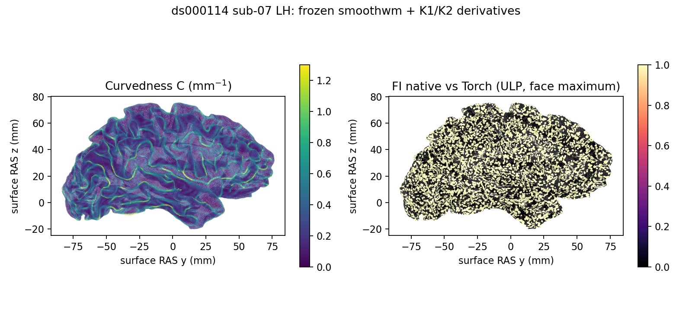

# 固定主曲率输入的 PyTorch 派生图

## 功能简介

`curvature_stats_torch.py` 将同一网格的K1/K2变成BE、C、FI、S四张
逐顶点图，并提供驻留GPU的诊断归约。复用PyTorch和nibabel，主页Conda
环境已包含这些依赖。该计算不需要模型、权重、资产或外部程序。

这里保留两个算法边界：默认`mris_curvature_stats -G`使用离散主曲率，
而已有`surface_roi_curvature_gpu`和`surface_curvature_gpu`采用连续局部
二次拟合。两者不能直接互换。本模块接收已完成的K1/K2；离散主曲率、
标记扩展、直方图和完整`curv.stats`仍由当前实现处理，生产调度未替换。
BE/C/FI/S本身不需要顶点循环、邻域搜索或CPU/GPU反复搬运。

## Python调用及输入输出

```python
import nibabel.freesurfer.io as freesurfer_io
import torch
from fnit.recon_all.curvature_stats_torch import (
    curvature_derivatives_tensor, curvature_summary_tensor, write_curvature_derivatives,
)

principal_curvature_1 = torch.as_tensor(
    freesurfer_io.read_morph_data("/data/subject/surf/lh.smoothwm.K1.crv"),
    dtype=torch.float32,                 # 一维(N,)主曲率，单位mm^-1
    device="cuda:0",                    # 指定目标GPU，不自动回退CPU
)
principal_curvature_2 = torch.as_tensor(
    freesurfer_io.read_morph_data("/data/subject/surf/lh.smoothwm.K2.crv"),
    dtype=torch.float32,                 # 与K1同网格、同顶点编号和顺序
    device="cuda:0",                    # 必须与K1在同一设备
)
derived_curvatures = curvature_derivatives_tensor(
    k1=principal_curvature_1,            # 有限FP32(N,)，保留上游K1/K2顺序
    k2=principal_curvature_2,            # 不重拟合、不排序、不改变输入
)
# 返回字典：BE、C、FI、S→同设备FP32(N,)张量。

curvature_diagnostics = curvature_summary_tensor(
    values=derived_curvatures["C"],       # FP32(N,)，这里C的单位是mm^-1
    vertex_area=vertex_areas_mm2,         # 同设备同顺序FP32(N,)，顶点面积mm^2
    ripped=excluded_vertices,            # bool(N,)；None默认包含所有点
)
# 所有返回值仍在目标设备；需要导出时再集中下载。

written_report = write_curvature_derivatives(
    k1_path="/data/subject/surf/lh.smoothwm.K1.crv",  # nibabel morph标量文件
    k2_path="/data/subject/surf/lh.smoothwm.K2.crv",  # 顶点数与K1相同
    output_prefix="/data/new/lh.smoothwm",          # 新输出路径前缀
    device="cuda:0",                               # 默认cuda:0；cpu用于诊断
    face_count=228680,                              # morph头面数；默认0，不参与计算
)
```

### 逐顶点派生图

`curvature_derivatives_tensor(k1, k2)`的两个参数必填，类型为PyTorch
FP32一维张量，shape和设备必须相同。每个元素对应原表面的同一个顶点，
没有坐标变换；输入主曲率单位mm⁻¹。

| 输出键 | 表达式 | 单位 |
|---|---|---|
| BE | K1²+K2² | mm⁻² |
| C | sqrt(0.5×BE) | mm⁻¹ |
| FI | abs(K1)×(abs(K1)−abs(K2)) | mm⁻² |
| S | (K1−K2)²，sharpness | mm⁻² |

固定源码在BE/S中使用FP32；C先求FP32平方和再以FP64求平方根；FI的
`fabs`、减法和乘法用FP64后转回FP32。这些是原表达式的数据类型，
没有启用FP16/BF16，也没有用epsilon或异常值替代。S并非shape index。
本模块不改变全局TF32/autocast；四张图只用逐点算术，TF32矩阵/卷积
开关不参与该计算。直接张量接口不扫描有限性，以免制造GPU同步；调用方
须保证有限输入。类型错误抛TypeError，shape/dtype/设备错误抛ValueError。

### 诊断摘要

`curvature_summary_tensor(values, vertex_area, ripped=None)`要求曲率图
有限、面积非负，二者为同设备FP32(N,)；可选ripped是同设备bool(N,)，
True排除该点。返回：

- `count`：纳入顶点数，int64标量；`mean/std`：FP64均值与总体标准差。
- `min/max`：FP32标量；`min_vertex/max_vertex`：首次达到极值的int64索引。
- `integrals`：FP64(4,5)，四行为natural、rectified、positive、negative；
  五列为FP32积分、顶点数、FP32面积、FP32积分/点数、FP32积分/面积。
  positive包括零；negative严格小于零。少于两点时后两列为零。

积分单位是曲率图单位×mm²，按点数归一化保留该单位，按面积归一化后
恢复曲率图单位。至少两点的分组面积为0时，源公式会产生NaN/Inf；这里
不添加epsilon改变定义。

积分项先以FP32计算曲率×面积，再用FP64归约；面积使用并行FP32归约。
官方面积采用顺序FP32累加，因此这里的诊断面积不能标成标准`curv.stats`
逐位复现。输出不逐顶点调用`bool()`或`float()`。空输入或全部排除时count
及均值/标准差/积分为0，极值NaN、索引−1。类型或设备契约错误抛异常；
有限性与非负面积由调用方保证。这一摘要本轮完成单元测试，未完成真实
标准统计文本对照。

### 文件接口与失败行为

`write_curvature_derivatives`读两张morph图，输出
`prefix.{BE,C,FI,S}.crv`，数据为FP32(N,)；morph文件不存坐标，顶点编号
沿输入。`face_count`是非负整数，仅写入文件头，不能代替网格校验。
返回`outputs`路径字典、`vertices`、`device`、读取/计算/写入耗时与总墙钟；
计算时间包含H2D/D2H，总墙钟包含读取、校验和四张文件写出。
非法面数、顶点数不符或非有限主曲率抛ValueError；I/O和CUDA失败原样
抛出，不回退CPU，部分文件不能标为完整阶段。

## 命令行

```bash
python -m fnit.recon_all.curvature_stats_torch \
  --k1 /data/subject/surf/lh.smoothwm.K1.crv \
  --k2 /data/subject/surf/lh.smoothwm.K2.crv \
  --output-prefix /data/new/lh.smoothwm \
  --device cuda:0 \
  --face-count 228680 \
  --report /data/new/lh.curvature-derivatives.json
```

`--k1/--k2/--output-prefix`必填；`--device`默认cuda:0；`--face-count`
默认0；`--report`可选，保存路径、范围和含读写计时，也打印到标准输出。
候选阶段只生成四张真实派生图，不生成占位`curv.stats`。

## 原软件调用

本计算是`mris_curvature_stats`取得主曲率后的内部步骤，没有独立原软件CLI。
当前完整参考命令为：

```bash
SUBJECTS_DIR=/data/subjects mris_curvature_stats \
  -m --writeCurvatureFiles -G \
  -o /data/subjects/subject/stats/lh.curv.stats \
  -F smoothwm subject lh curv sulc
```

命令还计算离散主曲率和完整统计，不能把本模块计时与完整命令直接相除。
生产张量和文件接口不调用该程序；冻结参考只用于独立benchmark。
`-m`是极值报告开关，不是选择连续主曲率。

## 本版真实数据精度与时间

2026-10-09，在同一H100节点、4线程、PyTorch2.5.1/CUDA11.8，复用公开
ds000114 sub-07/sub-08双侧smoothwm的冻结K1/K2和原生派生图。每半球
114,342–139,766顶点。输入、参考图、模块、脚本与原生程序SHA-256在
JSON中；原生程序本轮现场哈希为
`185b087dd9d37601f8d0ac1c9103ca690154494485fdb6ce2fb15f4bed5b7ded`。
参考程序本轮未重新运行，重复性未重测。

BE、C、S在CPU/GPU全部逐位一致；FI相对冻结原生图最多1ULP，提前固定
的该逐点算子容差是2ULP，4半球×4图全部通过。Torch CPU/GPU与保持
源float/double表达式的独立Numba公式循环四张图均逐位一致。FI的原生
尾差原因尚未进一步确定，不能归因于随机性或指定编译器。

| 半球 | FI不同顶点数 | FI最大绝对误差mm⁻² | FI P99绝对误差mm⁻² |
|---|---:|---:|---:|
| sub-07 LH | 22,305 | 9.765625e-4 | 1.192093e-7 |
| sub-07 RH | 22,496 | 7.629395e-6 | 1.192093e-7 |
| sub-08 LH | 27,614 | 3.051758e-5 | 1.192093e-7 |
| sub-08 RH | 27,787 | 7.629395e-6 | 1.192093e-7 |

下表单位ms，3轮ABBA/BAAB，共每后端6次；公式Numba列是独立逐点循环，
不是完整C++统计。GPU计时同步目标设备，驻留列不包含搬运；文件接口
包含K1/K2读取、校验、搬运和四张图写入。共享节点上的短时观察不等于
稳定吞吐。

| 半球 | Numba公式CPU | Torch CPU驻留 | Torch GPU驻留 | Torch GPU含搬运API | GPU文件接口 |
|---|---:|---:|---:|---:|---:|
| sub-07 LH | 0.175 | 1.070 | 0.185 | 0.534 | 31.46 |
| sub-07 RH | 0.477 | 0.899 | 0.426 | 0.962 | 25.11 |
| sub-08 LH | 0.351 | 1.053 | 0.281 | 0.920 | 27.84 |
| sub-08 RH | 0.308 | 0.916 | 0.239 | 0.809 | 34.13 |

GPU PyTorch峰值allocated10,622,976B、reserved31,457,280B；未测父子进程
同时占用或整例峰值。矩阵TF32开关实测False、cuDNN True；本子阶段未用
矩阵/卷积，模块未覆盖调用方精度设置。CPU/CUDA单元测试6项通过。
局部派生图可以保留GPU驻留，但它不是当前整例主要耗时；尚无完整
主曲率、curv.stats或整例提速结论，整体指标等效未判定。



图为sub-07左侧真实smoothwm的surface RAS侧投影，C显示范围截在99百分位，
FI显示每个三角面顶点的最大ULP差。该图没有空间重采样或脑区标签替换。

## 最近版本与benchmark

- 本轮新增：完整K1/K2→四派生图张量与nibabel文件接口，以及不冒充标准
  文本的GPU诊断摘要。生产离散主曲率和完整统计仍保留。
- 测试源码为`4f2d1a5d`后的候选工作树；模块SHA-256
  `9df99fa1d2e6ba7af9e3aa1a8458af4f5e88238afb84ee3d02c74d8d7da7bbbb`。
- 派生图在主页default环境实测；该服务器default当前缺少已在主页环境文件
  声明的Matplotlib，脑图使用现有`fnit_main_env`绘图，不修改冻结计算环境。
  完整安装一致性和干净隔离运行未验收。
- [完整收据与复现脚本](../../validation/recon_all/optimizations/20261009_curvature_derivatives/README.md)
  区分冻结同输入、公式回归及尚未运行的完整标准统计/原始T1整例。

## 参考文献和源码

- 固定FreeSurfer源码：
  [mris_curvature_stats](https://github.com/freesurfer/freesurfer/blob/d932c45b7941662ea380a05efef580568b98d41a/mris_curvature_stats/mris_curvature_stats.cpp)。
- [离散/连续主曲率与metric实现](https://github.com/freesurfer/freesurfer/blob/d932c45b7941662ea380a05efef580568b98d41a/utils/mrisurf_metricProperties.cpp)。
- Dale, Fischl & Sereno. Cortical surface-based analysis. I. Segmentation and
  surface reconstruction. NeuroImage 9, 179–194 (1999).
- Fischl, Sereno & Dale. Cortical surface-based analysis. II: Inflation, flattening,
  and a surface-based coordinate system. NeuroImage 9, 195–207 (1999).
