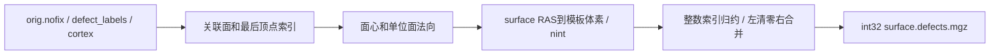

# 拓扑缺陷体积的 PyTorch 投射

## 1. 功能简介

`defects_to_volume()` 将同一有序网格的缺陷号投射到 conform 体积，不调用外部程序。
这是固定 `mri_label2vol --defects` 阶段的完整替代接口，不负责拓扑 GA 修复。
每个相关三角面在面心的法向两侧各投射一次，距离为模板 x 体素大小的五分之一。
重叠体素按原程序最后遍历的顶点覆盖，使用整数索引归约实现确定性。
左右半球仍按左侧清零、右侧合并执行。

默认 recon-all 后端保持原生。显式 `defects_backend="torch"` 使用本接口，
无需解析或执行 `mri_label2vol`；其他尚未迁移的阶段仍需要独立 Conda 构建程序。
本阶段很短，GPU 完整读写接口尚未显示提速，不能把迁移算成整例加速。



## 2. Python 调用与输入输出

```python
from fnit.recon_all.defects_label_volume_torch import defects_to_volume

projection_report = defects_to_volume(
    surface_file="/data/subject/surf/lh.orig.nofix",  # 未修复的有序三角表面，surface RAS/mm
    defect_file="/data/subject/surf/lh.defect_labels",  # 相同顶点顺序的非负整数缺陷号
    template_file="/data/subject/mri/orig.mgz",  # conform模板及其空间头信息
    output_file="/data/subject/mri/surface.defects.mgz",  # 写出的int32标签体积
    offset=1000,  # 左半球1000，右半球2000
    merge=False,  # 左侧清零；右侧用已有输出作模板并设置True
    cortex_file="/data/subject/label/lh.nofix.cortex.label",  # 同网格ASCII cortex顶点索引
    device="cuda:0",  # 明确的计算设备；CPU仅作诊断/兼容
)
```

| 参数 | 类型、格式及空间 | 默认值和含义 |
|---|---|---|
| `surface_file` | `str/Path`，FreeSurfer三角表面，坐标 `(V,3)` float32、面 `(F,3)`；必须带原体积几何 | 必填；surface RAS/mm |
| `defect_file` | `str/Path`，无扩展名morph，或 `(V,1,1)` MGH/MGZ | 必填；顶点顺序与表面一致，有限非负整数；不是体积分割 |
| `template_file` | `str/Path`，3D MGH/MGZ `(X,Y,Z)` | 必填；决定输出网格、scanner RAS和体素大小 |
| `output_file` | `str/Path`，MGH/MGZ | 必填；允许与模板同路径，先完整读取再写出 |
| `offset` | 非负 `int` | 必填；非零缺陷号加此偏移，不能溢出int32 |
| `merge` | `bool` | `False`清零模板；`True`保留未覆盖体素及旧颜色表 |
| `cortex_file` | `str/Path/None`，ASCII label | `None`不屏蔽；设置后只投射该顶点集合的缺陷 |
| `device` | `str`，`cpu`或`cuda:N` | `cuda:0`；CUDA错误抛出，不自动回退 |

返回字典包含 `device`、`seconds`（加载、搬运、计算、压缩及写出）、`output`、
`offset`、`merge` 和 `palette`。输出为模板网格的 int32 `(X,Y,Z)`，保留模板
affine、scan参数和其余MGH标签。颜色表中的标签名/编号保持；上游随机颜色换为
确定性颜色，因此文件SHA和调色板不要求一致，解码标签必须一致。
非法几何、顶点数量/索引不匹配、非整数/负标签、缺失文件和CUDA失败均抛异常。

张量内核 `project_defects()` 的输入为同设备 `vertices:(V,3) float32`、
`faces:(F,3) int64`、`defects:(V,) integer`、`template:(X,Y,Z)`、
`ras_to_voxel:(4,4) float32`；另有 `offset`、`voxel_size_x:mm`、
`merge=False`、`cortex:(V,) bool/None`。返回新的连续 int32 体积，不修改输入。
变换是 **surface RAS到模板体素**，不能传入scanner RAS affine。
面心使用float64、其余几何float32，保留原源码求和/舍入规则；不启用半精度。
本算子使用有序分量乘法，不涉及TF32矩阵乘法，不更改调用方全局精度策略。

内部颜色表读写、单位法向和MGH尾部解析属于该接口内部步骤，没有独立官方CLI。
recon-all 单例、批量API及CLI的 `defects_backend` 默认 `native`，另可选 `torch`。
其作用仅覆盖此阶段，完整参数及输出结构仍见 [recon-all说明](README.md)。

## 3. 命令行

```bash
python -m fnit.recon_all.defects_label_volume_torch \
  --surface /data/subject/surf/lh.orig.nofix \
  --defects /data/subject/surf/lh.defect_labels \
  --template /data/subject/mri/orig.mgz \
  --output /data/subject/mri/surface.defects.mgz \
  --offset 1000 \
  --cortex /data/subject/label/lh.nofix.cortex.label \
  --device cuda:0
```

各具名选项对应上表；右侧输入改为 `rh`，模板改为左侧输出，偏移改为2000并加
`--merge`。完整pipeline新增 `--defects-backend torch`，半球并行模式仍在父进程
依次投射，避免共享体积覆盖。

## 4. 对应原软件

仅在独立参考/benchmark路径执行：

```bash
mri_label2vol --defects lh.orig.nofix lh.defect_labels orig.mgz \
  1000 0 surface.defects.mgz lh.nofix.cortex.label
mri_label2vol --defects rh.orig.nofix rh.defect_labels surface.defects.mgz \
  2000 1 surface.defects.mgz rh.nofix.cortex.label
```

分别是surface、defect overlay、模板、标签偏移、merge开关、输出和cortex label。
固定源码版本为 `d932c45b7941662ea380a05efef580568b98d41a`。

## 5. 当前真实数据验证

同一计算节点H100、PyTorch2.5.1/CUDA11.8、4线程。输入、程序和实际模块SHA见
[机器可读报告](../../validation/recon_all/optimizations/20261009_defects_torch/README.md)。

| 实测范围 | 原生完整双侧API | PyTorch CPU | PyTorch CUDA | 精度 |
|---|---:|---:|---:|---|
| sub01 CPU回归 | 2.615 s | 2.794 s | 未测该次 | 0不同体素、Dice1、几何/dtype一致 |
| sub01原生/CPU/GPU配对 | 2.628 s | 3.021 s | 2.761 s | 两次CUDA与两次原生均0不同体素 |
| sub07原生/CPU/GPU配对 | 3.411 s | 3.293 s | 3.190 s | 全部解码标签、逐值Dice、几何/dtype一致 |

表中为同输入读写API的两次中位数，包含加载、传输、压缩、写出；新进程首次
CUDA context初始化和输入哈希校验单列，不包含在热API数字内。GPU比原生约慢5%，
不得据此声称整例提速。allocated峰294,460,416字节，reserved峰360,710,144字节；
该组未采样整个进程GPU占用，不能用两者代替实际全流程峰值。
sub07本次GPU比原生快6.47%，但单例两次配对与sub01结果方向不同，仍为显式后端。
sub07主进程及同期子进程目标GPU峰值采样912,261,120字节；计划采样间隔0.1秒，
实际最大间隔3.034秒，无失败采样，因此不能保证捕获连续峰值。
该次allocated峰295,558,144字节、reserved峰360,710,144字节，CUDA初始化
1.035秒另计。监测线程在主线程完成CUDA初始化后启动，不作为OOM原因已解决的证据。
当前官方/Conda程序重复运行的解码体素相同，MGZ SHA因随机颜色/命令元数据不同。
严格文件复现、优化无退化、整体指标等效分别报告；整体指标等效仍未判定。

本次修复新接口的90字节MGH字段块/284字节数据起点混淆，以及Fortran布局写回、
大端表面输入和无扩展名overlay读取。CPU规则与文件回归6项通过；后续新进程
GPU单测首次极小分配出现OOM，未计为通过。此前完整CUDA真实输入配对通过，
两者日志均保留，未把初始化失败解释为体素算法误差。
原始T1空目录control/candidate整例配对已启动，结果尚未完成；10例该阶段回归、
独立无预装软件环境尚未完成。

## 6. 更新与复现

2026-10-09新增完整投射、确定性覆盖与双侧累积、MGH标签保留、显式pipeline后端。
没有删除仍承担参考和默认功能的原生入口。没有新增运行依赖，主页Conda已包含
PyTorch、NumPy、nibabel；干净环境安装验证尚未执行。
复现脚本为 `tools/benchmark_recon_defects_torch.py`，参数及各版本失败记录见报告目录。

## 7. 源码与参考

- [mri_label2vol固定源码](https://github.com/freesurfer/freesurfer/blob/d932c45b7941662ea380a05efef580568b98d41a/mri_label2vol/mri_label2vol.cpp)
- [MRISdefects2Seg固定源码](https://github.com/freesurfer/freesurfer/blob/d932c45b7941662ea380a05efef580568b98d41a/utils/mrisurf_defect.cpp)
- [FreeSurfer代码库](https://github.com/freesurfer/freesurfer)
- Fischl B. FreeSurfer. *NeuroImage* 62:774–781, 2012.
