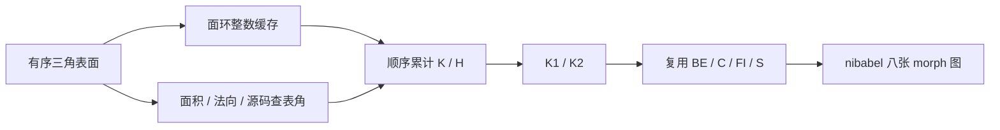
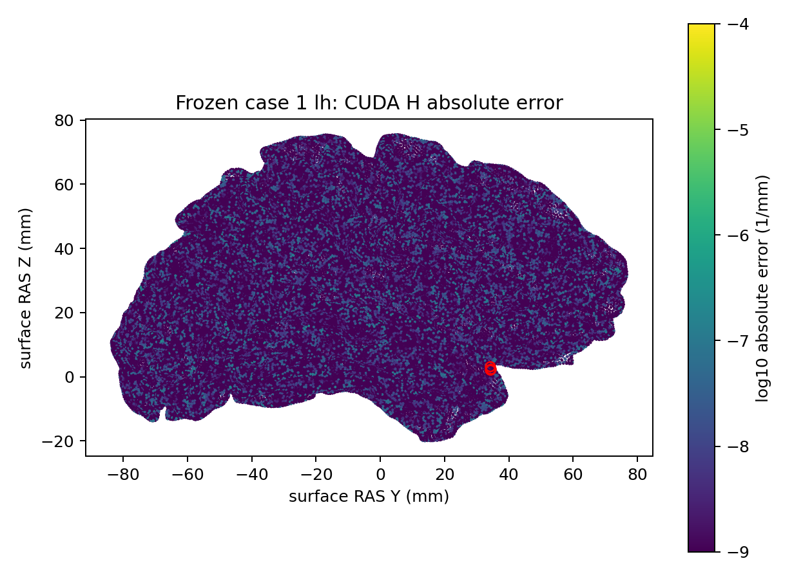

# PyTorch 离散曲率：同网格八张原始顶点图

## 1. 功能简介

`discrete_curvature_torch.py` 实现固定源码的有序面环、离散 K/H、主曲率
K1/K2，并复用已有 `curvature_derivatives_tensor` 生成 BE/C/FI/S。
整数拓扑只准备一次；坐标、面法向、面积和曲率在指定 PyTorch 设备计算。
它是显式实验接口，尚未替换完整 `mris_curvature_stats`，也不写占位统计文件。



## 2. Python 调用及输入输出

```python
from fnit.recon_all.discrete_curvature_torch import write_discrete_curvature

report = write_discrete_curvature(
    surface_file="/data/subject/surf/lh.smoothwm",  # 有序闭合三角表面，surface RAS/mm
    output_prefix="/data/diagnosis/lh.smoothwm",  # 输出文件前缀，不覆盖生产输入
    device="cuda:0",  # 明确目标GPU；CPU也可用于同输入排错
    signed_principals=False,  # 保留固定命令默认的绝对值主曲率排序
)
```

| 接口/参数 | 类型、默认值 | 含义 |
|---|---|---|
| `surface_file` | 必填 `str/Path` | nibabel 可读三角网格；原有顶点顺序和 surface RAS/mm 保留 |
| `output_prefix` | 必填 `str/Path` | 输出 `PREFIX.{K,H,K1,K2,BE,C,FI,S}.crv`；父目录自动创建 |
| `device` | `str='cuda:0'` | 指定 PyTorch 设备；不自动回退 CPU |
| `signed_principals` | `bool=False` | False 按绝对值排序，True 按带符号值排序；保留源码相等时的选择 |

返回字典：`outputs` 为图名到文件路径的映射；`vertices` 为 N；`device`、
`signed_principals` 为实际设置；`seconds` 包含读入、拓扑准备、传输、计算和写出；
`delta_violations` 为源码 `H²-K<0` 分支的顶点数；`scope` 明确不是完整统计命令。
每张 morph 为同序 FP32(N,)；K、BE、FI、S 为 mm⁻²，H/K1/K2/C 为 mm⁻¹。

驻留计算可直接使用以下两个接口：

- `DiscreteCurvatureTopology(faces=..., nvertices=..., device='cuda:0')`：
  `faces` 为整数(F,3)，`nvertices` 为正整数 N，建立只属于该有序拓扑的整数缓存。
  换拓扑必须新建；不缓存旧坐标、法向或曲率。
- `context.evaluate(vertices=..., signed_principals=False)`：`vertices` 必须为缓存设备上
  的有限 FP32(N,3)、surface RAS/mm；返回同设备 K/H/K1/K2，及 `face_area`(F,)、
  `face_normal`(F,3)、`face_angles`(F,3)、`delta_negative`(N,) 张量。
  面积 mm²，法向无单位，角度弧度。调用者负责计时同步和传输。

计算保留 FP32 有序累计及源码规定的 double sqrt/最终表达式；不关闭 TF32，
不启用半精度，也不改变网格或截断小面积。非法 dtype/shape、非有限坐标、
孤立/边界/不闭环网格、退化面或未覆盖的 marked 顶点分支会抛异常。
此接口不执行平滑、归一化、皮层掩膜过滤、直方图和标准 `curv.stats` 输出。

## 3. 命令行

```bash
python -m fnit.recon_all.discrete_curvature_torch \
  --surface /data/subject/surf/lh.smoothwm \
  --output-prefix /data/diagnosis/lh.smoothwm \
  --device cuda:0
```

`--signed-principals` 可显式启用带符号排序，默认关闭。完整同输入脚本为
`tools/benchmark_recon_discrete_curvature.py`：`--subject` 指定一个或多个冻结被试目录，
`--output` 必须不存在，`--reference-program` 指定独立参考程序，`--assets` 指定参考资产，
`--device` 默认 cuda:0，`--threads` 默认 4，`--code-version` 必须填写实际版本。

## 4. 原软件对应关系

固定源码 `MRIScomputeSecondFundamentalFormDiscrete`、`MRIS_discreteKH_compute`
和 `MRIS_discretek1k2_compute` 属于原命令内部步骤，没有独立 CLI。
本次参考命令在隔离的诊断被试副本执行：

```bash
mris_curvature_stats -m --writeCurvatureFiles -G \
  -o /data/reference/stats/lh.curv.stats -F smoothwm reference_subject lh curv sulc
```

该原生命令还计算统计和其他图，工作范围大于候选八图 API；不能用两者时间相除
宣称完整 `curv.stats` 提速。参考输入/程序、每张图和候选源码 SHA 见机器报告。

## 5. 最新真实数据结果

2026-10-09，gpucw1、H100、PyTorch 2.5.1、4线程、FP32、TF32启用。
冻结 ds000114 sub-07/sub-08 双侧 smoothwm，完整 API 按 CPU/GPU/GPU/CPU 运行，
时间含拓扑、H2D、D2H、文件读写；GPU 前后同步。参考八图重复两次全部数值一致。

| 冻结输入 | CPU API中位数 | GPU API中位数 | K 图 | GPU H 最大绝对误差 |
|---|---:|---:|---|---:|
| sub-07 LH | 0.827 s | 0.224 s | 逐位一致 | 6.10352×10⁻⁵ mm⁻¹ |
| sub-07 RH | 0.643 s | 0.172 s | 逐位一致 | 4.76837×10⁻⁷ mm⁻¹ |
| sub-08 LH | 0.821 s | 0.236 s | 逐位一致 | 1.90735×10⁻⁶ mm⁻¹ |
| sub-08 RH | 0.804 s | 0.239 s | 逐位一致 | 9.53674×10⁻⁷ mm⁻¹ |

八图 P99 绝对误差均不超过 5.96×10⁻⁷。预先写入报告的探索门
max≤10⁻⁵、P99≤10⁻⁶ **未全部通过**，没有按结果修改门槛；整体指标等效未判定。
PyTorch allocated 峰值 311,970,304 字节；本阶段完整进程显存未测，不能以此代替
进程占用或整例显存。原生完整命令约 1.95–2.78 秒，范围不同，单列记录。

误差定位：sub-07 LH 最大 H 绝对误差在 lateralorbitofrontal 顶点 82887，
参考 -607.379333、GPU -607.379395，只有 **1 ULP**，相邻面面积和约
0.000718 mm²；同点 BE 的 0.375 差异为 3 ULP，参考值约 1.42×10⁶。
不能只看绝对最大值，也不能由此省略该点或宣布局部网格质量通过。
另外少量接近零的量有较大的 ULP 数，完整分布和坐标均保留。

在 headcw 的另一次 **CPU数学来源隔离**中，仅将 Torch CPU `acos`
换为系统 `acosf` 后重建 H，四半球与原生参考 H 完全相同；其余坐标、面法向、
符号、边长和累计规则保持。该结果定位了 CPU 尾差的来源。
GPU 尚未完成相同中间量隔离，不能将其差异一概归因随机性。
生产 CUDA 没有采用 CPU `acosf` 回退。



[完整四半球回归](../../validation/recon_all/optimizations/20261009_discrete_curvature/report_v2.json)、
[空间/ULP报告](../../validation/recon_all/optimizations/20261009_discrete_curvature/diagnostics/report.json)、
[CPU acos隔离](../../validation/recon_all/optimizations/20261009_discrete_curvature/diagnostics/acos_cpu_v2.json)。

## 6. 更新和验证记录

- v1 真实不同度数网格暴露无效 padding 槽索引越界；v2 只给无效槽安全索引，
  有效面仍按源码环顺序检查。保留失败报告，不修补特定顶点。
- 5项 CPU 拓扑、方向、缩放和失败契约测试通过；真实 GPU 四半球八图运行完成。
- CPU acos隔离的首版位图统计未统一 nibabel 大端 dtype；第二版统一字节序后重测，
  首版报告明确保留为诊断错误，数值输出未变。
- 没有新增依赖。PyTorch、NumPy、Numba、nibabel、matplotlib 已列入主页 Conda 环境。
  全新安装及无预装脑影像软件的隔离整例尚未验证。

## 7. 参考文献与源码

- [FNIT 离散实现](../../src/fnit/recon_all/discrete_curvature_torch.py)
- [FreeSurfer固定源码及离散曲率内部函数](https://github.com/freesurfer/freesurfer/blob/d932c45b7941662ea380a05efef580568b98d41a/utils/mrisurf_metricProperties.cpp)
- Fischl B. FreeSurfer. *NeuroImage* 62:774–781, 2012.
