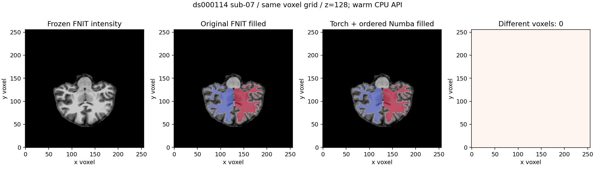

# filled：Torch 边界初始化与有序距离传播

## 1. 功能与流程

recon-all 的 `mri_fill` 阶段已有完整 FNIT Python/NumPy/Numba 实现。
本轮复用该实现，优化 CC 外部距离计算：Torch 批量生成全部边界种子，
以整数首次访问键恢复原 z/y/x 扫描顺序；Numba 编译已有有序堆和
eikonal 更新。距离传播保留 CPU 顺序反馈、同分堆次序、停止规则和
float32 舍入。边界可指定 CPU/CUDA；堆传播为单线程 CPU。


默认后端仍为原 Python。新增路径是显式性能选项，不调用原生程序，
不改变其余填充步骤。TF32 保持调用者的策略；边界只使用 bool、int64
和 float32 常数，不启用 FP16/BF16。Numba `fastmath=False`。

## 2. Python 调用、输入与输出

```python
from fnit.recon_all.fill_cutting_plane_python import fill_mgz

cc_phase_profiles = []  # 收集两侧距离初始化、传播及输出组装时间
cc_seed_voxel = fill_mgz(
    wm_file="subject/mri/wm.mgz",                  # 三维 uint8 WM，个体 conformed 网格
    aseg_file="subject/mri/aseg.presurf.mgz",      # 同网格整数语义分割，含 CC 251..255
    lta_file="subject/mri/transforms/talairach.lta",  # type 0 voxel-to-Talairach 变换
    colortable_file="assets/SubCorticalMassLUT.txt", # 已声明的原配方颜色表
    output_file="candidate/filled.mgz",            # 新 uint8 文件，0/127/255
    cut_log_file="candidate/ponscc.cut.log",       # CC 体素及 Talairach mm 坐标
    cc_boundary_backend="torch",                   # 默认 python；复用 Torch 完整边界初始化
    cc_marching_backend="numba",                   # 默认 python；编译同序 CPU 堆传播
    device="cuda:1",                               # 默认 cpu；明确边界计算设备
    cc_profiles=cc_phase_profiles,                  # 默认 None；追加两侧分段报告
)
```

`wm_file`、`aseg_file` 必须是同三维 shape 与毫米 affine；不进行重采样，
坐标为 `(x,y,z)` 体素索引。WM 强度使用 uint8。LTA、LUT、文件头与
颜色表沿用既有固定配方。输出保持 WM 网格，0=背景、127=右半球、
255=左半球；返回 `(x,y,z)` CC 种子整数三元组。日志使用 Talairach
毫米坐标。输出目录自动建立；非法后端、网格或变换抛 `ValueError`，
读取、写出、CUDA 异常原样传播，不自动切回 CPU。

`fill_aseg_python.fill_with_aseg(wm, aseg, voxel_xsize=1.0,
cc_cut_mask=None, *, cc_boundary_backend="python", device="cpu",
cc_marching_backend="python")` 提供数组接口。`wm` 为三维 uint8，
`aseg` 为同网格整数语义数组；`voxel_xsize` 单位 mm，用于编辑投票
范围；可选 `cc_cut_mask` 为同 shape bool 切割图。返回新 uint8 标签，
不修改输入。完整文件 API 还执行 LTA 相关切割及写出。

内部 `initialize_cc_boundary_torch(target)` 接受非空三维 bool 张量，
保留输入设备与局部裁切网格，返回三项：同 shape/device 的 float32
距离（目标 0、边界 0.5、远场 100），uint8 状态（3 forbidden、
2 alive、0 far），以及 N×3 int64 首次访问次序的局部体素坐标。
它不修改输入；维度、dtype、空图像、整数键溢出会报错。

内部 `march_cc_distance_numba(distance, state, alive, query)` 接收上述
CPU NumPy 数组和同 shape bool CC 查询，原地更新距离/状态并返回未
确定查询数；alive/query 不修改。初始 trial 仅更新 far，传播可更新
trial；全部 CC 决定后停止。首次 JIT 与暖调用分别记录。

`_cc_outside_distance(seg, cc, label, *, boundary_backend="python",
device="cpu", marching_backend="python", profile=None)` 返回原网格
float32 体素距离；label 为 2/41，裁切规则保留。`_replace_cc_with_wm`
同样提供三个后端参数及可选 `profiles` 列表，返回新 int32 分割；CC
同距时选右规则不变。无 CC 返回副本，缺失必需目标标签沿用报错。
Numba 报告中的 `heap_eikonal_seconds` 包含 trial 初始化，不能与
父阶段或其他嵌套时间重复相加。

## 3. 命令行与复现

```bash
# 完整文件 API；明确传入两个独立后端，不修改生产默认。
PYTHONPATH=src python -m fnit.recon_all.fill_cutting_plane_python \
  subject/mri/wm.mgz subject/mri/aseg.presurf.mgz \
  subject/mri/transforms/talairach.lta assets/SubCorticalMassLUT.txt \
  candidate/filled.mgz --cut-log candidate/ponscc.cut.log \
  --cc-boundary-backend torch --cc-marching-backend numba --device cuda:1
```

`benchmark/profile_recon_fill.py` 剖析完整文件 API，包含读写、传输与
输出压缩；`--mri-dir` 指冻结候选输入，`--reference-filled` 只供比较，
不传入算法。`--colortable`、`--output-dir`、`--code-commit` 必填；
目录须不存在。`--threads=4`，`--boundary-backend=python`、
`--marching-backend=python`、`--device=cpu` 是默认值。可选
`--module-dir` 只加载独立本轮 recon 模块，其他包只读冻结源码。
CUDA 剖析显式同步目标设备，采样该进程 UUID/PID 占用，记录
allocated/reserved；生产函数不增加整阶段同步。计时不含解释器、
顶层导入和 CUDA 上下文初始化，不能当作冷进程或整例时间。

`benchmark/recon_fill_distance_regression.py` 比较两侧完整距离场，
输入 `--aseg`，输出 JSON `--output`，参数 `--threads`、`--device`、
`--code-commit` 与剖析相同。它检查全部场元素和 CC 查询、左右选择。
源码、输入、程序版本均通过 SHA 绑定。

## 4. 对应原软件

固定单 T1 配方的完整参考命令：

```bash
mri_fill -a ponscc.cut.log -xform talairach.lta \
  -segmentation aseg.presurf.mgz -ctab SubCorticalMassLUT.txt wm.mgz filled.mgz
```

`-a` 写切割日志。边界初始化与有序 fast marching 是此命令内部步骤，
没有独立官方 CLI。本轮读取固定提交源码核对调用顺序；原软件仅在
独立 benchmark 生成参考。生产候选只读取 WM、aseg、LTA 和 LUT。

## 5. 真实数据精度与耗时

2026-10-09，同一 CPU 节点 Xeon Gold 6418H、四线程预算，使用
OpenNeuro ds000114 sub-07/sub-06 的已授权 CC0 冻结自产前段。
输入原始公开 T1 的 SHA、冻结阶段输入 SHA、执行模块 SHA 见报告。
这里比较当前原 Python 与优化路径，并核对既有 FNIT 冻结 filled。
新的同环境原生参考、GPU 完整 API 及原始 T1 整例结果另行记录。

| 完整文件 API / 配对各两次 | 旧 Python 中位秒 | Torch CPU 边界＋Numba 中位秒 | 相对旧实现 | 不同体素 / 标签 Dice |
| --- | ---: | ---: | ---: | --- |
| sub-07 | 36.8056 | 7.7177 | 4.77× | 0 / 0、127、255 均 1 |
| sub-06 | 38.7433 | 8.5171 | 4.55× | 0 / 均 1 |

八个完整输出最大/P99误差为 0，shape、uint8 和 affine 相同。两例
两侧的四个完整 CC 距离场逐位一致，CC 左右选择差异为 0。首次新
signature JIT 的 sub-07 完整 API 为 10.5965 秒，单列于暖配对。
sub-07 旧实现两次为 33.20/40.41 秒，共享 CPU 负载波动保留，不称
稳定吞吐。这些 CPU 测量不与此前另一主机的 53.16 秒直接求速度比。

仅替换 Torch CPU 边界而仍使用 Python 堆的独立 ABBA 为 sub-07
33.9457→25.8181 秒、sub-06 39.2865→29.9735 秒，也均逐体素一致。
它证明边界扫描可独立替换；完整更大收益来自编译实际主要瓶颈。

GPU 完整 API 显存、A100 新同主机原生比较及整例提速尚未完成。
本轮报告分别保留严格复现、优化退化和整体等效；整体等效仍为
`not_assessed`，不以局部结果替代整例验收。

完整记录：[机器可读报告与复现](../../validation/recon_all/optimizations/20261009_fill_boundary_torch/README.md)。

公开 sub-07 的同网格 z=128 体素切片如下。红/蓝为左/右 filled 标签，
最右栏是全体积零差异的切片；输入、候选、图片及脚本 SHA 均在旁附
JSON。`benchmark/plot_fill_boundary_torch.py` 的 `--source` 为强度，
`--reference`/`--candidate` 为 0/127/255 标签，`--output` 为新 PNG，
`--case-label` 为公开标题；`--slice-z=128` 为默认体素索引。它检查
uint8、网格、标签及范围，无坐标变换。



## 6. 更新与 benchmark 记录

2026-10-09：先剖析旧流程，两侧 Python 边界扫描共约 7–9 秒、
有序传播约 17–21 秒；接入整数 first-visit Torch 算子，再编译传播。
原 Python 路径保留作诊断；默认不变，无新增安装依赖。

早期编译候选在真实 sub-07/sub-06 改变 30/16 个 filled 体素。
标量 eikonal 同输入诊断及边界算子均一致，首差位于初始 trial：
嵌套 `update_neighbors(initial=True/False)` 的内联合并破坏了初始
far-only 更新规则。将两种循环显式分开后，真实初始化的距离、
状态和有序堆恢复一致，随后完整距离场及文件 API 回归通过。
Numba `float(np.float32)` 与 Python 的提升区别也通过显式 float64
平方根/解计算消除，最终按原步骤转 float32。失败报告保留，未用于
生产。回归新增不规则多次边界访问，模拟测试只验证算子语义。

## 7. 原代码与参考文献

- [固定 mri_fill 配方](https://github.com/freesurfer/freesurfer/blob/d932c45b7941662ea380a05efef580568b98d41a/mri_fill/mri_fill.cpp)
- [固定 fast marching 初始化及有序传播](https://github.com/freesurfer/freesurfer/blob/d932c45b7941662ea380a05efef580568b98d41a/include/fastmarching.h)
- [MRIDistanceMap 调用](https://github.com/freesurfer/freesurfer/blob/d932c45b7941662ea380a05efef580568b98d41a/utils/mri_fastmarching.cpp)
- Dale AM, Fischl B, Sereno MI. Cortical surface-based analysis. I. Segmentation and surface reconstruction. NeuroImage 1999;9:179–194.
- Sethian JA. A fast marching level set method for monotonically advancing fronts. PNAS 1996;93:1591–1595.
