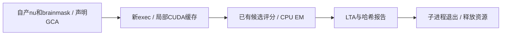

# GCA Torch注册的局部缓存与阶段隔离

## 1. 功能简介

`gca_torch_worker`复用已有GCA likelihood评分和Python注册优化器，在新exec
进程内启用CUDA分配缓存。子进程结束后释放其CUDA资源，父进程继续使用原有
allocator与精度；不全局删除recon-all低显存措施，不调用原生程序或读取参考。
这改变执行位置和临时缓冲复用，不改变候选网格、顺序、目标函数、EM或LTA。
已有Python EM与原生完整EM的差异仍单独记录，不能称官方等价注册。



## 2. Python调用、全部输入输出

```python
from pathlib import Path
from fnit.recon_all.gca_torch_worker import run_isolated_registration

registration_report = run_isolated_registration(
    nu_path=Path('/data/subject/mri/nu.mgz'),  # 自产3D强度图，conform网格
    mask_path=Path('/data/subject/mri/brainmask.mgz'),  # 同shape/affine的脑掩膜
    atlas_path=Path('/assets/average/RB_all_2020-01-02.gca'),  # 固定GCA资产
    output_path=Path('/results/new/talairach.lta'),  # 新voxel LTA文件
    report_path=Path('/results/new/gca.json'),  # 新机器可读阶段报告
    device='cuda:0',  # 明确逻辑GPU，继承CUDA_VISIBLE_DEVICES映射
    threads=4,  # 新进程Torch/OpenMP/BLAS/Numba线程预算
    candidate_chunk=1024,  # 完整候选分块，不删候选或改变同分顺序
    inverse_backend='torch',  # 同VNL余子式顺序的批量求逆
    code_version='ACTUAL_COMMIT_AND_SOURCE_SHA',  # 绑定实际冻结版本
)
```

| 参数 | 默认值 | 格式、空间与限制 |
|---|---|---|
| `nu_path` | 必填 | nibabel可读3D强度图；源conform voxel网格 |
| `mask_path` | 必填 | 同shape/affine脑掩膜；不传入诊断交叉参考 |
| `atlas_path` | 必填 | 固定、已声明的GCA文件；空间由资产头定义 |
| `output_path` | 必填 | 不存在的LTA路径；源voxel→图谱voxel，type=0 |
| `report_path` | 必填 | 不存在的JSON路径；父目录自动创建 |
| `device` | 父API必填；worker `cuda:0` | 必须CUDA，不静默回退CPU |
| `threads` | `4` | 正整数子进程预算，不修改父线程或环境 |
| `candidate_chunk` | `1024` | 正整数；仅评分分块，较大块增加临时显存 |
| `inverse_backend` | `torch` | cpu保留逐候选求逆；torch同公式批量求逆 |
| `code_version` | 父API `FNIT-source-hashes`；worker必填 | 版本标签；报告另记录输入及模块SHA |

输出为4×4 LTA与双方几何、JSON兼容字典。字典含`matrix`（优化器未序列化矩阵）、
`timing`（prepare/translation/linear/EM/write/total秒）、评分调用及候选数、
输入/源码SHA、实际TF32/autocast、线程、逻辑设备和PyTorch allocated/reserved字节。
`isolated_cli_wall_seconds`包含子进程导入、哈希、CUDA初始化、加载、传输、计算、
写出及退出。矩阵条目混合缩放与voxel平移；不能将最大条目差称作表面mm误差。
实际LTA严格比较须比较两边同样序列化后的矩阵，不能混比API原矩阵和舍入文件。

`run_worker`参数相同，仅能在未初始化CUDA的新进程直接调用；
`run_isolated_registration`允许已初始化CUDA的父API，通过exec启动worker。
默认TF32及原算法FP32/FP64例外，无FP16/BF16。输出已存在或参数非法报错；
子程序失败传播`CalledProcessError`，不回退、不补输出，部分文件不表示成功。

## 3. 命令行

```bash
python -m fnit.recon_all.gca_torch_worker \
  --nu /data/subject/mri/nu.mgz \
  --mask /data/subject/mri/brainmask.mgz \
  --atlas /assets/average/RB_all_2020-01-02.gca \
  --output /results/new/talairach.lta \
  --report /results/new/gca.json \
  --device cuda:0 --threads 4 --candidate-chunk 1024 \
  --inverse-backend torch --code-version ACTUAL_TESTED_COMMIT
```

参数对应上表。recon-all候选可显式选择`--gca-execution isolated`、
`--gca-inverse-backend torch`和`--gca-candidate-chunk 1024`；默认仍为
`in-process/cpu/64`。独立原生GCA选择不能忽略这些参数，组合非法提前报错。

## 4. 原软件命令

独立参考环境的固定阶段为：

```bash
mri_em_register -uns 3 -mask brainmask.mgz nu.mgz RB_all_2020-01-02.gca talairach.lta
```

exec隔离本身是FNIT执行策略，没有独立官方算法命令；没有把NCC/SSD替代GCA目标。

## 5. 本轮真实数据与计时范围

两例公开ds000114冻结自产nu/brainmask已完成，PyTorch2.5.1、同A100节点、
四线程、同一GPU4配对未初始化父进程与已初始化CUDA父API。四次最终序列化LTA
均与已有Torch完整注册精确一致，父缓存环境与TF32策略保持；已初始化父4MB
张量未改变，未初始化父进程保持未初始化。输入和候选程序/模块SHA见
[完整JSON及发布清单](../../validation/recon_all/optimizations/20261009_gca_isolated_cache/README.md)。

| 冻结同输入完整注册 | sub-06秒 | sub-07秒 |
|---|---:|---:|
| 缓存隔离，未初始化父进程API，含注册读写 | 30.585 | 32.960 |
| 缓存隔离，已初始化父CUDA API，含注册读写 | 29.384 | 29.695 |
| 未初始化父进程：含子导入与退出的墙钟 | 35.010 | 41.538 |
| 已初始化父CUDA：含子导入与退出的墙钟 | 33.521 | 34.669 |

评分完整覆盖sub-06的1,522,017候选；两例allocated219,581,440字节，
reserved257,949,696字节。目标整卡采样上界未初始化父进程约0.781GB、
已初始化父API约1.304GB，包括驱动和其他作业，是本阶段采样范围，非整例保证。
计划间隔0.25秒，实际最大1.18–2.40秒；进程归属仍未知。

本轮完整生产缓存关闭配对在GPU3另一个负载窗口：sub-06旧Torch中位数
1388.069秒，批量求逆1024块471.500秒，独立Conda原生120.665秒；三者各两次，
旧新LTA精确、各自重复稳定，原生重复也稳定。新局部缓存CPU/GPU机制更适合
评分中的大量临时张量，但GPU4隔离约30秒与上述GPU3数值不能直接用来宣布
稳定倍数或整例加速。sub-07缓存开启的旧64块/CPU求逆完整注册76.795秒；
原生两次121.401/124.269秒且矩阵稳定，新矩阵与旧Torch及原生均精确。
sub-06则保留旧Torch与原生最大矩阵条目差10.5664348602，非本次新增差异；
双方type=0和几何相同。这不是表面距离，需下游指标评价。整体指标等效未判定。

初版比较器混比未序列化API矩阵和LTA，显示3.55e-15差。第二版统一比较实际LTA
文件并保留原型记录，算法/阈值不变。四次原始报告也分别保留API→写出舍入差。
全进程显存因宿主/容器PID映射未知标null；整卡占用含其他作业。
allocated/reserved不是全进程占用，不据此宣布20GB验收通过。当前环境来自
既有Conda副本，不是全新主页安装或无预装软件隔离整例验收。无新增依赖。
GCA是内部配准阶段，不直接产生新的脑区指标或脑图；整例叠加图随完整运行报告。

公开收据使用`tools/export_recon_gca_receipts.py --input-dir /private/reports \
--output-dir /public/new_receipts --private-root /private/FNIT \
--private-host PRIVATE_HOST --host-alias A100-8`生成。input-dir仅含JSON报告，
output-dir须不存在；private-root/private-host替换为角色名，不改变原文件。
返回发布JSON与raw/public SHA清单，逐项核对数值、布尔和null叶子未变；失败抛异常。

复现脚本`tools/benchmark_recon_gca_allocator.py`的`--reference-report`只用于
诊断比较且核对nu/mask/atlas SHA，绝不传给生产worker；输出完整JSON、
LTA、子报告、父精度/缓存保持及0.25秒目标GPU父子进程同期采样。
参考报告须含旧Torch/Conda实际完整阶段矩阵。`--parent-cuda`选择
uninitialized/initialized，后者保留父4MB张量并检查未变。
`--physical-gpu-uuid`为已核对的目标UUID，`--code-version`为实际版本；
其余路径、GPU、线程、分块参数同上。benchmark自身导入另由外层冷CLI计时。

## 6. 更新与benchmark记录

2026-10-09增加独立exec中的缓存复用、输入/源码绑定、完整评分计数与CLI/API
验证；修正API矩阵与写出矩阵混比较。默认allocator和已有原生/EM边界未改变。
已有N4/WM/fill/inflate证据分别在各自功能页；阶段之间不能累加推算整例。

## 7. 原代码与参考

- [FNIT](https://github.com/weikanggong1/Fudan-Neuroimaging-toolkit)
- [固定mri_em_register源码](https://github.com/freesurfer/freesurfer/tree/d932c45b7941662ea380a05efef580568b98d41a/mri_em_register)
- [原矩阵算法](https://github.com/freesurfer/freesurfer/blob/d932c45b7941662ea380a05efef580568b98d41a/utils/matrix.cpp)
- Fischl B. FreeSurfer. *NeuroImage* 62:774–781, 2012。
