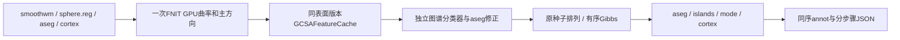

# GCSA注释：共享GPU特征、输入版本检查与有序Gibbs候选

## 1．功能简介

`label_surface()` 对同一半球的smoothwm、sphere.reg、aseg.presurf和cortex
执行固定GCS图谱分类，输出同顶点顺序的`.annot`。成熟FNIT PyTorch函数
一次准备五次平均曲率和主方向，`GCSAFeatureCache`将几何、邻接、体素分割
及sphere-to-ico映射共享给DK、Destrieux和DKT；图谱分类器、标签、有序
Gibbs、islands和写出仍独立。不要重复把已存在的几何共享当作新优化。



**成熟子函数bug修复：**旧缓存构造时记录了四个输入文件的路径、大小和
纳秒mtime，`validate()`却只检查被试、半球和设备。现在复用原`_file_version`
复核四文件，更新、删除或符号链接目标改变后拒绝旧缓存，调用者须重建。
不跨white.preaparc相关smoothwm和其他表面版本复用。检查是worker内
轻量版本身份，不是内容SHA；真实验证另外记录每个输入的SHA-256。

显式`gibbs_backend="numba"`候选只将稀疏表评分和单轮有序CPU更新编译，
GPU特征继续复用。默认仍`python`；不以Jacobi、近似邻域或降低精度替换
逐顶点反馈。该候选不是纯GPU，也未默认接入recon-all。

## 2．Python调用、输入输出和参数

```python
from pathlib import Path
from fnit.recon_all.gcsa_label_python import GCSAFeatureCache, label_surface

subject_directory = Path("runs/subject")  # FNIT自产surf/label/mri目录
feature_cache = GCSAFeatureCache(
    subject=subject_directory,  # 同一个被试目录
    hemi="lh",  # lh或rh，各半球分别建立缓存
    device="cuda:1",  # 显式目标GPU；CPU诊断可以写cpu
)
annotation_report = label_surface(
    subject=subject_directory,  # 自产输入，生产不读取官方参考
    hemi="lh",  # 必须与缓存半球相同
    atlas_file=Path("resources/average/lh.DKaparc.atlas.acfb40.noaparc.i12.2016-08-02.gcs"),  # 固定图谱
    ico4_file=Path("resources/lib/bem/ic4.tri"),  # 分类器节点模板
    ico7_file=Path("resources/lib/bem/ic7.tri"),  # 先验节点模板
    output_file=Path("runs/subject/label/lh.aparc.annot"),  # v2颜色表注释文件
    device="cuda:1",  # 默认cpu；GPU特征float32，保持TF32策略
    prepared=feature_cache,  # 默认None；不传时独立建立本次几何缓存
    gibbs_backend="numba",  # 默认python；显式有序Numba候选
)
```

| 输入/参数 | 结构、空间和默认值 |
|---|---|
| subject | 路径；必须提供`surf/{hemi}.smoothwm`、`surf/{hemi}.sphere.reg`、`mri/aseg.presurf.mgz`、`label/{hemi}.cortex.label` |
| hemi | 必填lh/rh；表面顶点数及有序面必须一致 |
| smoothwm、sphere.reg | nibabel FreeSurfer表面；`(N,3)`坐标、`(F,3)`int索引，surface RAS/mm |
| aseg.presurf | conformed MRI分割及MGH头；通过其vox2ras_tkr映射surface RAS到体素，保留标签语义 |
| cortex.label | 当前同序顶点索引，不是体素mask |
| atlas_file | 固定单特征GCS分类器/先验/方向概率/颜色表；与当前模板配对 |
| ico4/ico7 | 固定ico模板；按解析路径、大小与mtime缓存映射，变更后重新映射 |
| output_file | 必填路径；创建父目录并写标准v2注释；不存在隐含官方结果输入 |
| device | 默认cpu；显式cuda:N使用自有Torch曲率拟合，保持float32与当前TF32，无半精度 |
| prepared | 默认None或同被试/半球/设备/输入版本的GCSAFeatureCache |
| gibbs_backend | 默认python；numba只编译有序Gibbs，其他后处理与GPU特征不变 |

缓存`feature`为`(N,) float32`、mm⁻¹；`principal`为`(N,2,3) float32`
surface-RAS切向方向；neighbors为有序邻居列表，vertex_area为同网格mm²。
完整返回报告含vertices/device/gibbs_backend、每轮Gibbs与islands整数记录，
以及prepare/initial_classifier/aseg_first/gibbs/aseg_second/islands/mode_filter/
cortex_label/write/total秒数。`gibbs`原计时包含模型构造和有序重分类。

`pack_model(model, atlas)`仅供内部候选：将原模型字典编为CSR概率表，保留
atlas候选标签的完整原顺序（包括重复项）。偏移/索引int64、标签RGB整数、
特征float32、高斯参数和概率float64；邻接与边槽顺序不变，不复制labels
以维持原位反馈。`ordered_sweep(packed, permutation, mark, feature, labels)`
具名接收这些数组，返回changed/examined整数并原位更新labels/mark。
`neighborhood_likelihood()`仅作同输入单次评分诊断，临时标签设置后恢复。

`reclassify_gibbs()`默认seed=1234、max_iterations=None、snapshot=None、
backend=python；numba复用同一VnlRandom/permutation，严格`>`、原位接受和
mark传播，返回iteration/changed/examined列表。首次JIT或缓存加载属于
完整墙钟。此候选要求正分类器方差/先验、非负邻居概率和两方向；零邻居
概率沿用原-10000000惩罚。非法参数或概率抛ValueError，不静默回退。

缓存主体输入更新抛ValueError，删除抛FileNotFoundError；网格拓扑、IO、
图谱格式、设备或计算失败继续抛异常。用SHA重复内容但修改mtime也需要
重建缓存；该机制不能检测刻意保留大小和mtime的内容篡改。没有新依赖，
主页Conda已包含Numba、Torch和nibabel。

## 3．命令行调用

```bash
python -m fnit.recon_all.gcsa_label_python \
  --subject runs/subject --hemi lh \
  --atlas resources/average/lh.DKaparc.atlas.acfb40.noaparc.i12.2016-08-02.gcs \
  --ico4 resources/lib/bem/ic4.tri --ico7 resources/lib/bem/ic7.tri \
  --output runs/subject/label/lh.aparc.annot --device cuda:1 \
  --gibbs-backend numba
```

单次CLI建立自己的缓存；三图谱共享通过Python同一cache对象实现。
真实复现用[完整三图谱benchmark](../../validation/recon_all/optimizations/20261009_gcsa_profile/benchmark_annotation.py)，
所有数据、资产、源码和输出目录显式指定；mode control/guard分开，
候选源码用明确overlay文件及SHA绑定，不修改任何已冻结旧源码。

## 4．原软件调用

完整阶段对应固定FreeSurfer8.2.0 `mris_ca_label`；特征准备、缓存版本检查
及有序Gibbs内核是内部步骤，没有单独官方命令。

```bash
mris_ca_label -aseg subject/mri/aseg.presurf.mgz \
  -l subject/label/lh.cortex.label subject lh \
  subject/surf/lh.sphere.reg \
  resources/average/lh.DKaparc.atlas.acfb40.noaparc.i12.2016-08-02.gcs \
  subject/label/lh.aparc.annot
```

官方仅在独立benchmark使用；FNIT生产不调用FreeSurfer命令或间接包装。
固定GCSA、曲率拟合、种子与islands实现链接见第7节。

## 5．最新版真实精度、耗时和脑图

589e2749原始T1整例的annotation组墙钟为110.178/91.240秒，包含双侧worker
启动、GPU准备、三图谱、读写和发布，不能累加两侧嵌套秒数。
[两例完整整例与官方脑图](../../validation/recon_all/optimizations/20261009_whole_inflate_a100_589e2749/README.md)
保留当前实验前的完整结果和严格/脑区/网格质量诊断；不将本页同输入
阶段速度宣称为新整例提速。

独立缓存检查修复回归使用同一两例自产冻结输入、A100目标GPU1、CPU76–79
和四线程。8个完整三图谱API完成；12份输出文件SHA、全部标签、颜色表、
名称和Gibbs每轮记录均相同。5个合同覆盖四个输入逐项同大小更新、删除、
符号链接改变以及其他被试/半球/设备，全部通过。不把共享节点时序漂移
归因于版本检查，也不声称该bug修复自身提速。

拆分剖析显示模型初始化约2–4秒/图谱、有序重分类14–25秒/图谱；原gibbs
合并计时不能全部解释为GPU或初始化。已存在的GPU几何共享约8–13秒/半球，
模型CPU有序内核是本轮主要候选；atlas解析、cortex标签及写出仍计入完整API。

有序Numba候选已完成四半球完整ABBA：48份注释的文件SHA、标签、颜色表、
名称和Gibbs/islands每轮计数全部一致，10个合同通过。真实逐轮标签数组
尚未采集，不把计数一致当成逐轮数组一致；合同覆盖逐轮数组快照。

| 输入/侧 | 三图谱API含共享GPU几何，Python→Numba中位秒 | 缩短 |
|---|---:|---:|
| sub06 LH | 139.304→77.939 | 44.05% |
| sub06 RH | 118.800→97.323 | 18.08% |
| sub07 LH | 106.397→62.185 | 41.55% |
| sub07 RH | 99.822→62.389 | 37.50% |

同GPU1/CPU76–79、每次一个半球四线程，与生产双侧各两线程不同。首个
Numba81.850秒含首次JIT，后续60–105秒随共享负载变化；所有单次和完整
进程时间保留于[完整回归报告](../../validation/recon_all/optimizations/20261009_gcsa_profile/README.md)。
目标整卡采样最高30603739136字节含其他负载；进程树归属null，最大
实际采样间隔13.672秒，不能据此证明该阶段连续低于20GB。性能收益
属于完整同输入三图谱阶段，不宣称已完成新的原始T1整例或十分钟目标。

与官方单阶段冻结输入不同，本页以FNIT自产同输入旧/新原生函数回归评估
新增退化；旧整例已有官方差异单列。完整所有数据/SHA/时间/显存/失败日志
在独立公开报告；整体官方指标等效仍未判定，recon-all十分钟未达到。

## 6．最近版本与benchmark记录

- 2026-10-09版本检查修复：原signature实际开始在validate复核；同输入两例
  双侧三图谱完成，成熟子函数bug与性能候选分开报告。
- 本轮有序Numba候选：默认Python保留；正概率表限制、完整候选顺序和
  每轮反馈保持，先实际完整阶段ABBA再考虑调度接入。
- 2026-10-07共享GPU特征与GCSAFeatureCache仍是基础实现，不重复实现；
  历史四面体曲率/方向1e-6测试仅是算子合同，不能替代真实benchmark。

## 7．参考文献和原代码库

- [固定FreeSurfer源码](https://github.com/freesurfer/freesurfer/tree/d932c45b7941662ea380a05efef580568b98d41a)。
- [mris_ca_label](https://github.com/freesurfer/freesurfer/tree/d932c45b7941662ea380a05efef580568b98d41a/mris_ca_label)、
  [GCSA内部实现](https://github.com/freesurfer/freesurfer/blob/d932c45b7941662ea380a05efef580568b98d41a/utils/gcsa.cpp)。
- Fischl B, et al. Automatically parcellating the human cerebral cortex. Cerebral Cortex. 2004;14:11–22. DOI:10.1093/cercor/bhg087。
- [OpenNeuro ds000114](https://openneuro.org/datasets/ds000114)，本轮公开原始T1与自产阶段输入来源。
