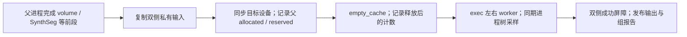

# 半球 worker 启动前的父进程 GPU 缓存释放

[重建入口](README.md) · [阶段剖析与显存口径](PROFILING.md) · [半球线程预算](THREAD_BUDGET.md)

## 功能简介

`release_idle_parent_cuda_cache(device)` 在启动新的半球进程前，等待目标 GPU 的已有计算，再归还父进程可释放的 PyTorch 空闲缓存。自动 volume 和 SynthSeg 等前段会使用 GPU；其计算结束后，allocator 仍可能保留缓存，与左右 worker 的新 CUDA 分配同时占用显存。

这一步保留活张量、模型引用、allocator 策略、TF32 和既有 FP32 例外，不重置峰值，也不退出 CUDA context。当前 `run_hemisphere_group` 在私有输入复制完成、首批 worker 启动前调用它；标准重建显式选择 `hemisphere_workers=2` 时，surface、register、annotation、finish_surface 四组均经过这个边界。串行入口没有新增这一调度调用。



实现复用项目现有 Torch，依赖已在[主页 Conda 环境](../../environment.yml)内；函数不读影像、权重或授权许可。重建所需资源及源码构建程序继续按[安装清单](CONDA_CPP_BUILD.md)核验。

## Python 调用、输入与输出

```python
from fnit.recon_all.hemisphere_parallel import release_idle_parent_cuda_cache

parent_cache_report = release_idle_parent_cuda_cache(
    device="cuda:0",  # 当前进程可见的目标设备；已有 volume / SynthSeg 可先使用它
)
print(parent_cache_report)  # 父进程 allocator 的调用前后计数；不是整例显存峰值
```

唯一输入 `device` 无默认值，接受 Torch 可解析的设备字符串或 `torch.device`。`"cuda:0"` 指可见设备中的逻辑编号；`CUDA_VISIBLE_DEVICES` 可以改变其对应的物理 GPU。CPU 或整个进程的 CUDA 尚未初始化时，函数直接返回，不为清缓存建立 CUDA context。非法设备、同步或 allocator 查询失败会抛出原异常；在组调度中传播为失败报告，不返回成功状态。

返回 `dict`，没有影像、坐标或文件输出；计数单位为 bytes，时间单位为秒：

| 字段 | 含义与出现条件 |
|---|---|
| `status` | CPU / CUDA 全局未初始化为 `not_applicable`；完成同步与缓存处理后为 `complete`。不代表重建完成。 |
| `device` | complete 时记录实际查询的目标设备名称。 |
| `seconds` | complete 时从同步前到第二次计数结束的墙钟，包含等待与查询。 |
| `before`、`after` | complete 时各含 `allocated_bytes`（Torch 张量占用）和 `reserved_bytes`（allocator 管理的内存）。只属于当前父进程的目标设备。 |
| `cuda_context_created` | not_applicable 为 `False`；complete 为 `None`，因为没有测量目标设备 context 是否原已存在。 |
| `cuda_context_measurement` | complete 时说明 context 未测量；全局初始化状态不证明目标设备的 context 已存在。 |
| `scope`、`method` | 明确计数范围及同步、释放方法；不含 worker、外部 allocator 和 context 内存。 |

`torch.cuda.empty_cache()` 没有设备参数；Torch 2.5.1 native allocator 会处理父进程各设备的可释放缓存，而本报告只查询选定设备。[原 allocator 实现](https://github.com/pytorch/pytorch/blob/v2.5.1/c10/cuda/CUDACachingAllocator.cpp#L3092-L3094)保留这个区别。`reserved−allocated` 不能直接当作可全部释放的字节数；仍被引用或不可释放的内存不会因该调用消失。禁用缓存时计数 0 也不证明进程没有 GPU 占用。

重建入口会自动调用，无需用户手动插入：

```python
from fnit.recon_all.native_free import run_recon_all_python

reconstruction_report = run_recon_all_python(
    t1="/data/sub-CON03_T1w.nii.gz",  # 单幅原始 T1w；体积读取沿用 nibabel
    subject_dir="/data/fnit-subjects/CON03",  # 不存在或为空的持久输出目录
    weights_dir="/data/fnit-weights",  # 固定清单验证过的模型权重
    assets_dir="/data/fnit-assets",  # 固定清单验证过的模板、图谱
    device="cuda:0",  # 前段与半球调度使用的目标设备
    threads=4,  # 总工作预算，两个半球 worker 各 2 线程
    native_bin_dir=None,  # 使用当前 Conda 的独立源码构建程序
    profile_stages=False,  # 默认不增加剖析同步；组前释放仍有自身同步
    cuda_allocator_cache="auto",  # 保留已初始化 API 的实际 allocator；不由清缓存改变
    hemisphere_workers=2,  # 启用私有双侧 exec 调度及组前缓存处理；默认 1
    native_optimizations="auto",  # 沿用经过核验的成熟原生优化
)
for hemisphere_group_report in reconstruction_report["hemisphere_scheduling"]["groups"]:
    print(hemisphere_group_report["operation"])
    print(hemisphere_group_report["parent_idle_cuda_cache"])
    print(hemisphere_group_report["device_process_tree"])
```

入口参数与影像输出格式见[重建 API](README.md#运行)。每组写 `scripts/<operation>.hemisphere-group.json`，同一组也保存在 `fnit-native-free-run.json` 的 `hemisphere_scheduling.groups`。`parent_idle_cuda_cache` 保存上表结果；`group_wall_seconds` 包含复制、缓存等待、worker 执行、发布和清理；这些嵌套时间不能另加进整例墙钟。

`device_process_tree` 用一次 `nvidia-smi` 进程快照记录同一目标 GPU 上父进程及存活后代的同时占用，默认采样间隔 0.5 s；实际最大间隔、失败样本和 `peak_tree_total_bytes` 均保留。没有有效样本时峰值为 null。它可能漏过瞬时尖峰，不能将各进程的不同时间峰值相加；十例外层驱动另以 2 s 采样，两个采样范围分开。

## 命令行调用

缓存 helper 没有独立 CLI，也没有新的开关。通过现有重建命令启用双侧调度：

```bash
raw_t1w_image=/data/sub-CON03_T1w.nii.gz  # 原始 T1w
new_subject_directory=/data/fnit-subjects/CON03  # 新目录或空目录
verified_weights_directory=/data/fnit-weights  # 已验证权重
verified_assets_directory=/data/fnit-assets  # 已验证资源
export FS_LICENSE=/private/license.txt  # 用户合法授权；不读取或发布许可内容
fnit-recon-all "$raw_t1w_image" "$new_subject_directory" \
  --weights-dir "$verified_weights_directory" \
  --assets-dir "$verified_assets_directory" \
  --device cuda:0 --threads 4 --hemisphere-workers 2 \
  --cuda-allocator-cache auto --native-optimizations auto
```

`--hemisphere-workers` 默认 1、允许 1/2，选择 2 时总 `--threads` 必须至少为 2。`--cuda-allocator-cache` 默认 auto、另接受 enabled/disabled；后两者要求 CUDA 未初始化。`--profile-stages` 可增加阶段剖析，`--native-bin-dir` 可指定核验过的 Conda 源码构建目录。cache helper 不代替 allocator 的初始化选择，也不改变 CLI 的默认参数。

真实同输入阶段控制由[独立驱动](../../validation/fmri/public_ten_20261003/benchmark_parent_cache.py)执行：

```bash
frozen_fnit_source=/data/fnit-control/source_after  # 该遍实际冻结源码；before 使用对应旧源码
private_configuration=/private/CON03_parent_cache.json  # 精确绑定真实输入与资源
new_control_directory=/private/CON03_parent_cache_after  # 必须不存在，不覆盖此前尝试
fnit_conda_python=/data/fnit-conda/bin/python  # 已核验的同一 Conda Python
env -u PYTORCH_NO_CUDA_MEMORY_CACHING \
  PYTHONPATH="$frozen_fnit_source/src" \
  "$fnit_conda_python" validation/fmri/public_ten_20261003/benchmark_parent_cache.py \
  --config "$private_configuration" --output "$new_control_directory" \
  --source-root "$frozen_fnit_source" --variant after
```

`--config` 的私有 JSON 含 `subject`（已有真实重建根）、`weights`、`assets`、`paint_binary`（已验证 `mrisp_paint`）、`registration_atlases={lh,rh}`（两侧图谱路径）、`device`、`threads` 和 `public_subject`（公开病例编号）。`--output` 为该遍新私有结果根；`--source-root` 为实际冻结源码；`--variant` 只标记 before/after，算法由该遍导入的源码决定。驱动要求在新 Python 进程进入时启用缓存，再运行真实 SynthSeg 和完整双侧 register/avg_curv；输入、源码前后 SHA 与准备时间分别保存。微小活张量仅检验缓存调用保留张量值，不作为 MRI benchmark 输入。

## 原软件调用

官方 recon-all 没有对应的 PyTorch 父进程空闲缓存函数。下面是独立官方整例参考的调用范围；它不用于 FNIT 默认运行时：

```bash
raw_t1w_image=/data/sub-CON03_T1w.nii.gz  # 同一原始 T1w
official_subjects_directory=/data/official-subjects  # 独立参考根
official_subject_id=CON03  # 该参考的新被试名
recon-all -i "$raw_t1w_image" -s "$official_subject_id" \
  -sd "$official_subjects_directory" -all -parallel -openmp 4
```

`-i` 为原始 T1w，`-s` 为被试名，`-sd` 为参考输出根，`-all` 执行完整流程；`-parallel -openmp 4` 是官方的并行与 OpenMP 设置，双半球可能各用 4 线程，不等于 FNIT 总预算 4、各侧 2 的控制。官方已安装版本、命令与资源另存来源记录，不把两套调度机制称为同实现。

## 最新真实精度、耗时与脑图

2026-10-03 的公开 ds001226 v5.0.1（CC0）诊断使用真实原始 T1w＋完整 180 帧 BOLD。旧候选 `01de7f30` 的父子进程同期采样如下；JSON 保留源码与输入 SHA，见[诊断原始记录](../../validation/fmri/public_ten_20261003/runtime_snapshot.public.json)：

| 旧诊断例 | 实际执行状态 | 父子进程同时峰值 | 对 20,000,000,000 bytes 目标 |
|---|---|---:|---|
| CON01 | ribbon 阶段失败 | 21,390,950,400 bytes（21.391 GB / 19.922 GiB） | 超预算 |
| CON03 | 完整输出、180 帧，连续 API 4,439.145 s | 21,374,173,184 bytes（21.374 GB / 19.906 GiB） | 超预算 |

定位时父进程曾有 16,530 MiB 的瞬时占用，包含前段后仍保留的空闲缓存；它也可能包含活张量、context 与库内存，不能将整个值视为可释放缓存。修复在半球启动边界增加上述缓存处理，科学算法和输出规则不变。

**新同输入对照正在运行，结果待核验。** CON03 真实 register-stage 的旧/新控制已独立启动：同一主机/GPU、固定输入网格及资源 SHA，目标设备为已被真实 SynthSeg 使用的 `cuda:1`，新进程启用缓存，再比较缓存前后计数、父子同时峰值、含双侧 register/avg_curv 的完整组墙钟及输出。两套源码从冻结 `19c8e0a3` 建立，仅半球调度模块不同；SynthSeg warmup、外层复制与输入守卫时间单列，不加入组墙钟。实际运行绑定冻结 harness 和模块 SHA；仓库随后增强的导入来源守卫不改标为此次已执行驱动。新测量 JSON 未完成，当前没有新精度、耗时、20 GB 达标或完整整链结论。缓存函数本身不产生脑图；新阶段图与完整 fMRI 图只由对应真实结果生成。

## 最近版本与 benchmark 记录

| 来源/日期 | 改动与真实验证范围 |
|---|---|
| 2026-10-03，本次工作版 | 在成熟双侧 exec 调度前同步并释放父进程空闲缓存；新增前后 allocated/reserved 和独立 context 未测量说明。17 项调度/失败传播/计数合同测试通过；真实 warm SynthSeg＋register 配对仍待结果绑定，不以测试代替 MRI benchmark。 |
| `01de7f30`，2026-10-03 v2 诊断 | CON01 失败；CON03 complete 但峰值超 20 GB。保留两例真实峰值与失败/完成边界，不计入最终正式十例统计。 |
| `8d750e2`，2026-10-02 | [已有两例并行整例](../../validation/recon_all/optimizations/20261002_parallel/FINAL_RESULTS.md)测过独立半球进程与确定性发布；其输入和父进程生命周期不同，不代替自动 volume 后的缓存控制。 |

当前修改只处理父进程与新 worker 的显存生命周期；成熟 MCFLIRT 的 no-cache/CUDA graph 兼容修复另在 [MCFLIRT 功能页](../mcflirt/README.md)记录，两项措施分别验收。

## 参考文献与原实现

- [FNIT 半球调度源码](../../src/fnit/recon_all/hemisphere_parallel.py)、[剖析器源码](../../src/fnit/recon_all/profiling.py)与[调度测试](../../tests/recon_all/test_hemisphere_parallel.py)。
- [PyTorch 2.5.1 的 empty_cache 与计数 API](https://github.com/pytorch/pytorch/blob/v2.5.1/torch/cuda/memory.py)、[native allocator 的缓存释放实现](https://github.com/pytorch/pytorch/blob/v2.5.1/c10/cuda/CUDACachingAllocator.cpp#L3092-L3094)及[指定设备同步实现](https://github.com/pytorch/pytorch/blob/v2.5.1/torch/cuda/__init__.py#L876-L885)。
- [FreeSurfer 固定原实现代码库](https://github.com/freesurfer/freesurfer/tree/d932c45b7941662ea380a05efef580568b98d41a)与[官方 recon-all 说明](https://www.freesurfer.net/fswiki/recon-all)。
- Fischl B. FreeSurfer. *NeuroImage*. 2012;62(2):774–781. [doi:10.1016/j.neuroimage.2012.01.021](https://doi.org/10.1016/j.neuroimage.2012.01.021)。
