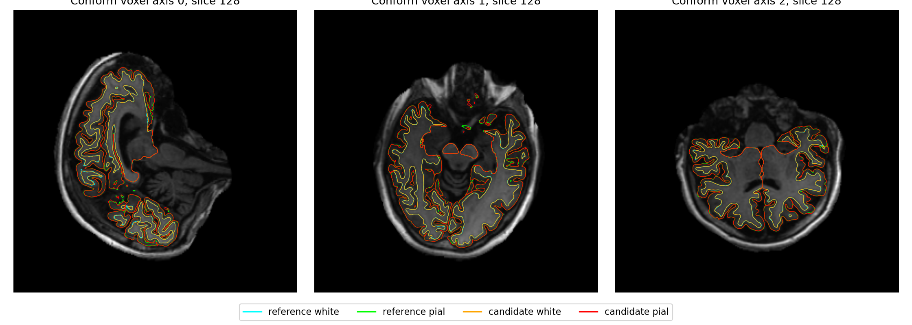

# recon-all 慢阶段与已有实现复用审计

本页回答三个问题：时间花在哪个完整步骤，仓库已有实现能复用到什么程度，下一项优化怎样验证。范围是标准单 T1 流程；本页只整理源码和已有真实记录，没有新增重建或原生 GPU 替换试验。

## 版本、数据与计时范围

源码复核提交为 `c24852054f3321c1142b1ae88fa3d2bf68329bb3`。原生替代的详细审计始于 `764607c2e34c04bdc418fa64540380ff9d22c112`，保存了函数行号、源码 SHA 和历史测试范围，见[机器可读审计](../../validation/recon_all/python_gpu_port/performance_hotspots_20261001/native_stage_gpu_reuse_audit.json)。

本页严格区分以下记录：

| 记录 | 实际代码与输入 | 可以支持的结论 |
| --- | --- | --- |
| 已完成的旧整例 | `1b8c36d25a68e253a1e59b6d02114890afa467de`；sub01 在 gpucw1 用 CUDA，sub02 在 nodecw10 用 CPU | 完整阶段及已有子段耗时；两例、两台主机之间不能计算 GPU/CPU 速度比 |
| 本轮阶段配对 | 旧 1b 与 `764607c` 工作树归档；冻结 FNIT 自产输入，同机、4 线程 | 已测阶段的精度和时间变化；不能相加成新版整例提速 |
| 最终 CSR 回归 | [最终归档](../../validation/recon_all/python_gpu_port/performance_hotspots_20261001/final_candidate_source_snapshot.json) SHA `098ccb63a3931a4f749710fb76dd9beb4751f7b8b14c0f130fa922f9698b708e` | 四侧关联表/法向回归，以及另一次 LH 完整配准；不是第一次配对的同轮追加计时 |
| 历史冻结阶段 | 各报告记录的旧程序、输入和环境 | 现有实现的能力和未解决差异；不是当前版本重新实测 |

旧整例原始报告是 [sub01](../../validation/recon_all/python_gpu_port/performance_20261001/whole/sub01/candidate_run.json) 和 [sub02](../../validation/recon_all/python_gpu_port/performance_20261001/whole/sub02/candidate_run.json)。其子步骤已经包含在对应大阶段中，不能重复累加。cProfile 包含剖析开销；不将它与无剖析计时相除。完整 API、外层进程和监控命令的边界见[计时说明](PROFILING.md)。

当前表面放置等原生程序由固定 FreeSurfer 源码 `d932c45b7941662ea380a05efef580568b98d41a` 在 Conda 中独立编译，并由 FNIT 发现、校验和执行；它们不是从系统安装复制的 FreeSurfer 二进制。N4 则是 FNIT 编译的 ITK C++ 程序，**不是 FreeSurfer 程序**。构建与运行依赖见[主页 Conda 构建路径](CONDA_CPP_BUILD.md)。

## 本轮已定位并验证的开销

### 球面配准：有序平均和重复小张量操作

sub01 LH 的同输入完整配准 cProfile 为 **524.378 s**。103 次有序梯度平均累计 **241.165 s**；27 次图谱平滑累计 **117.288 s**，内部有 10,773,744 次 `torch.roll`。`torch.roll` 时间已经包含在平滑中。该次坐标和有序面与保存的 FNIT 结果相同，详见[剖析原始报告](../../validation/recon_all/python_gpu_port/performance_hotspots_20261001/baseline_register_profile/report.json)。

本轮保留配准算法，接入了有序 float32 CUDA 平均，编译 CPU 图谱平滑和三跳 BFS，并优化共享面关联 CSR。目标函数、线搜索和末尾清理仍沿用既有路径。结果如下：

| 验证 | 旧实现 | 新实现 | 数值与范围 |
| --- | ---: | ---: | --- |
| 同一真实首轮梯度，16,384 次平均，四次暖调用中位数 | 39.495550 s | 0.318110 s | 含传输、分配及完整轮次；0/1/64 轮也通过零容差比较；仅算子计时 |
| sub01 LH 完整配准，同次独立进程配对 | 503.817845 s | 168.823989 s | 含初始化、JIT、读写、传输及同步；时间比 2.9843，减少 66.49%；表面/seed SHA、坐标/有序面/尾部及保存轨迹相同 |
| 上述同次进程，另含 Python 导入 | 506.790789 s | 171.645117 s | 进程边界，不等于算子或整例时间 |
| 最终 CSR 归档，另一次 LH 完整配准 | 没有同时重跑 | 150.171479 s | 与冻结结果的表面/seed/保存轨迹相同；不能计算相对 168.824 s 的 CSR 因果提速 |

数据见[平均算子](../../validation/recon_all/python_gpu_port/performance_hotspots_20261001/gpu_average_sub01_lh.json)、[完整配准配对](../../validation/recon_all/python_gpu_port/performance_hotspots_20261001/register_pair_sub01_lh.json)和[最终 CSR 回归](../../validation/recon_all/python_gpu_port/performance_hotspots_20261001/register_final_csr_sub01_lh.json)。第一次配对使用 GPU 归档 `f7691862…`；最终 CSR 使用 `098ccb63…`，两个测试版本分开绑定。

旧 GPU 归档的另外三个半球完整回归已通过坐标、有序面、尾部、seed 和保存轨迹检查；它们比较的是保存的冻结结果，没有同次 CPU 性能基线。最终共享 CSR 四侧整数表和 float32 法向均相同；其构造时间为 5.73–7.47 → 0.085–0.099 s。此最终归档的后三侧完整配准尚未另跑，不能把局部 CSR 回归扩写成四侧新完整配准结论。

标准 recon-all 已按 `device` 选择平均后端；独立 `run_register_sphere` 的 `averaging_device="cpu"` 默认仍保留。CUDA 路径使用显式设备、双缓冲及原邻接次序，禁用 FMA 融合；标量平均不涉及 TF32 矩阵运算。完整参数与验证边界见[球面配准性能页](SPHERE_REGISTRATION_PERFORMANCE.md)。

### remesh：顺序计算、动态拓扑和 Python 调用

四侧真实阶段配对都在 gpucw1、4 线程进行，各侧一次；时间包含输入输出及首次 JIT/缓存加载。候选复用顺序 Numba 平滑、缓存静态邻接并以 `heapify` 初始化队列，保留拆边/缩边规则及接受顺序。

| 冻结真实输入 | 旧 remesh | 新 remesh | 墙钟减少 |
| --- | ---: | ---: | ---: |
| sub01 LH | 119.283782 s | 105.333419 s | 11.70% |
| sub01 RH | 115.113825 s | 104.008209 s | 9.65% |
| sub02 LH | 140.459920 s | 127.147096 s | 9.48% |
| sub02 RH | 140.617393 s | 119.204590 s | 15.23% |

坐标、有序面、几何尾部和拆缩边接受记录均相同，最大/P99 坐标误差为 0。原始报告是[前三侧](../../validation/recon_all/python_gpu_port/performance_hotspots_20261001/remesh_other_three_pair.json)和[sub02 RH](../../validation/recon_all/python_gpu_port/performance_hotspots_20261001/remesh_sub02_rh_pair.json)。报告保留不同的整文件 SHA；这里的门槛是解析后的几何、尾部和决策，不将其写成整文件字节相同。

本轮 sub02 RH 新实现的剖析中，collapse 约 78 s，三次 smooth 合计约 2.41 s。动态缩边应是下一轮进一步剖析和编译优化的对象；它需要顺序更新当前网格，不能把全部边当成同时独立的 GPU 任务。[CPU 几何说明](CPU_GEOMETRY_PERFORMANCE.md)还保存了 quick sphere 四侧配对；quick sphere 本次为 70–85 s，不是下面超过 100 s 的首要步骤。


### 标准球面：本轮真实输入剖析

本轮另在 headcw、4线程运行冻结 sub-01 LH 的完整标准球面，计时156.913 s，坐标和有序面与保存结果完全相同。记录含 cProfile 和首次 JIT 开销，不能与另一主机的历史秒数相除。原始 [JSON](../../validation/recon_all/python_gpu_port/performance_hotspots_20261001/standard_sphere_profile.json)和 [函数表](../../validation/recon_all/python_gpu_port/performance_hotspots_20261001/standard_sphere_profile.txt)绑定c248520源码。

| 当前热点 | 次数 | 剖析秒数 | 可验证的下一步 |
| --- | ---: | ---: | --- |
| 距离 SSE `_distance_sse` | 2103 | 64.410 | 每顶点独立算本行，保留邻居顺序，再按顶点顺序串行求总和；先与原函数逐位对照 |
| `initial_vertex_normals` | 212 | 22.248（累计） | 其中静态面 CSR 重建9.606 s、动态法向内核9.884 s；缓存面索引，继续每轮计算坐标相关法向 |
| 有序梯度平均 | 212 | 16.288 | 可复用既有 CUDA Jacobi 内核；先核one-ring邻接与倒数规则，单独衡量完整传输及初始化 |
| 距离样本矩阵准备 | 1 | 14.379（累计） | 核对静态样本/距离可缓存范围；它不是整个metric setup时间 |

线搜索74.724 s包含调用上述距离 SSE 的时间，表中累计项不可相加。此处距离目标函数比平均更值得优先优化。[标准球面审计](../../validation/recon_all/python_gpu_port/performance_hotspots_20261001/standard_sphere_gpu_candidate_audit.json)明确列出不允许替换成Jacobi的有序原地metric平均，以及拟采用CPU/GPU算子的输入、顺序、缓存生命周期和四侧回归要求。本轮没有修改标准球面的这些浮点计算。

## 超过 100 秒步骤的具体复用方向

下表时间均为秒。除已明确标注“本轮配对”的行外，时间属于**旧 1b 整例**或指定的历史冻结阶段；未做新内部 profile 的项目只列源码候选开销。

表内“GPU/CPU”表示对应整例的请求设备：sub01/gpucw1 与 sub02/nodecw10。white、pial、拓扑和 N4 的上述原生计算仍在 CPU，不能将这些标签解释为该原生算子已使用 GPU。

| 步骤与已测范围 | 当前具体实现 | 热点依据与候选开销 | 已有自有替代的成熟度 | 下一项可行优化与默认替换条件 |
| --- | --- | --- | --- | --- |
| 球面配准；本轮 503.818 → 168.824，最终 CSR 另轮 150.171 | `run_register_sphere` → sulc/smoothwm；FNIT PyTorch/Numba，梯度平均 CUDA，其余主优化 CPU | 本轮 cProfile 已定位平均与重复 roll；新候选剩余耗时尚未重新剖析 | 完整自有阶段已存在；旧 GPU 归档四侧冻结回归通过，最终 CSR 的覆盖另列 | 对最终候选重新剖析 force、SSE/line-search、图谱参数化和转换；复用已有力项，逐个固定输入验证，不机械切整个阶段的 device |
| remesh；本轮新阶段 104–127 | [`remesh_surface`/`remesh_geometry`](../../src/fnit/recon_all/mris_remesh_python.py)；FNIT Python/Numba | 新 RH profile 的 collapse 约 78 s；动态网格与堆/邻接维护仍有 Python 开销 | 四侧完整阶段坐标/面/尾部与拆缩边决策通过 | 优先把动态缩边及邻接维护放入自有编译内核；GPU 仅研究同一固定网格快照上的独立几何量，保持顺序接受与失效规则 |
| standard sphere；旧 1b 四侧 141–238 | [`run_standard_sphere`](../../src/fnit/recon_all/sphere_standard_run.py)，NumPy/Numba；已有完整顺序优化 | 当前仅有大段/metric/finish 时间；平均、SSE、line-search、metric 互查是源码候选，未有本轮内部热点结论 | 历史冻结同输入有序几何通过；本轮没有完整 GPU 替换配对 | 先剖析 [`average_standard_gradient`](../../src/fnit/recon_all/sphere_standard_average.py)；可适配现有有序 CUDA 平均器，先核对邻接/倒数/轮次，再验证完整阶段。保留 metric 随机序列和重复邻点语义 |
| white.preaparc；旧 1b GPU 193.78/191.72，CPU 359.73/259.85 | [`run_white_preaparc`](../../src/fnit/recon_all/white_preaparc_conda.py)：FNIT Python/Numba autodet 阈值＋Conda 源码 C++ placement | 阈值约 2 s/侧；放置主体未有本轮逐轮 profile | [`place_white_preaparc_prefix`](../../src/fnit/recon_all/place_white_preaparc_python.py) 只执行首轮 1–17 步；历史第2/3轮从各自冻结入口重放，不是连续四轮实现 | 复用已有 MRI 准备、边界、强度、弹簧和碰撞内核；先完成连续全部轮次，再测固定快照的边界/梯度 GPU 批处理。当前不能默认替换完整放置 |
| 最终 white；旧 1b GPU 212.41/158.99，CPU 263.73/243.57 | [`run_final_white`](../../src/fnit/recon_all/final_white_conda.py)，Conda 源码 C++ | 未有本轮内部 profile；局部误差与编译/算法原因需同输入定位 | 仓库尚无完整独立 Python 最终 white；已有白质/pial 共用内核可复用 | 按相同输入逐轮核对边界搜索、目标强度、步长和清交；补全状态传递后测完整阶段。不能拿首轮前缀或 smoothwm 文件充当最终 white |
| pial；旧 1b GPU 182.80/192.47，CPU 277.54/293.89 | 标准 runner 默认 Conda 源码 C++；[`place_pial_t1`](../../src/fnit/recon_all/place_pial_python.py) 是完整自有 NumPy/Numba 函数 | 历史 Python 碰撞热运行 17.867 s，其中 604,419 次 KDTree 查询 7.945 s；不是当前 C++ profile | 历史官方冻结双侧有序几何相同，但 Python 约1241/1154 s；另一组自产输入 Python/C++ 存在局部差异，见下文 | 优先编译 [`asynchronous_first_step`](../../src/fnit/recon_all/place_surface_collision.py) 的动态 broadphase、候选筛选与顺序接受；固定网格梯度可单独验证 GPU，保持 pinning/cleanup。完整两例双侧回归及性能通过后再换默认 |
| topology 封装；旧 1b GPU 81.62/118.82，CPU 70.76/93.92 | [`run_topology_ga_conda`](../../src/fnit/recon_all/topology_conda_ga.py)：Python 居中＋固定 C++ GA，显式1线程/seed1234 | 封装时间含 Python 居中，不是裸 GA；当前没有新的原生评分 profile | Python 已有评分/fitness/首候选，但没有完整 mutation、crossover 和全部缺陷修复 | 保留完整 GA；先量出评分子核占比，再用已有评分实现验证分块 GPU。首候选筛选或球面投影不能作为完整拓扑替代 |
| MNI 非线性；旧 1b sub01 284.61、sub02 305.20 | [`run_mni_nonlinear_chain`](../../src/fnit/recon_all/mni_nonlinear_chain.py)：已有 PyTorch deform＋Conda C++ warp 转换/求逆/检查图 | 模型及保存 170.74/201.22，原生求逆 89.47/77.85；model 子段包含加载、转换、双向积分及保存，尚未拆开 | 完整 PyTorch 模型已在生产；同 hyper 的物化卷积保留在实例中，没有跨实例持久模型缓存 | 先分段计时；研究省去下游未消费的 SynthMorph 逆向对象，以及批次受控模型复用。两次 UNet 构成反对称 velocity，不能省第二次 UNet；保留既定 warp 求逆语义 |
| N4；旧 1b 123.07/109.73 | [`n4_itk.py`](../../src/fnit/recon_all/n4_itk.py) 封装 [`fnit_n4_itk`](../../tools/n4_itk/n4_itk.cpp)；独立 ITK C++、固定1线程 | C++ 的 N4拟合、全分辨率 B-spline、exp/除法尚未分别计时；临时 raw I/O 也不能预先认定为瓶颈 | [`n4_gpu.py`](../../src/fnit/recon_all/n4_gpu.py) 是组织残差平滑场，算法不等于 ITK N4 | 先测三个 Update 和读写；相同算法做1/4线程配对。暂无成熟 GPU 等价替代；确定主要分段后再选择实现，不能削减拟合/迭代换时间 |
| GCA EM 注册；旧 1b 212.35/163.16 | 生产 `mri_em_register` 为 Conda 固定源码 C++ | 历史 Python 路径线性搜索205.25 s、首 EM5.75 s；不是当前 C++ 内部热点比例 | [`register_t1`](../../src/fnit/recon_all/mri_em_register_python.py) 已串联前段，但调用的 [`first_em_line_search`](../../src/fnit/recon_all/mri_em_register_optimizer.py) 只做首方向，完整后续 EM 未一般验证 | 复用 [`search_linear_iteration_source`](../../src/fnit/recon_all/mri_em_register_search_source.py) 的候选枚举与采样规则，分块 GPU 候选×样本评分；保留同分选择、体素舍入与停止条件。完整 EM 验证前不换生产默认 |
| T1/brain 归一化；旧 1b GPU185.43/174.51 | FNIT 既有 PyTorch 主设备路径＋CPU 控制点/SciPy/Numba | 本轮已编译有序离群控制点清理；CPU候选筛选、距离图和往返传输内部未拆开 | 两例 CPU 阶段配对的最终图和全部诊断控制图均零差异；GPU完整替换未另测 | 复用成熟控制点/场计算，先剖析并减少冗余转换和重复数据读取；本次 CPU 配对不能代替 GPU 收益或整例提速 |

SynthSeg 的完整 PyTorch GPU 路径已经接入，旧 sub02 的 368.811 s 来自明确选择 CPU 的整例；旧 sub01 的 CUDA 阶段为 50.347 s。两者不能作为同输入 GPU/CPU 速度比。该阶段保留经过真实验证的 cuDNN FP32 例外，记录实际前向；无需另写同功能模型。[精度策略说明](SYNTHSEG_PRECISION.md)与函数页保留输入、输出及限制。

### 两项不能以“小平均误差”替代的成熟度检查

GCA 的[历史同输入验证](../../validation/recon_all/python_gpu_port/MRI_EM_REGISTER_VALIDATION.md)中，单个真实输入的 LTA 最大矩阵差为 `7.45e-9`，315,638 个样本的舍入后源体素映射相同。这支持复用已测准备与搜索代码，但不覆盖任意输入所需的后续 EM 轮次。候选评分改变坐标舍入边界时会改变被采样强度，应单独检查。

pial 的[历史自产输入双引擎比较](../../validation/recon_all/python_gpu_port/native_pial_candidate_20260929.json)中，LH/RH 最大位移为 2.5910/1.3418 mm，P99 为 0.2797/0.1313 mm。它不是本轮新候选结果，也不是完整 Python pial 尚未实现的证据；它要求继续核对该输入上的逐轮状态和局部几何，不能统一归因于随机性或浮点尾差。[完整 Python pial 说明](PYTHON_PIAL_PLACEMENT.md)保留官方冻结测试的另一组输入和结果。

## 输入、输出、空间与失败行为

审计输入是上述真实阶段/整例 JSON、实际源码和声明资源指纹；本页输出是性能及成熟度判断，不写影像、不替换生产阶段。各阶段完整参数、默认值和原软件命令由对应功能页维护，避免给内部步骤编造独立 CLI。

| 复用对象 | 输入结构与空间 | 输出及必须保留的关系 | 参数和异常的完整说明 |
| --- | --- | --- | --- |
| 球面配准 | 同序 `sphere`、`smoothwm`、(N,) sulc、半球 TIFF；表面 surface RAS/mm | `sphere.reg` float32(N,3)、有序面和尾部；逐轮选中 dt/state/清理记录；不能把球面距离当成皮层形状距离 | [配准 API、averaging/overlap 设备、默认上限及失败](SPHERE_REGISTRATION_PERFORMANCE.md) |
| remesh/standard sphere | 有序三角网格 (N,3)/(F,3)，surface RAS/mm；sphere 还使用原几何和有序 metric | remesh 可改变编号和顶点数；sphere 保持输入顶点/面关系；比较前检查对应性 | [几何参数、迭代数及文件/网格错误](CPU_GEOMETRY_PERFORMANCE.md) |
| white/pial | 自产 MRI、分割、起始表面、注释/标签、阈值文件；MRI 使用各自声明网格，表面为 surface RAS/mm | 同侧有序边界表面；所有优化轮次、内侧壁固定及清交；白质前缀只输出诊断网格 | [preaparc](WHITE_PREAPARC_CONDA_CHAIN.md)、[final white](FINAL_WHITE_CONDA.md)、[pial](PYTHON_PIAL_PLACEMENT.md) |
| N4/GCA/归一化 | conformed 强度图、mask、声明 GCA；图像 affine/dtype、采样体素索引均保留 | 校正/归一化图、LTA、控制点等；空间与标签语义不能通过重采样掩盖 | [ITK N4](N4_ITK_CONDA.md)、[前段配对](VOLUME_PREFIX_PARITY_20260930.md)、[归一化](NORMALIZATION.md) |
| MNI 非线性 | 自产裁剪 T1、affine LTA、声明1 mm模板和 deform 权重 | 前向/逆向 warp、检查图；向量 displacement 为 RAS/mm，两个方向的网格分别检查 | [完整参数、原生程序及失败条件](MNI_NONLINEAR_CHAIN.md) |

非法邻接、非对应网格、缺少资源、设备不可用、JIT/原生程序失败或不收敛均应使该阶段失败。标准文件名、执行结束或写出了138项，不代表网格质量及数值/最终指标已经通过。读写优先 nibabel；原始几何尾部按既定 I/O 规则保留。

### 具名调用示例

此示例只从 FNIT 自产同序表面运行完整配准，并写入新的诊断目录；独立 API 显式选择 CUDA 平均，末尾清理沿用 CPU。

```python
from pathlib import Path
from fnit.recon_all.mris_register_run import run_register_sphere

output_directory = Path("/data/validation/sub01_lh_register_new")  # 新诊断目录，保留已有结果
output_directory.mkdir(parents=True, exist_ok=False)             # 已存在则报错
report = run_register_sphere(
    sphere="/data/fnit_subject/surf/lh.sphere",               # 标准球面；surface RAS/mm
    smoothwm="/data/fnit_subject/surf/lh.smoothwm",           # 同序皮层几何；surface RAS/mm
    sulc="/data/fnit_subject/surf/lh.sulc",                   # 同序 (N,) sulc 特征
    atlas="/data/fnit_assets/average/lh.folding.atlas.acfb40.noaparc.i12.2016-08-02.tif",  # 声明的 LH 图谱
    output=output_directory / "lh.sphere.reg",               # 保存有序配准结果及几何尾部
    overlap_device="cpu",                                   # 沿用本轮同输入验证的末尾清理
    averaging_device="cuda:0",                               # 仅有序平均使用明确逻辑 GPU
)
```

只验证真实首轮平均时，使用[平均回归脚本](../../validation/recon_all/python_gpu_port/benchmark_register_gpu_average.py)：

```bash
subject=/data/fnit_subject                                 # 自产 sphere/smoothwm/sulc 的目录
hemisphere=lh                                             # 半球，与图谱一致
atlas=/data/fnit_assets/average/lh.folding.atlas.acfb40.noaparc.i12.2016-08-02.tif  # 固定资产
output=/data/validation/sub01_lh_average_new                # 必须不存在；捕获 .pt 只留此目录
device=cuda:0                                             # 按 CUDA_VISIBLE_DEVICES 映射后的目标
threads=4                                                 # 同一线程预算
python validation/recon_all/python_gpu_port/benchmark_register_gpu_average.py \
  --subject "$subject" \
  --hemi "$hemisphere" \
  --atlas "$atlas" \
  --output "$output" \
  --device "$device" \
  --threads "$threads"
```

脚本固定0数值容差，报告16384/0/1/64轮及首调用/暖调用、输入/源码 SHA、GPU UUID、线程和同步时间。`report.json` 与真实捕获 `.pt` 是诊断产物；真实数组不提交到 Git。CUDA/JIT错误会写失败报告并非零退出；旧输出目录不会覆盖。完整阶段配对另用[配准配对脚本](../../validation/recon_all/python_gpu_port/benchmark_register_pair.py)，不要把首轮平均视为完整配准。

## 资源、并行与验收

当前平均及共享 CSR 修改没有新增依赖；Numba、Torch、Triton 3.1.0 已由主页 [Conda 环境](../../environment.yml)声明。新的自有 C++/CUDA 核必须纳入同一路径、记录源码/补丁和产物 SHA；不能引入系统预装软件或间接调用它们的包装包。

GPU 保留 TF32 默认及已有经验证的 FP32 例外，不启用 FP16/BF16。平均算子及第一次完整 LH 配对的最大采样任务进程显存为 486,539,264 字节；采样不是连续峰值，也不是新整例20,000,000,000字节预算的证明。禁用缓存时 allocated/reserved 写 unavailable，完整显存应按同一采样时刻的父子进程合计报告。[资源范围](GPU_MEMORY.md)与[线程预算](THREAD_BUDGET.md)说明了已初始化 API、库线程和统计边界。

双侧表面链当前还有共享输出：preaparc 的 `mrisps.wpa.mgz`、最终 white 的 `mrisps.white.mgz`，以及拓扑相关的 `surface.defects.mgz`。在相同被试目录机械并行会竞争覆盖；并行需先隔离输出并保持阶段依赖及总线程预算。N4 固定1线程、topology 显式1线程也不能写成外层 `threads=4` 已覆盖所有库。

下一轮按“实际剖析 → 同输入阶段回归 → 自产连续链 → 原始 T1 空目录整例”推进。三种结论分别记录：

1. **严格复现**：保留138项及各阶段原始比较，用于定位差异。
2. **优化是否引入退化**：与冻结的同输入旧 FNIT 比较，按该算子预先声明的容差检查最大/P99、局部异常、标签语义与网格质量。
3. **整体指标等效**：另报分区 Dice、双向表面距离、厚度/面积/体积偏差及局部异常；目前没有经确认的整体等效门槛，本页不判定或事后放宽。

未修改的原生阶段保留已有结果与失败项。清洁部署的整例隔离验收未由本页验证；独立编译、PATH 或 ldd 检查不替代全新环境的执行/动态库/文件访问记录。

## 原软件对应与参考

完整球面配准对应独立 benchmark 的 `mris_register -curv -threads 4 sphere folding_atlas sphere.reg`；remesh 对应 `mris_remesh --remesh --iters 3 INPUT OUTPUT`，standard sphere 对应 `mris_sphere`。平均、图谱平滑、三跳 BFS、碰撞和候选评分均是命令内部步骤，没有独立等价 CLI。white/pial、N4、EM 和 MNI 的完整固定参数见上表链接的各功能页；生产路径使用 FNIT 代码或经声明的独立 Conda 产物。

- [固定 FreeSurfer 原始源码 d932c45](https://github.com/freesurfer/freesurfer/tree/d932c45b7941662ea380a05efef580568b98d41a)：GCA、拓扑、表面及球面算法的源码对照。
- [ITK N4 原实现](https://github.com/InsightSoftwareConsortium/ITK)：N4 拟合及 B-spline 场计算；FNIT 封装与参数见[N4 说明](N4_ITK_CONDA.md)。
- Fischl B. FreeSurfer. *NeuroImage*. 2012;62(2):774–781. [doi:10.1016/j.neuroimage.2012.01.021](https://doi.org/10.1016/j.neuroimage.2012.01.021)。
- Fischl B, Sereno MI, Tootell RBH, Dale AM. High-resolution intersubject averaging and a coordinate system for the cortical surface. *Human Brain Mapping*. 1999;8(4):272–284. [论文索引](https://pubmed.ncbi.nlm.nih.gov/10619420/)。

完整报告、版本快照、真实阶段配对与后续整例入口统一见[本轮性能热点记录](../../validation/recon_all/python_gpu_port/performance_hotspots_20261001/README.md)。

## 真实影像可视化例子

以下使用优化前 `1b8c36d` 已完成整例的 sub-01，展示 conform T1 上的官方与 FNIT white/pial 叠加，surface RAS 到体素坐标按配套 MGH 头转换。它用于说明空间和既有局部差异，不是本次 c248520 原始 T1 新整例的结果；新图由整例结束后的只读比较脚本生成。



可同时查看 [逐脑区误差](../../validation/recon_all/python_gpu_port/performance_20261001/whole/sub01/paired/figures/region_errors.png)和 [局部分区边界](../../validation/recon_all/python_gpu_port/performance_20261001/whole/sub01/paired/figures/local_region_boundary.png)。生成命令、输入 SHA 和图像 SHA 保存在该图组的 provenance.json。
