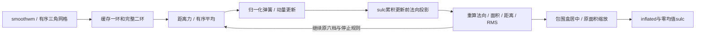
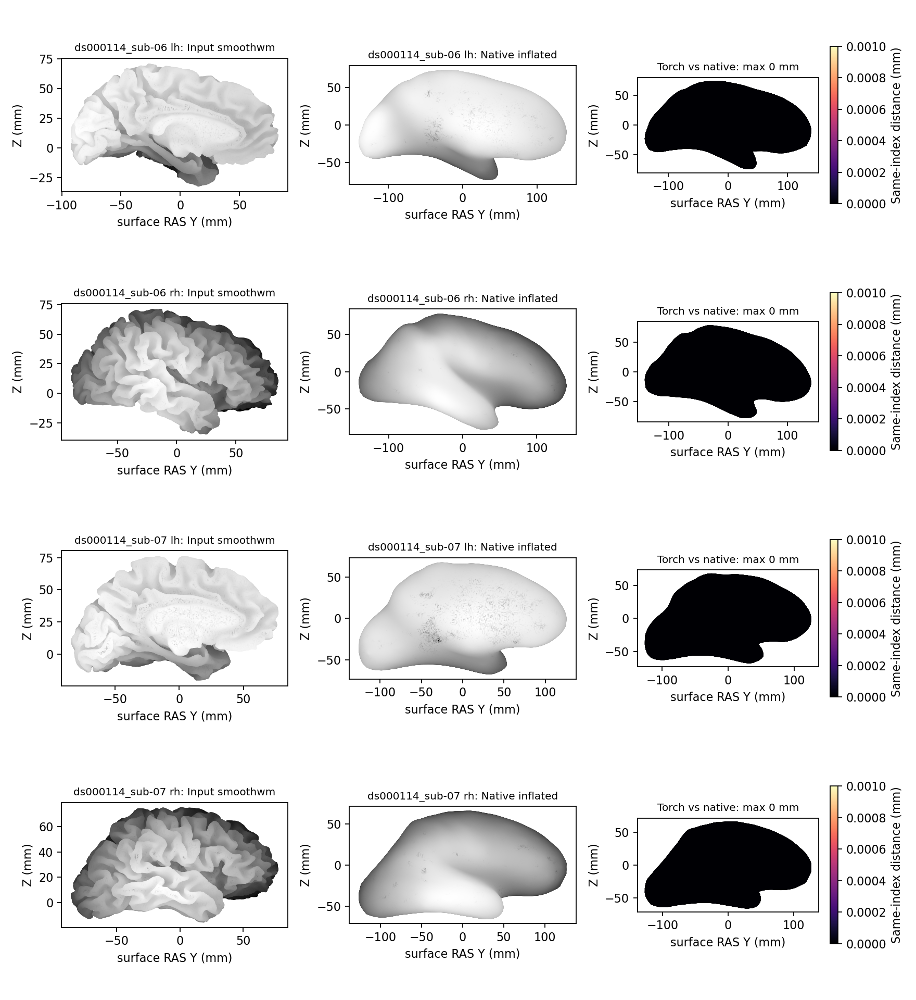

# 标准 inflation 与 sulc 的 PyTorch 实验后端

## 1．功能和范围

`run_standard_inflate()` 从 FNIT 自产 `smoothwm` 生成 `inflated` 和 `sulc`。它复用已有 `inflate_python.py` 的完整 CPU 配方，并新增显式 Torch GPU 后端。GPU 法向复用 `TorchFaceNormalTopology`，梯度平均复用 `RegistrationGradientAverager`；距离、归一化弹簧、动量、RMS、面积缩放和 sulc 用 Torch 张量计算。完整接口已有显式 recon-all 候选接线，默认仍为 Conda 源码构建的 `mris_inflate`。



本接口对应固定默认配方：邻域二环，平均档次 16/8/4/2/1/0，每档默认 10 步，`dt=momentum=0.9`，距离权重 `0.1×sqrt(averages)`，归一化弹簧权重 1，RMS 目标 0.015。高分辨率体积头的 x 体素尺寸在 `(0,0.8)` mm 时，按原 CLI 调整每档步数。暂不支持 patch/ripped 顶点、explode、非默认力权重、sphere projection 或其他 CLI 配方。

现有几何函数以前只写 `inflated`，没有输出 `sulc`。完整接口补充固定源码的实际定义：每一步用动量位移与**更新前**单位法向的点积累积 FP32 `curv`，最后以 FP64 均值居中，再写顶点图。不会用径向距离或位移模长替代。原几何 API 仍保留兼容行为。

## 2．Python 调用、全部输入和输出

```python
from fnit.recon_all.inflate_standard_run import run_standard_inflate

report = run_standard_inflate(
    input_surface="subject/surf/lh.smoothwm",  # FNIT自产三角表面，surface RAS，单位mm
    inflated_output="diagnostic/lh.inflated",  # 同顶点顺序和有序面的膨胀表面
    sulc_output="diagnostic/lh.sulc",  # 同顶点顺序的FP32有符号累计深度，单位mm
    backend="torch",  # 显式使用Torch；默认numpy用于既有CPU回归
    device="cuda:0",  # 显式GPU；默认cpu，不自动回退设备
    profile=True,  # 默认False；测量时逐子段同步目标GPU，生产不需过度同步
)
```

| 输入参数 | 类型、默认值与意义 |
|---|---|
| `input_surface` | 必填 str/Path；FreeSurfer 三角表面格式，坐标 `(N,3)`、面 `(F,3)`，surface RAS/mm，有体积几何头时保留 |
| `inflated_output` | 必填 str/Path；写 `(N,3)` FP32 坐标和原有序面、体积几何文本，中心平移及面积缩放后的表面 |
| `sulc_output` | 必填 str/Path；写 `(N,)` FP32 morph 格式，和输入顶点一一对应，单位 mm |
| `backend` | str，默认 `numpy`；`numpy` 复用 CPU NumPy/Numba，`torch` 选择新增张量实现 |
| `device` | str，默认 `cpu`；Torch 可用 CPU 做诊断或显式 `cuda:N`；NumPy 必须为 CPU |
| `profile` | bool，默认 False；True 对 Torch 子段前后同步，用于定位，返回时间包括该开销 |

三个路径必须不同。输入须有限、有合法索引、正总面积、无孤立顶点，体积 x 体素尺寸须为正有限数。数据没有重采样；体积 header 只用于声明几何和高分辨率步数。缓存仅属于本次有序面拓扑，不跨网格阶段或坐标版本复用法向。

返回字典包含路径、后端、设备、顶点/面数、每档步数、读取校验时间、初始化/传输时间、计算至最终输出下载时间、写出时间、`integration` 的实际步数/RMS/停止原因/子段计时，以及 `total_seconds_including_io`。Torch `integration_wall_seconds` 含必要停止同步；最终文件总墙钟包含加载、验证、拓扑、搬运、计算和两份文件写出。子段时间嵌套在总墙钟中，不能重复相加。

`TorchInflationContext(faces=..., nvertices=..., device="cuda:0")` 只缓存一/二环整数索引、有效掩膜及成熟法向/平均上下文。`integrate(vertices=..., niterations=10, rms_target=0.015, profile=False, callback=None)` 输入同设备 FP32 `(N,3)`，返回同设备新坐标、未去均值 sulc、步数/RMS/时间。可选只读 callback 接收 `(step,coordinates)`；不得原地改候选。`finalize(coordinates=..., original_vertices=..., sulc=...)` 返回居中/面积缩放坐标及零均值 sulc。坐标与原网格单位都是 mm，sulc 的符号是原累积投影约定。

输入非法、CUDA 不可用、编译失败或非有限计算会抛异常，可能留部分文件；没有参考复制、占位文件、近似回退或 CPU 静默回退。API 不修改全局 TF32/精度策略，不启用 FP16/BF16。

## 3．命令行与复现

```bash
python -m fnit.recon_all.inflate_standard_run \
  --input-surface subject/surf/lh.smoothwm \
  --inflated-output diagnostic/lh.inflated \
  --sulc-output diagnostic/lh.sulc \
  --backend torch \
  --device cuda:0 \
  --threads 4 \
  --profile \
  --report diagnostic/lh.inflate.json
```

输入、输出、后端和设备与 Python 参数相同；`--threads` 默认 4，固定本进程 Torch/Numba 预算；`--profile` 默认关闭；`--report` 是必填 JSON 路径。CLI 只在自己进程开启 TF32，记录实际策略、CUDA 是否预初始化、源码哈希和张量峰值。API 总时间不含 Python 进程导入，完整冷进程墙钟还需外部测量；自报进程时间含本模块导入、API及哈希。已有主页 Conda 的 PyTorch、Triton、NumPy、Numba 和 nibabel 已覆盖这条路径，无新增生产依赖；Pytest 仅是独立测试工具。

真实阶段比较使用 `validation/recon_all/optimizations/20261009_inflate_torch/benchmark_complete.py`：`--data` 是逐 SHA 的公开 smoothwm manifest 目录，`--native` 是 FNIT 独立 Conda 源码构建的参考程序，`--output` 必须不存在。`--device` 默认 `cuda:0`，`--threads` 默认 4，`--repeats` 默认 2；可重复 `--case case/lh` 筛选。配对顺序为 native/NumPy/Torch，再 Torch/NumPy/native，GPU 每次完整 API 前后同步。输入、算法模块和参考程序均记录实际 SHA。参考只在候选全部计算后用于诊断比较。

`--backends` 默认 `native numpy torch`，保持既有 ABC/CBA 配方；指定 `--backends native torch` 使用完整 API ABBA，只跳过已验证的 CPU 候选重复计算。后端不可重复、须包含 native 和至少一个候选；此选项不影响计算函数或比较门槛。

双侧接入和已初始化 CUDA 的 Python API 用完整组 ABBA 验证：

```bash
python validation/recon_all/optimizations/20261009_inflate_torch/benchmark_hemisphere_group.py \
  --data public_smoothwm_package \
  --native declared_native_bin/mris_inflate \
  --output new_complete_group_pair \
  --device cuda:0 \
  --threads 4
```

`--data` 是相同 SHA 输入包，每例必须同时有 lh/rh；`--native` 为声明 Conda 源码构建程序；`--output` 必须是新目录；`--device` 默认 `cuda:0` 且须显式 CUDA 编号；`--threads` 默认 4，两个 worker 合计预算且至少为 2。父进程关闭缓存、初始化 CUDA 并持有 FP32 活张量，子进程仅局部开启缓存。每例按 native/Torch/Torch/native 执行真实完整双侧组，两种后端均包含私有复制、fresh exec、导入、CUDA 初始化、JIT、API、读写和发布。新空 JIT 目录由调用环境指定，后续组复用缓存；与每次独立冷 JIT 的配准试验范围不同。

脚本 `callback(subject=..., hemi=..., device=..., threads=..., operation=..., backend=..., native=...)` 是本次可信 benchmark worker，没有独立官方 CLI。输入仅私有被试目录的对应 `smoothwm`，Torch 复用本页完整接口，native 执行第4节完整命令；返回含读写的 API 报告、实际线程/TF32/缓存字段，生成同序 `inflated/sulc`。输出 `summary.json` 保留输入、源码、程序 SHA、四组实际 worker 报告、父活张量与环境合同、同期显存和严格比较。失败保留 JSON/日志并返回 1；成功返回 0。它不生成原始 T1 整例、不修改生产默认或参考输出。

实际生产内部接线另用完整球面链验证，不以只跑 inflation 代替：

```bash
python validation/recon_all/optimizations/20261009_inflate_torch/benchmark_sphere_prepare_group.py \
  --data public_smoothwm_package \
  --native declared_native_bin/mris_inflate \
  --assets declared_recon_assets \
  --native-free-sha256 ACTUAL_FROZEN_NATIVE_FREE_SHA256 \
  --code-version ACTUAL_BASE_AND_OVERLAY_VERSION \
  --case ds000114_sub07 \
  --output new_actual_sphere_chain_pair \
  --device cuda:0 \
  --threads 4
```

`--data/--native/--output/--device/--threads`含义同上；`--assets`指定生产内部native阶段所需声明资产；`--native-free-sha256`绑定实际冻结`native_free.py`字节，导入时及每侧运算前核对；`--code-version`记录基底与明确补丁身份；可重复`--case`筛选公开包的双侧例，默认全部。父CUDA保持初始化/禁用缓存与活张量；control使用native+inherit，candidate使用Torch+enabled，各策略独立空Numba/Triton编译缓存，球面Numba法向与既有GPU平均均不改。

该worker直接调用实际`_run_accurate_sphere_pair(inflate_binary=...,subject=...,hemi=...,assets=...,device=...,normals_backend="numba",inflate_backend=...)`，执行完整smoothwm→inflated/sulc→standard sphere。原方法返回阶段秒数字典和完整球面报告；benchmark另外记录每轮坐标/梯度SHA、全部步长搜索候选与SSE、当前和下一尺度，以及末尾清理轨迹。只读Python trace不改局部变量；多行`updates.append`同一迭代的重复行事件按真实index只记录一次。既有trace占用、输入/源码身份不符或漏记真实轮数时明确失败。

输出新`summary.json`和双方完整被试表面/worker日志，含有序面/坐标/sulc/几何头、逐轮轨迹、径向负面和零面积面检查；执行完成、严格配对和整体等效分别记录。阴影面、三维自相交及后续sphere.reg不由径向检查代替。失败返回1并保留报告；正常执行返回0，严格比较状态另存，不能把退出0解释为所有数值/网格验收通过。

`prepare_inputs.py` 的 `--config` 为 JSON 数组，每项明确指定 `case`、`hemisphere`、`surface`、`public_source_url` 和 `source_recipe`；`--output`/`--archive` 都必须是新路径。只复制显式公开表面和清单，不递归复制被试、权重或许可证，不修改源影像。

冷进程与缓存策略分别用 `benchmark_cli.py` 和 `benchmark_allocator.py` 检查。两者均要求 `--source-root` 是冻结候选源码、`--data` 是公开输入包、`--pair` 是状态为 `complete_stage_pair` 的同输入对照、`--output` 是新目录，`--device cuda:0 --threads 4` 显式选择资源。CLI 检查从空 NumBa/Triton 缓存开始，每张表面新建 Python 进程，后续子进程可复用编译缓存；它记录外部完整墙钟与子进程 API 时间。缓存关闭检查须在进程启动前设置 `PYTORCH_NO_CUDA_MEMORY_CACHING=1`，另指定 `--profiling-module` 为带 SHA 的 FNIT 同期显存采样模块；不会在已初始化进程中更改分配器。

`plot_receipts.py --data INPUT_PACKAGE --pair COMPLETE_PAIR --output NEW_FIGURES` 绘制全部顶点的矢状投影和同索引误差，并记录图、输入和报告 SHA；仅用于展示，不重采样候选、不代替三维网格检查。

## 4．对应原软件与源码

固定 FreeSurfer 8.2 单 T1 表面阶段为：

```bash
mris_inflate -threads 4 subject/surf/lh.smoothwm diagnostic/lh.inflated
```

完整标准球面链的独立原软件参考还包括 `mris_sphere benchmark_subject/surf/lh.inflated diagnostic/lh.sphere`，输入目录同时提供相同被试的`lh.smoothwm`原度量。新增接线配对两方的sphere都复用FNIT成熟完整实现；它验证替换inflation与局部缓存没有引入后续差异，不把配对称为新一次官方整例验收。

默认同时写输出目录下的 `lh.sulc`，半球来自表面身份；Torch 接口明确指定两个路径。官方程序只属于独立 benchmark，生产不调用系统 FreeSurfer。本轮参考为固定源码独立 Conda 构建、迁移重定位后的程序。

源码固定为 `d932c45b7941662ea380a05efef580568b98d41a`：[CLI](https://github.com/freesurfer/freesurfer/blob/d932c45b7941662ea380a05efef580568b98d41a/mris_inflate/mris_inflate.cpp)、[MRISinflateBrain](https://github.com/freesurfer/freesurfer/blob/d932c45b7941662ea380a05efef580568b98d41a/utils/mrisurf_integrate.cpp)、[sulc tracking / zeroMeanCurvature](https://github.com/freesurfer/freesurfer/blob/d932c45b7941662ea380a05efef580568b98d41a/utils/mrisurf_metricProperties.cpp)。这些是该 CLI 的内部步骤，没有独立官方命令；只在临时诊断目录审查，不把无关上游源码复制发布。

## 5．本版真实精度、耗时和资源

### 最新 v9：实际生产内部完整球面链

v9直接调用冻结生产源码的`_run_accurate_sphere_pair`，使用803aec50原始T1整例自产sub-07双侧smoothwm，完整运行标准inflation、sulc和standard sphere。两种策略分别从空Numba/Triton编译缓存启动，两侧fresh worker总4线程（每侧2线程），同A100和CPU64–67。父CUDA已初始化、缓存关闭并持有活张量；只把Torch候选的surface子进程缓存设为enabled，球面法向仍为Numba，配准不参加此测试。

| 实际完整双侧链 | native＋inherit，s | Torch inflation＋子缓存 enabled，s |
|---|---:|---:|
| 双侧组，含启动、复制、导入、JIT、完整计算、读写和发布 | 265.534 | 248.455 |
| LH inflation，含读写 | 24.015 | 5.501 |
| LH standard sphere，含读写及只读逐轮记录 | 233.063 | 233.446 |
| RH inflation，含读写 | 19.089 | 5.487 |
| RH standard sphere，含读写及只读逐轮记录 | 156.662 | 144.325 |

完整双侧链本次观察缩短**6.432%**。这是共享节点上的一次冷配对，双方有相同的只读逐轮记录开销；不是ABBA稳定吞吐，也不是原始T1整例时间。下表v7只测inflation的约50%阶段收益不能用作这条完整链或recon-all的提速值，十分钟整例目标尚未由本测试证明。

两侧inflated、sulc所有元素、有序面和九项体积几何头均0差异；sphere同索引坐标最大/P99误差0，双方各半球整个sphere文件SHA也相同。LH 168轮、RH 189轮的每轮坐标SHA、梯度SHA、全部步长搜索候选及SSE、接受尺度和下一尺度完全一致，末段清理计数轨迹也相同。父活张量、父分配器环境、子实际策略、线程预算和TF32/no-autocast合同两组全部通过。**严格配对复现通过，本次未观察到优化退化；整体指标等效未判定。**

网格质量另报：最终文件重读后的FP64径向检查，LH两组均有47个负面、负面积合计0.0559604954 mm²且面索引SHA相同；RH两组均0。两侧零面积面均0，坐标有限。LH内部末段清理记录的最后计数为48，不能与最终文件的FP64径向检验混用。未新增局部翻折，不代表既有翻折已修复；本测试没有完成三维自相交或后续sphere.reg质量验收。

指定目标卡的采样峰值native为1,354,760,192字节、Torch为2,290,089,984字节；该卡所有计算进程同期合计上界分别1,337,982,976和2,269,118,464字节。采样名义0.5s，最大实际间隔3.986/3.281s，无失败查询。进程归属未解决，父子树峰值为null；本脚本未收集Torch allocated/reserved峰值，不补记为0或借用v7的峰值。这是固定阶段的观测范围，不是连续显存峰值保证或整例20GB验收。

测试绑定`native_free.py`实际SHA `be1e044e2db43a4d59c9b6752f997643a4d7e5f9749ba6b30b464b37b557002b`、完整inflation runner/integrator既有SHA及observer `98ec3a86ad87294d50241da927de0562263db945efd9c0cfbb3a765c14c6fa1b`。基底为c886a003加明确五文件接线overlay，不把运行中的冻结源码重标为后续文字/metadata提交。[完整v9报告、v8失败诊断及复现身份](../../validation/recon_all/optimizations/20261009_inflate_torch/reports/a100_actual_sphere_chain_root_v9/README.md)保留40份收据；283,241个数字/布尔/null字段去敏感前后不变。物理无预装软件的干净环境隔离尚未验证。

### v6/v7：当前自产两例双侧完整 inflation

v6/v7使用已完成原始T1整例的803aec50自产两例双侧smoothwm。输入不是以下早期冻结网格，也不读取官方产物。完整算法沿用已提交v3数值核心，新增当前网格回归、可选择的benchmark后端和已初始化父CUDA的真实双侧接入检查；本页阶段结果不等于新的原始T1整例。

同主机 A100、CPU64–67、4线程、TF32开启且无半精度完成 native/Torch/Torch/native API 配对。每个表面两次 Torch、两次 native 的有序坐标、sulc 全部元素和九项体积几何头均相同；最大/P99/RMSE为0。参考程序自身重复也精确。当前网格为 sub-06 LH/RH 130679/132459 顶点、261354/264914面，sub-07 LH/RH 114247/114951顶点、228490/229898面；不能把早期网格顶点数当作本次值。

| 当前自产表面 | native 第1/2次，s | Torch 第1/2次，s | 新 Python CLI 完整外部墙钟，s |
|---|---:|---:|---:|
| sub-06 LH | 20.627 / 16.815 | 5.621 / 1.643 | 13.975 |
| sub-06 RH | 17.634 / 19.528 | 1.485 / 1.148 | 10.836 |
| sub-07 LH | 17.738 / 21.033 | 2.449 / 1.576 | 12.107 |
| sub-07 RH | 17.876 / 17.637 | 1.456 / 1.230 | 10.227 |

四个新解释器 CLI 也均与同输入 native 和 API 逐元素一致。API 计时含校验、传输、完整积分与读写，不含解释器导入；完整 CLI 另计启动、导入、CUDA 初始化和 JIT。首个 API 含冷编译及逐段剖析，第二次不作逐段同步；此节点当前共享负载使 native 与早期时间明显不同，不能跨组相减作为性能结果。

v7 进一步保持父进程 CUDA 已初始化、缓存关闭、活张量不变，两侧 fresh exec **仅局部启用缓存**，每组 CPU 总4线程、每侧2线程。native 与 Torch 均经过相同私有复制、启动、JIT、完整计算、IO和发布流程。

| 双侧完整组 ABBA | native 两次，s | Torch 两次，s | 中位数 native→Torch，s | 阶段缩短 |
|---|---:|---:|---:|---:|
| sub-06 | 46.299 / 44.547 | 27.270 / 17.765 | 45.423 → 22.518 | 50.427% |
| sub-07 | 37.682 / 33.902 | 18.248 / 18.768 | 35.792 → 18.508 | 48.291% |

首个 Torch 双侧组使用新空 JIT 缓存，其后复用；两种后端均新建 worker。12份候选/重复的双侧网格比较全部坐标、sulc、几何头零差异。8组父活张量SHA、父缓存环境、子实际enabled、每侧线程和TF32合同均通过。**严格同输入复现通过，未观察到优化退化；整体指标等效未判定，整例加速未测。**显式接线只适用于本页完整标准 `inflated/sulc`；nofix的 `-no-save-sulc`、quick sphere和拓扑GA不由此接口替换。球面配准缓存ABBA[未获整步收益](SPHERE_REGISTRATION_ALLOCATOR.md)，其默认inherit保持。

v7每个Torch worker的 allocated 峰值315,037,184–358,849,024字节、reserved394,264,576–473,956,352字节，不把不同worker的峰值相加作为同期值。指定目标卡采样峰值12,583,960,576字节，全部计算进程同期合计上界12,557,746,176字节，含共享任务；进程树归属未解决，父子树峰值null。名义间隔0.5s、最大实际间隔5.678s、无查询失败。只支持采样范围，不能保证连续峰值或宣布整例20,000,000,000字节验收通过。


当前图为全部顶点矢状投影，误差色标0–0.001mm，四网格最大同索引距离均0。完整[机器报告及复现身份](../../validation/recon_all/optimizations/20261009_inflate_torch/reports/a100_current_self_803aec50_v7/README.md)保留两例输入、代码/程序/动态库SHA、实际线程精度、父子生命周期、同期显存上界、逐步时间与图SHA。27份收据仅替换私有目录和主机，5,227个数字/布尔/null字段不变。物理无预装软件的隔离运行仍未验证。

### 仍承担当前回归作用的 v1–v5 记录

本轮选择公开 ds000114 sub-06/sub-07 的 FNIT 自产冻结双侧 smoothwm；四个表面已逐 SHA 核验，12,886,865 字节的小包只迁移到获授权私有目录。这是固定同输入完整阶段验证，不是原始 T1 空目录整例。A100-SXM4-80GB、Xeon Platinum 8369B，同主机 CPU affinity 0–3、4 线程；Torch 2.5.1/CUDA 11.8，TF32 开启、无半精度。参考程序为相同固定源码的独立 Conda 构建产物，SHA `8c3e5f688a635a4bf7e1c49efec9737bef2310a2fcc5b221332fffc54667be17`。

首个 sub-07 LH 的 v1 已完成：114342 顶点、228680 面，两次 CPU/Torch 的有序坐标、sulc 和体积几何头均与同输入 native 精确一致；原生重复输出也精确。native 墙钟 7.476/7.495s，NumPy 32.628/32.732s，GPU 8.471/6.873s；首轮 GPU 含子段剖析和首次 kernel 编译，第二轮不开逐段同步。实测 GPU 第二次的初始化/传输为 5.827s，完整 60 步积分仅 1.015s，确认 Python list/set 整数拓扑是新瓶颈。

v2 复用成熟法向的有序 face CSR，用 Numba 构建完全同序一环和二环，取代重复 list/set 遍历；不改变整数候选、不截断邻域，也不改变浮点公式。五项结构测试已通过，完整两例双侧每侧 60 步、各两次配对已完成。CPU 与 GPU 的 16 次候选比较全部满足：有序面相同、所有 FP32 坐标和 sulc 元素差异数 0、最大/P99/RMSE 0、九项体积几何头字段相同。参考程序两次重跑的解码几何和 sulc 字节均相同。表面文件注释/附加写出信息不同，因此不以整个 inflated 文件哈希不同认定几何变化。

| 冻结表面 | 顶点 / 面 | native 第1/2次，s | CPU 第1/2次，s | Torch 第1/2次，s |
|---|---:|---:|---:|---:|
| sub-06 LH | 130346 / 260688 | 12.261 / 8.304 | 37.575 / 36.401 | 1.953 / 0.957 |
| sub-06 RH | 132837 / 265670 | 8.407 / 8.138 | 37.634 / 35.862 | 1.247 / 1.057 |
| sub-07 LH | 114342 / 228680 | 7.223 / 7.082 | 29.554 / 30.270 | 0.988 / 0.958 |
| sub-07 RH | 114824 / 229644 | 7.265 / 7.533 | 28.721 / 28.501 | 0.999 / 0.854 |

这些 API 时间包含读取、校验、初始化、传输、完整积分、最终处理和两个输出写入；已运行结构测试且 CUDA 初始化，不含 Python 导入。第一次 Torch 启用逐段剖析，第二次关闭剖析；共享负载保留在机器收据中，不能据此给出稳定吞吐承诺。仅相加四个第二次阶段观察，native 31.058s、CPU 131.033s、Torch 3.826s，Torch 相对 native 8.12 倍、相对已有 CPU 34.24 倍；这不是 recon-all 整例提速。

v3 仅补 CLI 线程、实际精度、源码哈希与进程边界报告，API 数值核心 SHA 与 v2 一致。独立冷 CLI 四个输出也均与 native/v2 逐元素一致，父进程和四个子进程调用前均未初始化 CUDA。

| 冻结表面 | 新 Python 进程外部墙钟，s | 完整 API，s | 初始化/传输，s |
|---|---:|---:|---:|
| sub-06 LH | 7.341 | 4.928 | 2.754 |
| sub-06 RH | 7.770 | 5.341 | 3.663 |
| sub-07 LH | 13.768 | 9.898 | 7.854 |
| sub-07 RH | 8.918 | 5.229 | 3.670 |

四次新进程合计 37.799s；每侧新建 CUDA/Python 进程会抵消 GPU 运算收益，不能将热 API 时间作为冷进程成绩。首个子进程使用空编译缓存，其后三个复用同一编译缓存，但仍为新进程且受共享 CPU/GPU 负载影响。

另外按生产入口实际低显存策略，在**新进程启动前关闭 CUDA 分配缓存**，完整四网格再次计算，坐标、sulc 与 native/缓存开启 v2 仍然全部零差异；时间变为 55.581/69.894/57.661/43.437s，合计 226.573s。相同算法与数据下，大量 eager 张量的临时分配在该策略中成为瓶颈。当前不能直接在关闭缓存的生产路径选择此 Torch 实现；后续优先复用缓冲区或验证独立执行策略，不全局取消既有低显存措施。



图使用全部顶点的矢状投影，误差色标固定 0–0.001 mm，四张表面最大误差均为 0。它展示形状与本次差异，不承担自相交、局部翻折或 T1 边界叠加的验收。

保留已有 geometry 开发门：先证明相同顶点数和有序面，再判断最大同索引顶点距离 ≤0.001 mm。sulc 保留不同元素数、最大/P99/RMSE及方向、逐字节严格诊断；新的指标等效门尚未建立，不根据结果事后设门。网格连通性/非流形的有序面保持不变，完整自相交检查与最终脑区指标另列，不能只凭面数或平均相关性宣布等效。

GPU 张量 allocated/reserved 显式选择目标设备：v2 最大分别为 378,390,528/612,368,384 字节；冷 CLI 最大分别为 380,396,544/494,927,872 字节。它们是张量分配器计数，不是父子进程同期占用。关闭分配缓存时张量峰值不可用，报告为 null；0.5 秒采样观测目标卡峰值 848,297,984 字节、全部计算进程和的上界 884,998,144 字节。两类查询时刻不同，前者含卡开销与共享负载，后者含该卡全部进程；容器 PID 与驱动 PID 归属未解决，因此父子树同期峰值为 null，不把未知占用记为零。不能据本段孤立网格计数宣布 recon-all 整例满足 20,000,000,000 字节。

完整 [v2 同输入阶段报告](../../validation/recon_all/optimizations/20261009_inflate_torch/reports/a100_20261009_v5/v2_fourmesh/summary.json)、[冷 CLI](../../validation/recon_all/optimizations/20261009_inflate_torch/reports/a100_20261009_v5/v3_cold_cli/summary.json)、[缓存关闭反例](../../validation/recon_all/optimizations/20261009_inflate_torch/reports/a100_20261009_v5/v4_cache_disabled/summary.json) 及源码/输入/程序/动态库 SHA 均保留。冻结基底为 `a756fffb`，候选以逐模块 SHA 和三版 patch manifest 绑定；未把基底 commit 等同于含未提交补丁的全部实现。40 份公开收据仅替换私有目录与主机名，3476 个数字/布尔/null 字段保持原样；[映射清单](../../validation/recon_all/optimizations/20261009_inflate_torch/reports/a100_20261009_v5/public_export_manifest.json) 记录原始与公开 SHA。原始私有包 SHA 为 `7cec9a18f7b4e70e385069727e26d530bd336c084232aa8de1f89226e37f1c22`。依赖检查属于已声明 Conda 运行时，未验证物理上无预装软件的干净环境隔离。

## 6．更新与验证记录

2026-10-09 v9补实际生产内部完整双侧球面链对照，两组独立冷JIT：完整组265.534→248.455s，所有最终几何/sulc及357轮状态严格相同，LH既有47个FP64径向负面保持。v8只读observer对多行`updates.append`记录了重复行事件，轮数合同明确失败，并由既有组错误处理取消本组另一侧；没有生产算法故障或其他任务中断。v9仅按实际迭代index去除重复事件，在同一冻结生产源码重新完整运行；v8失败日志和报告保留。新增报告仍不替代原始T1整例或官方整例验收。

2026-10-09 v6/v7复用完整已提交算法，在当前803自产两例四网格完成API与冷CLI回归；新增真实双侧完整组ABBA和已初始化父CUDA的局部缓存隔离验证，保持生产默认、严格诊断和共享输出语义。完整阶段中位数缩短50.427%/48.291%，原始T1整例待统一接线后重新运行。未把旧网格时间、热kernel或单worker峰值替代新整例结果。

2026-10-09 v1 补已有积分的可选 sulc 和子段诊断，新增完整双输出 runner 和 Torch 全积分实验后端；完整 sub-07 LH 对照通过后发现 5.8 秒整数拓扑瓶颈。v2 用有序 CSR/Numba 缓存完整邻域，四网格两次配对通过。v3 保留同一数值算法，补独立冷 CLI 边界与显存报告。v4 独立诊断生产缓存关闭策略，确认同输出仍明显慢，保存启动参数/最小包缺辅助导入的失败日志。v5 收据导出在相同运行时核对库哈希，并去除私有路径。成熟 normals/averaging 内核复用，保留原 API、生产原生默认、原严格诊断和既有球面实现。五项结构测试检查整数邻域顺序/重复/空行、完整档次、更新前 sulc、输入不变、非法参数和 CPU/GPU 对照；模拟小网格只属于测试，真实证据另保留。

尚未声称原始T1整例达到十分钟，也未用局部GPU时间减去历史整例时间估算提速。两例双侧inflation、sub-07实际完整球面链同输入已通过；新增生产候选的原始T1完整流程与后续配准仍须单独验证。标准inflation以外的配方和三维自相交质量尚未验证。

## 7．参考

Dale AM、Fischl B、Sereno MI，Cortical surface-based analysis I: segmentation and surface reconstruction，NeuroImage，1999。[DOI](https://doi.org/10.1006/nimg.1998.0395)。

Fischl B、Sereno MI、Dale AM，Cortical surface-based analysis II: inflation, flattening, and a surface-based coordinate system，NeuroImage，1999。[DOI](https://doi.org/10.1006/nimg.1998.0396)。原实现：[FreeSurfer](https://github.com/freesurfer/freesurfer)。
